# 第一章 绪论

- 源文件：`第一章 绪论2026 - Copy.pdf`
- 页数：54
- 转换方式：每页保留原始页面截图，并提取 PDF 文本层作为可检索内容。
- 说明：公式、复杂图形、版式细节以页面截图为准；文字区用于搜索和快速复习。

## 页面索引

- [第 1 页：广州大学](#第-1-页)
- [第 2 页：成绩评判](#第-2-页)
- [第 3 页：《光电测试技术》（第3版）范志刚等](#第-3-页)
- [第 4 页：《激光光电检测》  吕海宝 国防科技大学出版社](#第-4-页)
- [第 5 页：课程框架](#第-5-页)
- [第 6 页：课程框架](#第-6-页)
- [第 7 页：课程框架](#第-7-页)
- [第 8 页：学习本课程的目的](#第-8-页)
- [第 9 页：光电信息技术](#第-9-页)
- [第 10 页：导论课-光电行业分类](#第-10-页)
- [第 11 页：光电显示         光谱分析](#第-11-页)
- [第 12 页：激光制导](#第-12-页)
- [第 13 页：隐身战机侦测](#第-13-页)
- [第 14 页：引力波探测](#第-14-页)
- [第 15 页：第 15 页](#第-15-页)
- [第 16 页：引力波探测](#第-16-页)
- [第 17 页：自相关法(Autocorrelation)测量超短脉冲](#第-17-页)
- [第 18 页：智能手表](#第-18-页)
- [第 19 页：光电检测是信息时代的关键技术](#第-19-页)
- [第 20 页：思考：光子信息技术与光电信息技术的区别？](#第-20-页)
- [第 21 页：光电信息技术](#第-21-页)
- [第 22 页：检测的基本概念](#第-22-页)
- [第 23 页：测量分类](#第-23-页)
- [第 24 页：光电检测技术](#第-24-页)
- [第 25 页：光电探测器的种类](#第-25-页)
- [第 26 页：光电检测系统](#第-26-页)
- [第 27 页：光电检测系统](#第-27-页)
- [第 28 页：光电检测系统的组成](#第-28-页)
- [第 29 页：光电检测系统](#第-29-页)
- [第 30 页：光电检测系统](#第-30-页)
- [第 31 页：光电检测系统](#第-31-页)
- [第 32 页：光电检测系统](#第-32-页)
- [第 33 页：光电检测系统](#第-33-页)
- [第 34 页：光电检测系统与人操作功能比较](#第-34-页)
- [第 35 页：光电检测系统的分类](#第-35-页)
- [第 36 页：光电检测系统的分类](#第-36-页)
- [第 37 页：光电检测技术的特点](#第-37-页)
- [第 38 页：多选题 1分](#第-38-页)
- [第 39 页：光电检测技术的应用](#第-39-页)
- [第 40 页：光电检测技术的应用](#第-40-页)
- [第 41 页：检测技术在油车和电车的差别？](#第-41-页)
- [第 42 页：检测技术在油车和电车的差别？](#第-42-页)
- [第 43 页：驾驶员监控（Driver Monitoring System](#第-43-页)
- [第 44 页：4. 增强现实抬头显示](#第-44-页)
- [第 45 页：三、EV 特有的核心应用：电池神经系统](#第-45-页)
- [第 46 页：光电检测技术的应用](#第-46-页)
- [第 47 页：光电检测技术的应用](#第-47-页)
- [第 48 页：光电检测技术的应用](#第-48-页)
- [第 49 页：光电检测技术的应用](#第-49-页)
- [第 50 页：光电检测技术的应用](#第-50-页)
- [第 51 页：与本课程相关的课程](#第-51-页)
- [第 52 页：调研作业](#第-52-页)
- [第 53 页：《光电检测技术》课程调研作业规则](#第-53-页)
- [第 54 页：四、报告要求](#第-54-页)

## 第 1 页

**页面标题/首行：** 广州大学


### 本页文字

```text
广州大学

光电检测技术
     方佳文

    Jiawen.fang@gzhu.edu.cn
```

## 第 2 页

**页面标题/首行：** 成绩评判

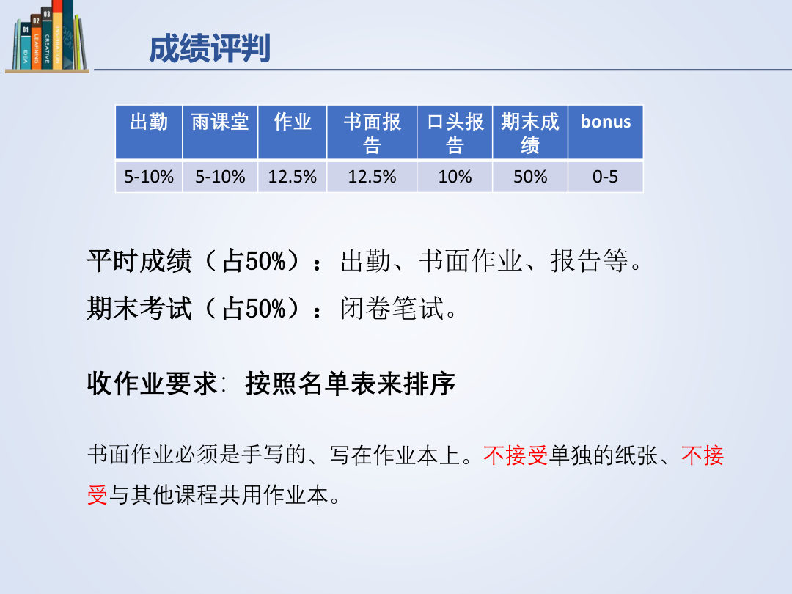

### 本页文字

```text
成绩评判

  出勤 雨课堂 作业  书面报 口头报 期末成  bonus
              告   告   绩

    5-10%  5-10%  12.5%   12.5%    10%    50%     0-5

平时成绩（占50%）：出勤、书面作业、报告等。

期末考试（占50%）：闭卷笔试。

收作业要求：按照名单表来排序

书面作业必须是手写的、写在作业本上。不接受单独的纸张、不接

受与其他课程共用作业本。
```

## 第 3 页

**页面标题/首行：** 《光电测试技术》（第3版）范志刚等

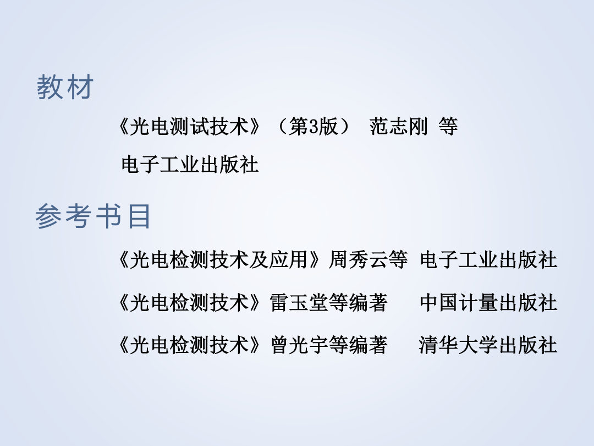

### 本页文字

```text
教材

    《光电测试技术》（第3版）范志刚等

    电子工业出版社

参考书目

    《光电检测技术及应用》周秀云等电子工业出版社

    《光电检测技术》雷玉堂等编著  中国计量出版社

    《光电检测技术》曾光宇等编著  清华大学出版社
```

## 第 4 页

**页面标题/首行：** 《激光光电检测》  吕海宝 国防科技大学出版社

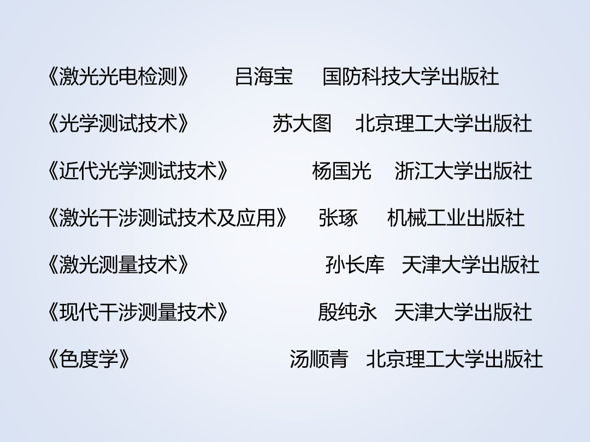

### 本页文字

```text
《激光光电检测》  吕海宝 国防科技大学出版社

《光学测试技术》    苏大图 北京理工大学出版社

《近代光学测试技术》    杨国光 浙江大学出版社

《激光干涉测试技术及应用》 张琢 机械工业出版社

《激光测量技术》       孙长库 天津大学出版社

《现代干涉测量技术》    殷纯永 天津大学出版社

《色度学》        汤顺青 北京理工大学出版社
```

## 第 5 页

**页面标题/首行：** 课程框架

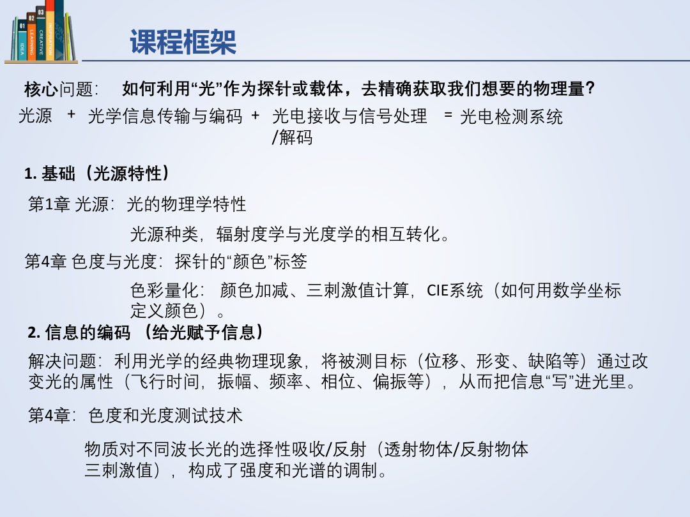

### 本页文字

```text
课程框架

核心问题：如何利用“光”作为探针或载体，去精确获取我们想要的物理量？
光源  + 光学信息传输与编码 + 光电接收与信号处理  = 光电检测系统
                  /解码

 1. 基础（光源特性）

 第1章光源：光的物理学特性

      光源种类，辐射度学与光度学的相互转化。

第4章色度与光度：探针的“颜色”标签

       色彩量化：颜色加减、三刺激值计算，CIE系统（如何用数学坐标
      定义颜色）。
 2. 信息的编码（给光赋予信息）

 解决问题：利用光学的经典物理现象，将被测目标（位移、形变、缺陷等）通过改
 变光的属性（飞行时间，振幅、频率、相位、偏振等），从而把信息“写”进光里。

 第4章：色度和光度测试技术

    物质对不同波长光的选择性吸收/反射（透射物体/反射物体
    三刺激值），构成了强度和光谱的调制。
```

## 第 6 页

**页面标题/首行：** 课程框架

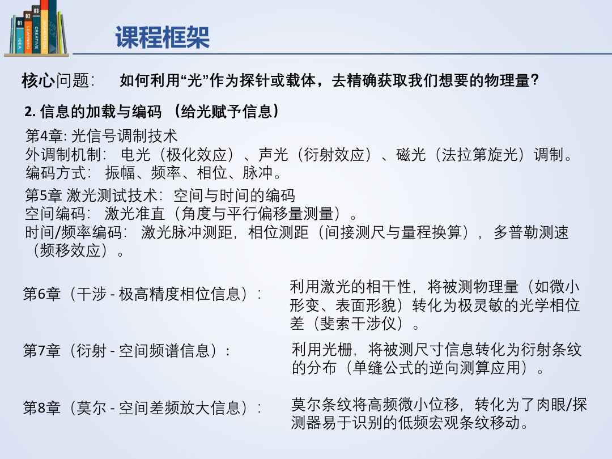

### 本页文字

```text
课程框架

核心问题： 如何利用“光”作为探针或载体，去精确获取我们想要的物理量？

 2. 信息的加载与编码（给光赋予信息）
第4章: 光信号调制技术
外调制机制：电光（极化效应）、声光（衍射效应）、磁光（法拉第旋光）调制。
编码方式：振幅、频率、相位、脉冲。
第5章激光测试技术：空间与时间的编码
空间编码：激光准直（角度与平行偏移量测量）。
时间/频率编码：激光脉冲测距，相位测距（间接测尺与量程换算），多普勒测速
（频移效应）。

                  利用激光的相干性，将被测物理量（如微小第6章（干涉- 极高精度相位信息）：
                  形变、表面形貌）转化为极灵敏的光学相位
                  差（斐索干涉仪）。

第7章（衍射- 空间频谱信息）:    利用光栅，将被测尺寸信息转化为衍射条纹
                  的分布（单缝公式的逆向测算应用）。

                  莫尔条纹将高频微小位移，转化为了肉眼/探第8章（莫尔- 空间差频放大信息）：
                  测器易于识别的低频宏观条纹移动。
```

## 第 7 页

**页面标题/首行：** 课程框架

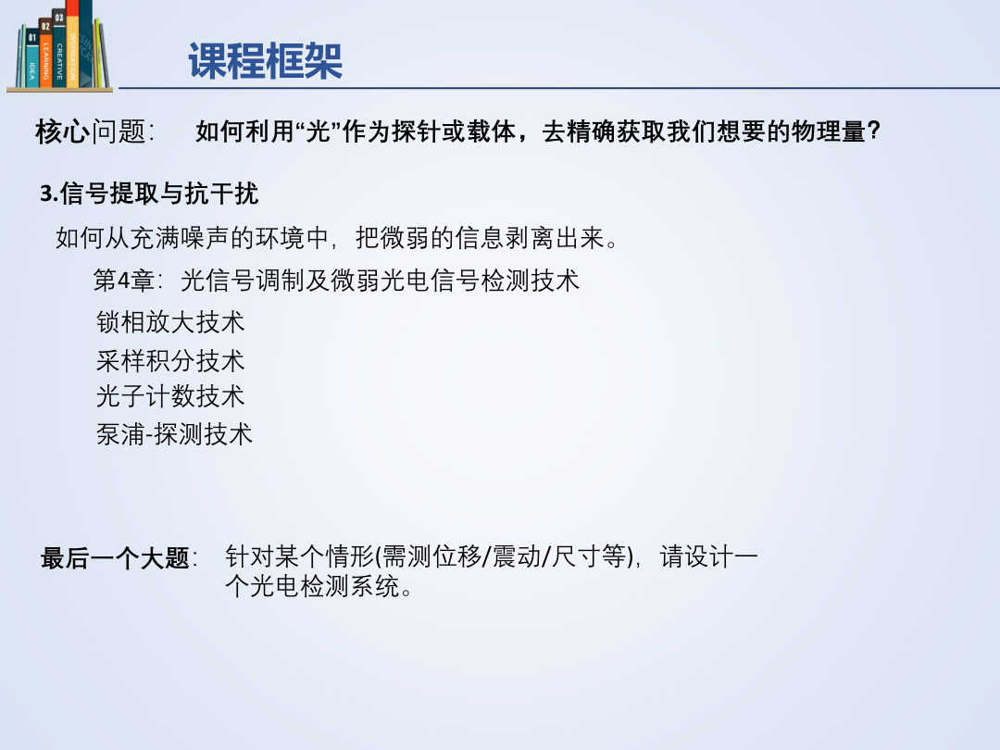

### 本页文字

```text
课程框架

核心问题： 如何利用“光”作为探针或载体，去精确获取我们想要的物理量？

3.信号提取与抗干扰

 如何从充满噪声的环境中，把微弱的信息剥离出来。

  第4章：光信号调制及微弱光电信号检测技术

  锁相放大技术
  采样积分技术
  光子计数技术
   泵浦-探测技术

最后一个大题：针对某个情形(需测位移/震动/尺寸等)，请设计一
        个光电检测系统。
```

## 第 8 页

**页面标题/首行：** 学习本课程的目的

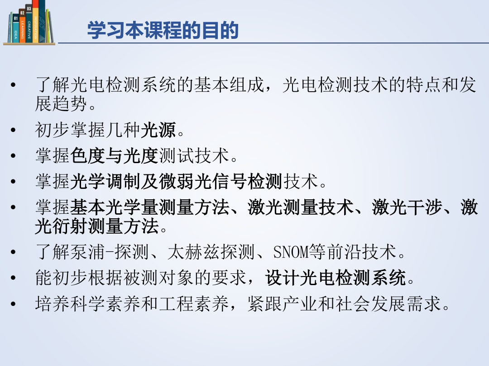

### 本页文字

```text
学习本课程的目的

• 了解光电检测系统的基本组成，光电检测技术的特点和发
 展趋势。
• 初步掌握几种光源。
• 掌握色度与光度测试技术。
• 掌握光学调制及微弱光信号检测技术。
• 掌握基本光学量测量方法、激光测量技术、激光干涉、激
 光衍射测量方法。
• 了解泵浦-探测、太赫兹探测、SNOM等前沿技术。
• 能初步根据被测对象的要求，设计光电检测系统。
• 培养科学素养和工程素养，紧跟产业和社会发展需求。
```

## 第 9 页

**页面标题/首行：** 光电信息技术

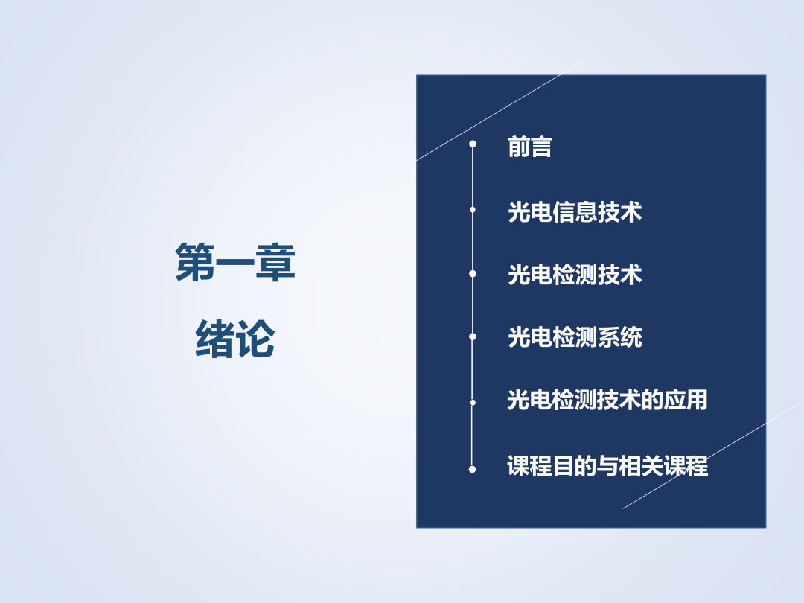

### 本页文字

```text
前言

               光电信息技术
第一章          光电检测技术

               光电检测系统 绪论

               光电检测技术的应用

               课程目的与相关课程
```

## 第 10 页

**页面标题/首行：** 导论课-光电行业分类

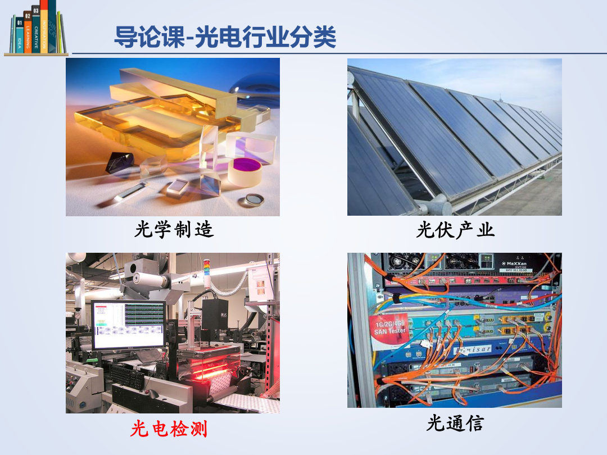

### 本页文字

```text
导论课-光电行业分类

 光学制造          光伏产业

               光通信 光电检测
```

## 第 11 页

**页面标题/首行：** 光电显示         光谱分析

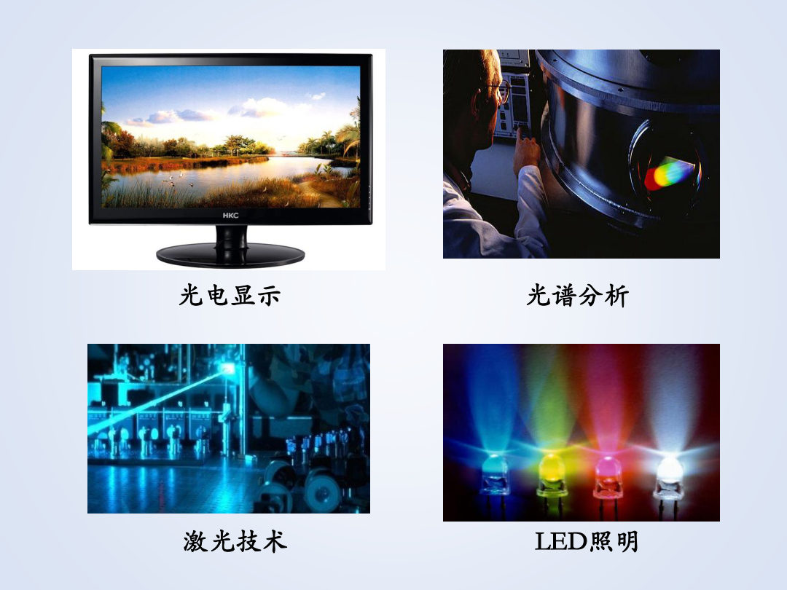

### 本页文字

```text
光电显示         光谱分析

激光技术            LED照明
```

## 第 12 页

**页面标题/首行：** 激光制导

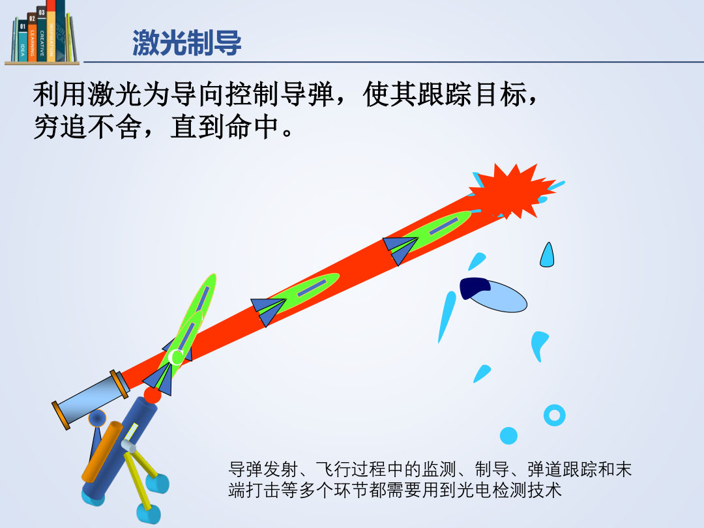

### 本页文字

```text
激光制导

利用激光为导向控制导弹，使其跟踪目标，
穷追不舍，直到命中。

         C

           导弹发射、飞行过程中的监测、制导、弹道跟踪和末
           端打击等多个环节都需要用到光电检测技术
```

## 第 13 页

**页面标题/首行：** 隐身战机侦测

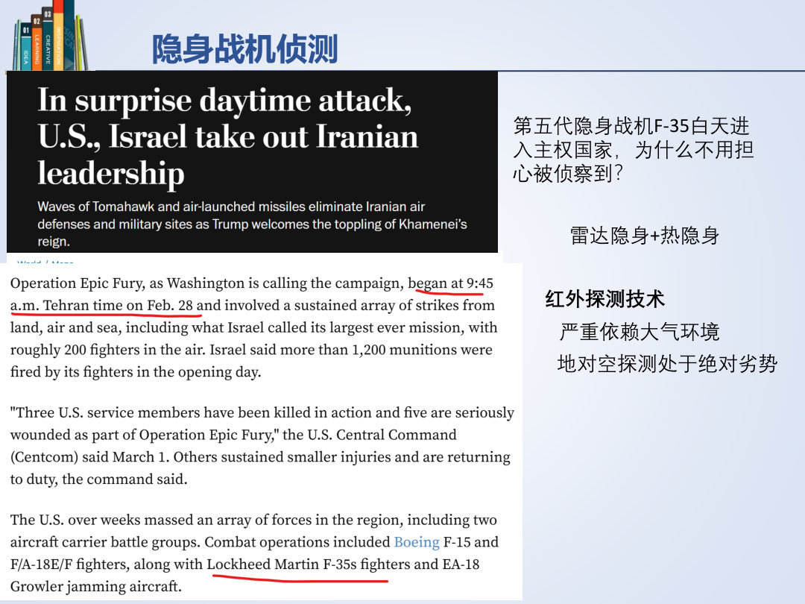

### 本页文字

```text
隐身战机侦测

                     第五代隐身战机F-35白天进
                  入主权国家，为什么不用担
                  心被侦察到？

                      雷达隐身+热隐身

                    红外探测技术

                    严重依赖大气环境

                    地对空探测处于绝对劣势
```

## 第 14 页

**页面标题/首行：** 引力波探测

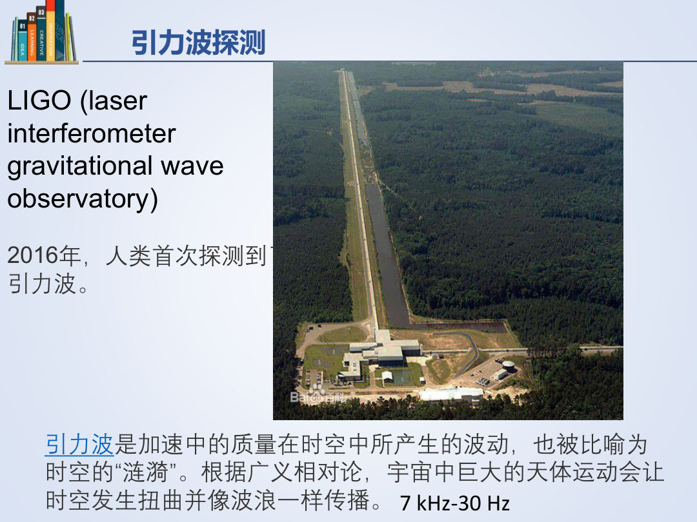

### 本页文字

```text
引力波探测

LIGO (laser
interferometer
gravitational wave
observatory)

2016年，人类首次探测到了
引力波。

  引力波是加速中的质量在时空中所产生的波动，也被比喻为
  时空的“涟漪”。根据广义相对论，宇宙中巨大的天体运动会让
  时空发生扭曲并像波浪一样传播。7 kHz-30 Hz
```

## 第 15 页

**页面标题/首行：** 第 15 页


### 本页文字

> 本页未检测到可提取文本，请以页面截图为准。

## 第 16 页

**页面标题/首行：** 引力波探测

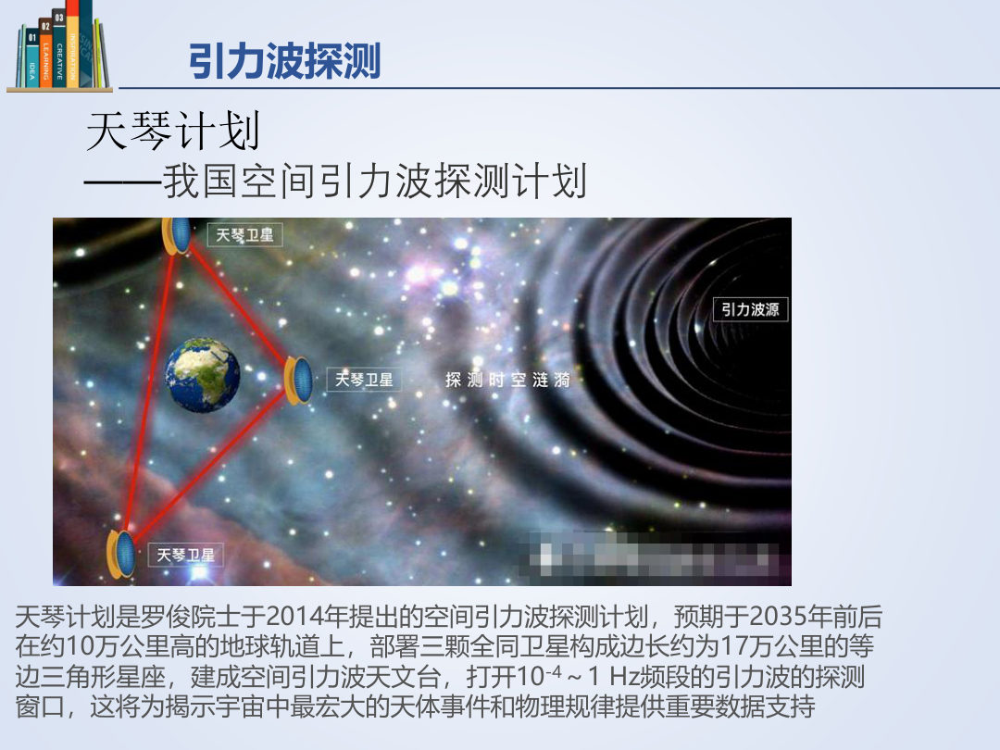

### 本页文字

```text
引力波探测

  天琴计划
  ——我国空间引力波探测计划

天琴计划是罗俊院士于2014年提出的空间引力波探测计划，预期于2035年前后
在约10万公里高的地球轨道上，部署三颗全同卫星构成边长约为17万公里的等
边三角形星座，建成空间引力波天文台，打开10-4～1 Hz频段的引力波的探测
窗口，这将为揭示宇宙中最宏大的天体事件和物理规律提供重要数据支持
```

## 第 17 页

**页面标题/首行：** 自相关法(Autocorrelation)测量超短脉冲

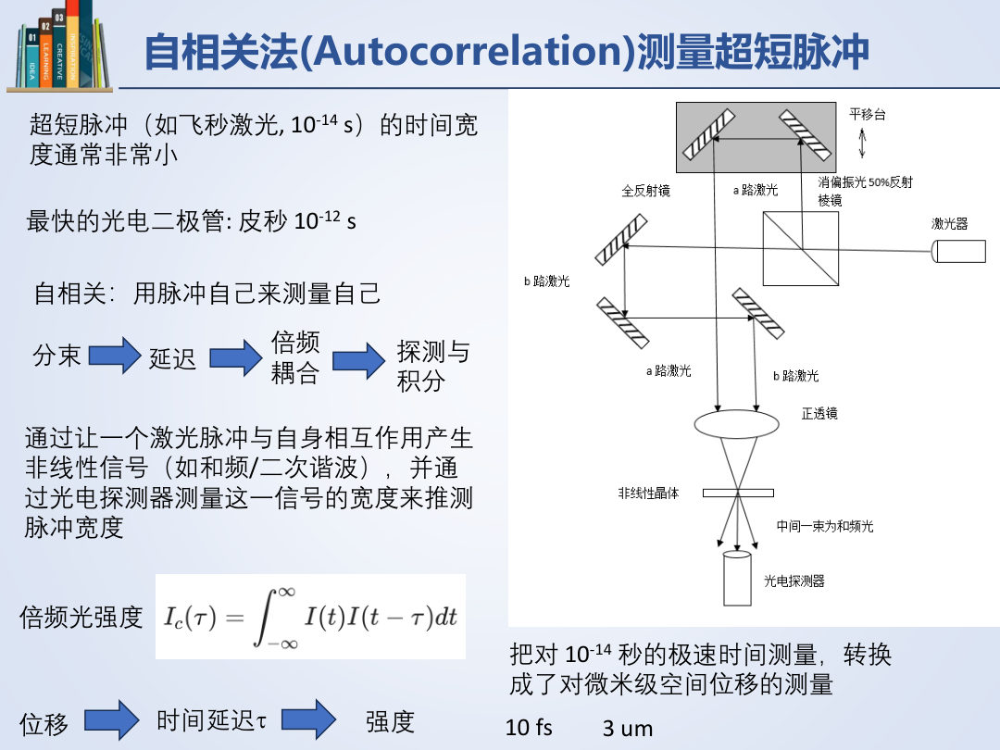

### 本页文字

```text
自相关法(Autocorrelation)测量超短脉冲

超短脉冲（如飞秒激光, 10-14 s）的时间宽
度通常非常小

最快的光电二极管: 皮秒10-12 s

 自相关：用脉冲自己来测量自己

          倍频 分束   延迟        探测与
          耦合               积分

通过让一个激光脉冲与自身相互作用产生
非线性信号（如和频/二次谐波），并通
过光电探测器测量这一信号的宽度来推测
脉冲宽度

倍频光强度
                                 把对10-14 秒的极速时间测量，转换
                    成了对微米级空间位移的测量
      时间延迟    强度位移                                      10 fs    3 um
```

## 第 18 页

**页面标题/首行：** 智能手表

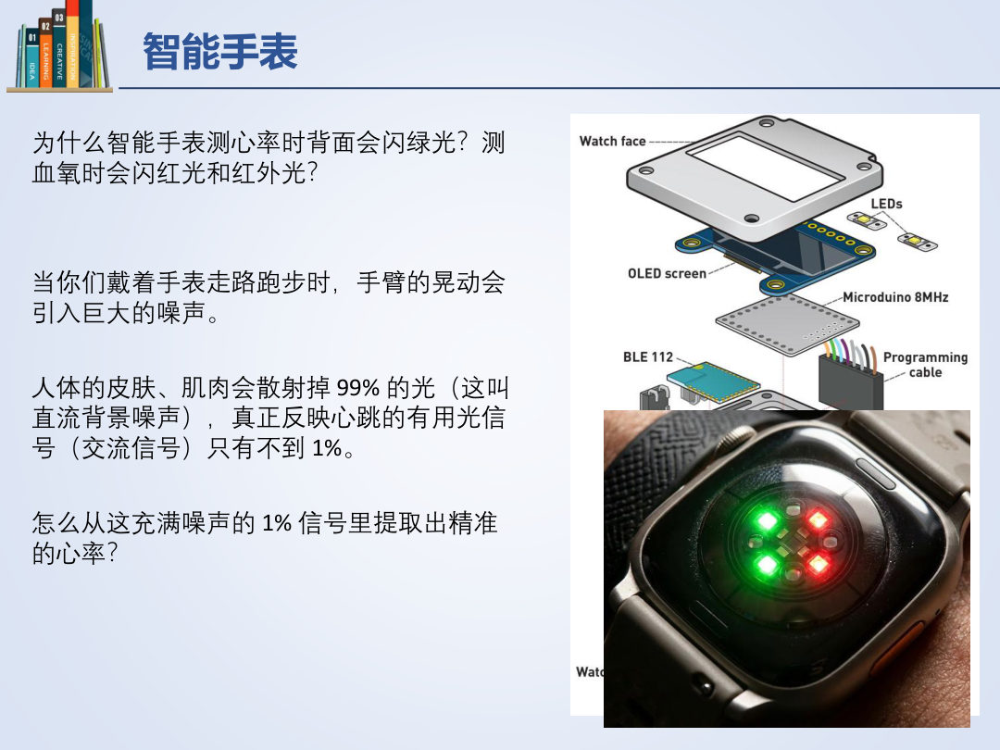

### 本页文字

```text
智能手表

为什么智能手表测心率时背面会闪绿光？测
血氧时会闪红光和红外光？

当你们戴着手表走路跑步时，手臂的晃动会
引入巨大的噪声。

人体的皮肤、肌肉会散射掉99% 的光（这叫
直流背景噪声），真正反映心跳的有用光信
号（交流信号）只有不到1%。

怎么从这充满噪声的1% 信号里提取出精准
的心率？
```

## 第 19 页

**页面标题/首行：** 光电检测是信息时代的关键技术

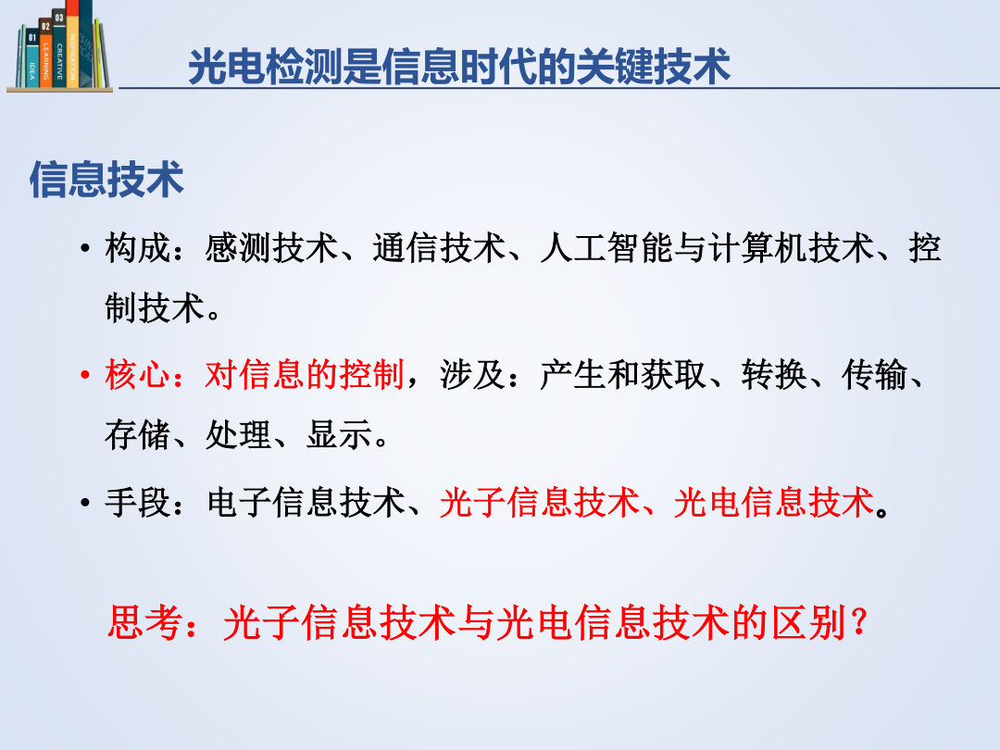

### 本页文字

```text
光电检测是信息时代的关键技术

信息技术

    • 构成：感测技术、通信技术、人工智能与计算机技术、控

  制技术。

    • 核心：对信息的控制，涉及：产生和获取、转换、传输、

  存储、处理、显示。

    • 手段：电子信息技术、光子信息技术、光电信息技术。

  思考：光子信息技术与光电信息技术的区别？
```

## 第 20 页

**页面标题/首行：** 思考：光子信息技术与光电信息技术的区别？

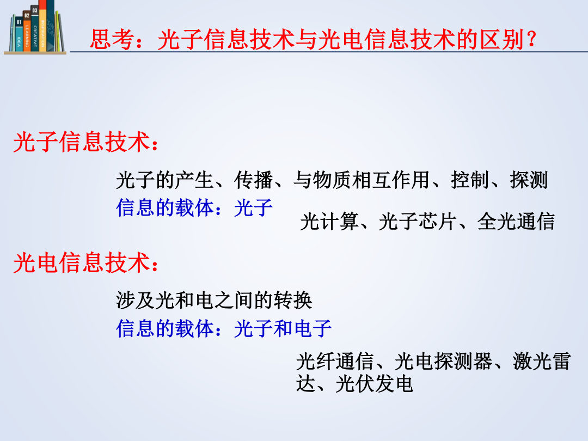

### 本页文字

```text
思考：光子信息技术与光电信息技术的区别？

光子信息技术：

     光子的产生、传播、与物质相互作用、控制、探测
     信息的载体：光子
               光计算、光子芯片、全光通信

光电信息技术：

     涉及光和电之间的转换
     信息的载体：光子和电子

              光纤通信、光电探测器、激光雷
              达、光伏发电
```

## 第 21 页

**页面标题/首行：** 光电信息技术

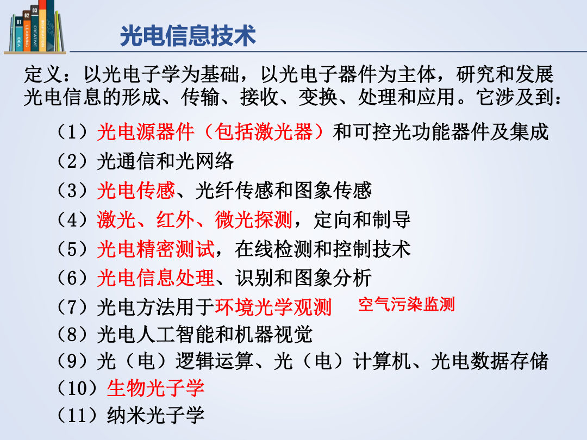

### 本页文字

```text
光电信息技术

定义：以光电子学为基础，以光电子器件为主体，研究和发展
光电信息的形成、传输、接收、变换、处理和应用。它涉及到：

 （1）光电源器件（包括激光器）和可控光功能器件及集成
 （2）光通信和光网络
 （3）光电传感、光纤传感和图象传感
 （4）激光、红外、微光探测，定向和制导
 （5）光电精密测试，在线检测和控制技术
 （6）光电信息处理、识别和图象分析
 （7）光电方法用于环境光学观测  空气污染监测
 （8）光电人工智能和机器视觉
 （9）光（电）逻辑运算、光（电）计算机、光电数据存储
 （10）生物光子学
 （11）纳米光子学
```

## 第 22 页

**页面标题/首行：** 检测的基本概念

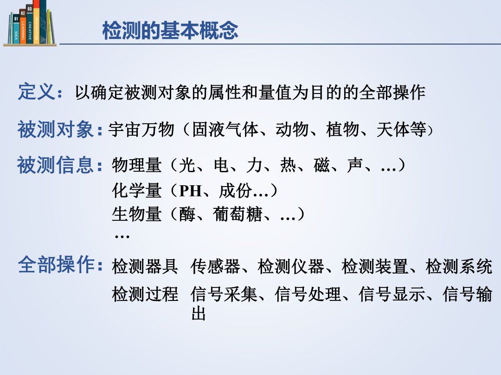

### 本页文字

```text
检测的基本概念

定义：以确定被测对象的属性和量值为目的的全部操作

被测对象：宇宙万物（固液气体、动物、植物、天体等）

被测信息：物理量（光、电、力、热、磁、声、…）
      化学量（PH、成份…）
      生物量（酶、葡萄糖、…）
      …

全部操作：检测器具 传感器、检测仪器、检测装置、检测系统

      检测过程 信号采集、信号处理、信号显示、信号输
          出
```

## 第 23 页

**页面标题/首行：** 测量分类

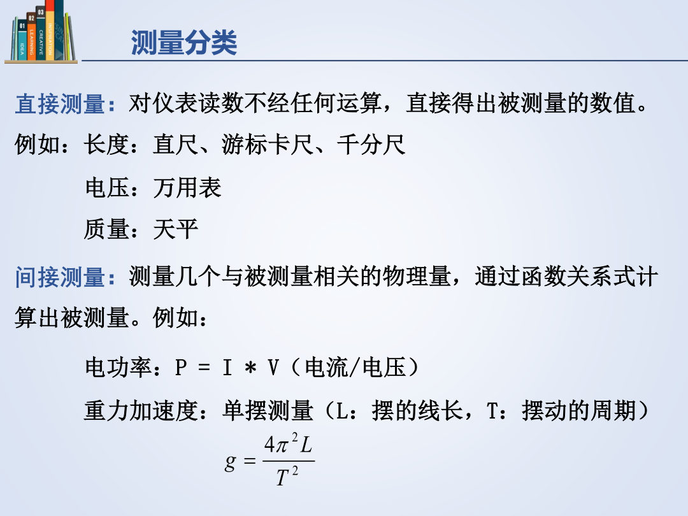

### 本页文字

```text
测量分类

直接测量：对仪表读数不经任何运算，直接得出被测量的数值。

例如：长度：直尺、游标卡尺、千分尺

   电压：万用表

   质量：天平

间接测量：测量几个与被测量相关的物理量，通过函数关系式计

算出被测量。例如：

   电功率：P = I * V（电流/电压）

   重力加速度：单摆测量（L：摆的线长，T：摆动的周期）
                       42 L
                    g =
                      T 2
```

## 第 24 页

**页面标题/首行：** 光电检测技术

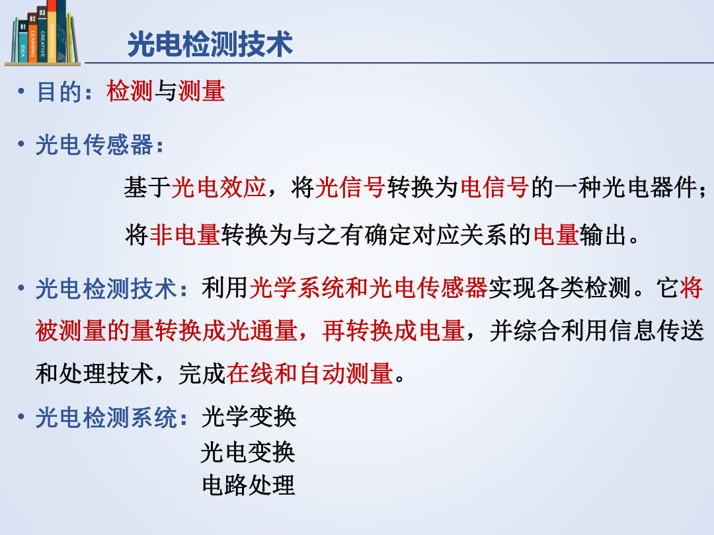

### 本页文字

```text
光电检测技术

• 目的：检测与测量

• 光电传感器：

    基于光电效应，将光信号转换为电信号的一种光电器件；

     将非电量转换为与之有确定对应关系的电量输出。

• 光电检测技术：利用光学系统和光电传感器实现各类检测。它将

 被测量的量转换成光通量，再转换成电量，并综合利用信息传送

 和处理技术，完成在线和自动测量。

• 光电检测系统：光学变换
        光电变换
        电路处理
```

## 第 25 页

**页面标题/首行：** 光电探测器的种类

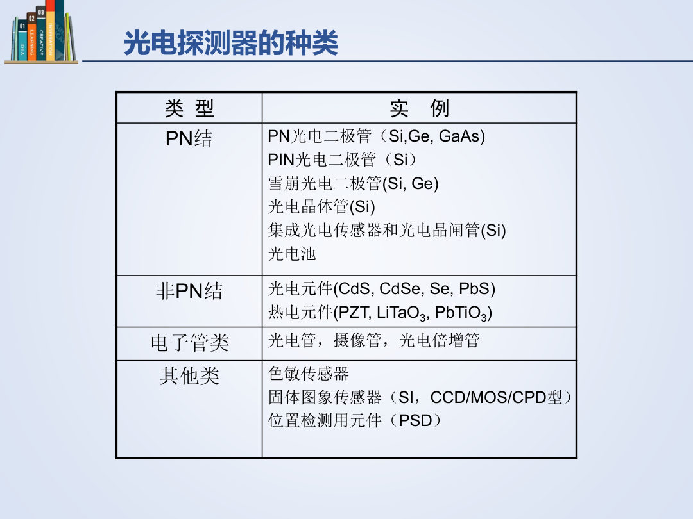

### 本页文字

```text
光电探测器的种类

  类型         实 例
   PN结     PN光电二极管（Si,Ge, GaAs)
           PIN光电二极管（Si）
           雪崩光电二极管(Si, Ge)
            光电晶体管(Si)
          集成光电传感器和光电晶闸管(Si)
         光电池

  非PN结    光电元件(CdS, CdSe, Se, PbS)
            热电元件(PZT, LiTaO3, PbTiO3)
 电子管类  光电管，摄像管，光电倍增管

  其他类   色敏传感器
           固体图象传感器（SI，CCD/MOS/CPD型）
          位置检测用元件（PSD）
```

## 第 26 页

**页面标题/首行：** 光电检测系统

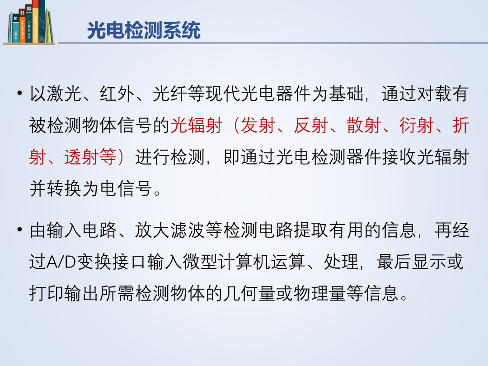

### 本页文字

```text
光电检测系统

• 以激光、红外、光纤等现代光电器件为基础，通过对载有

 被检测物体信号的光辐射（发射、反射、散射、衍射、折

 射、透射等）进行检测，即通过光电检测器件接收光辐射

 并转换为电信号。

• 由输入电路、放大滤波等检测电路提取有用的信息，再经

 过A/D变换接口输入微型计算机运算、处理，最后显示或

 打印输出所需检测物体的几何量或物理量等信息。
```

## 第 27 页

**页面标题/首行：** 光电检测系统

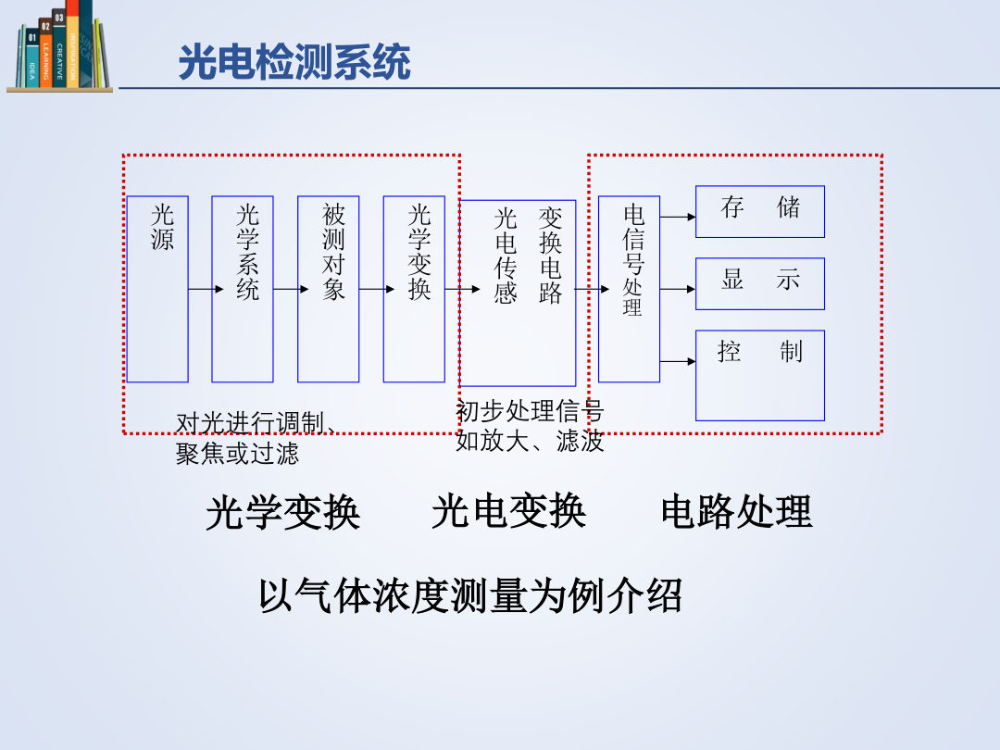

### 本页文字

```text
光电检测系统

                       存 储光  光  被  光  光 变  电
源  学  测  学  电 换  信
   系  对  变  传 电  号                       显 示   统  象  换  感 路   处
                       理

                       控  制

            初步处理信号 对光进行调制、
            如放大、滤波 聚焦或过滤

 光学变换  光电变换  电路处理

   以气体浓度测量为例介绍
```

## 第 28 页

**页面标题/首行：** 光电检测系统的组成

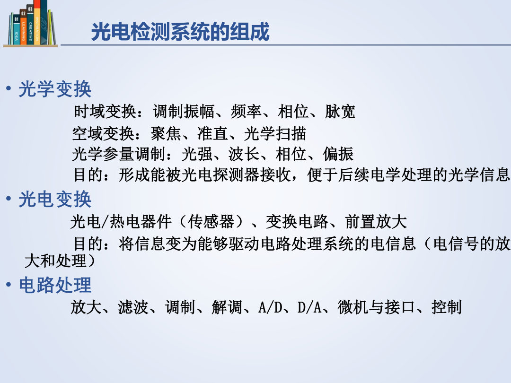

### 本页文字

```text
光电检测系统的组成

• 光学变换
    时域变换：调制振幅、频率、相位、脉宽
    空域变换：聚焦、准直、光学扫描
    光学参量调制：光强、波长、相位、偏振
    目的：形成能被光电探测器接收，便于后续电学处理的光学信息
• 光电变换
    光电/热电器件（传感器）、变换电路、前置放大
    目的：将信息变为能够驱动电路处理系统的电信息（电信号的放
 大和处理）
• 电路处理
     放大、滤波、调制、解调、A/D、D/A、微机与接口、控制
```

## 第 29 页

**页面标题/首行：** 光电检测系统

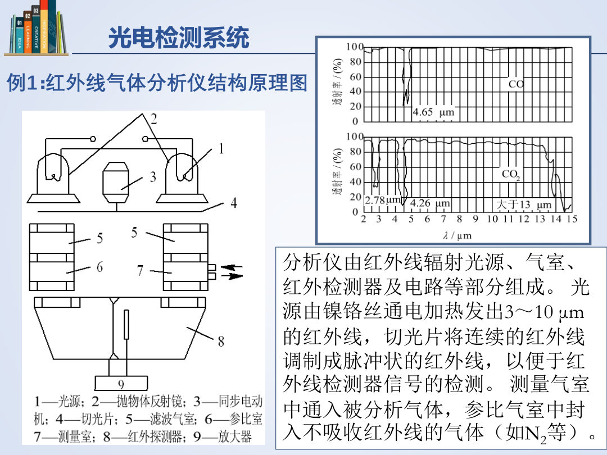

### 本页文字

```text
光电检测系统

例1：红外线气体分析仪结构原理图

              分析仪由红外线辐射光源、气室、
             红外检测器及电路等部分组成。光
               源由镍铬丝通电加热发出3～10 μm
              的红外线，切光片将连续的红外线
              调制成脉冲状的红外线，以便于红
             外线检测器信号的检测。测量气室
              中通入被分析气体，参比气室中封
              入不吸收红外线的气体（如N2等）。
```

## 第 30 页

**页面标题/首行：** 光电检测系统

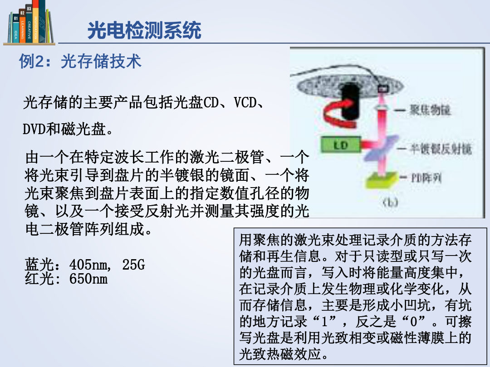

### 本页文字

```text
光电检测系统

例2：光存储技术

光存储的主要产品包括光盘CD、VCD、

DVD和磁光盘。

由一个在特定波长工作的激光二极管、一个
将光束引导到盘片的半镀银的镜面、一个将
光束聚焦到盘片表面上的指定数值孔径的物
镜、以及一个接受反射光并测量其强度的光
电二极管阵列组成。
                用聚焦的激光束处理记录介质的方法存
                储和再生信息。对于只读型或只写一次
 蓝光：405nm, 25G
                的光盘而言，写入时将能量高度集中，红光: 650nm
                在记录介质上发生物理或化学变化，从
                而存储信息，主要是形成小凹坑，有坑
                 的地方记录“1”，反之是“0”。可擦
                写光盘是利用光致相变或磁性薄膜上的
                光致热磁效应。
```

## 第 31 页

**页面标题/首行：** 光电检测系统

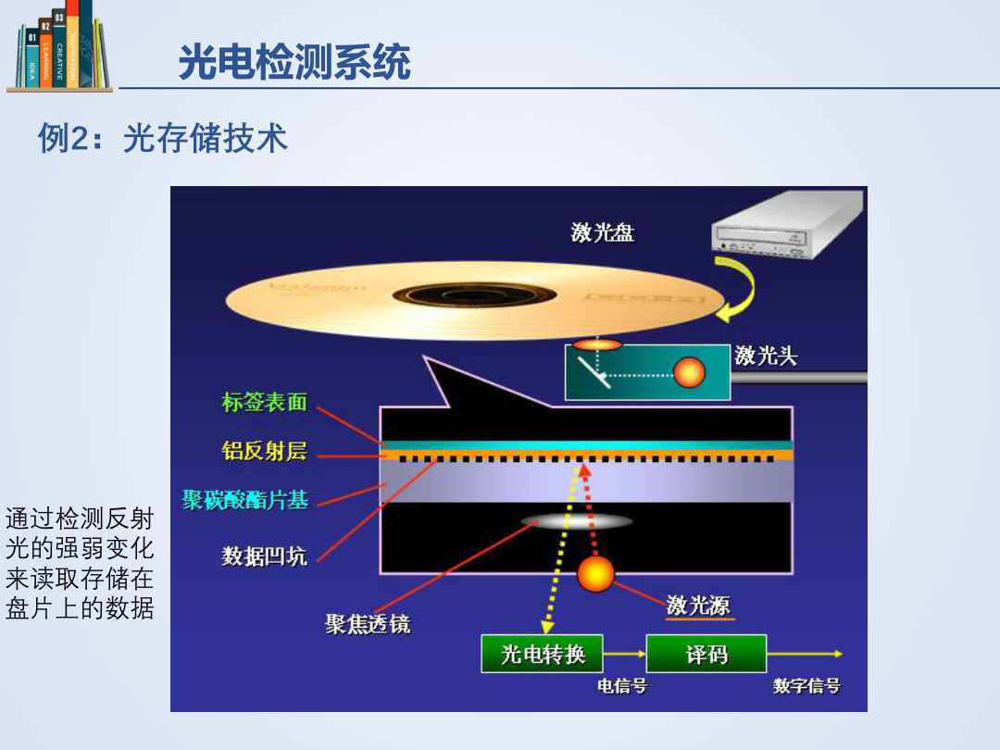

### 本页文字

```text
光电检测系统

 例2：光存储技术

通过检测反射
光的强弱变化
来读取存储在
盘片上的数据
```

## 第 32 页

**页面标题/首行：** 光电检测系统

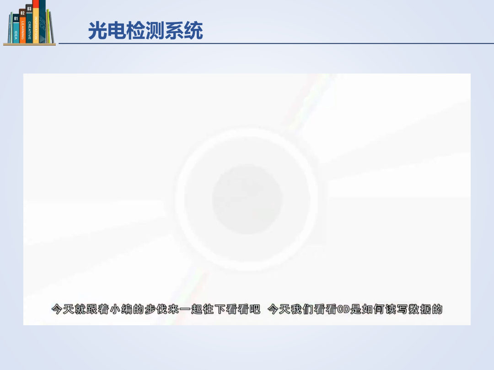

### 本页文字

```text
光电检测系统
```

## 第 33 页

**页面标题/首行：** 光电检测系统

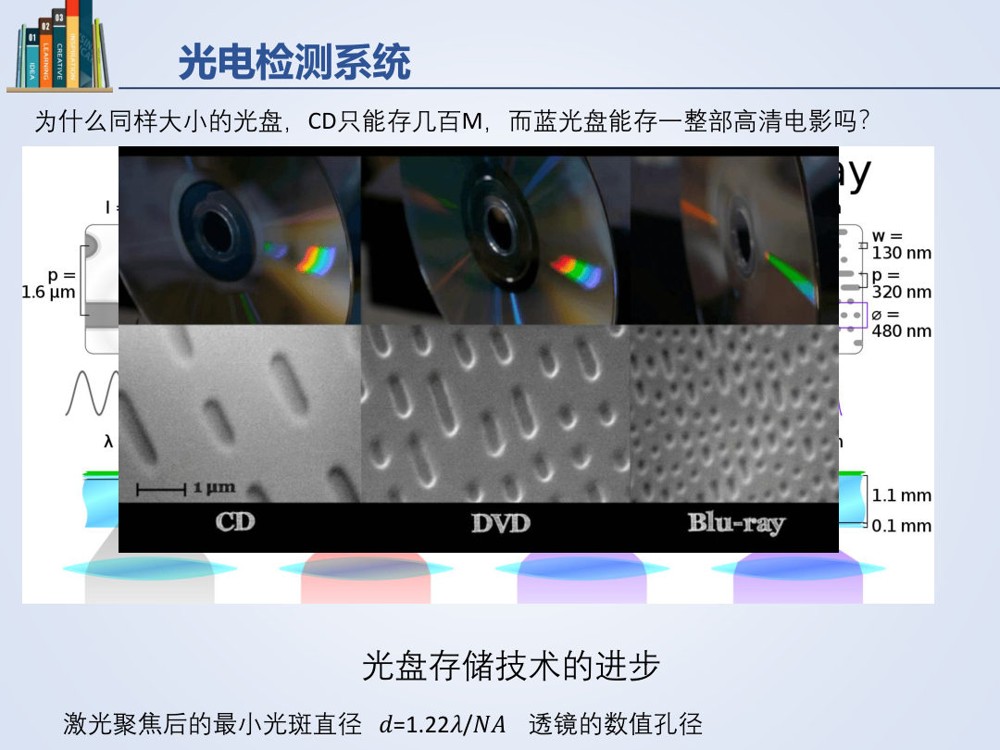

### 本页文字

```text
光电检测系统

为什么同样大小的光盘，CD只能存几百M，而蓝光盘能存一整部高清电影吗？

          光盘存储技术的进步

 激光聚焦后的最小光斑直径𝑑=1.22𝜆/𝑁𝐴 透镜的数值孔径
```

## 第 34 页

**页面标题/首行：** 光电检测系统与人操作功能比较

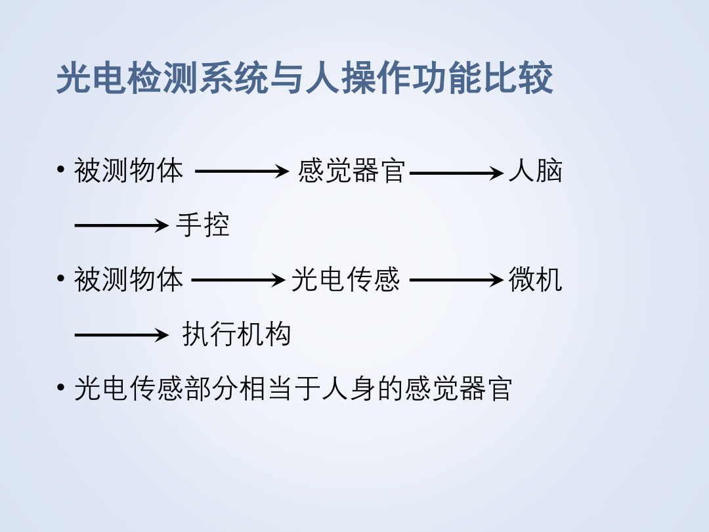

### 本页文字

```text
光电检测系统与人操作功能比较

• 被测物体    感觉器官    人脑

    手控

• 被测物体    光电传感    微机

     执行机构

• 光电传感部分相当于人身的感觉器官
```

## 第 35 页

**页面标题/首行：** 光电检测系统的分类

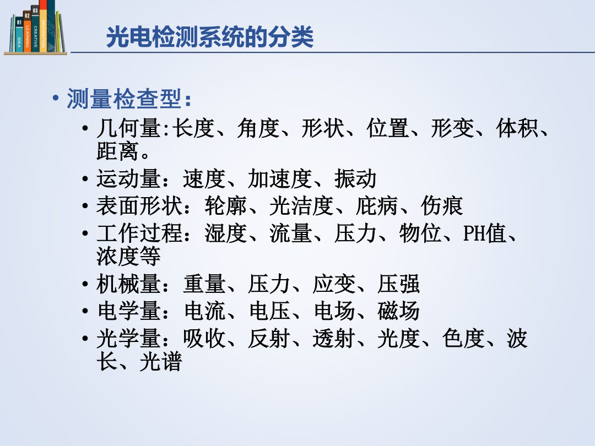

### 本页文字

```text
光电检测系统的分类

• 测量检查型：
    • 几何量:长度、角度、形状、位置、形变、体积、
  距离。
    • 运动量：速度、加速度、振动
    • 表面形状：轮廓、光洁度、庇病、伤痕
    • 工作过程：湿度、流量、压力、物位、PH值、
  浓度等
    • 机械量：重量、压力、应变、压强
    • 电学量：电流、电压、电场、磁场
    • 光学量：吸收、反射、透射、光度、色度、波
  长、光谱
```

## 第 36 页

**页面标题/首行：** 光电检测系统的分类

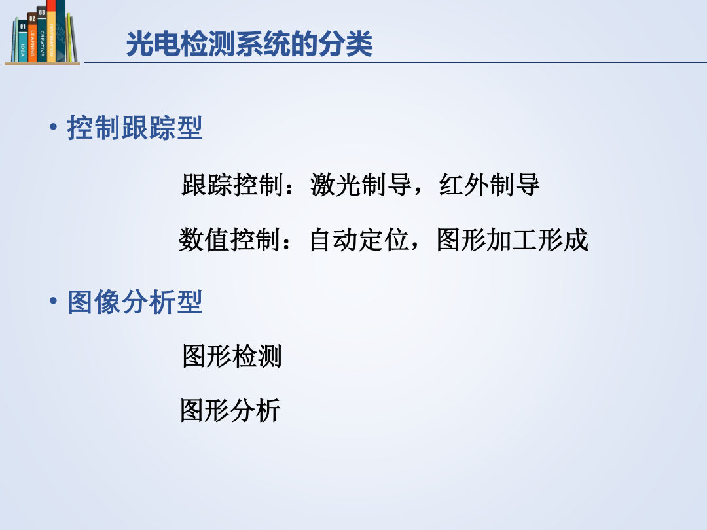

### 本页文字

```text
光电检测系统的分类

• 控制跟踪型

     跟踪控制：激光制导，红外制导

     数值控制：自动定位，图形加工形成

• 图像分析型

     图形检测

     图形分析
```

## 第 37 页

**页面标题/首行：** 光电检测技术的特点

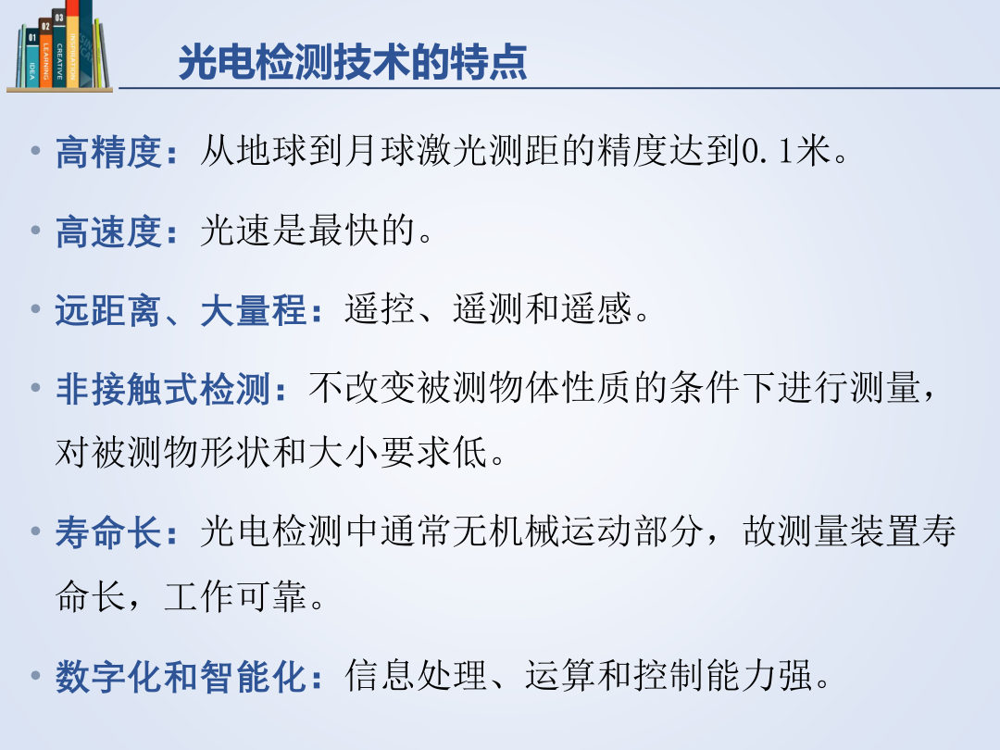

### 本页文字

```text
光电检测技术的特点

• 高精度：从地球到月球激光测距的精度达到0.1米。

• 高速度：光速是最快的。

• 远距离、大量程：遥控、遥测和遥感。

• 非接触式检测：不改变被测物体性质的条件下进行测量，

 对被测物形状和大小要求低。

• 寿命长：光电检测中通常无机械运动部分，故测量装置寿

 命长，工作可靠。

• 数字化和智能化：信息处理、运算和控制能力强。
```

## 第 38 页

**页面标题/首行：** 多选题 1分

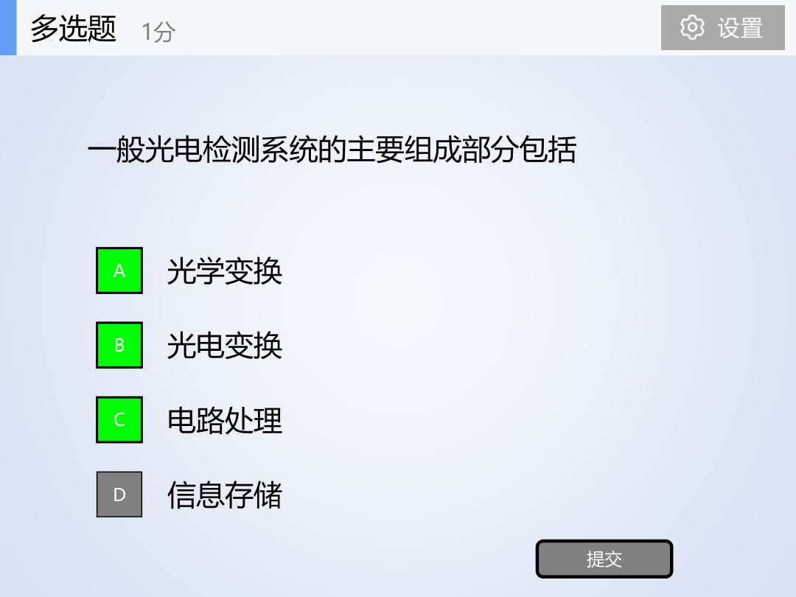

### 本页文字

```text
多选题 1分

  一般光电检测系统的主要组成部分包括

       A     光学变换

        B     光电变换

       C     电路处理

      D     信息存储

                                提交
```

## 第 39 页

**页面标题/首行：** 光电检测技术的应用

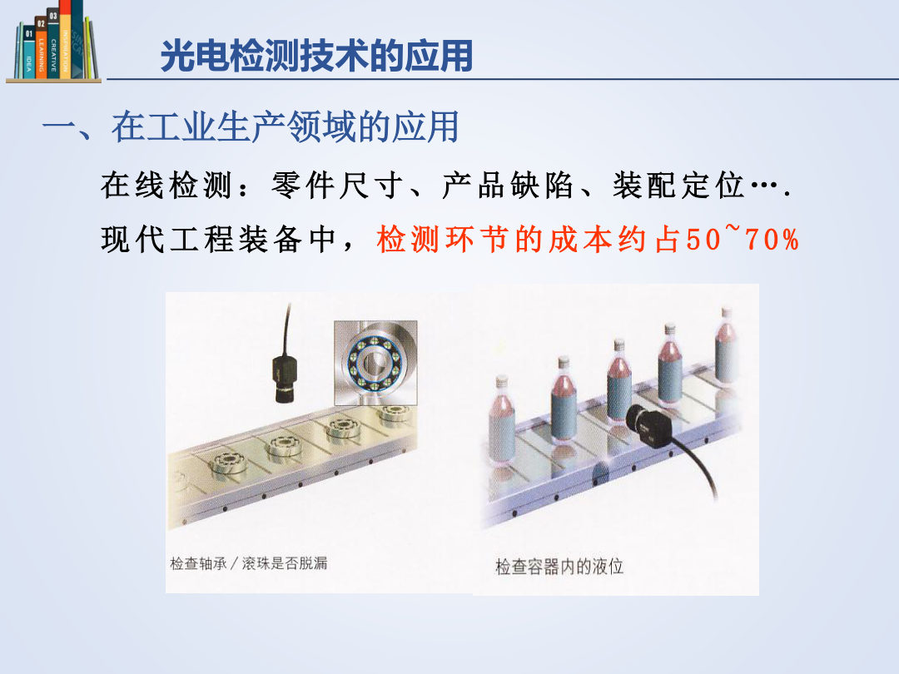

### 本页文字

```text
光电检测技术的应用

一、在工业生产领域的应用

  在线检测：零件尺寸、产品缺陷、装配定位….

  现代工程装备中，检测环节的成本约占50 ~70 %
```

## 第 40 页

**页面标题/首行：** 光电检测技术的应用

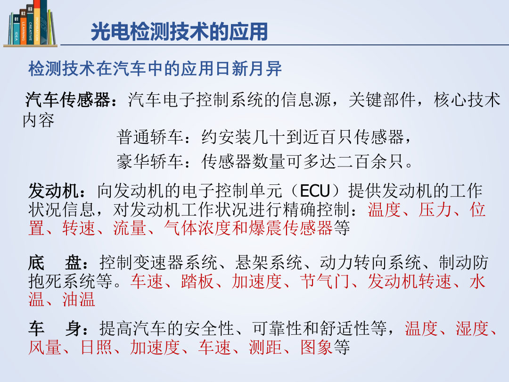

### 本页文字

```text
光电检测技术的应用

检测技术在汽车中的应用日新月异

汽车传感器：汽车电子控制系统的信息源，关键部件，核心技术
内容
      普通轿车：约安装几十到近百只传感器，
      豪华轿车：传感器数量可多达二百余只。
发动机：向发动机的电子控制单元（ECU）提供发动机的工作
状况信息，对发动机工作状况进行精确控制：温度、压力、位
置、转速、流量、气体浓度和爆震传感器等

底 盘：控制变速器系统、悬架系统、动力转向系统、制动防
抱死系统等。车速、踏板、加速度、节气门、发动机转速、水
温、油温

车 身：提高汽车的安全性、可靠性和舒适性等，温度、湿度、
风量、日照、加速度、车速、测距、图象等
```

## 第 41 页

**页面标题/首行：** 检测技术在油车和电车的差别？

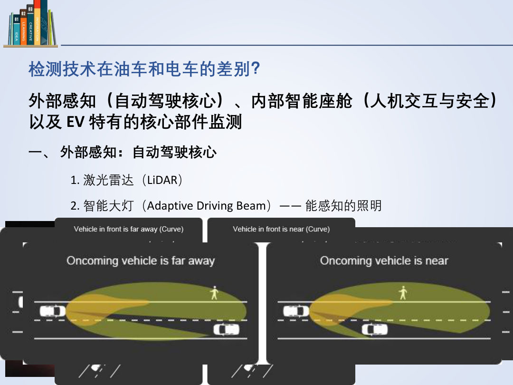

### 本页文字

```text
检测技术在油车和电车的差别？

外部感知（自动驾驶核心）、内部智能座舱（人机交互与安全）
以及EV 特有的核心部件监测

一、外部感知：自动驾驶核心

         1. 激光雷达（LiDAR）

         2. 智能大灯（Adaptive Driving Beam）—— 能感知的照明
```

## 第 42 页

**页面标题/首行：** 检测技术在油车和电车的差别？

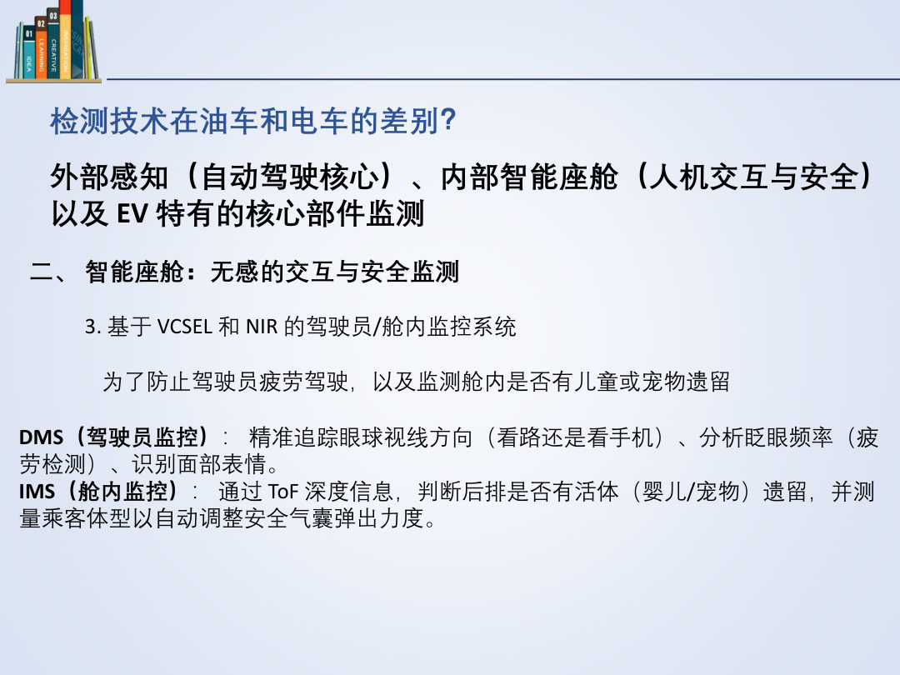

### 本页文字

```text
检测技术在油车和电车的差别？

 外部感知（自动驾驶核心）、内部智能座舱（人机交互与安全）
 以及EV 特有的核心部件监测

二、智能座舱：无感的交互与安全监测

        3. 基于VCSEL 和NIR 的驾驶员/舱内监控系统

    为了防止驾驶员疲劳驾驶，以及监测舱内是否有儿童或宠物遗留

DMS（驾驶员监控）：精准追踪眼球视线方向（看路还是看手机）、分析眨眼频率（疲
劳检测）、识别面部表情。
IMS（舱内监控）：通过ToF 深度信息，判断后排是否有活体（婴儿/宠物）遗留，并测
量乘客体型以自动调整安全气囊弹出力度。
```

## 第 43 页

**页面标题/首行：** 驾驶员监控（Driver Monitoring System

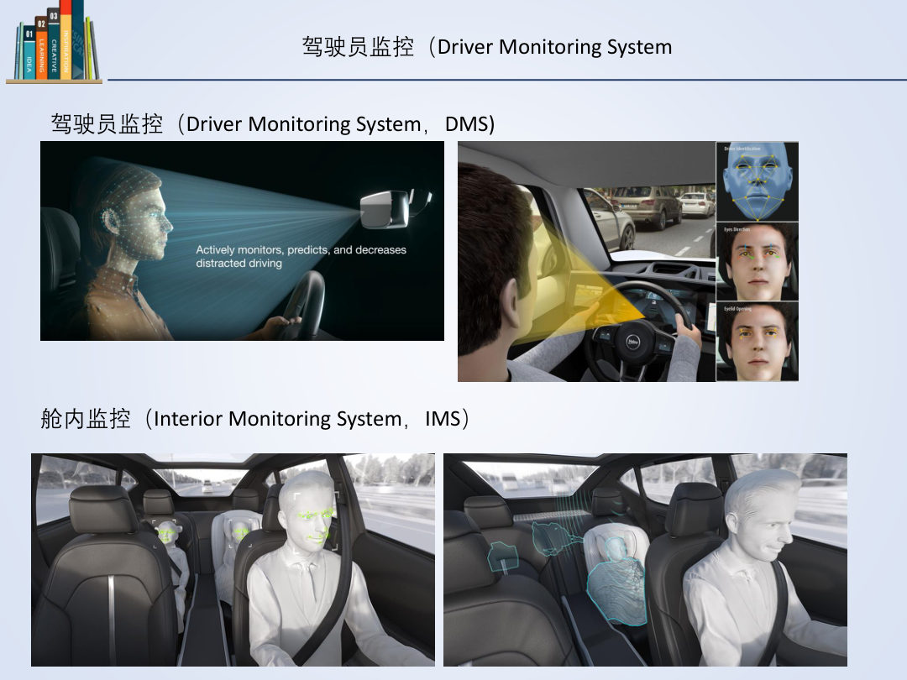

### 本页文字

```text
驾驶员监控（Driver Monitoring System

 驾驶员监控（Driver Monitoring System，DMS)

舱内监控（Interior Monitoring System，IMS）
```

## 第 44 页

**页面标题/首行：** 4. 增强现实抬头显示

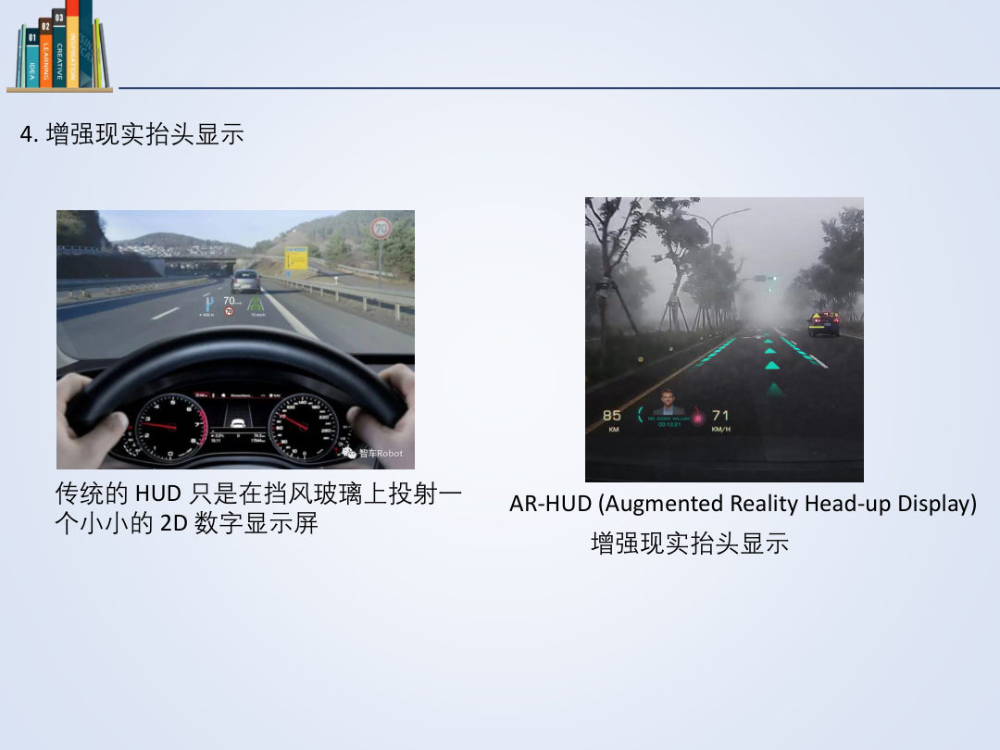

### 本页文字

```text
4. 增强现实抬头显示

  传统的HUD 只是在挡风玻璃上投射一                                    AR-HUD (Augmented Reality Head-up Display)
  个小小的2D 数字显示屏
                       增强现实抬头显示
```

## 第 45 页

**页面标题/首行：** 三、EV 特有的核心应用：电池神经系统

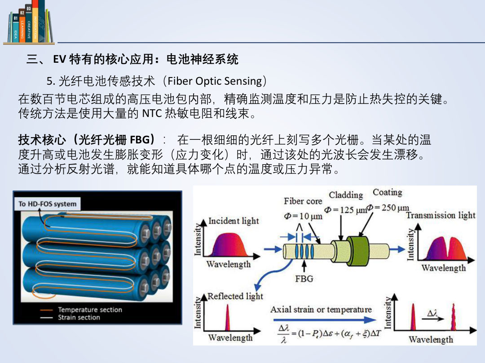

### 本页文字

```text
三、EV 特有的核心应用：电池神经系统

      5. 光纤电池传感技术（Fiber Optic Sensing）
在数百节电芯组成的高压电池包内部，精确监测温度和压力是防止热失控的关键。
传统方法是使用大量的NTC 热敏电阻和线束。

技术核心（光纤光栅FBG）：在一根细细的光纤上刻写多个光栅。当某处的温
度升高或电池发生膨胀变形（应力变化）时，通过该处的光波长会发生漂移。
通过分析反射光谱，就能知道具体哪个点的温度或压力异常。
```

## 第 46 页

**页面标题/首行：** 光电检测技术的应用

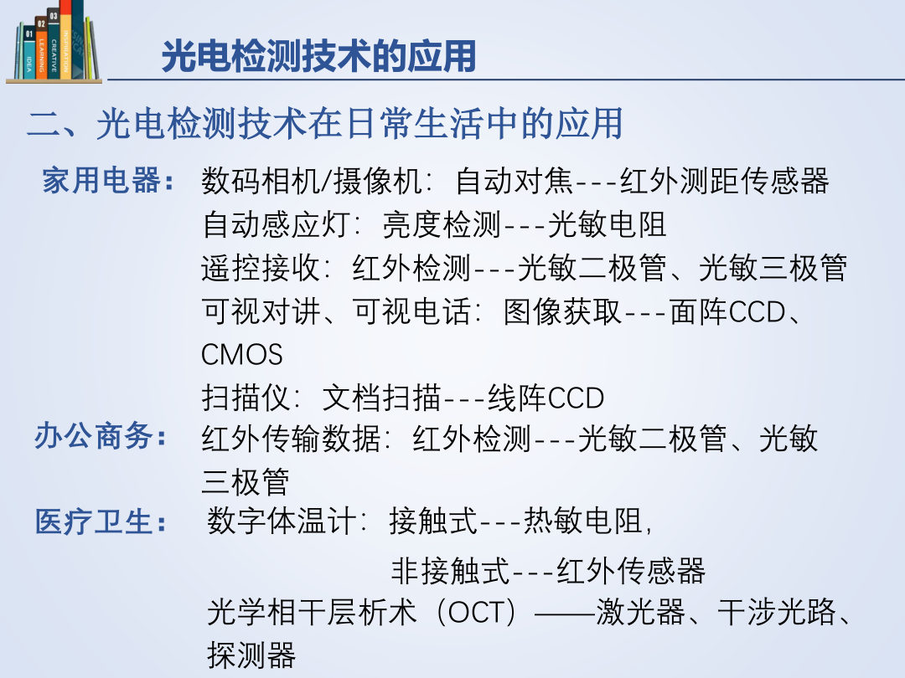

### 本页文字

```text
光电检测技术的应用

二、光电检测技术在日常生活中的应用

 家用电器：数码相机/摄像机：自动对焦---红外测距传感器
      自动感应灯：亮度检测---光敏电阻
      遥控接收：红外检测---光敏二极管、光敏三极管
       可视对讲、可视电话：图像获取---面阵CCD、
        CMOS
       扫描仪：文档扫描---线阵CCD
办公商务：红外传输数据：红外检测---光敏二极管、光敏
      三极管
医疗卫生： 数字体温计：接触式---热敏电阻，

              非接触式---红外传感器
      光学相干层析术（OCT）——激光器、干涉光路、
      探测器
```

## 第 47 页

**页面标题/首行：** 光电检测技术的应用

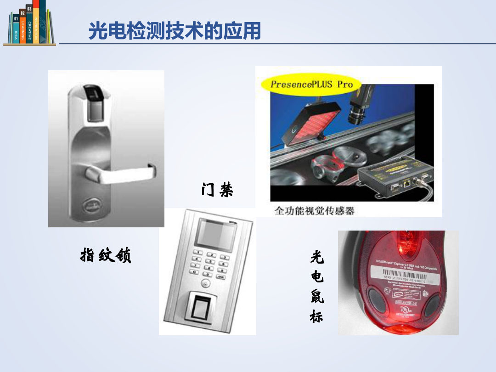

### 本页文字

```text
光电检测技术的应用

      门禁

指纹锁           光
              电
              鼠
              标
```

## 第 48 页

**页面标题/首行：** 光电检测技术的应用

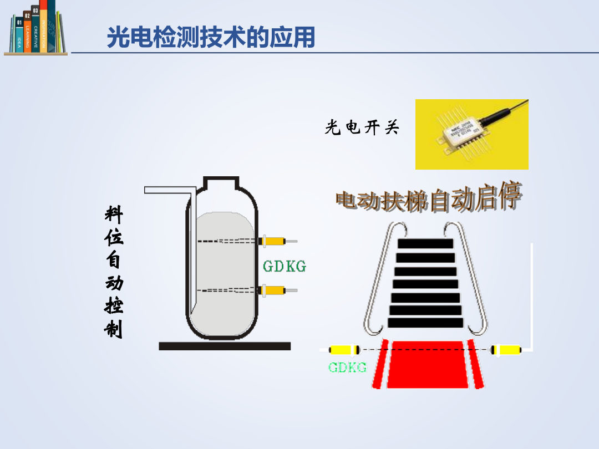

### 本页文字

```text
光电检测技术的应用

           光电开关

           电动扶梯自动启停
料
位
自
动
控
制
```

## 第 49 页

**页面标题/首行：** 光电检测技术的应用

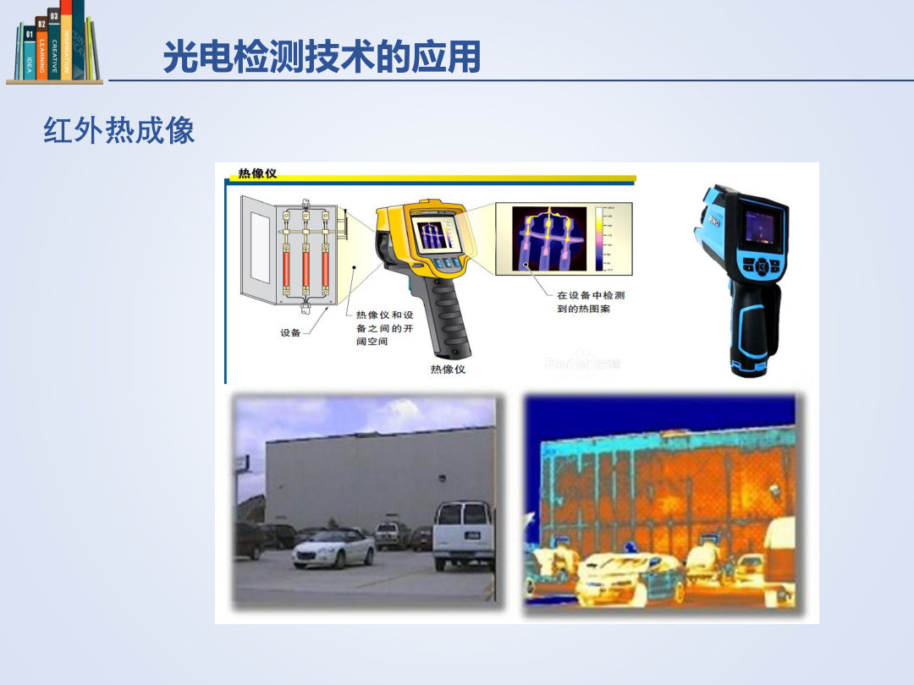

### 本页文字

```text
光电检测技术的应用

红外热成像
```

## 第 50 页

**页面标题/首行：** 光电检测技术的应用

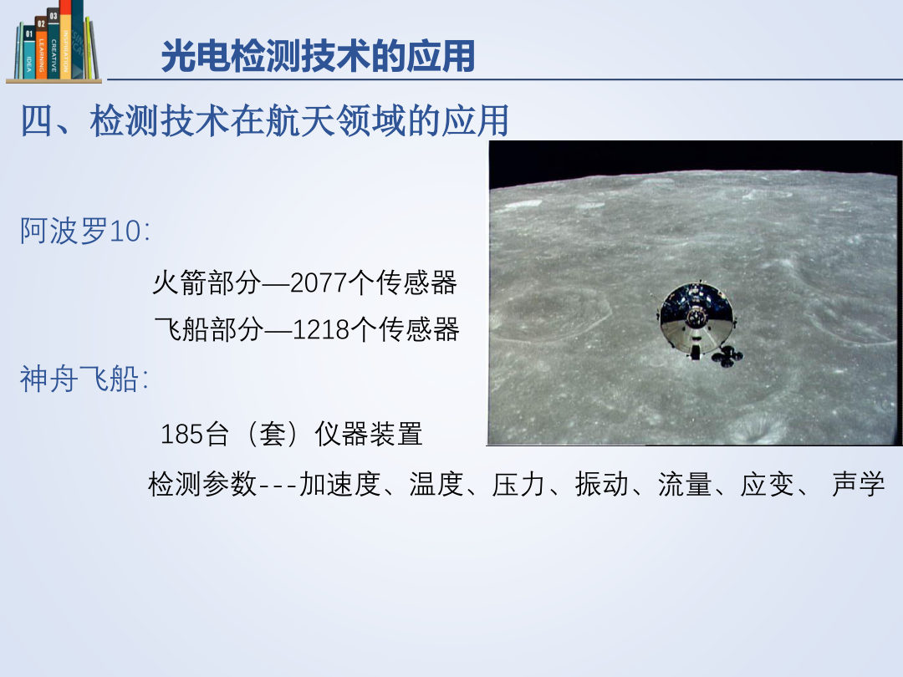

### 本页文字

```text
光电检测技术的应用

四、检测技术在航天领域的应用

阿波罗10：

      火箭部分—2077个传感器

      飞船部分—1218个传感器

神舟飞船：

      185台（套）仪器装置

     检测参数---加速度、温度、压力、振动、流量、应变、声学
```

## 第 51 页

**页面标题/首行：** 与本课程相关的课程

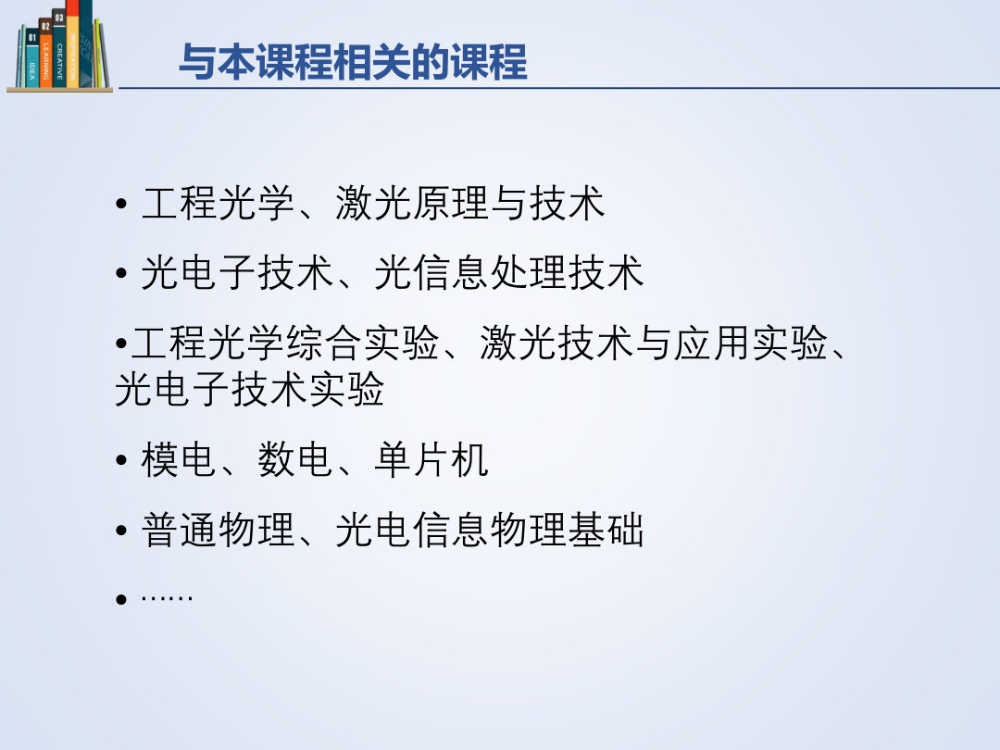

### 本页文字

```text
与本课程相关的课程

• 工程光学、激光原理与技术

• 光电子技术、光信息处理技术

•工程光学综合实验、激光技术与应用实验、
光电子技术实验

• 模电、数电、单片机

• 普通物理、光电信息物理基础

• ……
```

## 第 52 页

**页面标题/首行：** 调研作业

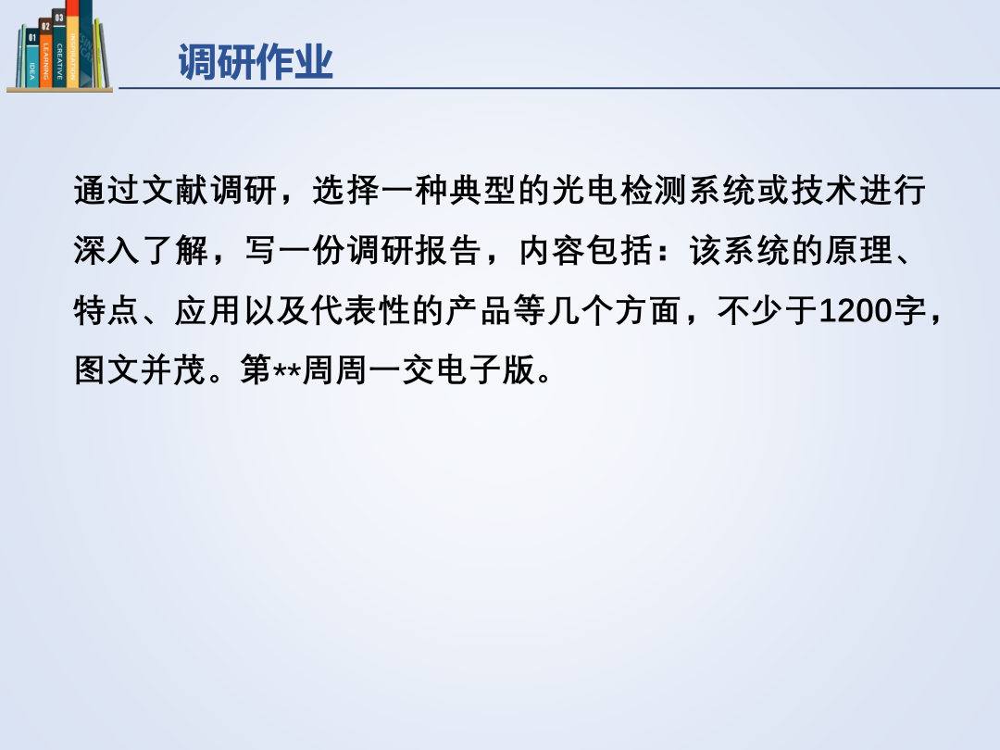

### 本页文字

```text
调研作业

通过文献调研，选择一种典型的光电检测系统或技术进行

深入了解，写一份调研报告，内容包括：该系统的原理、

特点、应用以及代表性的产品等几个方面，不少于1200字，

图文并茂。第**周周一交电子版。
```

## 第 53 页

**页面标题/首行：** 《光电检测技术》课程调研作业规则

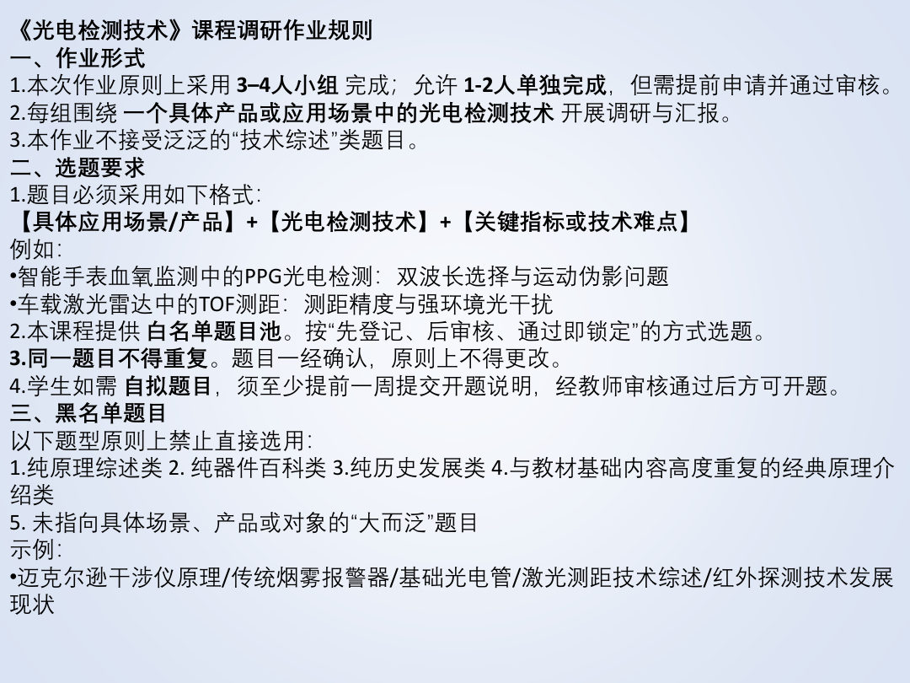

### 本页文字

```text
《光电检测技术》课程调研作业规则
一、作业形式
1.本次作业原则上采用3–4人小组完成；允许1-2人单独完成，但需提前申请并通过审核。
2.每组围绕一个具体产品或应用场景中的光电检测技术开展调研与汇报。
3.本作业不接受泛泛的“技术综述”类题目。
二、选题要求
1.题目必须采用如下格式：
【具体应用场景/产品】+【光电检测技术】+【关键指标或技术难点】
例如：
•智能手表血氧监测中的PPG光电检测：双波长选择与运动伪影问题
•车载激光雷达中的TOF测距：测距精度与强环境光干扰
2.本课程提供白名单题目池。按“先登记、后审核、通过即锁定”的方式选题。
3.同一题目不得重复。题目一经确认，原则上不得更改。
4.学生如需自拟题目，须至少提前一周提交开题说明，经教师审核通过后方可开题。
三、黑名单题目
以下题型原则上禁止直接选用：
1.纯原理综述类2. 纯器件百科类3.纯历史发展类4.与教材基础内容高度重复的经典原理介
绍类
5. 未指向具体场景、产品或对象的“大而泛”题目
示例：
•迈克尔逊干涉仪原理/传统烟雾报警器/基础光电管/激光测距技术综述/红外探测技术发展
现状
```

## 第 54 页

**页面标题/首行：** 四、报告要求

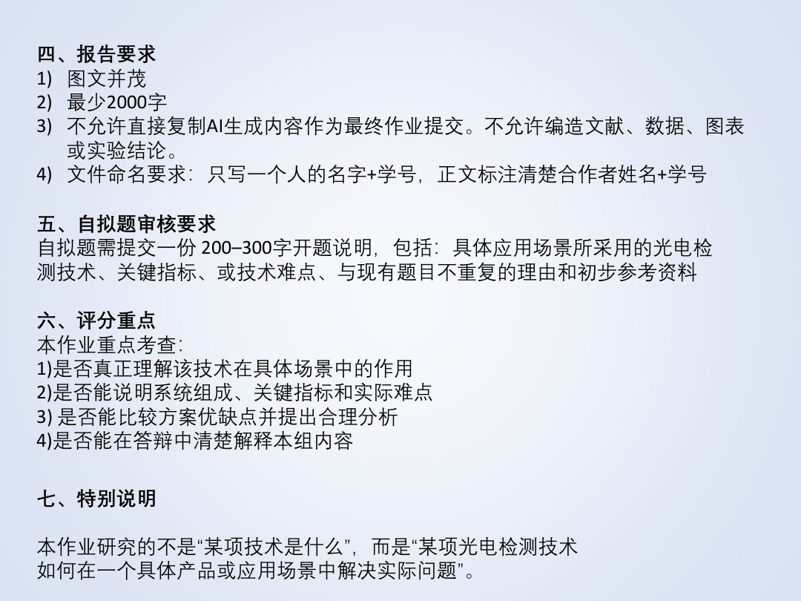

### 本页文字

```text
四、报告要求
1) 图文并茂
2) 最少2000字
3) 不允许直接复制AI生成内容作为最终作业提交。不允许编造文献、数据、图表
  或实验结论。
4) 文件命名要求：只写一个人的名字+学号，正文标注清楚合作者姓名+学号

五、自拟题审核要求
自拟题需提交一份200–300字开题说明，包括：具体应用场景所采用的光电检
测技术、关键指标、或技术难点、与现有题目不重复的理由和初步参考资料

六、评分重点
本作业重点考查：
1)是否真正理解该技术在具体场景中的作用
2)是否能说明系统组成、关键指标和实际难点
3) 是否能比较方案优缺点并提出合理分析
4)是否能在答辩中清楚解释本组内容

七、特别说明

本作业研究的不是“某项技术是什么”，而是“某项光电检测技术
如何在一个具体产品或应用场景中解决实际问题”。
```
