# 第二章 光电检测中常用的光源

- 源文件：`第二章 光电检测中常用的光源.pdf`
- 页数：125
- 转换方式：每页保留原始页面截图，并提取 PDF 文本层作为可检索内容。
- 说明：公式、复杂图形、版式细节以页面截图为准；文字区用于搜索和快速复习。

## 页面索引

- [第 1 页：广州大学](#第-1-页)
- [第 2 页：课程框架](#第-2-页)
- [第 3 页：课程框架](#第-3-页)
- [第 4 页：电磁波与光辐射](#第-4-页)
- [第 5 页：光源描述参量  谱特征、波长范围](#第-5-页)
- [第 6 页：任何一种光电系统或光电子器件的使用和评价都离不开](#第-6-页)
- [第 7 页：电磁波与光辐射](#第-7-页)
- [第 8 页：电磁波与光辐射](#第-8-页)
- [第 9 页：第 9 页](#第-9-页)
- [第 10 页：太赫兹波（Terahertz THz）](#第-10-页)
- [第 11 页：太赫兹波（THz）](#第-11-页)
- [第 12 页：太赫兹波（THz）](#第-12-页)
- [第 13 页：太赫兹波（THz）](#第-13-页)
- [第 14 页：太赫兹波的应用](#第-14-页)
- [第 15 页：太赫兹波的重要性](#第-15-页)
- [第 16 页：太赫兹波的应用](#第-16-页)
- [第 17 页：太赫兹波的应用](#第-17-页)
- [第 18 页：(a) 3D image measured with only the hand in the](#第-18-页)
- [第 19 页：算法    看见之后，谁来判断？](#第-19-页)
- [第 20 页：太赫兹脉冲的产生](#第-20-页)
- [第 21 页：太赫兹脉冲的产生](#第-21-页)
- [第 22 页：注：学生看不懂光路，因为](#第-22-页)
- [第 23 页：太赫兹超快光谱能看到什么？](#第-23-页)
- [第 24 页：多选题 2分](#第-24-页)
- [第 25 页：光辐射的度量](#第-25-页)
- [第 26 页：注：学生这部分上过了    光辐射的度量](#第-26-页)
- [第 27 页：光辐射的度量](#第-27-页)
- [第 28 页：光辐射的度量](#第-28-页)
- [第 29 页：光辐射的度量](#第-29-页)
- [第 30 页：光辐射的度量](#第-30-页)
- [第 31 页：光辐射的度量](#第-31-页)
- [第 32 页：光辐射的度量](#第-32-页)
- [第 33 页：光辐射的度量](#第-33-页)
- [第 34 页：单选题 1分](#第-34-页)
- [第 35 页：光源是光辐射源的简称。光源可以分为天然光源和人造光源。](#第-35-页)
- [第 36 页：一、光的辐射](#第-36-页)
- [第 37 页：原理：假设E0、E1为电子的两个运动状态，E0为基态，电子](#第-37-页)
- [第 38 页：二、光辐射的产生方法](#第-38-页)
- [第 39 页：【光致发光原理】](#第-39-页)
- [第 40 页：(2). 注入复合型电致发光](#第-40-页)
- [第 41 页：3、化学发光](#第-41-页)
- [第 42 页：平衡和非平衡辐射：](#第-42-页)
- [第 43 页：分类：按照发光机理，光源可以分成如下几类：](#第-43-页)
- [第 44 页：任何0 K温度以上的物体，都会由于其中的](#第-44-页)
- [第 45 页：辐射的分类：热辐射和发光辐射](#第-45-页)
- [第 46 页：（二）热辐射](#第-46-页)
- [第 47 页：漆黑环境中的人和铁丝网的温差](#第-47-页)
- [第 48 页：红外遥感热像光谱辐射仪     重庆红外遥感地图](#第-48-页)
- [第 49 页：一、单色吸收比和单色反射比](#第-49-页)
- [第 50 页：(2) 反射比](#第-50-页)
- [第 51 页：(3) 人工黑体](#第-51-页)
- [第 52 页：某一温度下灰体的辐射具有与同温度下黑体](#第-52-页)
- [第 53 页：填空题 2分](#第-53-页)
- [第 54 页：调研报告/做汇报要求](#第-54-页)
- [第 55 页：1. 可见光范围](#第-55-页)
- [第 56 页：二、基尔霍夫辐射定律](#第-56-页)
- [第 57 页：基尔霍夫介绍](#第-57-页)
- [第 58 页：三、普朗克公式](#第-58-页)
- [第 59 页：右图：不同温度条件下黑体的](#第-59-页)
- [第 60 页：四、维恩位移定律](#第-60-页)
- [第 61 页：单选题 1分](#第-61-页)
- [第 62 页：三、光源的特性参数](#第-62-页)
- [第 63 页：下表所列的为一些常用光源的发光效率。](#第-63-页)
- [第 64 页：光化学实验中如何选择LED、氙灯、汞灯3种光源](#第-64-页)
- [第 65 页：2.光谱功率分布](#第-65-页)
- [第 66 页：实验测得的He-Ne 激光谱线－－线状光谱](#第-66-页)
- [第 67 页：实验中测得的氙灯谱线－－连续光谱](#第-67-页)
- [第 68 页：实验中测得的荧光灯谱线－－混合光谱](#第-68-页)
- [第 69 页：受激辐射](#第-69-页)
- [第 70 页：Within the  bulb, an  electric](#第-70-页)
- [第 71 页：根据光谱选择光源：](#第-71-页)
- [第 72 页：单选题 1分](#第-72-页)
- [第 73 页：3、空间光强分布           灯管方向？](#第-73-页)
- [第 74 页：4、光源的色温与颜色](#第-74-页)
- [第 75 页：2700–3000 K](#第-75-页)
- [第 76 页：天镜吸顶灯](#第-76-页)
- [第 77 页：家庭灯具选择](#第-77-页)
- [第 78 页：家庭灯具选择](#第-78-页)
- [第 79 页：相关色温 适用于非黑体辐射的光源](#第-79-页)
- [第 80 页：光源的颜色包含了两方面的含义，即色表和显色性。](#第-80-页)
- [第 81 页：5 、对光源稳定性的要求](#第-81-页)
- [第 82 页：四、 自然光辐射体](#第-82-页)
- [第 83 页：单选题 1分](#第-83-页)
- [第 84 页：五 、人工光辐射体](#第-84-页)
- [第 85 页：典型的腔型黑体辐射源的基本结构原理如图示，它主要由黑体芯](#第-85-页)
- [第 86 页：注：目前黑体辐射器](#第-86-页)
- [第 87 页：为了使温度均匀稳定，全辐射器空腔的几何尺寸中L/d＞1.5。](#第-87-页)
- [第 88 页：2）白炽灯](#第-88-页)
- [第 89 页：普通白炽灯由熔点高达3600 K的钨丝制作成的灯丝、实心](#第-89-页)
- [第 90 页：1、真空白炽灯](#第-90-页)
- [第 91 页：3、卤钨白炽灯](#第-91-页)
- [第 92 页：卤钨灯的特点](#第-92-页)
- [第 93 页：单端卤钨灯](#第-93-页)
- [第 94 页：2、气体放电光源（气体灯）](#第-94-页)
- [第 95 页：3）气体放电原理](#第-95-页)
- [第 96 页：4)气体放电光源的特点](#第-96-页)
- [第 97 页：2.光谱功率分布](#第-97-页)
- [第 98 页：1. 色温](#第-98-页)
- [第 99 页：气体放电光源的分类：](#第-99-页)
- [第 100 页：放电发光物质   钠灯](#第-100-页)
- [第 101 页：1）汞灯](#第-101-页)
- [第 102 页：◆低压汞灯](#第-102-页)
- [第 103 页：1）低压汞灯](#第-103-页)
- [第 104 页：◆高压汞灯](#第-104-页)
- [第 105 页：紫外荧光磁粉探伤：给机械零件涂上荧光磁粉后，用高压汞灯](#第-105-页)
- [第 106 页：◆超高压汞灯](#第-106-页)
- [第 107 页：◆超高压汞灯应用](#第-107-页)
- [第 108 页：2）氙灯](#第-108-页)
- [第 109 页：单选题 1分](#第-109-页)
- [第 110 页：3、固体发光光源](#第-110-页)
- [第 111 页：发光二极管与普通二极管一样是由一个PN结组成，也具有单](#第-111-页)
- [第 112 页：发光二极管可分成红色、橙色、绿色（又细分黄绿、标准绿和纯](#第-112-页)
- [第 113 页：图3-13 发光二极管的典型光谱响应曲线](#第-113-页)
- [第 114 页：氮化镓（GaN）进一步掺杂，实现蓝光   3.4 eV     2.65 eV](#第-114-页)
- [第 115 页：氮化镓（GaN）](#第-115-页)
- [第 116 页：4、 激光光源](#第-116-页)
- [第 117 页：* 新型电调制红外光源](#第-117-页)
- [第 118 页：* 新型电调制红外光源](#第-118-页)
- [第 119 页：填空题 1分](#第-119-页)
- [第 120 页：光谱仪器](#第-120-页)
- [第 121 页：光谱仪器](#第-121-页)
- [第 122 页：光谱仪器](#第-122-页)
- [第 123 页：光谱仪器](#第-123-页)
- [第 124 页：光源选择的基本要求](#第-124-页)
- [第 125 页：光源选择的基本要求](#第-125-页)

## 第 1 页

**页面标题/首行：** 广州大学


### 本页文字

```text
广州大学

光电检测技术
     方佳文

    Jiawen.fang@gzhu.edu.cn
```

## 第 2 页

**页面标题/首行：** 课程框架

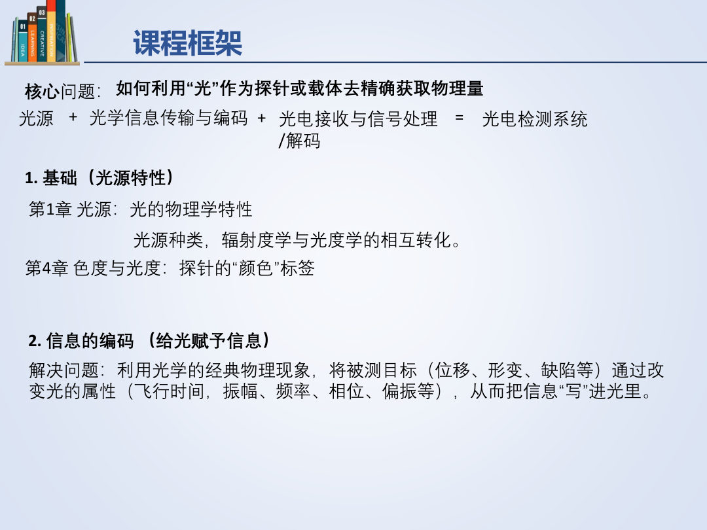

### 本页文字

```text
课程框架

核心问题：如何利用“光”作为探针或载体去精确获取物理量
光源  + 光学信息传输与编码 + 光电接收与信号处理  = 光电检测系统
                  /解码

 1. 基础（光源特性）

 第1章 光源：光的物理学特性

      光源种类，辐射度学与光度学的相互转化。

第4章 色度与光度：探针的“颜色”标签

 2. 信息的编码 （给光赋予信息）

 解决问题：利用光学的经典物理现象，将被测目标（位移、形变、缺陷等）通过改
 变光的属性（飞行时间，振幅、频率、相位、偏振等），从而把信息“写”进光里。
```

## 第 3 页

**页面标题/首行：** 课程框架

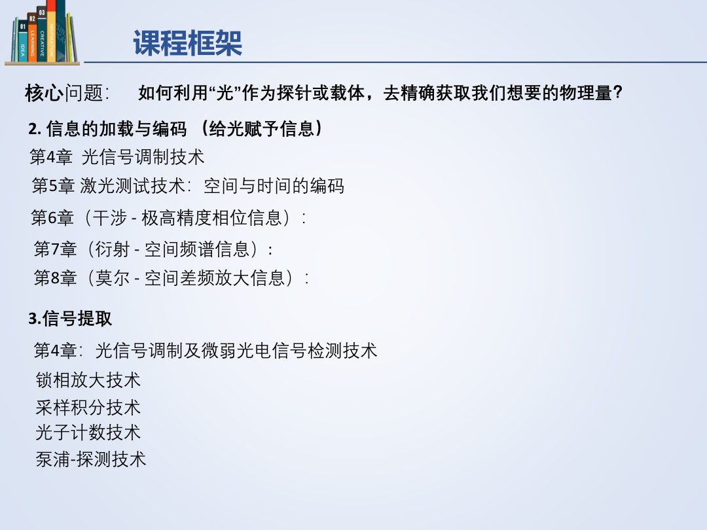

### 本页文字

```text
课程框架

核心问题： 如何利用“光”作为探针或载体，去精确获取我们想要的物理量？

 2. 信息的加载与编码 （给光赋予信息）
第4章光信号调制技术

第5章 激光测试技术：空间与时间的编码

第6章（干涉 - 极高精度相位信息）：

 第7章（衍射 - 空间频谱信息）:

 第8章（莫尔 - 空间差频放大信息）：

3.信号提取

第4章：光信号调制及微弱光电信号检测技术

 锁相放大技术
 采样积分技术
 光子计数技术
 泵浦-探测技术
```

## 第 4 页

**页面标题/首行：** 电磁波与光辐射

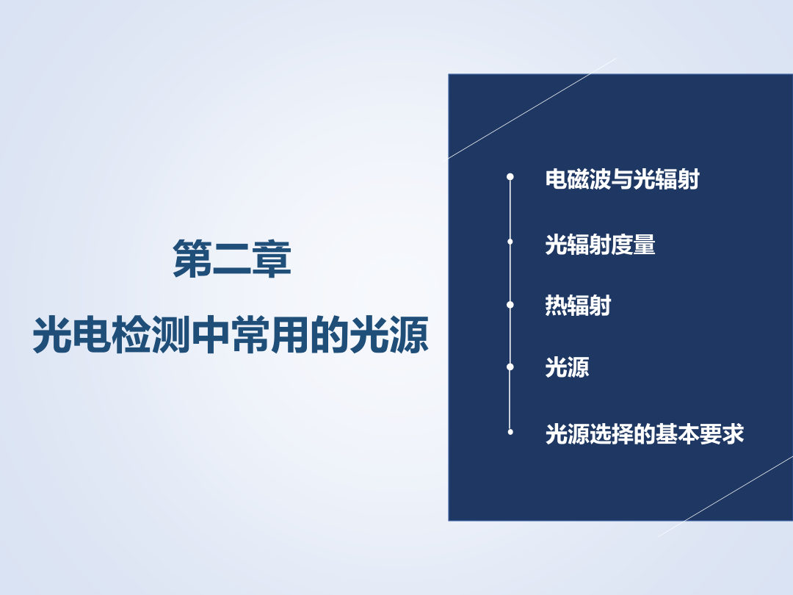

### 本页文字

```text
电磁波与光辐射

    第二章            光辐射度量
                       热辐射
光电检测中常用的光源
                       光源

                       光源选择的基本要求
```

## 第 5 页

**页面标题/首行：** 光源描述参量  谱特征、波长范围

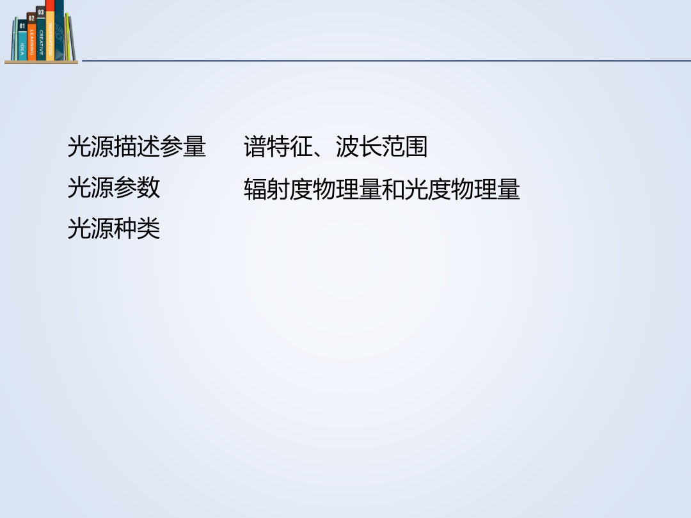

### 本页文字

```text
光源描述参量  谱特征、波长范围
光源参数    辐射度物理量和光度物理量
光源种类
```

## 第 6 页

**页面标题/首行：** 任何一种光电系统或光电子器件的使用和评价都离不开

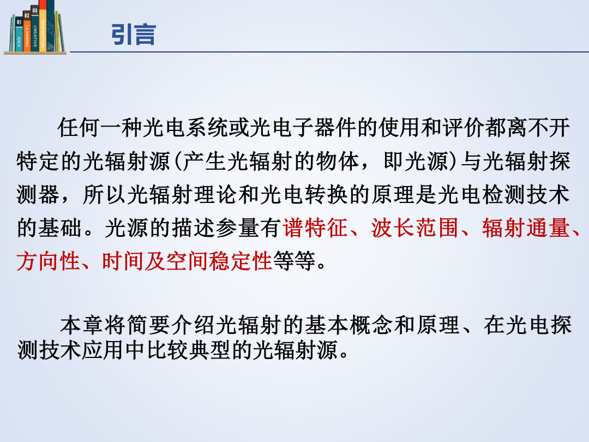

### 本页文字

```text
引言

  任何一种光电系统或光电子器件的使用和评价都离不开

特定的光辐射源(产生光辐射的物体，即光源)与光辐射探

测器，所以光辐射理论和光电转换的原理是光电检测技术

的基础。光源的描述参量有谱特征、波长范围、辐射通量、

方向性、时间及空间稳定性等等。

  本章将简要介绍光辐射的基本概念和原理、在光电探
测技术应用中比较典型的光辐射源。
```

## 第 7 页

**页面标题/首行：** 电磁波与光辐射

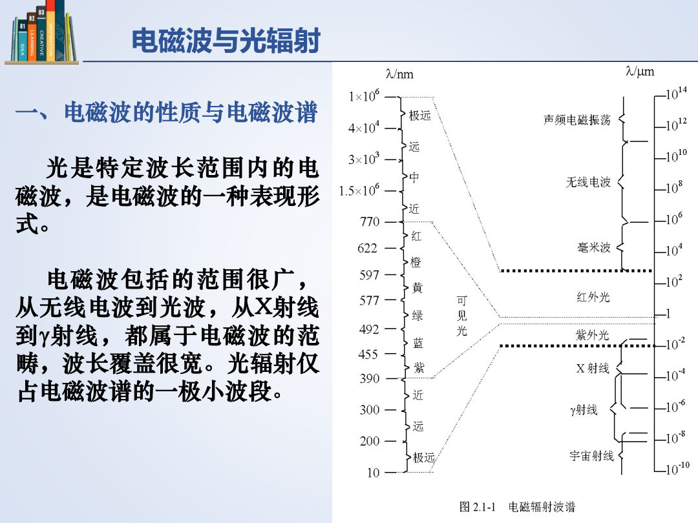

### 本页文字

```text
电磁波与光辐射

一、电磁波的性质与电磁波谱

 光是特定波长范围内的电
磁波，是电磁波的一种表现形
式。

 电磁波包括的范围很广，
从无线电波到光波，从X射线
到射线，都属于电磁波的范
畴，波长覆盖很宽。光辐射仅
占电磁波谱的一极小波段。

                                                                                          7
```

## 第 8 页

**页面标题/首行：** 电磁波与光辐射

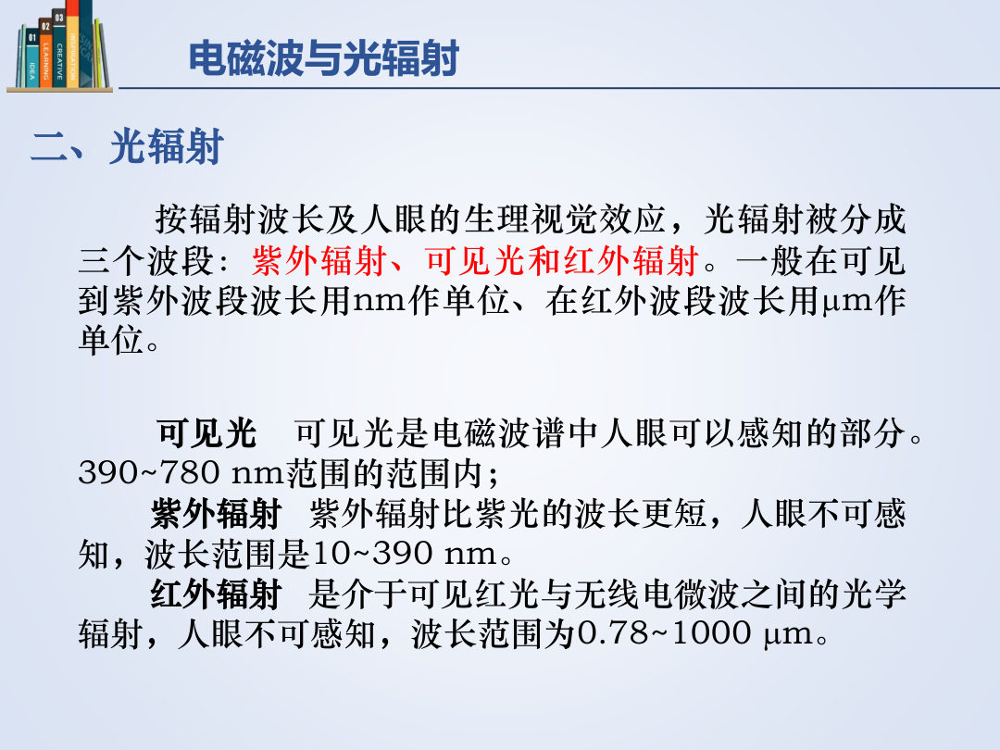

### 本页文字

```text
电磁波与光辐射

二、光辐射

    按辐射波长及人眼的生理视觉效应，光辐射被分成
 三个波段：紫外辐射、可见光和红外辐射。一般在可见
 到紫外波段波长用nm作单位、在红外波段波长用m作
 单位。

    可见光 可见光是电磁波谱中人眼可以感知的部分。
  390~780 nm范围的范围内；
    紫外辐射 紫外辐射比紫光的波长更短，人眼不可感
  知，波长范围是10~390 nm。
    红外辐射 是介于可见红光与无线电微波之间的光学
  辐射，人眼不可感知，波长范围为0.78~1000 m。
```

## 第 9 页

**页面标题/首行：** 第 9 页

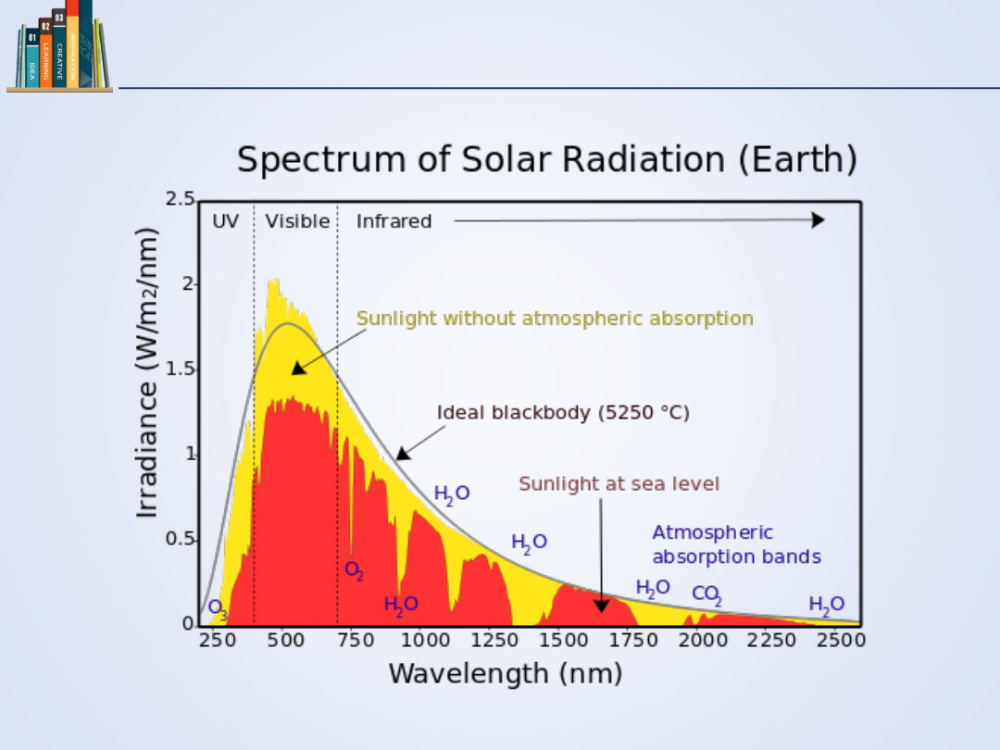

### 本页文字

> 本页未检测到可提取文本，请以页面截图为准。

## 第 10 页

**页面标题/首行：** 太赫兹波（Terahertz THz）

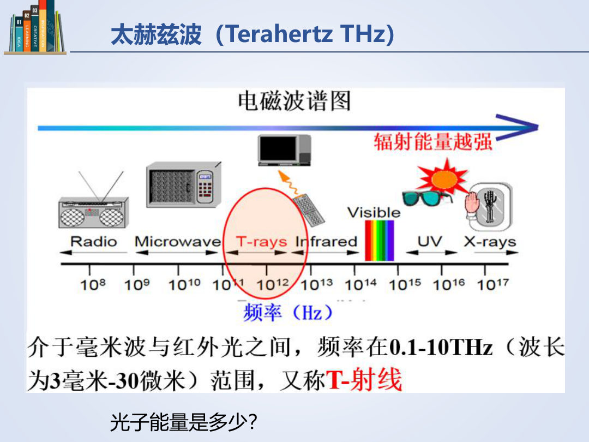

### 本页文字

```text
太赫兹波（Terahertz THz）

光子能量是多少？
```

## 第 11 页

**页面标题/首行：** 太赫兹波（THz）

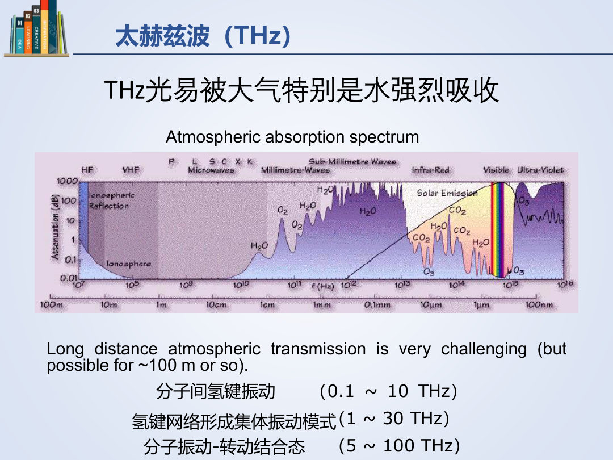

### 本页文字

```text
太赫兹波（THz）

  THz光易被大气特别是水强烈吸收

              Atmospheric absorption spectrum

Long distance atmospheric transmission  is very challenging (but
possible for ~100 m or so).
      分子间氢键振动   （0.1 ~ 10 THz）
     氢键网络形成集体振动模式（1 ~ 30 THz）
      分子振动-转动结合态  （5 ~ 100 THz）
```

## 第 12 页

**页面标题/首行：** 太赫兹波（THz）

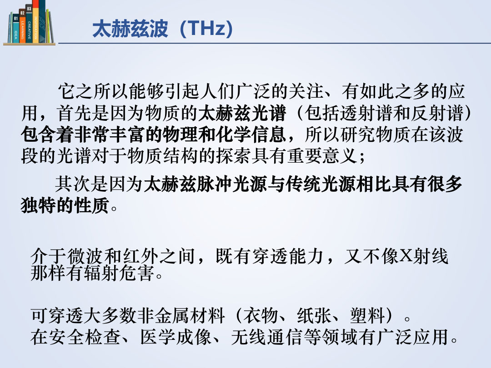

### 本页文字

```text
太赫兹波（THz）

  它之所以能够引起人们广泛的关注、有如此之多的应
用，首先是因为物质的太赫兹光谱（包括透射谱和反射谱）
包含着非常丰富的物理和化学信息，所以研究物质在该波
段的光谱对于物质结构的探索具有重要意义；
  其次是因为太赫兹脉冲光源与传统光源相比具有很多
独特的性质。

 介于微波和红外之间，既有穿透能力，又不像X射线
 那样有辐射危害。

 可穿透大多数非金属材料（衣物、纸张、塑料）。
 在安全检查、医学成像、无线通信等领域有广泛应用。
```

## 第 13 页

**页面标题/首行：** 太赫兹波（THz）

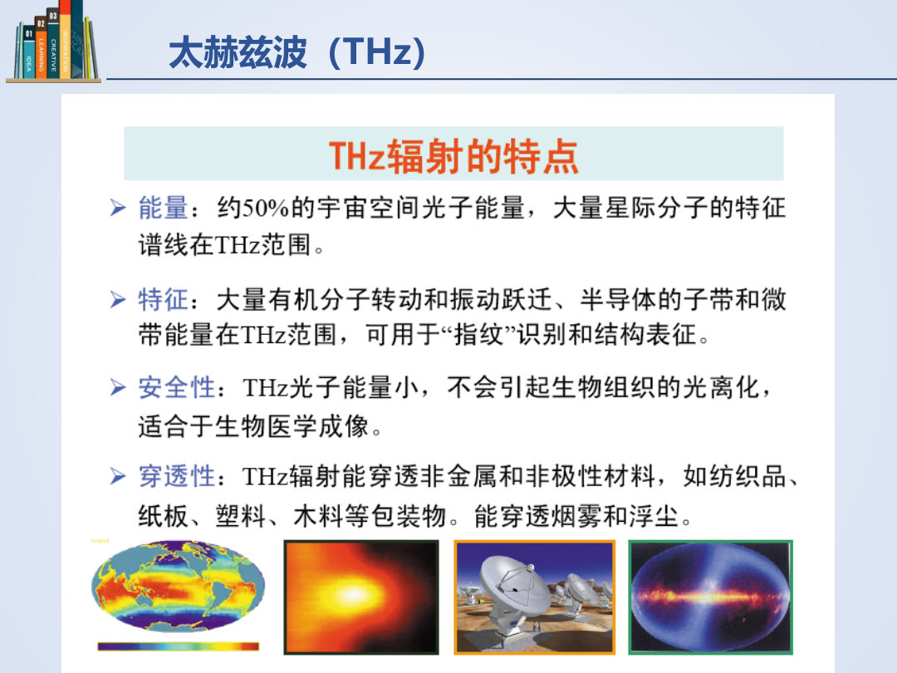

### 本页文字

```text
太赫兹波（THz）
```

## 第 14 页

**页面标题/首行：** 太赫兹波的应用

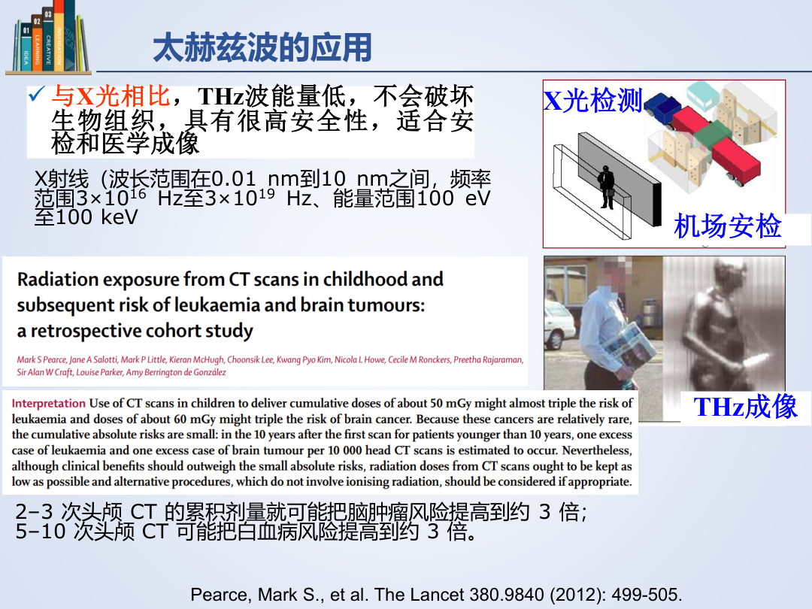

### 本页文字

```text
太赫兹波的应用

 ✓与X光相比，THz波能量低，不会破坏   X光检测
 生物组织，具有很高安全性，适合安
 检和医学成像
 X射线（波长范围在0.01 nm到10 nm之间，频率
 范围3×1016 Hz至3×1019 Hz、能量范围100 eV
 至100 keV                        机场安检

                                THz成像

2–3 次头颅 CT 的累积剂量就可能把脑肿瘤风险提高到约 3 倍；
5–10 次头颅 CT 可能把白血病风险提高到约 3 倍。

                    Pearce, Mark S., et al. The Lancet 380.9840 (2012): 499-505.
```

## 第 15 页

**页面标题/首行：** 太赫兹波的重要性

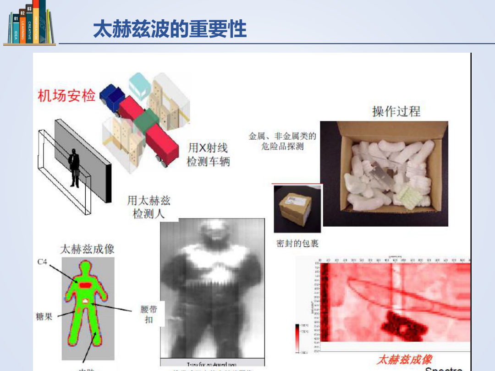

### 本页文字

```text
太赫兹波的重要性
```

## 第 16 页

**页面标题/首行：** 太赫兹波的应用

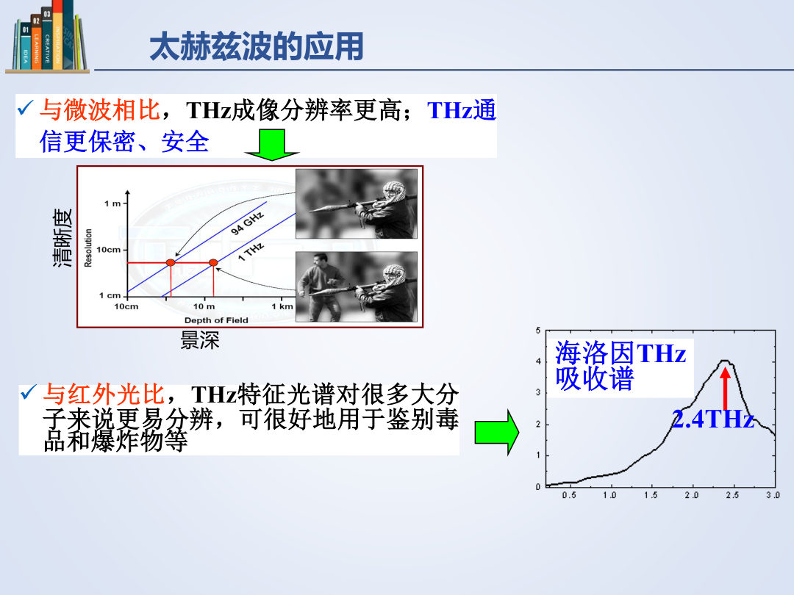

### 本页文字

```text
太赫兹波的应用

✓与微波相比，THz成像分辨率更高；THz通
 信更保密、安全

    清晰度

        景深
                         海洛因THz
                    吸收谱
✓与红外光比，THz特征光谱对很多大分
 子来说更易分辨，可很好地用于鉴别毒               2.4THz
 品和爆炸物等
```

## 第 17 页

**页面标题/首行：** 太赫兹波的应用

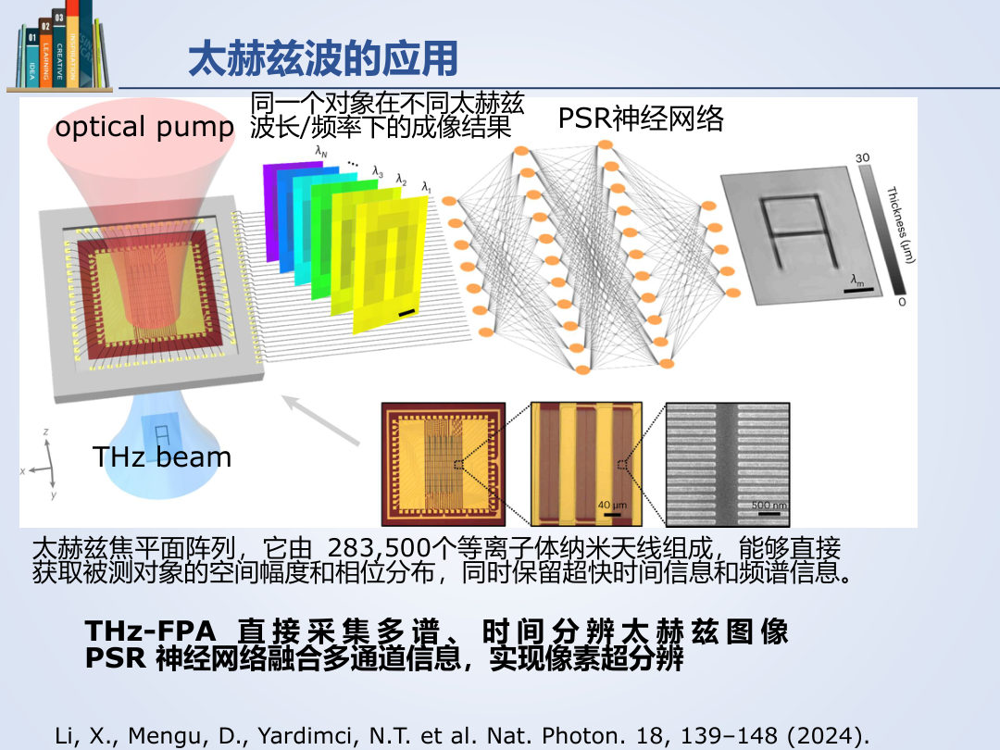

### 本页文字

```text
太赫兹波的应用
         同一个对象在不同太赫兹                      PSR神经网络  optical pump 波长/频率下的成像结果

   THz beam

太赫兹焦平面阵列，它由 283,500个等离子体纳米天线组成，能够直接
获取被测对象的空间幅度和相位分布，同时保留超快时间信息和频谱信息。

   THz-FPA 直接采集多谱、时间分辨太赫兹图像
   PSR 神经网络融合多通道信息，实现像素超分辨

  Li, X., Mengu, D., Yardimci, N.T. et al. Nat. Photon. 18, 139–148 (2024).
```

## 第 18 页

**页面标题/首行：** (a) 3D image measured with only the hand in the

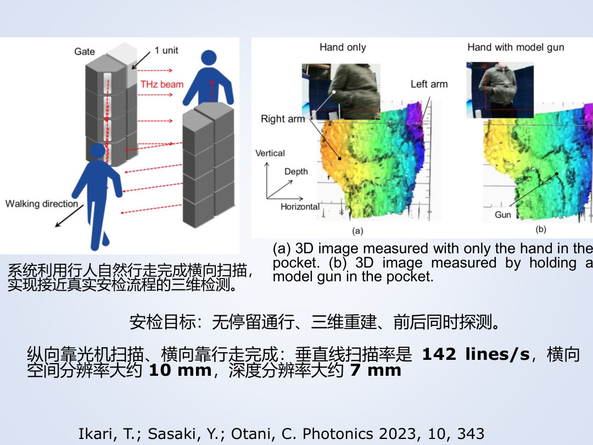

### 本页文字

```text
(a) 3D image measured with only the hand in the
                                       pocket. (b) 3D image measured by holding a系统利用行人自然行走完成横向扫描，                                 model gun in the pocket.实现接近真实安检流程的三维检测。

       安检目标：无停留通行、三维重建、前后同时探测。
 纵向靠光机扫描、横向靠行走完成：垂直线扫描率是 142 lines/s，横向
 空间分辨率大约 10 mm，深度分辨率大约 7 mm

           Ikari, T.; Sasaki, Y.; Otani, C. Photonics 2023, 10, 343
```

## 第 19 页

**页面标题/首行：** 算法    看见之后，谁来判断？

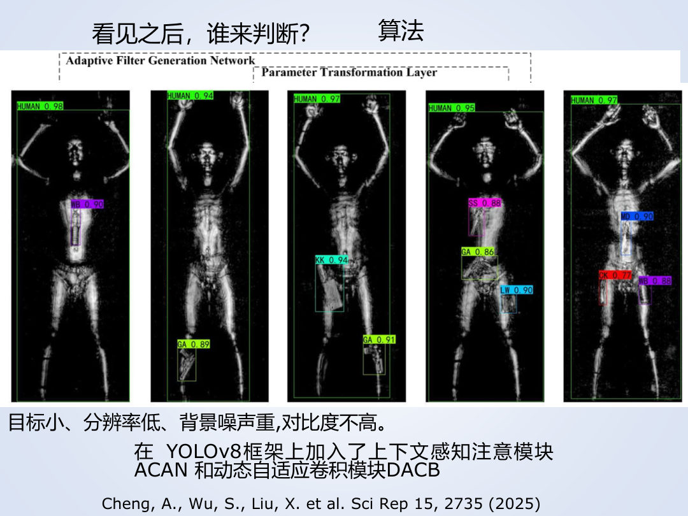

### 本页文字

```text
算法    看见之后，谁来判断？

目标小、分辨率低、背景噪声重,对比度不高。
       在 YOLOv8框架上加入了上下文感知注意模块
         ACAN 和动态自适应卷积模块DACB

           Cheng, A., Wu, S., Liu, X. et al. Sci Rep 15, 2735 (2025)
```

## 第 20 页

**页面标题/首行：** 太赫兹脉冲的产生

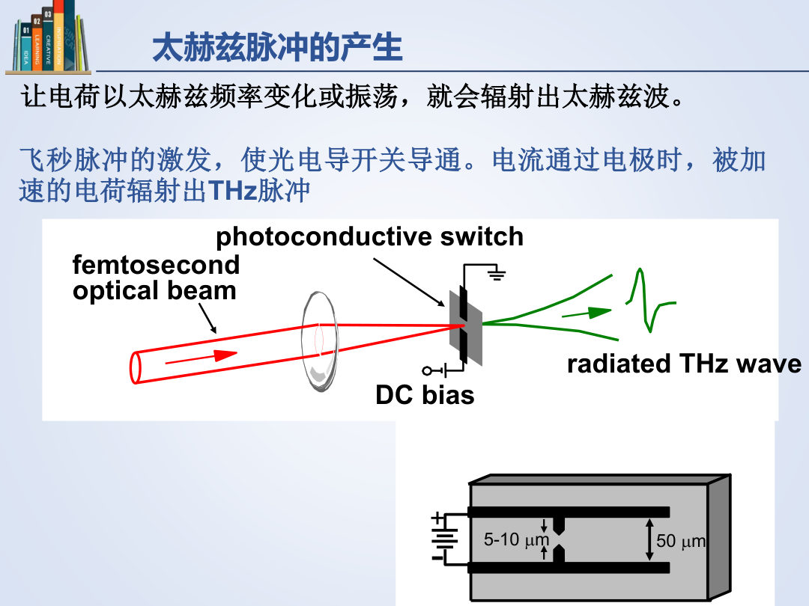

### 本页文字

```text
太赫兹脉冲的产生

让电荷以太赫兹频率变化或振荡，就会辐射出太赫兹波。

飞秒脉冲的激发，使光电导开关导通。电流通过电极时，被加
速的电荷辐射出THz脉冲

              photoconductive switch
    femtosecond
    optical beam

                                          radiated THz wave
                  DC bias

                          +
                                                    5-10 m           50 m
                               -
```

## 第 21 页

**页面标题/首行：** 太赫兹脉冲的产生

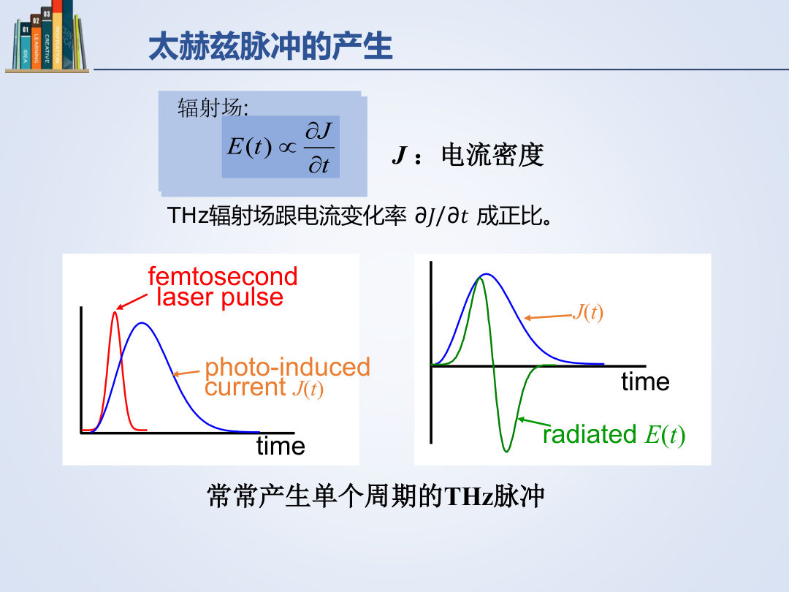

### 本页文字

```text
太赫兹脉冲的产生

  辐射场:
            J
     E (t )                   J ：电流密度      t

 THz辐射场跟电流变化率 ∂𝐽/∂𝑡成正比。

femtosecond
 laser pulse
                                                        J(t)

    photo-induced                                      time     current J(t)

                                 radiated E(t)         time

  常常产生单个周期的THz脉冲
```

## 第 22 页

**页面标题/首行：** 注：学生看不懂光路，因为

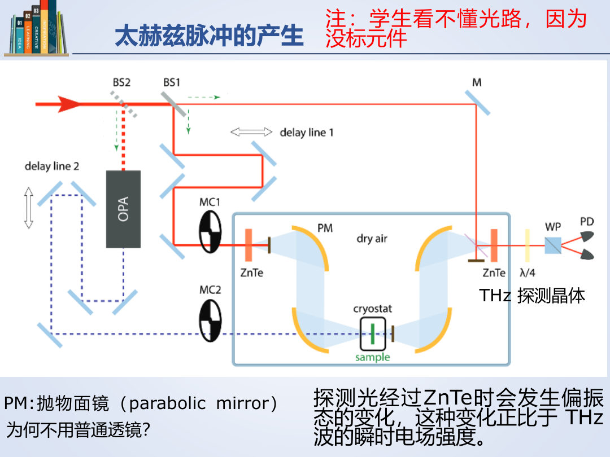

### 本页文字

```text
注：学生看不懂光路，因为
     太赫兹脉冲的产生 没标元件

                                            THz 探测晶体

                探测光经过ZnTe时会发生偏振PM:抛物面镜（parabolic mirror）
               态的变化，这种变化正比于 THz为何不用普通透镜？               波的瞬时电场强度。
```

## 第 23 页

**页面标题/首行：** 太赫兹超快光谱能看到什么？

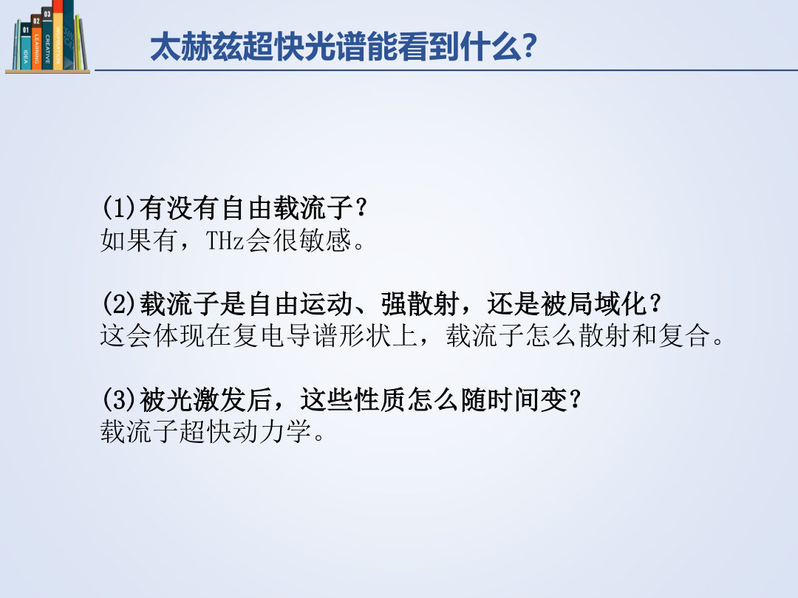

### 本页文字

```text
太赫兹超快光谱能看到什么？

(1)有没有自由载流子？
如果有，THz会很敏感。

(2)载流子是自由运动、强散射，还是被局域化？
这会体现在复电导谱形状上，载流子怎么散射和复合。

(3)被光激发后，这些性质怎么随时间变？
载流子超快动力学。
```

## 第 24 页

**页面标题/首行：** 多选题 2分

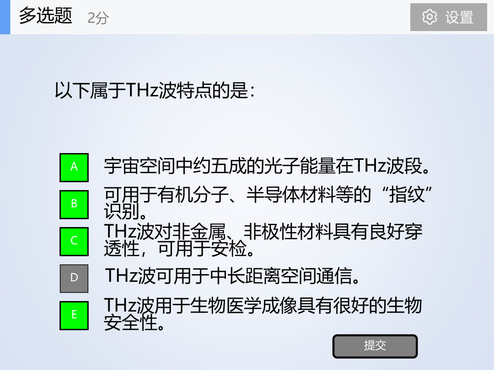

### 本页文字

```text
多选题 2分

  以下属于THz波特点的是：

       A     宇宙空间中约五成的光子能量在THz波段。
     可用于有机分子、半导体材料等的“指纹”        B
     识别。
     THz波对非金属、非极性材料具有良好穿       C
     透性，可用于安检。

      D     THz波可用于中长距离空间通信。
     THz波用于生物医学成像具有很好的生物         E
     安全性。
                                提交
```

## 第 25 页

**页面标题/首行：** 光辐射的度量

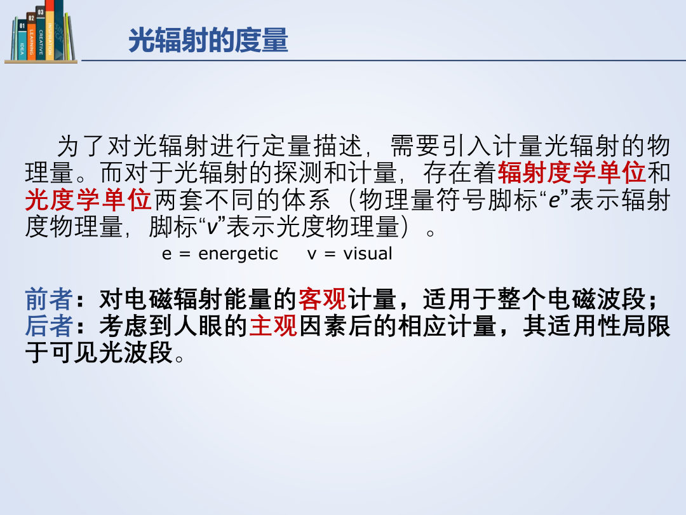

### 本页文字

```text
光辐射的度量

 为了对光辐射进行定量描述，需要引入计量光辐射的物
理量。而对于光辐射的探测和计量，存在着辐射度学单位和
光度学单位两套不同的体系（物理量符号脚标“e”表示辐射
度物理量，脚标“v”表示光度物理量）。
             e = energetic   v = visual

前者：对电磁辐射能量的客观计量，适用于整个电磁波段；
后者：考虑到人眼的主观因素后的相应计量，其适用性局限
于可见光波段。
```

## 第 26 页

**页面标题/首行：** 注：学生这部分上过了    光辐射的度量

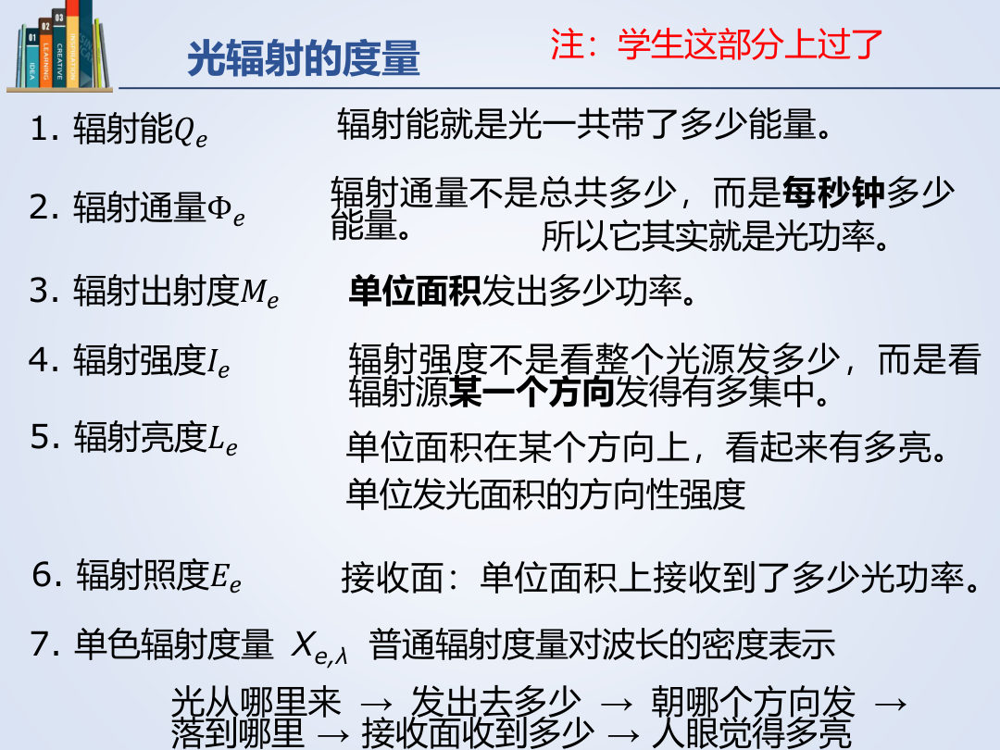

### 本页文字

```text
注：学生这部分上过了    光辐射的度量
1.        辐射能就是光一共带了多少能量。  辐射能𝑄𝑒
         辐射通量不是总共多少，而是每秒钟多少2. 辐射通量Φ𝑒         能量。               所以它其实就是光功率。
3. 辐射出射度𝑀𝑒  单位面积发出多少功率。
4. 辐射强度𝐼𝑒   辐射强度不是看整个光源发多少，而是看
          辐射源某一个方向发得有多集中。
5. 辐射亮度𝐿𝑒         单位面积在某个方向上，看起来有多亮。
          单位发光面积的方向性强度

6. 辐射照度𝐸𝑒   接收面：单位面积上接收到了多少光功率。
7. 单色辐射度量Xe,λ 普通辐射度量对波长的密度表示
    光从哪里来 → 发出去多少 → 朝哪个方向发 →
    落到哪里 → 接收面收到多少 → 人眼觉得多亮
```

## 第 27 页

**页面标题/首行：** 光辐射的度量

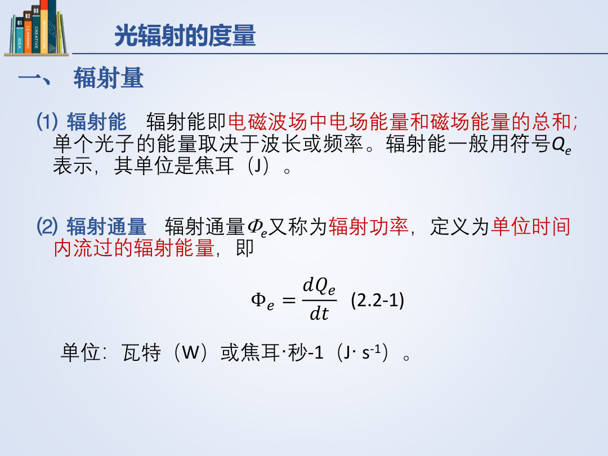

### 本页文字

```text
光辐射的度量
一、辐射量

 ⑴辐射能 辐射能即电磁波场中电场能量和磁场能量的总和；
  单个光子的能量取决于波长或频率。辐射能一般用符号Qe
  表示，其单位是焦耳（J）。

 ⑵ 辐射通量        辐射通量e又称为辐射功率，定义为单位时间
  内流过的辐射能量，即

                         𝑑𝑄𝑒
               Φ𝑒=       (2.2-1)
                             𝑑𝑡

   单位：瓦特（W）或焦耳·秒-1（J· s-1）。
```

## 第 28 页

**页面标题/首行：** 光辐射的度量

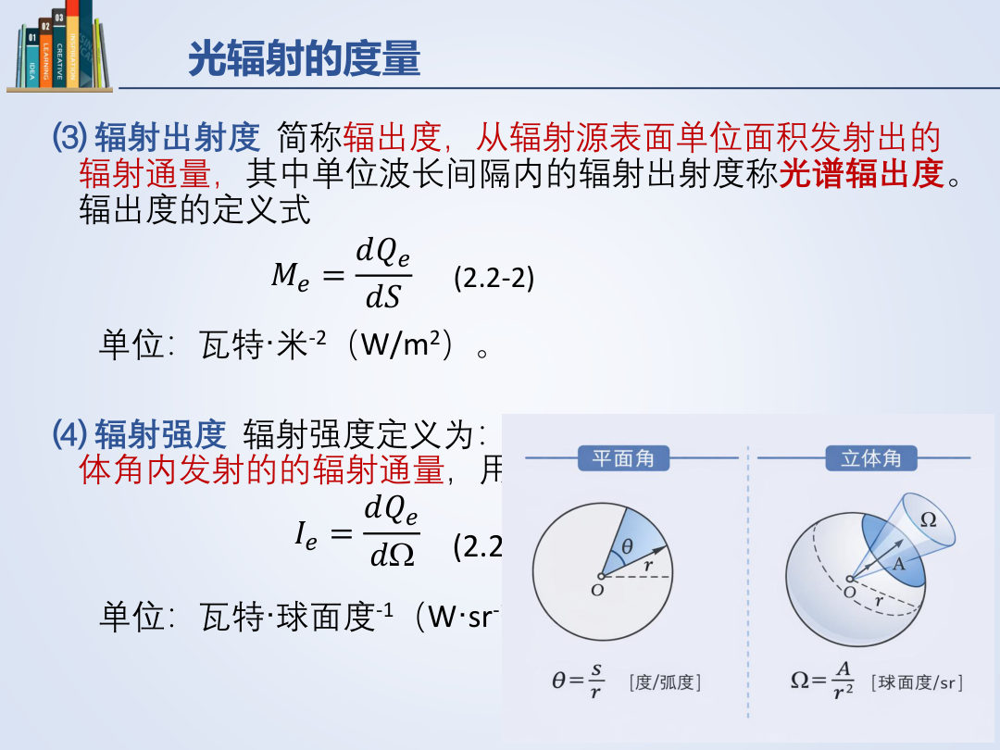

### 本页文字

```text
光辐射的度量

⑶辐射出射度 简称辐出度，从辐射源表面单位面积发射出的
 辐射通量，其中单位波长间隔内的辐射出射度称光谱辐出度。
 辐出度的定义式
                𝑑𝑄𝑒
         𝑀𝑒=         (2.2-2)
                 𝑑𝑆
  单位：瓦特·米-2（W/m2）。

⑷ 辐射强度 辐射强度定义为：点辐射源在给定方向上单位立
 体角内发射的的辐射通量，用Ie表示，即
                 𝑑𝑄𝑒                    Ω表示立体角，单位球面度            𝐼𝑒=              𝑑   (2.2-3)

  单位：瓦特·球面度-1（W·sr-1）。
```

## 第 29 页

**页面标题/首行：** 光辐射的度量

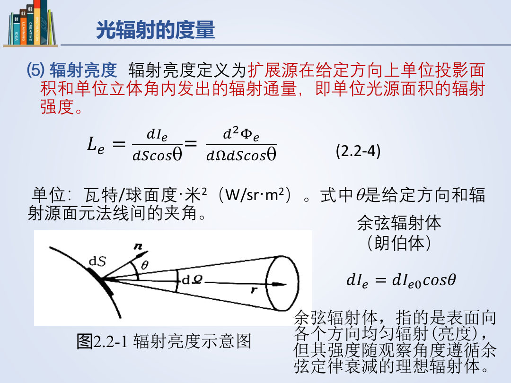

### 本页文字

```text
光辐射的度量

⑸辐射亮度 辐射亮度定义为扩展源在给定方向上单位投影面
 积和单位立体角内发出的辐射通量，即单位光源面积的辐射
 强度。
                 𝑑𝐼𝑒      𝑑2Φ𝑒
    𝐿𝑒=                                               (2.2-4)           𝑑𝑆𝑐𝑜𝑠= 𝑑Ω𝑑𝑆𝑐𝑜𝑠

单位：瓦特/球面度·米2（W/sr·m2）。式中是给定方向和辐
射源面元法线间的夹角。
                   余弦辐射体
                   （朗伯体）

                               𝑑𝐼𝑒= 𝑑𝐼𝑒0𝑐𝑜𝑠𝜃

                余弦辐射体，指的是表面向
                 各个方向均匀辐射(亮度)，      图2.2-1 辐射亮度示意图                但其强度随观察角度遵循余
                弦定律衰减的理想辐射体。
```

## 第 30 页

**页面标题/首行：** 光辐射的度量

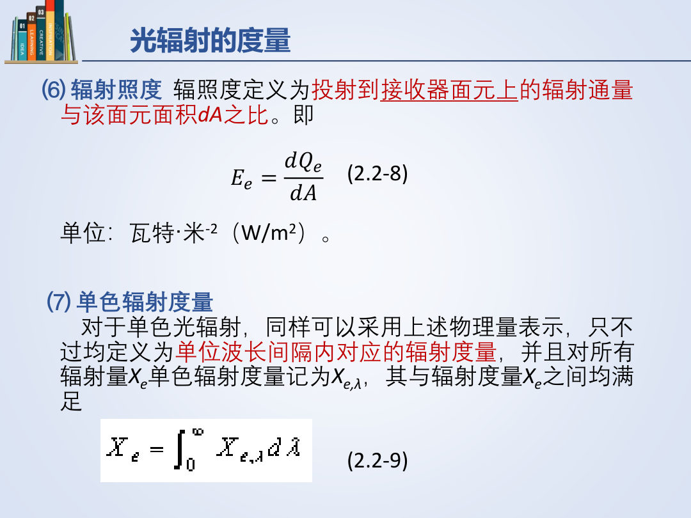

### 本页文字

```text
光辐射的度量

⑹辐射照度 辐照度定义为投射到接收器面元上的辐射通量
 与该面元面积dA之比。即

                   𝑑𝑄𝑒                                   (2.2-8)            𝐸𝑒=
                  𝑑𝐴

 单位：瓦特·米-2（W/m2）。

⑺ 单色辐射度量
  对于单色光辐射，同样可以采用上述物理量表示，只不
 过均定义为单位波长间隔内对应的辐射度量，并且对所有
 辐射量Xe单色辐射度量记为Xe,λ，其与辐射度量Xe之间均满
 足

                                   (2.2-9)
```

## 第 31 页

**页面标题/首行：** 光辐射的度量

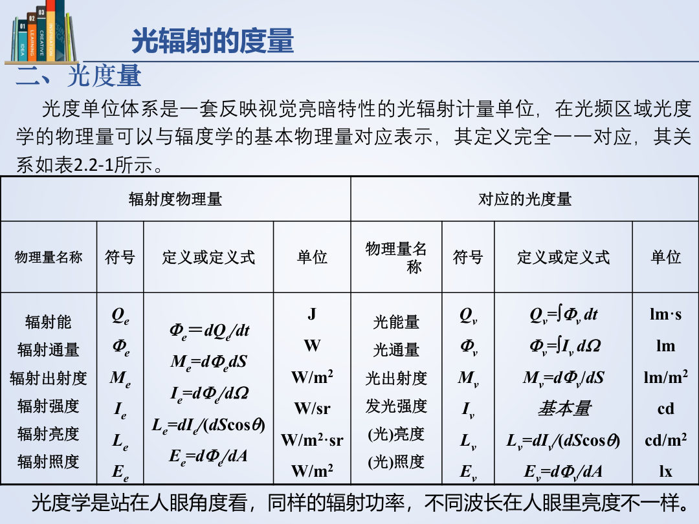

### 本页文字

```text
光辐射的度量
二、光度量

  光度单位体系是一套反映视觉亮暗特性的光辐射计量单位，在光频区域光度
学的物理量可以与辐度学的基本物理量对应表示，其定义完全一一对应，其关
系如表2.2-1所示。

        辐射度物理量                对应的光度量

                       物理量名
物理量名称 符号  定义或定义式   单位        符号  定义或定义式   单位
                          称

 辐射能    Qe                    J    光能量    Qv      Qv=v dt       lm·s
                 e＝dQe/dt
 辐射通量   e          W   光通量    v      v=Iv d     lm
                 Me=dedS
辐射出射度                       光出射度          Me               W/m2                                           Mv     Mv=dv/dS    lm/m2
                  Ie=de/d
 辐射强度      Ie                  W/sr  发光强度      Iv   基本量       cd
                   Le=dIe/(dScos) 辐射亮度                         (光)亮度             Le                 W/m2·sr               Lv    Lv=dIv/(dScos)   cd/m2
 辐射照度          Ee=de/dA          (光)照度
            Ee               W/m2               Ev     Ev=dv/dA        lx
 光度学是站在人眼角度看，同样的辐射功率，不同波长在人眼里亮度不一样。
```

## 第 32 页

**页面标题/首行：** 光辐射的度量

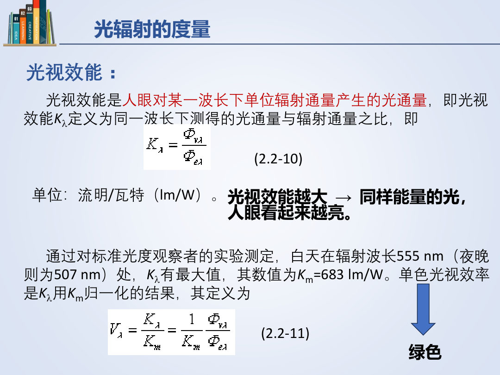

### 本页文字

```text
光辐射的度量

光视效能 ：

 光视效能是人眼对某一波长下单位辐射通量产生的光通量，即光视
效能K定义为同一波长下测得的光通量与辐射通量之比，即

                                      (2.2-10)

 单位：流明/瓦特（lm/W）。            光视效能越大 → 同样能量的光，
            人眼看起来越亮。

  通过对标准光度观察者的实验测定，白天在辐射波长555 nm（夜晚
则为507 nm）处，K有最大值，其数值为Km=683 lm/W。单色光视效率
是K用Km归一化的结果，其定义为

                                       (2.2-11)
                       绿色
```

## 第 33 页

**页面标题/首行：** 光辐射的度量

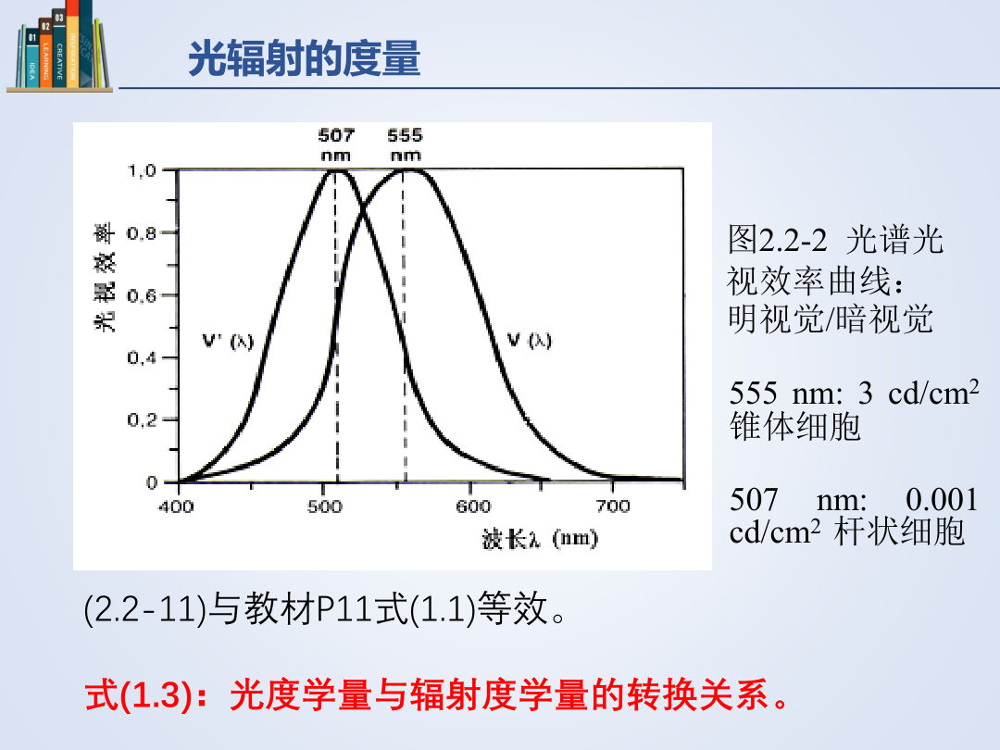

### 本页文字

```text
光辐射的度量

                                     图2.2-2 光谱光
                   视效率曲线：
                     明视觉/暗视觉

                                       555 nm: 3 cd/cm2
                   锥体细胞

                                       507  nm:  0.001
                                          cd/cm2 杆状细胞

(2.2-11)与教材P11式(1.1)等效。

式(1.3)：光度学量与辐射度学量的转换关系。
```

## 第 34 页

**页面标题/首行：** 单选题 1分

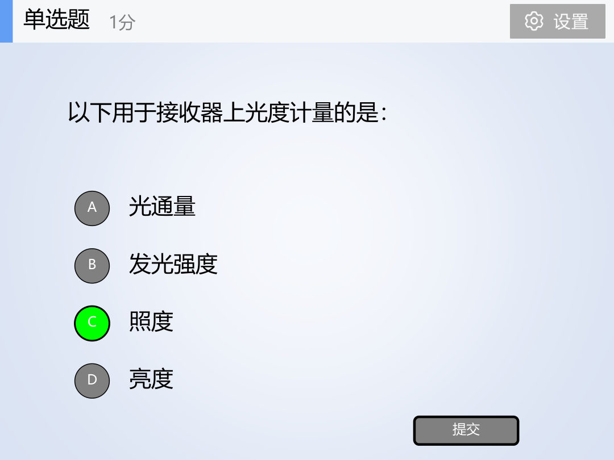

### 本页文字

```text
单选题 1分

  以下用于接收器上光度计量的是：

       A     光通量

        B     发光强度

       C     照度

      D     亮度

                                提交
```

## 第 35 页

**页面标题/首行：** 光源是光辐射源的简称。光源可以分为天然光源和人造光源。

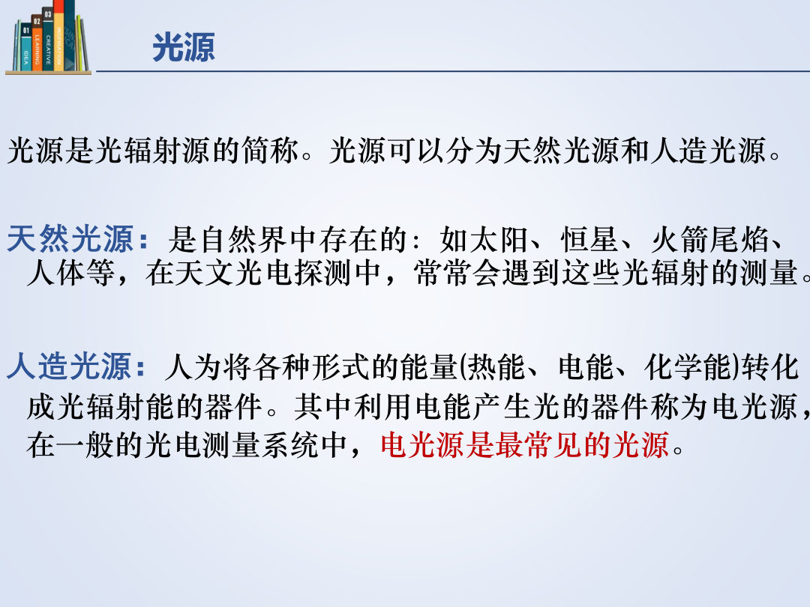

### 本页文字

```text
光源

光源是光辐射源的简称。光源可以分为天然光源和人造光源。

天然光源：是自然界中存在的：如太阳、恒星、火箭尾焰、
 人体等，在天文光电探测中，常常会遇到这些光辐射的测量。

人造光源：人为将各种形式的能量(热能、电能、化学能)转化
 成光辐射能的器件。其中利用电能产生光的器件称为电光源，
 在一般的光电测量系统中，电光源是最常见的光源。
```

## 第 36 页

**页面标题/首行：** 一、光的辐射

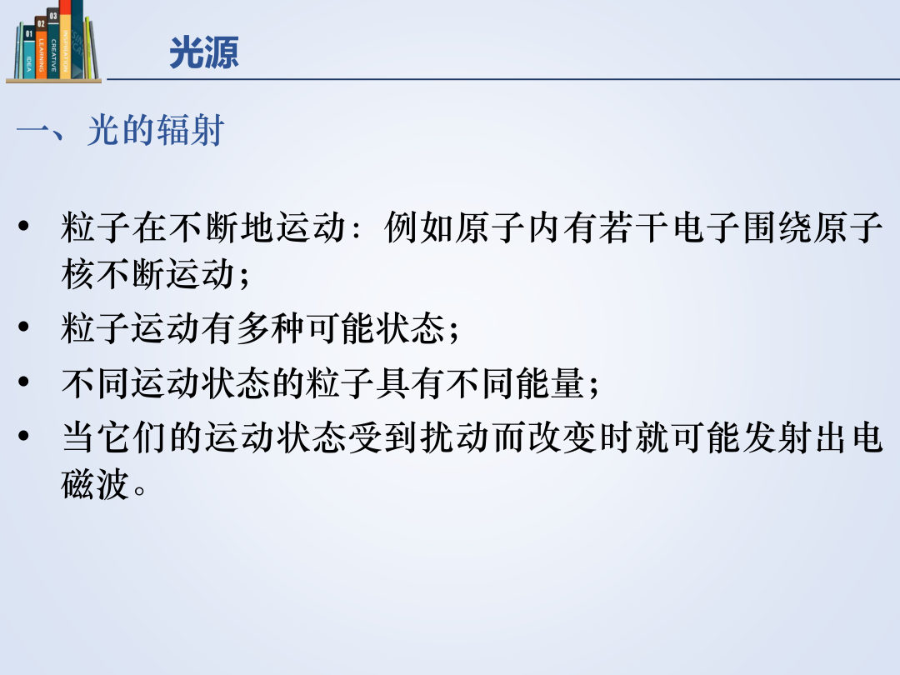

### 本页文字

```text
光源

一、光的辐射

• 粒子在不断地运动：例如原子内有若干电子围绕原子
 核不断运动；
• 粒子运动有多种可能状态；
• 不同运动状态的粒子具有不同能量；
• 当它们的运动状态受到扰动而改变时就可能发射出电
 磁波。
```

## 第 37 页

**页面标题/首行：** 原理：假设E0、E1为电子的两个运动状态，E0为基态，电子

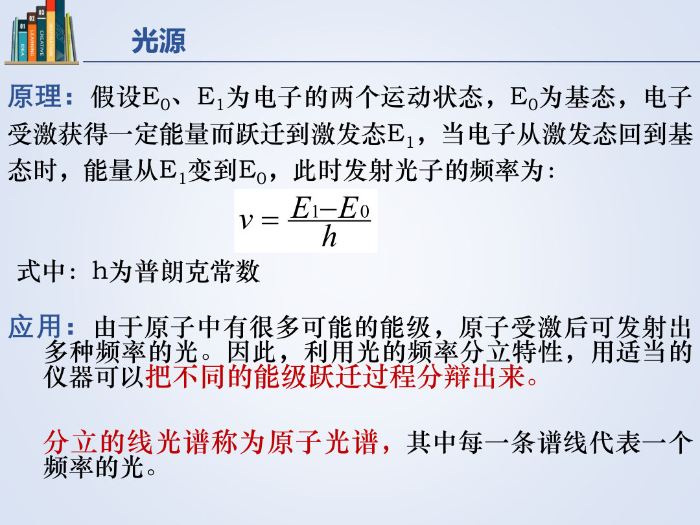

### 本页文字

```text
光源

原理：假设E0、E1为电子的两个运动状态，E0为基态，电子
受激获得一定能量而跃迁到激发态E1，当电子从激发态回到基
态时，能量从E1变到E0，此时发射光子的频率为：
              E 1− E 0                v =                   h
式中：h为普朗克常数

应用：由于原子中有很多可能的能级，原子受激后可发射出
 多种频率的光。因此，利用光的频率分立特性，用适当的
 仪器可以把不同的能级跃迁过程分辩出来。

 分立的线光谱称为原子光谱，其中每一条谱线代表一个
 频率的光。
```

## 第 38 页

**页面标题/首行：** 二、光辐射的产生方法

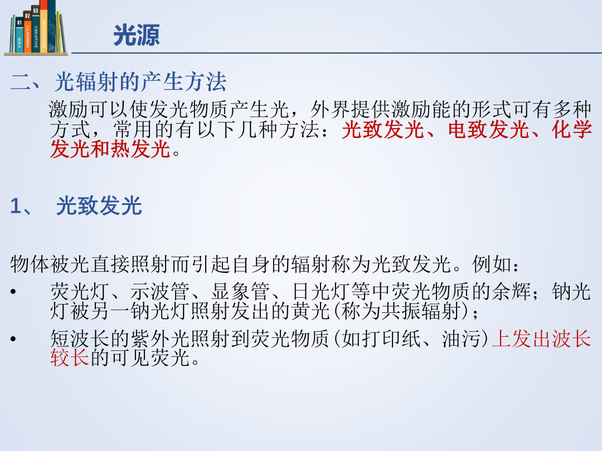

### 本页文字

```text
光源

二、光辐射的产生方法
  激励可以使发光物质产生光，外界提供激励能的形式可有多种
  方式，常用的有以下几种方法：光致发光、电致发光、化学
  发光和热发光。

1、 光致发光

物体被光直接照射而引起自身的辐射称为光致发光。例如：
•  荧光灯、示波管、显象管、日光灯等中荧光物质的余辉；钠光
  灯被另一钠光灯照射发出的黄光(称为共振辐射)；
•  短波长的紫外光照射到荧光物质(如打印纸、油污)上发出波长
  较长的可见荧光。
```

## 第 39 页

**页面标题/首行：** 【光致发光原理】

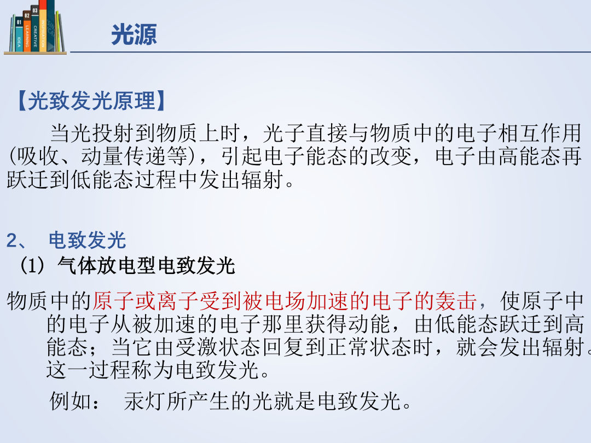

### 本页文字

```text
光源

【光致发光原理】
  当光投射到物质上时，光子直接与物质中的电子相互作用
(吸收、动量传递等)，引起电子能态的改变，电子由高能态再
跃迁到低能态过程中发出辐射。

2、 电致发光
 (1) 气体放电型电致发光

物质中的原子或离子受到被电场加速的电子的轰击，使原子中
  的电子从被加速的电子那里获得动能，由低能态跃迁到高
  能态；当它由受激状态回复到正常状态时，就会发出辐射。
  这一过程称为电致发光。
  例如： 汞灯所产生的光就是电致发光。
```

## 第 40 页

**页面标题/首行：** (2). 注入复合型电致发光

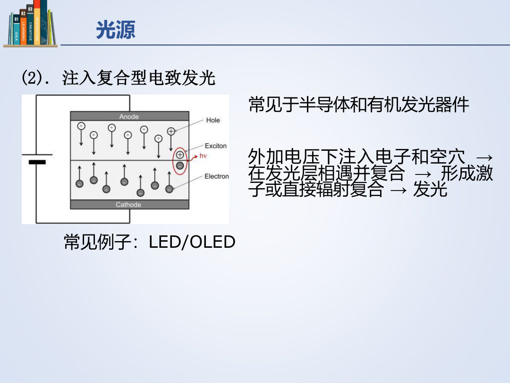

### 本页文字

```text
光源

(2). 注入复合型电致发光
             常见于半导体和有机发光器件

             外加电压下注入电子和空穴 →
             在发光层相遇并复合 → 形成激
             子或直接辐射复合 → 发光

   常见例子：LED/OLED
```

## 第 41 页

**页面标题/首行：** 3、化学发光

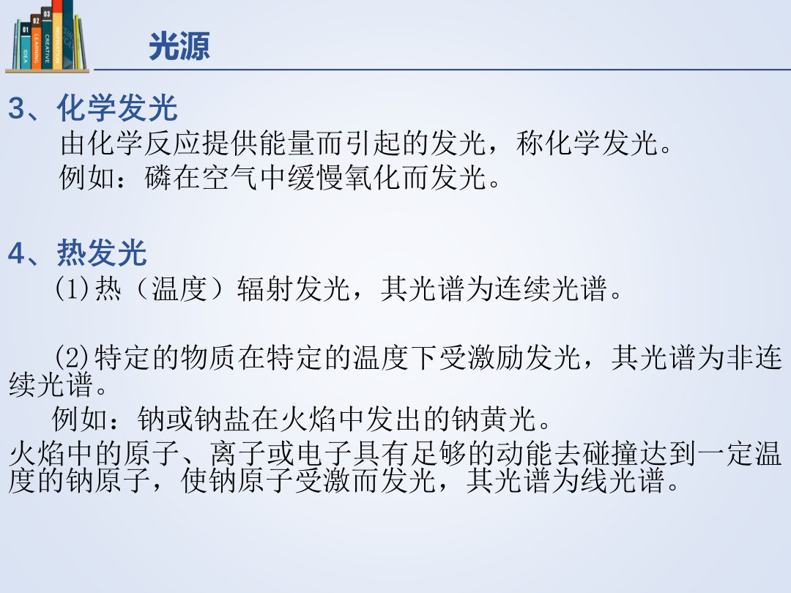

### 本页文字

```text
光源

3、化学发光
  由化学反应提供能量而引起的发光，称化学发光。
  例如：磷在空气中缓慢氧化而发光。

4、热发光
  (1)热（温度）辐射发光，其光谱为连续光谱。

  (2)特定的物质在特定的温度下受激励发光，其光谱为非连
续光谱。
 例如：钠或钠盐在火焰中发出的钠黄光。
火焰中的原子、离子或电子具有足够的动能去碰撞达到一定温
度的钠原子，使钠原子受激而发光，其光谱为线光谱。
```

## 第 42 页

**页面标题/首行：** 平衡和非平衡辐射：

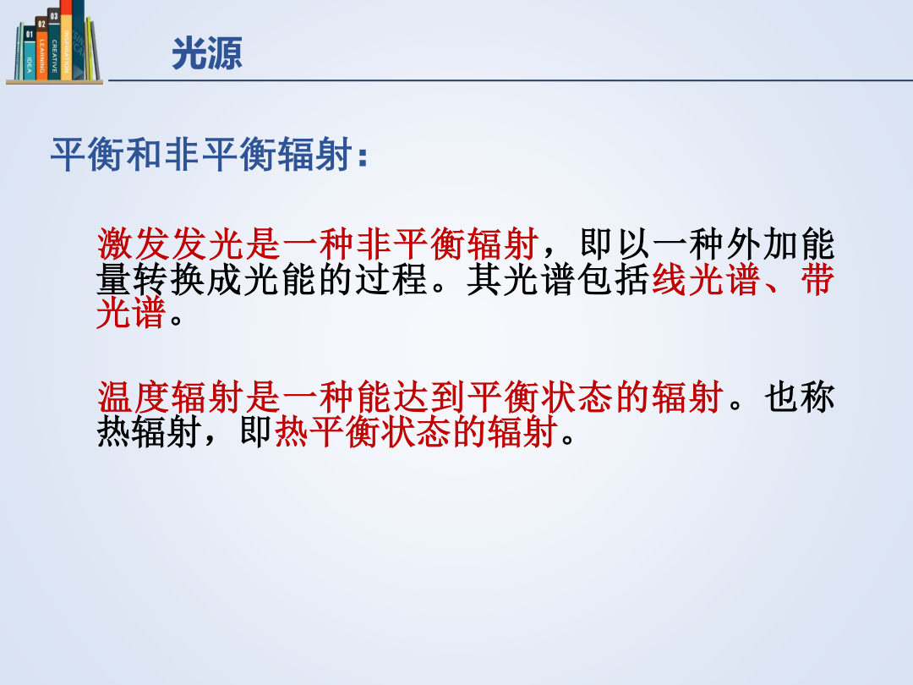

### 本页文字

```text
光源

平衡和非平衡辐射：

 激发发光是一种非平衡辐射，即以一种外加能
 量转换成光能的过程。其光谱包括线光谱、带
 光谱。

 温度辐射是一种能达到平衡状态的辐射。也称
 热辐射，即热平衡状态的辐射。
```

## 第 43 页

**页面标题/首行：** 分类：按照发光机理，光源可以分成如下几类：

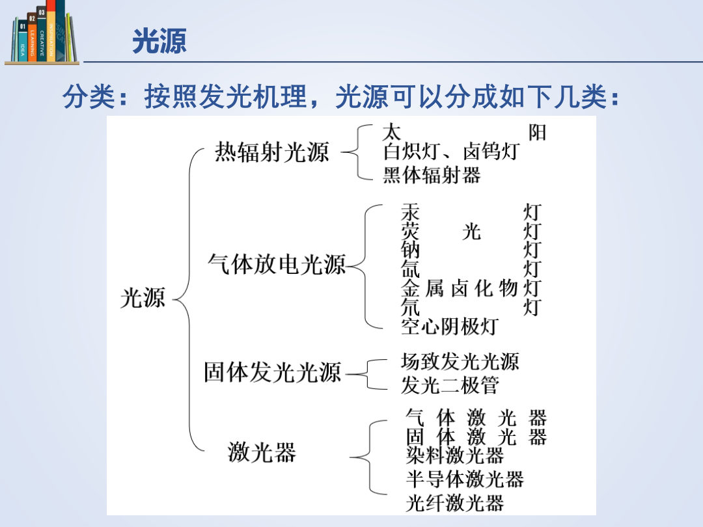

### 本页文字

```text
光源

分类：按照发光机理，光源可以分成如下几类：
```

## 第 44 页

**页面标题/首行：** 任何0 K温度以上的物体，都会由于其中的

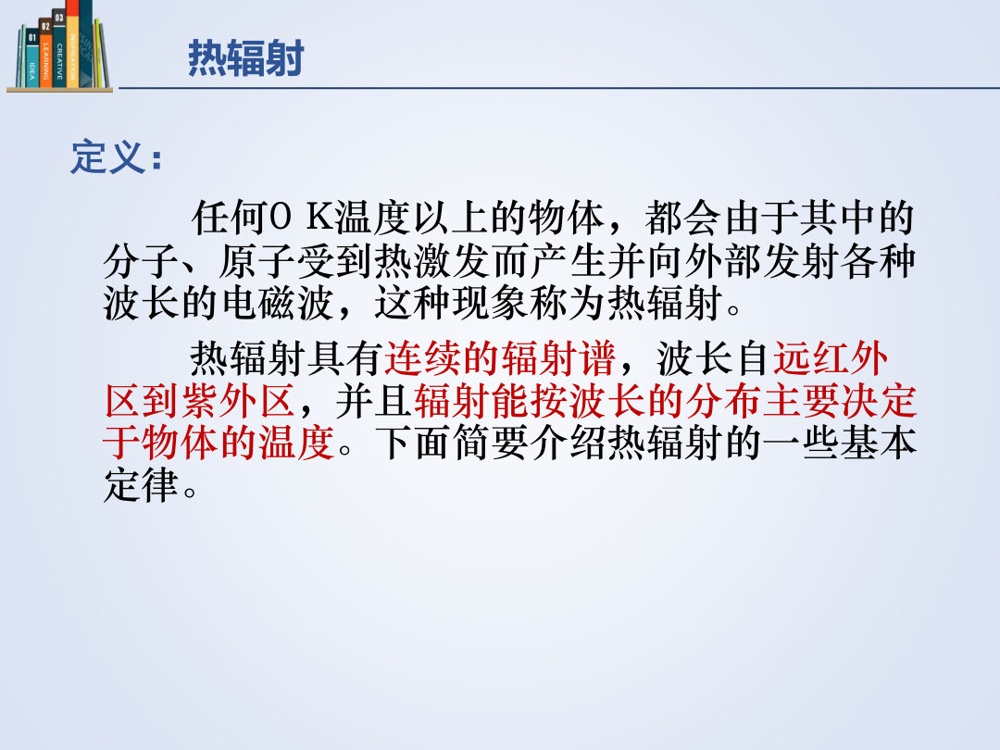

### 本页文字

```text
热辐射

定义：
    任何0 K温度以上的物体，都会由于其中的
 分子、原子受到热激发而产生并向外部发射各种
 波长的电磁波，这种现象称为热辐射。
   热辐射具有连续的辐射谱，波长自远红外
 区到紫外区，并且辐射能按波长的分布主要决定
 于物体的温度。下面简要介绍热辐射的一些基本
 定律。
```

## 第 45 页

**页面标题/首行：** 辐射的分类：热辐射和发光辐射

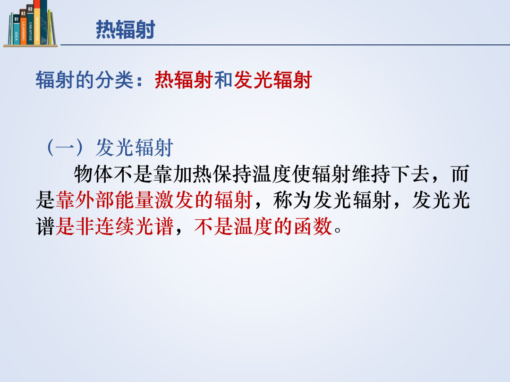

### 本页文字

```text
热辐射

辐射的分类：热辐射和发光辐射

（一）发光辐射
  物体不是靠加热保持温度使辐射维持下去，而
是靠外部能量激发的辐射，称为发光辐射，发光光
谱是非连续光谱，不是温度的函数。
```

## 第 46 页

**页面标题/首行：** （二）热辐射

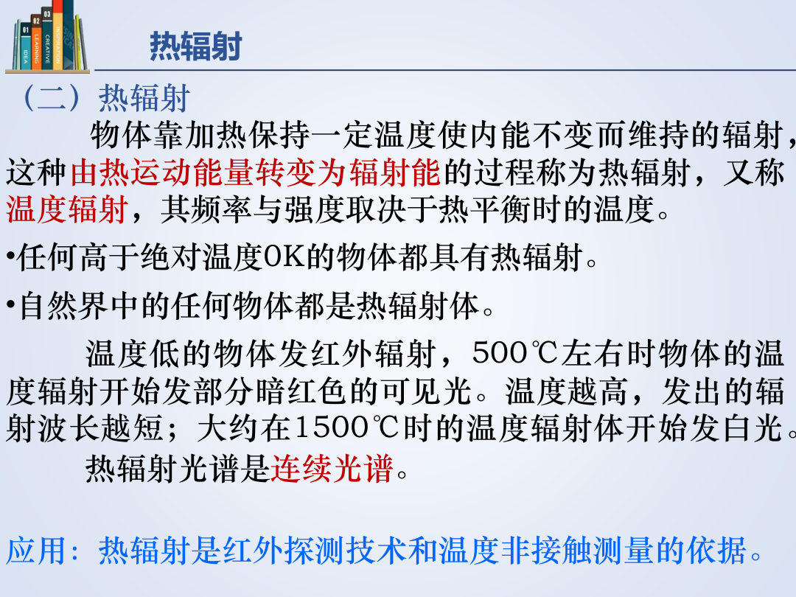

### 本页文字

```text
热辐射
（二）热辐射
   物体靠加热保持一定温度使内能不变而维持的辐射，
这种由热运动能量转变为辐射能的过程称为热辐射，又称
温度辐射，其频率与强度取决于热平衡时的温度。
•任何高于绝对温度0K的物体都具有热辐射。
•自然界中的任何物体都是热辐射体。
   温度低的物体发红外辐射，500℃左右时物体的温
度辐射开始发部分暗红色的可见光。温度越高，发出的辐
射波长越短；大约在1500℃时的温度辐射体开始发白光。
   热辐射光谱是连续光谱。

应用：热辐射是红外探测技术和温度非接触测量的依据。
```

## 第 47 页

**页面标题/首行：** 漆黑环境中的人和铁丝网的温差

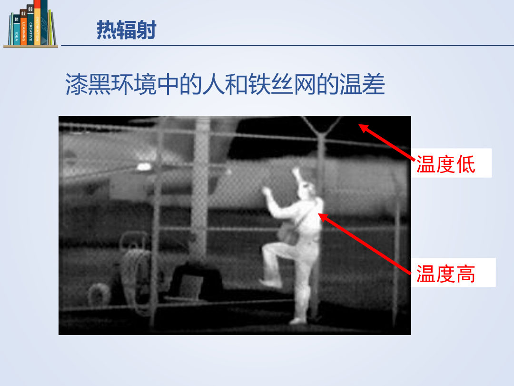

### 本页文字

```text
热辐射

漆黑环境中的人和铁丝网的温差

                  温度低

                  温度高
```

## 第 48 页

**页面标题/首行：** 红外遥感热像光谱辐射仪     重庆红外遥感地图

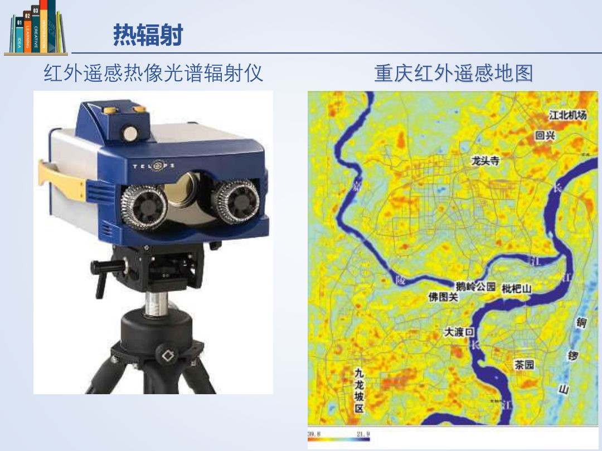

### 本页文字

```text
热辐射

红外遥感热像光谱辐射仪     重庆红外遥感地图
```

## 第 49 页

**页面标题/首行：** 一、单色吸收比和单色反射比

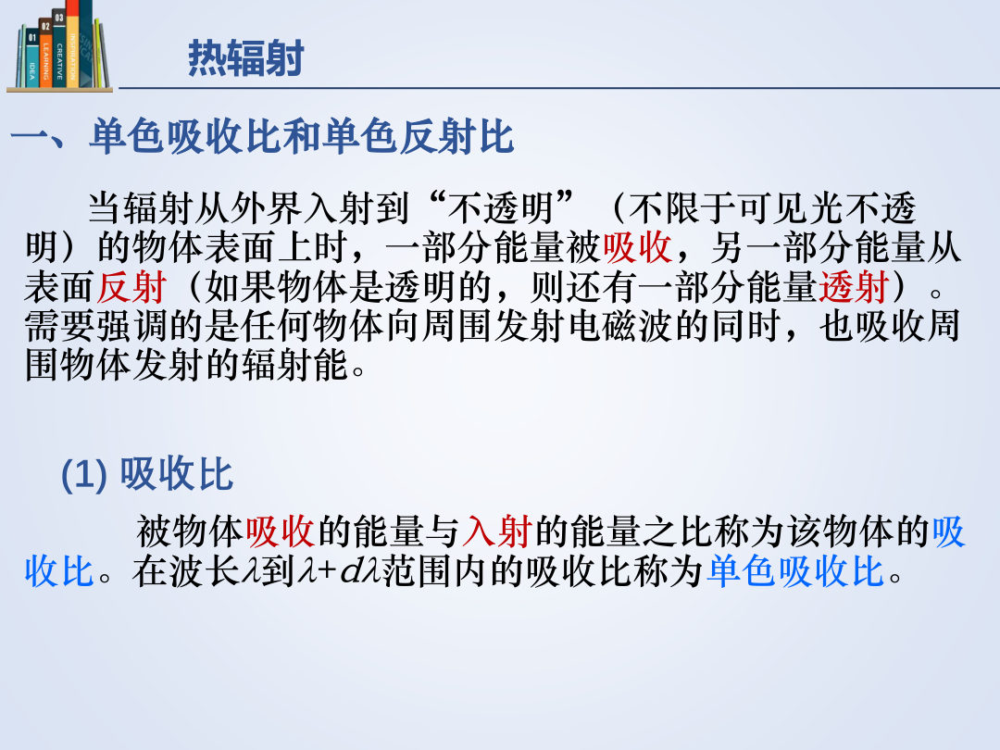

### 本页文字

```text
热辐射

一、单色吸收比和单色反射比

  当辐射从外界入射到“不透明”（不限于可见光不透
明）的物体表面上时，一部分能量被吸收，另一部分能量从
表面反射（如果物体是透明的，则还有一部分能量透射）。
需要强调的是任何物体向周围发射电磁波的同时，也吸收周
围物体发射的辐射能。

   (1) 吸收比
   被物体吸收的能量与入射的能量之比称为该物体的吸
收比。在波长到+d范围内的吸收比称为单色吸收比。
```

## 第 50 页

**页面标题/首行：** (2) 反射比

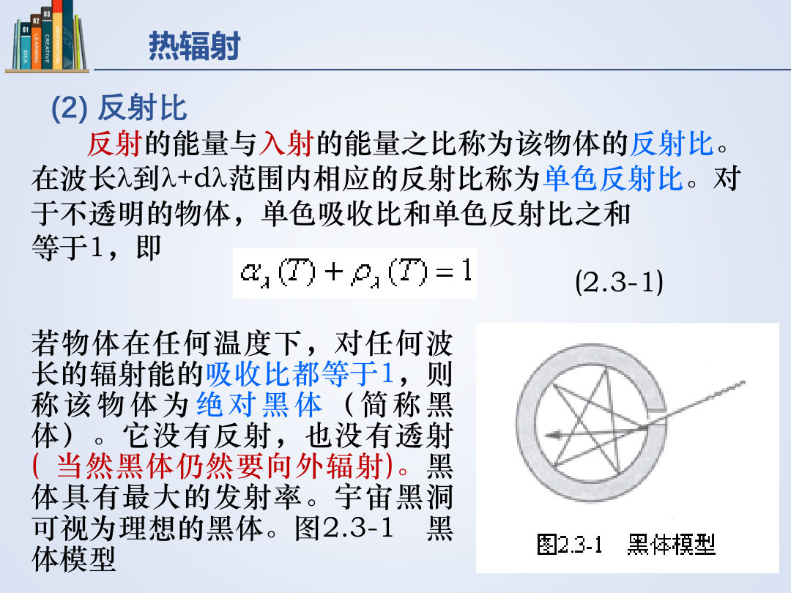

### 本页文字

```text
热辐射

  (2) 反射比
  反射的能量与入射的能量之比称为该物体的反射比。
在波长到+d范围内相应的反射比称为单色反射比。对
于不透明的物体，单色吸收比和单色反射比之和
等于1，即
                                          (2.3-1)

若物体在任何温度下，对任何波
长的辐射能的吸收比都等于1，则
称该物体为绝对黑体（简称黑
体）。它没有反射，也没有透射
( 当然黑体仍然要向外辐射)。黑
体具有最大的发射率。宇宙黑洞
可视为理想的黑体。图2.3-1 黑
体模型
```

## 第 51 页

**页面标题/首行：** (3) 人工黑体

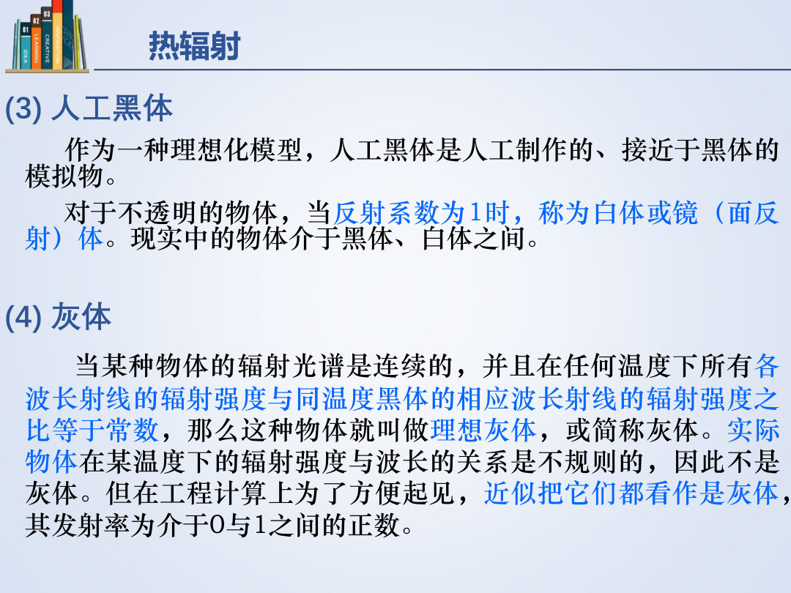

### 本页文字

```text
热辐射

(3) 人工黑体
  作为一种理想化模型，人工黑体是人工制作的、接近于黑体的
 模拟物。
  对于不透明的物体，当反射系数为1时，称为白体或镜（面反
 射）体。现实中的物体介于黑体、白体之间。

(4) 灰体
   当某种物体的辐射光谱是连续的，并且在任何温度下所有各
 波长射线的辐射强度与同温度黑体的相应波长射线的辐射强度之
 比等于常数，那么这种物体就叫做理想灰体，或简称灰体。实际
 物体在某温度下的辐射强度与波长的关系是不规则的，因此不是
 灰体。但在工程计算上为了方便起见，近似把它们都看作是灰体，
 其发射率为介于0与1之间的正数。
```

## 第 52 页

**页面标题/首行：** 某一温度下灰体的辐射具有与同温度下黑体

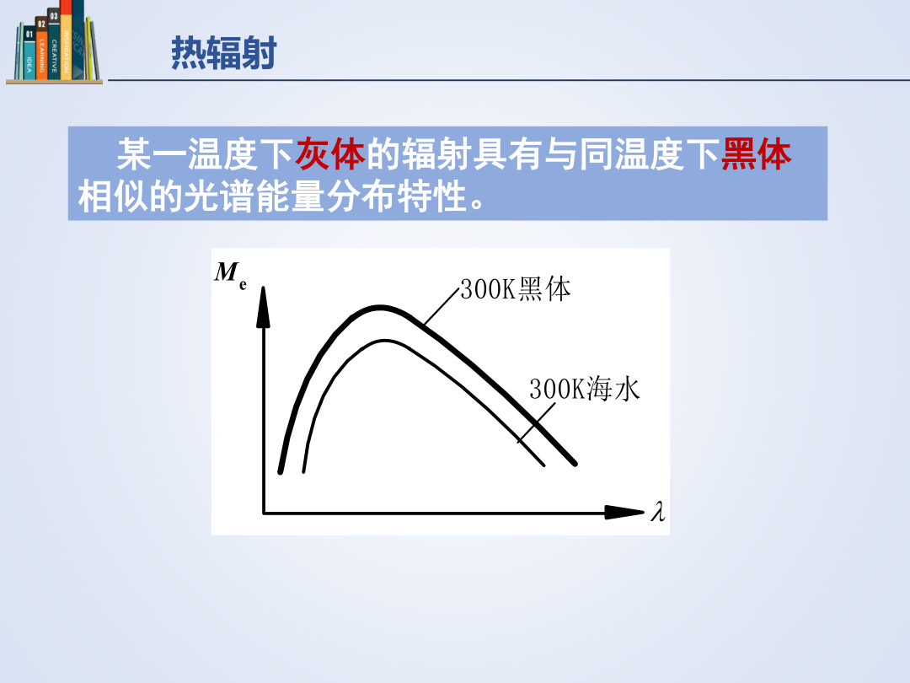

### 本页文字

```text
热辐射

 某一温度下灰体的辐射具有与同温度下黑体
相似的光谱能量分布特性。

        Me(                    300K黑体

                        300K海水

                      
```

## 第 53 页

**页面标题/首行：** 填空题 2分

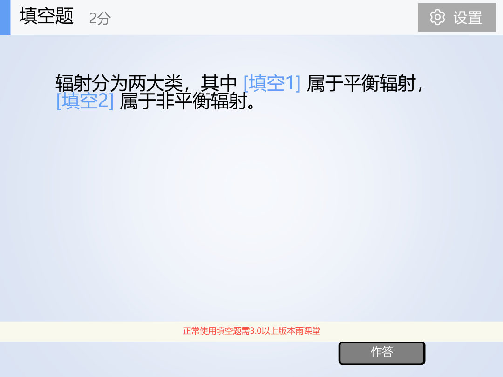

### 本页文字

```text
填空题 2分

  辐射分为两大类，其中 [填空1] 属于平衡辐射，
   [填空2] 属于非平衡辐射。

                     正常使用填空题需3.0以上版本雨课堂

                                作答
```

## 第 54 页

**页面标题/首行：** 调研报告/做汇报要求

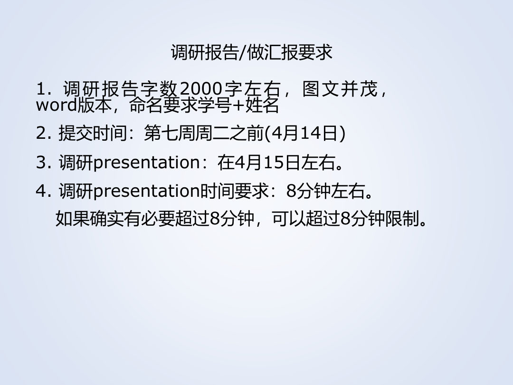

### 本页文字

```text
调研报告/做汇报要求

1. 调研报告字数2000字左右，图文并茂，
word版本，命名要求学号+姓名
2. 提交时间：第七周周二之前(4月14日)
3. 调研presentation：在4月15日左右。
4. 调研presentation时间要求：8分钟左右。
 如果确实有必要超过8分钟，可以超过8分钟限制。
```

## 第 55 页

**页面标题/首行：** 1. 可见光范围

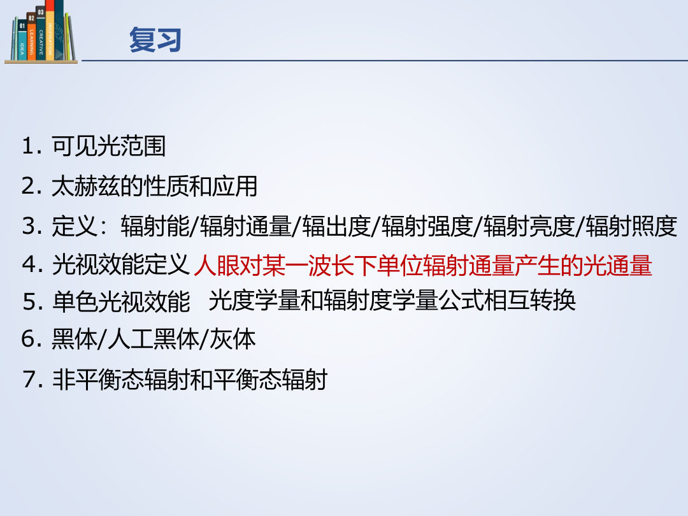

### 本页文字

```text
复习

1. 可见光范围
2. 太赫兹的性质和应用
3. 定义：辐射能/辐射通量/辐出度/辐射强度/辐射亮度/辐射照度
4. 光视效能定义 人眼对某一波长下单位辐射通量产生的光通量
5. 单色光视效能 光度学量和辐射度学量公式相互转换
6. 黑体/人工黑体/灰体
7. 非平衡态辐射和平衡态辐射
```

## 第 56 页

**页面标题/首行：** 二、基尔霍夫辐射定律

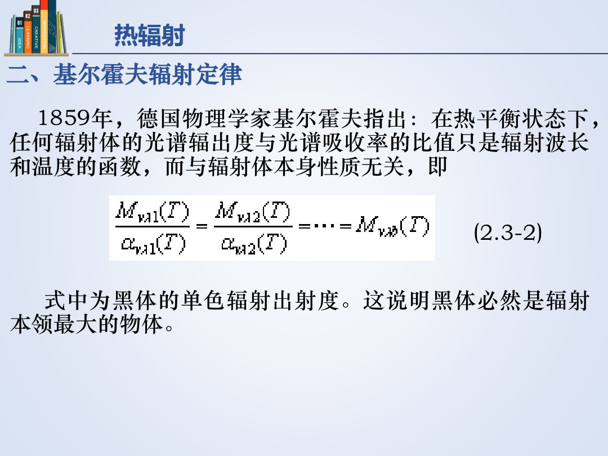

### 本页文字

```text
热辐射
二、基尔霍夫辐射定律

 1859年，德国物理学家基尔霍夫指出：在热平衡状态下，
任何辐射体的光谱辐出度与光谱吸收率的比值只是辐射波长
和温度的函数，而与辐射体本身性质无关，即

                                               (2.3-2)

  式中为黑体的单色辐射出射度。这说明黑体必然是辐射
本领最大的物体。
```

## 第 57 页

**页面标题/首行：** 基尔霍夫介绍

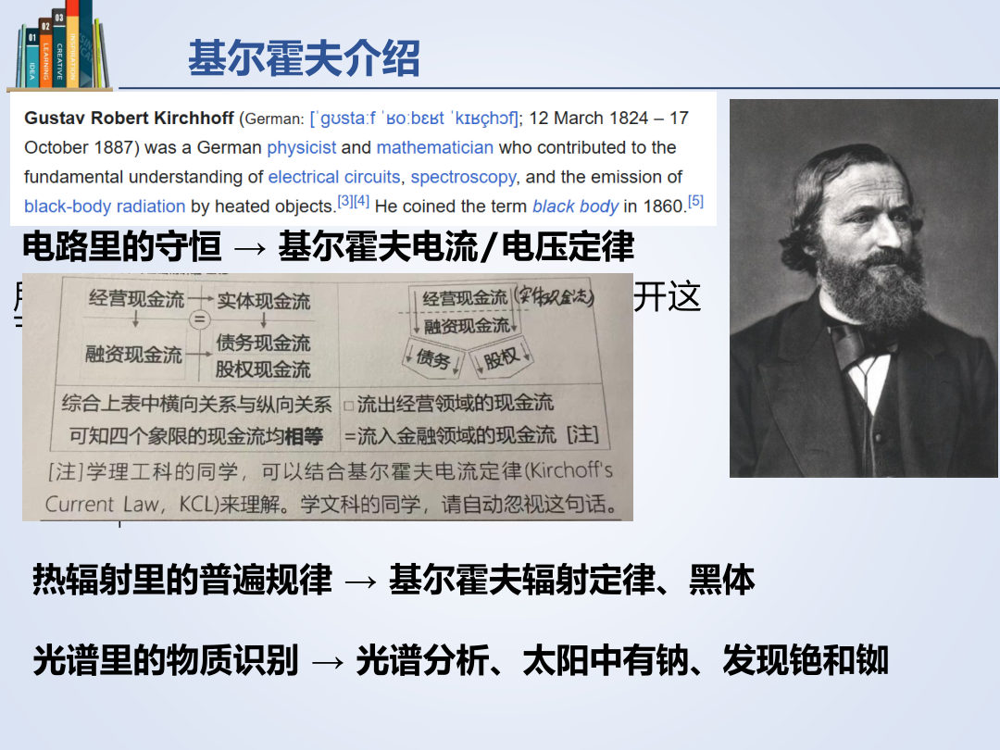

### 本页文字

```text
基尔霍夫介绍

电路里的守恒 → 基尔霍夫电流/电压定律
所有进入某节点的电流的总和等于所有离开这
节点的电流的总和。

 热辐射里的普遍规律 → 基尔霍夫辐射定律、黑体

 光谱里的物质识别 → 光谱分析、太阳中有钠、发现铯和铷
```

## 第 58 页

**页面标题/首行：** 三、普朗克公式

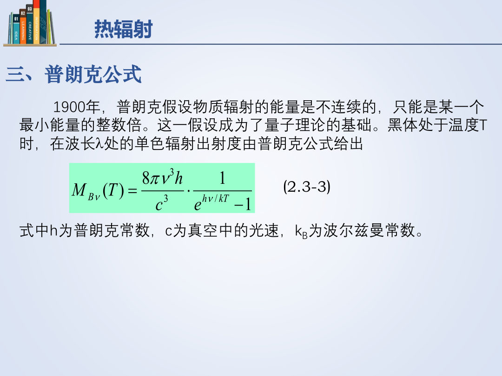

### 本页文字

```text
热辐射

三、普朗克公式

   1900年，普朗克假设物质辐射的能量是不连续的，只能是某一个
 最小能量的整数倍。这一假设成为了量子理论的基础。黑体处于温度T
 时，在波长处的单色辐射出射度由普朗克公式给出

                 83 h    1                                        (2.3-3)     M   (T ) =                          B             3       h/ kT                     c    e    − 1
 式中h为普朗克常数，c为真空中的光速，kB为波尔兹曼常数。
```

## 第 59 页

**页面标题/首行：** 右图：不同温度条件下黑体的

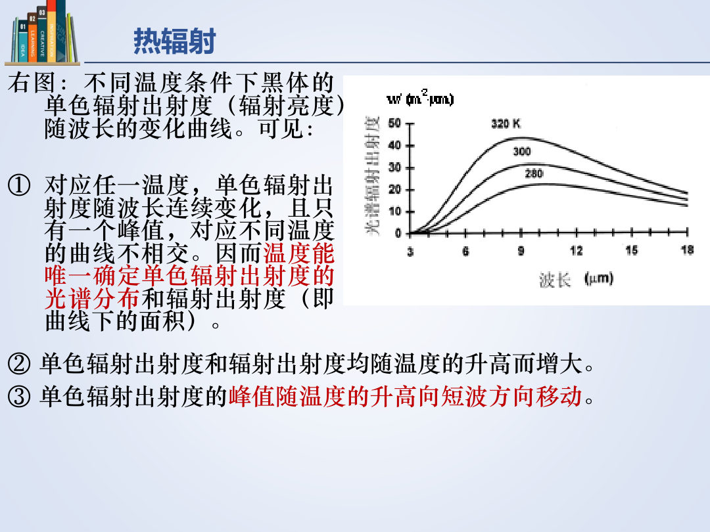

### 本页文字

```text
热辐射
右图：不同温度条件下黑体的
  单色辐射出射度（辐射亮度）
  随波长的变化曲线。可见：

① 对应任一温度，单色辐射出
 射度随波长连续变化，且只
 有一个峰值，对应不同温度
 的曲线不相交。因而温度能
 唯一确定单色辐射出射度的
 光谱分布和辐射出射度（即
  曲线下的面积）。
②单色辐射出射度和辐射出射度均随温度的升高而增大。
③ 单色辐射出射度的峰值随温度的升高向短波方向移动。
```

## 第 60 页

**页面标题/首行：** 四、维恩位移定律

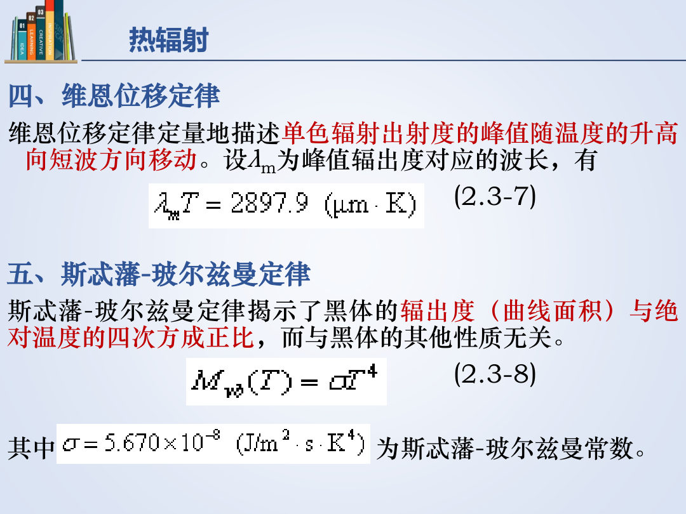

### 本页文字

```text
热辐射

四、维恩位移定律
维恩位移定律定量地描述单色辐射出射度的峰值随温度的升高
 向短波方向移动。设λm为峰值辐出度对应的波长，有
                                     (2.3-7)

五、斯忒藩-玻尔兹曼定律
斯忒藩-玻尔兹曼定律揭示了黑体的辐出度（曲线面积）与绝
对温度的四次方成正比，而与黑体的其他性质无关。
                                     (2.3-8)

其中              为斯忒藩-玻尔兹曼常数。
```

## 第 61 页

**页面标题/首行：** 单选题 1分

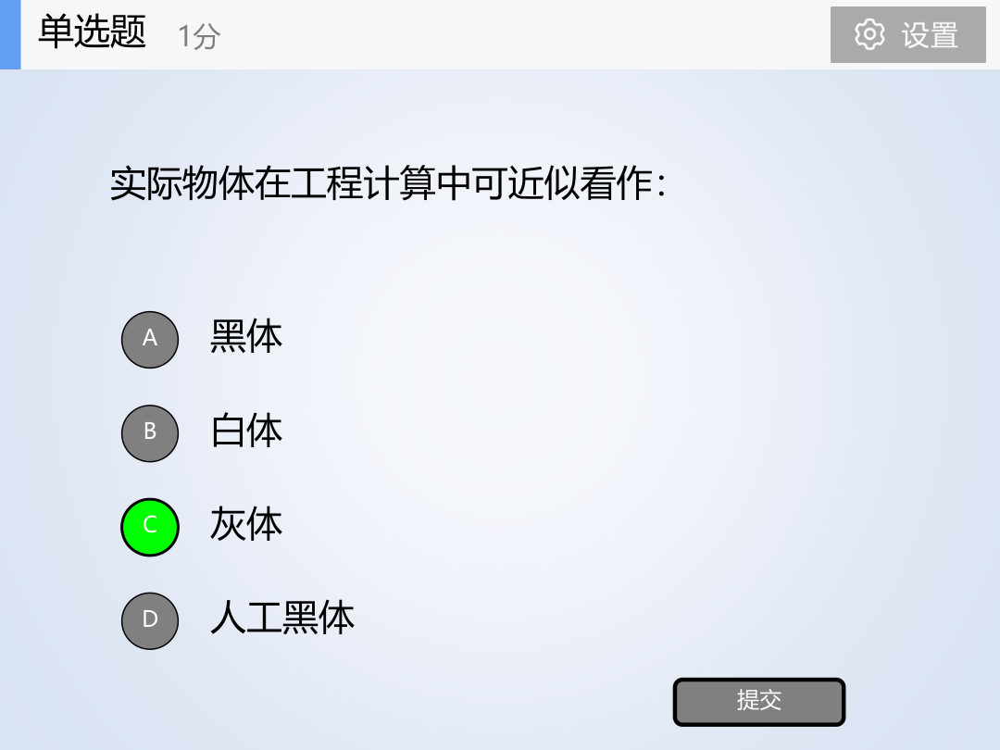

### 本页文字

```text
单选题 1分

  实际物体在工程计算中可近似看作：

       A     黑体

        B     白体

       C     灰体

      D     人工黑体

                                提交
```

## 第 62 页

**页面标题/首行：** 三、光源的特性参数

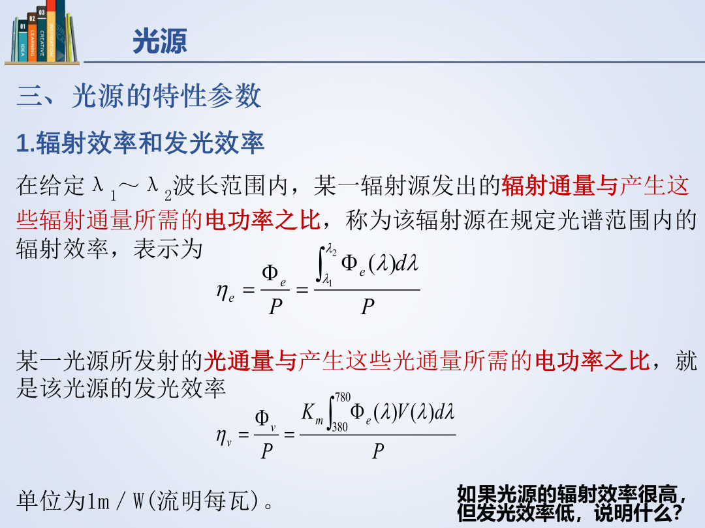

### 本页文字

```text
光源

三、光源的特性参数

1.辐射效率和发光效率

在给定λ1～λ2波长范围内，某一辐射源发出的辐射通量与产生这
些辐射通量所需的电功率之比，称为该辐射源在规定光谱范围内的
辐射效率，表示为          2
                                                 ()d                                                              e                                                              e  1          =    =                                      e
                   P      P

某一光源所发射的光通量与产生这些光通量所需的电功率之比，就
是该光源的发光效率                                                            780
                       K          ()V () d                                      m         e                                                                      v   380            =   =                                            v
                      P         P

                      如果光源的辐射效率很高，单位为1m／W(流明每瓦)。                       但发光效率低，说明什么？
```

## 第 63 页

**页面标题/首行：** 下表所列的为一些常用光源的发光效率。

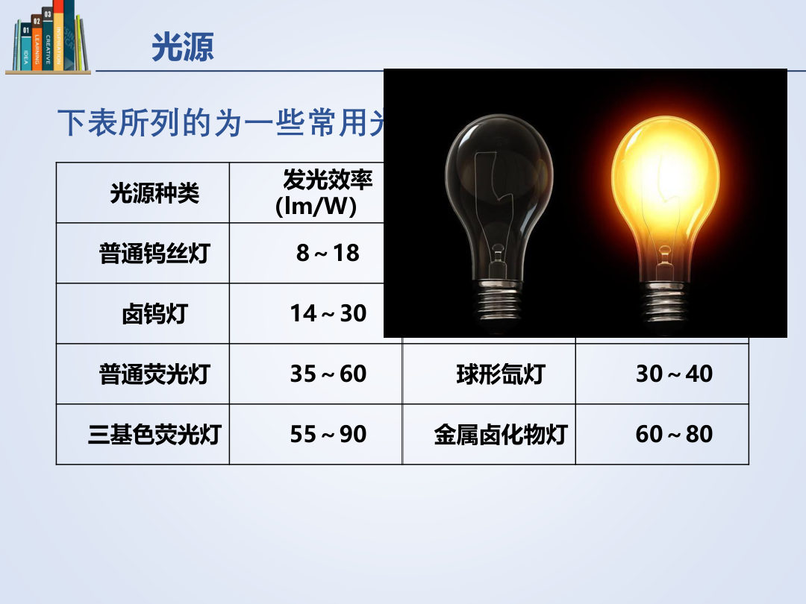

### 本页文字

```text
光源

下表所列的为一些常用光源的发光效率。

          发光效率           发光效率  光源种类           光源种类           （lm/W）             （lm/W）

  普通钨丝灯     8～18    高压汞灯      30～40

   卤钨灯      14～30    高压钠灯     90～100

  普通荧光灯     35～60    球形氙灯      30～40

 三基色荧光灯    55～90   金属卤化物灯    60～80
```

## 第 64 页

**页面标题/首行：** 光化学实验中如何选择LED、氙灯、汞灯3种光源

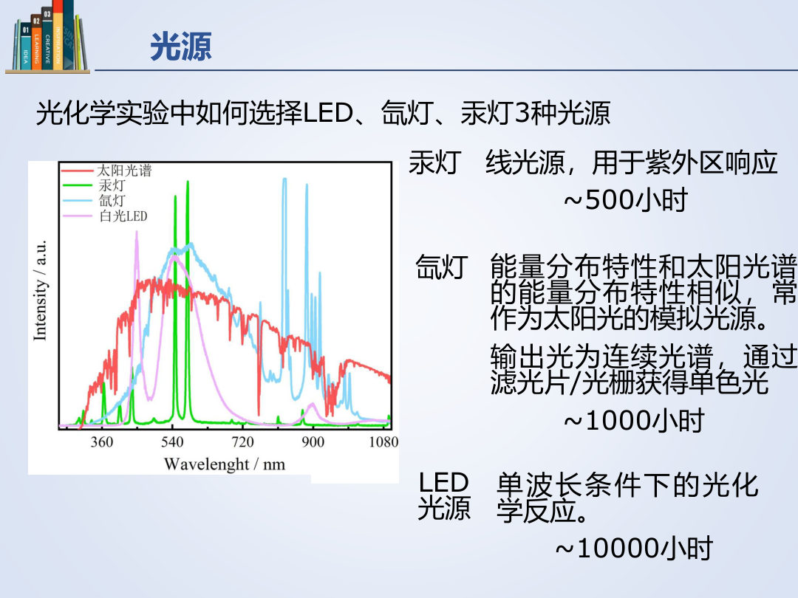

### 本页文字

```text
光源

光化学实验中如何选择LED、氙灯、汞灯3种光源
              汞灯 线光源，用于紫外区响应
                         ~500小时

              氙灯 能量分布特性和太阳光谱
                的能量分布特性相似，常
                 作为太阳光的模拟光源。
                输出光为连续光谱，通过
                  滤光片/光栅获得单色光
                          ~1000小时

                      LED 单波长条件下的光化
              光源 学反应。
                          ~10000小时
```

## 第 65 页

**页面标题/首行：** 2.光谱功率分布

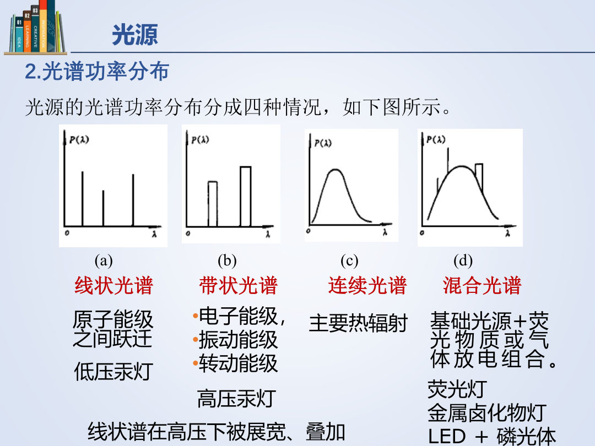

### 本页文字

```text
光源

2.光谱功率分布

光源的光谱功率分布分成四种情况，如下图所示。

           (a)                (b)                 (c)               (d)
  线状光谱  带状光谱  连续光谱  混合光谱
         •电子能级，  原子能级              主要热辐射 基础光源+荧
  之间跃迁  •振动能级      光物质或气
                  体放电组合。          •转动能级  低压汞灯
                    荧光灯         高压汞灯
                    金属卤化物灯
   线状谱在高压下被展宽、叠加                               LED + 磷光体
```

## 第 66 页

**页面标题/首行：** 实验测得的He-Ne 激光谱线－－线状光谱

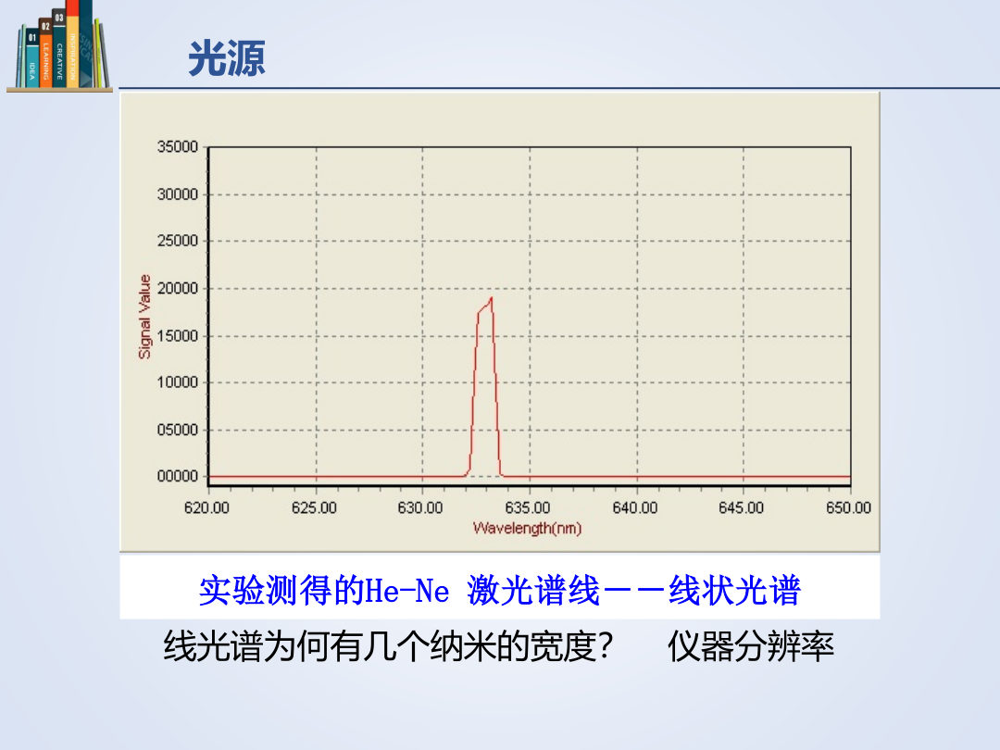

### 本页文字

```text
光源

 实验测得的He-Ne 激光谱线－－线状光谱
线光谱为何有几个纳米的宽度？ 仪器分辨率
```

## 第 67 页

**页面标题/首行：** 实验中测得的氙灯谱线－－连续光谱

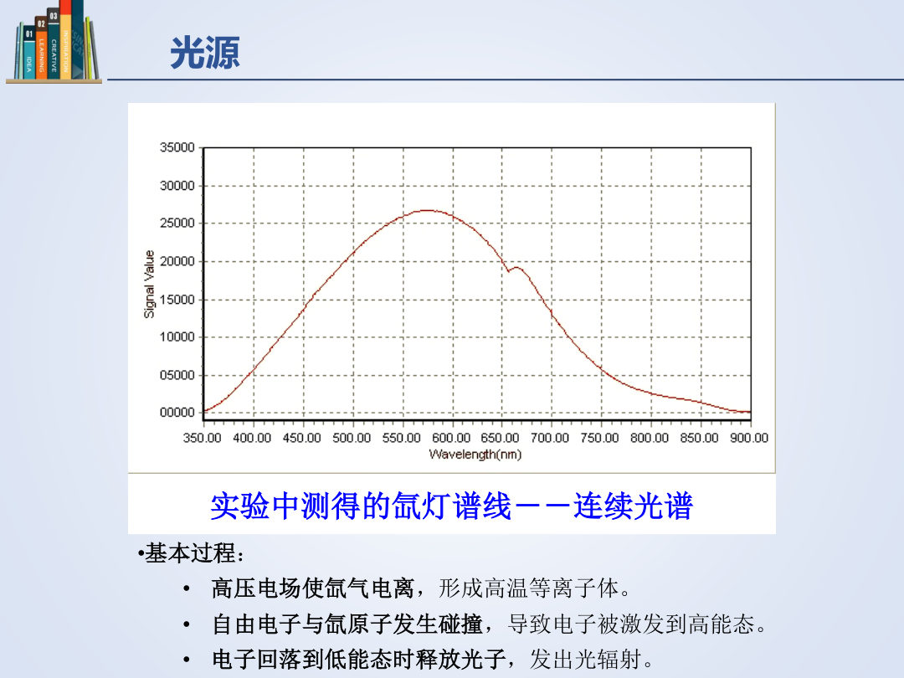

### 本页文字

```text
光源

  实验中测得的氙灯谱线－－连续光谱

•基本过程：
      • 高压电场使氙气电离，形成高温等离子体。
      • 自由电子与氙原子发生碰撞，导致电子被激发到高能态。
      • 电子回落到低能态时释放光子，发出光辐射。
```

## 第 68 页

**页面标题/首行：** 实验中测得的荧光灯谱线－－混合光谱

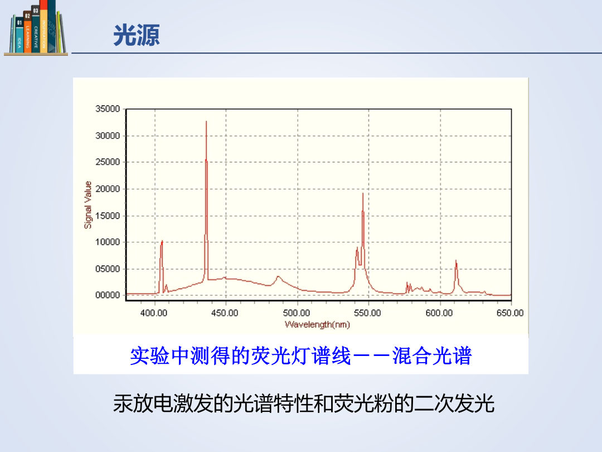

### 本页文字

```text
光源

 实验中测得的荧光灯谱线－－混合光谱

汞放电激发的光谱特性和荧光粉的二次发光
```

## 第 69 页

**页面标题/首行：** 受激辐射

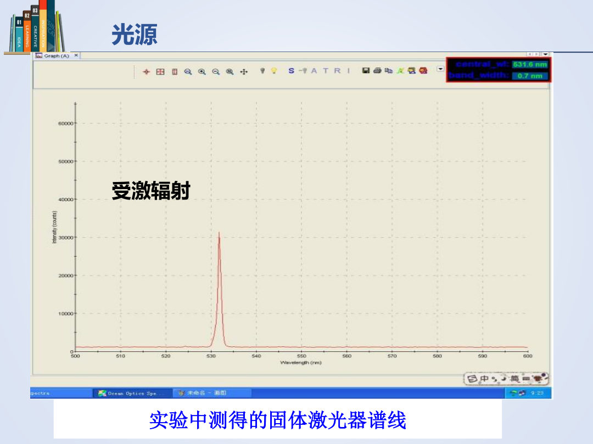

### 本页文字

```text
光源

受激辐射

  实验中测得的固体激光器谱线
```

## 第 70 页

**页面标题/首行：** Within the  bulb, an  electric

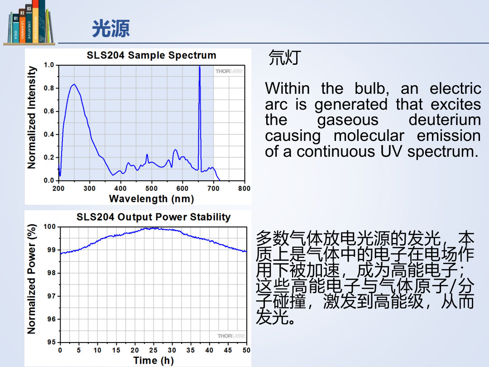

### 本页文字

```text
光源
           氘灯

                       Within the  bulb, an  electric
                       arc is generated that excites
                       the   gaseous    deuterium
                      causing  molecular  emission
                         of a continuous UV spectrum.

          多数气体放电光源的发光，本
          质上是气体中的电子在电场作
          用下被加速，成为高能电子；
          这些高能电子与气体原子/分
          子碰撞，激发到高能级，从而
          发光。
```

## 第 71 页

**页面标题/首行：** 根据光谱选择光源：

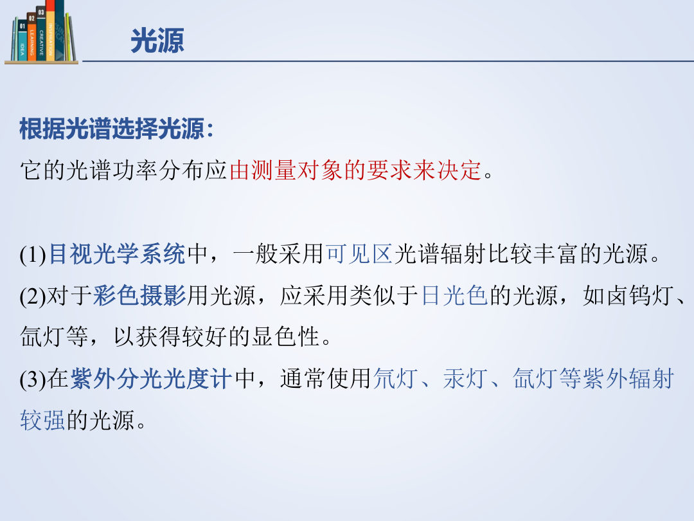

### 本页文字

```text
光源

根据光谱选择光源：

它的光谱功率分布应由测量对象的要求来决定。

(1)目视光学系统中，一般采用可见区光谱辐射比较丰富的光源。

(2)对于彩色摄影用光源，应采用类似于日光色的光源，如卤钨灯、

氙灯等，以获得较好的显色性。

(3)在紫外分光光度计中，通常使用氘灯、汞灯、氙灯等紫外辐射

较强的光源。
```

## 第 72 页

**页面标题/首行：** 单选题 1分

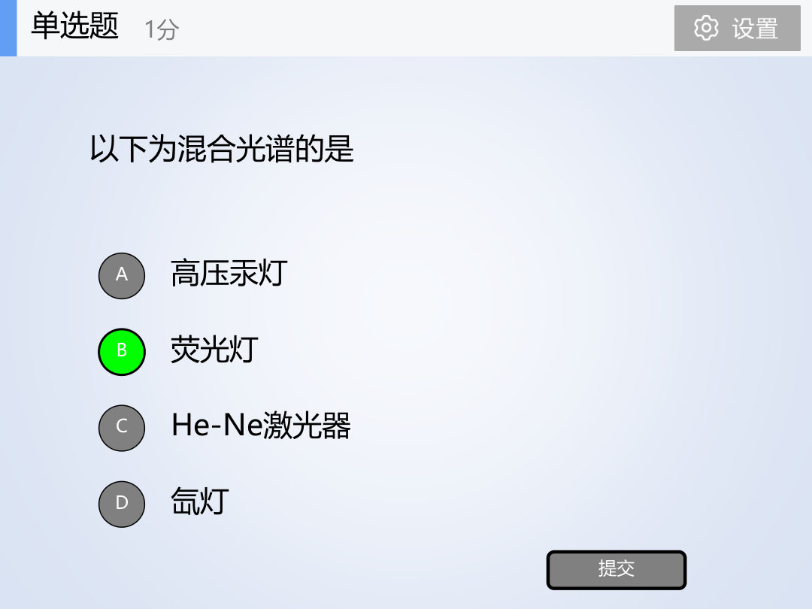

### 本页文字

```text
单选题 1分

  以下为混合光谱的是

       A     高压汞灯

        B     荧光灯

       C      He-Ne激光器

      D     氙灯

                                提交
```

## 第 73 页

**页面标题/首行：** 3、空间光强分布           灯管方向？

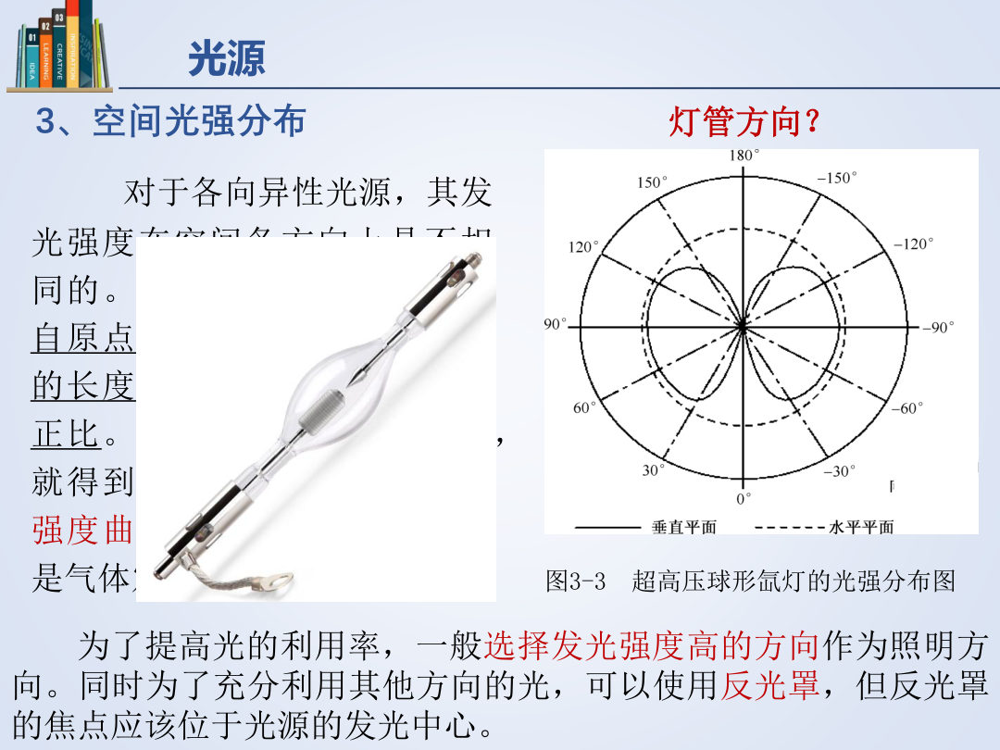

### 本页文字

```text
光源

 3、空间光强分布           灯管方向？

   对于各向异性光源，其发
 光强度在空间各方向上是不相
 同的。若在空间某一截面上，
 自原点向各径向取矢量，矢量
 的长度与该方向的发光强度成
 正比。将各矢量的端点连起来，
 就得到光源在该截面上的发光
 强度曲线，即配光曲线。右图
 是气体发光光源的光强分布。     图3-3 超高压球形氙灯的光强分布图

  为了提高光的利用率，一般选择发光强度高的方向作为照明方
向。同时为了充分利用其他方向的光，可以使用反光罩，但反光罩
的焦点应该位于光源的发光中心。
```

## 第 74 页

**页面标题/首行：** 4、光源的色温与颜色

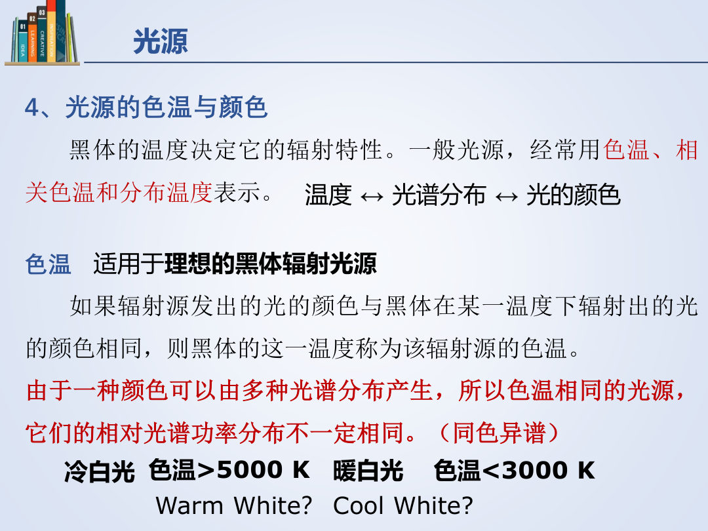

### 本页文字

```text
光源

4、光源的色温与颜色

  黑体的温度决定它的辐射特性。一般光源，经常用色温、相

关色温和分布温度表示。 温度  光谱分布  光的颜色

色温 适用于理想的黑体辐射光源

  如果辐射源发出的光的颜色与黑体在某一温度下辐射出的光

的颜色相同，则黑体的这一温度称为该辐射源的色温。

由于一种颜色可以由多种光谱分布产生，所以色温相同的光源，

它们的相对光谱功率分布不一定相同。（同色异谱）
  冷白光 色温>5000 K 暖白光  色温<3000 K
        Warm White？ Cool White?
```

## 第 75 页

**页面标题/首行：** 2700–3000 K

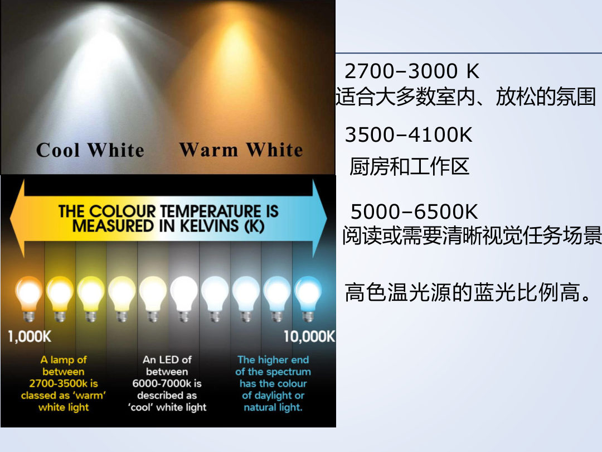

### 本页文字

```text
2700–3000 K
适合大多数室内、放松的氛围

 3500–4100K
 厨房和工作区

 5000–6500K
阅读或需要清晰视觉任务场景

高色温光源的蓝光比例高。
```

## 第 76 页

**页面标题/首行：** 天镜吸顶灯

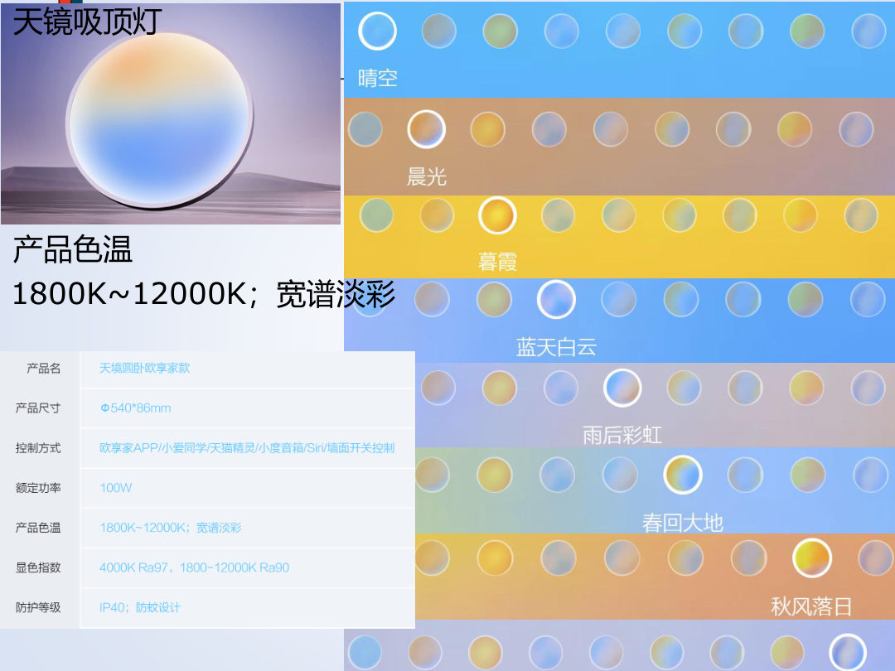

### 本页文字

```text
天镜吸顶灯

产品色温
1800K~12000K；宽谱淡彩
```

## 第 77 页

**页面标题/首行：** 家庭灯具选择

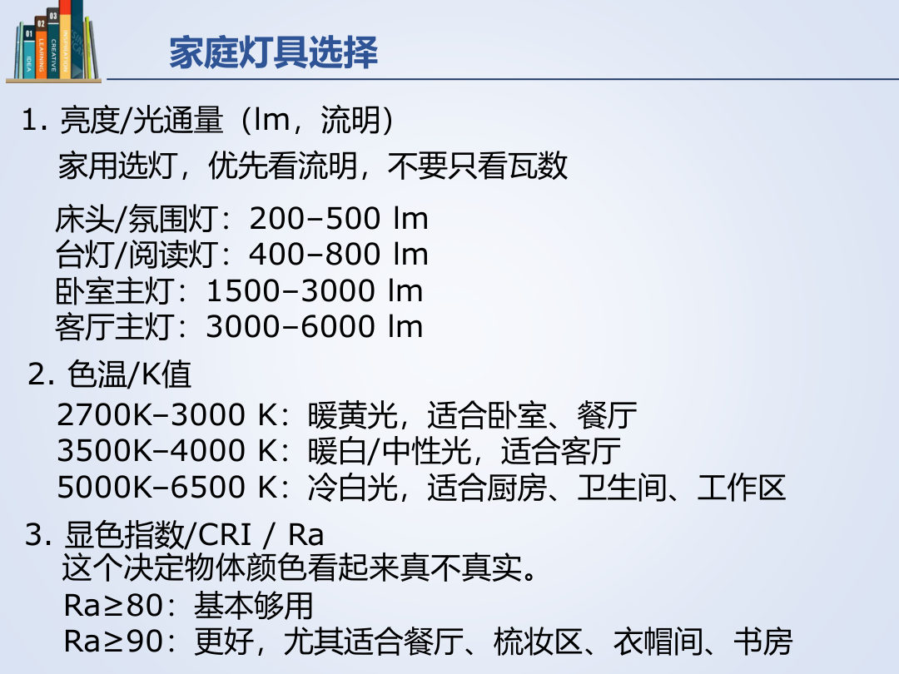

### 本页文字

```text
家庭灯具选择

1. 亮度/光通量（lm，流明）
 家用选灯，优先看流明，不要只看瓦数
  床头/氛围灯：200–500 lm
  台灯/阅读灯：400–800 lm
  卧室主灯：1500–3000 lm
  客厅主灯：3000–6000 lm
2. 色温/K值
  2700K–3000 K：暖黄光，适合卧室、餐厅
  3500K–4000 K：暖白/中性光，适合客厅
  5000K–6500 K：冷白光，适合厨房、卫生间、工作区
3. 显色指数/CRI / Ra
 这个决定物体颜色看起来真不真实。
  Ra≥80：基本够用
  Ra≥90：更好，尤其适合餐厅、梳妆区、衣帽间、书房
```

## 第 78 页

**页面标题/首行：** 家庭灯具选择

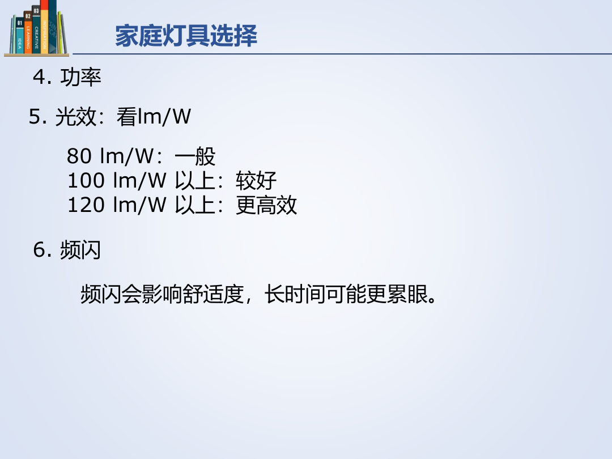

### 本页文字

```text
家庭灯具选择
4. 功率
5. 光效：看lm/W
   80 lm/W：一般
   100 lm/W 以上：较好
   120 lm/W 以上：更高效

6. 频闪

   频闪会影响舒适度，长时间可能更累眼。
```

## 第 79 页

**页面标题/首行：** 相关色温 适用于非黑体辐射的光源

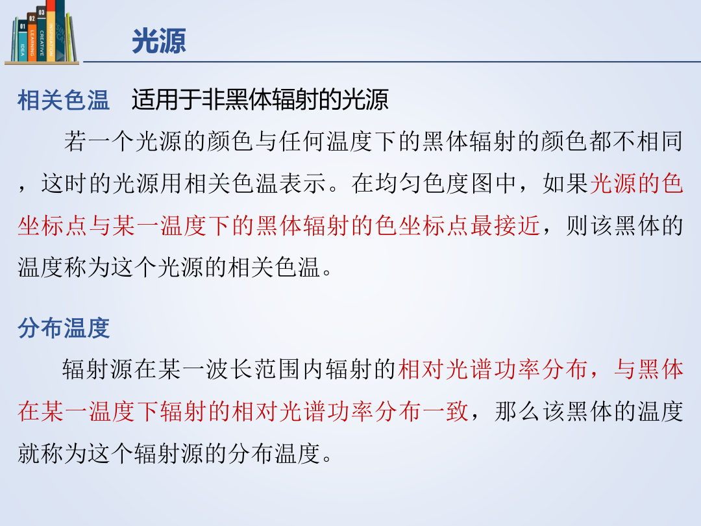

### 本页文字

```text
光源

相关色温 适用于非黑体辐射的光源

  若一个光源的颜色与任何温度下的黑体辐射的颜色都不相同

，这时的光源用相关色温表示。在均匀色度图中，如果光源的色

坐标点与某一温度下的黑体辐射的色坐标点最接近，则该黑体的

温度称为这个光源的相关色温。

分布温度

  辐射源在某一波长范围内辐射的相对光谱功率分布，与黑体

在某一温度下辐射的相对光谱功率分布一致，那么该黑体的温度

就称为这个辐射源的分布温度。
```

## 第 80 页

**页面标题/首行：** 光源的颜色包含了两方面的含义，即色表和显色性。

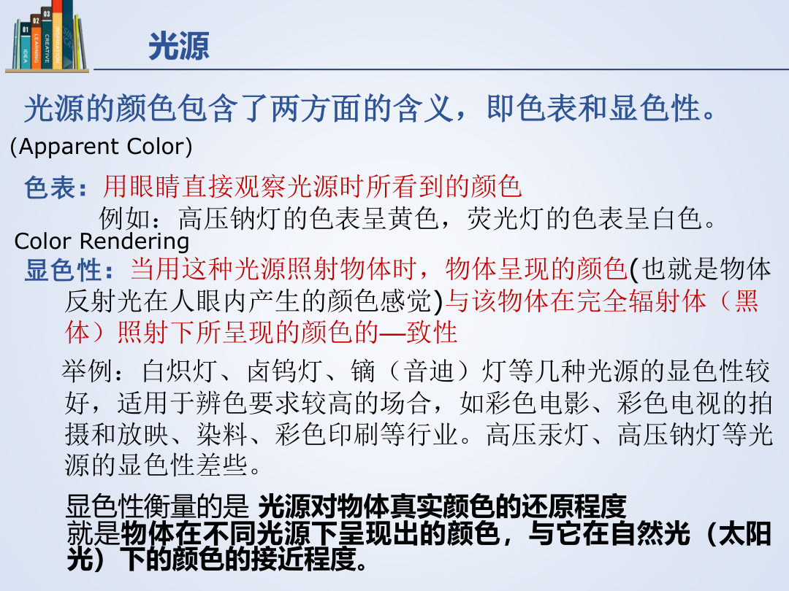

### 本页文字

```text
光源

 光源的颜色包含了两方面的含义，即色表和显色性。
（Apparent Color）
 色表：用眼睛直接观察光源时所看到的颜色
    例如：高压钠灯的色表呈黄色，荧光灯的色表呈白色。
  Color Rendering
 显色性：当用这种光源照射物体时，物体呈现的颜色(也就是物体
   反射光在人眼内产生的颜色感觉)与该物体在完全辐射体（黑
   体）照射下所呈现的颜色的—致性
  举例：白炽灯、卤钨灯、镝（音迪）灯等几种光源的显色性较
   好，适用于辨色要求较高的场合，如彩色电影、彩色电视的拍
   摄和放映、染料、彩色印刷等行业。高压汞灯、高压钠灯等光
   源的显色性差些。
   显色性衡量的是 光源对物体真实颜色的还原程度
   就是物体在不同光源下呈现出的颜色，与它在自然光（太阳
   光）下的颜色的接近程度。
```

## 第 81 页

**页面标题/首行：** 5 、对光源稳定性的要求

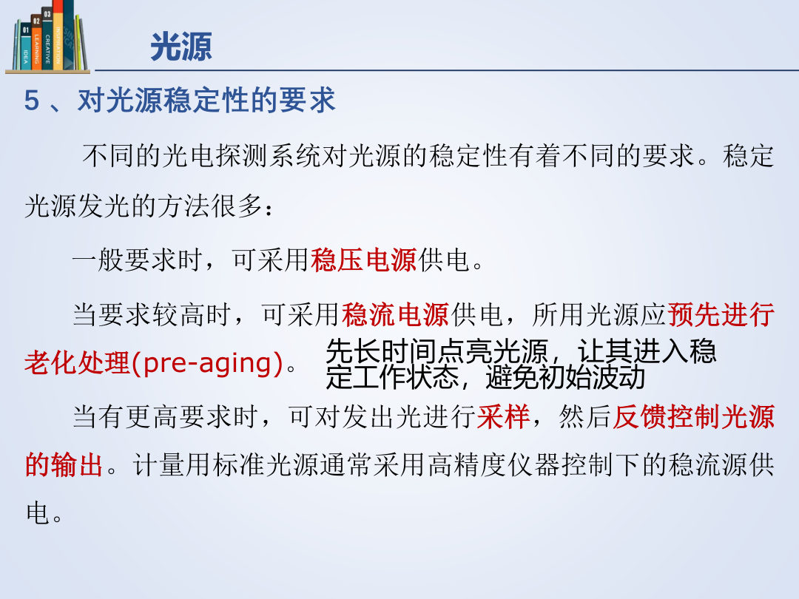

### 本页文字

```text
光源

5 、对光源稳定性的要求

  不同的光电探测系统对光源的稳定性有着不同的要求。稳定

光源发光的方法很多：

  一般要求时，可采用稳压电源供电。

  当要求较高时，可采用稳流电源供电，所用光源应预先进行
           先长时间点亮光源，让其进入稳老化处理(pre-aging)。           定工作状态，避免初始波动
  当有更高要求时，可对发出光进行采样，然后反馈控制光源

的输出。计量用标准光源通常采用高精度仪器控制下的稳流源供

电。
```

## 第 82 页

**页面标题/首行：** 四、 自然光辐射体

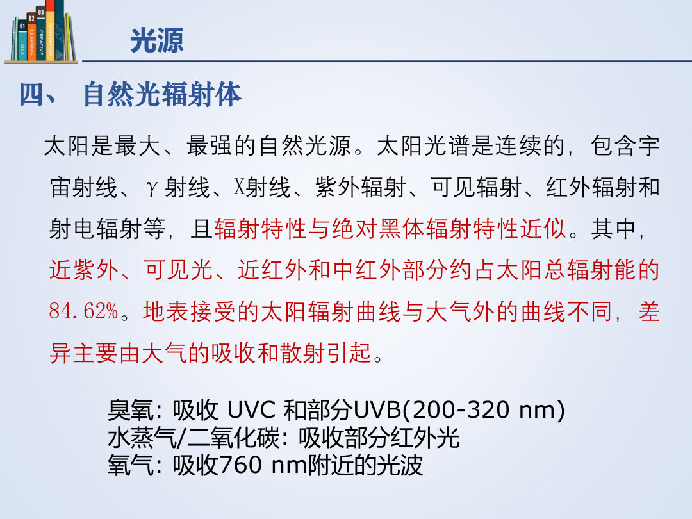

### 本页文字

```text
光源

四、 自然光辐射体

 太阳是最大、最强的自然光源。太阳光谱是连续的，包含宇

 宙射线、γ射线、X射线、紫外辐射、可见辐射、红外辐射和

 射电辐射等，且辐射特性与绝对黑体辐射特性近似。其中，

 近紫外、可见光、近红外和中红外部分约占太阳总辐射能的

 84.62%。地表接受的太阳辐射曲线与大气外的曲线不同，差

 异主要由大气的吸收和散射引起。

     臭氧: 吸收 UVC 和部分UVB(200-320 nm)
    水蒸气/二氧化碳: 吸收部分红外光
     氧气: 吸收760 nm附近的光波
```

## 第 83 页

**页面标题/首行：** 单选题 1分

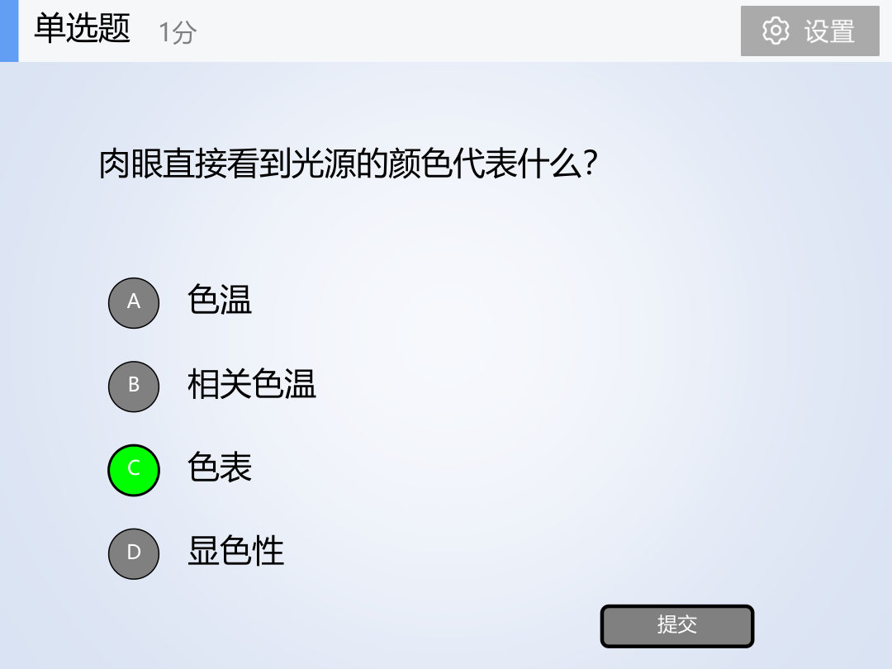

### 本页文字

```text
单选题 1分

  肉眼直接看到光源的颜色代表什么？

       A     色温

        B     相关色温

       C     色表

      D     显色性

                                提交
```

## 第 84 页

**页面标题/首行：** 五 、人工光辐射体

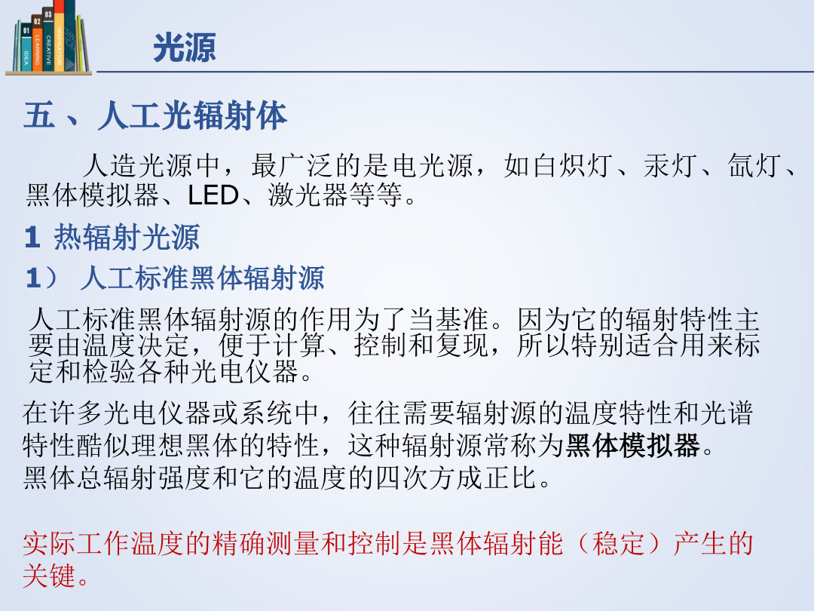

### 本页文字

```text
光源

五 、人工光辐射体

  人造光源中，最广泛的是电光源，如白炽灯、汞灯、氙灯、
黑体模拟器、LED、激光器等等。
1 热辐射光源
1） 人工标准黑体辐射源
人工标准黑体辐射源的作用为了当基准。因为它的辐射特性主
要由温度决定，便于计算、控制和复现，所以特别适合用来标
定和检验各种光电仪器。

在许多光电仪器或系统中，往往需要辐射源的温度特性和光谱
特性酷似理想黑体的特性，这种辐射源常称为黑体模拟器。
黑体总辐射强度和它的温度的四次方成正比。

实际工作温度的精确测量和控制是黑体辐射能（稳定）产生的
关键。
```

## 第 85 页

**页面标题/首行：** 典型的腔型黑体辐射源的基本结构原理如图示，它主要由黑体芯

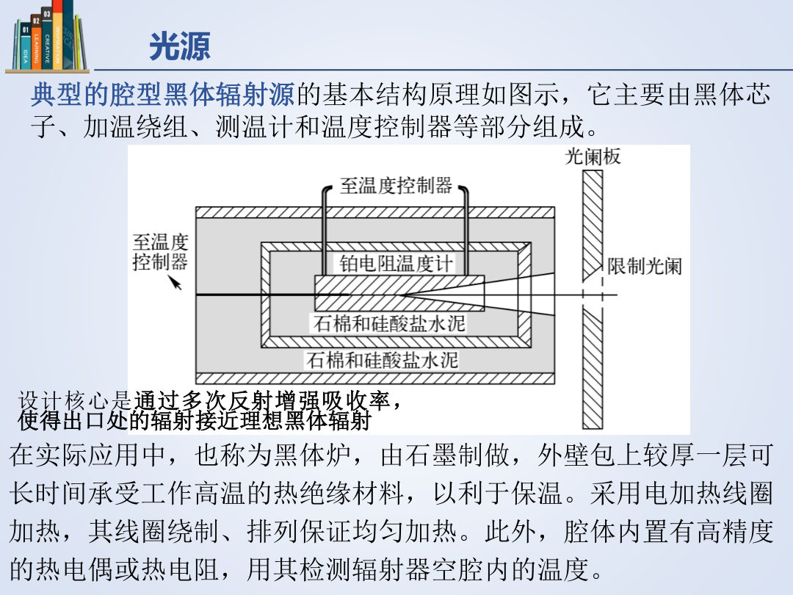

### 本页文字

```text
光源

 典型的腔型黑体辐射源的基本结构原理如图示，它主要由黑体芯
 子、加温绕组、测温计和温度控制器等部分组成。

设计核心是通过多次反射增强吸收率，
使得出口处的辐射接近理想黑体辐射
在实际应用中，也称为黑体炉，由石墨制做，外壁包上较厚一层可
长时间承受工作高温的热绝缘材料，以利于保温。采用电加热线圈
加热，其线圈绕制、排列保证均匀加热。此外，腔体内置有高精度
的热电偶或热电阻，用其检测辐射器空腔内的温度。
```

## 第 86 页

**页面标题/首行：** 注：目前黑体辐射器

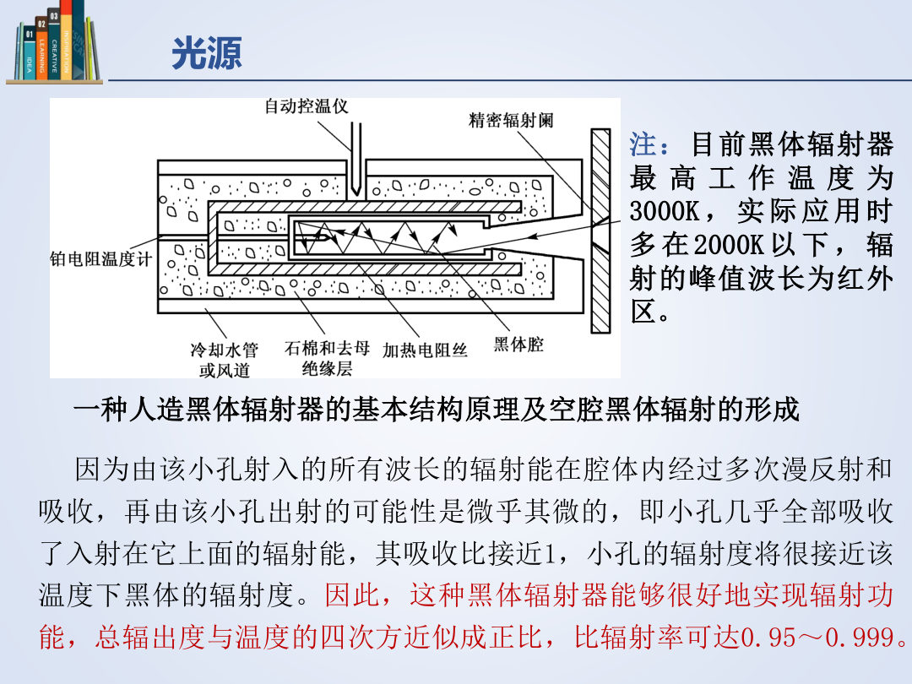

### 本页文字

```text
光源

                    注：目前黑体辐射器
                最高工作温度为
                                          3000K ，实际应用时
                               多在2000K 以下，辐
                    射的峰值波长为红外
                      区。

 一种人造黑体辐射器的基本结构原理及空腔黑体辐射的形成

 因为由该小孔射入的所有波长的辐射能在腔体内经过多次漫反射和

吸收，再由该小孔出射的可能性是微乎其微的，即小孔几乎全部吸收

了入射在它上面的辐射能，其吸收比接近1，小孔的辐射度将很接近该

温度下黑体的辐射度。因此，这种黑体辐射器能够很好地实现辐射功

能，总辐出度与温度的四次方近似成正比，比辐射率可达0.95～0.999。
```

## 第 87 页

**页面标题/首行：** 为了使温度均匀稳定，全辐射器空腔的几何尺寸中L/d＞1.5。

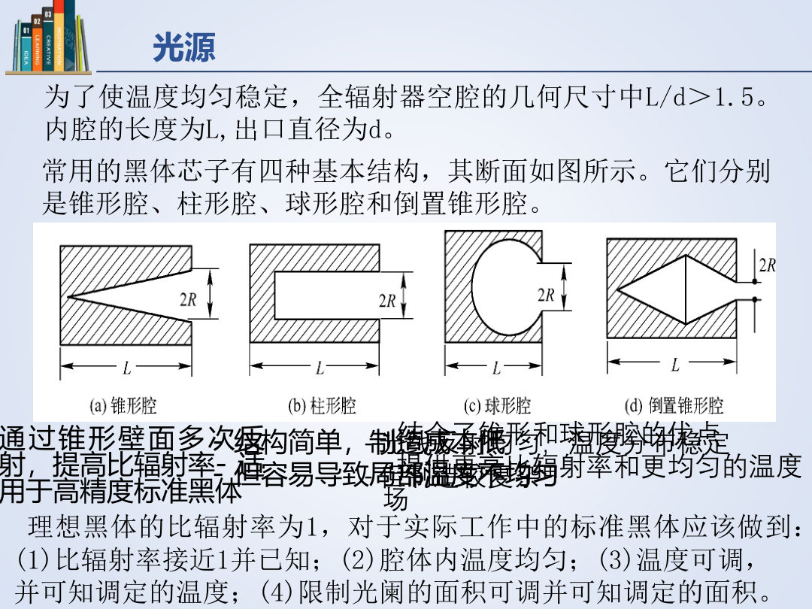

### 本页文字

```text
光源

  为了使温度均匀稳定，全辐射器空腔的几何尺寸中L/d＞1.5。
  内腔的长度为L,出口直径为d。

  常用的黑体芯子有四种基本结构，其断面如图所示。它们分别
  是锥形腔、柱形腔、球形腔和倒置锥形腔。

通过锥形壁面多次反- 结构简单，制造成本低- 光线反射均匀，温度分布稳定- 结合了锥形和球形腔的优点
射，提高比辐射率- 适              - 提供更高比辐射率和更均匀的温度                 - 但容易导致局部温度不均匀- 但制造较复杂用于高精度标准黑体              场
 理想黑体的比辐射率为1，对于实际工作中的标准黑体应该做到：
 (1)比辐射率接近1并已知；(2)腔体内温度均匀；(3)温度可调，
 并可知调定的温度；(4)限制光阑的面积可调并可知调定的面积。
```

## 第 88 页

**页面标题/首行：** 2）白炽灯

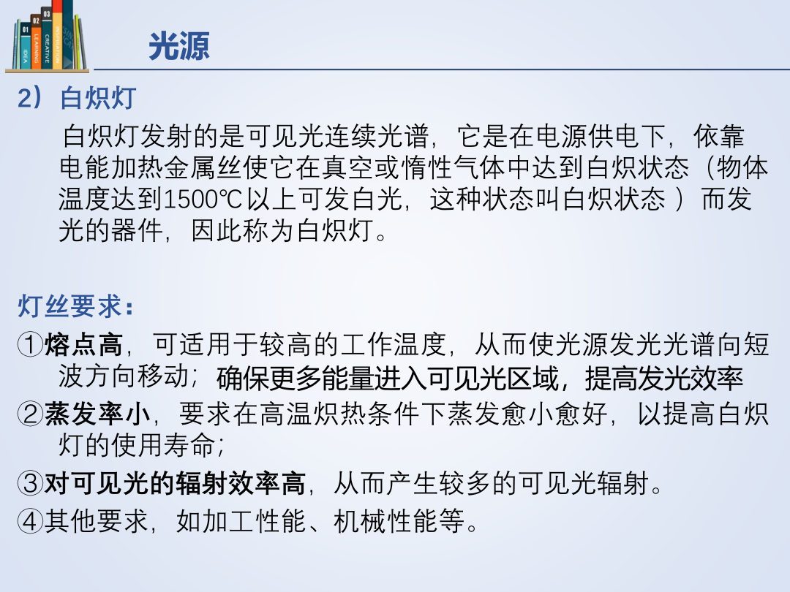

### 本页文字

```text
光源

2）白炽灯
  白炽灯发射的是可见光连续光谱，它是在电源供电下，依靠
  电能加热金属丝使它在真空或惰性气体中达到白炽状态（物体
  温度达到1500℃以上可发白光，这种状态叫白炽状态 ）而发
  光的器件，因此称为白炽灯。

灯丝要求：
①熔点高，可适用于较高的工作温度，从而使光源发光光谱向短
  波方向移动； 确保更多能量进入可见光区域，提高发光效率
②蒸发率小，要求在高温炽热条件下蒸发愈小愈好，以提高白炽
  灯的使用寿命；
③对可见光的辐射效率高，从而产生较多的可见光辐射。
④其他要求，如加工性能、机械性能等。
```

## 第 89 页

**页面标题/首行：** 普通白炽灯由熔点高达3600 K的钨丝制作成的灯丝、实心

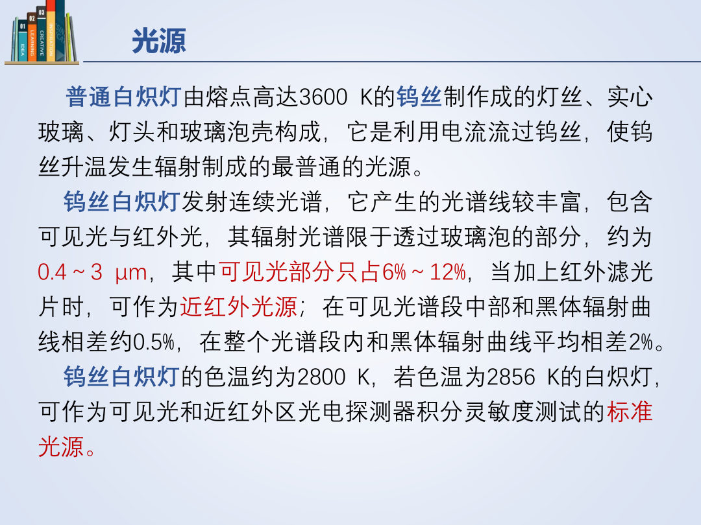

### 本页文字

```text
光源

 普通白炽灯由熔点高达3600 K的钨丝制作成的灯丝、实心
玻璃、灯头和玻璃泡壳构成，它是利用电流流过钨丝，使钨
丝升温发生辐射制成的最普通的光源。
 钨丝白炽灯发射连续光谱，它产生的光谱线较丰富，包含
可见光与红外光，其辐射光谱限于透过玻璃泡的部分，约为
0.4～3 μm，其中可见光部分只占6%～12%，当加上红外滤光
片时，可作为近红外光源；在可见光谱段中部和黑体辐射曲
线相差约0.5%，在整个光谱段内和黑体辐射曲线平均相差2%。
 钨丝白炽灯的色温约为2800 K，若色温为2856 K的白炽灯，
可作为可见光和近红外区光电探测器积分灵敏度测试的标准
光源。
```

## 第 90 页

**页面标题/首行：** 1、真空白炽灯

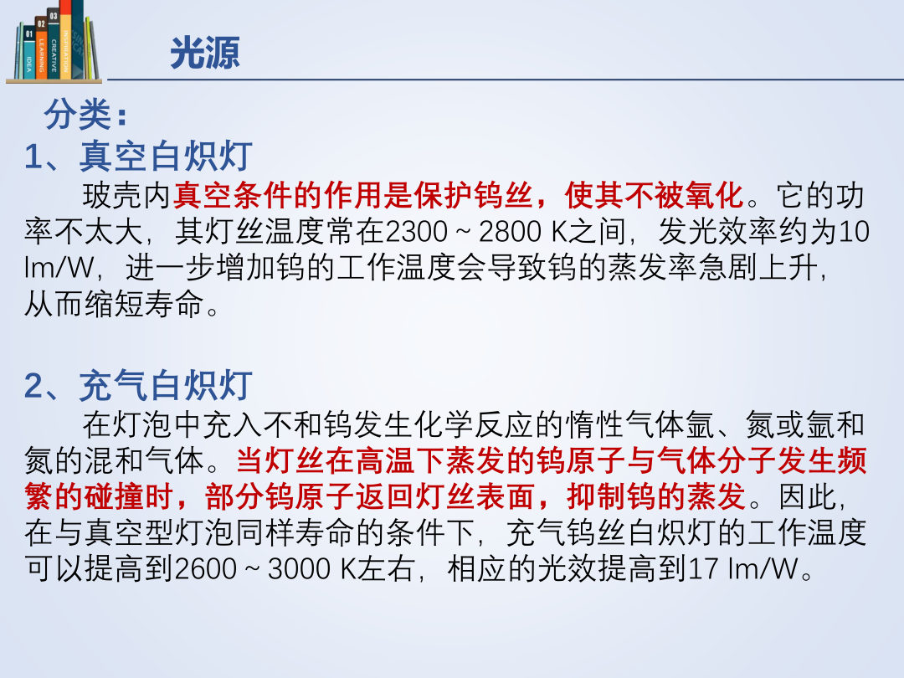

### 本页文字

```text
光源

 分类：
1、真空白炽灯
  玻壳内真空条件的作用是保护钨丝，使其不被氧化。它的功
率不太大，其灯丝温度常在2300～2800 K之间，发光效率约为10
lm/W，进一步增加钨的工作温度会导致钨的蒸发率急剧上升，
从而缩短寿命。

2、充气白炽灯
  在灯泡中充入不和钨发生化学反应的惰性气体氩、氮或氩和
氮的混和气体。当灯丝在高温下蒸发的钨原子与气体分子发生频
繁的碰撞时，部分钨原子返回灯丝表面，抑制钨的蒸发。因此，
在与真空型灯泡同样寿命的条件下，充气钨丝白炽灯的工作温度
可以提高到2600～3000 K左右，相应的光效提高到17 lm/W。
```

## 第 91 页

**页面标题/首行：** 3、卤钨白炽灯

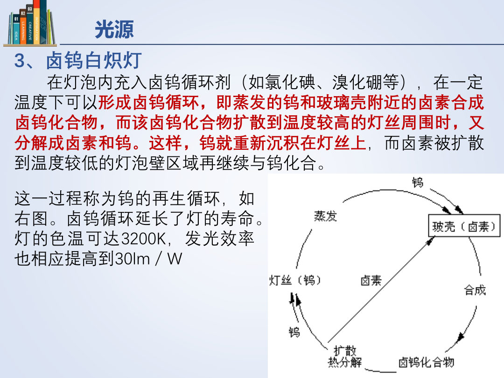

### 本页文字

```text
光源
3、卤钨白炽灯
  在灯泡内充入卤钨循环剂（如氯化碘、溴化硼等），在一定
温度下可以形成卤钨循环，即蒸发的钨和玻璃壳附近的卤素合成
卤钨化合物，而该卤钨化合物扩散到温度较高的灯丝周围时，又
分解成卤素和钨。这样，钨就重新沉积在灯丝上，而卤素被扩散
到温度较低的灯泡壁区域再继续与钨化合。

这一过程称为钨的再生循环，如
右图。卤钨循环延长了灯的寿命。
灯的色温可达3200K，发光效率
也相应提高到30lm／W
```

## 第 92 页

**页面标题/首行：** 卤钨灯的特点

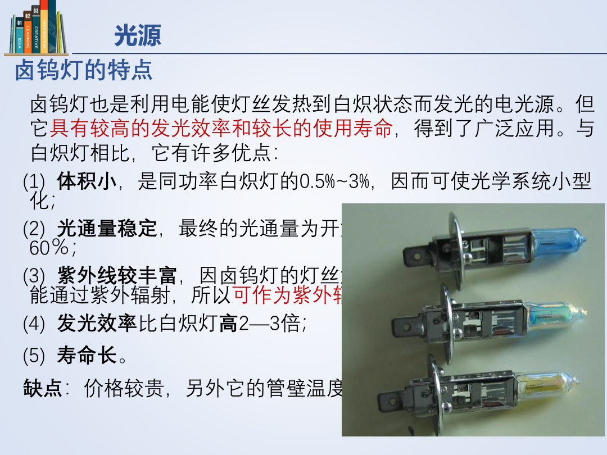

### 本页文字

```text
光源
卤钨灯的特点

 卤钨灯也是利用电能使灯丝发热到白炽状态而发光的电光源。但
 它具有较高的发光效率和较长的使用寿命，得到了广泛应用。与
 白炽灯相比，它有许多优点：
 (1) 体积小，是同功率白炽灯的0.5%~3%，因而可使光学系统小型
 化；
 (2) 光通量稳定，最终的光通量为开始的95％~98％，而白炽灯为
 60％；
 (3) 紫外线较丰富，因卤钨灯的灯丝温度较高，而且它的泡壳也
 能通过紫外辐射，所以可作为紫外辐射源用于光谱辐射测量方面；
 (4) 发光效率比白炽灯高2—3倍；

 (5) 寿命长。

 缺点：价格较贵，另外它的管壁温度高。
```

## 第 93 页

**页面标题/首行：** 单端卤钨灯

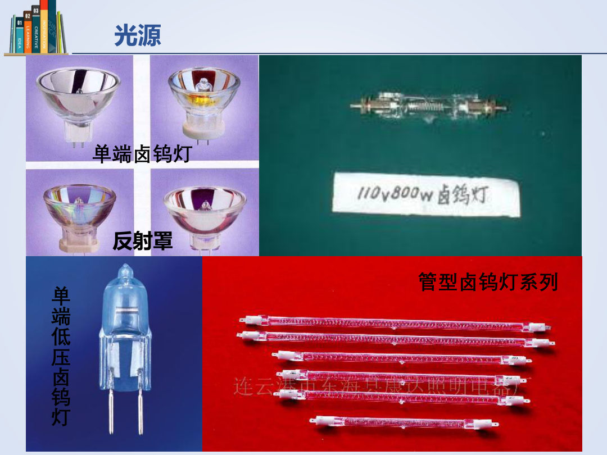

### 本页文字

```text
光源

  单端卤钨灯

   反射罩

                  管型卤钨灯系列
单
端
低
压
卤
钨
灯
```

## 第 94 页

**页面标题/首行：** 2、气体放电光源（气体灯）

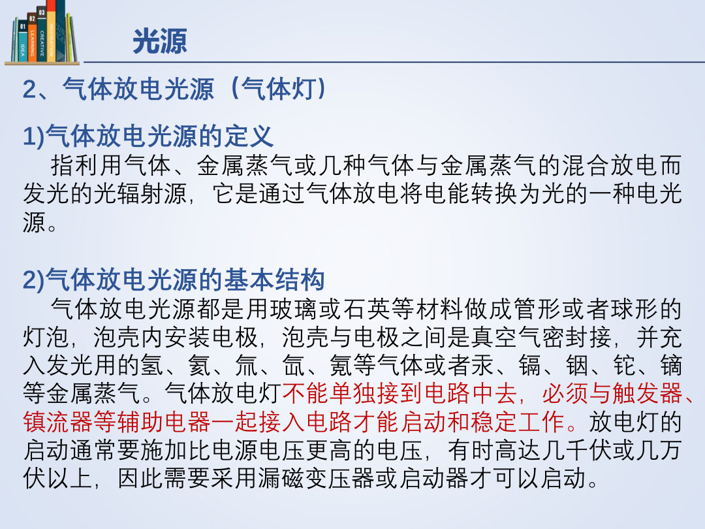

### 本页文字

```text
光源

2、气体放电光源（气体灯）

1)气体放电光源的定义
 指利用气体、金属蒸气或几种气体与金属蒸气的混合放电而
发光的光辐射源，它是通过气体放电将电能转换为光的一种电光
源。

2)气体放电光源的基本结构
 气体放电光源都是用玻璃或石英等材料做成管形或者球形的
灯泡，泡壳内安装电极，泡壳与电极之间是真空气密封接，并充
入发光用的氢、氦、氚、氙、氪等气体或者汞、镉、铟、铊、镝
等金属蒸气。气体放电灯不能单独接到电路中去，必须与触发器、
镇流器等辅助电器一起接入电路才能启动和稳定工作。放电灯的
启动通常要施加比电源电压更高的电压，有时高达几千伏或几万
伏以上，因此需要采用漏磁变压器或启动器才可以启动。
```

## 第 95 页

**页面标题/首行：** 3）气体放电原理

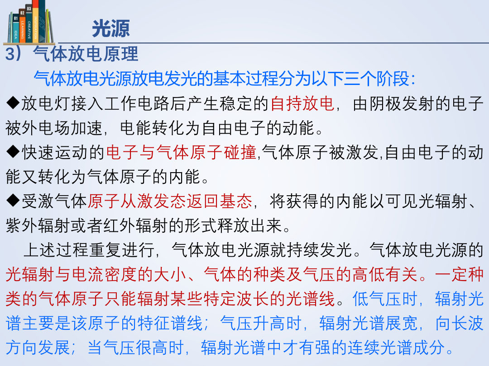

### 本页文字

```text
光源
3）气体放电原理
  气体放电光源放电发光的基本过程分为以下三个阶段：
◆放电灯接入工作电路后产生稳定的自持放电，由阴极发射的电子
被外电场加速，电能转化为自由电子的动能。
◆快速运动的电子与气体原子碰撞,气体原子被激发,自由电子的动
能又转化为气体原子的内能。
◆受激气体原子从激发态返回基态，将获得的内能以可见光辐射、
紫外辐射或者红外辐射的形式释放出来。
 上述过程重复进行，气体放电光源就持续发光。气体放电光源的
光辐射与电流密度的大小、气体的种类及气压的高低有关。一定种
类的气体原子只能辐射某些特定波长的光谱线。低气压时，辐射光
谱主要是该原子的特征谱线；气压升高时，辐射光谱展宽，向长波
方向发展；当气压很高时，辐射光谱中才有强的连续光谱成分。
```

## 第 96 页

**页面标题/首行：** 4)气体放电光源的特点

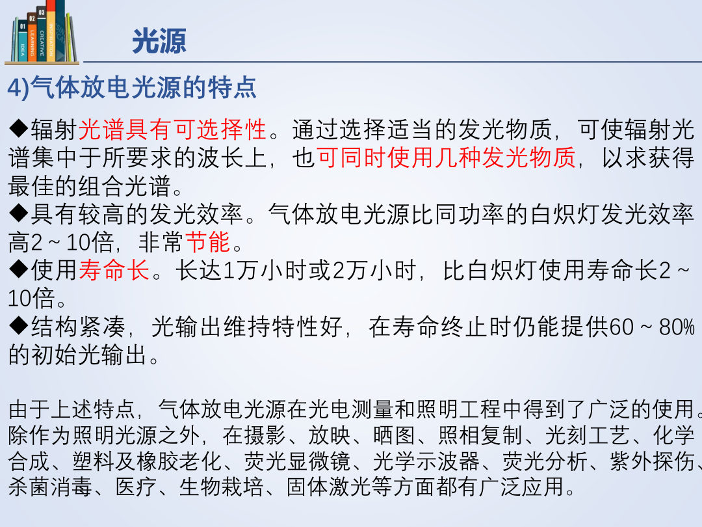

### 本页文字

```text
光源

4)气体放电光源的特点

◆辐射光谱具有可选择性。通过选择适当的发光物质，可使辐射光
谱集中于所要求的波长上，也可同时使用几种发光物质，以求获得
最佳的组合光谱。
◆具有较高的发光效率。气体放电光源比同功率的白炽灯发光效率
高2～10倍，非常节能。
◆使用寿命长。长达1万小时或2万小时，比白炽灯使用寿命长2～
10倍。
◆结构紧凑，光输出维持特性好，在寿命终止时仍能提供60～80%
的初始光输出。

由于上述特点，气体放电光源在光电测量和照明工程中得到了广泛的使用。
除作为照明光源之外，在摄影、放映、晒图、照相复制、光刻工艺、化学
合成、塑料及橡胶老化、荧光显微镜、光学示波器、荧光分析、紫外探伤、
杀菌消毒、医疗、生物栽培、固体激光等方面都有广泛应用。
```

## 第 97 页

**页面标题/首行：** 2.光谱功率分布

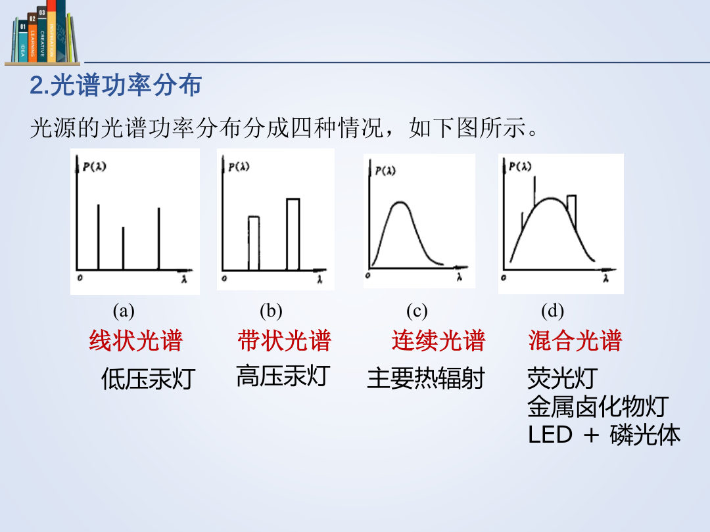

### 本页文字

```text
2.光谱功率分布

光源的光谱功率分布分成四种情况，如下图所示。

           (a)                (b)                 (c)               (d)
  线状光谱  带状光谱  连续光谱  混合光谱
         高压汞灯  主要热辐射  荧光灯   低压汞灯
                     金属卤化物灯
                                LED + 磷光体
```

## 第 98 页

**页面标题/首行：** 1. 色温

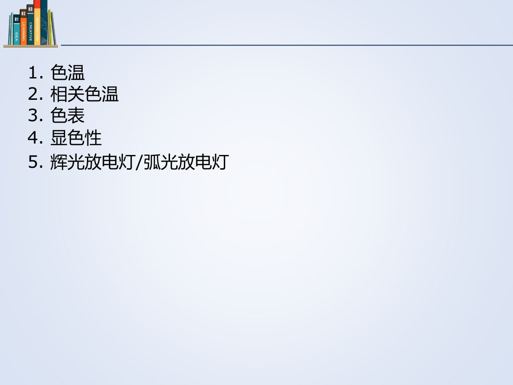

### 本页文字

```text
1. 色温
2. 相关色温
3. 色表
4. 显色性
5. 辉光放电灯/弧光放电灯
```

## 第 99 页

**页面标题/首行：** 气体放电光源的分类：

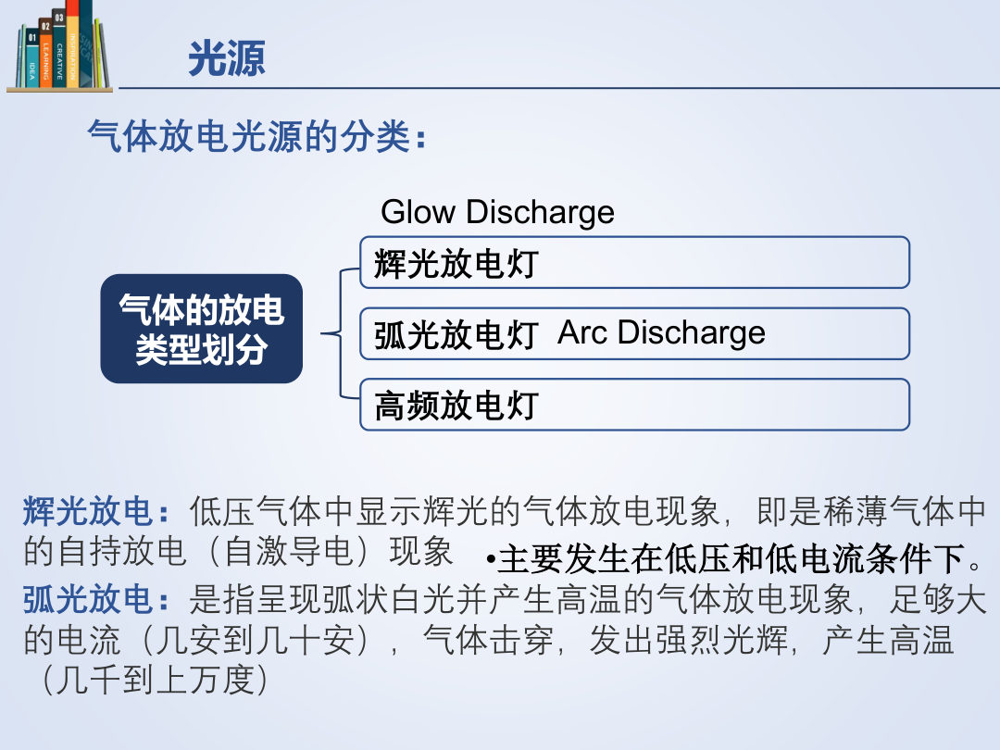

### 本页文字

```text
光源

  气体放电光源的分类：

                   Glow Discharge
           辉光放电灯
   气体的放电
           弧光放电灯 Arc Discharge   类型划分

           高频放电灯

辉光放电：低压气体中显示辉光的气体放电现象，即是稀薄气体中
的自持放电（自激导电）现象              •主要发生在低压和低电流条件下。
弧光放电：是指呈现弧状白光并产生高温的气体放电现象，足够大
的电流（几安到几十安），气体击穿，发出强烈光辉，产生高温
（几千到上万度）
```

## 第 100 页

**页面标题/首行：** 放电发光物质   钠灯

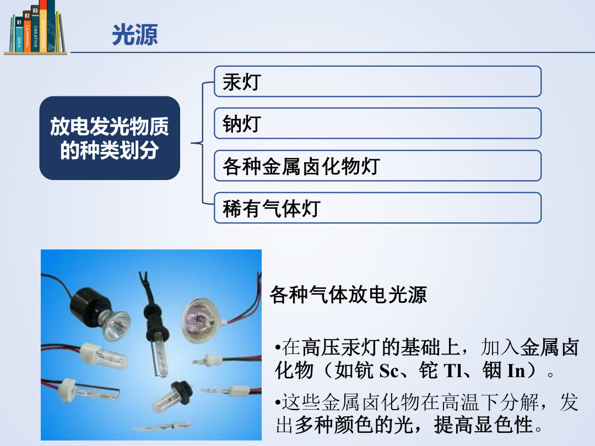

### 本页文字

```text
光源

         汞灯

放电发光物质   钠灯
的种类划分
         各种金属卤化物灯

         稀有气体灯

           各种气体放电光源

            •在高压汞灯的基础上，加入金属卤
           化物（如钪 Sc、铊 Tl、铟 In）。
            •这些金属卤化物在高温下分解，发
           出多种颜色的光，提高显色性。
```

## 第 101 页

**页面标题/首行：** 1）汞灯

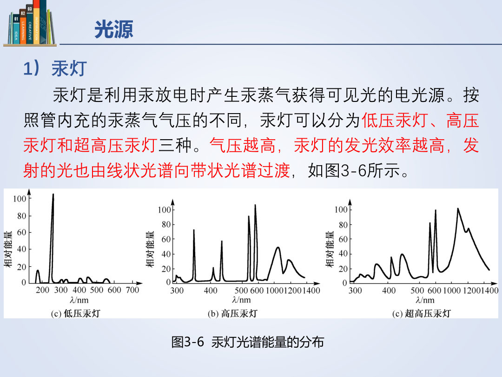

### 本页文字

```text
光源

1）汞灯
  汞灯是利用汞放电时产生汞蒸气获得可见光的电光源。按
照管内充的汞蒸气气压的不同，汞灯可以分为低压汞灯、高压
汞灯和超高压汞灯三种。气压越高，汞灯的发光效率越高，发
射的光也由线状光谱向带状光谱过渡，如图3-6所示。

                  图3-6 汞灯光谱能量的分布
```

## 第 102 页

**页面标题/首行：** ◆低压汞灯

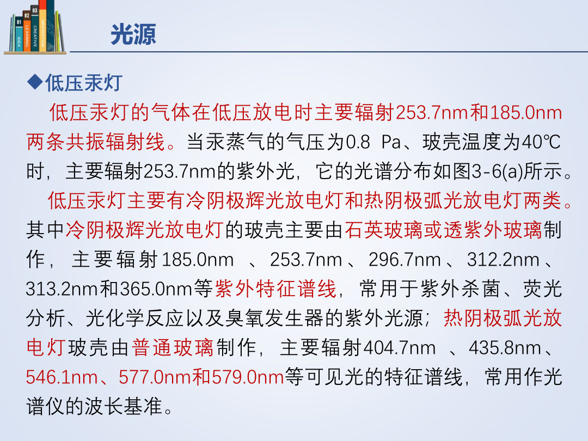

### 本页文字

```text
光源

◆低压汞灯
 低压汞灯的气体在低压放电时主要辐射253.7nm和185.0nm
两条共振辐射线。当汞蒸气的气压为0.8 Pa、玻壳温度为40℃
时，主要辐射253.7nm的紫外光，它的光谱分布如图3-6(a)所示。
 低压汞灯主要有冷阴极辉光放电灯和热阴极弧光放电灯两类。
其中冷阴极辉光放电灯的玻壳主要由石英玻璃或透紫外玻璃制
作，主要辐射185.0nm 、253.7nm 、296.7nm 、312.2nm 、
313.2nm和365.0nm等紫外特征谱线，常用于紫外杀菌、荧光
分析、光化学反应以及臭氧发生器的紫外光源；热阴极弧光放
电灯玻壳由普通玻璃制作，主要辐射404.7nm 、435.8nm、
546.1nm、577.0nm和579.0nm等可见光的特征谱线，常用作光
谱仪的波长基准。
```

## 第 103 页

**页面标题/首行：** 1）低压汞灯

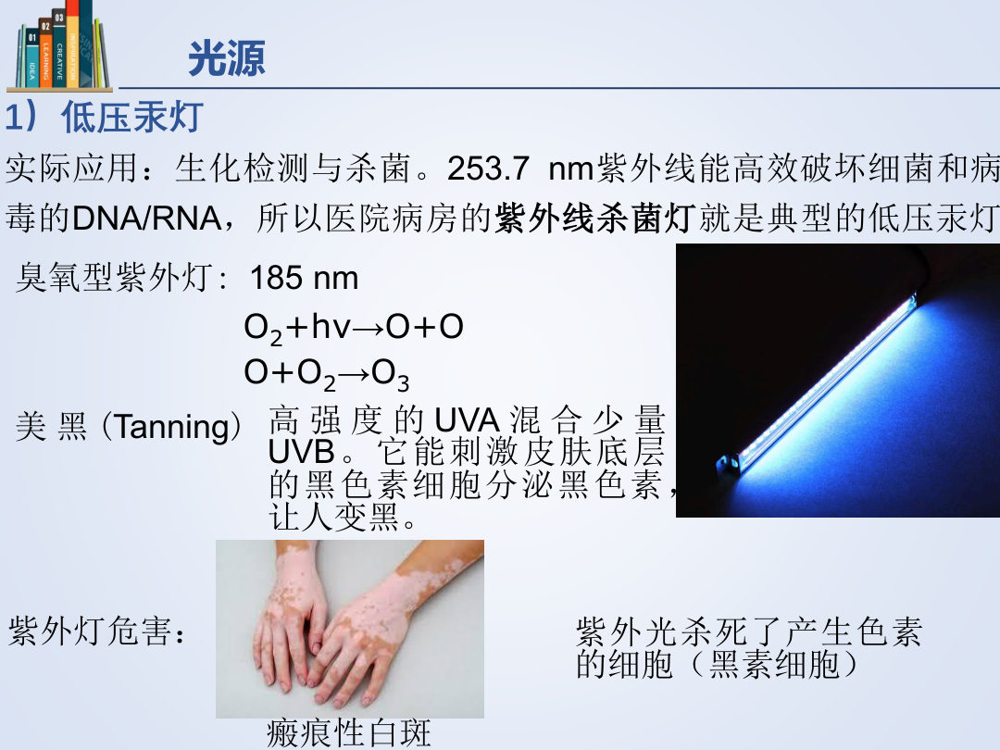

### 本页文字

```text
光源
1）低压汞灯
实际应用：生化检测与杀菌。253.7 nm紫外线能高效破坏细菌和病
毒的DNA/RNA，所以医院病房的紫外线杀菌灯就是典型的低压汞灯

臭氧型紫外灯: 185 nm
          O2+hν→O+O
           O+O2​→O3
        高强度的UVA 混合少量 美黑(Tanning)
        UVB。它能刺激皮肤底层
       的黑色素细胞分泌黑色素，
        让人变黑。

紫外灯危害：           紫外光杀死了产生色素
                 的细胞（黑素细胞）

        瘢痕性白斑
```

## 第 104 页

**页面标题/首行：** ◆高压汞灯

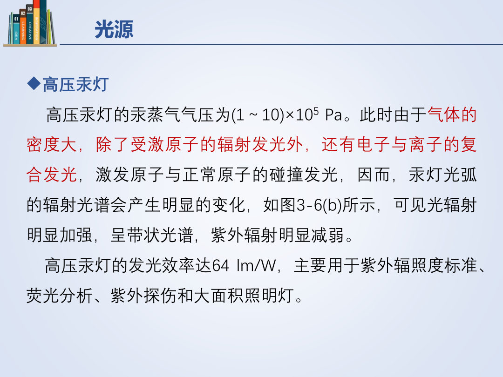

### 本页文字

```text
光源

◆高压汞灯

  高压汞灯的汞蒸气气压为(1～10)×105 Pa。此时由于气体的

密度大，除了受激原子的辐射发光外，还有电子与离子的复

合发光，激发原子与正常原子的碰撞发光，因而，汞灯光弧

的辐射光谱会产生明显的变化，如图3-6(b)所示，可见光辐射

明显加强，呈带状光谱，紫外辐射明显减弱。

 高压汞灯的发光效率达64 lm/W，主要用于紫外辐照度标准、

荧光分析、紫外探伤和大面积照明灯。
```

## 第 105 页

**页面标题/首行：** 紫外荧光磁粉探伤：给机械零件涂上荧光磁粉后，用高压汞灯

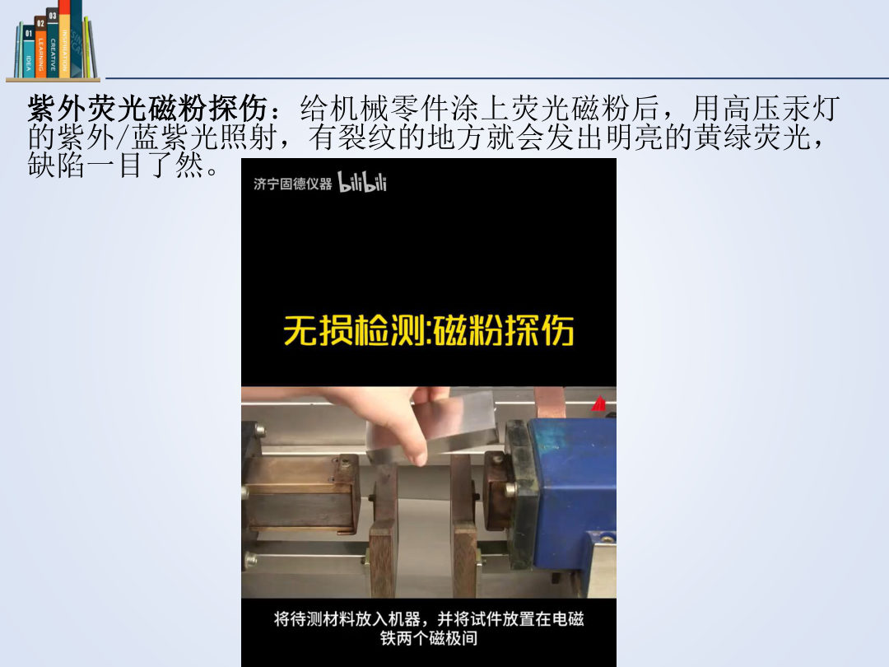

### 本页文字

```text
紫外荧光磁粉探伤：给机械零件涂上荧光磁粉后，用高压汞灯
的紫外/蓝紫光照射，有裂纹的地方就会发出明亮的黄绿荧光，
缺陷一目了然。
```

## 第 106 页

**页面标题/首行：** ◆超高压汞灯

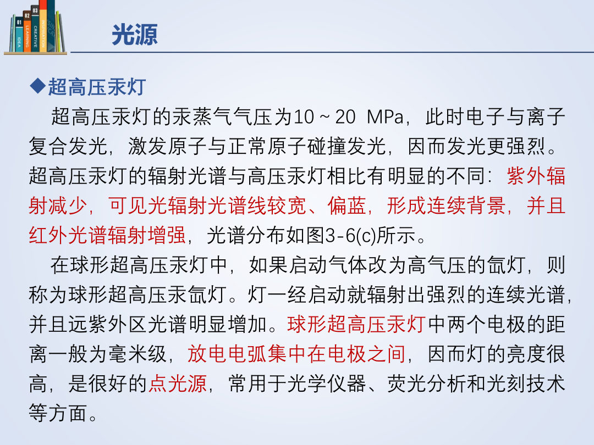

### 本页文字

```text
光源

◆超高压汞灯
 超高压汞灯的汞蒸气气压为10～20 MPa，此时电子与离子
复合发光，激发原子与正常原子碰撞发光，因而发光更强烈。
超高压汞灯的辐射光谱与高压汞灯相比有明显的不同：紫外辐
射减少，可见光辐射光谱线较宽、偏蓝，形成连续背景，并且
红外光谱辐射增强，光谱分布如图3-6(c)所示。
 在球形超高压汞灯中，如果启动气体改为高气压的氙灯，则
称为球形超高压汞氙灯。灯一经启动就辐射出强烈的连续光谱，
并且远紫外区光谱明显增加。球形超高压汞灯中两个电极的距
离一般为毫米级，放电电弧集中在电极之间，因而灯的亮度很
高，是很好的点光源，常用于光学仪器、荧光分析和光刻技术
等方面。
```

## 第 107 页

**页面标题/首行：** ◆超高压汞灯应用

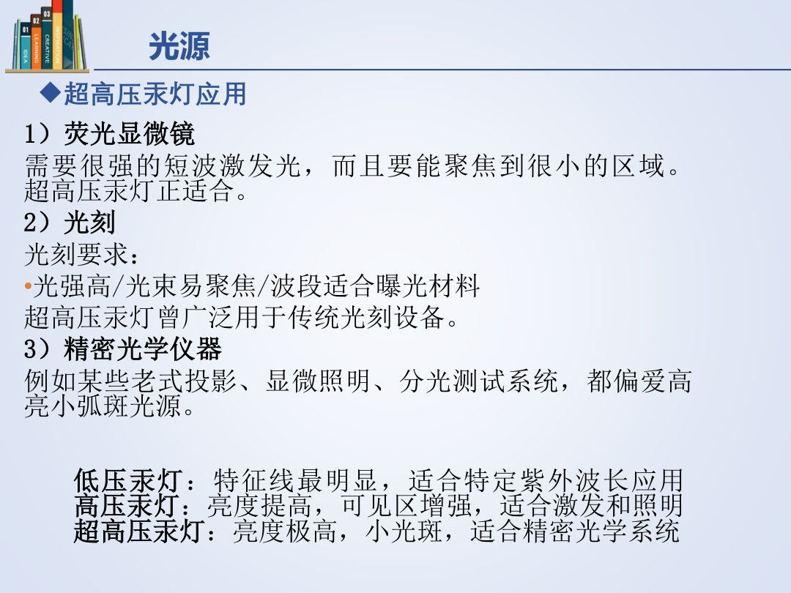

### 本页文字

```text
光源
 ◆超高压汞灯应用
1）荧光显微镜
需要很强的短波激发光，而且要能聚焦到很小的区域。
超高压汞灯正适合。
2）光刻
光刻要求：
•光强高/光束易聚焦/波段适合曝光材料
超高压汞灯曾广泛用于传统光刻设备。
3）精密光学仪器
例如某些老式投影、显微照明、分光测试系统，都偏爱高
亮小弧斑光源。

  低压汞灯：特征线最明显，适合特定紫外波长应用
  高压汞灯：亮度提高，可见区增强，适合激发和照明
  超高压汞灯：亮度极高，小光斑，适合精密光学系统
```

## 第 108 页

**页面标题/首行：** 2）氙灯

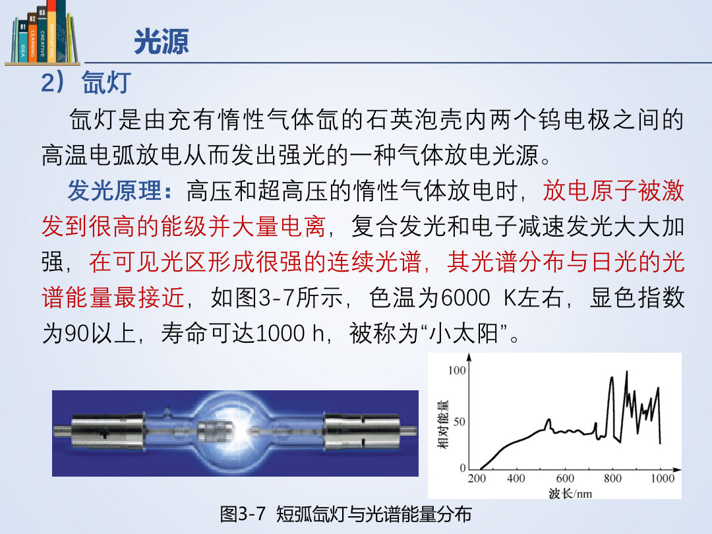

### 本页文字

```text
光源
2）氙灯
 氙灯是由充有惰性气体氙的石英泡壳内两个钨电极之间的
高温电弧放电从而发出强光的一种气体放电光源。
 发光原理：高压和超高压的惰性气体放电时，放电原子被激
发到很高的能级并大量电离，复合发光和电子减速发光大大加
强，在可见光区形成很强的连续光谱，其光谱分布与日光的光
谱能量最接近，如图3-7所示，色温为6000 K左右，显色指数
为90以上，寿命可达1000 h，被称为“小太阳”。

               图3-7 短弧氙灯与光谱能量分布
```

## 第 109 页

**页面标题/首行：** 单选题 1分

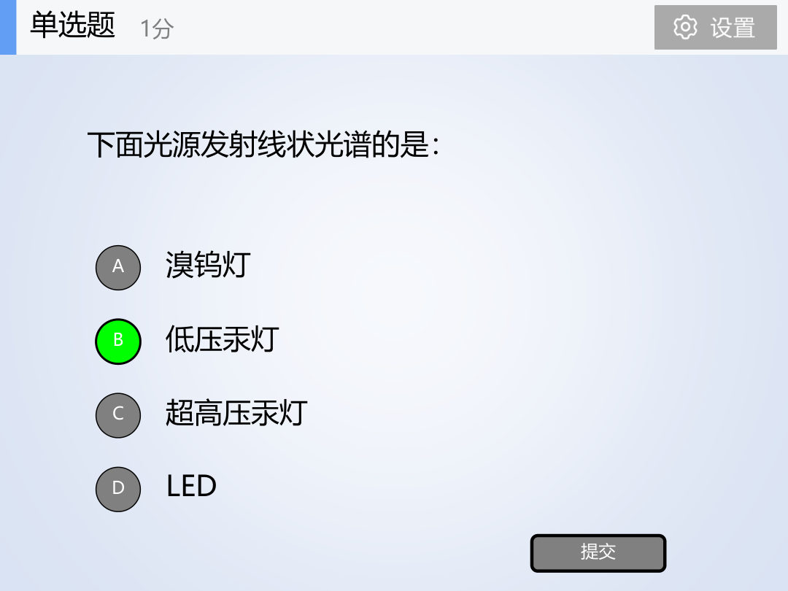

### 本页文字

```text
单选题 1分

  下面光源发射线状光谱的是：

       A     溴钨灯

        B     低压汞灯

       C     超高压汞灯

      D        LED

                                提交
```

## 第 110 页

**页面标题/首行：** 3、固体发光光源

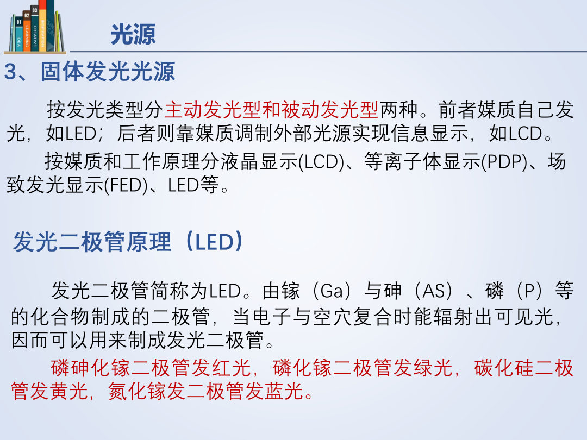

### 本页文字

```text
光源

3、固体发光光源

  按发光类型分主动发光型和被动发光型两种。前者媒质自己发
光，如LED；后者则靠媒质调制外部光源实现信息显示，如LCD。
  按媒质和工作原理分液晶显示(LCD)、等离子体显示(PDP)、场
致发光显示(FED)、LED等。

发光二极管原理（LED）

   发光二极管简称为LED。由镓（Ga）与砷（AS）、磷（P）等
的化合物制成的二极管，当电子与空穴复合时能辐射出可见光，
因而可以用来制成发光二极管。
  磷砷化镓二极管发红光，磷化镓二极管发绿光，碳化硅二极
管发黄光，氮化镓发二极管发蓝光。
```

## 第 111 页

**页面标题/首行：** 发光二极管与普通二极管一样是由一个PN结组成，也具有单

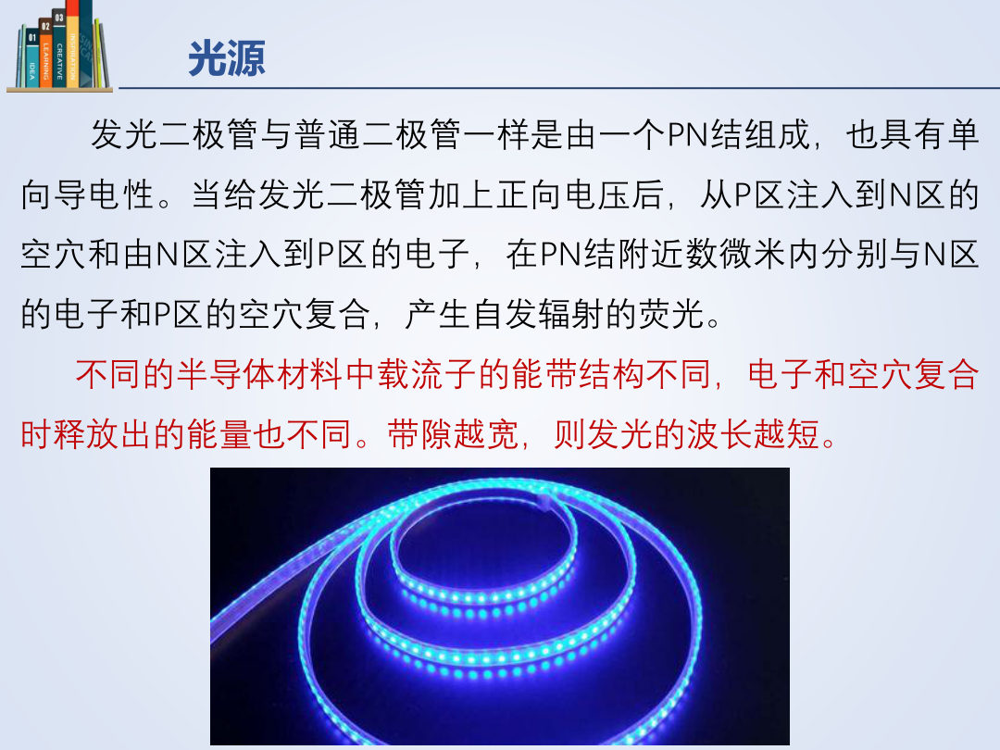

### 本页文字

```text
光源

  发光二极管与普通二极管一样是由一个PN结组成，也具有单

向导电性。当给发光二极管加上正向电压后，从P区注入到N区的

空穴和由N区注入到P区的电子，在PN结附近数微米内分别与N区

的电子和P区的空穴复合，产生自发辐射的荧光。

  不同的半导体材料中载流子的能带结构不同，电子和空穴复合

时释放出的能量也不同。带隙越宽，则发光的波长越短。
```

## 第 112 页

**页面标题/首行：** 发光二极管可分成红色、橙色、绿色（又细分黄绿、标准绿和纯

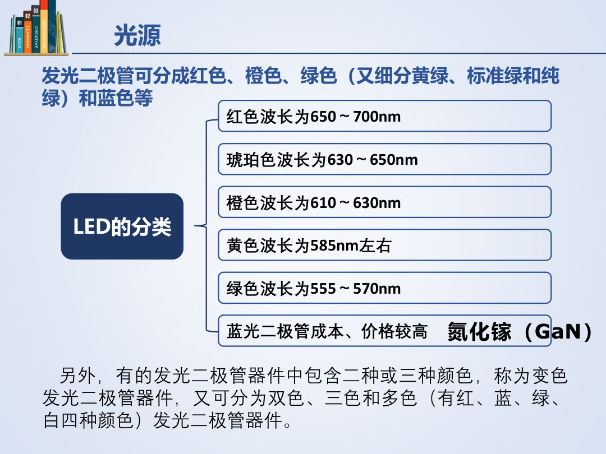

### 本页文字

```text
光源

发光二极管可分成红色、橙色、绿色（又细分黄绿、标准绿和纯
绿）和蓝色等
               红色波长为650～700nm

              琥珀色波长为630～650nm

               橙色波长为610～630nm
  LED的分类
             黄色波长为585nm左右

               绿色波长为555～570nm

           蓝光二极管成本、价格较高                     氮化镓（GaN）

 另外，有的发光二极管器件中包含二种或三种颜色，称为变色
发光二极管器件，又可分为双色、三色和多色（有红、蓝、绿、
白四种颜色）发光二极管器件。
```

## 第 113 页

**页面标题/首行：** 图3-13 发光二极管的典型光谱响应曲线

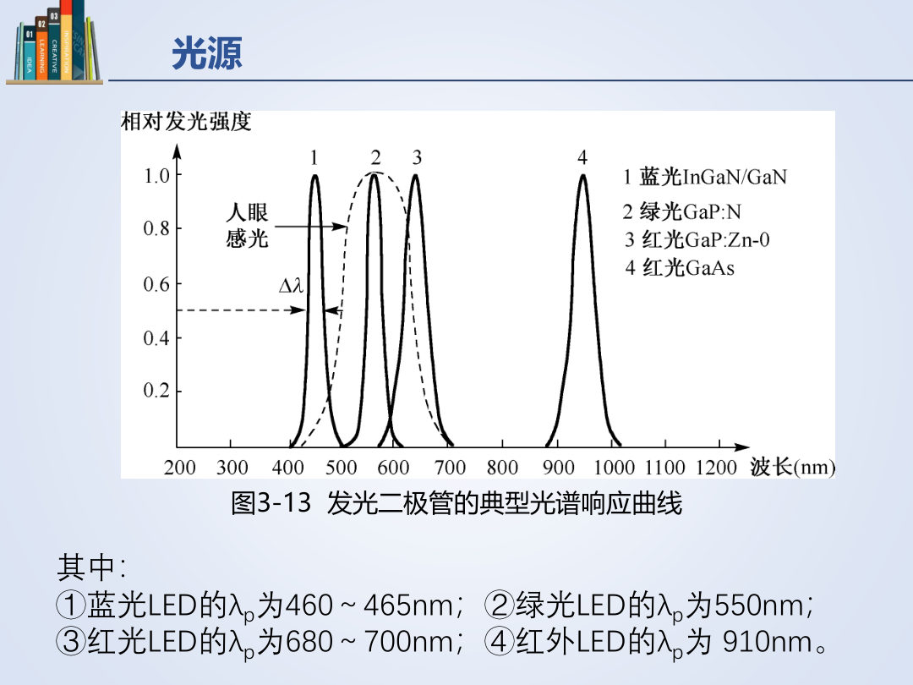

### 本页文字

```text
光源

           图3-13 发光二极管的典型光谱响应曲线

其中：
①蓝光LED的λp为460～465nm；②绿光LED的λp为550nm；
③红光LED的λp为680～700nm；④红外LED的λp为910nm。
```

## 第 114 页

**页面标题/首行：** 氮化镓（GaN）进一步掺杂，实现蓝光   3.4 eV     2.65 eV

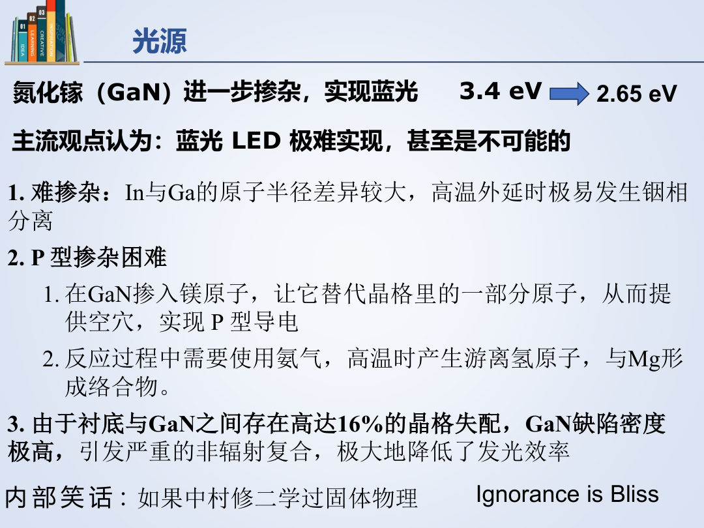

### 本页文字

```text
光源

氮化镓（GaN）进一步掺杂，实现蓝光   3.4 eV     2.65 eV

主流观点认为：蓝光 LED 极难实现，甚至是不可能的

1. 难掺杂：In与Ga的原子半径差异较大，高温外延时极易发生铟相
分离
2. P 型掺杂困难
    1. 在GaN掺入镁原子，让它替代晶格里的一部分原子，从而提
   供空穴，实现 P 型导电
    2. 反应过程中需要使用氨气，高温时产生游离氢原子，与Mg形
   成络合物。
3. 由于衬底与GaN之间存在高达16%的晶格失配，GaN缺陷密度
极高，引发严重的非辐射复合，极大地降低了发光效率

内部笑话：如果中村修二学过固体物理     Ignorance is Bliss
```

## 第 115 页

**页面标题/首行：** 氮化镓（GaN）

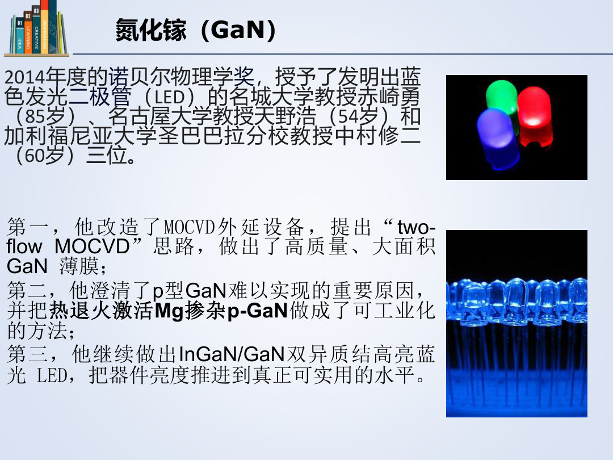

### 本页文字

```text
氮化镓（GaN）

2014年度的诺贝尔物理学奖，授予了发明出蓝
色发光二极管（LED）的名城大学教授赤崎勇
（85岁）、名古屋大学教授天野浩（54岁）和
加利福尼亚大学圣巴巴拉分校教授中村修二
（60岁）三位。

第一，他改造了MOCVD外延设备，提出“two-
flow MOCVD”思路，做出了高质量、大面积
GaN 薄膜；
第二，他澄清了p型GaN难以实现的重要原因，
并把热退火激活Mg掺杂p-GaN做成了可工业化
的方法；
第三，他继续做出InGaN/GaN双异质结高亮蓝
光 LED，把器件亮度推进到真正可实用的水平。
```

## 第 116 页

**页面标题/首行：** 4、 激光光源

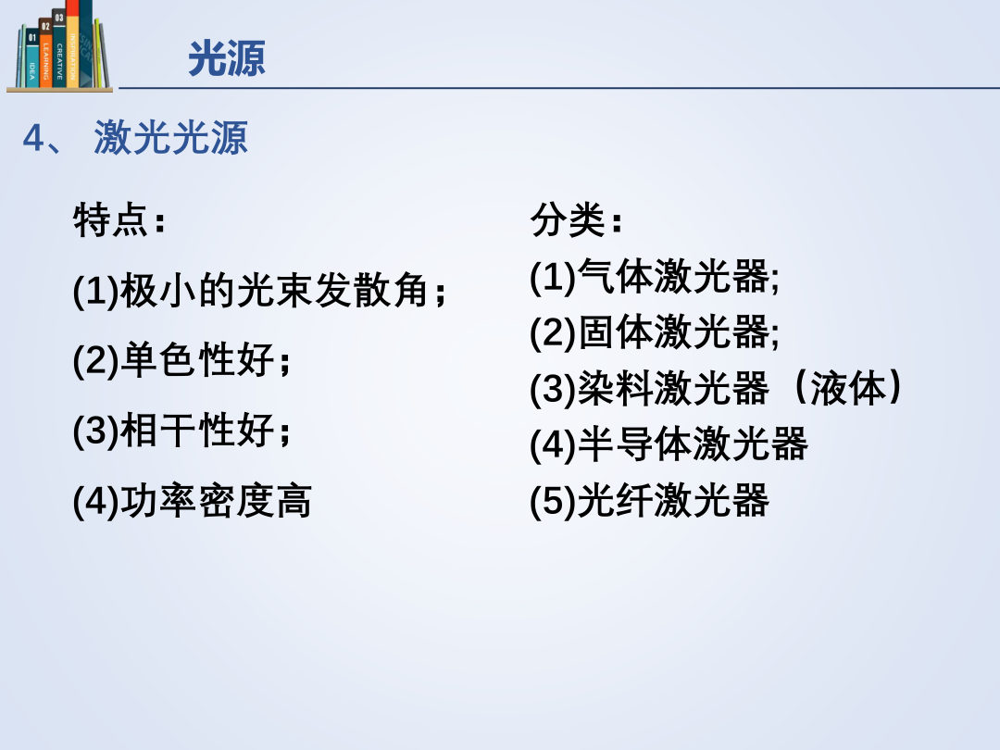

### 本页文字

```text
光源

4、 激光光源

 特点：         分类：
                  (1)气体激光器;  (1)极小的光束发散角；
                  (2)固体激光器;
  (2)单色性好；
               (3)染料激光器（液体）
  (3)相干性好；                (4)半导体激光器
  (4)功率密度高       (5)光纤激光器
```

## 第 117 页

**页面标题/首行：** * 新型电调制红外光源

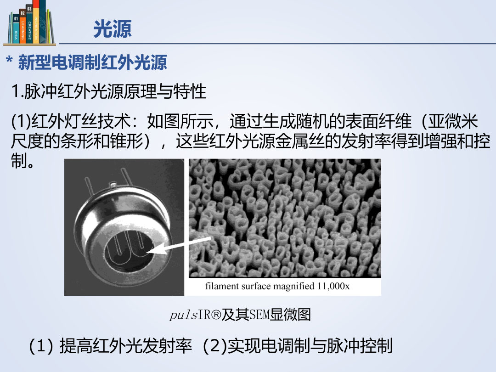

### 本页文字

```text
光源
* 新型电调制红外光源
1.脉冲红外光源原理与特性
(1)红外灯丝技术：如图所示，通过生成随机的表面纤维（亚微米
尺度的条形和锥形），这些红外光源金属丝的发射率得到增强和控
制。

                 pulsIR及其SEM显微图

   (1) 提高红外光发射率(2)实现电调制与脉冲控制
```

## 第 118 页

**页面标题/首行：** * 新型电调制红外光源

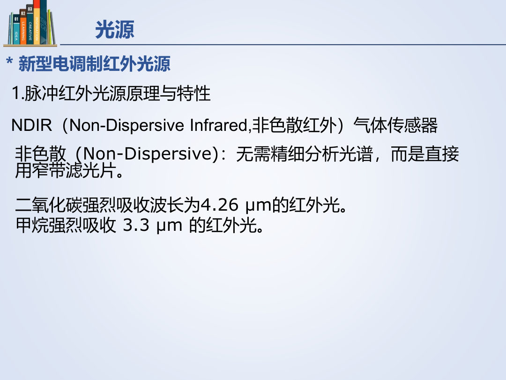

### 本页文字

```text
光源
* 新型电调制红外光源
1.脉冲红外光源原理与特性
 NDIR（Non-Dispersive Infrared,非色散红外）气体传感器
 非色散 (Non-Dispersive)：无需精细分析光谱，而是直接
 用窄带滤光片。

 二氧化碳强烈吸收波长为4.26 μm的红外光。
 甲烷强烈吸收 3.3 μm 的红外光。
```

## 第 119 页

**页面标题/首行：** 填空题 1分

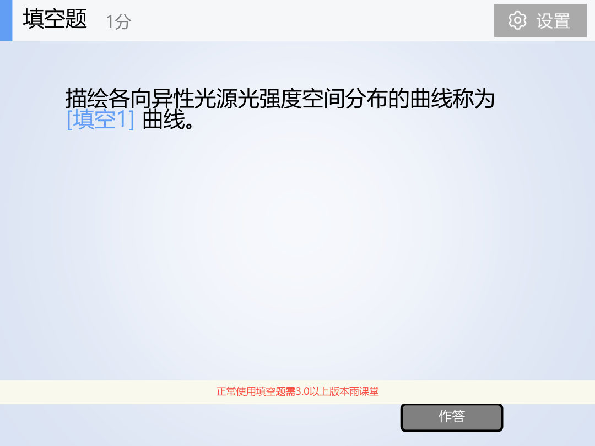

### 本页文字

```text
填空题 1分

  描绘各向异性光源光强度空间分布的曲线称为
   [填空1] 曲线。

                     正常使用填空题需3.0以上版本雨课堂

                                作答
```

## 第 120 页

**页面标题/首行：** 光谱仪器

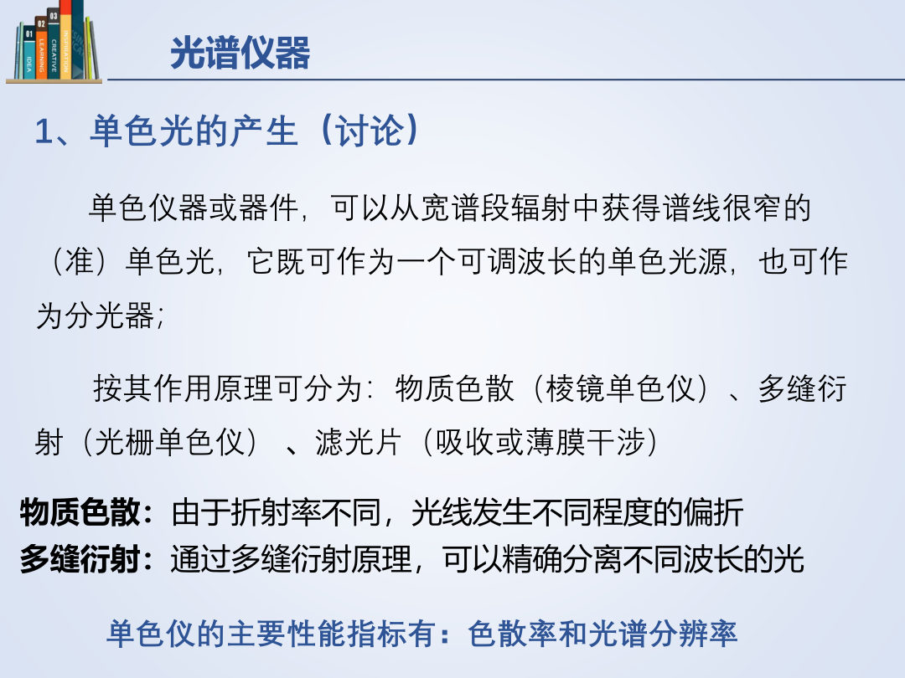

### 本页文字

```text
光谱仪器

1、单色光的产生（讨论）

  单色仪器或器件，可以从宽谱段辐射中获得谱线很窄的

（准）单色光，它既可作为一个可调波长的单色光源，也可作

为分光器；

  按其作用原理可分为：物质色散（棱镜单色仪）、多缝衍

射（光栅单色仪） 、滤光片（吸收或薄膜干涉）

物质色散：由于折射率不同，光线发生不同程度的偏折
多缝衍射：通过多缝衍射原理，可以精确分离不同波长的光

   单色仪的主要性能指标有：色散率和光谱分辨率
```

## 第 121 页

**页面标题/首行：** 光谱仪器

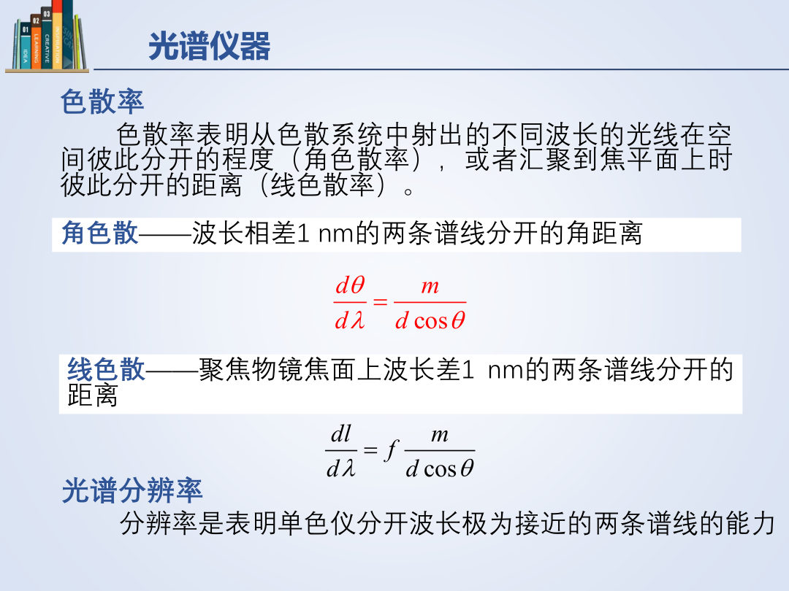

### 本页文字

```text
光谱仪器

色散率
  色散率表明从色散系统中射出的不同波长的光线在空
间彼此分开的程度（角色散率），或者汇聚到焦平面上时
彼此分开的距离（线色散率）。

角色散——波长相差1 nm的两条谱线分开的角距离

                      d   m
                      =
                     d   d cos

线色散——聚焦物镜焦面上波长差1 nm的两条谱线分开的
距离
                            dl    m
                      =  f
                     d    d cos
光谱分辨率
  分辨率是表明单色仪分开波长极为接近的两条谱线的能力
```

## 第 122 页

**页面标题/首行：** 光谱仪器

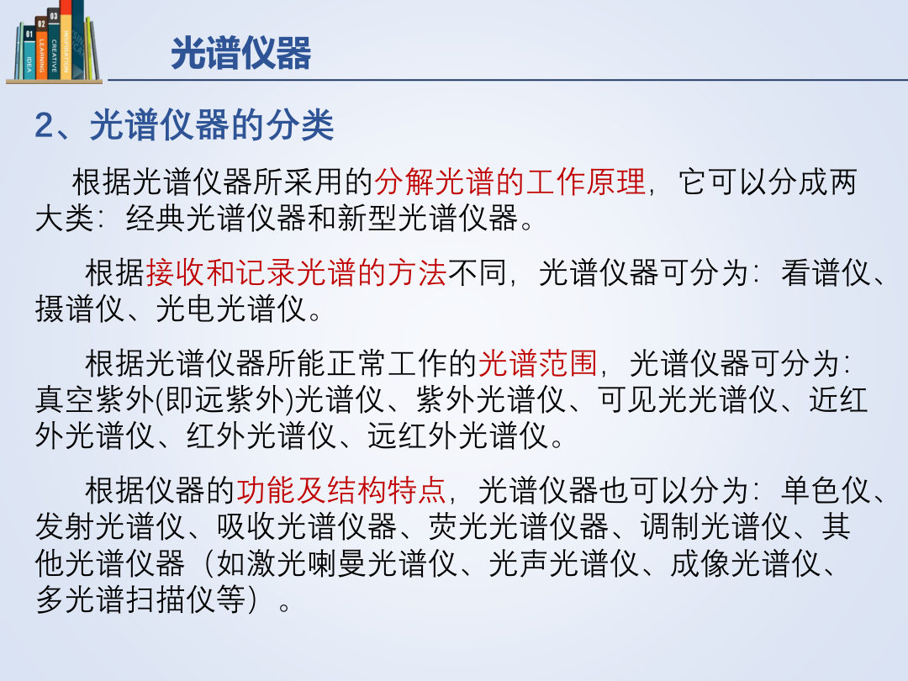

### 本页文字

```text
光谱仪器

2、光谱仪器的分类

 根据光谱仪器所采用的分解光谱的工作原理，它可以分成两
大类：经典光谱仪器和新型光谱仪器。

  根据接收和记录光谱的方法不同，光谱仪器可分为：看谱仪、
摄谱仪、光电光谱仪。

  根据光谱仪器所能正常工作的光谱范围，光谱仪器可分为：
真空紫外(即远紫外)光谱仪、紫外光谱仪、可见光光谱仪、近红
外光谱仪、红外光谱仪、远红外光谱仪。

  根据仪器的功能及结构特点，光谱仪器也可以分为：单色仪、
发射光谱仪、吸收光谱仪器、荧光光谱仪器、调制光谱仪、其
他光谱仪器（如激光喇曼光谱仪、光声光谱仪、成像光谱仪、
多光谱扫描仪等）。
```

## 第 123 页

**页面标题/首行：** 光谱仪器

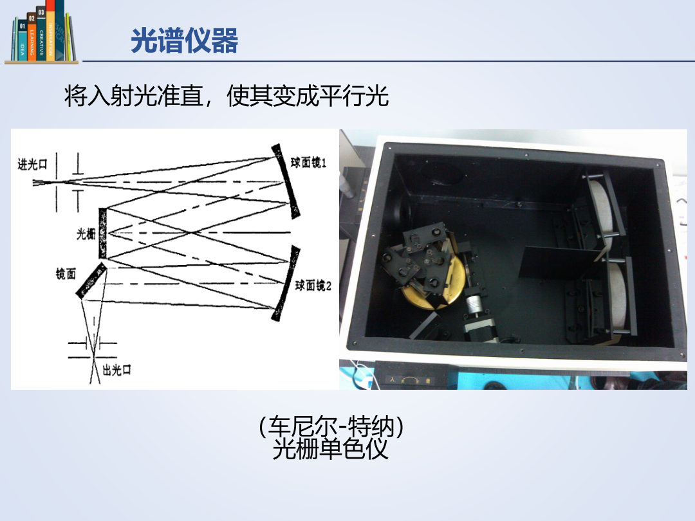

### 本页文字

```text
光谱仪器

将入射光准直，使其变成平行光

        （车尼尔-特纳）
         光栅单色仪
```

## 第 124 页

**页面标题/首行：** 光源选择的基本要求

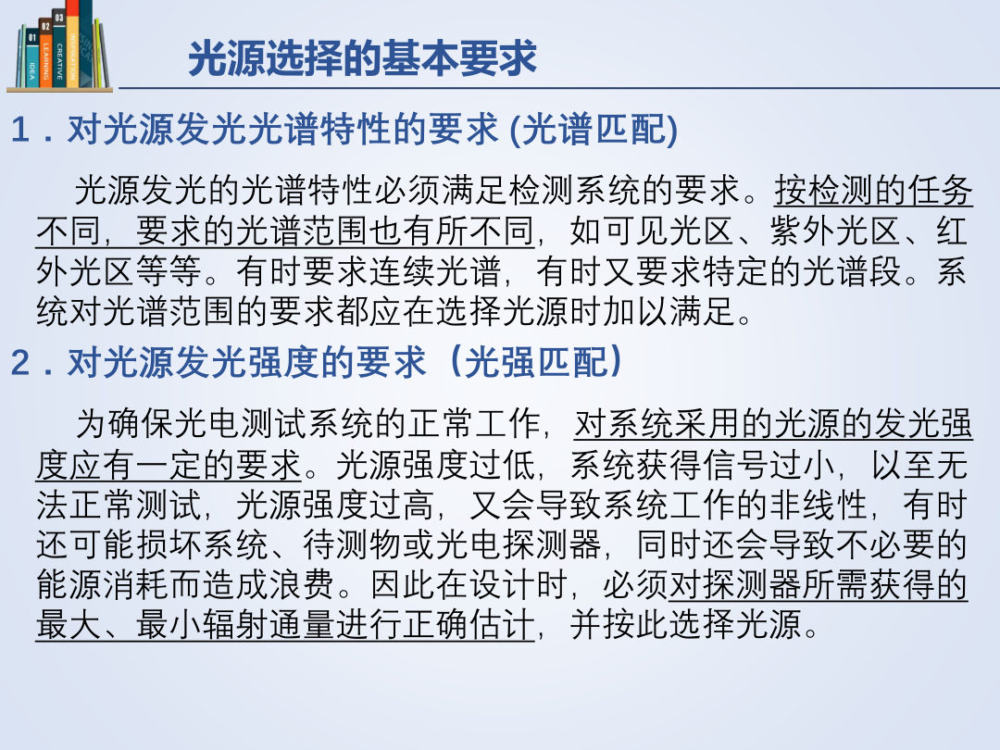

### 本页文字

```text
光源选择的基本要求

1．对光源发光光谱特性的要求 (光谱匹配)

  光源发光的光谱特性必须满足检测系统的要求。按检测的任务
 不同，要求的光谱范围也有所不同，如可见光区、紫外光区、红
 外光区等等。有时要求连续光谱，有时又要求特定的光谱段。系
 统对光谱范围的要求都应在选择光源时加以满足。
2．对光源发光强度的要求（光强匹配）

  为确保光电测试系统的正常工作，对系统采用的光源的发光强
 度应有一定的要求。光源强度过低，系统获得信号过小，以至无
 法正常测试，光源强度过高，又会导致系统工作的非线性，有时
 还可能损坏系统、待测物或光电探测器，同时还会导致不必要的
 能源消耗而造成浪费。因此在设计时，必须对探测器所需获得的
 最大、最小辐射通量进行正确估计，并按此选择光源。
```

## 第 125 页

**页面标题/首行：** 光源选择的基本要求

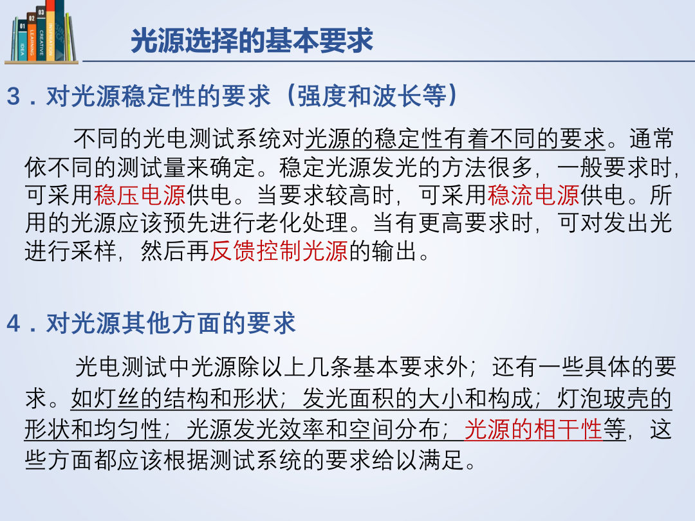

### 本页文字

```text
光源选择的基本要求

3．对光源稳定性的要求（强度和波长等）

   不同的光电测试系统对光源的稳定性有着不同的要求。通常
 依不同的测试量来确定。稳定光源发光的方法很多，一般要求时，
 可采用稳压电源供电。当要求较高时，可采用稳流电源供电。所
 用的光源应该预先进行老化处理。当有更高要求时，可对发出光
 进行采样，然后再反馈控制光源的输出。

4．对光源其他方面的要求

   光电测试中光源除以上几条基本要求外；还有一些具体的要
 求。如灯丝的结构和形状；发光面积的大小和构成；灯泡玻壳的
 形状和均匀性；光源发光效率和空间分布；光源的相干性等，这
 些方面都应该根据测试系统的要求给以满足。
```
