# 第三章 色度和光度测试技术

- 源文件：`第三章 色度和光度测试技术.pdf`
- 页数：129
- 转换方式：每页保留原始页面截图，并提取 PDF 文本层作为可检索内容。
- 说明：公式、复杂图形、版式细节以页面截图为准；文字区用于搜索和快速复习。

## 页面索引

- [第 1 页：广州大学](#第-1-页)
- [第 2 页：色度学的基本概念和实验定律](#第-2-页)
- [第 3 页：2.光谱功率分布](#第-3-页)
- [第 4 页：1. 色温 同色异谱](#第-4-页)
- [第 5 页：可见光的波长范围及颜色：](#第-5-页)
- [第 6 页：• 色度学：研究人的颜色视觉规律、颜色测量理论与技术](#第-6-页)
- [第 7 页：色度学的基本概念和实验定律](#第-7-页)
- [第 8 页：色度学的基本概念和实验定律](#第-8-页)
- [第 9 页：第 9 页](#第-9-页)
- [第 10 页：色度学的基本概念和实验定律](#第-10-页)
- [第 11 页：色度学的基本概念和实验定律](#第-11-页)
- [第 12 页：色度学的基本概念和实验定律](#第-12-页)
- [第 13 页：色度学的基本概念和实验定律](#第-13-页)
- [第 14 页：单选题 1分](#第-14-页)
- [第 15 页：填空题 1分](#第-15-页)
- [第 16 页：色度学的基本概念和实验定律](#第-16-页)
- [第 17 页：为什么互补色混合为白色？](#第-17-页)
- [第 18 页：•Violet: 400 - 420 nm](#第-18-页)
- [第 19 页：色度学的基本概念和实验定律](#第-19-页)
- [第 20 页：人眼主要依靠 红（L锥）、绿（M锥）、蓝（S锥） 三种视锥细胞来感知颜色。](#第-20-页)
- [第 21 页：色度学的基本概念和实验定律](#第-21-页)
- [第 22 页：色度学的基本概念和实验定律](#第-22-页)
- [第 23 页：色度学的基本概念和实验定律](#第-23-页)
- [第 24 页：色度学的基本概念和实验定律](#第-24-页)
- [第 25 页：色料三原色：青(C) 、品红(M)、黄(Y)](#第-25-页)
- [第 26 页：第 26 页](#第-26-页)
- [第 27 页：色度学的基本概念和实验定律](#第-27-页)
- [第 28 页：色光三原色（RGB）/适用于发光系统](#第-28-页)
- [第 29 页：色度学的基本概念和实验定律](#第-29-页)
- [第 30 页：色度学的基本概念和实验定律](#第-30-页)
- [第 31 页：填空题 2分](#第-31-页)
- [第 32 页：格拉斯曼颜色混合定律](#第-32-页)
- [第 33 页：第 33 页](#第-33-页)
- [第 34 页：色度学的基本概念和实验定律](#第-34-页)
- [第 35 页：色度学的基本概念和实验定律](#第-35-页)
- [第 36 页：第 36 页](#第-36-页)
- [第 37 页：色度学的基本概念和实验定律](#第-37-页)
- [第 38 页：色度学的基本概念和实验定律](#第-38-页)
- [第 39 页：色度学的基本概念和实验定律](#第-39-页)
- [第 40 页：E 光源（等能白光）](#第-40-页)
- [第 41 页：E 光源（等能白光）](#第-41-页)
- [第 42 页：色度学的基本概念和实验定律](#第-42-页)
- [第 43 页：色度学的基本概念和实验定律](#第-43-页)
- [第 44 页：色度学的基本概念和实验定律](#第-44-页)
- [第 45 页：色度学的基本概念和实验定律](#第-45-页)
- [第 46 页：色度学的基本概念和实验定律](#第-46-页)
- [第 47 页：填空题 2分](#第-47-页)
- [第 48 页：色度学的基本概念和实验定律](#第-48-页)
- [第 49 页：两位英国物理学家](#第-49-页)
- [第 50 页：色度学的基本概念和实验定律](#第-50-页)
- [第 51 页：色度学的基本概念和实验定律](#第-51-页)
- [第 52 页：色度学的基本概念和实验定律](#第-52-页)
- [第 53 页：色度学的基本概念和实验定律](#第-53-页)
- [第 54 页：色度学的基本概念和实验定律](#第-54-页)
- [第 55 页：色度学的基本概念和实验定律](#第-55-页)
- [第 56 页：色度学的基本概念和实验定律](#第-56-页)
- [第 57 页：色度学的基本概念和实验定律](#第-57-页)
- [第 58 页：色度学的基本概念和实验定律](#第-58-页)
- [第 59 页：色度学的基本概念和实验定律](#第-59-页)
- [第 60 页：色度学的基本概念和实验定律](#第-60-页)
- [第 61 页：色度学的基本概念和实验定律](#第-61-页)
- [第 62 页：色度学的基本概念和实验定律](#第-62-页)
- [第 63 页：色度学的基本概念和实验定律](#第-63-页)
- [第 64 页：色度学的基本概念和实验定律这段不是光谱色，而是](#第-64-页)
- [第 65 页：色度学的基本概念和实验定律](#第-65-页)
- [第 66 页：Advanced Materials 36.45 (2024): 2409361.](#第-66-页)
- [第 67 页：光刺激的数学表示 𝜑(𝜆) 描述了各个波长处的能量分布](#第-67-页)
- [第 68 页：多选题 2分](#第-68-页)
- [第 69 页：单选题 1分](#第-69-页)
- [第 70 页：填空题 1分](#第-70-页)
- [第 71 页：色度学的基本概念和实验定律](#第-71-页)
- [第 72 页：第 72 页](#第-72-页)
- [第 73 页：色度学的基本概念和实验定律](#第-73-页)
- [第 74 页：色度学的基本概念和实验定律](#第-74-页)
- [第 75 页：色度学的基本概念和实验定律](#第-75-页)
- [第 76 页：填空题 2分](#第-76-页)
- [第 77 页：第 77 页](#第-77-页)
- [第 78 页：颜色的三刺激值：匹配某种颜色所需的三原色的量](#第-78-页)
- [第 79 页：去掉整体亮度尺度，得到色品坐标](#第-79-页)
- [第 80 页：Advanced Materials 36.45 (2024): 2409361.](#第-80-页)
- [第 81 页：第 81 页](#第-81-页)
- [第 82 页：色度学的基本概念和实验定律](#第-82-页)
- [第 83 页：色度学的基本概念和实验定律](#第-83-页)
- [第 84 页：色度学的基本概念和实验定律](#第-84-页)
- [第 85 页：色度学的基本概念和实验定律](#第-85-页)
- [第 86 页：填空题 2分](#第-86-页)
- [第 87 页：CIE色度计算方法](#第-87-页)
- [第 88 页：CIE色度计算方法](#第-88-页)
- [第 89 页：CIE色度计算方法](#第-89-页)
- [第 90 页：CIE色度计算方法](#第-90-页)
- [第 91 页：CIE色度计算方法](#第-91-页)
- [第 92 页：CIE色度计算方法](#第-92-页)
- [第 93 页：CIE色度计算方法](#第-93-页)
- [第 94 页：CIE色度计算方法](#第-94-页)
- [第 95 页：CIE色度计算方法](#第-95-页)
- [第 96 页：色度的测试方法和应用](#第-96-页)
- [第 97 页：色度的测试方法和应用](#第-97-页)
- [第 98 页：色度的测试方法和应用](#第-98-页)
- [第 99 页：色度的测试方法和应用](#第-99-页)
- [第 100 页：色度的测试方法和应用](#第-100-页)
- [第 101 页：色度的测试方法和应用](#第-101-页)
- [第 102 页：色度的测试方法和应用](#第-102-页)
- [第 103 页：色度的测试方法和应用](#第-103-页)
- [第 104 页：色度的测试方法和应用](#第-104-页)
- [第 105 页：色度的测试方法和应用](#第-105-页)
- [第 106 页：色度的测试方法和应用](#第-106-页)
- [第 107 页：色度的测试方法和应用](#第-107-页)
- [第 108 页：色度的测试方法和应用](#第-108-页)
- [第 109 页：Advanced Materials 36.45 (2024): 2409361.](#第-109-页)
- [第 110 页：色度的测试方法和应用](#第-110-页)
- [第 111 页：色度的测试方法和应用](#第-111-页)
- [第 112 页：第 112 页](#第-112-页)
- [第 113 页：多选题 2分](#第-113-页)
- [第 114 页：色度的测试方法和应用](#第-114-页)
- [第 115 页：色度的测试方法和应用](#第-115-页)
- [第 116 页：色度的测试方法和应用](#第-116-页)
- [第 117 页：色度的测试方法和应用](#第-117-页)
- [第 118 页：色度的测试方法和应用](#第-118-页)
- [第 119 页：色度的测试方法和应用](#第-119-页)
- [第 120 页：光学系统透过率测试技术](#第-120-页)
- [第 121 页：光学系统透过率测试技术](#第-121-页)
- [第 122 页：光学系统透过率测试技术](#第-122-页)
- [第 123 页：光学系统透过率测试技术](#第-123-页)
- [第 124 页：光学系统透过率测试技术](#第-124-页)
- [第 125 页：光学系统透过率测试技术](#第-125-页)
- [第 126 页：光学系统透过率测试技术](#第-126-页)
- [第 127 页：光学系统透过率测试技术](#第-127-页)
- [第 128 页：光学系统透过率测试技术](#第-128-页)
- [第 129 页：Page 50  1.1和1.6](#第-129-页)

## 第 1 页

**页面标题/首行：** 广州大学


### 本页文字

```text
广州大学

光电检测技术
     方佳文

    Jiawen.fang@gzhu.edu.cn

                                                                                      1
```

## 第 2 页

**页面标题/首行：** 色度学的基本概念和实验定律

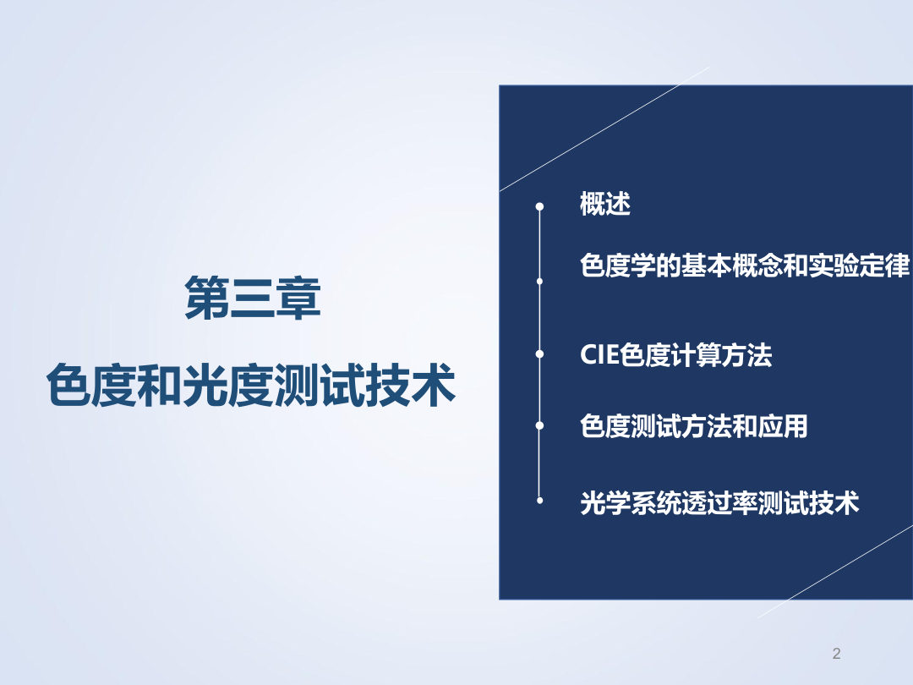

### 本页文字

```text
概述

                     色度学的基本概念和实验定律
   第三章
                         CIE色度计算方法
色度和光度测试技术
                     色度测试方法和应用

                     光学系统透过率测试技术

                                                                                             2
```

## 第 3 页

**页面标题/首行：** 2.光谱功率分布

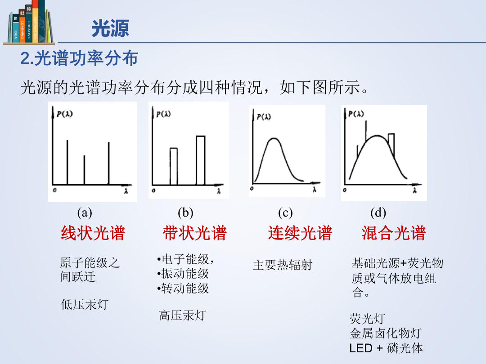

### 本页文字

```text
光源

2.光谱功率分布

光源的光谱功率分布分成四种情况，如下图所示。

           (a)                (b)                 (c)               (d)
  线状光谱  带状光谱  连续光谱  混合光谱

             •电子能级，   原子能级之           主要热辐射   基础光源+荧光物
             •振动能级   间跃迁                     质或气体放电组
             •转动能级                           合。
   低压汞灯
           高压汞灯                           荧光灯
                           金属卤化物灯
                                          LED + 磷光体
```

## 第 4 页

**页面标题/首行：** 1. 色温 同色异谱

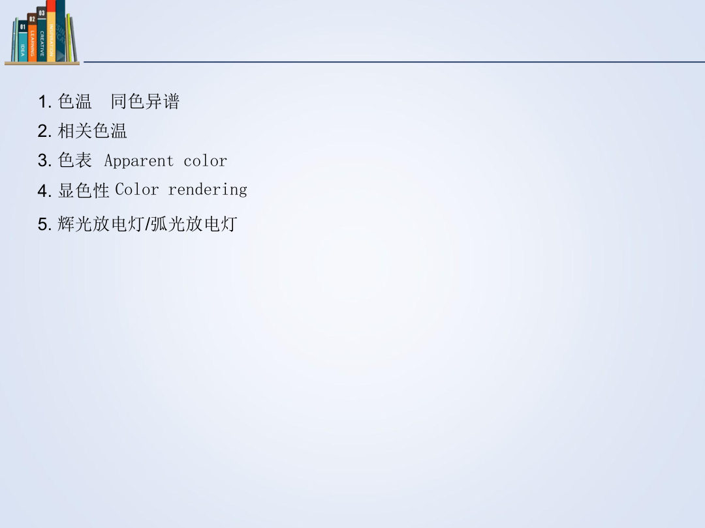

### 本页文字

```text
1. 色温 同色异谱

2. 相关色温

3. 色表Apparent color
4. 显色性Color rendering

5. 辉光放电灯/弧光放电灯
```

## 第 5 页

**页面标题/首行：** 可见光的波长范围及颜色：

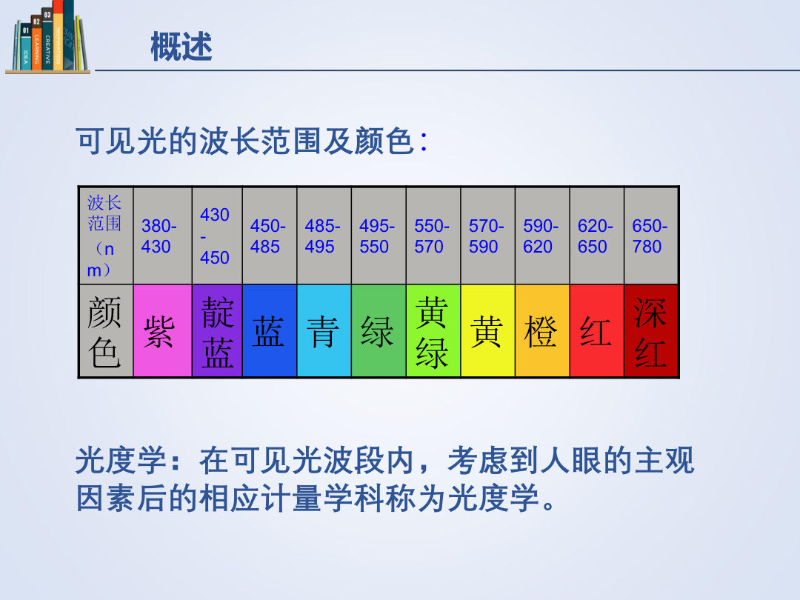

### 本页文字

```text
概述

可见光的波长范围及颜色：

 波长
             430
 范围  380-        450-  485-  495-  550-  570-  590-  620-  650-
                     -
 （n   430        485   495   550   570   590   620   650   780             450
 m）
颜色紫靛蓝蓝青绿黄绿黄橙红深红

光度学：在可见光波段内，考虑到人眼的主观
因素后的相应计量学科称为光度学。
```

## 第 6 页

**页面标题/首行：** • 色度学：研究人的颜色视觉规律、颜色测量理论与技术

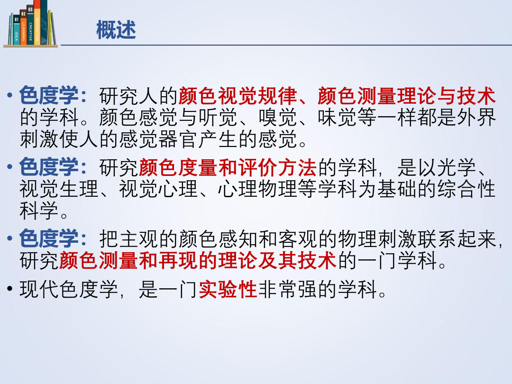

### 本页文字

```text
概述

• 色度学：研究人的颜色视觉规律、颜色测量理论与技术
 的学科。颜色感觉与听觉、嗅觉、味觉等一样都是外界
 刺激使人的感觉器官产生的感觉。
• 色度学：研究颜色度量和评价方法的学科，是以光学、
 视觉生理、视觉心理、心理物理等学科为基础的综合性
 科学。
• 色度学：把主观的颜色感知和客观的物理刺激联系起来，
 研究颜色测量和再现的理论及其技术的一门学科。
• 现代色度学，是一门实验性非常强的学科。
```

## 第 7 页

**页面标题/首行：** 色度学的基本概念和实验定律

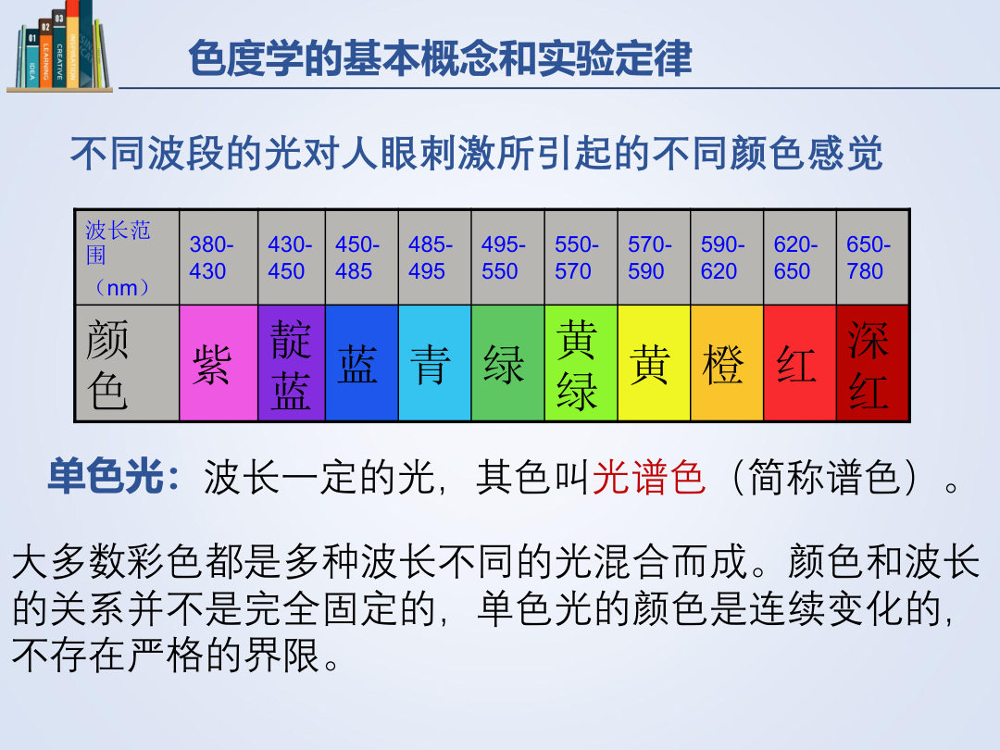

### 本页文字

```text
色度学的基本概念和实验定律

  不同波段的光对人眼刺激所引起的不同颜色感觉

   波长范
                380-   430-  450-   485-   495-   550-   570-   590-   620-   650-   围
               430   450  485   495   550   570   590   620   650   780
    （nm）
  颜 紫靛  色  蓝蓝青绿黄绿黄橙红深红

 单色光：波长一定的光，其色叫光谱色（简称谱色）。

大多数彩色都是多种波长不同的光混合而成。颜色和波长
的关系并不是完全固定的，单色光的颜色是连续变化的，
不存在严格的界限。
```

## 第 8 页

**页面标题/首行：** 色度学的基本概念和实验定律

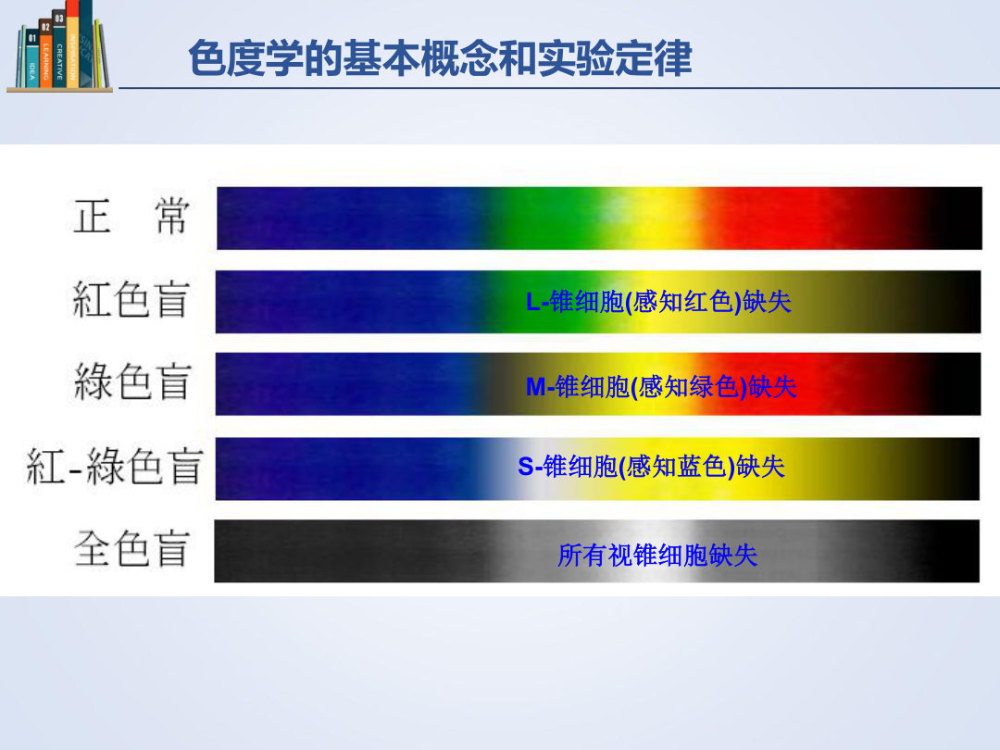

### 本页文字

```text
色度学的基本概念和实验定律

                L-锥细胞(感知红色)缺失

                M-锥细胞(感知绿色)缺失

                S-锥细胞(感知蓝色)缺失

               所有视锥细胞缺失
```

## 第 9 页

**页面标题/首行：** 第 9 页


### 本页文字

```text
视频
```

## 第 10 页

**页面标题/首行：** 色度学的基本概念和实验定律

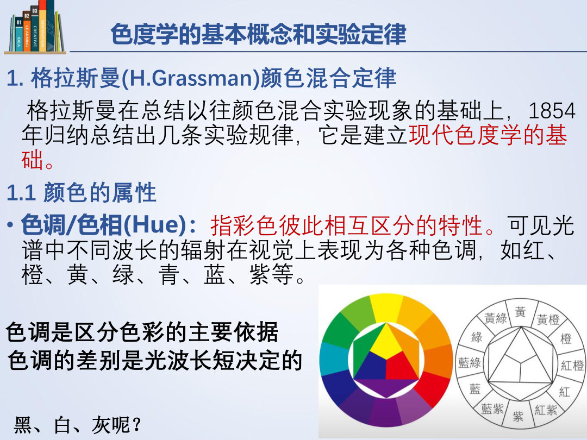

### 本页文字

```text
色度学的基本概念和实验定律

1. 格拉斯曼(H.Grassman)颜色混合定律
 格拉斯曼在总结以往颜色混合实验现象的基础上，1854
 年归纳总结出几条实验规律，它是建立现代色度学的基
 础。
1.1 颜色的属性
• 色调/色相(Hue)：指彩色彼此相互区分的特性。可见光
 谱中不同波长的辐射在视觉上表现为各种色调，如红、
 橙、黄、绿、青、蓝、紫等。

色调是区分色彩的主要依据
色调的差别是光波长短决定的

黑、白、灰呢？
```

## 第 11 页

**页面标题/首行：** 色度学的基本概念和实验定律

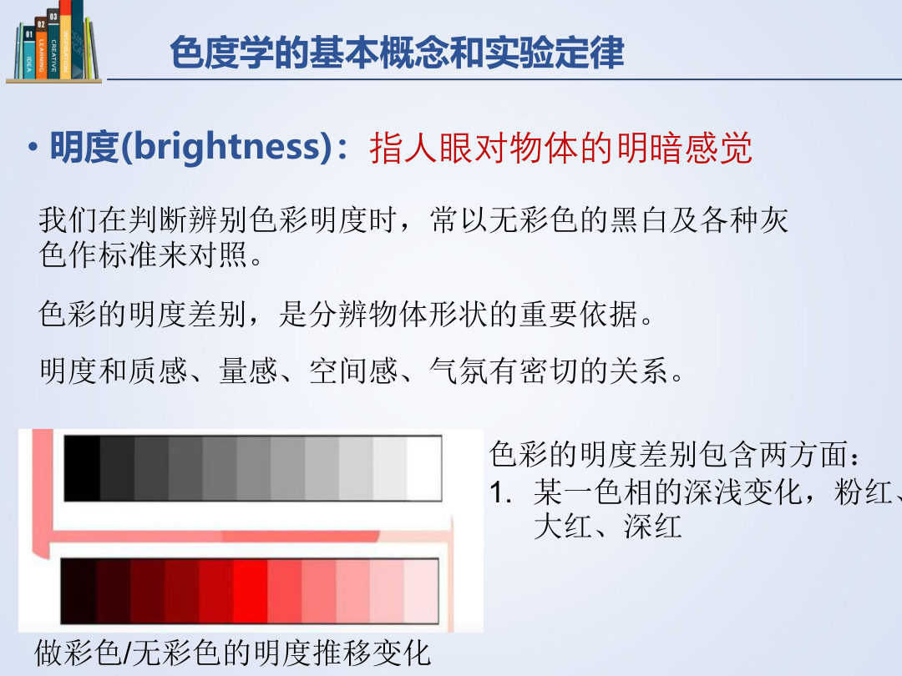

### 本页文字

```text
色度学的基本概念和实验定律

• 明度(brightness)：指人眼对物体的明暗感觉

我们在判断辨别色彩明度时，常以无彩色的黑白及各种灰
色作标准来对照。

色彩的明度差别，是分辨物体形状的重要依据。

明度和质感、量感、空间感、气氛有密切的关系。

               色彩的明度差别包含两方面：
                                     1. 某一色相的深浅变化，粉红、
                 大红、深红

做彩色/无彩色的明度推移变化
```

## 第 12 页

**页面标题/首行：** 色度学的基本概念和实验定律

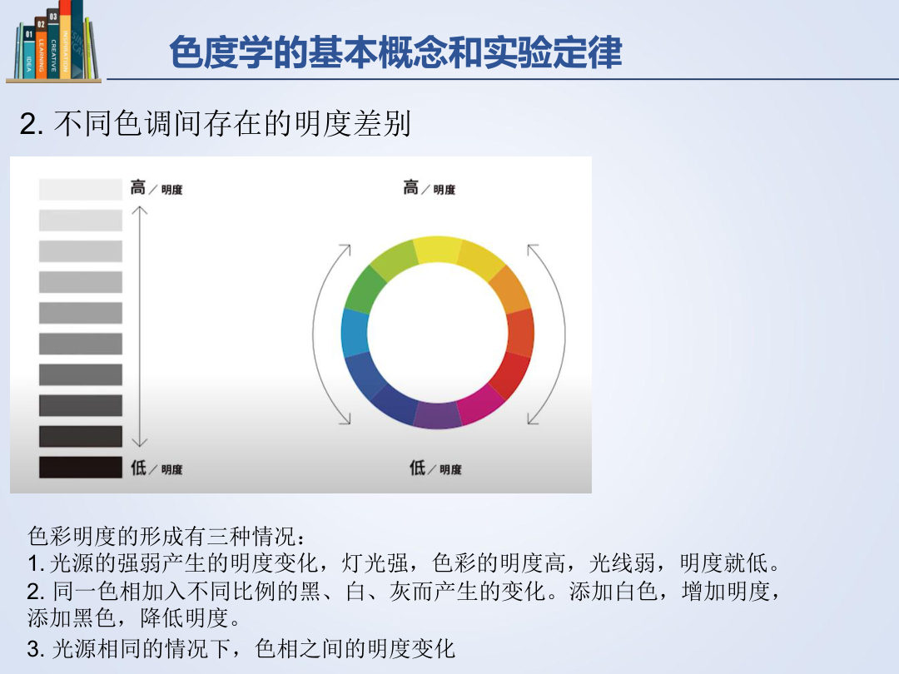

### 本页文字

```text
色度学的基本概念和实验定律

2. 不同色调间存在的明度差别

色彩明度的形成有三种情况：
 1. 光源的强弱产生的明度变化，灯光强，色彩的明度高，光线弱，明度就低。
 2. 同一色相加入不同比例的黑、白、灰而产生的变化。添加白色，增加明度，
添加黑色，降低明度。
 3. 光源相同的情况下，色相之间的明度变化
```

## 第 13 页

**页面标题/首行：** 色度学的基本概念和实验定律

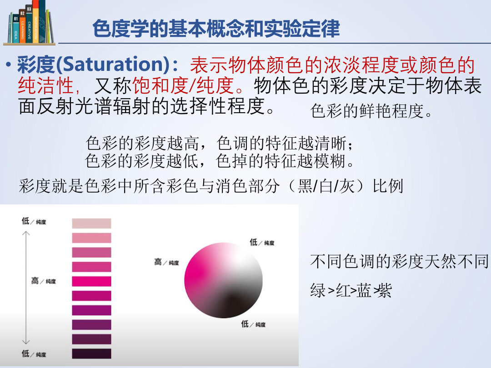

### 本页文字

```text
色度学的基本概念和实验定律
• 彩度(Saturation)：表示物体颜色的浓淡程度或颜色的
 纯洁性，又称饱和度/纯度。物体色的彩度决定于物体表
 面反射光谱辐射的选择性程度。                   色彩的鲜艳程度。

     色彩的彩度越高，色调的特征越清晰；
     色彩的彩度越低，色掉的特征越模糊。
 彩度就是色彩中所含彩色与消色部分（黑/白/灰）比例

                   不同色调的彩度天然不同

               绿红>  >蓝 >紫
```

## 第 14 页

**页面标题/首行：** 单选题 1分

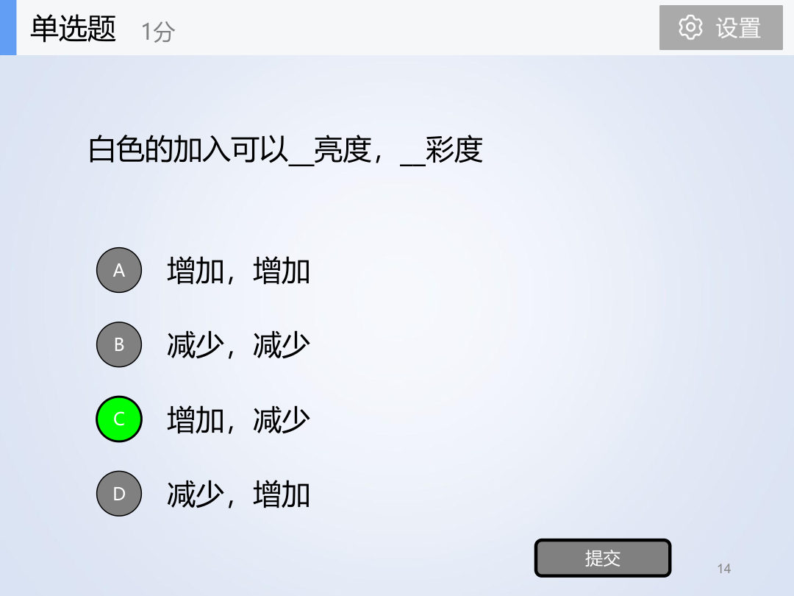

### 本页文字

```text
单选题 1分

  白色的加入可以__亮度，__彩度

       A     增加，增加

        B     减少，减少

       C     增加，减少

      D     减少，增加

                                提交                                                                                             14
```

## 第 15 页

**页面标题/首行：** 填空题 1分

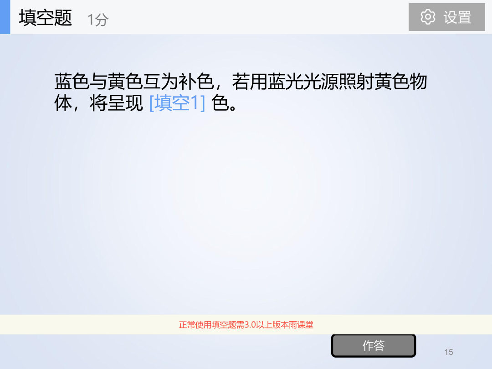

### 本页文字

```text
填空题 1分

  蓝色与黄色互为补色，若用蓝光光源照射黄色物
  体，将呈现 [填空1] 色。

                     正常使用填空题需3.0以上版本雨课堂

                                作答                                                                                             15
```

## 第 16 页

**页面标题/首行：** 色度学的基本概念和实验定律

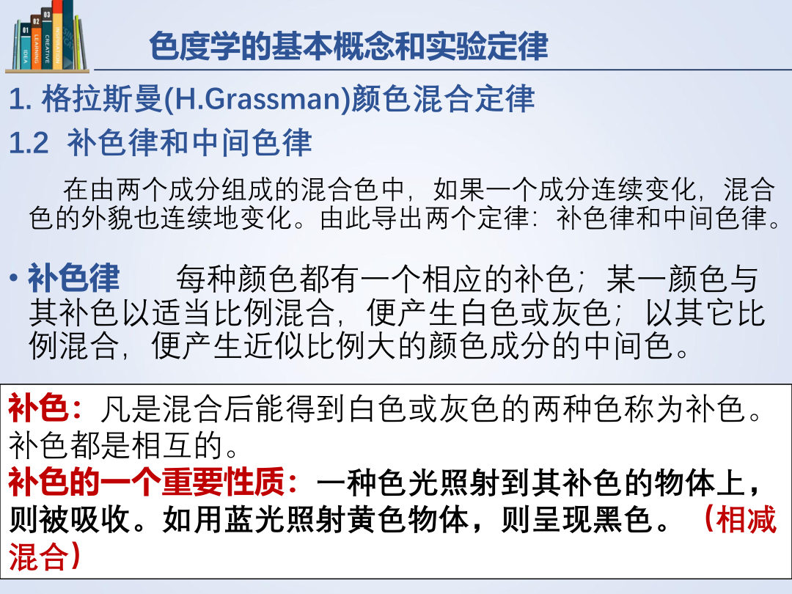

### 本页文字

```text
色度学的基本概念和实验定律

1. 格拉斯曼(H.Grassman)颜色混合定律
1.2 补色律和中间色律

  在由两个成分组成的混合色中，如果一个成分连续变化，混合
 色的外貌也连续地变化。由此导出两个定律：补色律和中间色律。

• 补色律  每种颜色都有一个相应的补色；某一颜色与
 其补色以适当比例混合，便产生白色或灰色；以其它比
 例混合，便产生近似比例大的颜色成分的中间色。

补色：凡是混合后能得到白色或灰色的两种色称为补色。
补色都是相互的。
补色的一个重要性质：一种色光照射到其补色的物体上，
则被吸收。如用蓝光照射黄色物体，则呈现黑色。（相减
混合）
```

## 第 17 页

**页面标题/首行：** 为什么互补色混合为白色？

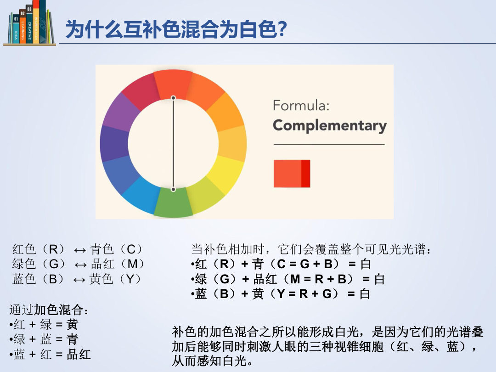

### 本页文字

```text
为什么互补色混合为白色？

红色（R）  青色（C）   当补色相加时，它们会覆盖整个可见光光谱：
绿色（G）  品红（M）    •红（R）+ 青（C = G + B） = 白
蓝色（B）  黄色（Y）    •绿（G）+ 品红（M = R + B） = 白
                   •蓝（B）+ 黄（Y = R + G） = 白
通过加色混合：
•红 + 绿 = 黄
             补色的加色混合之所以能形成白光，是因为它们的光谱叠
•绿 + 蓝 = 青
             加后能够同时刺激人眼的三种视锥细胞（红、绿、蓝），
•蓝 + 红 = 品红             从而感知白光。
```

## 第 18 页

**页面标题/首行：** •Violet: 400 - 420 nm

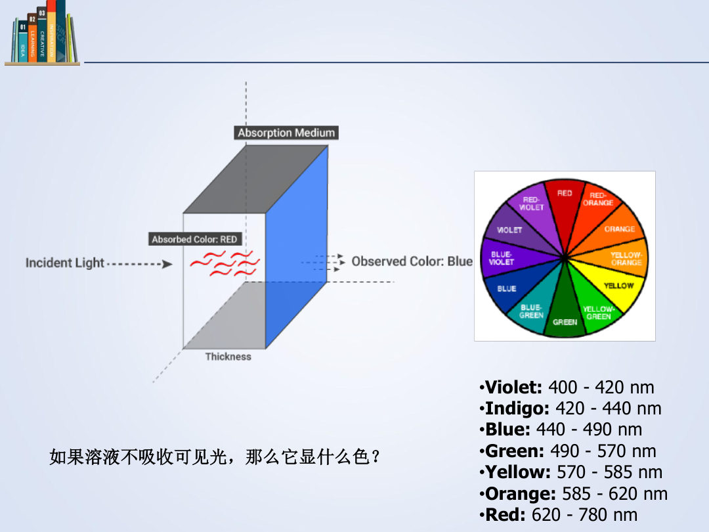

### 本页文字

```text
•Violet: 400 - 420 nm
                                                •Indigo: 420 - 440 nm
                                                  •Blue: 440 - 490 nm
                                              •Green: 490 - 570 nm如果溶液不吸收可见光，那么它显什么色？
                                               •Yellow: 570 - 585 nm
                                            •Orange: 585 - 620 nm
                                              •Red: 620 - 780 nm
```

## 第 19 页

**页面标题/首行：** 色度学的基本概念和实验定律

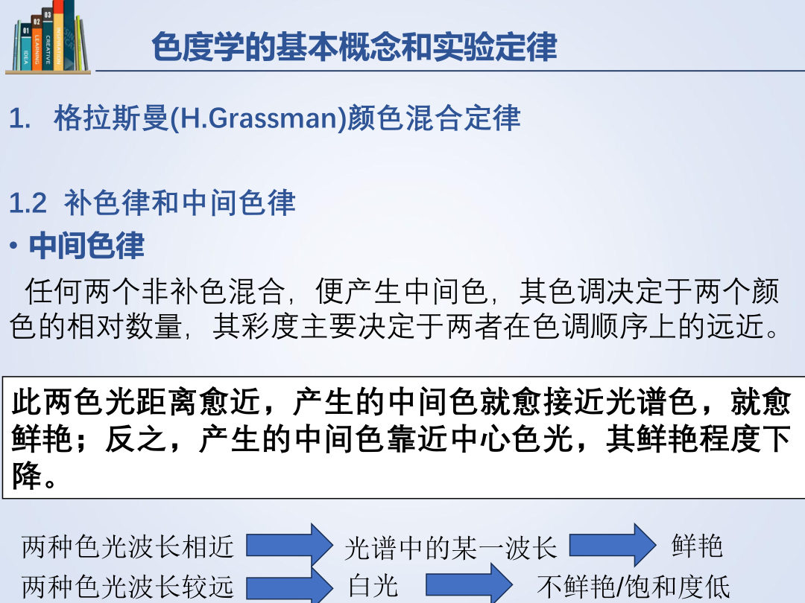

### 本页文字

```text
色度学的基本概念和实验定律

1. 格拉斯曼(H.Grassman)颜色混合定律

1.2 补色律和中间色律
• 中间色律
 任何两个非补色混合，便产生中间色，其色调决定于两个颜
色的相对数量，其彩度主要决定于两者在色调顺序上的远近。

此两色光距离愈近，产生的中间色就愈接近光谱色，就愈
鲜艳；反之，产生的中间色靠近中心色光，其鲜艳程度下
降。

两种色光波长相近    光谱中的某一波长    鲜艳
两种色光波长较远    白光      不鲜艳/饱和度低
```

## 第 20 页

**页面标题/首行：** 人眼主要依靠 红（L锥）、绿（M锥）、蓝（S锥） 三种视锥细胞来感知颜色。

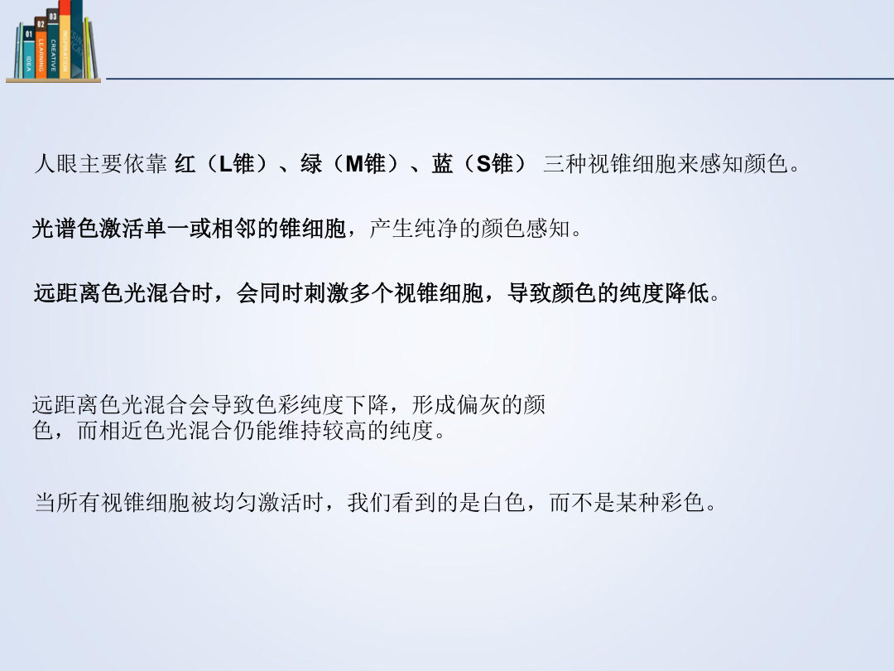

### 本页文字

```text
人眼主要依靠 红（L锥）、绿（M锥）、蓝（S锥） 三种视锥细胞来感知颜色。

光谱色激活单一或相邻的锥细胞，产生纯净的颜色感知。

远距离色光混合时，会同时刺激多个视锥细胞，导致颜色的纯度降低。

远距离色光混合会导致色彩纯度下降，形成偏灰的颜
色，而相近色光混合仍能维持较高的纯度。

当所有视锥细胞被均匀激活时，我们看到的是白色，而不是某种彩色。
```

## 第 21 页

**页面标题/首行：** 色度学的基本概念和实验定律

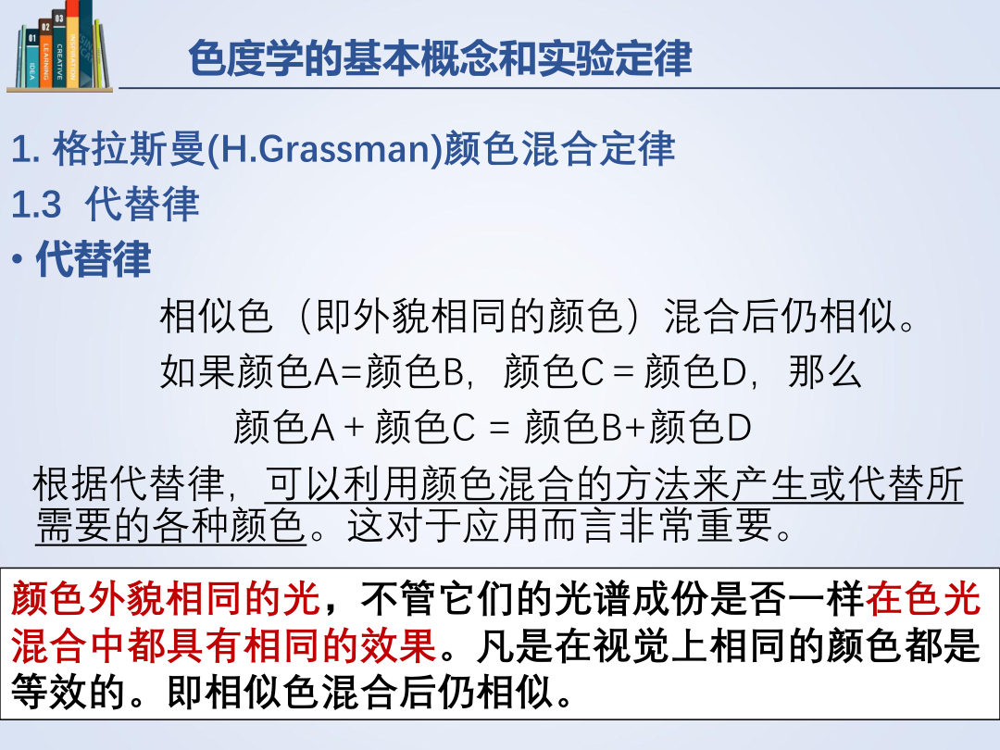

### 本页文字

```text
色度学的基本概念和实验定律

1. 格拉斯曼(H.Grassman)颜色混合定律
1.3 代替律
• 代替律
    相似色（即外貌相同的颜色）混合后仍相似。
    如果颜色A=颜色B，颜色C＝颜色D，那么
      颜色A＋颜色C = 颜色B+颜色D
 根据代替律，可以利用颜色混合的方法来产生或代替所
 需要的各种颜色。这对于应用而言非常重要。

颜色外貌相同的光，不管它们的光谱成份是否一样在色光
混合中都具有相同的效果。凡是在视觉上相同的颜色都是
等效的。即相似色混合后仍相似。
```

## 第 22 页

**页面标题/首行：** 色度学的基本概念和实验定律

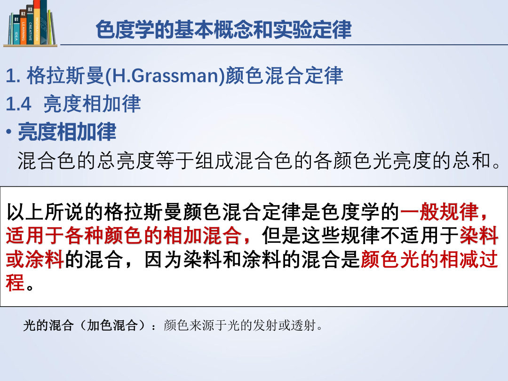

### 本页文字

```text
色度学的基本概念和实验定律

1. 格拉斯曼(H.Grassman)颜色混合定律
1.4 亮度相加律
• 亮度相加律
 混合色的总亮度等于组成混合色的各颜色光亮度的总和。

以上所说的格拉斯曼颜色混合定律是色度学的一般规律，
适用于各种颜色的相加混合，但是这些规律不适用于染料
或涂料的混合，因为染料和涂料的混合是颜色光的相减过
程。

 光的混合（加色混合）：颜色来源于光的发射或透射。
```

## 第 23 页

**页面标题/首行：** 色度学的基本概念和实验定律

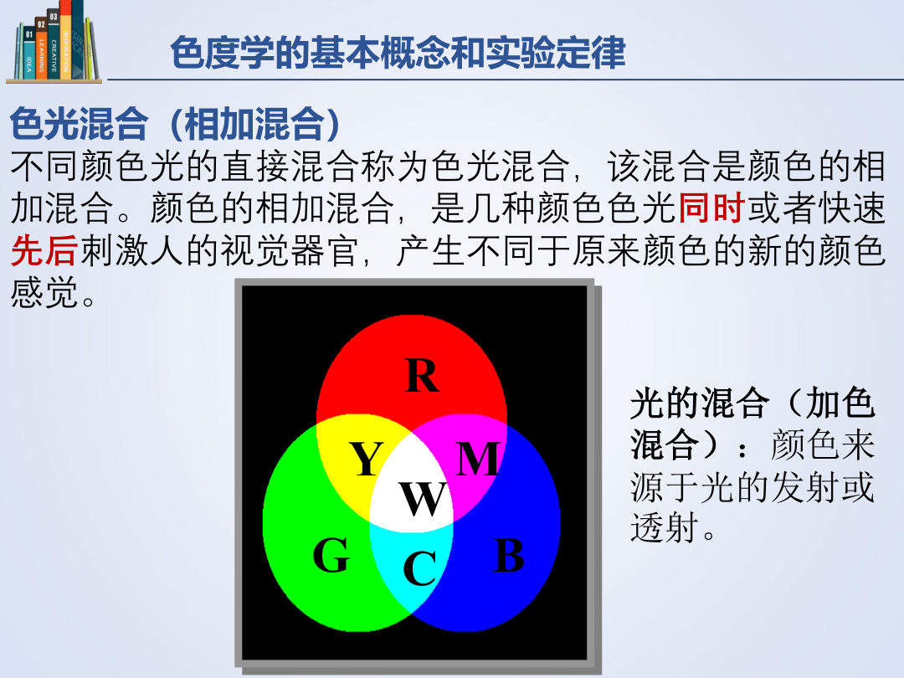

### 本页文字

```text
色度学的基本概念和实验定律

色光混合（相加混合）
不同颜色光的直接混合称为色光混合，该混合是颜色的相
加混合。颜色的相加混合，是几种颜色色光同时或者快速
先后刺激人的视觉器官，产生不同于原来颜色的新的颜色
感觉。

           RR                  光的混合（加色
         YY M    混合）：颜色来
        W     源于光的发射或
                  透射。
        GG    B           C
```

## 第 24 页

**页面标题/首行：** 色度学的基本概念和实验定律

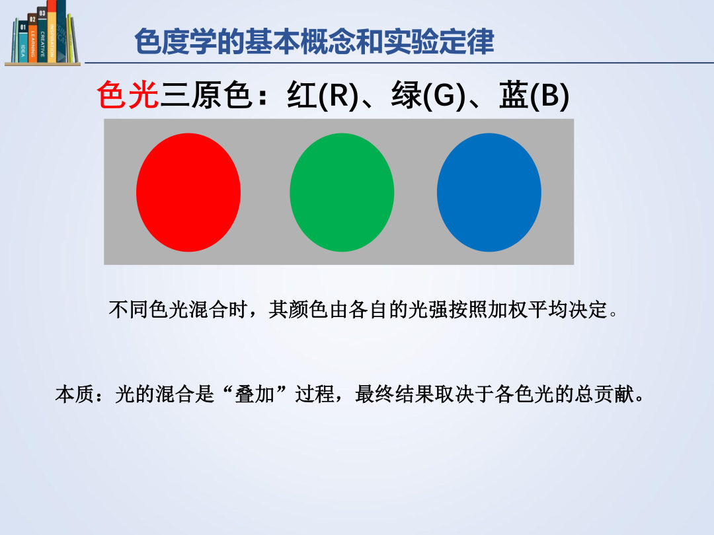

### 本页文字

```text
色度学的基本概念和实验定律

  色光三原色：红(R)、绿(G)、蓝(B)

   不同色光混合时，其颜色由各自的光强按照加权平均决定。

本质：光的混合是“叠加”过程，最终结果取决于各色光的总贡献。
```

## 第 25 页

**页面标题/首行：** 色料三原色：青(C) 、品红(M)、黄(Y)

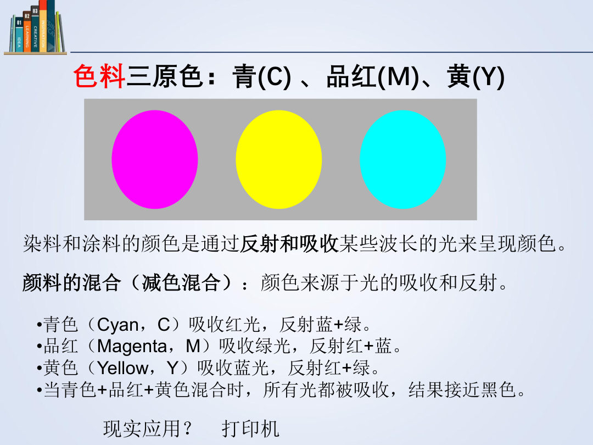

### 本页文字

```text
色料三原色：青(C) 、品红(M)、黄(Y)

染料和涂料的颜色是通过反射和吸收某些波长的光来呈现颜色。

颜料的混合（减色混合）：颜色来源于光的吸收和反射。

 •青色（Cyan，C）吸收红光，反射蓝+绿。
 •品红（Magenta，M）吸收绿光，反射红+蓝。
 •黄色（Yellow，Y）吸收蓝光，反射红+绿。
 •当青色+品红+黄色混合时，所有光都被吸收，结果接近黑色。

    现实应用？ 打印机
```

## 第 26 页

**页面标题/首行：** 第 26 页

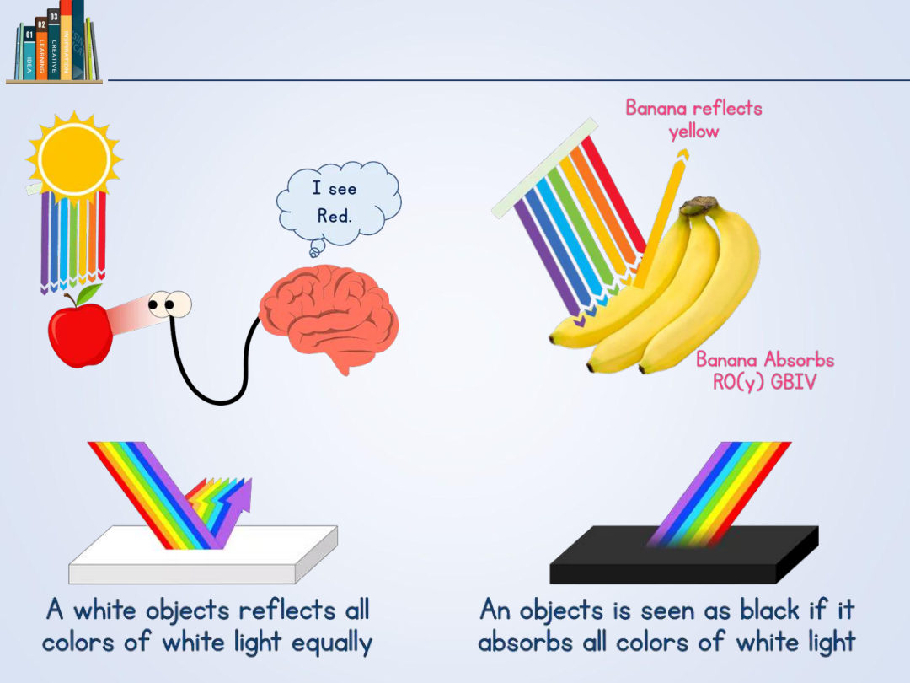

### 本页文字

> 本页未检测到可提取文本，请以页面截图为准。

## 第 27 页

**页面标题/首行：** 色度学的基本概念和实验定律

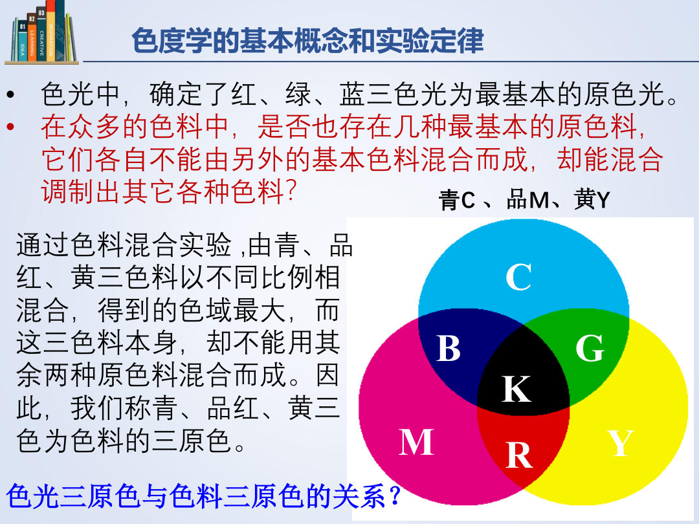

### 本页文字

```text
色度学的基本概念和实验定律

• 色光中，确定了红、绿、蓝三色光为最基本的原色光。
• 在众多的色料中，是否也存在几种最基本的原色料，
 它们各自不能由另外的基本色料混合而成，却能混合
 调制出其它各种色料？                       青C 、品M、黄Y

通过色料混合实验 ,由青、品
红、黄三色料以不同比例相                 CC
混合，得到的色域最大，而
这三色料本身，却不能用其    B    G
余两种原色料混合而成。因                K此，我们称青、品红、黄三
色为色料的三原色。           M      Y                  R
色光三原色与色料三原色的关系？
```

## 第 28 页

**页面标题/首行：** 色光三原色（RGB）/适用于发光系统

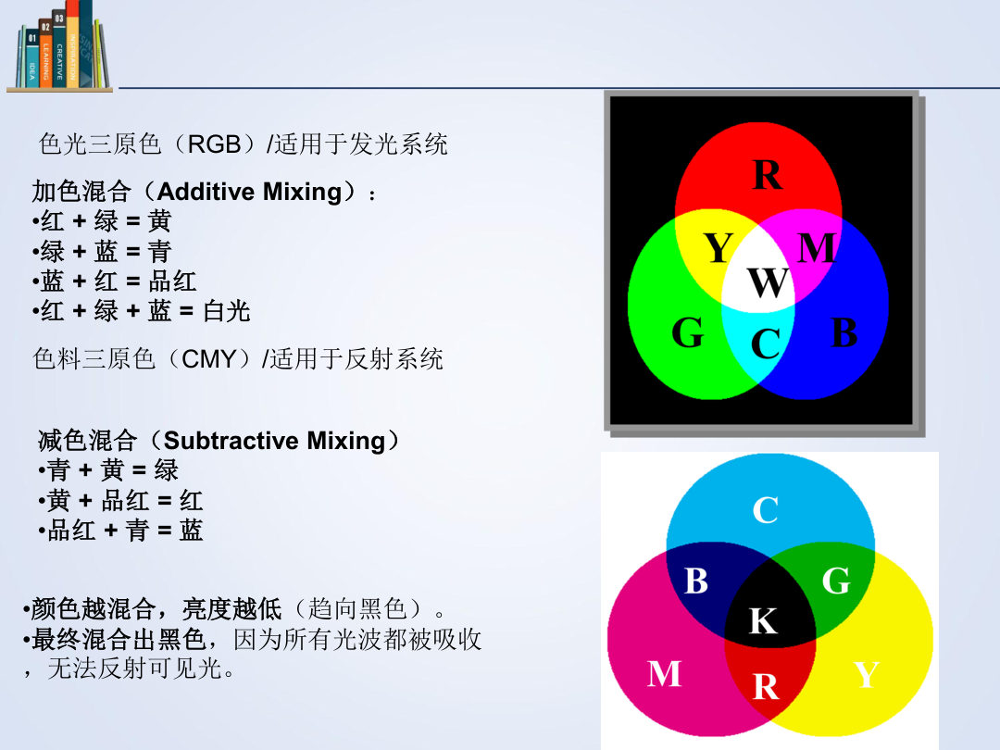

### 本页文字

```text
色光三原色（RGB）/适用于发光系统

 加色混合（Additive Mixing）：
 •红 + 绿 = 黄
 •绿 + 蓝 = 青
 •蓝 + 红 = 品红
 •红 + 绿 + 蓝 = 白光

色料三原色（CMY）/适用于反射系统

 减色混合（Subtractive Mixing）
 •青 + 黄 = 绿
 •黄 + 品红 = 红
 •品红 + 青 = 蓝

•颜色越混合，亮度越低（趋向黑色）。
•最终混合出黑色，因为所有光波都被吸收
，无法反射可见光。
```

## 第 29 页

**页面标题/首行：** 色度学的基本概念和实验定律

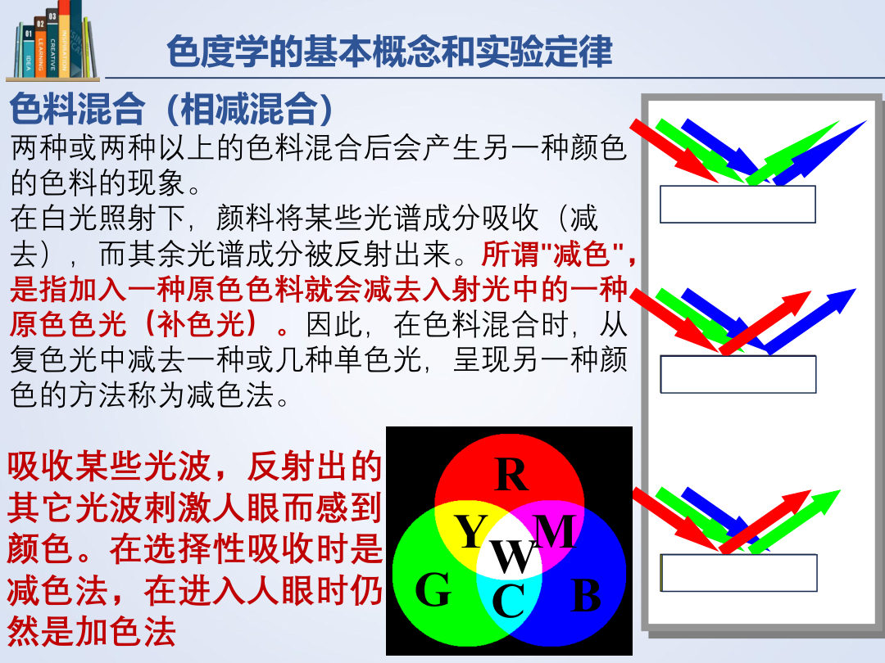

### 本页文字

```text
色度学的基本概念和实验定律
色料混合（相减混合）
两种或两种以上的色料混合后会产生另一种颜色
的色料的现象。
在白光照射下，颜料将某些光谱成分吸收（减
去），而其余光谱成分被反射出来。所谓"减色"，
是指加入一种原色色料就会减去入射光中的一种
原色色光（补色光）。因此，在色料混合时，从
复色光中减去一种或几种单色光，呈现另一种颜
色的方法称为减色法。

吸收某些光波，反射出的   R
其它光波刺激人眼而感到
             Y M颜色。在选择性吸收时是  W
减色法，在进入人眼时仍           G                 B              C
然是加色法
```

## 第 30 页

**页面标题/首行：** 色度学的基本概念和实验定律

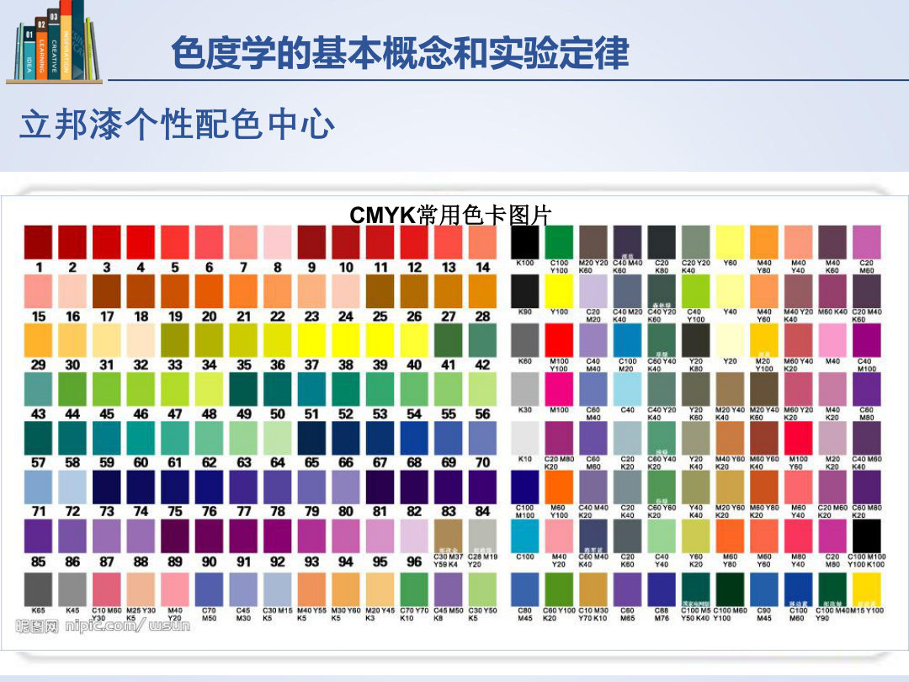

### 本页文字

```text
色度学的基本概念和实验定律

立邦漆个性配色中心

                CMYK常用色卡图片
```

## 第 31 页

**页面标题/首行：** 填空题 2分

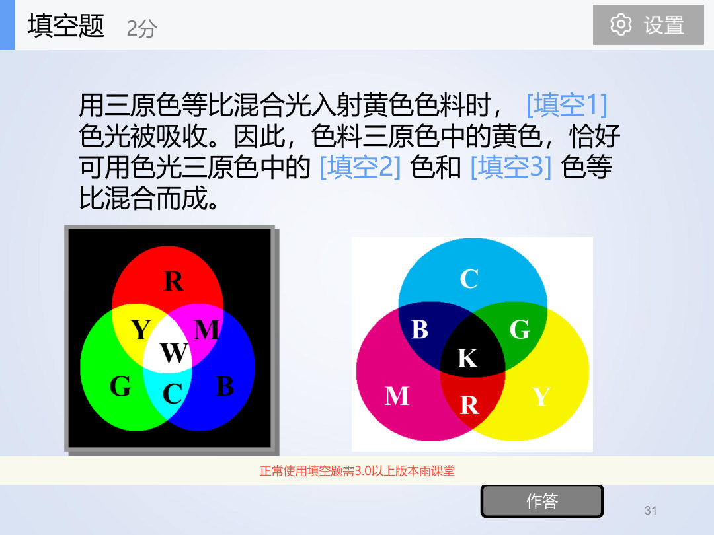

### 本页文字

```text
填空题 2分

  用三原色等比混合光入射黄色色料时， [填空1]
  色光被吸收。因此，色料三原色中的黄色，恰好
  可用色光三原色中的 [填空2] 色和 [填空3] 色等
  比混合而成。

                     正常使用填空题需3.0以上版本雨课堂

                                作答                                                                                             31
```

## 第 32 页

**页面标题/首行：** 格拉斯曼颜色混合定律

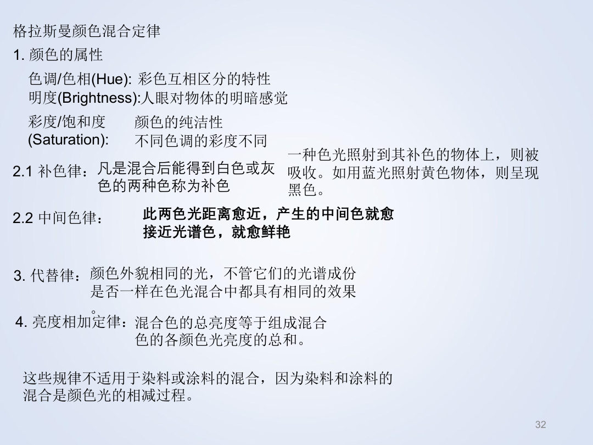

### 本页文字

```text
格拉斯曼颜色混合定律

1. 颜色的属性
  色调/色相(Hue): 彩色互相区分的特性
 明度(Brightness):人眼对物体的明暗感觉
 彩度/饱和度  颜色的纯洁性
  (Saturation):  不同色调的彩度不同
                   一种色光照射到其补色的物体上，则被
2.1 补色律：凡是混合后能得到白色或灰 吸收。如用蓝光照射黄色物体，则呈现
      色的两种色称为补色                   黑色。

         此两色光距离愈近，产生的中间色就愈2.2 中间色律：
         接近光谱色，就愈鲜艳

3. 代替律：颜色外貌相同的光，不管它们的光谱成份
     是否一样在色光混合中都具有相同的效果
     。
4. 亮度相加定律：混合色的总亮度等于组成混合
        色的各颜色光亮度的总和。

 这些规律不适用于染料或涂料的混合，因为染料和涂料的
 混合是颜色光的相减过程。

                                                                                               32
```

## 第 33 页

**页面标题/首行：** 第 33 页

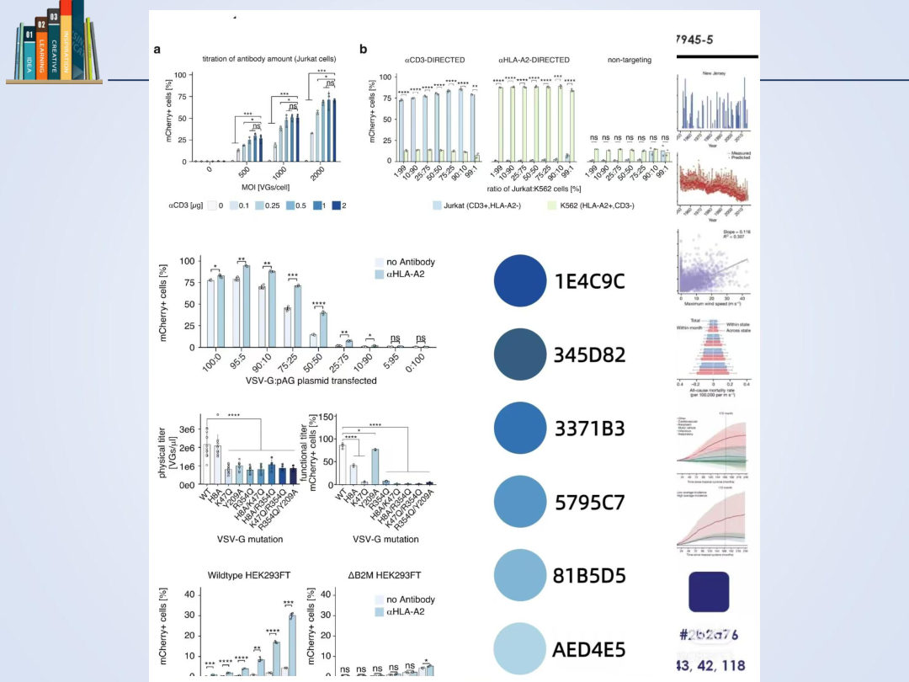

### 本页文字

> 本页未检测到可提取文本，请以页面截图为准。

## 第 34 页

**页面标题/首行：** 色度学的基本概念和实验定律

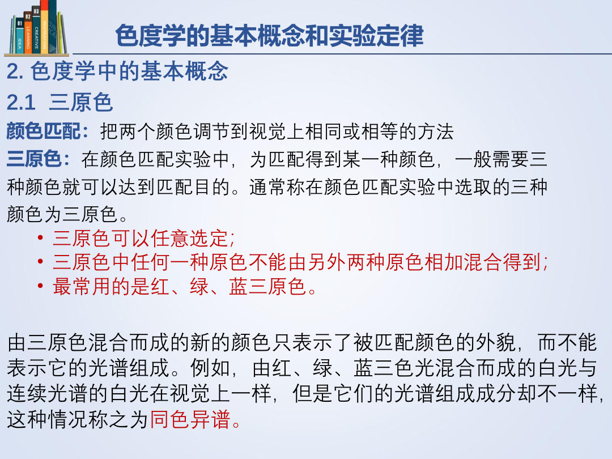

### 本页文字

```text
色度学的基本概念和实验定律
2. 色度学中的基本概念
2.1 三原色
颜色匹配：把两个颜色调节到视觉上相同或相等的方法
三原色：在颜色匹配实验中，为匹配得到某一种颜色，一般需要三
种颜色就可以达到匹配目的。通常称在颜色匹配实验中选取的三种
颜色为三原色。
    • 三原色可以任意选定；
    • 三原色中任何一种原色不能由另外两种原色相加混合得到；
    • 最常用的是红、绿、蓝三原色。

由三原色混合而成的新的颜色只表示了被匹配颜色的外貌，而不能
表示它的光谱组成。例如，由红、绿、蓝三色光混合而成的白光与
连续光谱的白光在视觉上一样，但是它们的光谱组成成分却不一样，
这种情况称之为同色异谱。
```

## 第 35 页

**页面标题/首行：** 色度学的基本概念和实验定律

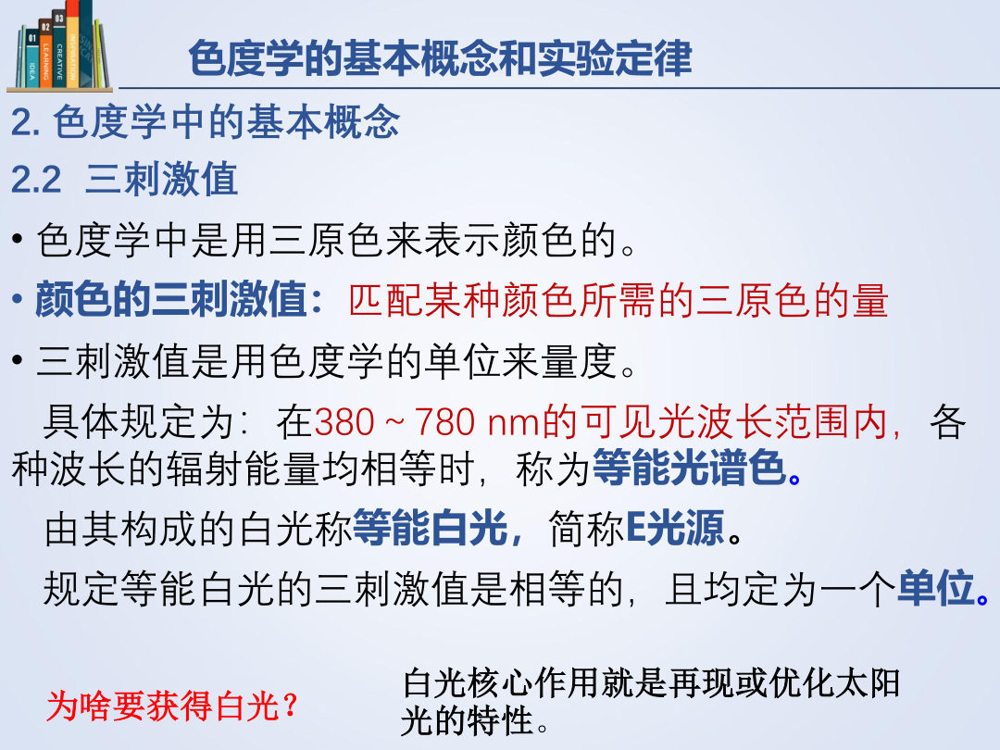

### 本页文字

```text
色度学的基本概念和实验定律

2. 色度学中的基本概念
2.2 三刺激值
• 色度学中是用三原色来表示颜色的。
• 颜色的三刺激值：匹配某种颜色所需的三原色的量
• 三刺激值是用色度学的单位来量度。
 具体规定为：在380～780 nm的可见光波长范围内，各
种波长的辐射能量均相等时，称为等能光谱色。
 由其构成的白光称等能白光，简称E光源。
 规定等能白光的三刺激值是相等的，且均定为一个单位。

            白光核心作用就是再现或优化太阳
 为啥要获得白光？            光的特性。
```

## 第 36 页

**页面标题/首行：** 第 36 页

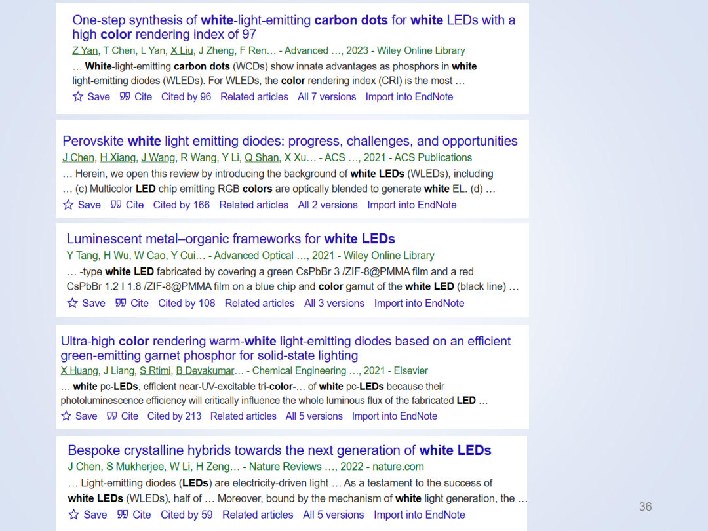

### 本页文字

```text
36
```

## 第 37 页

**页面标题/首行：** 色度学的基本概念和实验定律

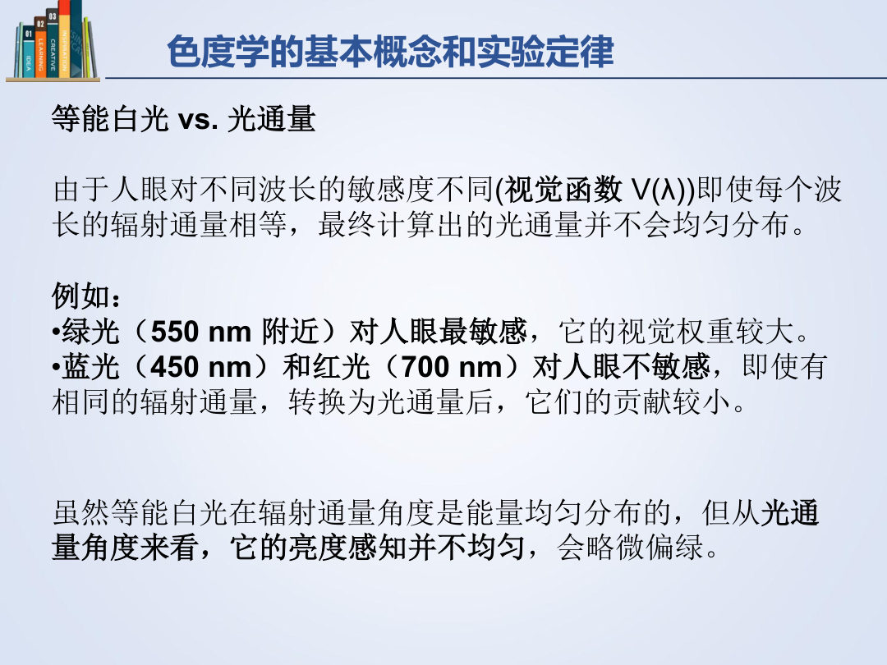

### 本页文字

```text
色度学的基本概念和实验定律

等能白光 vs. 光通量

由于人眼对不同波长的敏感度不同(视觉函数 V(λ))即使每个波
长的辐射通量相等，最终计算出的光通量并不会均匀分布。

例如：
•绿光（550 nm 附近）对人眼最敏感，它的视觉权重较大。
•蓝光（450 nm）和红光（700 nm）对人眼不敏感，即使有
相同的辐射通量，转换为光通量后，它们的贡献较小。

虽然等能白光在辐射通量角度是能量均匀分布的，但从光通
量角度来看，它的亮度感知并不均匀，会略微偏绿。
```

## 第 38 页

**页面标题/首行：** 色度学的基本概念和实验定律

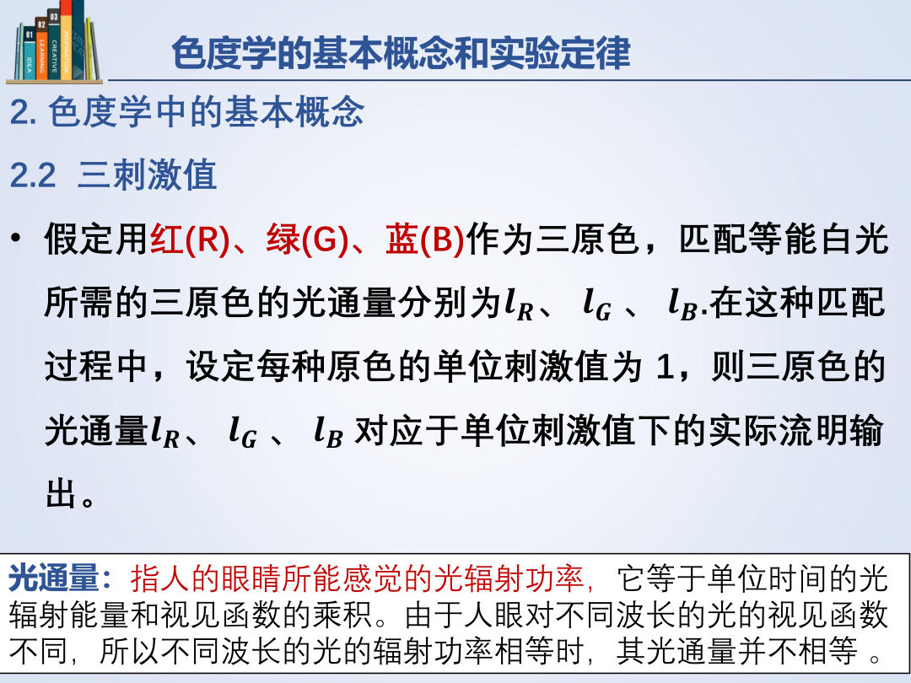

### 本页文字

```text
色度学的基本概念和实验定律

2. 色度学中的基本概念

2.2 三刺激值

• 假定用红(R)、绿(G)、蓝(B)作为三原色，匹配等能白光

 所需的三原色的光通量分别为𝒍𝑹、𝒍𝑮、𝒍𝑩.在这种匹配

 过程中，设定每种原色的单位刺激值为 1，则三原色的

 光通量𝒍𝑹、𝒍𝑮、𝒍𝑩对应于单位刺激值下的实际流明输

 出。

光通量：指人的眼睛所能感觉的光辐射功率，它等于单位时间的光
辐射能量和视见函数的乘积。由于人眼对不同波长的光的视见函数
不同，所以不同波长的光的辐射功率相等时，其光通量并不相等 。
```

## 第 39 页

**页面标题/首行：** 色度学的基本概念和实验定律

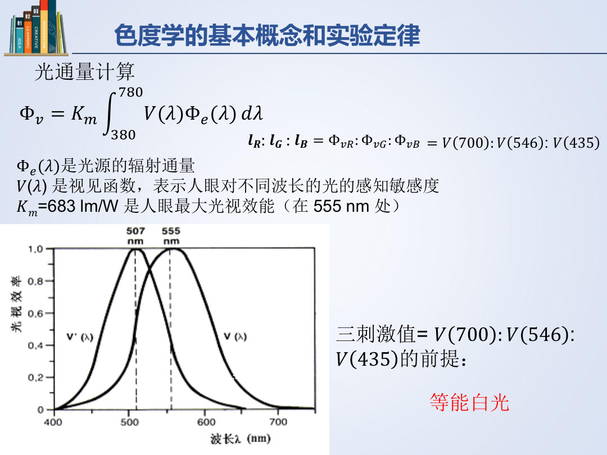

### 本页文字

```text
色度学的基本概念和实验定律

 光通量计算
            780
Φ𝑣= 𝐾𝑚න  𝑉(𝜆)Φ𝑒(𝜆) 𝑑𝜆
           380                                        𝒍𝑹: 𝒍𝑮: 𝒍𝑩= Φ𝑣𝑅: Φ𝑣𝐺: Φ𝑣𝐵 = 𝑉700  : 𝑉546  : 𝑉435
Φ𝑒(𝜆)是光源的辐射通量
𝑉(𝜆) 是视见函数，表示人眼对不同波长的光的感知敏感度
𝐾𝑚=683 lm/W 是人眼最大光视效能（在 555 nm 处）

                 三刺激值= 𝑉700  : 𝑉546 :
                       𝑉435 的前提：

                    等能白光
```

## 第 40 页

**页面标题/首行：** E 光源（等能白光）

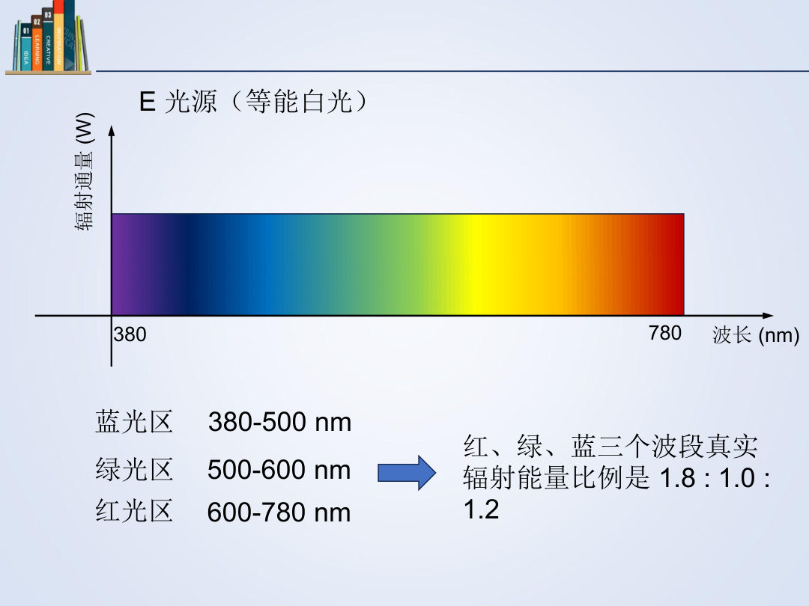

### 本页文字

```text
E 光源（等能白光）
(W)
辐射通量

    380                                             780 波长 (nm)

 蓝光区  380-500 nm
              红、绿、蓝三个波段真实
 绿光区  500-600 nm              辐射能量比例是 1.8 : 1.0 :
 红光区  600-780 nm         1.2
```

## 第 41 页

**页面标题/首行：** E 光源（等能白光）

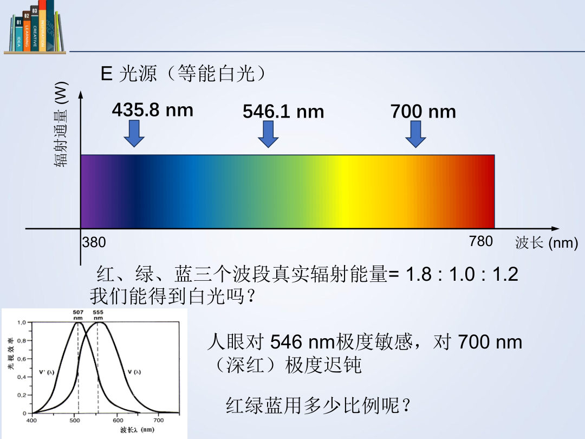

### 本页文字

```text
E 光源（等能白光）
(W)
      435.8 nm     546.1 nm      700 nm
辐射通量

    380                                             780 波长 (nm)

  红、绿、蓝三个波段真实辐射能量= 1.8 : 1.0 : 1.2
  我们能得到白光吗？

        人眼对 546 nm极度敏感，对 700 nm
        （深红）极度迟钝

         红绿蓝用多少比例呢？
```

## 第 42 页

**页面标题/首行：** 色度学的基本概念和实验定律

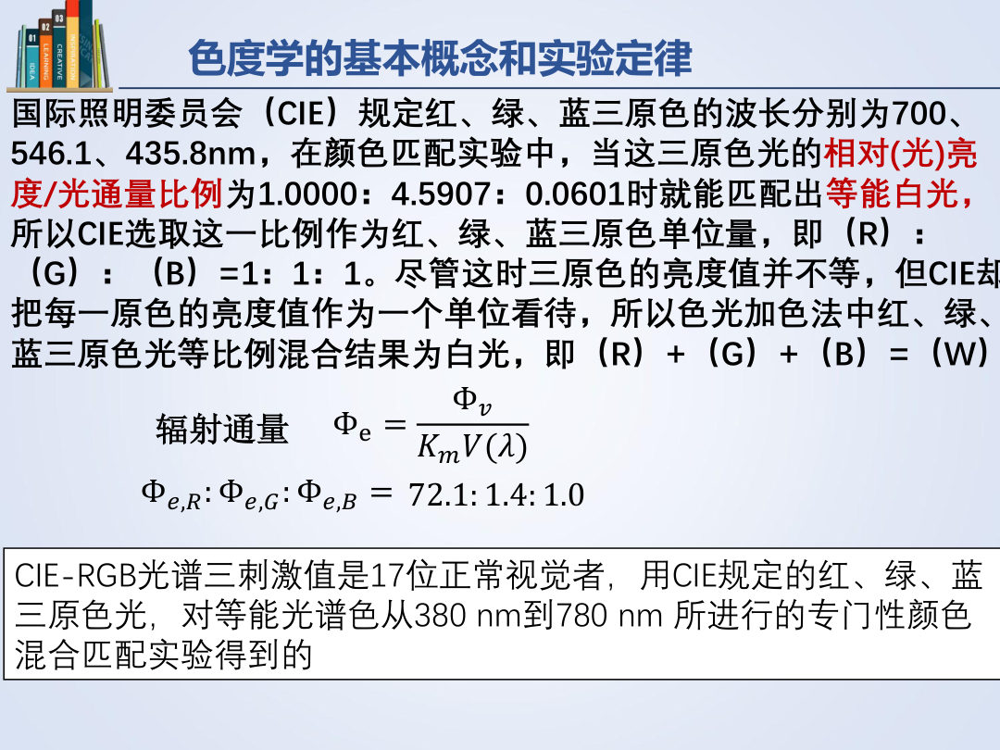

### 本页文字

```text
色度学的基本概念和实验定律
国际照明委员会（CIE）规定红、绿、蓝三原色的波长分别为700、
546.1、435.8nm，在颜色匹配实验中，当这三原色光的相对(光)亮
度/光通量比例为1.0000：4.5907：0.0601时就能匹配出等能白光，
所以CIE选取这一比例作为红、绿、蓝三原色单位量，即（R）：
（G）：（B）=1：1：1。尽管这时三原色的亮度值并不等，但CIE却
把每一原色的亮度值作为一个单位看待，所以色光加色法中红、绿、
蓝三原色光等比例混合结果为白光，即（R）+（G）+（B）=（W）
                      Φ𝑣
    辐射通量  Φe =
                      𝐾𝑚𝑉(𝜆)
         Φ𝑒,𝑅: Φ𝑒,𝐺: Φ𝑒,𝐵= 72.1: 1.4: 1.0

CIE-RGB光谱三刺激值是17位正常视觉者，用CIE规定的红、绿、蓝
三原色光，对等能光谱色从380 nm到780 nm 所进行的专门性颜色
混合匹配实验得到的
```

## 第 43 页

**页面标题/首行：** 色度学的基本概念和实验定律

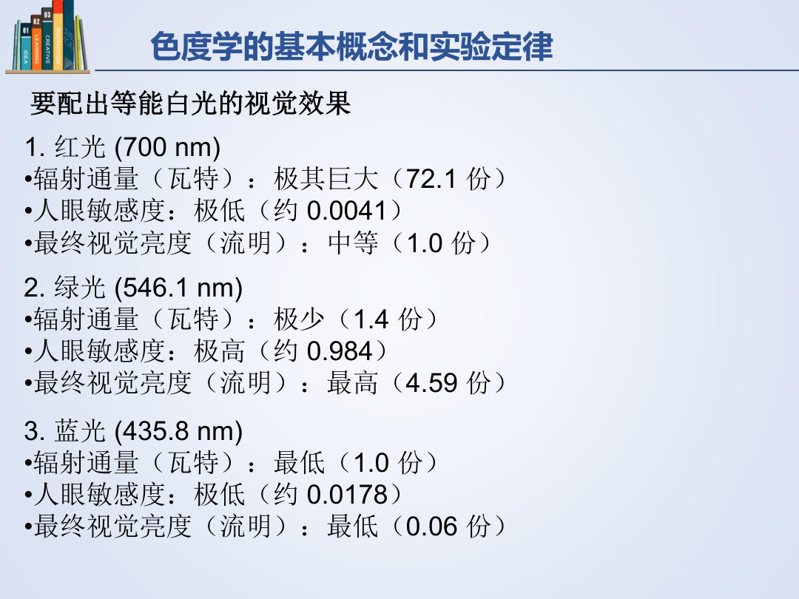

### 本页文字

```text
色度学的基本概念和实验定律

要配出等能白光的视觉效果

1. 红光 (700 nm)
•辐射通量（瓦特）：极其巨大（72.1 份）
•人眼敏感度：极低（约 0.0041）
•最终视觉亮度（流明）：中等（1.0 份）
2. 绿光 (546.1 nm)
•辐射通量（瓦特）：极少（1.4 份）
•人眼敏感度：极高（约 0.984）
•最终视觉亮度（流明）：最高（4.59 份）

3. 蓝光 (435.8 nm)
•辐射通量（瓦特）：最低（1.0 份）
•人眼敏感度：极低（约 0.0178）
•最终视觉亮度（流明）：最低（0.06 份）
```

## 第 44 页

**页面标题/首行：** 色度学的基本概念和实验定律

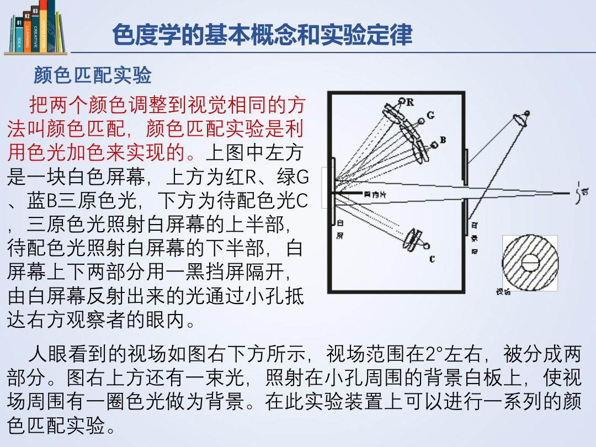

### 本页文字

```text
色度学的基本概念和实验定律

 颜色匹配实验
 把两个颜色调整到视觉相同的方
法叫颜色匹配，颜色匹配实验是利
用色光加色来实现的。上图中左方
是一块白色屏幕，上方为红R、绿G
、蓝B三原色光，下方为待配色光C
，三原色光照射白屏幕的上半部，
待配色光照射白屏幕的下半部，白
屏幕上下两部分用一黑挡屏隔开，
由白屏幕反射出来的光通过小孔抵
达右方观察者的眼内。

 人眼看到的视场如图右下方所示，视场范围在2°左右，被分成两
部分。图右上方还有一束光，照射在小孔周围的背景白板上，使视
场周围有一圈色光做为背景。在此实验装置上可以进行一系列的颜
色匹配实验。
```

## 第 45 页

**页面标题/首行：** 色度学的基本概念和实验定律

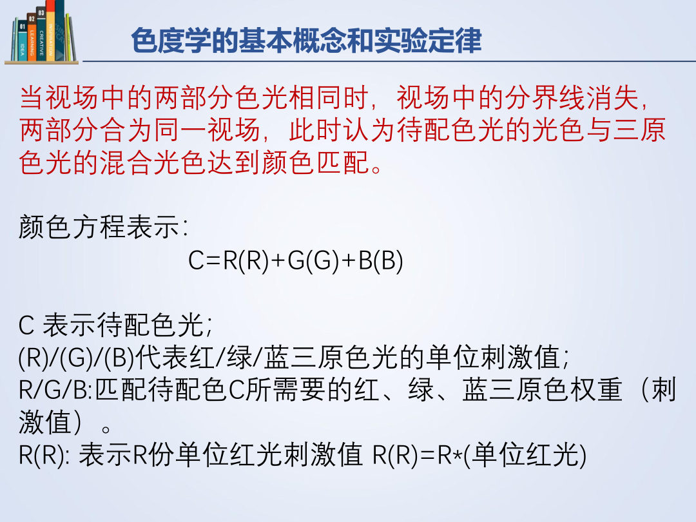

### 本页文字

```text
色度学的基本概念和实验定律

当视场中的两部分色光相同时，视场中的分界线消失，
两部分合为同一视场，此时认为待配色光的光色与三原
色光的混合光色达到颜色匹配。

颜色方程表示：
             C=R(R)+G(G)+B(B)

C 表示待配色光；
(R)/(G)/(B)代表红/绿/蓝三原色光的单位刺激值；
R/G/B:匹配待配色C所需要的红、绿、蓝三原色权重（刺
激值）。
R(R): 表示R份单位红光刺激值 R(R)=R*(单位红光)
```

## 第 46 页

**页面标题/首行：** 色度学的基本概念和实验定律

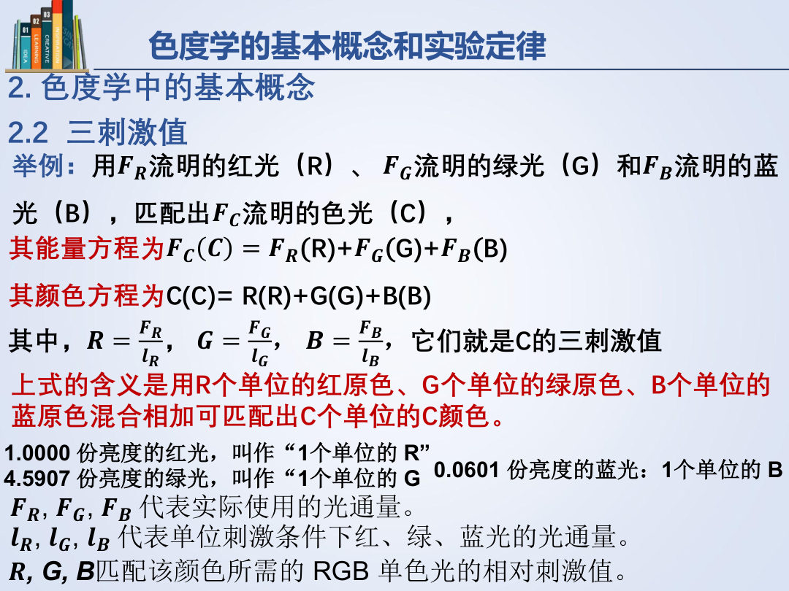

### 本页文字

```text
色度学的基本概念和实验定律
2. 色度学中的基本概念
2.2 三刺激值
举例：用𝑭𝑹流明的红光（R）、𝑭𝑮流明的绿光（G）和𝑭𝑩流明的蓝

光（B），匹配出𝑭𝑪流明的色光（C），
其能量方程为𝑭𝑪𝑪= 𝑭𝑹(R)+𝑭𝑮(G)+𝑭𝑩(B)

其颜色方程为C(C)= R(R)+G(G)+B(B)
            𝑭𝑹        𝑭𝑮       𝑭𝑩
其中，𝑹= 𝒍𝑹，𝑮= 𝒍𝑮，𝑩= 𝒍𝑩，它们就是C的三刺激值
上式的含义是用R个单位的红原色、G个单位的绿原色、B个单位的
蓝原色混合相加可匹配出C个单位的C颜色。
1.0000 份亮度的红光，叫作“1个单位的 R”
                                      0.0601 份亮度的蓝光：1个单位的 B4.5907 份亮度的绿光，叫作“1个单位的 G
𝑭𝑹, 𝑭𝑮, 𝑭𝑩代表实际使用的光通量。
 𝒍𝑹, 𝒍𝑮, 𝒍𝑩代表单位刺激条件下红、绿、蓝光的光通量。
𝑹, G, B匹配该颜色所需的RGB 单色光的相对刺激值。
```

## 第 47 页

**页面标题/首行：** 填空题 2分

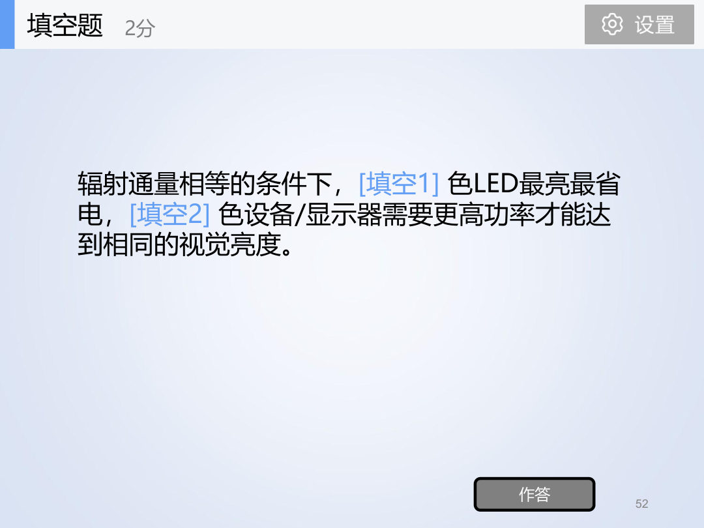

### 本页文字

```text
填空题 2分

  辐射通量相等的条件下，[填空1] 色LED最亮最省
   电，[填空2] 色设备/显示器需要更高功率才能达
  到相同的视觉亮度。

                                作答                                                                                             52
```

## 第 48 页

**页面标题/首行：** 色度学的基本概念和实验定律

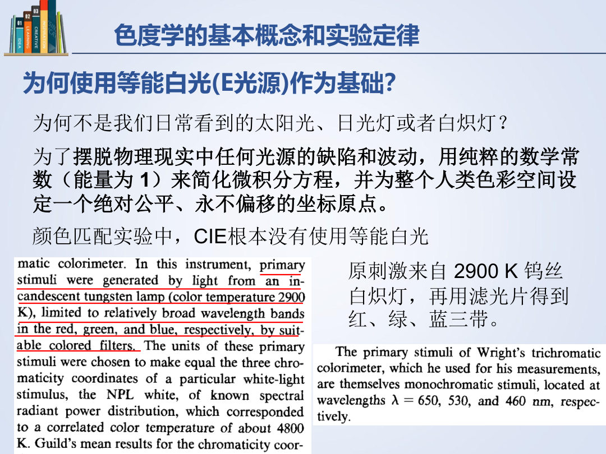

### 本页文字

```text
色度学的基本概念和实验定律

为何使用等能白光(E光源)作为基础？

为何不是我们日常看到的太阳光、日光灯或者白炽灯？

为了摆脱物理现实中任何光源的缺陷和波动，用纯粹的数学常
数（能量为 1）来简化微积分方程，并为整个人类色彩空间设
定一个绝对公平、永不偏移的坐标原点。

颜色匹配实验中，CIE根本没有使用等能白光

                原刺激来自 2900 K 钨丝
                白炽灯，再用滤光片得到
                红、绿、蓝三带。
```

## 第 49 页

**页面标题/首行：** 两位英国物理学家

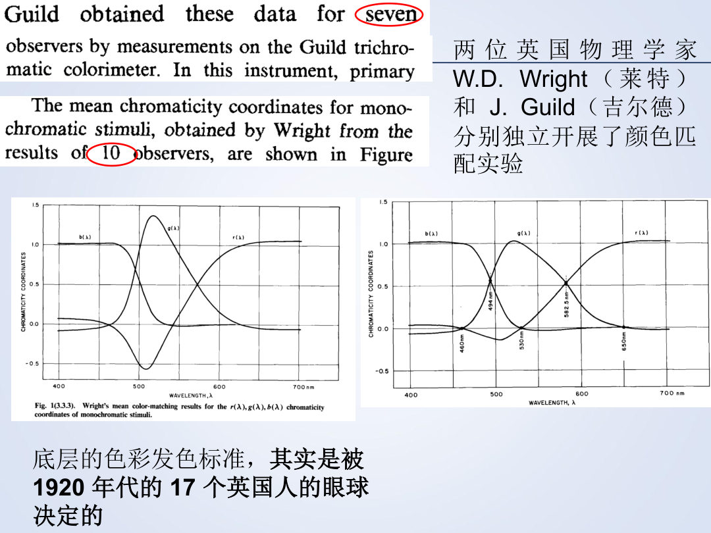

### 本页文字

```text
两位英国物理学家
                                 W.D. Wright （莱特）
                  和 J. Guild（吉尔德）
                 分别独立开展了颜色匹
                  配实验

底层的色彩发色标准，其实是被
1920 年代的 17 个英国人的眼球
决定的
```

## 第 50 页

**页面标题/首行：** 色度学的基本概念和实验定律

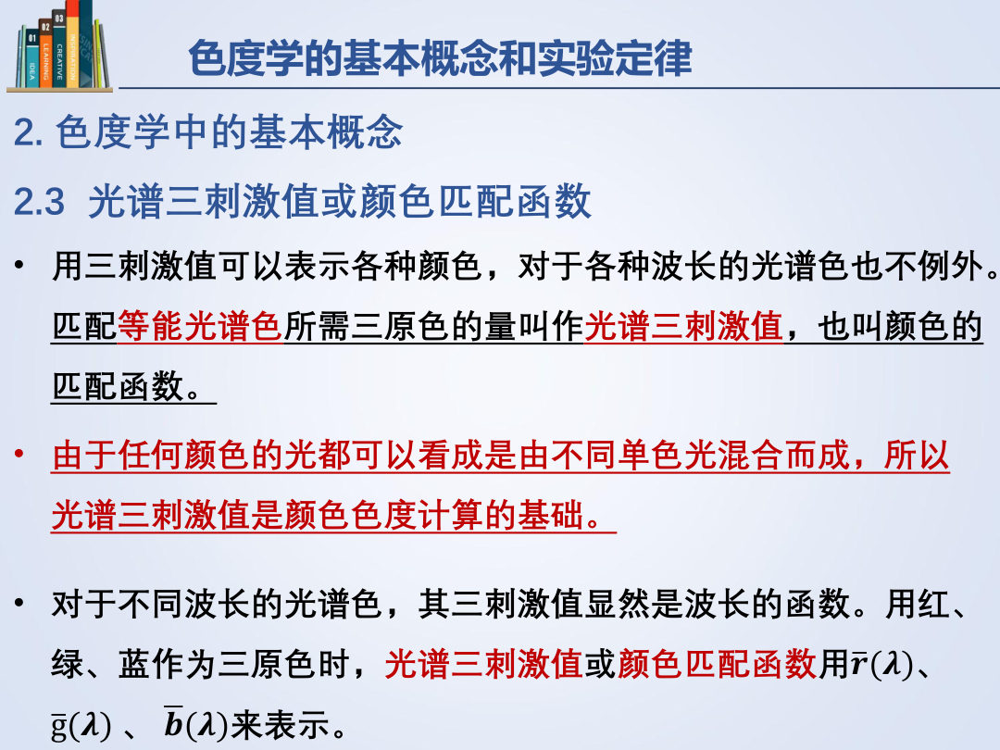

### 本页文字

```text
色度学的基本概念和实验定律

2. 色度学中的基本概念

2.3 光谱三刺激值或颜色匹配函数

• 用三刺激值可以表示各种颜色，对于各种波长的光谱色也不例外。

 匹配等能光谱色所需三原色的量叫作光谱三刺激值，也叫颜色的

 匹配函数。

• 由于任何颜色的光都可以看成是由不同单色光混合而成，所以

 光谱三刺激值是颜色色度计算的基础。

• 对于不同波长的光谱色，其三刺激值显然是波长的函数。用红、

 绿、蓝作为三原色时，光谱三刺激值或颜色匹配函数用ത𝒓(𝝀)、
   തg(𝝀) 、 ഥ𝒃(𝝀)来表示。
```

## 第 51 页

**页面标题/首行：** 色度学的基本概念和实验定律

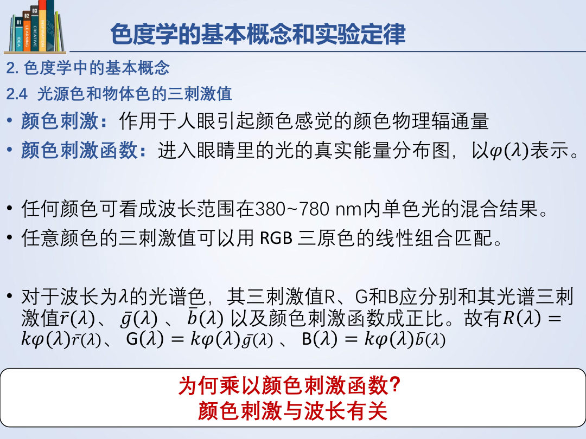

### 本页文字

```text
色度学的基本概念和实验定律

2. 色度学中的基本概念

2.4 光源色和物体色的三刺激值
• 颜色刺激：作用于人眼引起颜色感觉的颜色物理辐通量
• 颜色刺激函数：进入眼睛里的光的真实能量分布图，以𝜑(𝜆)表示。

• 任何颜色可看成波长范围在380~780 nm内单色光的混合结果。
• 任意颜色的三刺激值可以用 RGB 三原色的线性组合匹配。

• 对于波长为𝜆的光谱色，其三刺激值R、G和B应分别和其光谱三刺
 激值ҧ𝑟(𝜆)、 ҧ𝑔(𝜆) 、 ത𝑏(𝜆) 以及颜色刺激函数成正比。故有𝑅𝜆=
 𝑘𝜑(𝜆)ҧ𝑟(𝜆)、G 𝜆= 𝑘𝜑(𝜆) ҧ𝑔(𝜆) 、B 𝜆= 𝑘𝜑(𝜆) ҧ𝑏(𝜆)

        为何乘以颜色刺激函数？
         颜色刺激与波长有关
```

## 第 52 页

**页面标题/首行：** 色度学的基本概念和实验定律

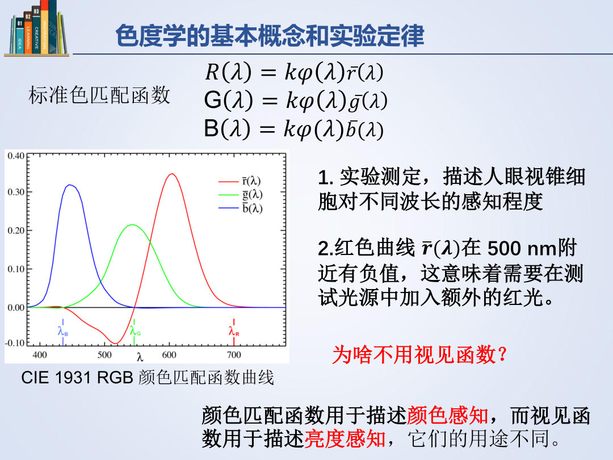

### 本页文字

```text
色度学的基本概念和实验定律
        𝑅𝜆= 𝑘𝜑𝜆 ҧ𝑟𝜆
标准色匹配函数  G 𝜆= 𝑘𝜑𝜆 ҧ𝑔𝜆
           B 𝜆= 𝑘𝜑(𝜆) ҧ𝑏(𝜆)

                                    1. 实验测定，描述人眼视锥细
              胞对不同波长的感知程度

                  2.红色曲线 ത𝒓(𝝀)在 500 nm附
              近有负值，这意味着需要在测
              试光源中加入额外的红光。

               为啥不用视见函数？
CIE 1931 RGB 颜色匹配函数曲线

         颜色匹配函数用于描述颜色感知，而视见函
         数用于描述亮度感知，它们的用途不同。
```

## 第 53 页

**页面标题/首行：** 色度学的基本概念和实验定律

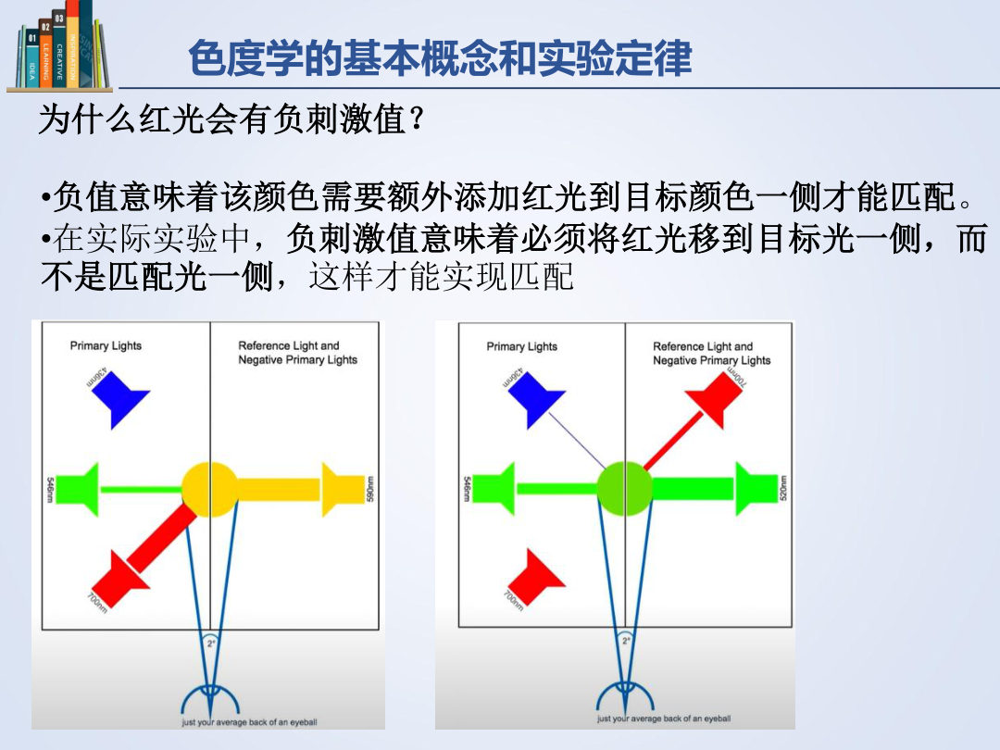

### 本页文字

```text
色度学的基本概念和实验定律

为什么红光会有负刺激值？

•负值意味着该颜色需要额外添加红光到目标颜色一侧才能匹配。
•在实际实验中，负刺激值意味着必须将红光移到目标光一侧，而
不是匹配光一侧，这样才能实现匹配
```

## 第 54 页

**页面标题/首行：** 色度学的基本概念和实验定律

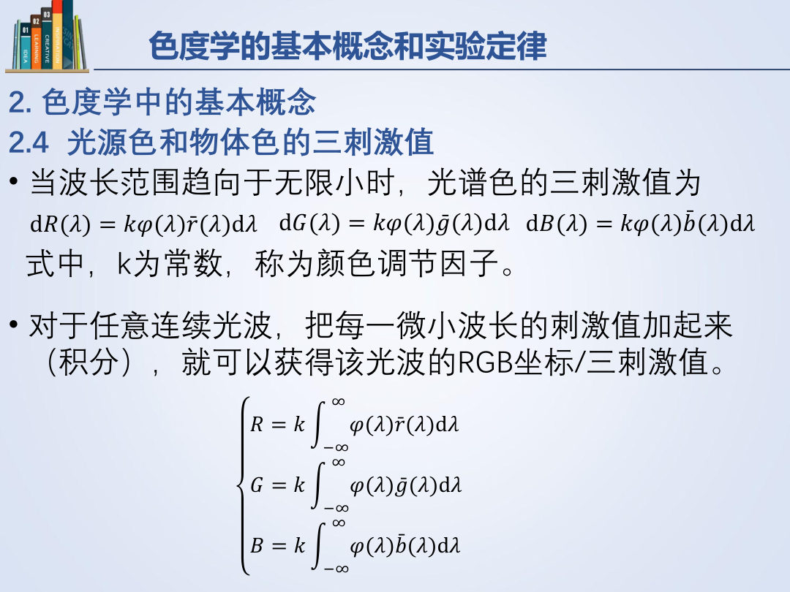

### 本页文字

```text
色度学的基本概念和实验定律

2. 色度学中的基本概念
2.4 光源色和物体色的三刺激值
• 当波长范围趋向于无限小时，光谱色的三刺激值为
  d𝑅(𝜆) = 𝑘𝜑(𝜆)lj𝑟(𝜆)d𝜆  d𝐺(𝜆) = 𝑘𝜑(𝜆)lj𝑔(𝜆)d𝜆d𝐵(𝜆) = 𝑘𝜑(𝜆)ሜ𝑏(𝜆)d𝜆
 式中，k为常数，称为颜色调节因子。

• 对于任意连续光波，把每一微小波长的刺激值加起来
 （积分），就可以获得该光波的RGB坐标/三刺激值。

                      ∞
             𝑅= 𝑘න  𝜑(𝜆)lj𝑟(𝜆)d𝜆
                        −∞
                      ∞
             𝐺= 𝑘න  𝜑(𝜆)lj𝑔(𝜆)d𝜆
                        −∞
                      ∞
             𝐵= 𝑘න  𝜑(𝜆)ሜ𝑏(𝜆)d𝜆
                        −∞
```

## 第 55 页

**页面标题/首行：** 色度学的基本概念和实验定律

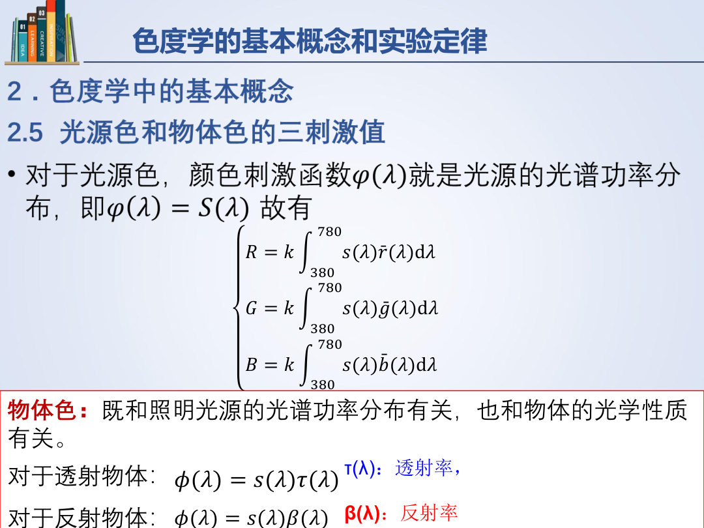

### 本页文字

```text
色度学的基本概念和实验定律

                                     780
              𝑅= 𝑘න   𝑠(𝜆)lj𝑟(𝜆)d𝜆
                                    380
                                     780
              𝐺= 𝑘න   𝑠(𝜆)lj𝑔(𝜆)d𝜆
                                    380
                                     780
              𝐵= 𝑘න   𝑠(𝜆)ሜ𝑏(𝜆)d𝜆
                                    380
物体色：既和照明光源的光谱功率分布有关，也和物体的光学性质
有关。
                        τ(λ)：透射率，对于透射物体：              𝜙(𝜆) = 𝑠(𝜆)𝜏(𝜆)
                        β(λ)：反射率对于反射物体： 𝜙(𝜆) = 𝑠(𝜆)𝛽(𝜆)
```

## 第 56 页

**页面标题/首行：** 色度学的基本概念和实验定律

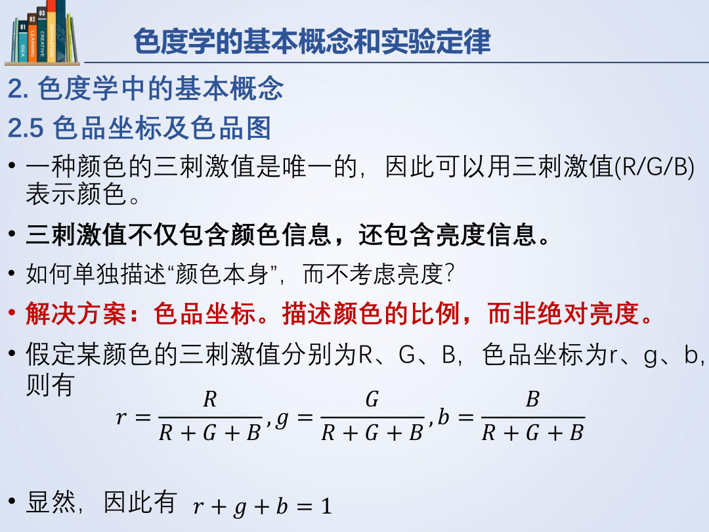

### 本页文字

```text
色度学的基本概念和实验定律

2. 色度学中的基本概念
2.5 色品坐标及色品图
• 一种颜色的三刺激值是唯一的，因此可以用三刺激值(R/G/B)
 表示颜色。
• 三刺激值不仅包含颜色信息，还包含亮度信息。
• 如何单独描述“颜色本身”，而不考虑亮度？
• 解决方案：色品坐标。描述颜色的比例，而非绝对亮度。
• 假定某颜色的三刺激值分别为R、G、B，色品坐标为r、g、b，
 则有
             𝑅          𝐺         𝐵
      𝑟=      𝑔=       𝑏=        𝑅+ 𝐺+ 𝐵,   𝑅+ 𝐺+ 𝐵,  𝑅+ 𝐺+ 𝐵

• 显然，因此有           𝑟+ 𝑔+ 𝑏= 1
```

## 第 57 页

**页面标题/首行：** 色度学的基本概念和实验定律

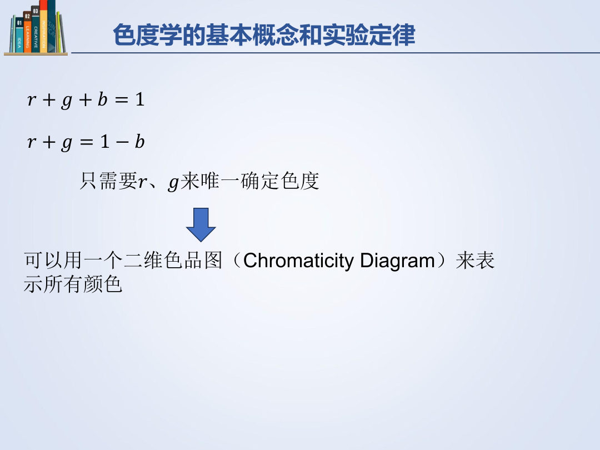

### 本页文字

```text
色度学的基本概念和实验定律

𝑟+ 𝑔+ 𝑏= 1

𝑟+ 𝑔= 1 −𝑏

   只需要𝑟、𝑔来唯一确定色度

可以用一个二维色品图（Chromaticity Diagram）来表
示所有颜色
```

## 第 58 页

**页面标题/首行：** 色度学的基本概念和实验定律

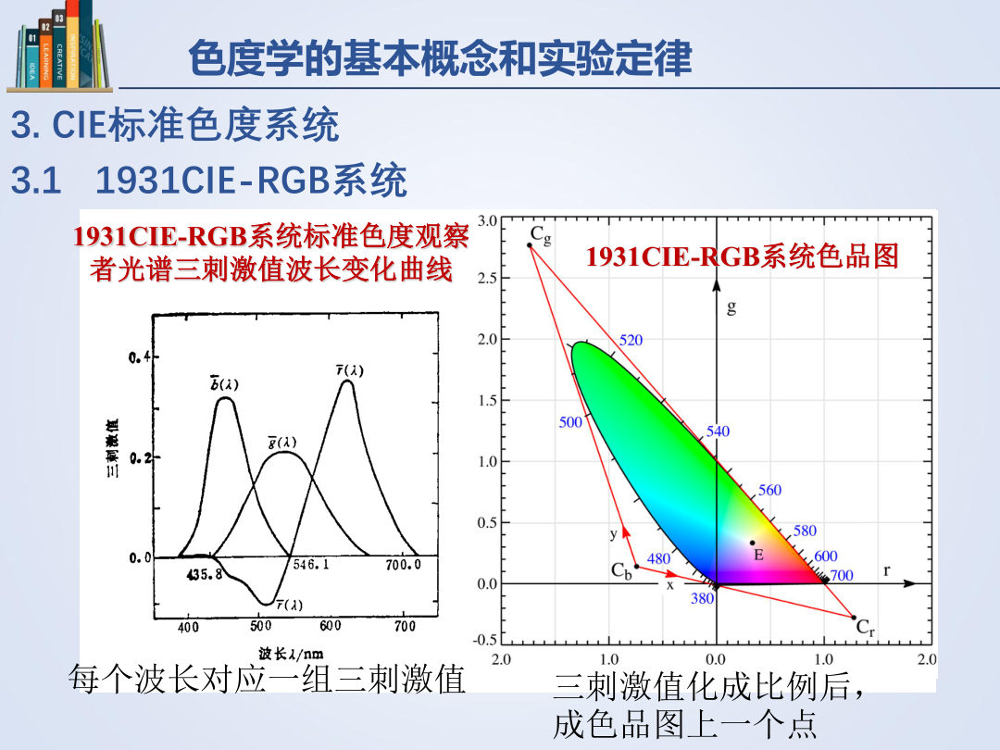

### 本页文字

```text
色度学的基本概念和实验定律

3. CIE标准色度系统
3.1 1931CIE-RGB系统

   1931CIE-RGB系统标准色度观察
                             1931CIE-RGB系统色品图   者光谱三刺激值波长变化曲线

  每个波长对应一组三刺激值                三刺激值化成比例后，
                成色品图上一个点
```

## 第 59 页

**页面标题/首行：** 色度学的基本概念和实验定律

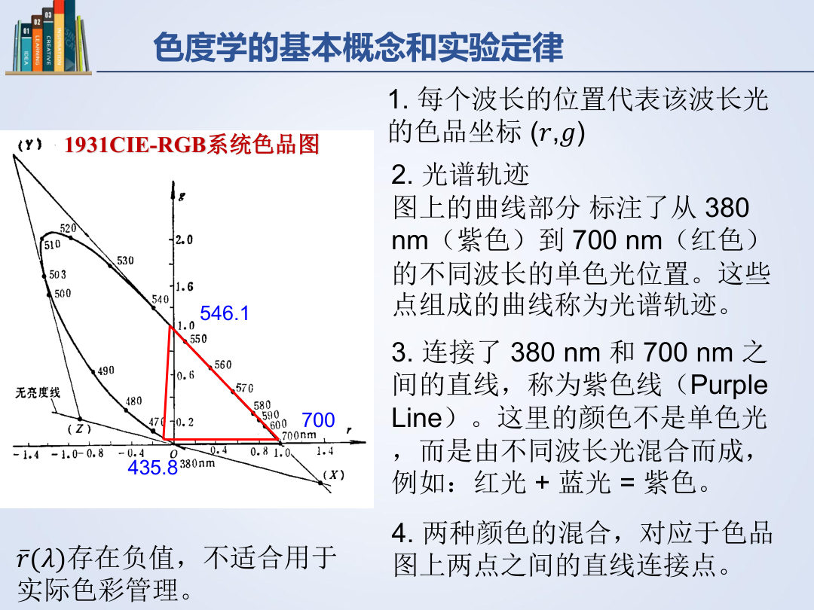

### 本页文字

```text
色度学的基本概念和实验定律

                                 1. 每个波长的位置代表该波长光
              的色品坐标 (𝑟,𝑔)   1931CIE-RGB系统色品图
                                 2. 光谱轨迹
              图上的曲线部分 标注了从 380
               nm（紫色）到 700 nm（红色）
              的不同波长的单色光位置。这些
              点组成的曲线称为光谱轨迹。                  546.1
                                 3. 连接了 380 nm 和 700 nm 之
                 间的直线，称为紫色线（Purple
                         700  Line）。这里的颜色不是单色光
              ，而是由不同波长光混合而成，
           435.8
              例如：红光 + 蓝光 = 紫色。

                                 4. 两种颜色的混合，对应于色品
ҧ𝑟(𝜆)存在负值，不适合用于              图上两点之间的直线连接点。
实际色彩管理。
```

## 第 60 页

**页面标题/首行：** 色度学的基本概念和实验定律

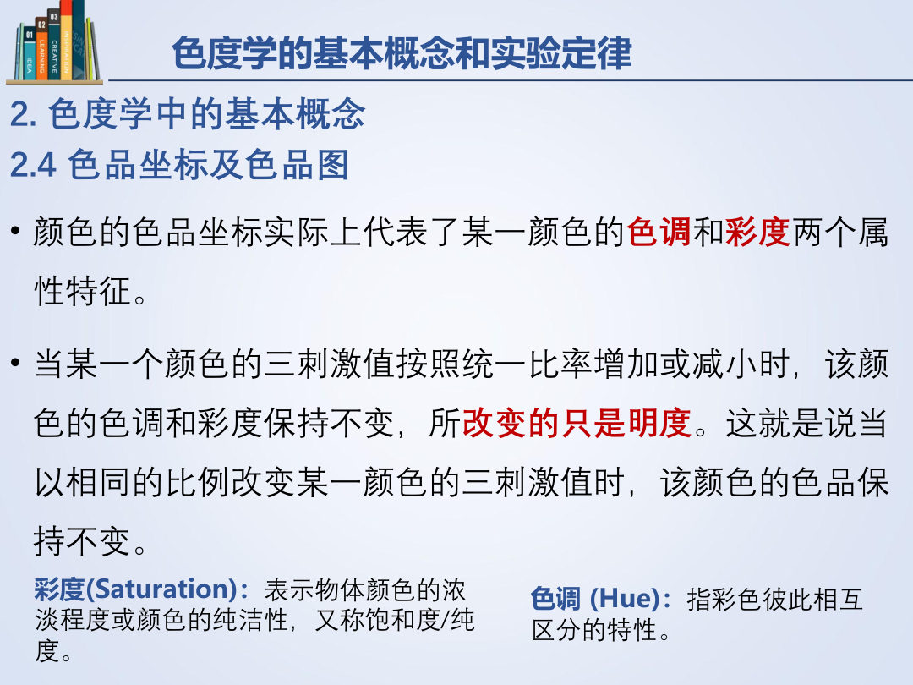

### 本页文字

```text
色度学的基本概念和实验定律

2. 色度学中的基本概念
2.4 色品坐标及色品图

• 颜色的色品坐标实际上代表了某一颜色的色调和彩度两个属

 性特征。

• 当某一个颜色的三刺激值按照统一比率增加或减小时，该颜

 色的色调和彩度保持不变，所改变的只是明度。这就是说当

 以相同的比例改变某一颜色的三刺激值时，该颜色的色品保

 持不变。
 彩度(Saturation)：表示物体颜色的浓                       色调(Hue)：指彩色彼此相互
 淡程度或颜色的纯洁性，又称饱和度/纯                     区分的特性。
 度。
```

## 第 61 页

**页面标题/首行：** 色度学的基本概念和实验定律

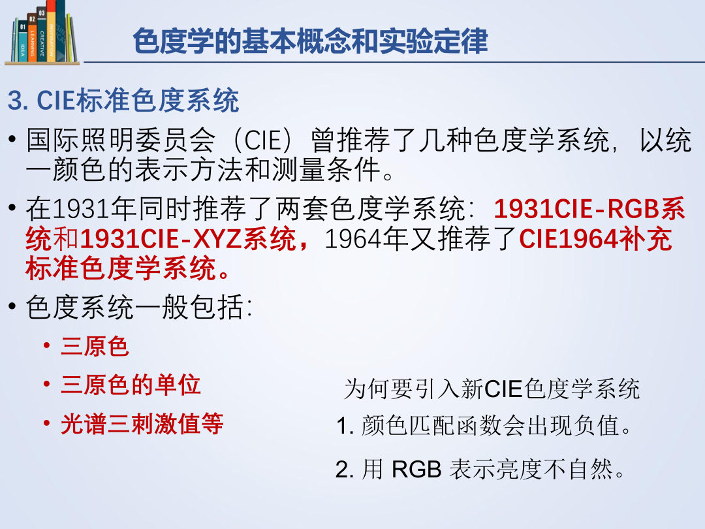

### 本页文字

```text
色度学的基本概念和实验定律

3. CIE标准色度系统
• 国际照明委员会（CIE）曾推荐了几种色度学系统，以统
 一颜色的表示方法和测量条件。
• 在1931年同时推荐了两套色度学系统：1931CIE-RGB系
 统和1931CIE-XYZ系统，1964年又推荐了CIE1964补充
 标准色度学系统。
• 色度系统一般包括：
    • 三原色
    • 三原色的单位                为何要引入新CIE色度学系统
    • 光谱三刺激值等           1. 颜色匹配函数会出现负值。

                                 2. 用 RGB 表示亮度不自然。
```

## 第 62 页

**页面标题/首行：** 色度学的基本概念和实验定律

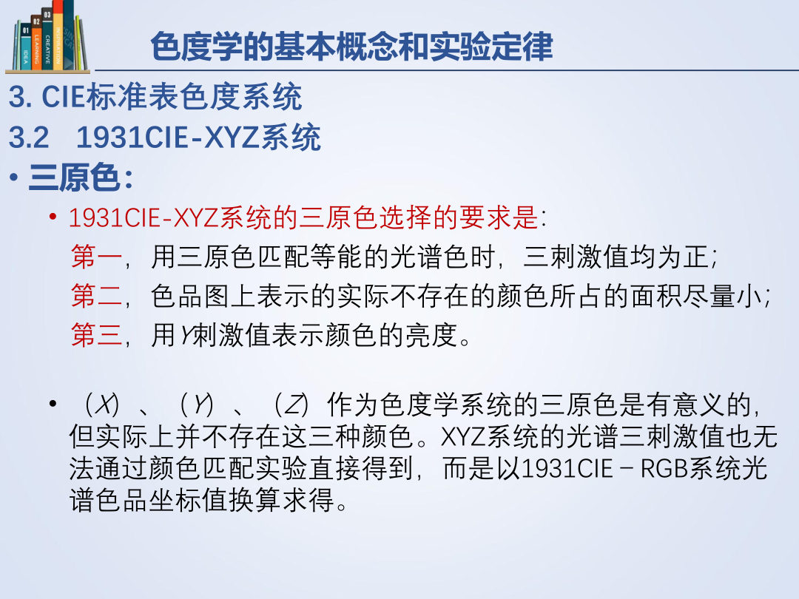

### 本页文字

```text
色度学的基本概念和实验定律
3. CIE标准表色度系统
3.2 1931CIE-XYZ系统
• 三原色：
    • 1931CIE-XYZ系统的三原色选择的要求是：
  第一，用三原色匹配等能的光谱色时，三刺激值均为正；
  第二，色品图上表示的实际不存在的颜色所占的面积尽量小；
  第三，用Y刺激值表示颜色的亮度。

    • （X）、（Y）、（Z）作为色度学系统的三原色是有意义的，
  但实际上并不存在这三种颜色。XYZ系统的光谱三刺激值也无
   法通过颜色匹配实验直接得到，而是以1931CIE－RGB系统光
  谱色品坐标值换算求得。
```

## 第 63 页

**页面标题/首行：** 色度学的基本概念和实验定律

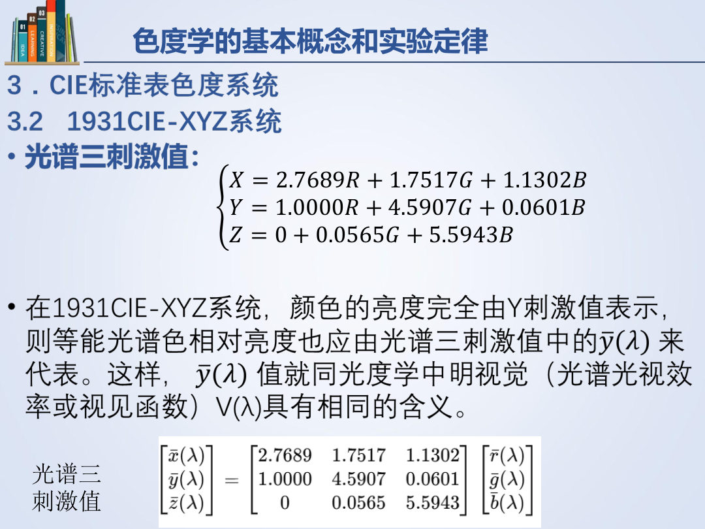

### 本页文字

```text
色度学的基本概念和实验定律

          𝑋= 2.7689𝑅+ 1.7517𝐺+ 1.1302𝐵
             ቐ𝑌= 1.0000𝑅+ 4.5907𝐺+ 0.0601𝐵
          𝑍= 0 + 0.0565𝐺+ 5.5943𝐵

光谱三
刺激值
```

## 第 64 页

**页面标题/首行：** 色度学的基本概念和实验定律这段不是光谱色，而是

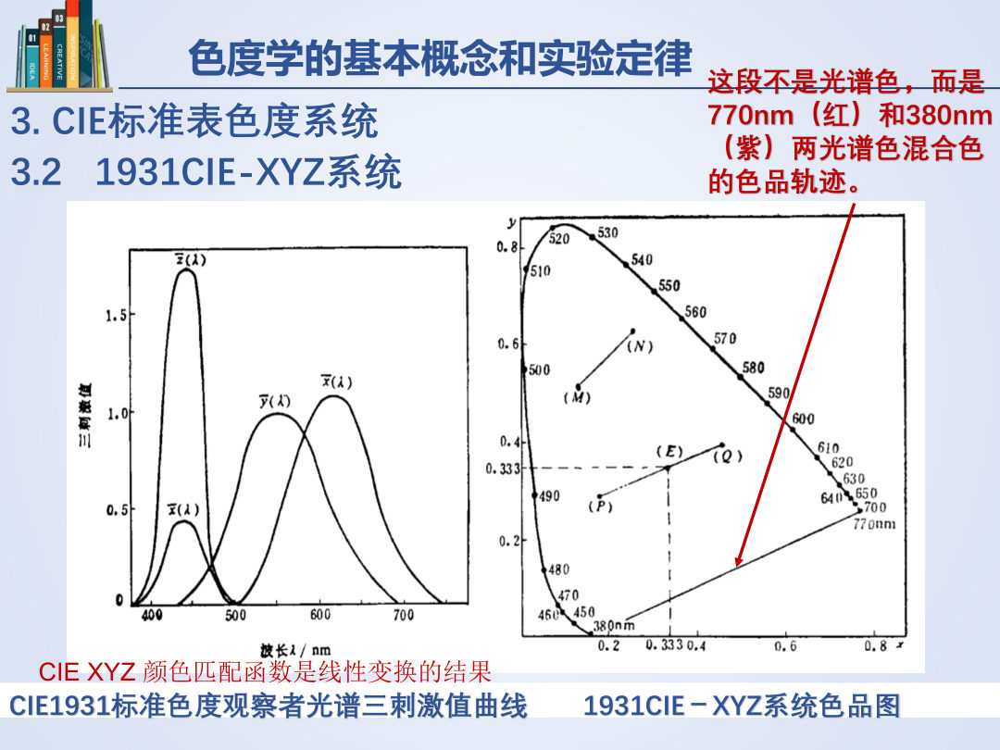

### 本页文字

```text
色度学的基本概念和实验定律这段不是光谱色，而是
3. CIE标准表色度系统                770nm（红）和380nm
                         （紫）两光谱色混合色
3.2 1931CIE-XYZ系统           的色品轨迹。

  CIE XYZ 颜色匹配函数是线性变换的结果
CIE1931标准色度观察者光谱三刺激值曲线   1931CIE－XYZ系统色品图
```

## 第 65 页

**页面标题/首行：** 色度学的基本概念和实验定律

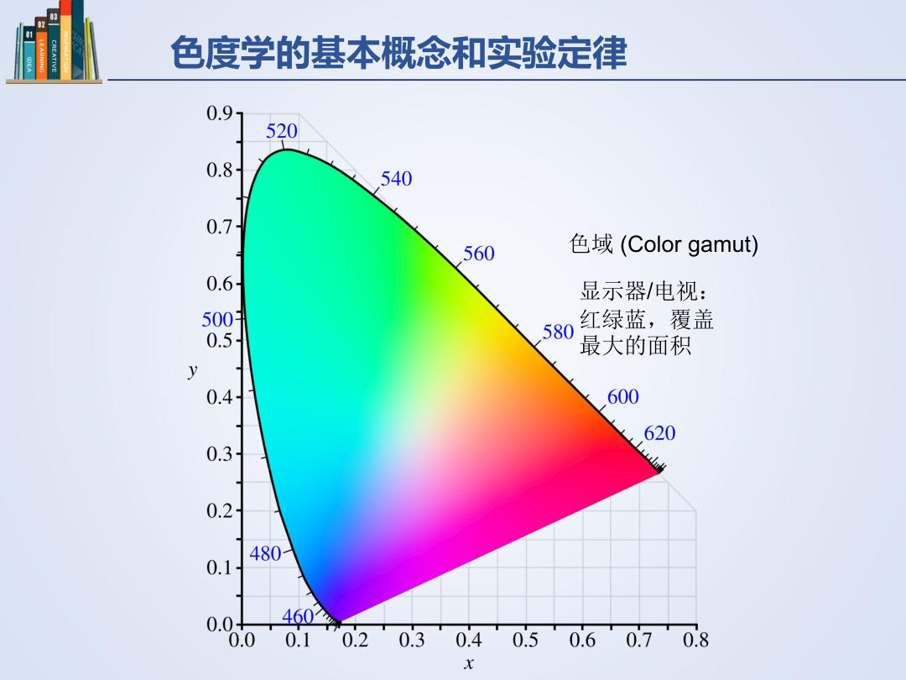

### 本页文字

```text
色度学的基本概念和实验定律

                  色域 (Color gamut)

                    显示器/电视：
                  红绿蓝，覆盖
                  最大的面积
```

## 第 66 页

**页面标题/首行：** Advanced Materials 36.45 (2024): 2409361.

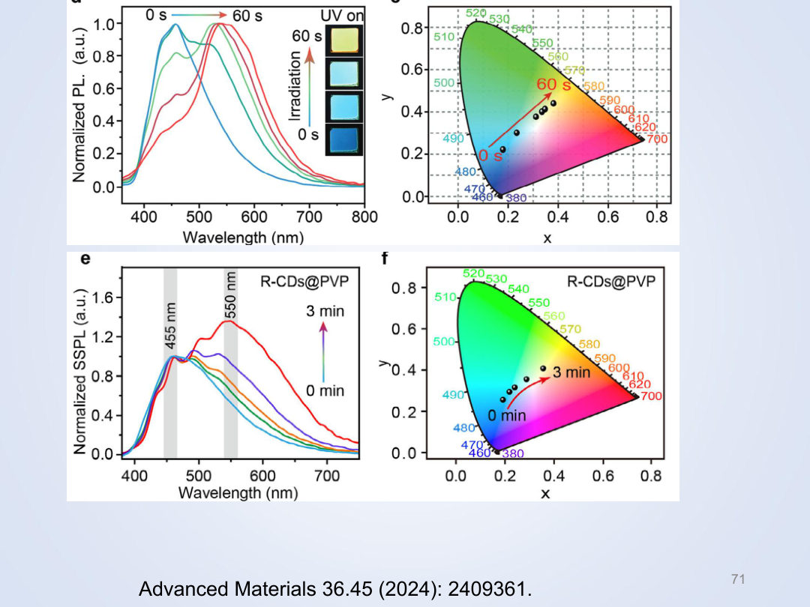

### 本页文字

```text
71
Advanced Materials 36.45 (2024): 2409361.
```

## 第 67 页

**页面标题/首行：** 光刺激的数学表示 𝜑(𝜆) 描述了各个波长处的能量分布

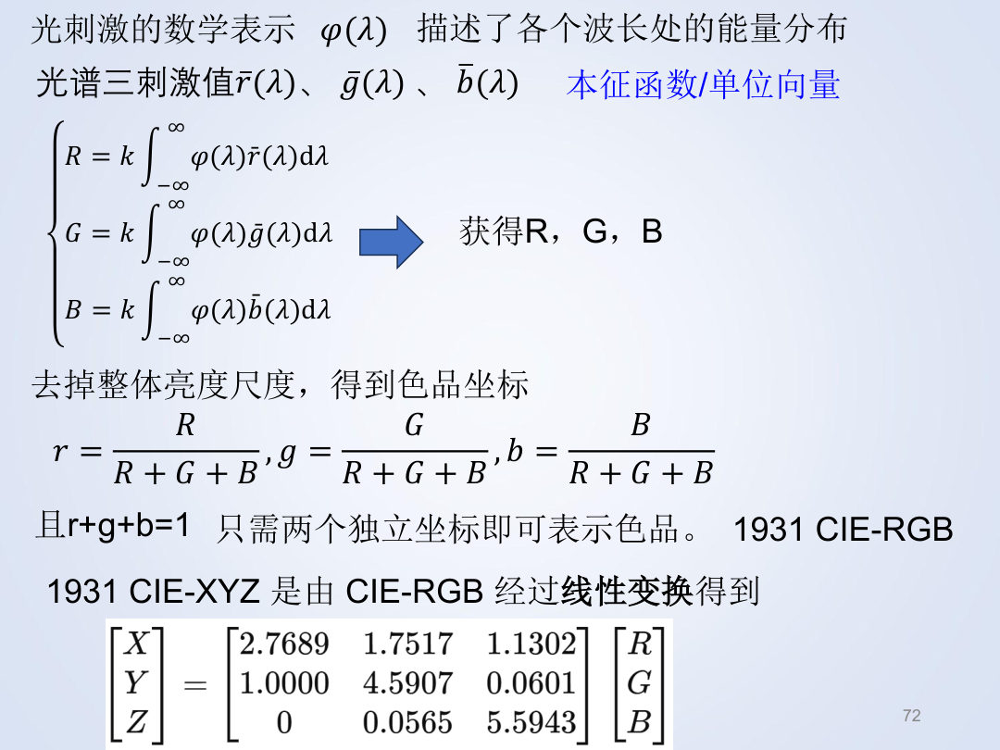

### 本页文字

```text
光刺激的数学表示 𝜑(𝜆) 描述了各个波长处的能量分布
光谱三刺激值ҧ𝑟(𝜆)、 ҧ𝑔(𝜆) 、 ത𝑏(𝜆) 本征函数/单位向量

       ∞
 𝑅= 𝑘න  𝜑(𝜆)lj𝑟(𝜆)d𝜆
        −∞
       ∞
 𝐺= 𝑘න  𝜑(𝜆)lj𝑔(𝜆)d𝜆    获得R，G，B
        −∞
       ∞
 𝐵= 𝑘න  𝜑(𝜆)ሜ𝑏(𝜆)d𝜆
        −∞

去掉整体亮度尺度，得到色品坐标
       𝑅          𝐺         𝐵
 𝑟=      𝑔=       𝑏=   𝑅+ 𝐺+ 𝐵,   𝑅+ 𝐺+ 𝐵,  𝑅+ 𝐺+ 𝐵
且r+g+b=1 只需两个独立坐标即可表示色品。1931 CIE-RGB

 1931 CIE-XYZ 是由 CIE-RGB 经过线性变换得到

                                                                                              72
```

## 第 68 页

**页面标题/首行：** 多选题 2分

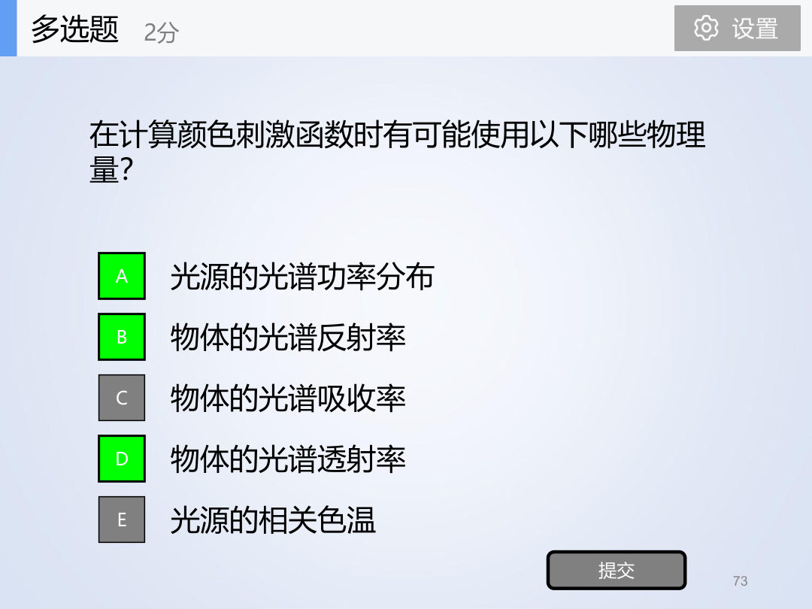

### 本页文字

```text
多选题 2分

  在计算颜色刺激函数时有可能使用以下哪些物理
  量？

       A     光源的光谱功率分布

        B     物体的光谱反射率

       C     物体的光谱吸收率

      D     物体的光谱透射率

         E     光源的相关色温

                                提交                                                                                             73
```

## 第 69 页

**页面标题/首行：** 单选题 1分

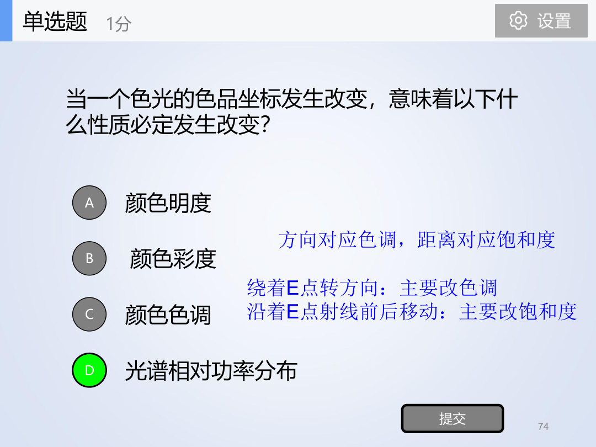

### 本页文字

```text
单选题 1分

  当一个色光的色品坐标发生改变，意味着以下什
  么性质必定发生改变？

       A     颜色明度

             方向对应色调，距离对应饱和度
        B     颜色彩度
            绕着E点转方向：主要改色调
       C     颜色色调  沿着E点射线前后移动：主要改饱和度

      D     光谱相对功率分布

                                提交                                                                                             74
```

## 第 70 页

**页面标题/首行：** 填空题 1分

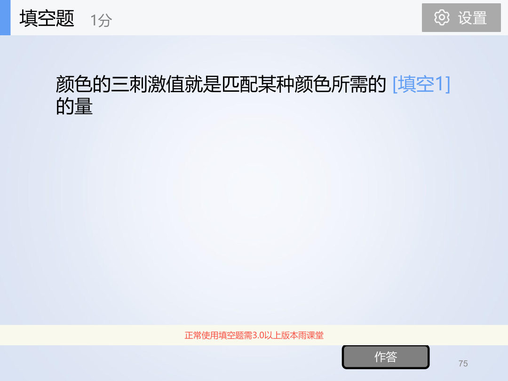

### 本页文字

```text
填空题 1分

  颜色的三刺激值就是匹配某种颜色所需的 [填空1]
  的量

                     正常使用填空题需3.0以上版本雨课堂

                                作答                                                                                             75
```

## 第 71 页

**页面标题/首行：** 色度学的基本概念和实验定律

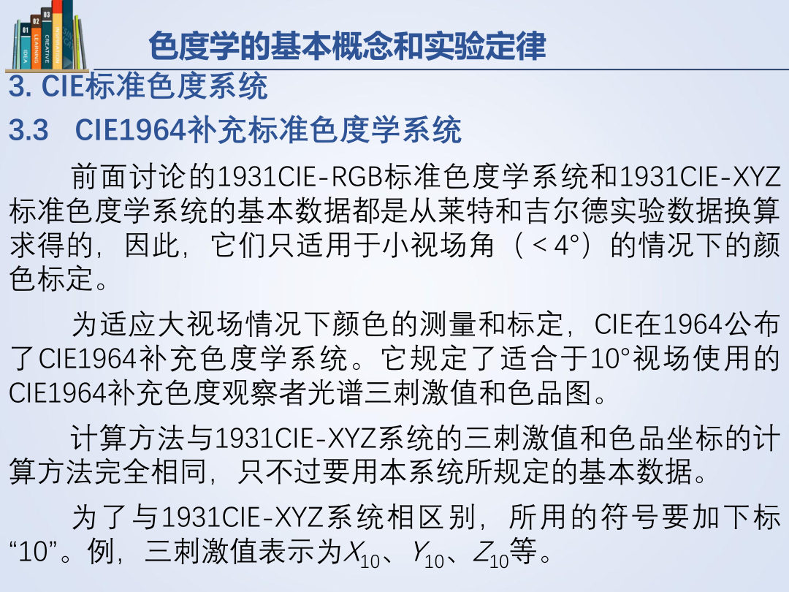

### 本页文字

```text
色度学的基本概念和实验定律
3. CIE标准色度系统
3.3 CIE1964补充标准色度学系统

   前面讨论的1931CIE-RGB标准色度学系统和1931CIE-XYZ
标准色度学系统的基本数据都是从莱特和吉尔德实验数据换算
求得的，因此，它们只适用于小视场角（＜4°）的情况下的颜
色标定。

  为适应大视场情况下颜色的测量和标定，CIE在1964公布
了CIE1964补充色度学系统。它规定了适合于10°视场使用的
CIE1964补充色度观察者光谱三刺激值和色品图。

   计算方法与1931CIE-XYZ系统的三刺激值和色品坐标的计
算方法完全相同，只不过要用本系统所规定的基本数据。

   为了与1931CIE-XYZ系统相区别，所用的符号要加下标
“10”。例，三刺激值表示为X10、Y10、Z10等。
```

## 第 72 页

**页面标题/首行：** 第 72 页

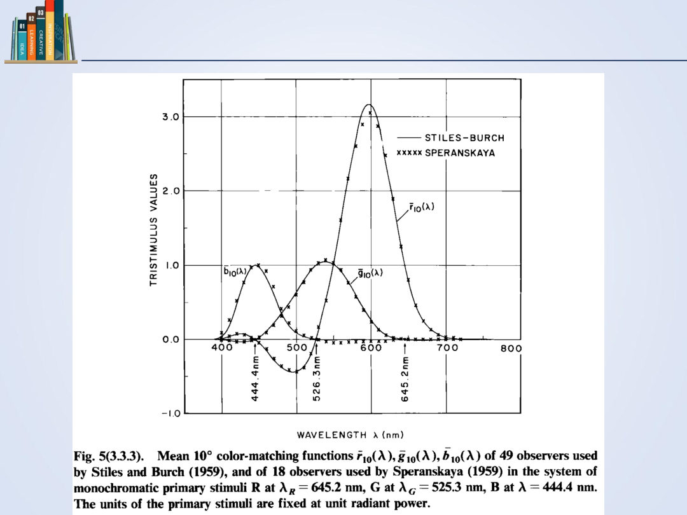

### 本页文字

> 本页未检测到可提取文本，请以页面截图为准。

## 第 73 页

**页面标题/首行：** 色度学的基本概念和实验定律

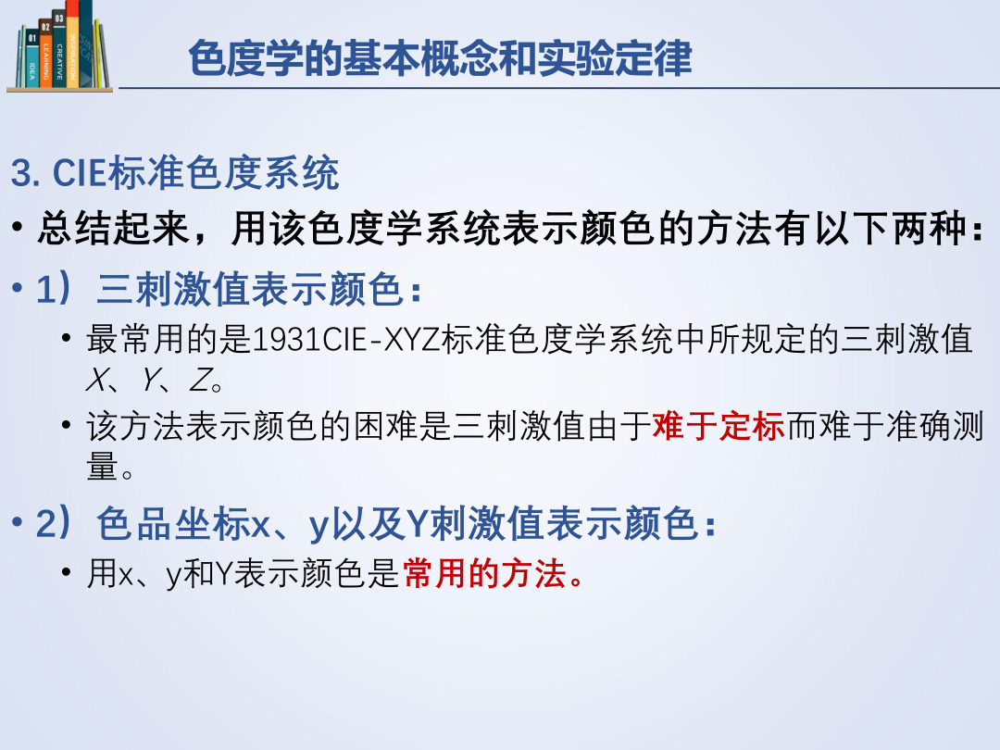

### 本页文字

```text
色度学的基本概念和实验定律

3. CIE标准色度系统
• 总结起来，用该色度学系统表示颜色的方法有以下两种：
• 1）三刺激值表示颜色：
    • 最常用的是1931CIE-XYZ标准色度学系统中所规定的三刺激值
   X、Y、Z。
    • 该方法表示颜色的困难是三刺激值由于难于定标而难于准确测
  量。
• 2）色品坐标x、y以及Y刺激值表示颜色：
    • 用x、y和Y表示颜色是常用的方法。
```

## 第 74 页

**页面标题/首行：** 色度学的基本概念和实验定律

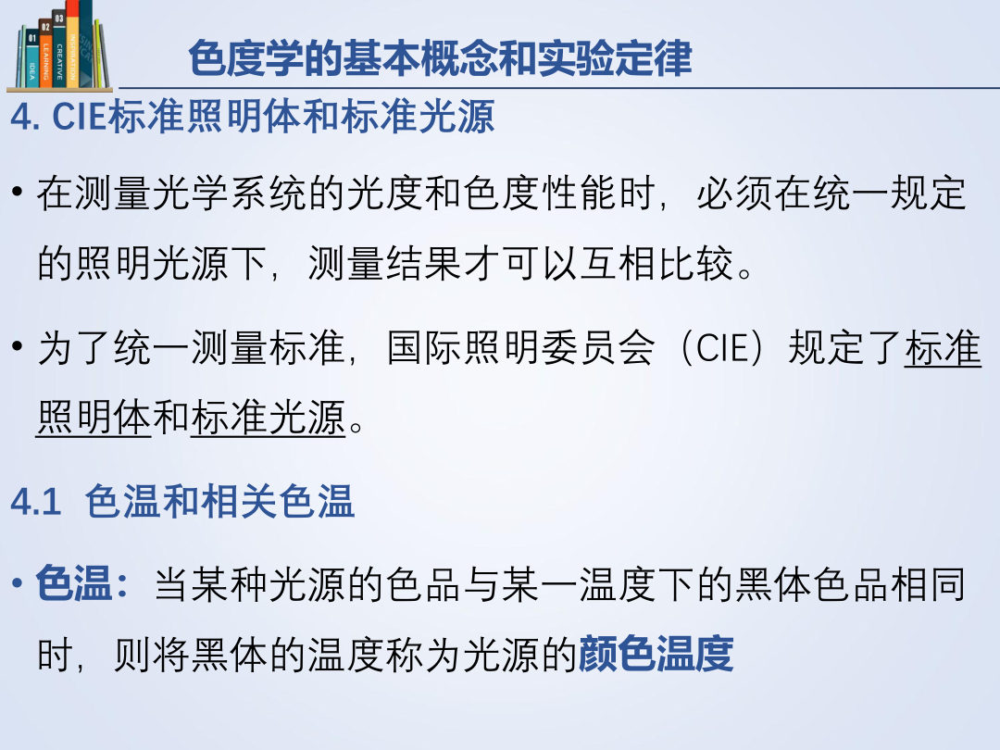

### 本页文字

```text
色度学的基本概念和实验定律
4. CIE标准照明体和标准光源

• 在测量光学系统的光度和色度性能时，必须在统一规定

 的照明光源下，测量结果才可以互相比较。

• 为了统一测量标准，国际照明委员会（CIE）规定了标准

 照明体和标准光源。

4.1 色温和相关色温

• 色温：当某种光源的色品与某一温度下的黑体色品相同
 时，则将黑体的温度称为光源的颜色温度
```

## 第 75 页

**页面标题/首行：** 色度学的基本概念和实验定律

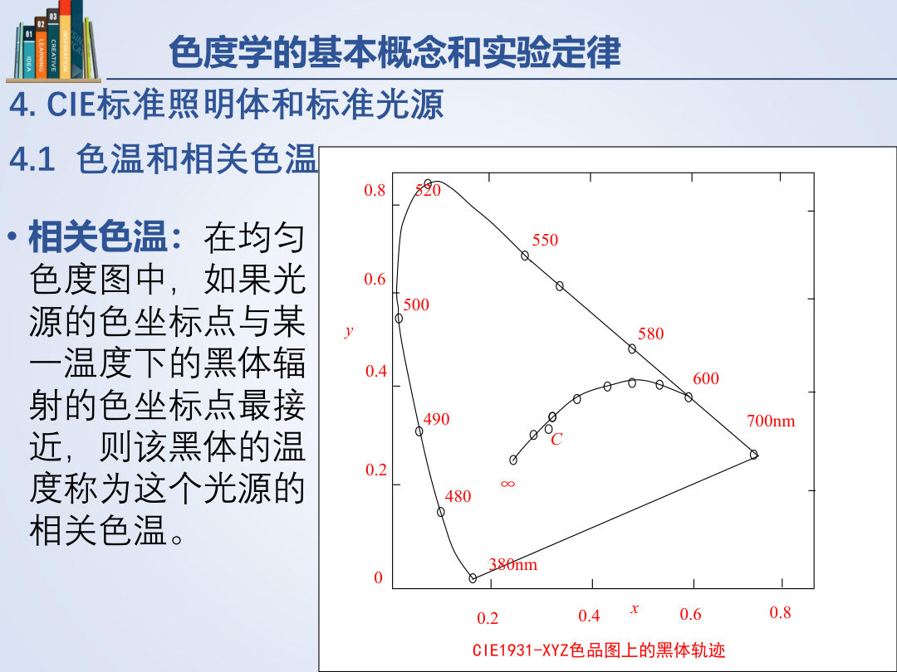

### 本页文字

```text
色度学的基本概念和实验定律
4. CIE标准照明体和标准光源
4.1 色温和相关色温
                                                 0.8   520

                                                            550• 相关色温：在均匀

                                                 0.6 色度图中，如果光
                                             500
 源的色坐标点与某     y                                580
 一温度下的黑体辐        0.4                                                                              600
 射的色坐标点最接                                               490                              700nm
 近，则该黑体的温                     C
                                                 0.2
                            ∞ 度称为这个光源的                480
 相关色温。
                                                 380nm
                                          0

                                                                                x                                                                 0.2           0.4           0.6         0.8

                                     CIE1931-XYZ色品图上的黑体轨迹
```

## 第 76 页

**页面标题/首行：** 填空题 2分


### 本页文字

```text
填空题 2分

  辐射通量相等的条件下，[填空1] 色LED最亮最省
   电，[填空2] 色设备/显示器需要更高功率才能达
  到相同的视觉亮度。

                                作答                                                                                             81
```

## 第 77 页

**页面标题/首行：** 第 77 页


### 本页文字

```text
82
```

## 第 78 页

**页面标题/首行：** 颜色的三刺激值：匹配某种颜色所需的三原色的量

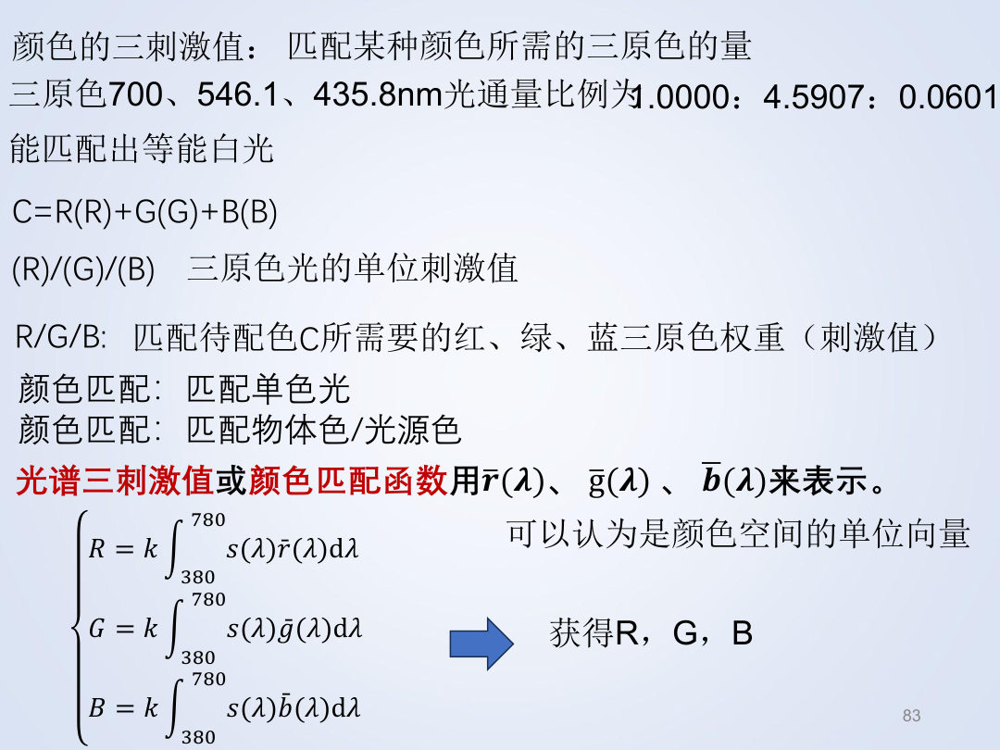

### 本页文字

```text
颜色的三刺激值：匹配某种颜色所需的三原色的量
三原色700、546.1、435.8nm光通量比例为1.0000：4.5907：0.0601
能匹配出等能白光

C=R(R)+G(G)+B(B)

(R)/(G)/(B) 三原色光的单位刺激值

R/G/B: 匹配待配色C所需要的红、绿、蓝三原色权重（刺激值）
颜色匹配：匹配单色光
颜色匹配：匹配物体色/光源色
光谱三刺激值或颜色匹配函数用ത𝒓(𝝀)、 തg(𝝀) 、 ഥ𝒃(𝝀)来表示。

               780
               可以认为是颜色空间的单位向量   𝑅= 𝑘න   𝑠(𝜆)lj𝑟(𝜆)d𝜆
               380
               780
   𝐺= 𝑘න   𝑠(𝜆)lj𝑔(𝜆)d𝜆      获得R，G，B
               380
                780
   𝐵= 𝑘න   𝑠(𝜆)ሜ𝑏(𝜆)d𝜆                                                          83
               380
```

## 第 79 页

**页面标题/首行：** 去掉整体亮度尺度，得到色品坐标

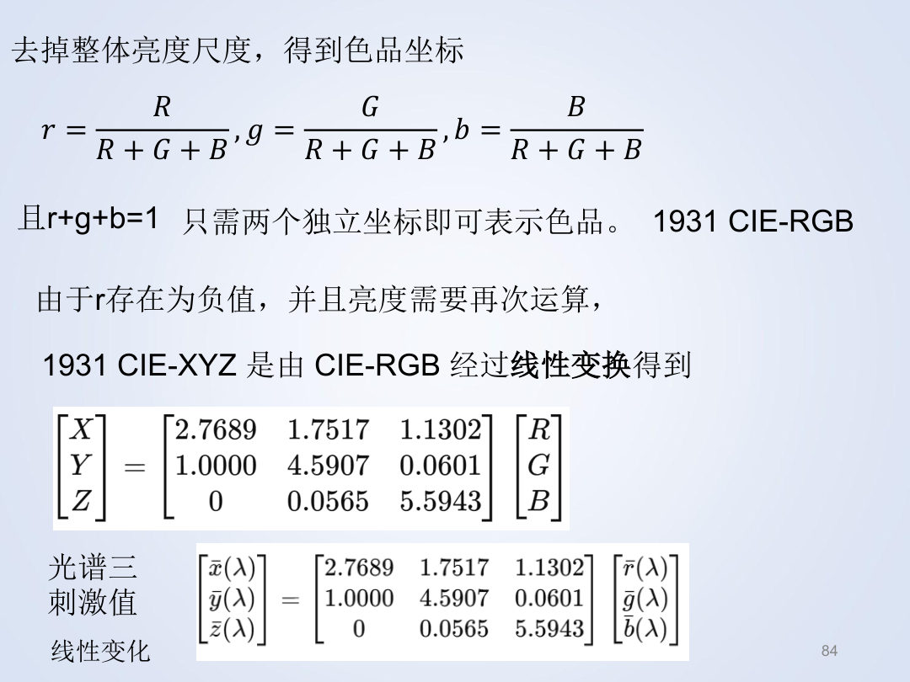

### 本页文字

```text
去掉整体亮度尺度，得到色品坐标

       𝑅          𝐺         𝐵
 𝑟=      𝑔=       𝑏=   𝑅+ 𝐺+ 𝐵,   𝑅+ 𝐺+ 𝐵,  𝑅+ 𝐺+ 𝐵

且r+g+b=1 只需两个独立坐标即可表示色品。1931 CIE-RGB

 由于r存在为负值，并且亮度需要再次运算，

  1931 CIE-XYZ 是由 CIE-RGB 经过线性变换得到

 光谱三
 刺激值

                                                                                                84  线性变化
```

## 第 80 页

**页面标题/首行：** Advanced Materials 36.45 (2024): 2409361.


### 本页文字

```text
85
Advanced Materials 36.45 (2024): 2409361.
```

## 第 81 页

**页面标题/首行：** 第 81 页

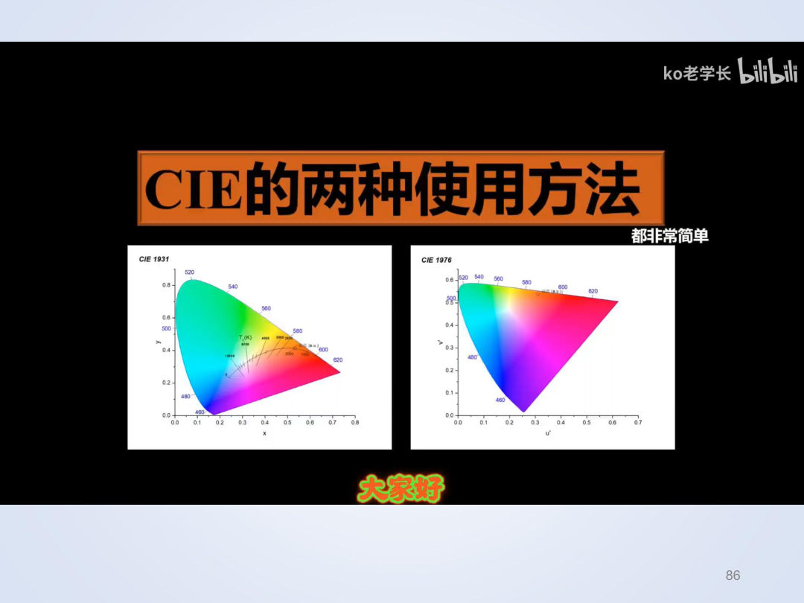

### 本页文字

```text
86
```

## 第 82 页

**页面标题/首行：** 色度学的基本概念和实验定律

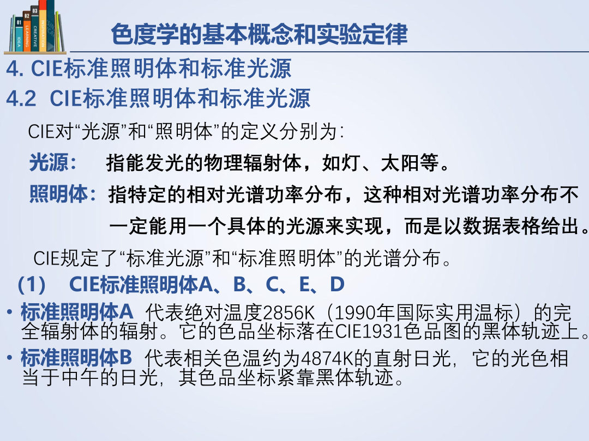

### 本页文字

```text
色度学的基本概念和实验定律
4. CIE标准照明体和标准光源
4.2 CIE标准照明体和标准光源

 CIE对“光源”和“照明体”的定义分别为：
 光源： 指能发光的物理辐射体，如灯、太阳等。
 照明体：指特定的相对光谱功率分布，这种相对光谱功率分布不

     一定能用一个具体的光源来实现，而是以数据表格给出。

  CIE规定了“标准光源”和“标准照明体”的光谱分布。
（1） CIE标准照明体A、B、C、E、D
• 标准照明体A 代表绝对温度2856K（1990年国际实用温标）的完
 全辐射体的辐射。它的色品坐标落在CIE1931色品图的黑体轨迹上。
• 标准照明体B 代表相关色温约为4874K的直射日光，它的光色相
 当于中午的日光，其色品坐标紧靠黑体轨迹。
```

## 第 83 页

**页面标题/首行：** 色度学的基本概念和实验定律

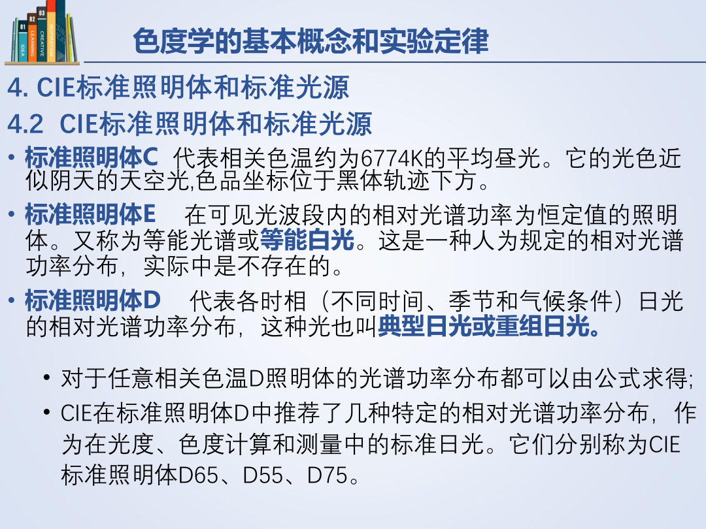

### 本页文字

```text
色度学的基本概念和实验定律

4. CIE标准照明体和标准光源
4.2 CIE标准照明体和标准光源
• 标准照明体C 代表相关色温约为6774K的平均昼光。它的光色近
 似阴天的天空光,色品坐标位于黑体轨迹下方。
• 标准照明体E 在可见光波段内的相对光谱功率为恒定值的照明
 体。又称为等能光谱或等能白光。这是一种人为规定的相对光谱
 功率分布，实际中是不存在的。
• 标准照明体D 代表各时相（不同时间、季节和气候条件）日光
 的相对光谱功率分布，这种光也叫典型日光或重组日光。

    • 对于任意相关色温D照明体的光谱功率分布都可以由公式求得;
    • CIE在标准照明体D中推荐了几种特定的相对光谱功率分布，作
  为在光度、色度计算和测量中的标准日光。它们分别称为CIE
   标准照明体D65、D55、D75。
```

## 第 84 页

**页面标题/首行：** 色度学的基本概念和实验定律

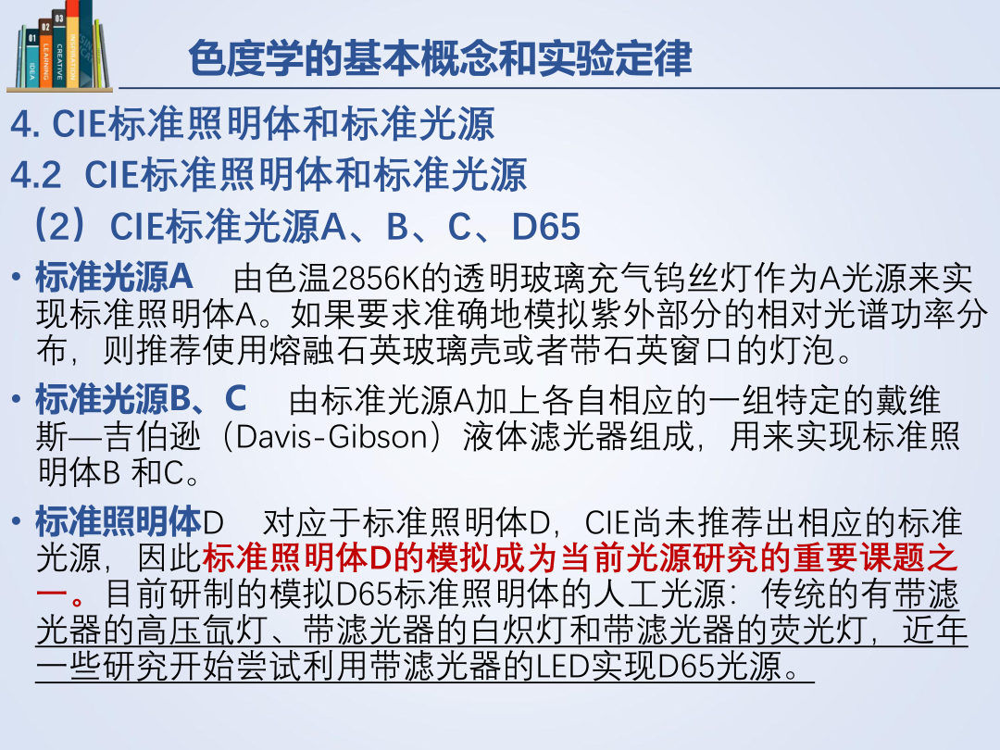

### 本页文字

```text
色度学的基本概念和实验定律

4. CIE标准照明体和标准光源
4.2 CIE标准照明体和标准光源
（2）CIE标准光源A、B、C、D65
• 标准光源A 由色温2856K的透明玻璃充气钨丝灯作为A光源来实
 现标准照明体A。如果要求准确地模拟紫外部分的相对光谱功率分
 布，则推荐使用熔融石英玻璃壳或者带石英窗口的灯泡。
• 标准光源B、C 由标准光源A加上各自相应的一组特定的戴维
 斯—吉伯逊（Davis-Gibson）液体滤光器组成，用来实现标准照
 明体B 和C。
• 标准照明体D 对应于标准照明体D，CIE尚未推荐出相应的标准
 光源，因此标准照明体D的模拟成为当前光源研究的重要课题之
 一。目前研制的模拟D65标准照明体的人工光源：传统的有带滤
 光器的高压氙灯、带滤光器的白炽灯和带滤光器的荧光灯，近年
 一些研究开始尝试利用带滤光器的LED实现D65光源。
```

## 第 85 页

**页面标题/首行：** 色度学的基本概念和实验定律

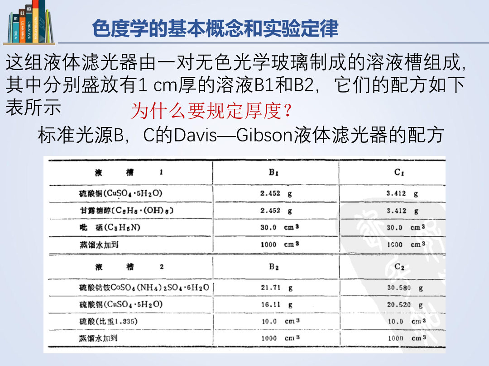

### 本页文字

```text
色度学的基本概念和实验定律

这组液体滤光器由一对无色光学玻璃制成的溶液槽组成，
其中分别盛放有1 cm厚的溶液B1和B2，它们的配方如下
表所示       为什么要规定厚度？
  标准光源B，C的Davis—Gibson液体滤光器的配方
```

## 第 86 页

**页面标题/首行：** 填空题 2分

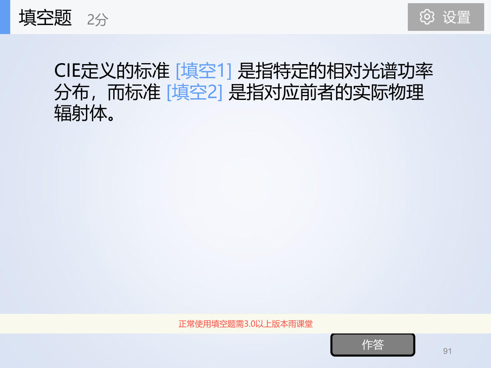

### 本页文字

```text
填空题 2分

  CIE定义的标准 [填空1] 是指特定的相对光谱功率
  分布，而标准 [填空2] 是指对应前者的实际物理
  辐射体。

                     正常使用填空题需3.0以上版本雨课堂

                                作答                                                                                             91
```

## 第 87 页

**页面标题/首行：** CIE色度计算方法

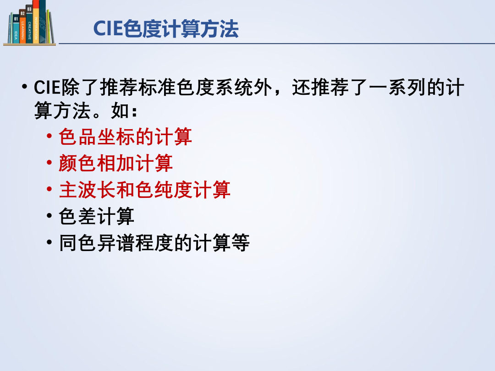

### 本页文字

```text
CIE色度计算方法

• CIE除了推荐标准色度系统外，还推荐了一系列的计
 算方法。如：
    • 色品坐标的计算
    • 颜色相加计算
    • 主波长和色纯度计算
    • 色差计算
    • 同色异谱程度的计算等
```

## 第 88 页

**页面标题/首行：** CIE色度计算方法

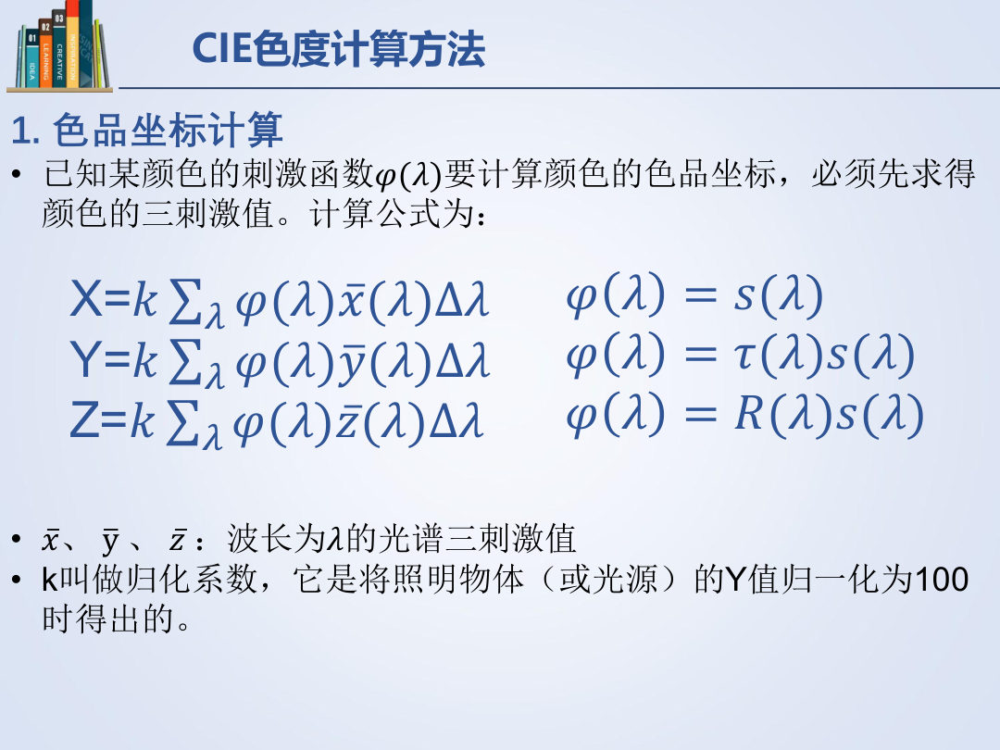

### 本页文字

```text
CIE色度计算方法

1. 色品坐标计算
• 已知某颜色的刺激函数𝜑(𝜆)要计算颜色的色品坐标，必须先求得
 颜色的三刺激值。计算公式为：

           𝜑𝜆= 𝑠(𝜆)               ҧ𝑥(𝜆)Δ𝜆  X=𝑘σ𝜆𝜑(𝜆)
  Y=𝑘σ𝜆𝜑(𝜆)ത𝑦(𝜆)Δ𝜆 𝜑𝜆= 𝜏(𝜆)𝑠(𝜆)
           𝜑𝜆= 𝑅(𝜆)𝑠(𝜆)               ҧ𝑧(𝜆)Δ𝜆  Z=𝑘σ𝜆𝜑(𝜆)

• ҧ𝑥、 തy 、 ҧ𝑧：波长为𝜆的光谱三刺激值
• k叫做归化系数，它是将照明物体（或光源）的Y值归一化为100
 时得出的。
```

## 第 89 页

**页面标题/首行：** CIE色度计算方法

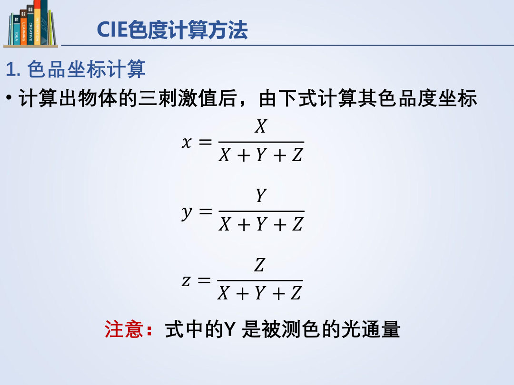

### 本页文字

```text
CIE色度计算方法

1. 色品坐标计算
• 计算出物体的三刺激值后，由下式计算其色品度坐标
                   𝑋
           𝑥=
             𝑋+ 𝑌+ 𝑍

                     𝑌
           𝑦=
             𝑋+ 𝑌+ 𝑍

                     𝑍
            𝑧=
             𝑋+ 𝑌+ 𝑍

     注意：式中的Y 是被测色的光通量
```

## 第 90 页

**页面标题/首行：** CIE色度计算方法

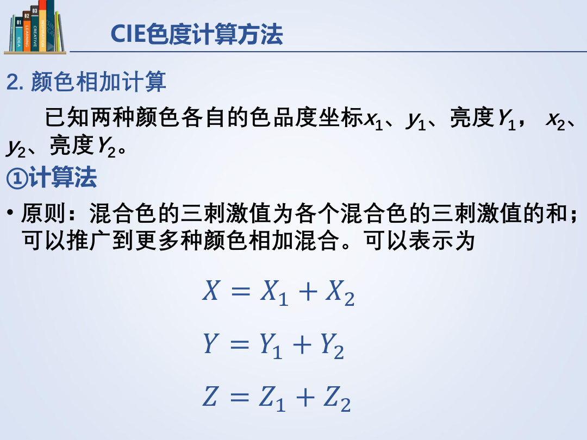

### 本页文字

```text
CIE色度计算方法

2. 颜色相加计算
  已知两种颜色各自的色品度坐标x1、y1、亮度Y1， x2、
y2、亮度Y2。
①计算法
• 原则：混合色的三刺激值为各个混合色的三刺激值的和；
 可以推广到更多种颜色相加混合。可以表示为

        𝑋= 𝑋1 + 𝑋2

        𝑌= 𝑌1 + 𝑌2

        𝑍= 𝑍1 + 𝑍2
```

## 第 91 页

**页面标题/首行：** CIE色度计算方法

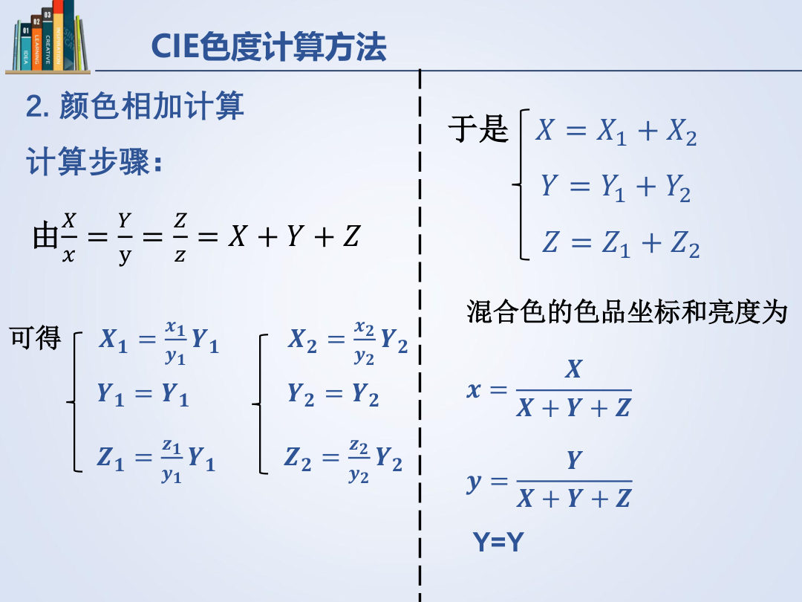

### 本页文字

```text
CIE色度计算方法

 2. 颜色相加计算
              于是 𝑋= 𝑋1 + 𝑋2
 计算步骤：
                     𝑌= 𝑌1 + 𝑌2
   𝑋   𝑌   𝑍
                     𝑍= 𝑍1 + 𝑍2 由 𝑥= y = 𝑧= 𝑋+ 𝑌+ 𝑍

                 混合色的色品坐标和亮度为
               𝒙𝟏                𝒙𝟐
可得  𝑿𝟏= 𝒚𝟏𝒀𝟏   𝑿𝟐= 𝒚𝟐𝒀𝟐
                              𝑿
     𝒀𝟏= 𝒀𝟏     𝒀𝟐= 𝒀𝟐    𝒙=                       𝑿+ 𝒀+ 𝒁

                𝒛𝟏                 𝒛𝟐
     𝒁𝟏= 𝒚𝟏𝒀𝟏    𝒁𝟐= 𝒚𝟐𝒀𝟐          𝒀                     𝒚=
                       𝑿+ 𝒀+ 𝒁
                           Y=Y
```

## 第 92 页

**页面标题/首行：** CIE色度计算方法

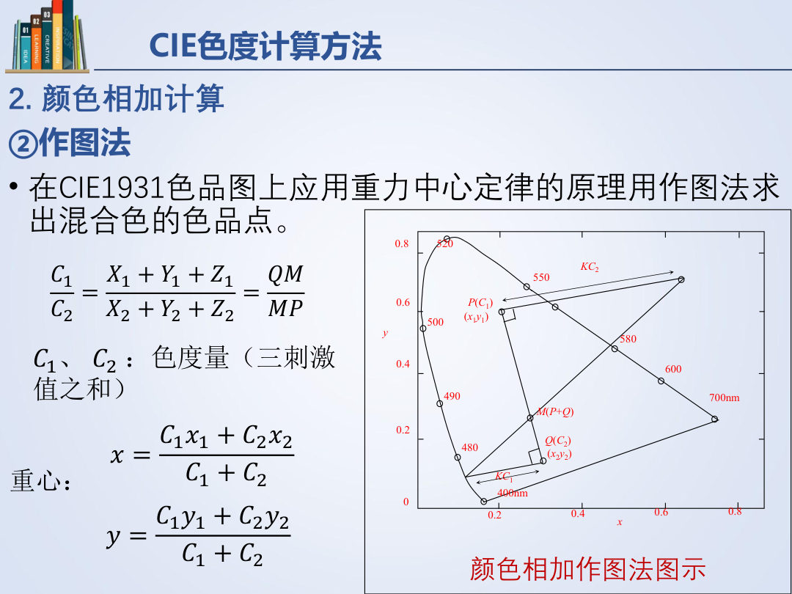

### 本页文字

```text
CIE色度计算方法

2. 颜色相加计算
②作图法
• 在CIE1931色品图上应用重力中心定律的原理用作图法求
 出混合色的色品点。
                                                                                    0.8     520

                                                                                              KC2
                                                                                               550    𝐶1   𝑋1 + 𝑌1 + 𝑍1  𝑄𝑀
    =        =                             0.6            P(C1)
                                                                                                                (x1y1)    𝐶2   𝑋2 + 𝑌2 + 𝑍2  𝑀𝑃                      500
                                                                             y
                                                                                                               580
 𝐶1、 𝐶2 ：色度量（三刺激             0.4                                              600
 值之和）                                                       490                                         700nm
                                                                                     M(P+Q)

                                                                                                      Q(C2)            𝐶1𝑥1 + 𝐶2𝑥2                      0.2         480
                                                                                                                                    (x2y2)     𝑥=
              𝐶1 + 𝐶2重心：                                                                   KC1                                                                                400nm
                                                                        0

                                                                                                                             x            𝐶1𝑦1 + 𝐶2𝑦2                                           0.2               0.4               0.6             0.8
     𝑦=
              𝐶1 + 𝐶2                 颜色相加作图法图示
```

## 第 93 页

**页面标题/首行：** CIE色度计算方法

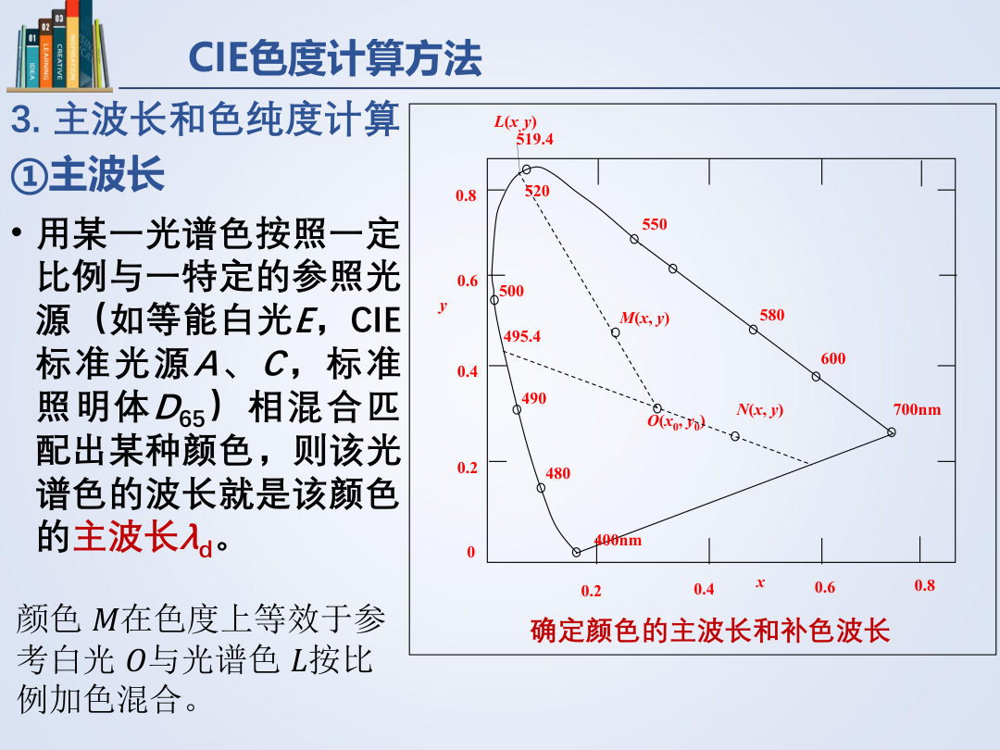

### 本页文字

```text
CIE色度计算方法

                                                                        L(x, y)3. 主波长和色纯度计算                                                                   519.4
①主波长                                           520                                                                0.8
• 用某一光谱色按照一定                             550

                                                                0.6 比例与一特定的参照光            500
                                                          y
                                                                          M(x, y)           580 源（如等能白光E，CIE                                                                  495.4
                                                                                                 600 标准光源A、C，标准        0.4
                                                             490
                                                                                                 N(x, y)           700nm 照明体D65）相混合匹                                  O(x0, y0)
 配出某种颜色，则该光                                                                0.2                                                                480
 谱色的波长就是该颜色

                                                             400nm 的主波长λd。                          0

                                                                                          x                                                                                  0.2             0.4              0.6           0.8
颜色 𝑀在色度上等效于参                   确定颜色的主波长和补色波长
考白光 𝑂与光谱色 𝐿按比
例加色混合。
```

## 第 94 页

**页面标题/首行：** CIE色度计算方法

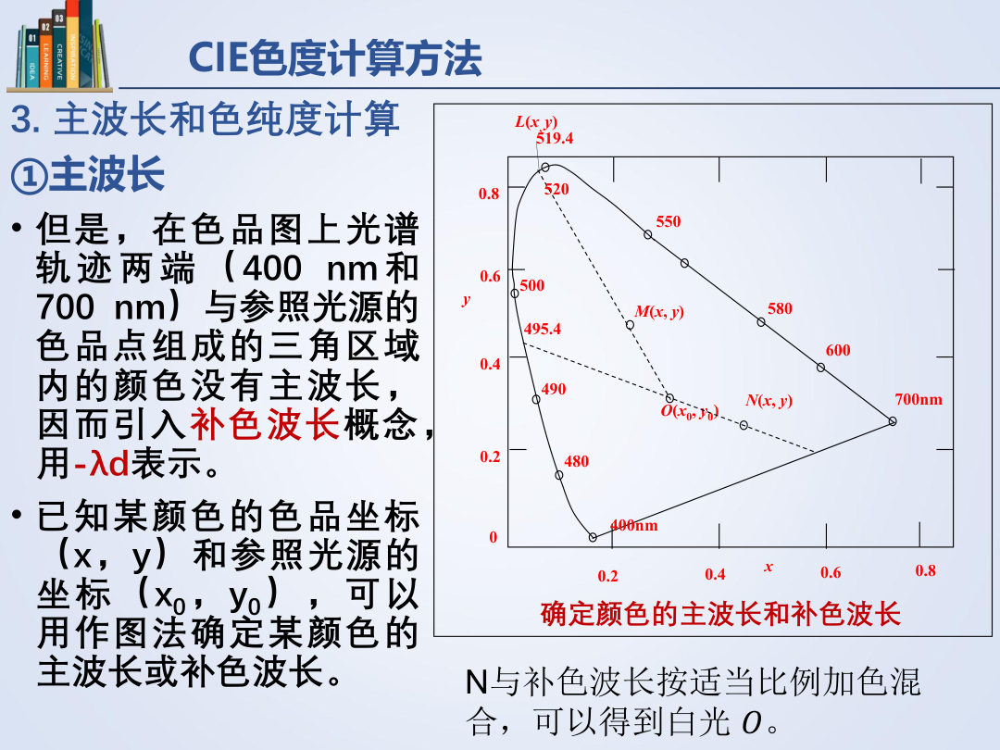

### 本页文字

```text
CIE色度计算方法

                                                                           L(x, y)3. 主波长和色纯度计算                                                                      519.4
①主波长                                             520                                                                   0.8
                                                                              550• 但是，在色品图上光谱
 轨迹两端（400 nm和         0.6                                                             500
                                                             y
                                                                            M(x, y)          580 700 nm）与参照光源的
                                                                     495.4
                                                                                                  600 色品点组成的三角区域                                                                    0.4
                                                                490 内的颜色没有主波长，                                                                                                  N(x, y)           700nm
                                                                                           O(x0, y0)
 因而引入补色波长概念，
                                                                    0.2                                                                  480 用-λd表示。
• 已知某颜色的色品坐标                    400nm
                                                         0
 （x，y）和参照光源的                                         x                                                                                     0.2            0.4              0.6           0.8
 坐标（x0，y0），可以                   确定颜色的主波长和补色波长
 用作图法确定某颜色的
 主波长或补色波长。              N与补色波长按适当比例加色混
              合，可以得到白光 𝑂。
```

## 第 95 页

**页面标题/首行：** CIE色度计算方法

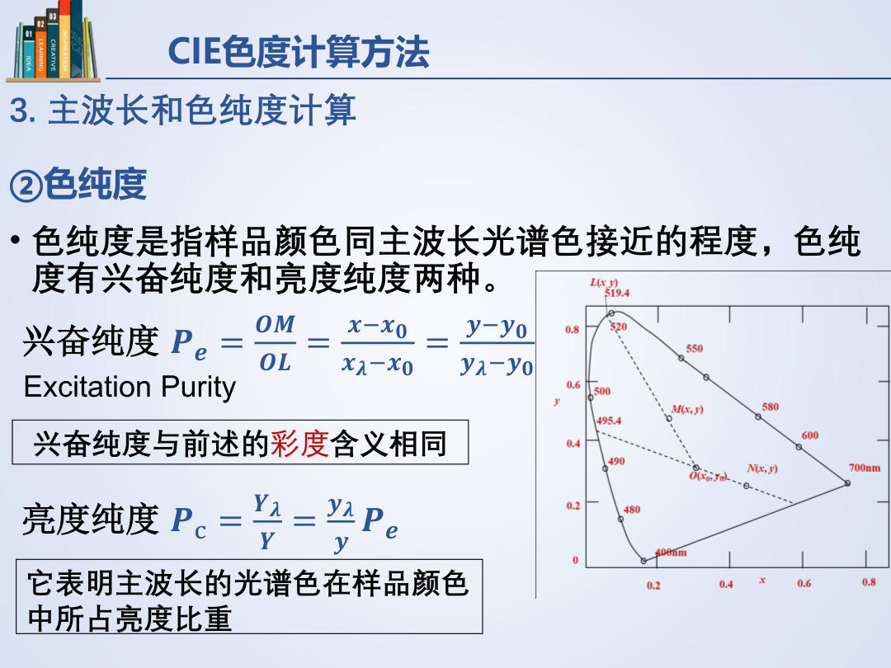

### 本页文字

```text
CIE色度计算方法

3. 主波长和色纯度计算

②色纯度
• 色纯度是指样品颜色同主波长光谱色接近的程度，色纯
 度有兴奋纯度和亮度纯度两种。

            𝑶𝑴   𝒙−𝒙𝟎    𝒚−𝒚𝟎
兴奋纯度 𝑷𝒆= 𝑶𝑳= 𝒙𝝀−𝒙𝟎= 𝒚𝝀−𝒚𝟎
 Excitation Purity

 兴奋纯度与前述的彩度含义相同

                  𝒀𝝀   𝒚𝝀
亮度纯度 𝑷c = 𝒀= 𝒚𝑷𝒆
 它表明主波长的光谱色在样品颜色
 中所占亮度比重
```

## 第 96 页

**页面标题/首行：** 色度的测试方法和应用

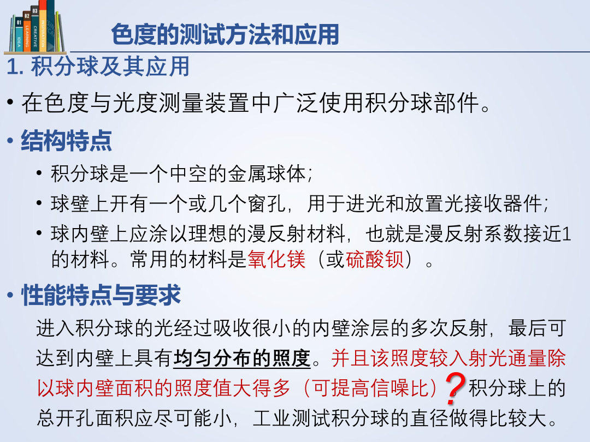

### 本页文字

```text
色度的测试方法和应用
1. 积分球及其应用
• 在色度与光度测量装置中广泛使用积分球部件。
• 结构特点
    • 积分球是一个中空的金属球体；
    • 球壁上开有一个或几个窗孔，用于进光和放置光接收器件；
    • 球内壁上应涂以理想的漫反射材料，也就是漫反射系数接近1
  的材料。常用的材料是氧化镁（或硫酸钡）。
• 性能特点与要求
 进入积分球的光经过吸收很小的内壁涂层的多次反射，最后可
 达到内壁上具有均匀分布的照度。并且该照度较入射光通量除
 以球内壁面积的照度值大得多（可提高信噪比）。积分球上的                  ?
 总开孔面积应尽可能小，工业测试积分球的直径做得比较大。
```

## 第 97 页

**页面标题/首行：** 色度的测试方法和应用

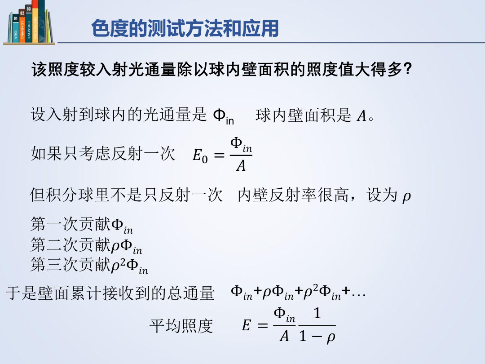

### 本页文字

```text
色度的测试方法和应用

  该照度较入射光通量除以球内壁面积的照度值大得多？

  设入射到球内的光通量是 Φin 球内壁面积是 𝐴。
                              Φ𝑖𝑛  如果只考虑反射一次                       𝐸0 =
                       𝐴

 但积分球里不是只反射一次 内壁反射率很高，设为 𝜌

  第一次贡献Φ𝑖𝑛
  第二次贡献𝜌Φ𝑖𝑛
  第三次贡献𝜌2Φ𝑖𝑛
于是壁面累计接收到的总通量  Φ𝑖𝑛+𝜌Φ𝑖𝑛+𝜌2Φ𝑖𝑛+…
                                    Φ𝑖𝑛  1
         平均照度  𝐸=
                           𝐴 1 −𝜌
```

## 第 98 页

**页面标题/首行：** 色度的测试方法和应用

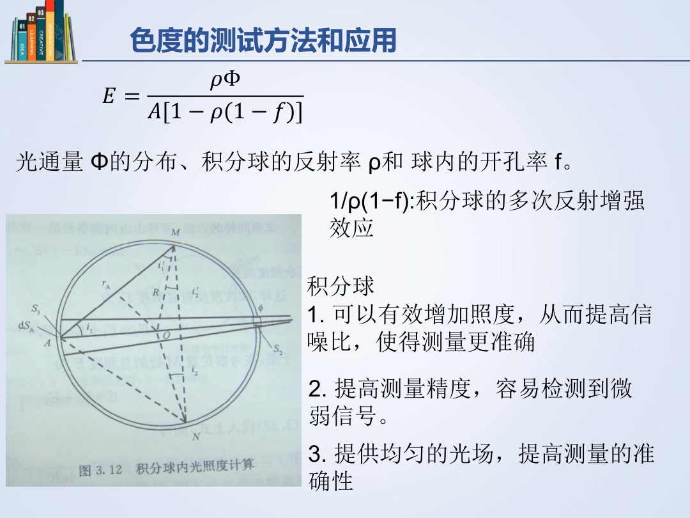

### 本页文字

```text
色度的测试方法和应用

             𝜌Φ
    𝐸=
           𝐴[1 −𝜌(1 −𝑓)]

光通量 Φ的分布、积分球的反射率 ρ和 球内的开孔率 f。

                   1/ρ(1−f):积分球的多次反射增强
              效应

             积分球
                              1. 可以有效增加照度，从而提高信
             噪比，使得测量更准确

                               2. 提高测量精度，容易检测到微
             弱信号。

                               3. 提供均匀的光场，提高测量的准
             确性
```

## 第 99 页

**页面标题/首行：** 色度的测试方法和应用

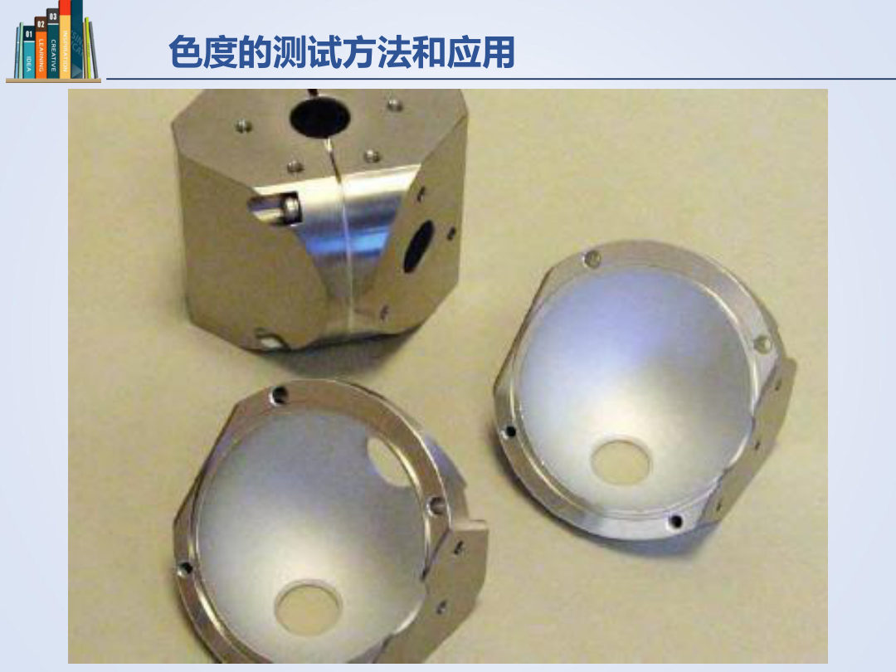

### 本页文字

```text
色度的测试方法和应用
```

## 第 100 页

**页面标题/首行：** 色度的测试方法和应用

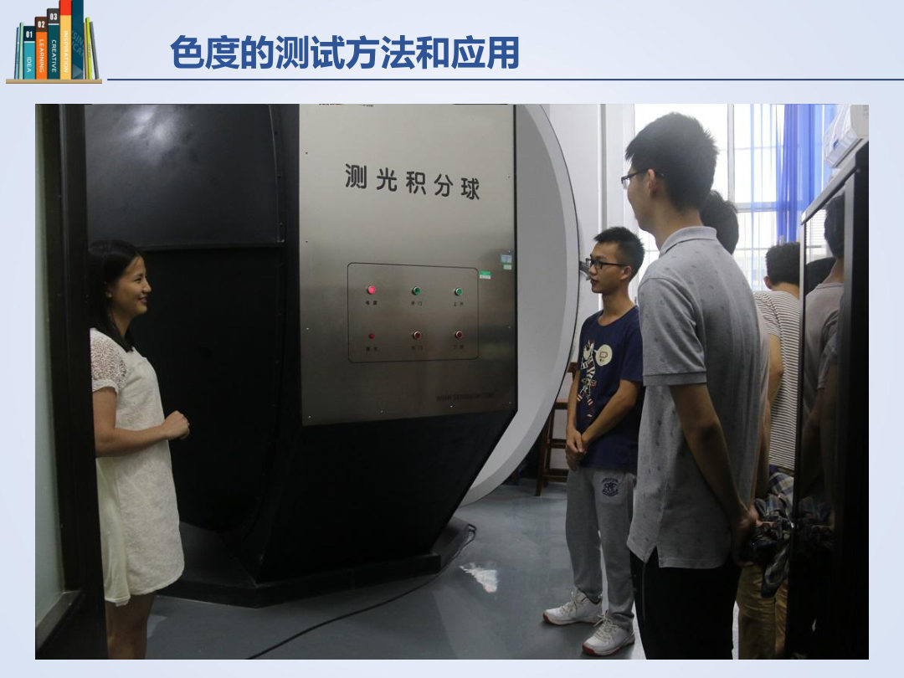

### 本页文字

```text
色度的测试方法和应用
```

## 第 101 页

**页面标题/首行：** 色度的测试方法和应用

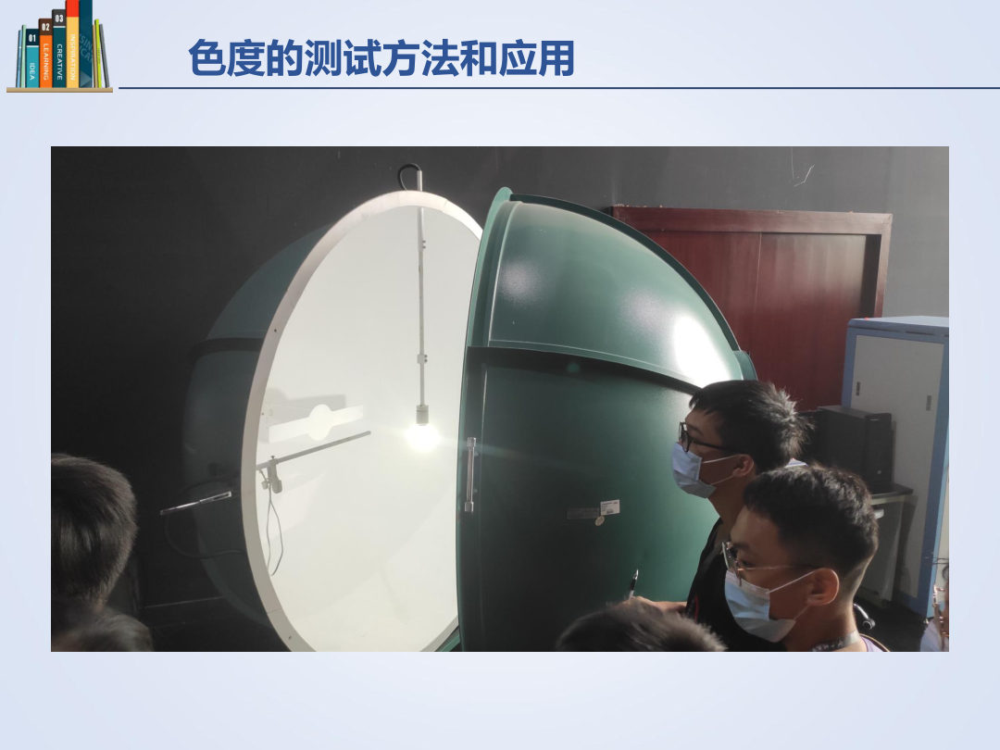

### 本页文字

```text
色度的测试方法和应用
```

## 第 102 页

**页面标题/首行：** 色度的测试方法和应用

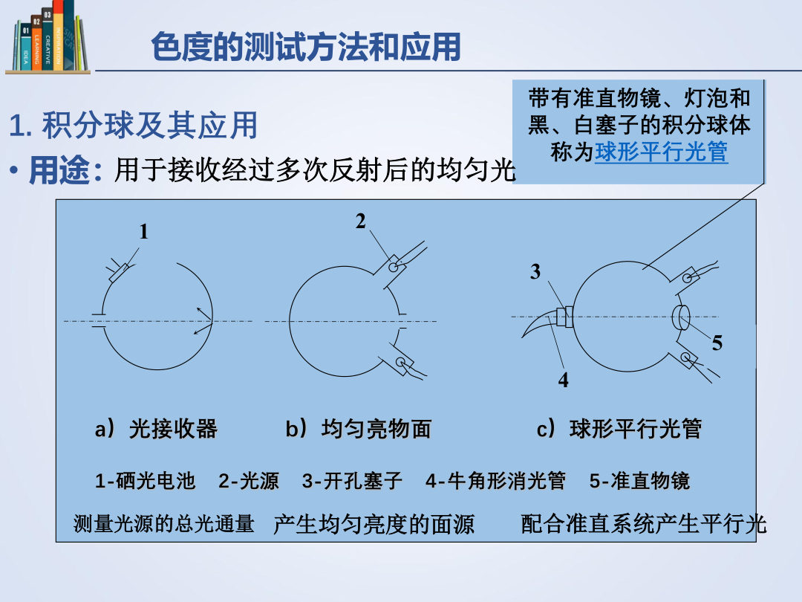

### 本页文字

```text
色度的测试方法和应用

                       带有准直物镜、灯泡和
                       黑、白塞子的积分球体1. 积分球及其应用
                        称为球形平行光管
    用于接收经过多次反射后的均匀光• 用途：

                               2            1

                                               3

                                                               5
                                                 4

    a）光接收器   b）均匀亮物面     c）球形平行光管

     1-硒光电池 2-光源 3-开孔塞子 4-牛角形消光管 5-准直物镜

   测量光源的总光通量 产生均匀亮度的面源  配合准直系统产生平行光
```

## 第 103 页

**页面标题/首行：** 色度的测试方法和应用

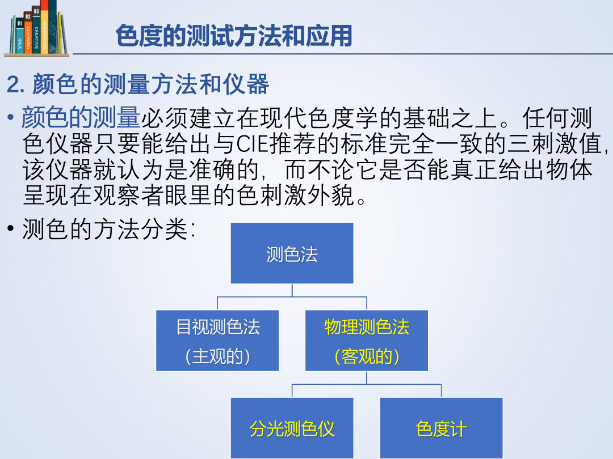

### 本页文字

```text
色度的测试方法和应用

2. 颜色的测量方法和仪器
• 颜色的测量必须建立在现代色度学的基础之上。任何测
 色仪器只要能给出与CIE推荐的标准完全一致的三刺激值，
 该仪器就认为是准确的，而不论它是否能真正给出物体
 呈现在观察者眼里的色刺激外貌。
• 测色的方法分类：
               测色法

          目视测色法    物理测色法
          （主观的）    （客观的）

              分光测色仪     色度计
```

## 第 104 页

**页面标题/首行：** 色度的测试方法和应用

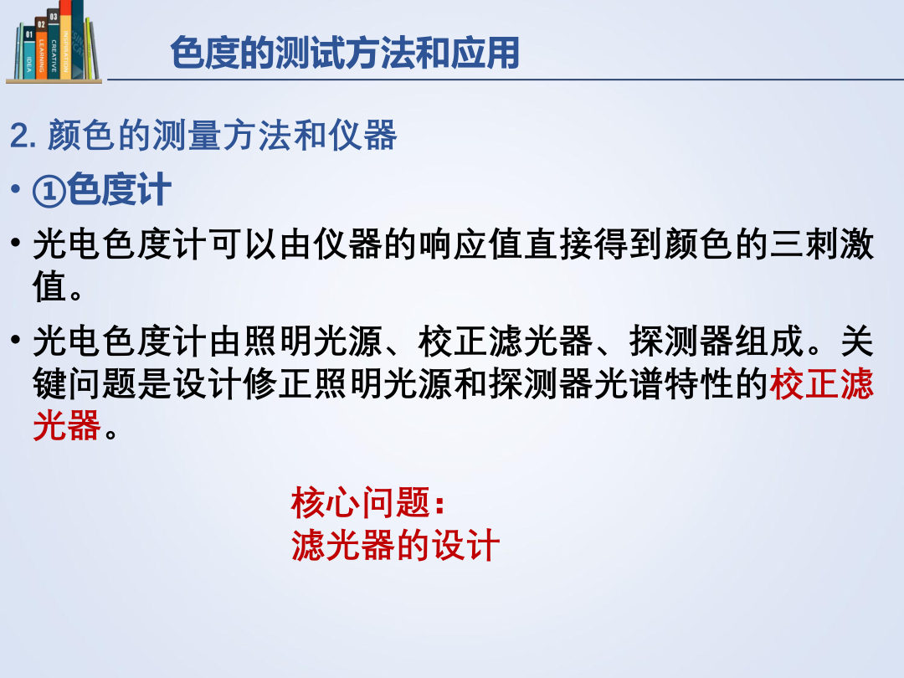

### 本页文字

```text
色度的测试方法和应用

2. 颜色的测量方法和仪器
• ①色度计
• 光电色度计可以由仪器的响应值直接得到颜色的三刺激
 值。
• 光电色度计由照明光源、校正滤光器、探测器组成。关
 键问题是设计修正照明光源和探测器光谱特性的校正滤
 光器。

        核心问题：
        滤光器的设计
```

## 第 105 页

**页面标题/首行：** 色度的测试方法和应用

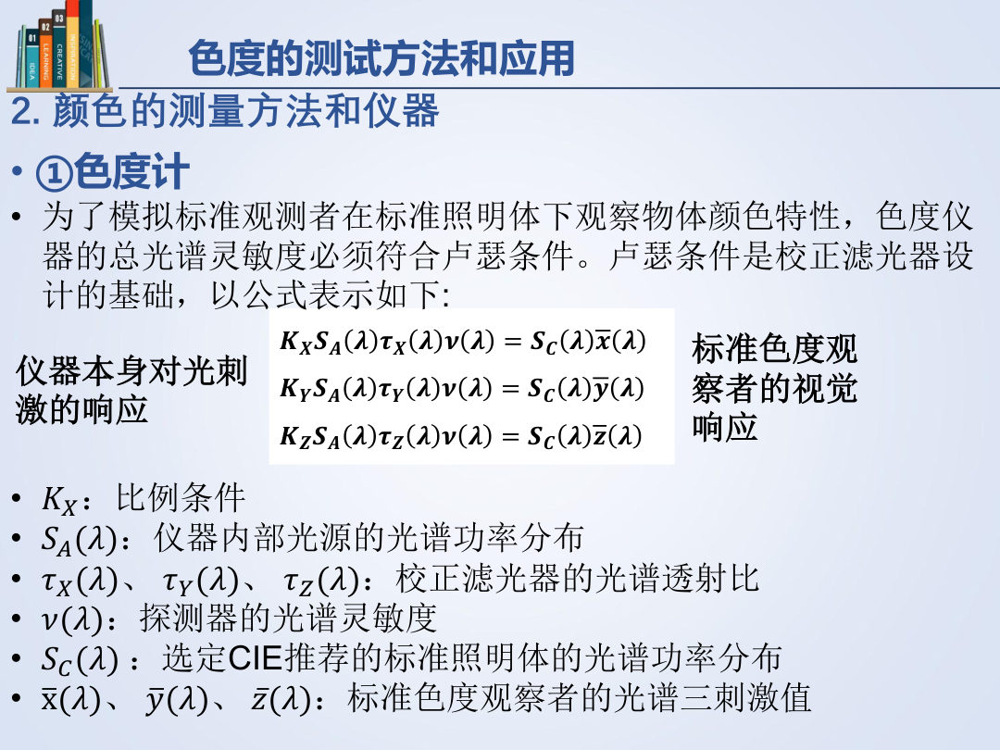

### 本页文字

```text
色度的测试方法和应用
2. 颜色的测量方法和仪器
• ①色度计
• 为了模拟标准观测者在标准照明体下观察物体颜色特性，色度仪
 器的总光谱灵敏度必须符合卢瑟条件。卢瑟条件是校正滤光器设
 计的基础，以公式表示如下:
            𝑲𝑿𝑺𝑨𝝀𝝉𝑿𝝀𝝂𝝀= 𝑺𝑪𝝀𝒙𝝀  标准色度观
仪器本身对光刺
            𝑲𝒀𝑺𝑨𝝀𝝉𝒀𝝀𝝂𝝀= 𝑺𝑪𝝀𝒚𝝀  察者的视觉
激的响应
                    响应            𝑲𝒁𝑺𝑨𝝀𝝉𝒁𝝀𝝂𝝀= 𝑺𝑪𝝀𝒛𝝀

• 𝐾𝑋：比例条件
• 𝑆𝐴(𝜆)：仪器内部光源的光谱功率分布
• 𝜏𝑋(𝜆)、𝜏𝑌(𝜆)、 𝜏𝑍(𝜆)：校正滤光器的光谱透射比
• 𝜈(𝜆)：探测器的光谱灵敏度
•   ：选定CIE推荐的标准照明体的光谱功率分布  𝑆𝐶(𝜆)
• തx(𝜆)、 ത𝑦(𝜆)、 ҧ𝑧(𝜆)：标准色度观察者的光谱三刺激值
```

## 第 106 页

**页面标题/首行：** 色度的测试方法和应用

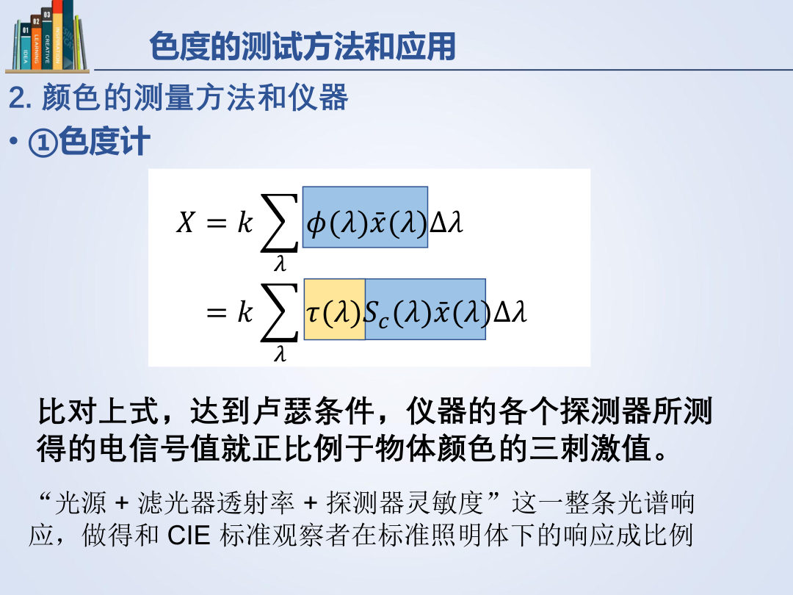

### 本页文字

```text
色度的测试方法和应用

2. 颜色的测量方法和仪器
• ①色度计

      𝑋= 𝑘෍ 𝜙(𝜆) lj𝑥(𝜆)Δ𝜆

                    𝜆

         = 𝑘෍ 𝜏(𝜆)𝑆𝑐(𝜆) lj𝑥(𝜆)Δ𝜆
                    𝜆

 比对上式，达到卢瑟条件，仪器的各个探测器所测
 得的电信号值就正比例于物体颜色的三刺激值。

 “光源 + 滤光器透射率 + 探测器灵敏度”这一整条光谱响
 应，做得和 CIE 标准观察者在标准照明体下的响应成比例
```

## 第 107 页

**页面标题/首行：** 色度的测试方法和应用

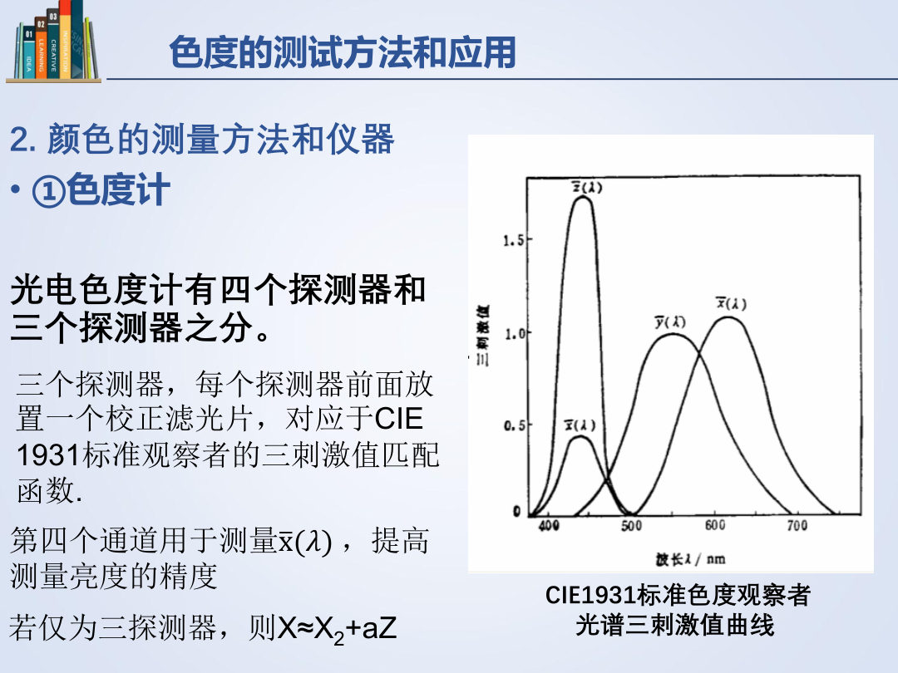

### 本页文字

```text
色度的测试方法和应用

2. 颜色的测量方法和仪器
• ①色度计

光电色度计有四个探测器和
三个探测器之分。

三个探测器，每个探测器前面放
置一个校正滤光片，对应于CIE
1931标准观察者的三刺激值匹配
函数.

第四个通道用于测量തx(𝜆) ，提高
测量亮度的精度
                            CIE1931标准色度观察者
若仅为三探测器，则X≈X2+aZ       光谱三刺激值曲线
```

## 第 108 页

**页面标题/首行：** 色度的测试方法和应用

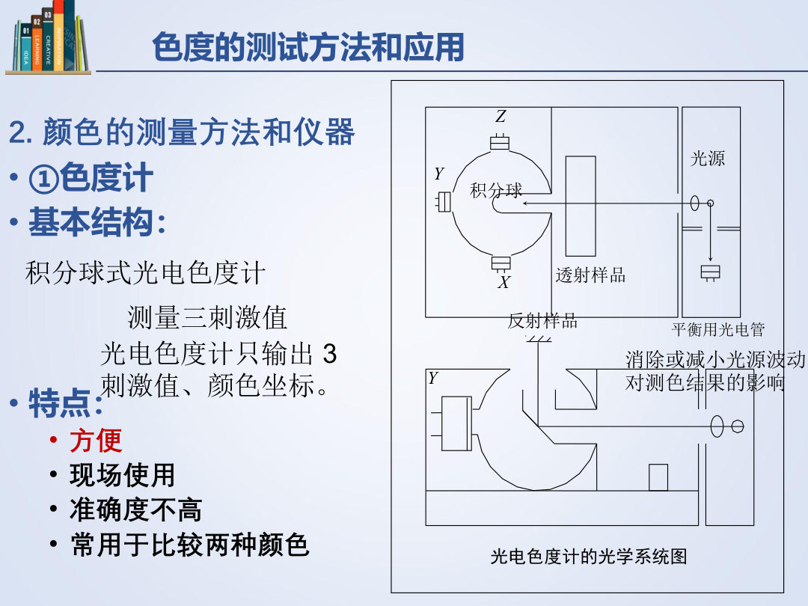

### 本页文字

```text
色度的测试方法和应用

                                                 Z
2. 颜色的测量方法和仪器
                                      光源
                                           Y• ①色度计                          积分球
• 基本结构：

 积分球式光电色度计                透射样品                                             X
    测量三刺激值            反射样品                                          平衡用光电管
   光电色度计只输出 3              消除或减小光源波动
                                          Y   刺激值、颜色坐标。              对测色结果的影响
• 特点：
    • 方便
    • 现场使用
    • 准确度不高
    • 常用于比较两种颜色                           光电色度计的光学系统图
```

## 第 109 页

**页面标题/首行：** Advanced Materials 36.45 (2024): 2409361.


### 本页文字

```text
114
Advanced Materials 36.45 (2024): 2409361.
```

## 第 110 页

**页面标题/首行：** 色度的测试方法和应用

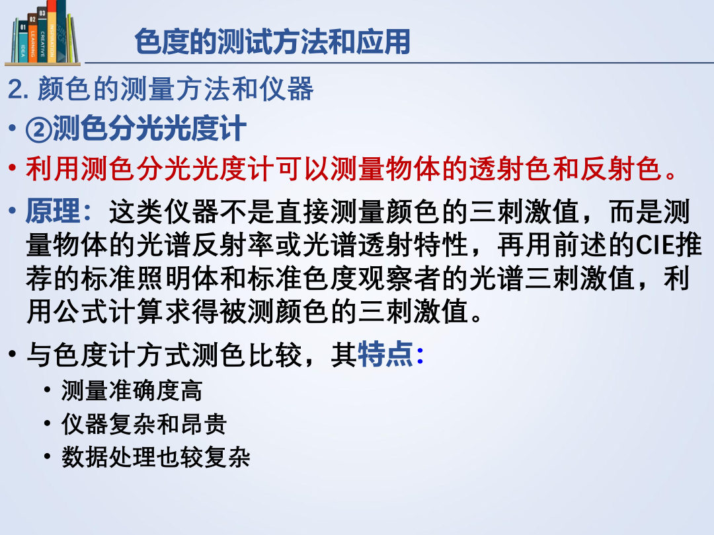

### 本页文字

```text
色度的测试方法和应用

2. 颜色的测量方法和仪器
• ②测色分光光度计
• 利用测色分光光度计可以测量物体的透射色和反射色。
• 原理：这类仪器不是直接测量颜色的三刺激值，而是测
 量物体的光谱反射率或光谱透射特性，再用前述的CIE推
 荐的标准照明体和标准色度观察者的光谱三刺激值，利
 用公式计算求得被测颜色的三刺激值。
• 与色度计方式测色比较，其特点：
    • 测量准确度高
    • 仪器复杂和昂贵
    • 数据处理也较复杂
```

## 第 111 页

**页面标题/首行：** 色度的测试方法和应用

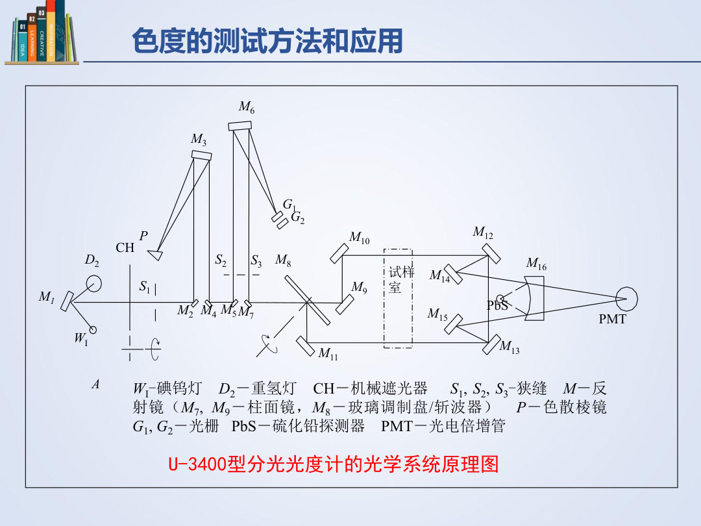

### 本页文字

```text
色度的测试方法和应用

                         M6

                   M3

                                           G1G2
            P                                                M12                                              M10
        CH
      D2                    S2    S3  M8                                  M16
                          试样  M14
                  S1                         M9  室
M1                                                             PbS                 M2 M4 M5M7                         M15                                                            PMT
     WI                                                                    M13                                          M11

      A        WI-碘钨灯 D2－重氢灯 CH－机械遮光器    S1, S2, S3-狭缝 M－反
        射镜（M7, M9－柱面镜，M8－玻璃调制盘/斩波器） P－色散棱镜
              G1, G2－光栅 PbS－硫化铅探测器 PMT－光电倍增管

        U-3400型分光光度计的光学系统原理图
```

## 第 112 页

**页面标题/首行：** 第 112 页

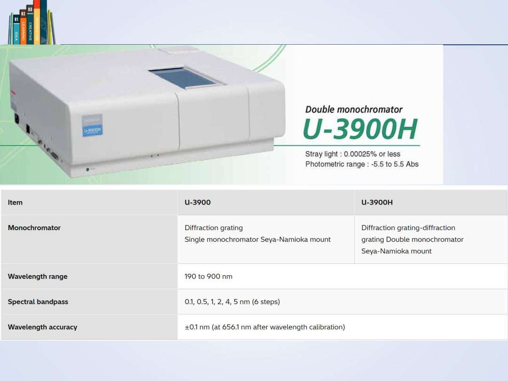

### 本页文字

> 本页未检测到可提取文本，请以页面截图为准。

## 第 113 页

**页面标题/首行：** 多选题 2分

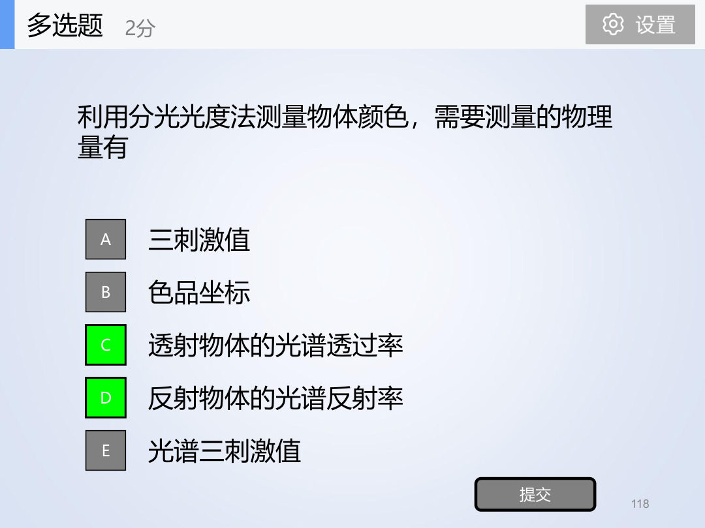

### 本页文字

```text
多选题 2分

  利用分光光度法测量物体颜色，需要测量的物理
  量有

       A     三刺激值

        B     色品坐标

       C     透射物体的光谱透过率

      D     反射物体的光谱反射率

         E     光谱三刺激值

                                提交                                                                                                118
```

## 第 114 页

**页面标题/首行：** 色度的测试方法和应用

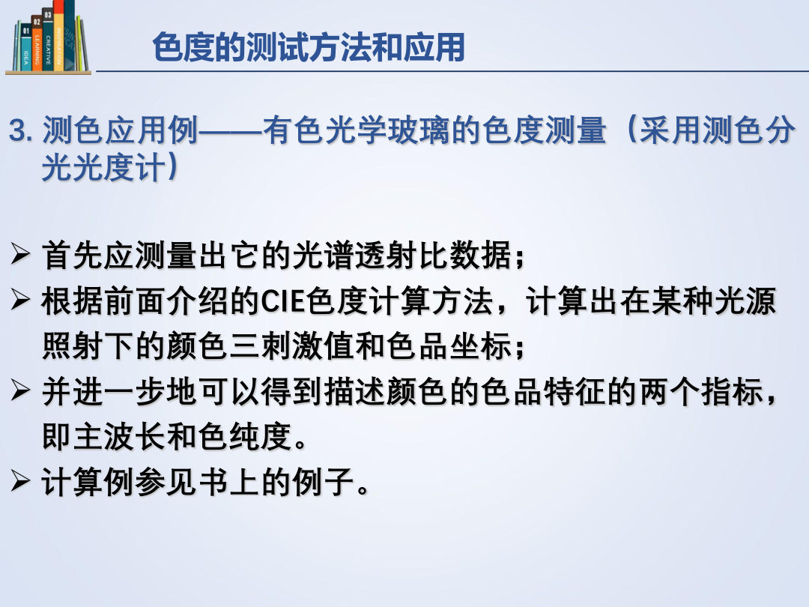

### 本页文字

```text
色度的测试方法和应用

3. 测色应用例——有色光学玻璃的色度测量（采用测色分
 光光度计）

➢首先应测量出它的光谱透射比数据；
➢根据前面介绍的CIE色度计算方法，计算出在某种光源
 照射下的颜色三刺激值和色品坐标；
➢并进一步地可以得到描述颜色的色品特征的两个指标，
 即主波长和色纯度。
➢计算例参见书上的例子。
```

## 第 115 页

**页面标题/首行：** 色度的测试方法和应用

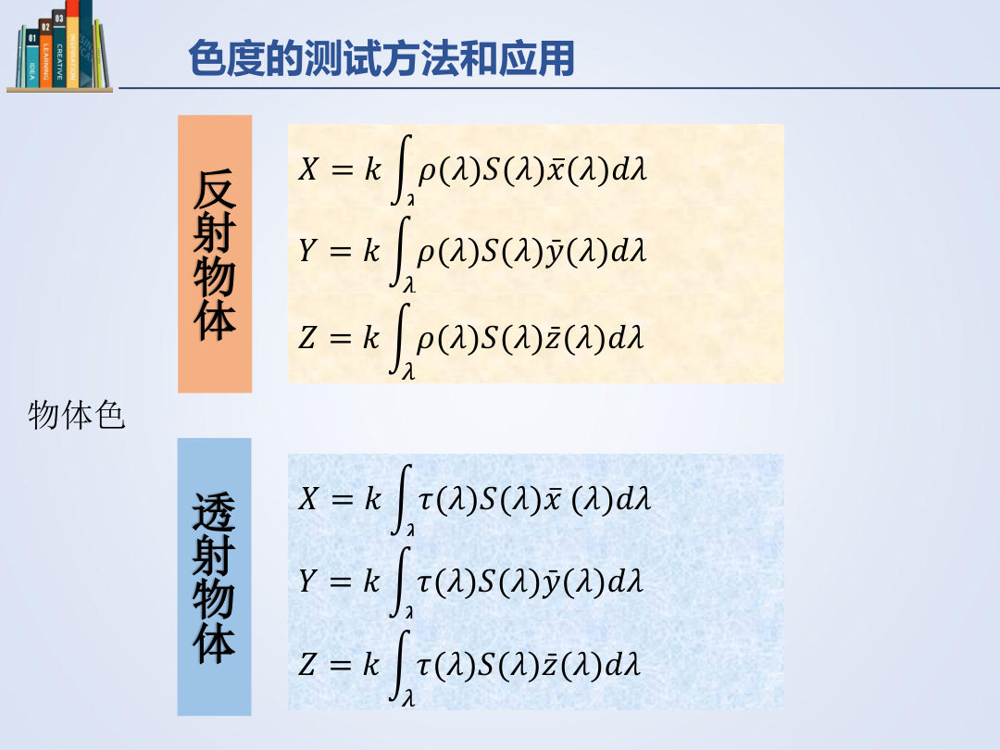

### 本页文字

```text
色度的测试方法和应用

                                                                                                                                                                                                                                                                                                                                                       cap X equals k integral over lambda of , rho open paren lambda close paren cap S open paren lambda close paren x bar open paren lambda close paren d lambda end integral

          𝑋= 𝑘න 𝜌(𝜆)𝑆(𝜆) ҧ𝑥(𝜆)𝑑𝜆
    反                                                                              cap Y equals k integral over lambda of , rho open paren lambda close paren cap S open paren lambda close paren y open paren lambda close paren d lambda end𝜆integral
    射          𝑌= 𝑘න 𝜌(𝜆)𝑆(𝜆) lj𝑦(𝜆)𝑑𝜆
    物                                                                              cap Z equals k integral over lambda of , rho open paren lambda close paren cap S open paren lambda close paren z open paren lambda close paren d lambda end𝜆integral
    体          𝑍= 𝑘න 𝜌(𝜆)𝑆(𝜆) lj𝑧(𝜆)𝑑𝜆
                          𝜆
物体色

                                                                                                                                                                                                                                                                                                                                                       cap X equals k integral over lambda of , tau open paren lambda close paren cap S open paren lambda close paren x bar , , open paren lambda close paren d lambda end integral

          𝑋= 𝑘න 𝜏(𝜆)𝑆(𝜆) ҧ𝑥 (𝜆)𝑑𝜆    透
                                                                                                                                                                                                                                                                                                                                                       cap Y equals k integral over lambda of , tau open paren lambda close paren cap S open paren lambda close paren y open paren lambda close paren d lambda end𝜆integral
    射
          𝑌= 𝑘න 𝜏(𝜆)𝑆(𝜆)lj𝑦(𝜆)𝑑𝜆
    物                                                                                                                                                                                                                                                                                                                                                       cap Z equals k integral over lambda of , tau open paren lambda close paren cap S open paren lambda close paren z open paren lambda close paren d lambda end𝜆integral
    体
          𝑍= 𝑘න 𝜏(𝜆)𝑆(𝜆) lj𝑧(𝜆)𝑑𝜆
                          𝜆
```

## 第 116 页

**页面标题/首行：** 色度的测试方法和应用

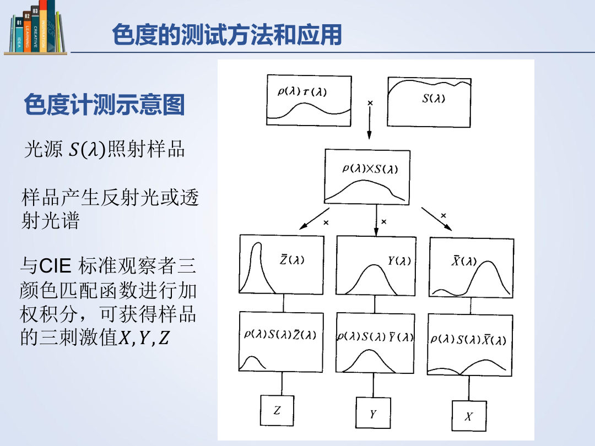

### 本页文字

```text
色度的测试方法和应用

色度计测示意图

光源 𝑆𝜆照射样品

样品产生反射光或透
射光谱

与CIE 标准观察者三
颜色匹配函数进行加
权积分，可获得样品
的三刺激值𝑋, 𝑌, 𝑍
```

## 第 117 页

**页面标题/首行：** 色度的测试方法和应用

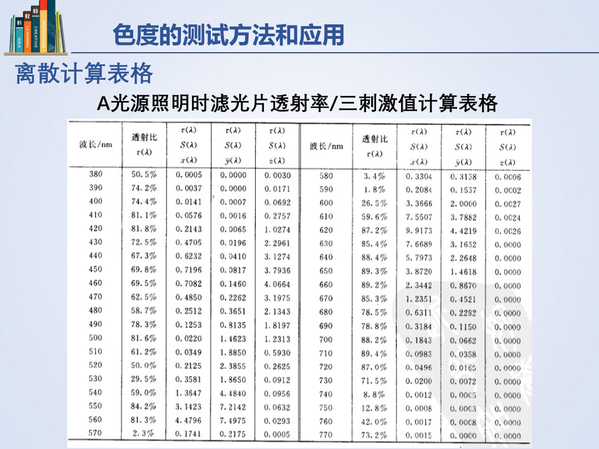

### 本页文字

```text
色度的测试方法和应用

离散计算表格
    A光源照明时滤光片透射率/三刺激值计算表格
```

## 第 118 页

**页面标题/首行：** 色度的测试方法和应用

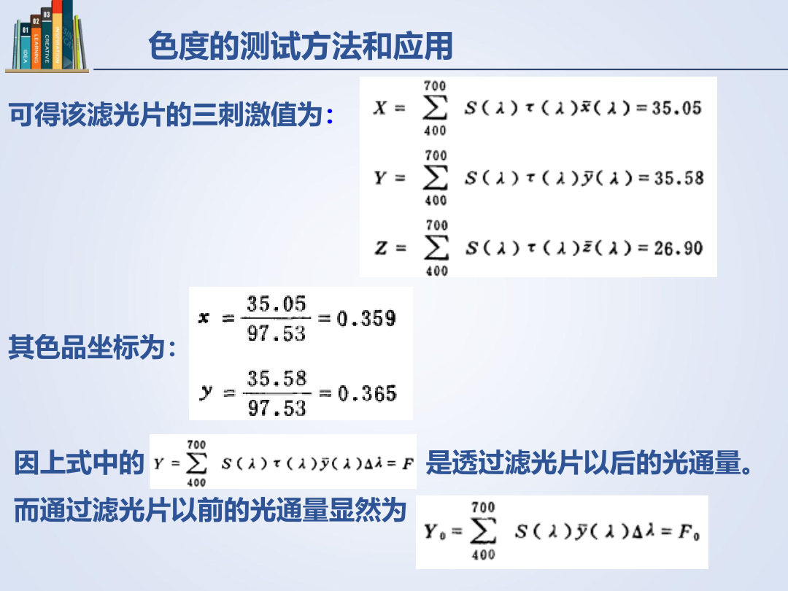

### 本页文字

```text
色度的测试方法和应用

可得该滤光片的三刺激值为：

其色品坐标为：

因上式中的           是透过滤光片以后的光通量。
而通过滤光片以前的光通量显然为
```

## 第 119 页

**页面标题/首行：** 色度的测试方法和应用

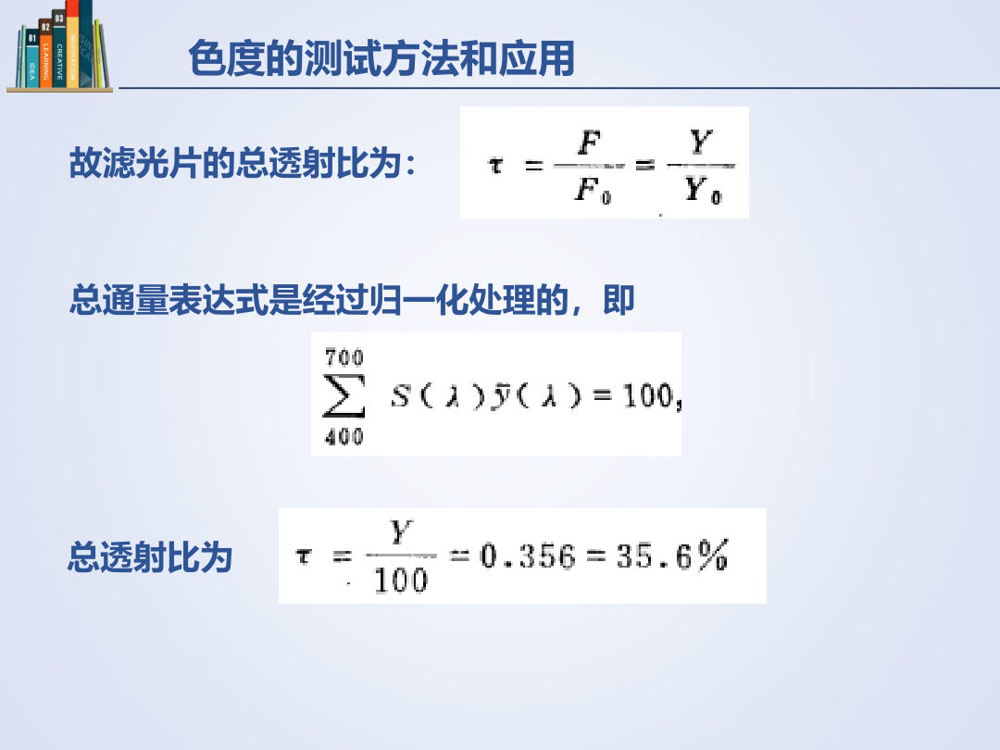

### 本页文字

```text
色度的测试方法和应用

故滤光片的总透射比为：

总通量表达式是经过归一化处理的，即

总透射比为
```

## 第 120 页

**页面标题/首行：** 光学系统透过率测试技术

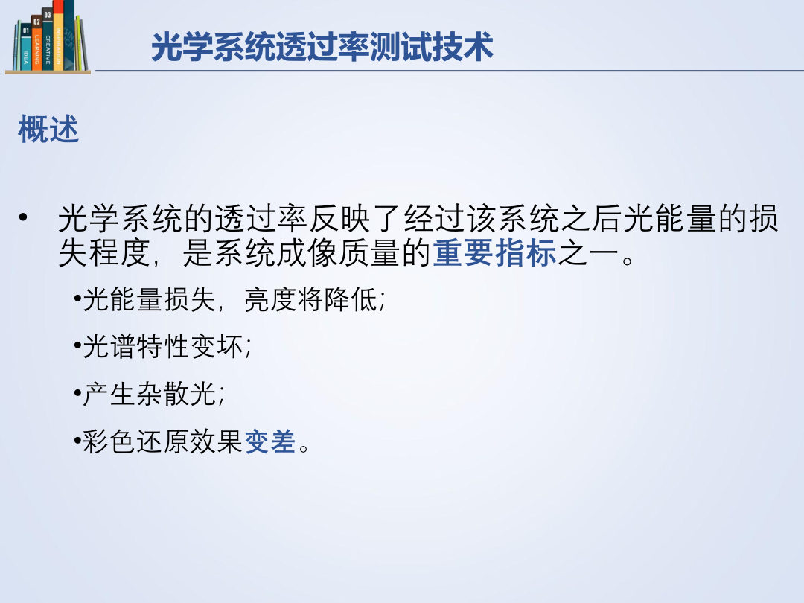

### 本页文字

```text
光学系统透过率测试技术

概述

• 光学系统的透过率反映了经过该系统之后光能量的损
 失程度，是系统成像质量的重要指标之一。
  •光能量损失，亮度将降低；

  •光谱特性变坏；

  •产生杂散光；

  •彩色还原效果变差。
```

## 第 121 页

**页面标题/首行：** 光学系统透过率测试技术

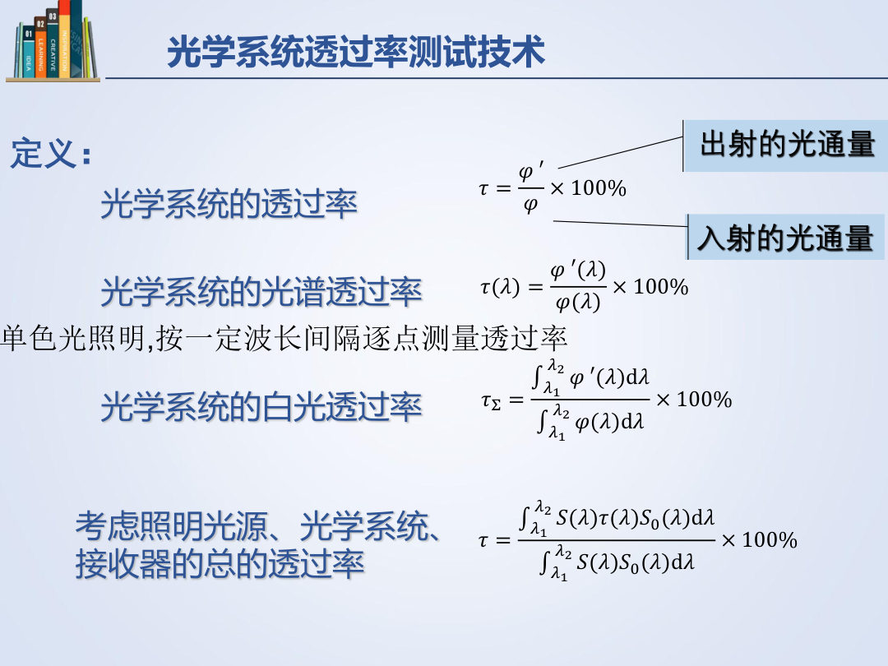

### 本页文字

```text
光学系统透过率测试技术

                        出射的光通量定义：                                   𝜑 ′
   光学系统的透过率       𝜏= 𝜑× 100%
                        入射的光通量
                                     𝜑 ′(𝜆)
                                               𝜏(𝜆) =    × 100%   光学系统的光谱透过率            𝜑(𝜆)
单色光照明,按一定波长间隔逐点测量透过率
                                                               𝜆2
                                         ׬  𝜑 ′(𝜆)d𝜆                                                               𝜆1
                                                𝜏Σ =        × 100%                                                                𝜆2   光学系统的白光透过率                                         ׬  𝜑(𝜆)d𝜆                                                               𝜆1

                                                              𝜆2
                                        ׬  𝑆(𝜆)𝜏(𝜆)𝑆0(𝜆)d𝜆                                                             𝜆1  考虑照明光源、光学系统、                             𝜏=             × 100%
                                                                𝜆2
                                          ׬  𝑆(𝜆)𝑆0(𝜆)d𝜆  接收器的总的透过率                     𝜆1
```

## 第 122 页

**页面标题/首行：** 光学系统透过率测试技术

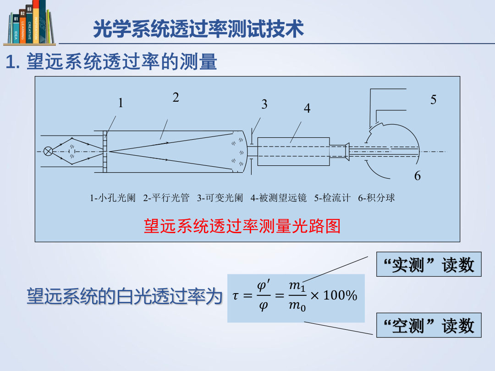

### 本页文字

```text
光学系统透过率测试技术

1. 望远系统透过率的测量

                        2                                                              5                1                    3                                           4

                                                           6

           1-小孔光阑 2-平行光管 3-可变光阑 4-被测望远镜 5-检流计 6-积分球

        望远系统透过率测量光路图

                         “实测”读数
                                      𝜑′  𝑚1
                      𝜏=      × 100% 望远系统的白光透过率为                    𝜑= 𝑚0
                         “空测”读数
```

## 第 123 页

**页面标题/首行：** 光学系统透过率测试技术

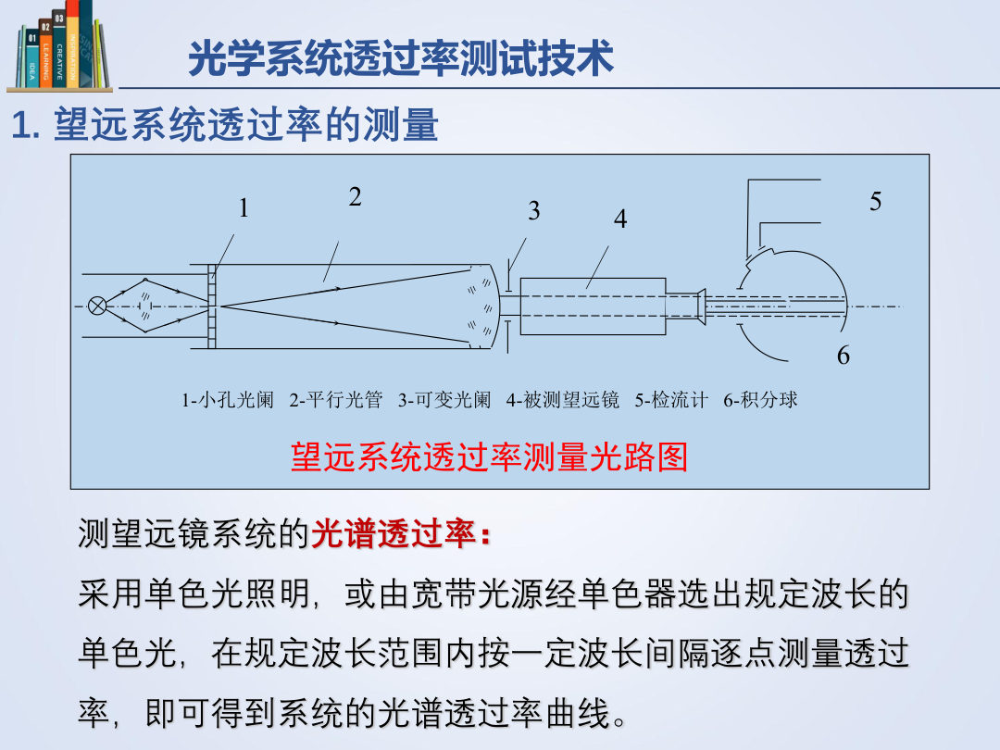

### 本页文字

```text
光学系统透过率测试技术

1. 望远系统透过率的测量

                        2                                                              5                1                    3                                           4

                                                           6

           1-小孔光阑 2-平行光管 3-可变光阑 4-被测望远镜 5-检流计 6-积分球

        望远系统透过率测量光路图

  测望远镜系统的光谱透过率：

  采用单色光照明，或由宽带光源经单色器选出规定波长的

  单色光，在规定波长范围内按一定波长间隔逐点测量透过

  率，即可得到系统的光谱透过率曲线。
```

## 第 124 页

**页面标题/首行：** 光学系统透过率测试技术

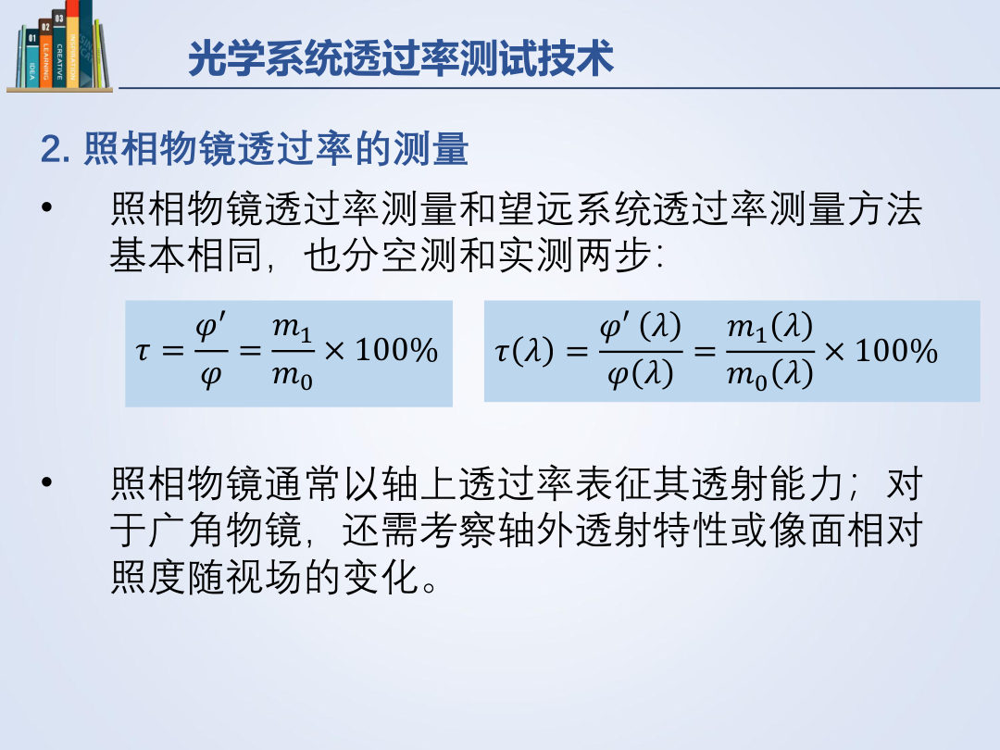

### 本页文字

```text
光学系统透过率测试技术

2. 照相物镜透过率的测量
• 照相物镜透过率测量和望远系统透过率测量方法
  基本相同，也分空测和实测两步：

          𝜑′                        𝜑′ 𝜆       𝜆           𝑚1                    𝑚1
            × 100%  𝜏𝜆=                          =    𝜏= 𝜑=                     𝜑𝜆                        𝜆× 100%           𝑚0                                 𝑚0

• 照相物镜通常以轴上透过率表征其透射能力；对
  于广角物镜，还需考察轴外透射特性或像面相对
  照度随视场的变化。
```

## 第 125 页

**页面标题/首行：** 光学系统透过率测试技术

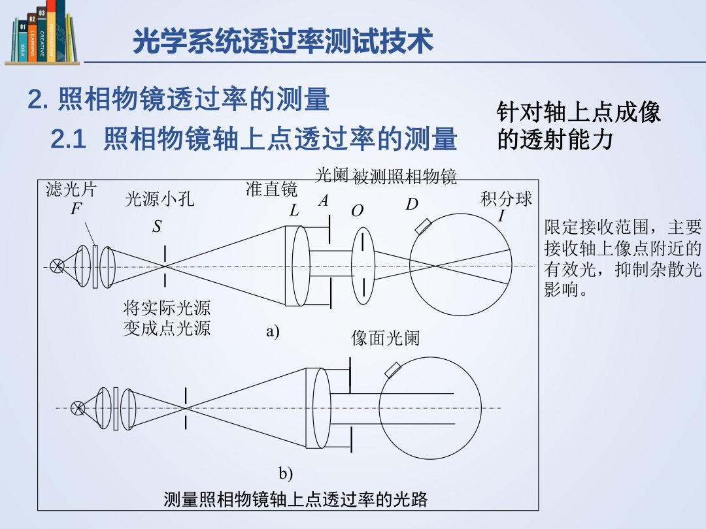

### 本页文字

```text
光学系统透过率测试技术

2. 照相物镜透过率的测量                    针对轴上点成像
  2.1 照相物镜轴上点透过率的测量  的透射能力

                光阑 被测照相物镜
 滤光片        准直镜
      光源小孔           A         积分球                              D    F                     L    O                                                                                I
              S                      限定接收范围，主要
                             接收轴上像点附近的
                             有效光，抑制杂散光
                             影响。
     将实际光源
     变成点光源        a)                  像面光阑

                                  b)
        测量照相物镜轴上点透过率的光路
```

## 第 126 页

**页面标题/首行：** 光学系统透过率测试技术

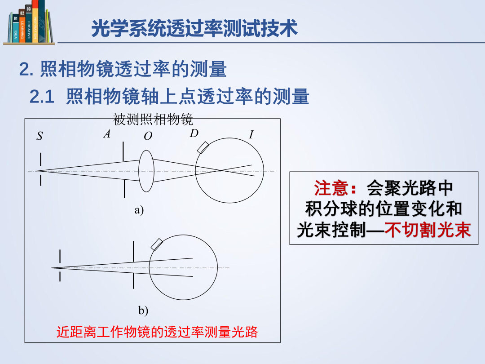

### 本页文字

```text
光学系统透过率测试技术

2. 照相物镜透过率的测量
 2.1 照相物镜轴上点透过率的测量
       被测照相物镜
           A                    D             I   S              O

                 注意：会聚光路中
                        a)         积分球的位置变化和
                光束控制—不切割光束

                        b)

   近距离工作物镜的透过率测量光路
```

## 第 127 页

**页面标题/首行：** 光学系统透过率测试技术

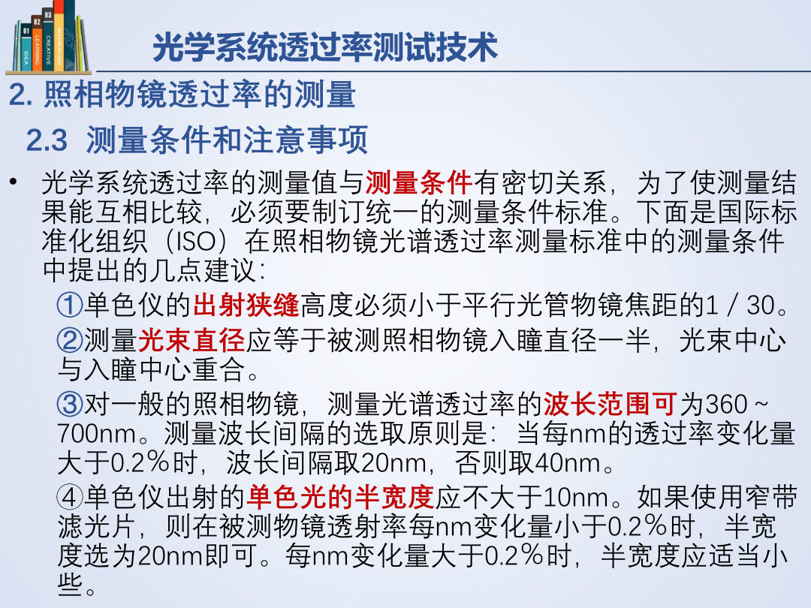

### 本页文字

```text
光学系统透过率测试技术
2. 照相物镜透过率的测量
 2.3 测量条件和注意事项
• 光学系统透过率的测量值与测量条件有密切关系，为了使测量结
 果能互相比较，必须要制订统一的测量条件标准。下面是国际标
 准化组织（ISO）在照相物镜光谱透过率测量标准中的测量条件
 中提出的几点建议：
  ①单色仪的出射狭缝高度必须小于平行光管物镜焦距的1／30。
  ②测量光束直径应等于被测照相物镜入瞳直径一半，光束中心
  与入瞳中心重合。
  ③对一般的照相物镜，测量光谱透过率的波长范围可为360～
  700nm。测量波长间隔的选取原则是：当每nm的透过率变化量
  大于0.2％时，波长间隔取20nm，否则取40nm。
  ④单色仪出射的单色光的半宽度应不大于10nm。如果使用窄带
  滤光片，则在被测物镜透射率每nm变化量小于0.2％时，半宽
  度选为20nm即可。每nm变化量大于0.2％时，半宽度应适当小
  些。
```

## 第 128 页

**页面标题/首行：** 光学系统透过率测试技术

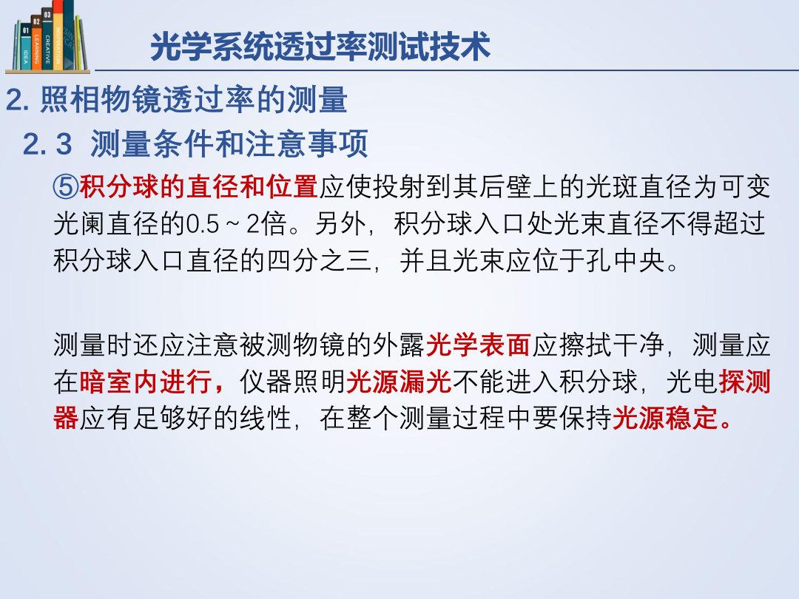

### 本页文字

```text
光学系统透过率测试技术

2. 照相物镜透过率的测量
 2. 3 测量条件和注意事项
  ⑤积分球的直径和位置应使投射到其后壁上的光斑直径为可变
  光阑直径的0.5～2倍。另外，积分球入口处光束直径不得超过
  积分球入口直径的四分之三，并且光束应位于孔中央。

  测量时还应注意被测物镜的外露光学表面应擦拭干净，测量应
  在暗室内进行，仪器照明光源漏光不能进入积分球，光电探测
  器应有足够好的线性，在整个测量过程中要保持光源稳定。
```

## 第 129 页

**页面标题/首行：** Page 50  1.1和1.6

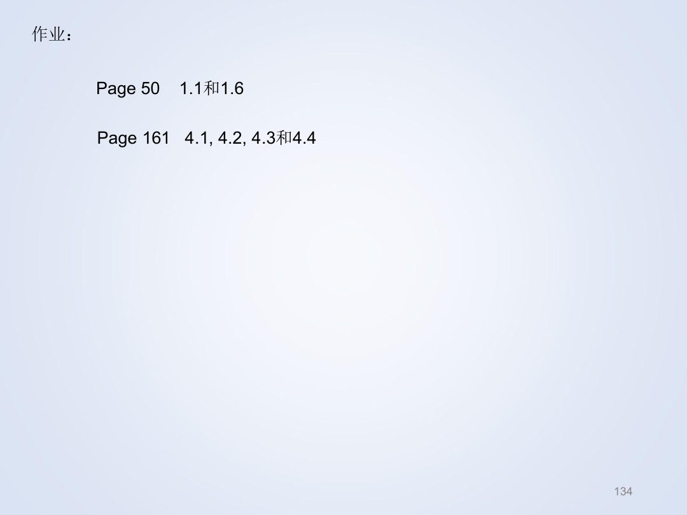

### 本页文字

```text
作业：

      Page 50  1.1和1.6

       Page 161  4.1, 4.2, 4.3和4.4

                                                                                           134
```
