# 第五章 激光测试技术

- 源文件：`第五章 激光测试技术.pdf`
- 页数：84
- 转换方式：每页保留原始页面截图，并提取 PDF 文本层作为可检索内容。
- 说明：公式、复杂图形、版式细节以页面截图为准；文字区用于搜索和快速复习。

## 页面索引

- [第 1 页：广州大学](#第-1-页)
- [第 2 页：激光概述](#第-2-页)
- [第 3 页：• 1960年由Maiman研制成功世界上第一台红](#第-3-页)
- [第 4 页：激光概述](#第-4-页)
- [第 5 页：激光概述](#第-5-页)
- [第 6 页：激光概述](#第-6-页)
- [第 7 页：激光概述](#第-7-页)
- [第 8 页：激光概述](#第-8-页)
- [第 9 页：激光概述](#第-9-页)
- [第 10 页：激光概述](#第-10-页)
- [第 11 页：激光概述](#第-11-页)
- [第 12 页：激光概述](#第-12-页)
- [第 13 页：激光概述](#第-13-页)
- [第 14 页：可调谐染料激光器结构](#第-14-页)
- [第 15 页：激光概述](#第-15-页)
- [第 16 页：激光概述](#第-16-页)
- [第 17 页：激光概述](#第-17-页)
- [第 18 页：激光概述](#第-18-页)
- [第 19 页：激光概述](#第-19-页)
- [第 20 页：激光概述](#第-20-页)
- [第 21 页：激光概述](#第-21-页)
- [第 22 页：激光概述](#第-22-页)
- [第 23 页：激光概述](#第-23-页)
- [第 24 页：单选题 1分](#第-24-页)
- [第 25 页：激光准直技术及应用](#第-25-页)
- [第 26 页：激光准直技术及应用](#第-26-页)
- [第 27 页：激光准直技术及应用](#第-27-页)
- [第 28 页：方形菲涅尔波带片与照度分布](#第-28-页)
- [第 29 页：空间聚焦演化：利用焦点位置判断准直状态](#第-29-页)
- [第 30 页：激光准直技术及应用](#第-30-页)
- [第 31 页：激光准直技术及应用](#第-31-页)
- [第 32 页：激光准直技术及应用](#第-32-页)
- [第 33 页：单选题 1分](#第-33-页)
- [第 34 页：激光准直技术及应用](#第-34-页)
- [第 35 页：激光准直技术及应用](#第-35-页)
- [第 36 页：激光准直技术及应用](#第-36-页)
- [第 37 页：激光准直技术及应用](#第-37-页)
- [第 38 页：激光准直技术及应用](#第-38-页)
- [第 39 页：激光准直技术及应用](#第-39-页)
- [第 40 页：激光准直技术及应用](#第-40-页)
- [第 41 页：多选题 1分](#第-41-页)
- [第 42 页：激光测距技术](#第-42-页)
- [第 43 页：激光测距技术](#第-43-页)
- [第 44 页：激光测距技术](#第-44-页)
- [第 45 页：激光测距技术](#第-45-页)
- [第 46 页：激光测距技术](#第-46-页)
- [第 47 页：激光测距技术](#第-47-页)
- [第 48 页：激光测距技术](#第-48-页)
- [第 49 页：激光测距技术](#第-49-页)
- [第 50 页：激光测距技术](#第-50-页)
- [第 51 页：激光测距技术](#第-51-页)
- [第 52 页：激光测距技术](#第-52-页)
- [第 53 页：130 (2023)](#第-53-页)
- [第 54 页：激光测距技术](#第-54-页)
- [第 55 页：激光测距技术](#第-55-页)
- [第 56 页：激光测距技术](#第-56-页)
- [第 57 页：激光测距技术](#第-57-页)
- [第 58 页：激光测距技术](#第-58-页)
- [第 59 页：激光测距技术](#第-59-页)
- [第 60 页：激光测距技术](#第-60-页)
- [第 61 页：激光测距技术](#第-61-页)
- [第 62 页：激光测距技术](#第-62-页)
- [第 63 页：激光测距技术](#第-63-页)
- [第 64 页：单选题 1分](#第-64-页)
- [第 65 页：激光多普勒测速技术](#第-65-页)
- [第 66 页：激光多普勒测速技术](#第-66-页)
- [第 67 页：激光多普勒测速技术](#第-67-页)
- [第 68 页：激光多普勒测速技术](#第-68-页)
- [第 69 页：v2T                  λ'](#第-69-页)
- [第 70 页：激光多普勒测速技术](#第-70-页)
- [第 71 页：激光多普勒测速技术](#第-71-页)
- [第 72 页：y                       y'     激光多普勒测速技术](#第-72-页)
- [第 73 页：y                       y'](#第-73-页)
- [第 74 页：y                       y'](#第-74-页)
- [第 75 页：激光多普勒测速技术](#第-75-页)
- [第 76 页：激光多普勒测速技术](#第-76-页)
- [第 77 页：激光多普勒测速技术](#第-77-页)
- [第 78 页：激光多普勒测速技术](#第-78-页)
- [第 79 页：激光多普勒测速技术](#第-79-页)
- [第 80 页：激光多普勒测速技术](#第-80-页)
- [第 81 页：激光多普勒测速技术](#第-81-页)
- [第 82 页：激光多普勒测速技术](#第-82-页)
- [第 83 页：多选题 1分](#第-83-页)
- [第 84 页：激光多普勒测速技术](#第-84-页)

## 第 1 页

**页面标题/首行：** 广州大学


### 本页文字

```text
广州大学

光电检测技术
     方佳文

    jiawen.fang@gzhu.edu.cn
```

## 第 2 页

**页面标题/首行：** 激光概述

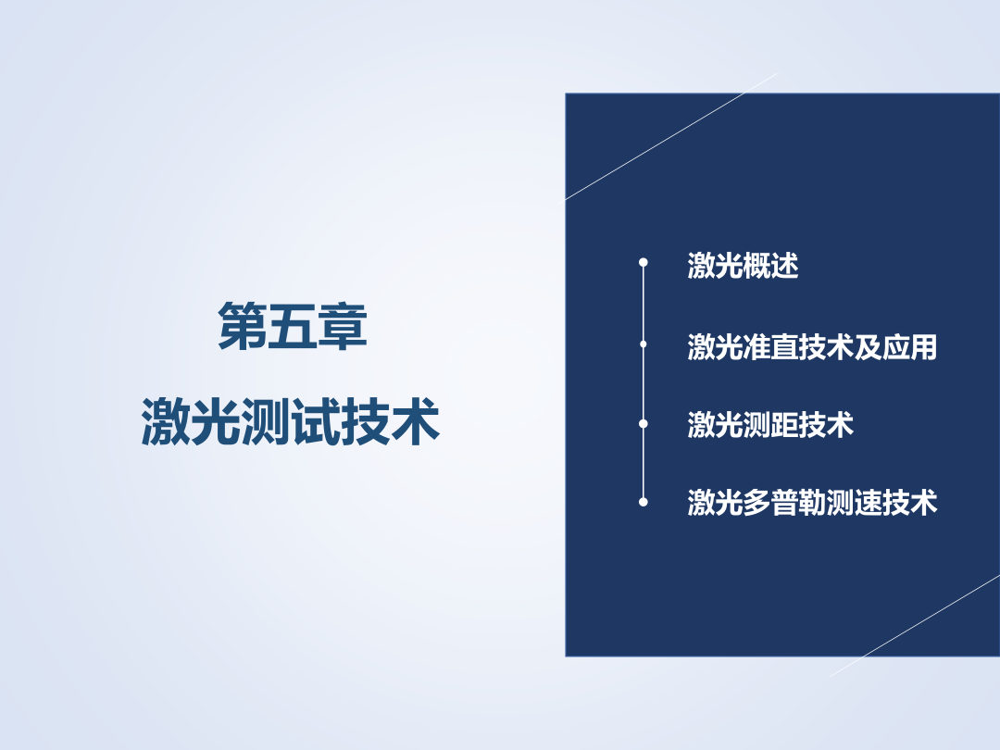

### 本页文字

```text
激光概述
  第五章                    激光准直技术及应用

                    激光测距技术激光测试技术

                    激光多普勒测速技术
```

## 第 3 页

**页面标题/首行：** • 1960年由Maiman研制成功世界上第一台红

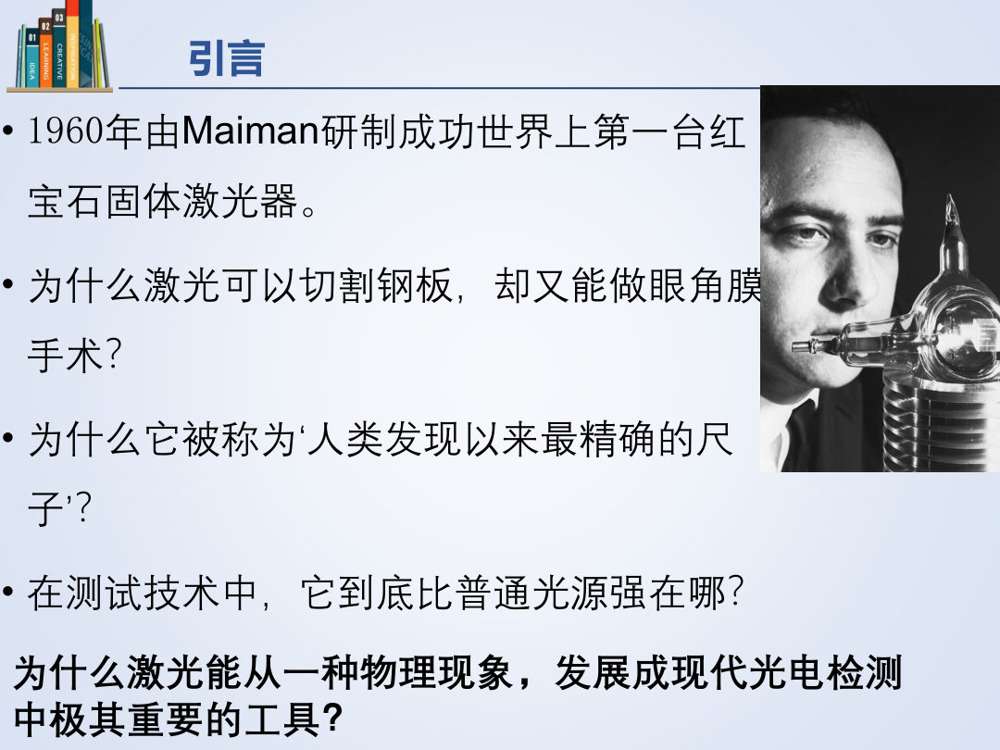

### 本页文字

```text
引言

• 1960年由Maiman研制成功世界上第一台红

 宝石固体激光器。

• 为什么激光可以切割钢板，却又能做眼角膜

 手术？

• 为什么它被称为‘人类发现以来最精确的尺

 子’？

• 在测试技术中，它到底比普通光源强在哪？

为什么激光能从一种物理现象，发展成现代光电检测
中极其重要的工具？
```

## 第 4 页

**页面标题/首行：** 激光概述

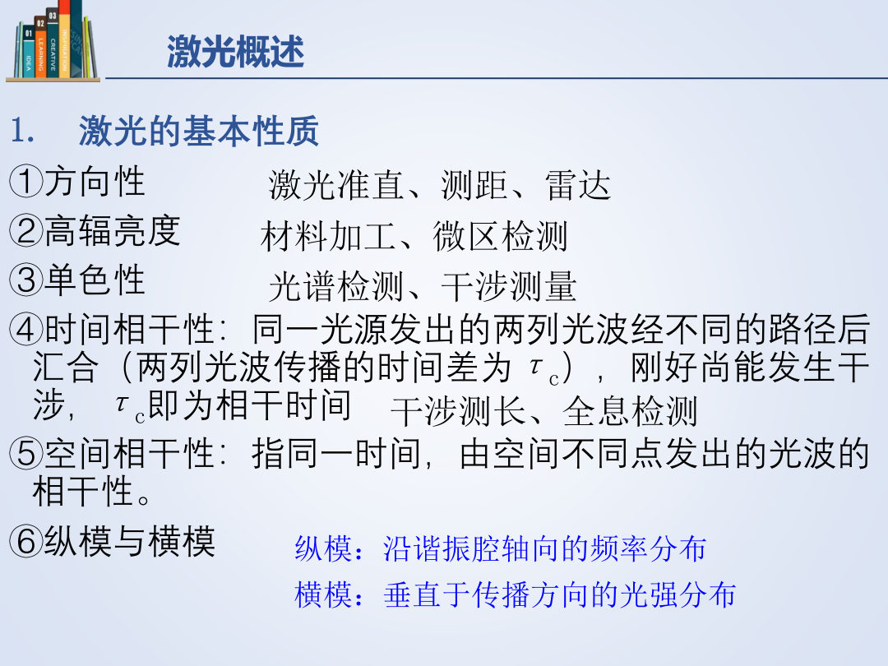

### 本页文字

```text
激光概述

1. 激光的基本性质
①方向性   激光准直、测距、雷达
②高辐亮度       材料加工、微区检测
③单色性       光谱检测、干涉测量
④时间相干性：同一光源发出的两列光波经不同的路径后
 汇合（两列光波传播的时间差为τc），刚好尚能发生干
 涉，τc即为相干时间 干涉测长、全息检测
⑤空间相干性：指同一时间，由空间不同点发出的光波的
 相干性。
⑥纵模与横模   纵模：沿谐振腔轴向的频率分布

          横模：垂直于传播方向的光强分布
```

## 第 5 页

**页面标题/首行：** 激光概述

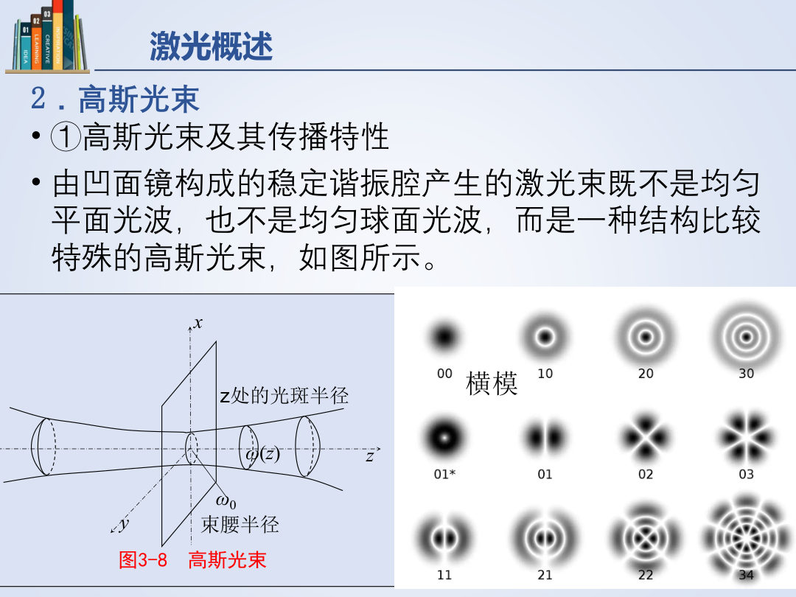

### 本页文字

```text
激光概述

2．高斯光束
• ①高斯光束及其传播特性
• 由凹面镜构成的稳定谐振腔产生的激光束既不是均匀
 平面光波，也不是均匀球面光波，而是一种结构比较
 特殊的高斯光束，如图所示。

                   x

                横模          z处的光斑半径

                         ω(z)           z

                  ω0
          y    束腰半径

       图3-8 高斯光束
```

## 第 6 页

**页面标题/首行：** 激光概述

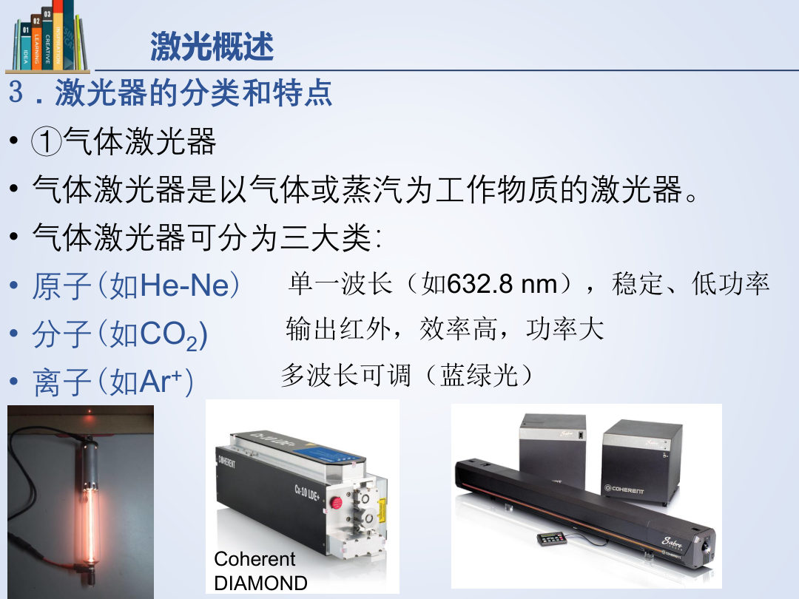

### 本页文字

```text
激光概述
3．激光器的分类和特点
• ①气体激光器
• 气体激光器是以气体或蒸汽为工作物质的激光器。
• 气体激光器可分为三大类：
• 原子(如He-Ne)  单一波长（如632.8 nm），稳定、低功率
• 分子(如CO2)   输出红外，效率高，功率大
• 离子(如Ar+）  多波长可调（蓝绿光）

                    Coherent
               DIAMOND
```

## 第 7 页

**页面标题/首行：** 激光概述

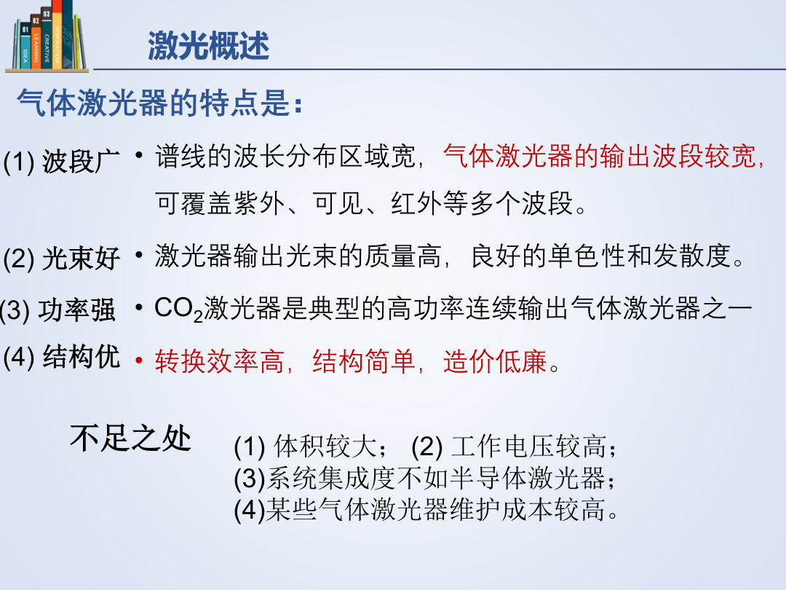

### 本页文字

```text
激光概述

 气体激光器的特点是：

               • 谱线的波长分布区域宽，气体激光器的输出波段较宽，(1) 波段广

      可覆盖紫外、可见、红外等多个波段。

               • 激光器输出光束的质量高，良好的单色性和发散度。(2) 光束好

(3) 功率强  • CO2激光器是典型的高功率连续输出气体激光器之一
(4) 结构优 • 转换效率高，结构简单，造价低廉。

  不足之处                      (1) 体积较大； (2) 工作电压较高；
          (3)系统集成度不如半导体激光器；
          (4)某些气体激光器维护成本较高。
```

## 第 8 页

**页面标题/首行：** 激光概述

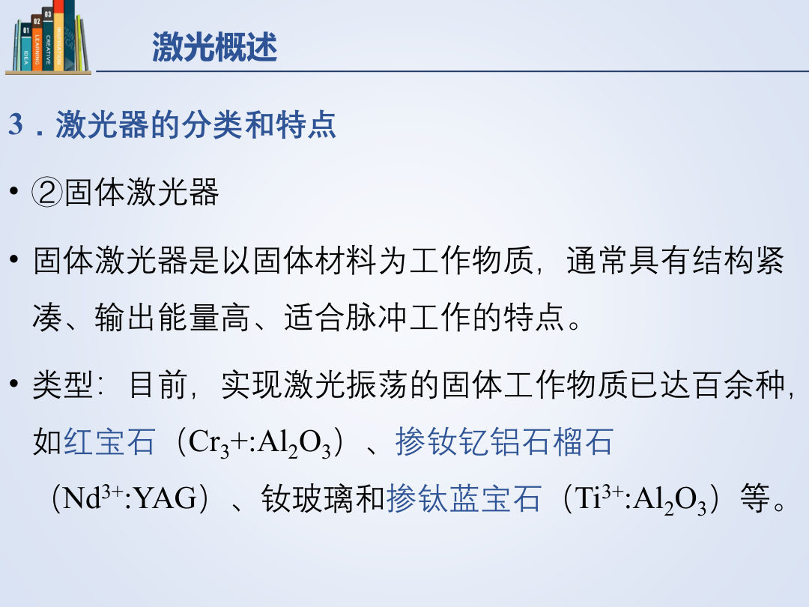

### 本页文字

```text
激光概述

3．激光器的分类和特点

• ②固体激光器

• 固体激光器是以固体材料为工作物质，通常具有结构紧

 凑、输出能量高、适合脉冲工作的特点。

• 类型：目前，实现激光振荡的固体工作物质已达百余种，

 如红宝石（Cr3+:Al2O3）、掺钕钇铝石榴石
 （Nd3+:YAG）、钕玻璃和掺钛蓝宝石（Ti3+:Al2O3）等。
```

## 第 9 页

**页面标题/首行：** 激光概述

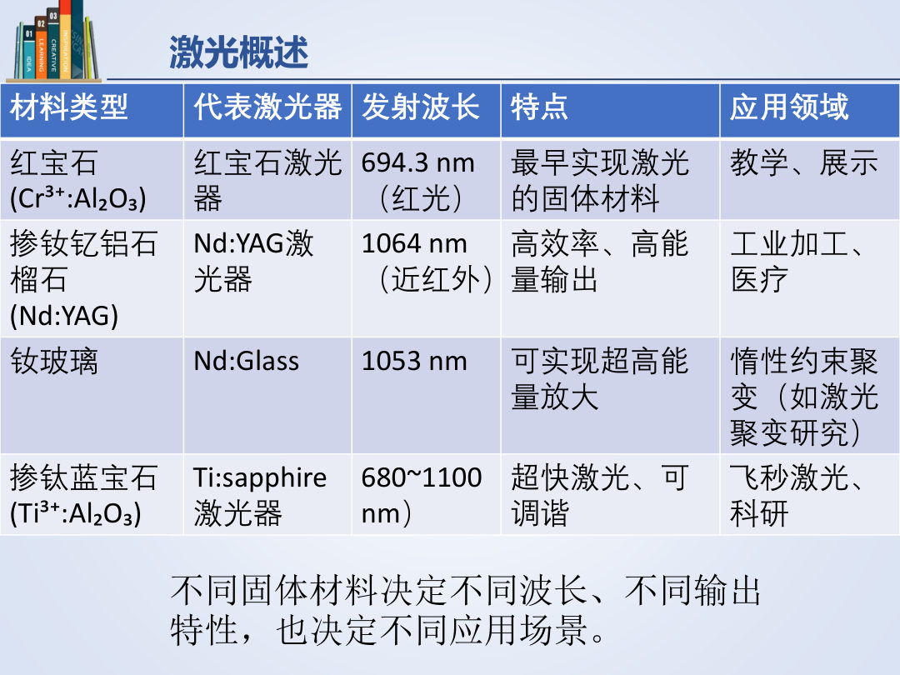

### 本页文字

```text
激光概述

材料类型  代表激光器发射波长 特点     应用领域

红宝石   红宝石激光 694.3 nm 最早实现激光 教学、展示
(Cr³⁺:Al₂O₃)  器     （红光） 的固体材料
掺钕钇铝石  Nd:YAG激   1064 nm 高效率、高能 工业加工、
榴石    光器    （近红外）量输出    医疗
(Nd:YAG)
钕玻璃       Nd:Glass    1053 nm 可实现超高能 惰性约束聚
                 量放大    变（如激光
                        聚变研究）
掺钛蓝宝石   Ti:sapphire  680~1100 超快激光、可 飞秒激光、
(Ti³⁺:Al₂O₃)  激光器   nm）   调谐     科研

     不同固体材料决定不同波长、不同输出
     特性，也决定不同应用场景。
```

## 第 10 页

**页面标题/首行：** 激光概述

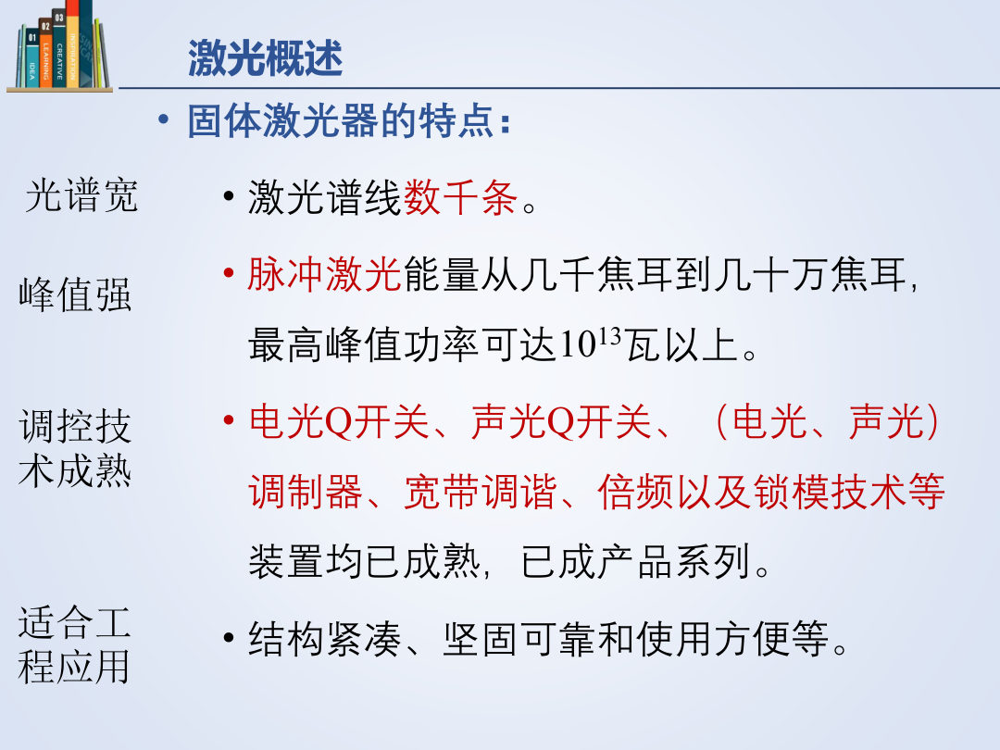

### 本页文字

```text
激光概述
          • 固体激光器的特点：

光谱宽      • 激光谱线数千条。

               • 脉冲激光能量从几千焦耳到几十万焦耳，峰值强
       最高峰值功率可达1013瓦以上。

调控技       • 电光Q开关、声光Q开关、（电光、声光）
术成熟
      调制器、宽带调谐、倍频以及锁模技术等

      装置均已成熟，已成产品系列。

适合工               • 结构紧凑、坚固可靠和使用方便等。
程应用
```

## 第 11 页

**页面标题/首行：** 激光概述

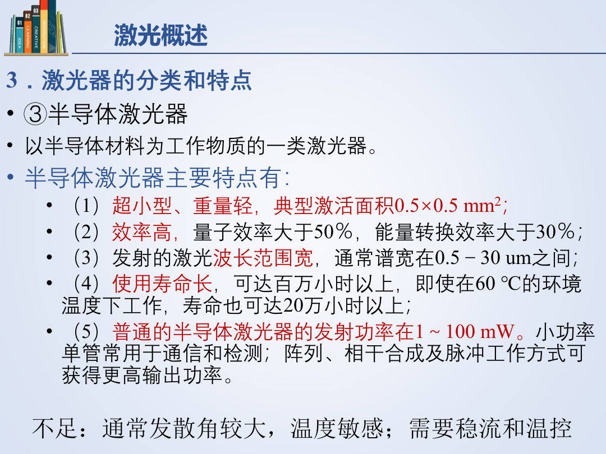

### 本页文字

```text
激光概述

3．激光器的分类和特点
• ③半导体激光器
• 以半导体材料为工作物质的一类激光器。
• 半导体激光器主要特点有：
      • （1）超小型、重量轻，典型激活面积0.5×0.5 mm2；
      • （2）效率高，量子效率大于50％，能量转换效率大于30％；
      • （3）发射的激光波长范围宽，通常谱宽在0.5－30 um之间；
      • （4）使用寿命长，可达百万小时以上，即使在60 ℃的环境
   温度下工作，寿命也可达20万小时以上；
      • （5）普通的半导体激光器的发射功率在1～100 mW。小功率
   单管常用于通信和检测；阵列、相干合成及脉冲工作方式可
   获得更高输出功率。

 不足：通常发散角较大，温度敏感；需要稳流和温控
```

## 第 12 页

**页面标题/首行：** 激光概述

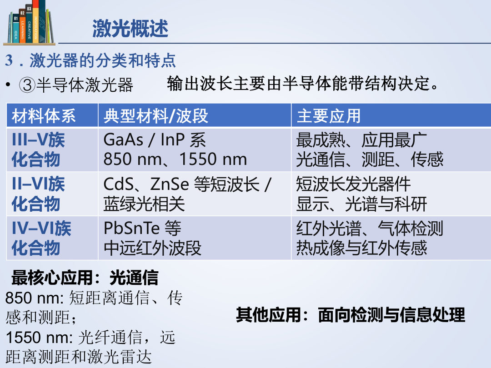

### 本页文字

```text
激光概述

3．激光器的分类和特点
• ③半导体激光器  输出波长主要由半导体能带结构决定。

材料体系  典型材料/波段     主要应用
 III–V族    GaAs / InP 系      最成熟、应用最广
化合物    850 nm、1550 nm   光通信、测距、传感
 II–VI族    CdS、ZnSe 等短波长/  短波长发光器件
化合物   蓝绿光相关       显示、光谱与科研
 IV–VI族   PbSnTe 等       红外光谱、气体检测
化合物   中远红外波段      热成像与红外传感
最核心应用：光通信
850 nm: 短距离通信、传
感和测距；         其他应用：面向检测与信息处理
1550 nm: 光纤通信，远
距离测距和激光雷达
```

## 第 13 页

**页面标题/首行：** 激光概述

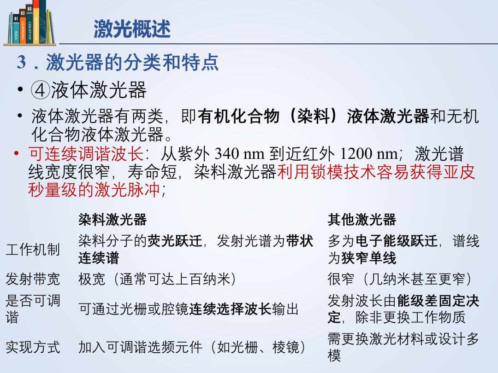

### 本页文字

```text
激光概述
 3．激光器的分类和特点
  • ④液体激光器
  • 液体激光器有两类，即有机化合物（染料）液体激光器和无机
  化合物液体激光器。
 • 可连续调谐波长：从紫外 340 nm 到近红外 1200 nm；激光谱
 线宽度很窄，寿命短，染料激光器利用锁模技术容易获得亚皮
 秒量级的激光脉冲；

     染料激光器             其他激光器
     染料分子的荧光跃迁，发射光谱为带状 多为电子能级跃迁，谱线
工作机制
     连续谱               为狭窄单线
发射带宽 极宽（通常可达上百纳米）      很窄（几纳米甚至更窄）
是否可调                   发射波长由能级差固定决
     可通过光栅或腔镜连续选择波长输出
谐                      定，除非更换工作物质
                       需更换激光材料或设计多
实现方式 加入可调谐选频元件（如光栅、棱镜）
                       模
```

## 第 14 页

**页面标题/首行：** 可调谐染料激光器结构

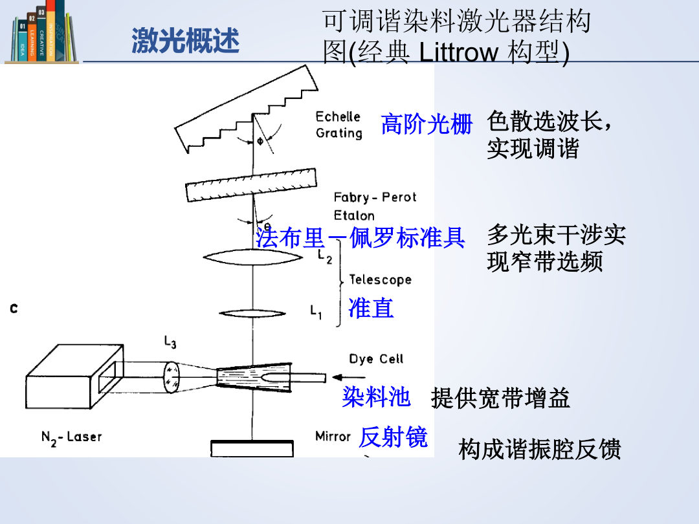

### 本页文字

```text
可调谐染料激光器结构
激光概述        图(经典 Littrow 构型)

           高阶光栅 色散选波长，
               实现调谐

               多光束干涉实     法布里－佩罗标准具
               现窄带选频

         准直

         染料池 提供宽带增益

          反射镜
              构成谐振腔反馈
```

## 第 15 页

**页面标题/首行：** 激光概述

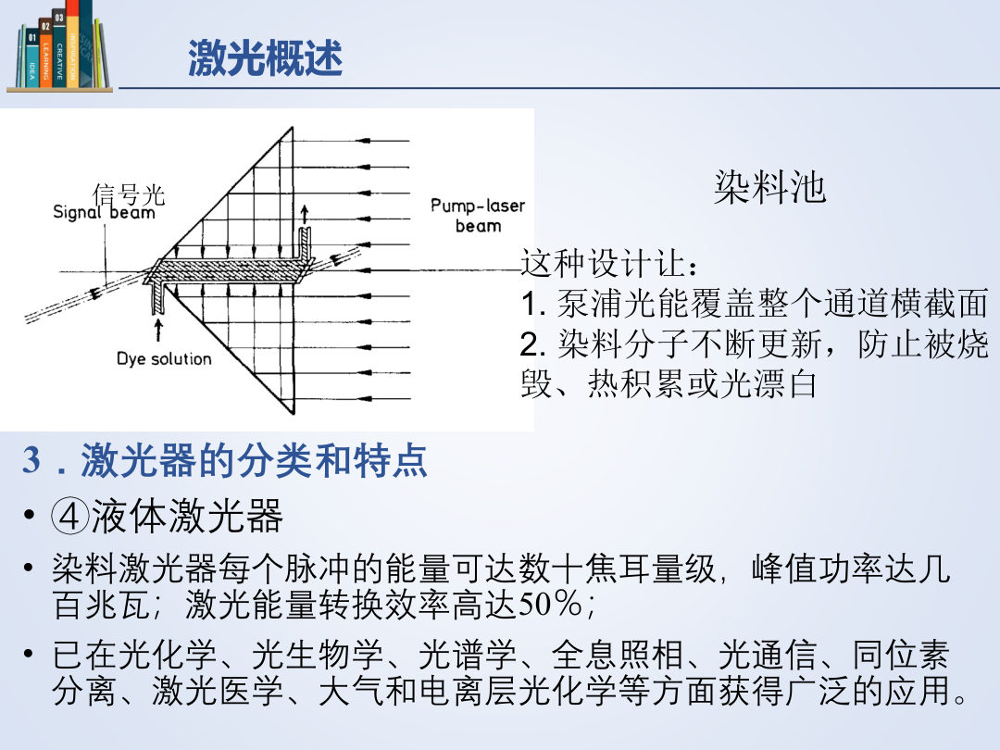

### 本页文字

```text
激光概述

   信号光              染料池

               这种设计让：
                                    1. 泵浦光能覆盖整个通道横截面
                                    2. 染料分子不断更新，防止被烧
               毁、热积累或光漂白

3．激光器的分类和特点
• ④液体激光器
• 染料激光器每个脉冲的能量可达数十焦耳量级，峰值功率达几
 百兆瓦；激光能量转换效率高达50％；
• 已在光化学、光生物学、光谱学、全息照相、光通信、同位素
 分离、激光医学、大气和电离层光化学等方面获得广泛的应用。
```

## 第 16 页

**页面标题/首行：** 激光概述

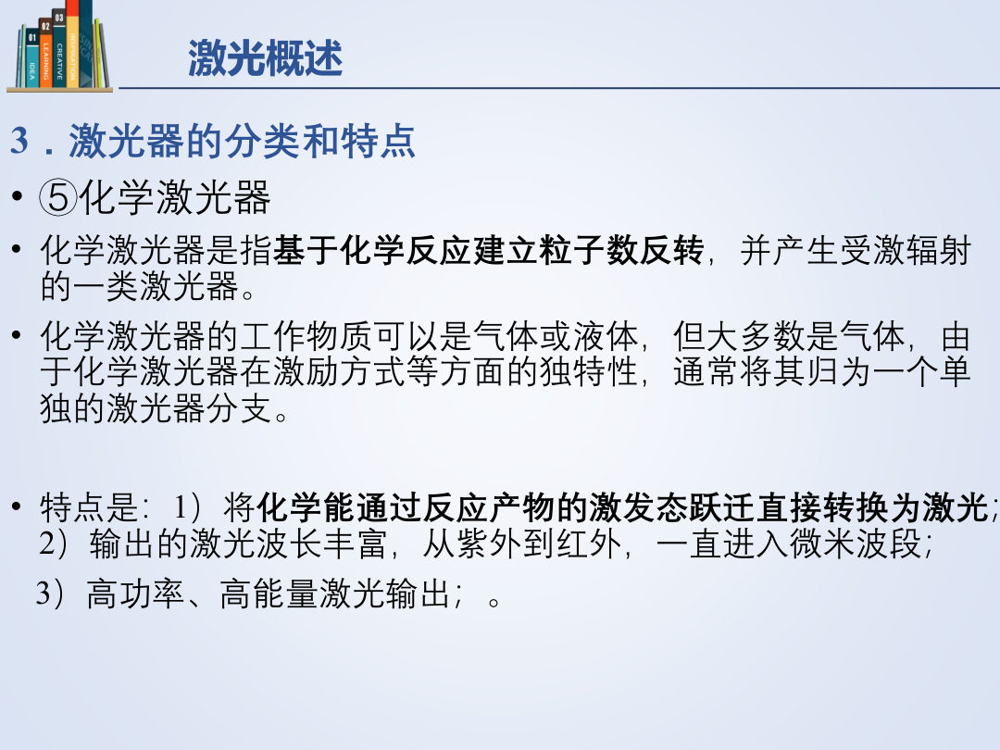

### 本页文字

```text
激光概述

3．激光器的分类和特点
• ⑤化学激光器
• 化学激光器是指基于化学反应建立粒子数反转，并产生受激辐射
 的一类激光器。
• 化学激光器的工作物质可以是气体或液体，但大多数是气体，由
 于化学激光器在激励方式等方面的独特性，通常将其归为一个单
 独的激光器分支。

• 特点是：1）将化学能通过反应产物的激发态跃迁直接转换为激光；
 2）输出的激光波长丰富，从紫外到红外，一直进入微米波段；
 3）高功率、高能量激光输出；。
```

## 第 17 页

**页面标题/首行：** 激光概述

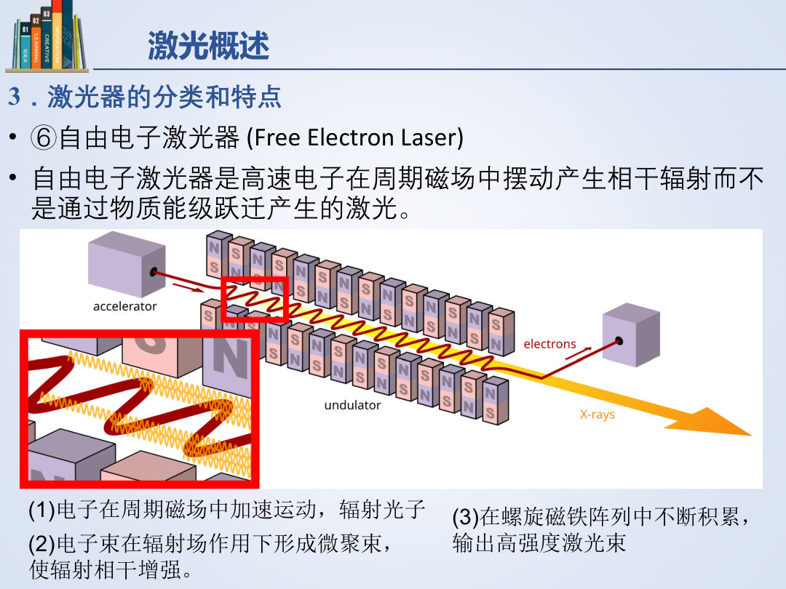

### 本页文字

```text
激光概述

3．激光器的分类和特点
• ⑥自由电子激光器 (Free Electron Laser)
• 自由电子激光器是高速电子在周期磁场中摆动产生相干辐射而不
 是通过物质能级跃迁产生的激光。

 (1)电子在周期磁场中加速运动，辐射光子                       (3)在螺旋磁铁阵列中不断积累，
 (2)电子束在辐射场作用下形成微聚束，  输出高强度激光束
 使辐射相干增强。
```

## 第 18 页

**页面标题/首行：** 激光概述

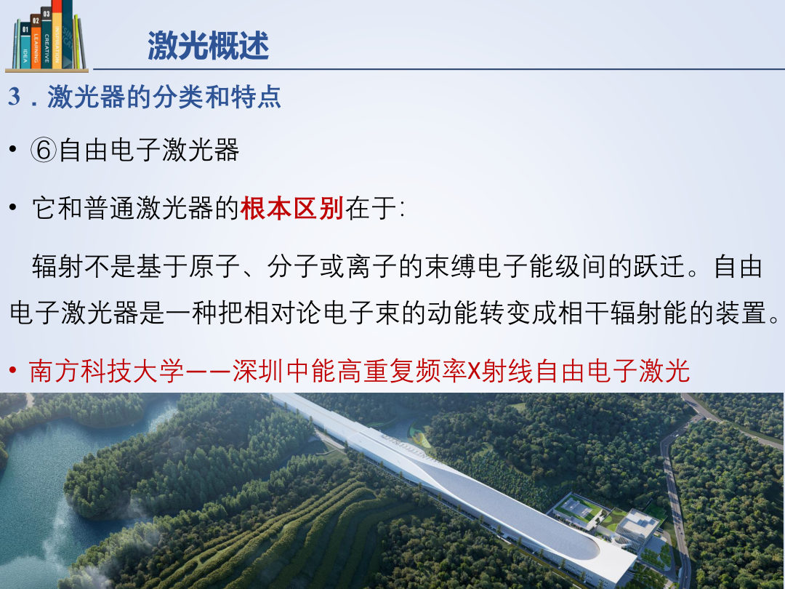

### 本页文字

```text
激光概述

3．激光器的分类和特点

• ⑥自由电子激光器

• 它和普通激光器的根本区别在于：

 辐射不是基于原子、分子或离子的束缚电子能级间的跃迁。自由

电子激光器是一种把相对论电子束的动能转变成相干辐射能的装置。

• 南方科技大学——深圳中能高重复频率X射线自由电子激光
```

## 第 19 页

**页面标题/首行：** 激光概述

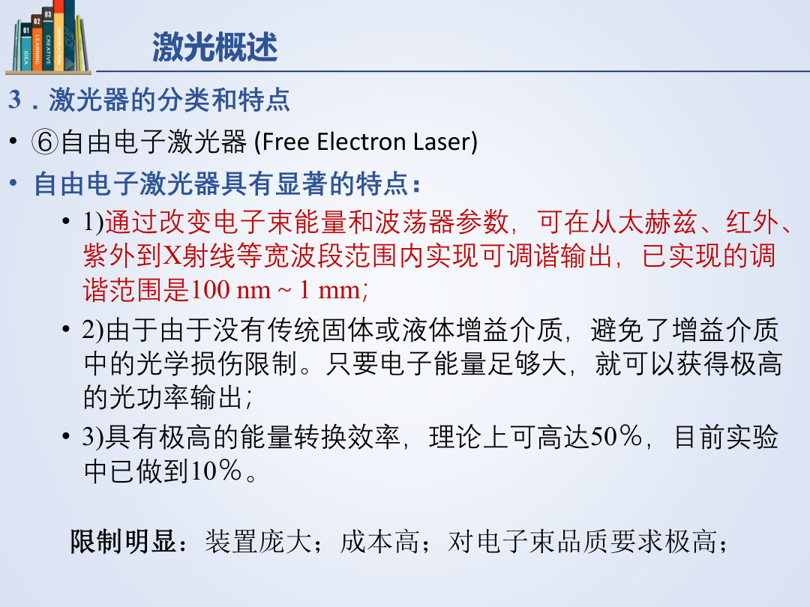

### 本页文字

```text
激光概述

3．激光器的分类和特点
• ⑥自由电子激光器 (Free Electron Laser)
• 自由电子激光器具有显著的特点：
      • 1)通过改变电子束能量和波荡器参数，可在从太赫兹、红外、
   紫外到X射线等宽波段范围内实现可调谐输出，已实现的调
   谐范围是100 nm～1 mm；
      • 2)由于由于没有传统固体或液体增益介质，避免了增益介质
   中的光学损伤限制。只要电子能量足够大，就可以获得极高
   的光功率输出；
      • 3)具有极高的能量转换效率，理论上可高达50％，目前实验
   中已做到10％。

  限制明显：装置庞大；成本高；对电子束品质要求极高；
```

## 第 20 页

**页面标题/首行：** 激光概述

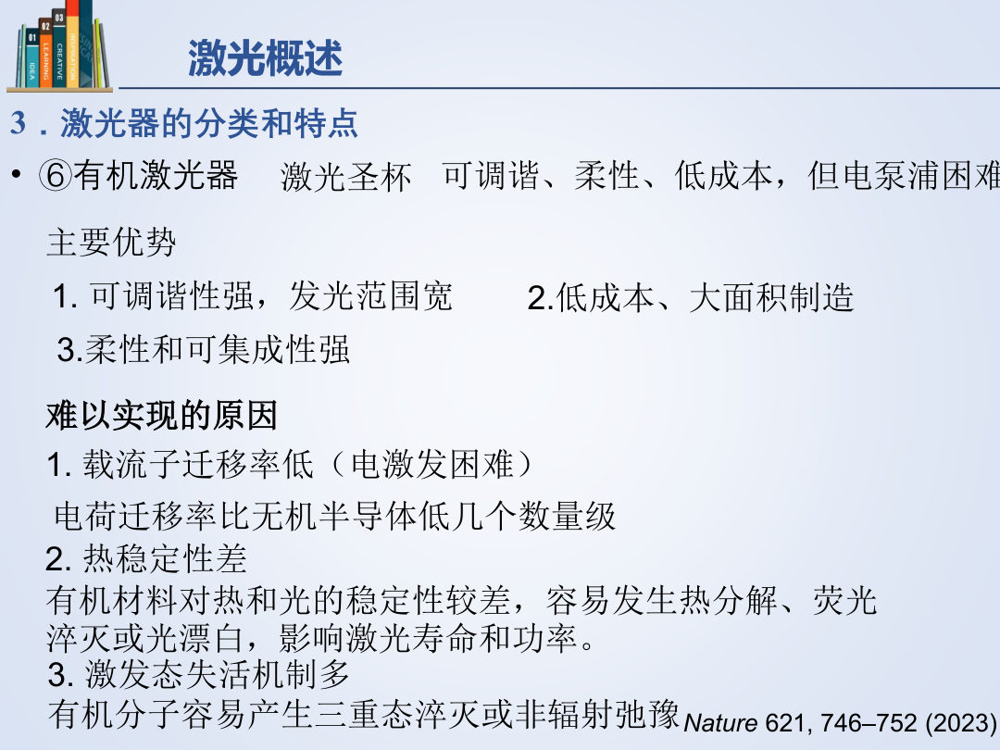

### 本页文字

```text
激光概述

3．激光器的分类和特点
• ⑥有机激光器 激光圣杯 可调谐、柔性、低成本，但电泵浦困难

 主要优势
   1. 可调谐性强，发光范围宽  2.低成本、大面积制造
  3.柔性和可集成性强

 难以实现的原因
  1. 载流子迁移率低（电激发困难）
 电荷迁移率比无机半导体低几个数量级
  2. 热稳定性差
 有机材料对热和光的稳定性较差，容易发生热分解、荧光
 淬灭或光漂白，影响激光寿命和功率。
   3. 激发态失活机制多
 有机分子容易产生三重态淬灭或非辐射弛豫                                                      Nature 621, 746–752 (2023)
```

## 第 21 页

**页面标题/首行：** 激光概述

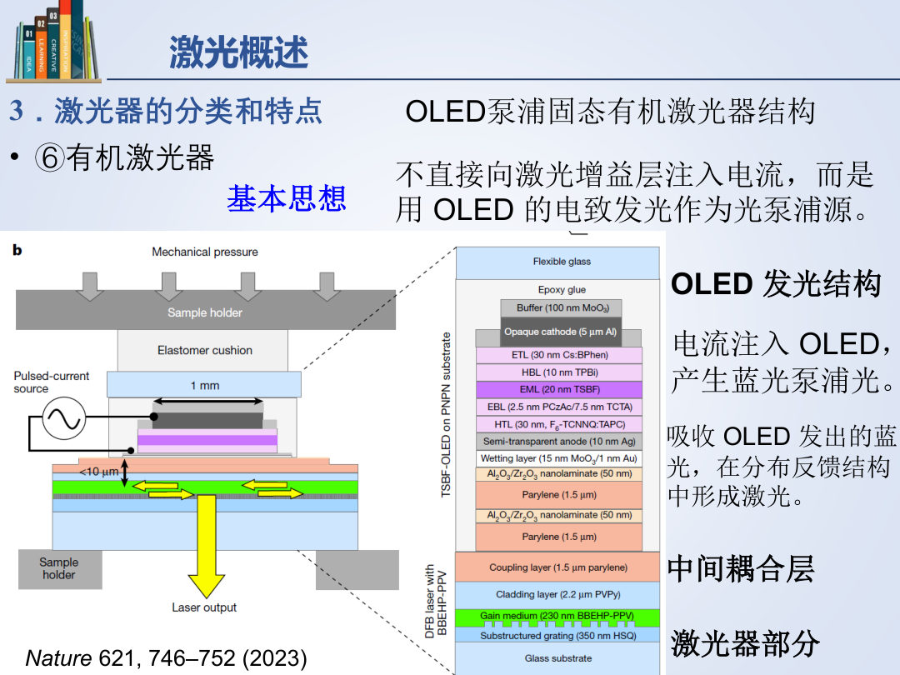

### 本页文字

```text
激光概述

3．激光器的分类和特点   OLED泵浦固态有机激光器结构
• ⑥有机激光器
             不直接向激光增益层注入电流，而是
       基本思想             用 OLED 的电致发光作为光泵浦源。

                                OLED 发光结构

                      电流注入 OLED，
                      产生蓝光泵浦光。

                          吸收 OLED 发出的蓝
                          光，在分布反馈结构
                          中形成激光。

                      中间耦合层

                      激光器部分 Nature 621, 746–752 (2023)
```

## 第 22 页

**页面标题/首行：** 激光概述

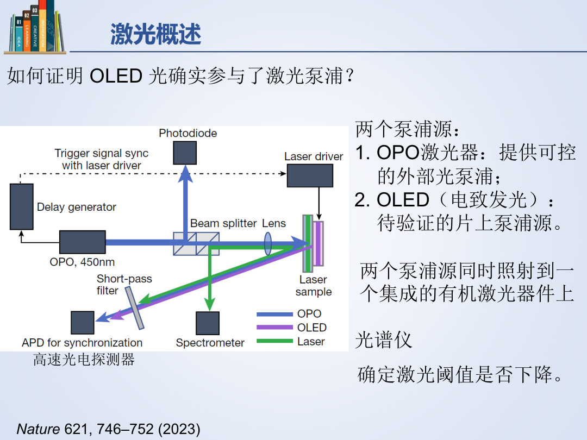

### 本页文字

```text
激光概述

如何证明 OLED 光确实参与了激光泵浦？

                  两个泵浦源：
                                           1. OPO激光器：提供可控
                   的外部光泵浦；
                                           2. OLED（电致发光）：
                   待验证的片上泵浦源。

                  两个泵浦源同时照射到一
                  个集成的有机激光器件上

                  光谱仪
  高速光电探测器
                  确定激光阈值是否下降。

 Nature 621, 746–752 (2023)
```

## 第 23 页

**页面标题/首行：** 激光概述

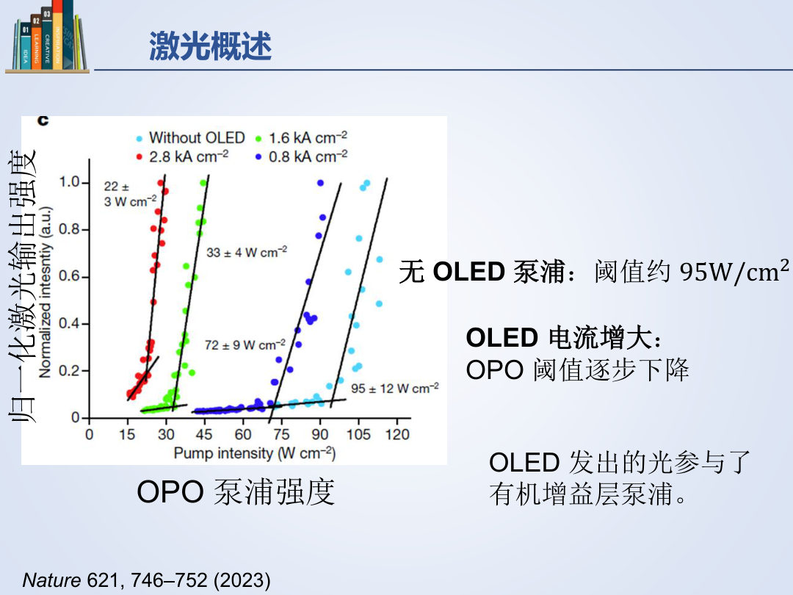

### 本页文字

```text
激光概述

               无 OLED 泵浦：阈值约 95W/cm2

                         OLED 电流增大：
                       OPO 阈值逐步下降归一化激光输出强度

                           OLED 发出的光参与了
      OPO 泵浦强度      有机增益层泵浦。

  Nature 621, 746–752 (2023)
```

## 第 24 页

**页面标题/首行：** 单选题 1分

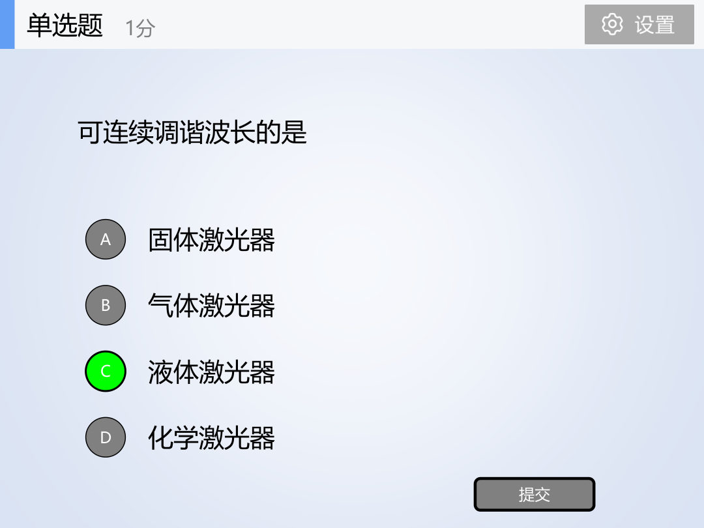

### 本页文字

```text
单选题 1分

  可连续调谐波长的是

       A     固体激光器

        B     气体激光器

       C     液体激光器

      D     化学激光器

                                提交
```

## 第 25 页

**页面标题/首行：** 激光准直技术及应用

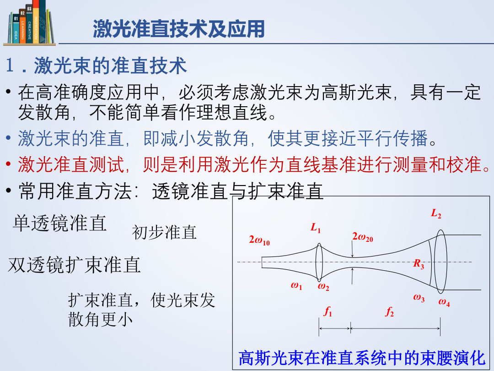

### 本页文字

```text
激光准直技术及应用

1．激光束的准直技术
• 在高准确度应用中，必须考虑激光束为高斯光束，具有一定
 发散角，不能简单看作理想直线。
• 激光束的准直，即减小发散角，使其更接近平行传播。
• 激光准直测试，则是利用激光作为直线基准进行测量和校准。
• 常用准直方法：透镜准直与扩束准直
                                                                                  L2
单透镜准直                                       L1        初步准直                                                                   2ω20                                               2ω10
双透镜扩束准直                                                 R3
                                                 ω1   ω2
    扩束准直，使光束发                                  ω3  ω4
                                                                                        f1               f2
    散角更小

              高斯光束在准直系统中的束腰演化
```

## 第 26 页

**页面标题/首行：** 激光准直技术及应用

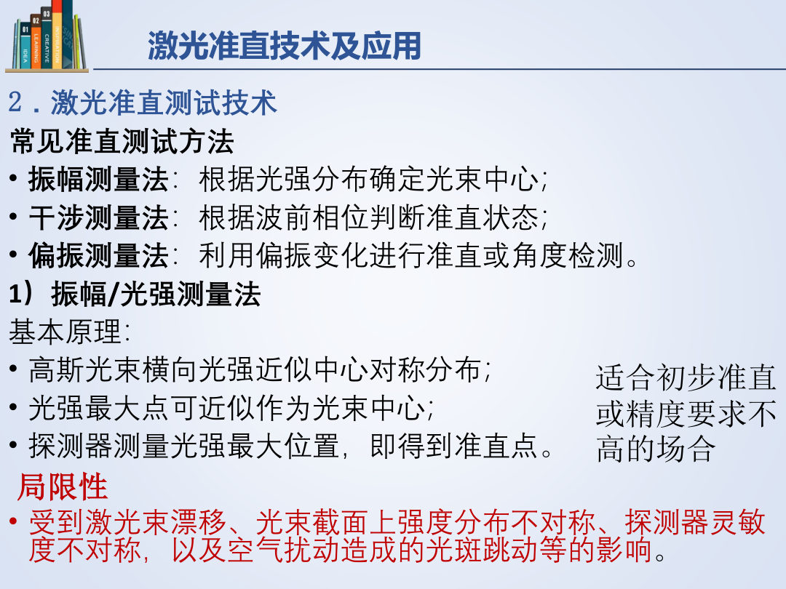

### 本页文字

```text
激光准直技术及应用

2．激光准直测试技术
常见准直测试方法
• 振幅测量法：根据光强分布确定光束中心；
• 干涉测量法：根据波前相位判断准直状态；
• 偏振测量法：利用偏振变化进行准直或角度检测。
1）振幅/光强测量法
基本原理：
• 高斯光束横向光强近似中心对称分布；                   适合初步准直
• 光强最大点可近似作为光束中心；                   或精度要求不
• 探测器测量光强最大位置，即得到准直点。 高的场合
局限性
• 受到激光束漂移、光束截面上强度分布不对称、探测器灵敏
 度不对称，以及空气扰动造成的光斑跳动等的影响。
```

## 第 27 页

**页面标题/首行：** 激光准直技术及应用

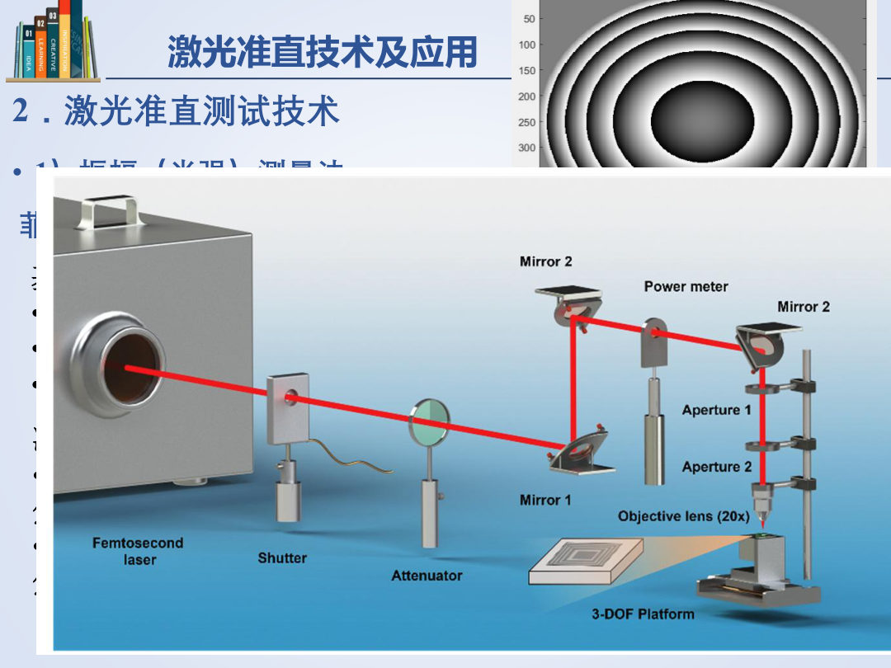

### 本页文字

```text
激光准直技术及应用
2．激光准直测试技术

• 1）振幅（光强）测量法

菲涅尔波带片法：

 基本思想
 •方形菲涅尔波带片由精密排列的透光/遮光带组成；
 •相邻波带对应光程差约为 𝜆/2；
 •平面波照射时，在焦平面形成清晰的十字亮线。

 准直判断
 •若激光波前接近平面波：
 焦平面处出现清晰、稳定、对称的十字亮线。
 •若激光束未准直：
 焦点偏移，十字亮线变宽、变弱或不对称。
```

## 第 28 页

**页面标题/首行：** 方形菲涅尔波带片与照度分布

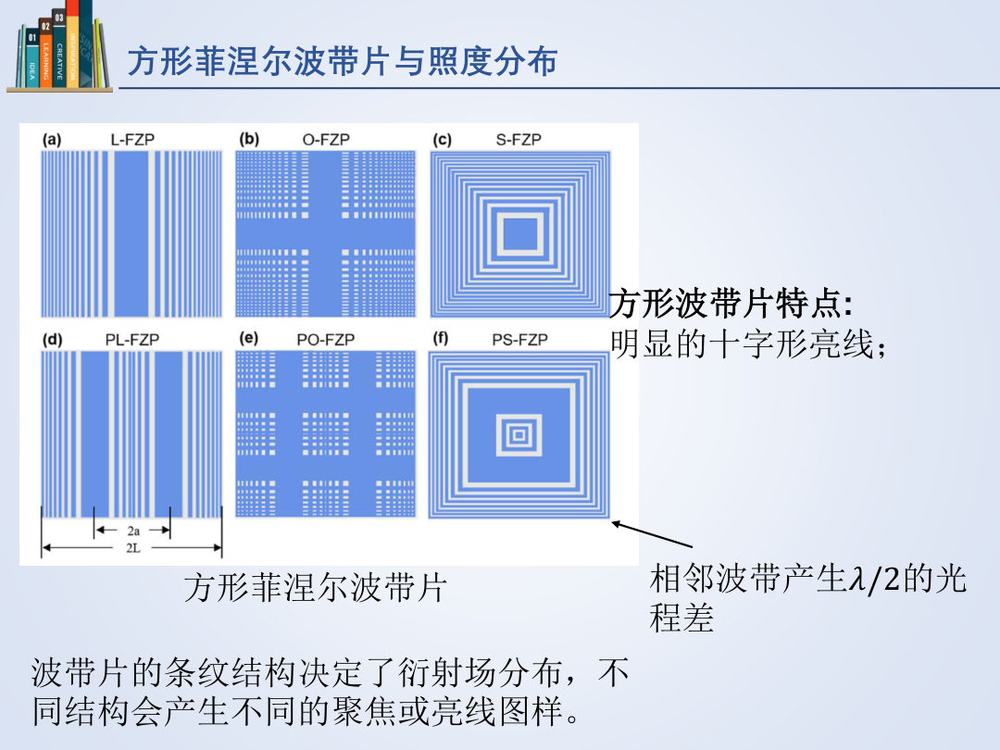

### 本页文字

```text
方形菲涅尔波带片与照度分布

                   方形波带片特点:
                 明显的十字形亮线；

                     相邻波带产生𝜆/2的光     方形菲涅尔波带片
                   程差

波带片的条纹结构决定了衍射场分布，不
同结构会产生不同的聚焦或亮线图样。
```

## 第 29 页

**页面标题/首行：** 空间聚焦演化：利用焦点位置判断准直状态

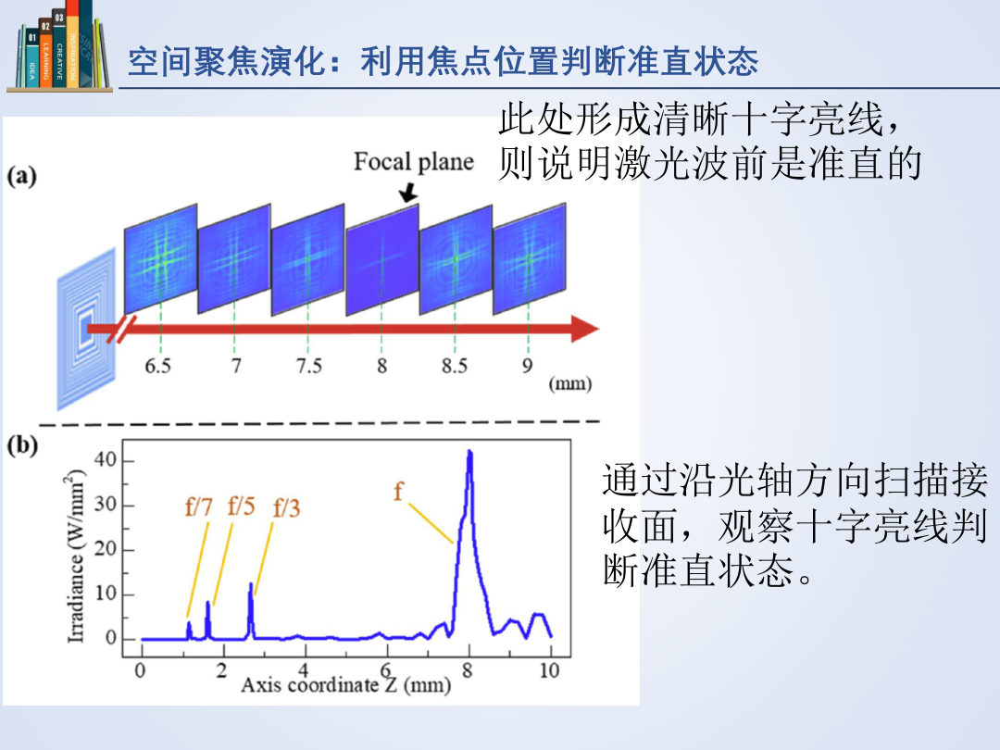

### 本页文字

```text
空间聚焦演化：利用焦点位置判断准直状态

          此处形成清晰十字亮线，
          则说明激光波前是准直的

            通过沿光轴方向扫描接
            收面，观察十字亮线判
            断准直状态。
```

## 第 30 页

**页面标题/首行：** 激光准直技术及应用

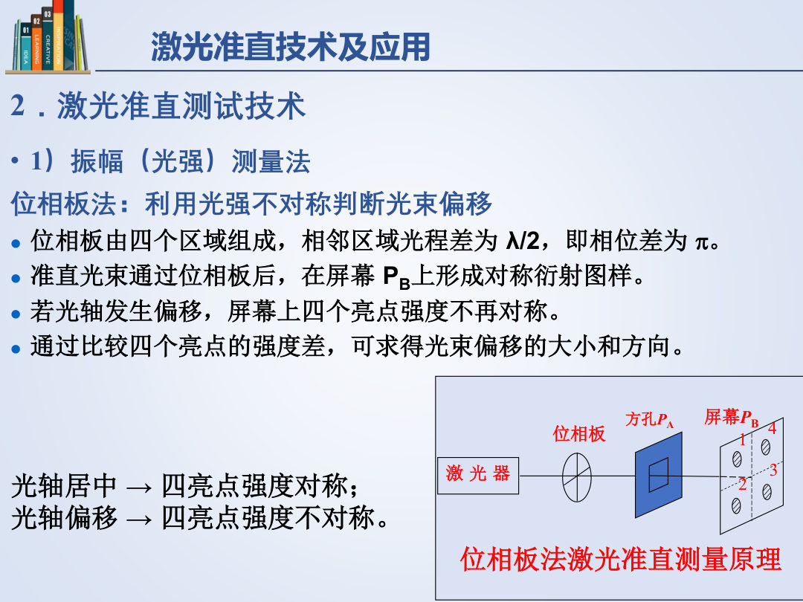

### 本页文字

```text
激光准直技术及应用

2．激光准直测试技术

• 1）振幅（光强）测量法

位相板法：利用光强不对称判断光束偏移
⚫位相板由四个区域组成，相邻区域光程差为 λ/2，即相位差为 。
⚫准直光束通过位相板后，在屏幕 PB上形成对称衍射图样。
⚫若光轴发生偏移，屏幕上四个亮点强度不再对称。
⚫通过比较四个亮点的强度差，可求得光束偏移的大小和方向。

                                                   方孔PA  屏幕PB                                                                                     4                              位相板                                                                                  1
                    激光器                             3
光轴居中 → 四亮点强度对称；                                         2
光轴偏移 → 四亮点强度不对称。
                 位相板法激光准直测量原理
```

## 第 31 页

**页面标题/首行：** 激光准直技术及应用

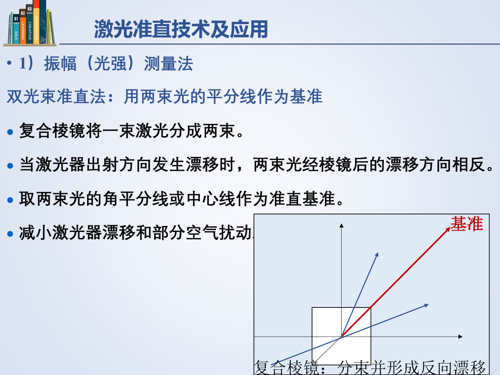

### 本页文字

```text
激光准直技术及应用

• 1）振幅（光强）测量法

双光束准直法：用两束光的平分线作为基准

⚫复合棱镜将一束激光分成两束。

⚫当激光器出射方向发生漂移时，两束光经棱镜后的漂移方向相反。

⚫取两束光的角平分线或中心线作为准直基准。
                           基准
⚫减小激光器漂移和部分空气扰动对测量结果的影响。

               复合棱镜：分束并形成反向漂移
```

## 第 32 页

**页面标题/首行：** 激光准直技术及应用

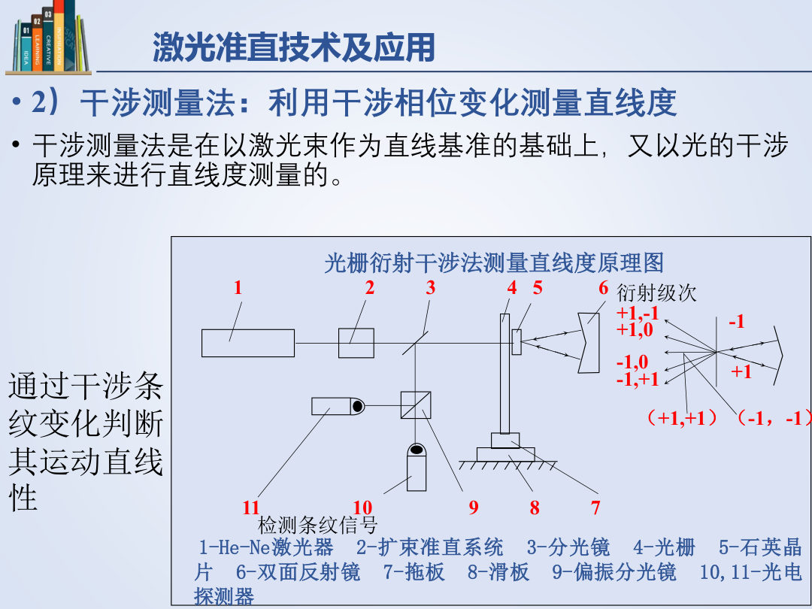

### 本页文字

```text
激光准直技术及应用
• 2）干涉测量法：利用干涉相位变化测量直线度
• 干涉测量法是在以激光束作为直线基准的基础上，又以光的干涉
 原理来进行直线度测量的。

              光栅衍射干涉法测量直线度原理图
                      1            2     3       4  5     6                              衍射级次
                                                                      +1,-1                                                                                     -1                                                                  +1,0
                                                                            -1,0                                                                   +1
通过干涉条                                                    -1,+1
纹变化判断                                    （+1,+1）（-1，-1）
其运动直线
性                        11         10         9     8     7
            检测条纹信号
              1-He-Ne激光器 2-扩束准直系统 3-分光镜 4-光栅 5-石英晶
         片 6-双面反射镜 7-拖板 8-滑板 9-偏振分光镜  10,11-光电
         探测器
```

## 第 33 页

**页面标题/首行：** 单选题 1分


### 本页文字

```text
单选题 1分

  位相板法激光准直测量属于

       A     干涉测量法

        B     振幅测量法

       C     衍射测量法

      D     偏振测量法

                                提交
```

## 第 34 页

**页面标题/首行：** 激光准直技术及应用

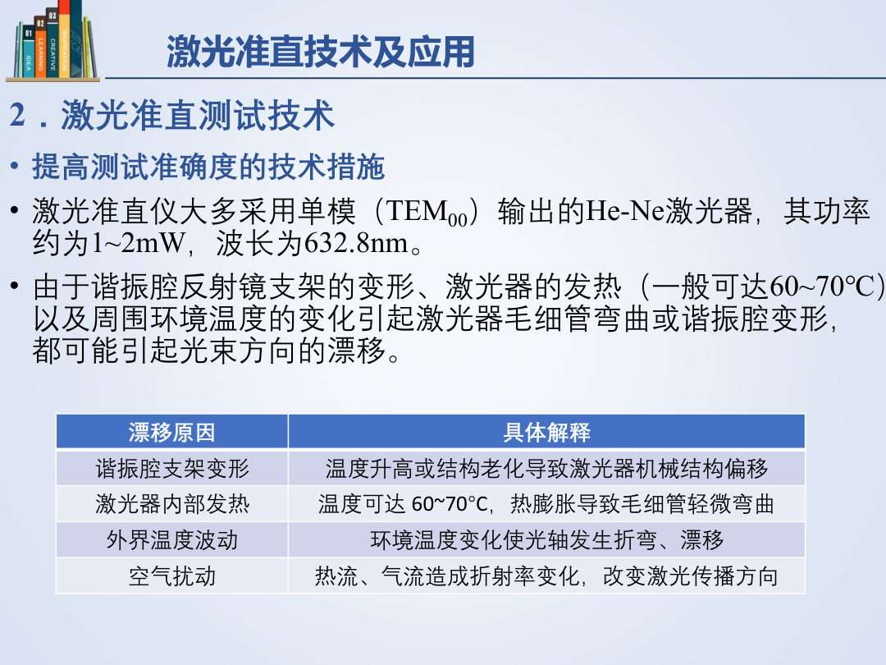

### 本页文字

```text
激光准直技术及应用

2．激光准直测试技术
• 提高测试准确度的技术措施
• 激光准直仪大多采用单模（TEM00）输出的He-Ne激光器，其功率
 约为1~2mW，波长为632.8nm。
• 由于谐振腔反射镜支架的变形、激光器的发热（一般可达60~70℃）
 以及周围环境温度的变化引起激光器毛细管弯曲或谐振腔变形，
 都可能引起光束方向的漂移。

     漂移原因             具体解释

    谐振腔支架变形   温度升高或结构老化导致激光器机械结构偏移

    激光器内部发热   温度可达 60~70°C，热膨胀导致毛细管轻微弯曲

    外界温度波动      环境温度变化使光轴发生折弯、漂移

     空气扰动    热流、气流造成折射率变化，改变激光传播方向
```

## 第 35 页

**页面标题/首行：** 激光准直技术及应用

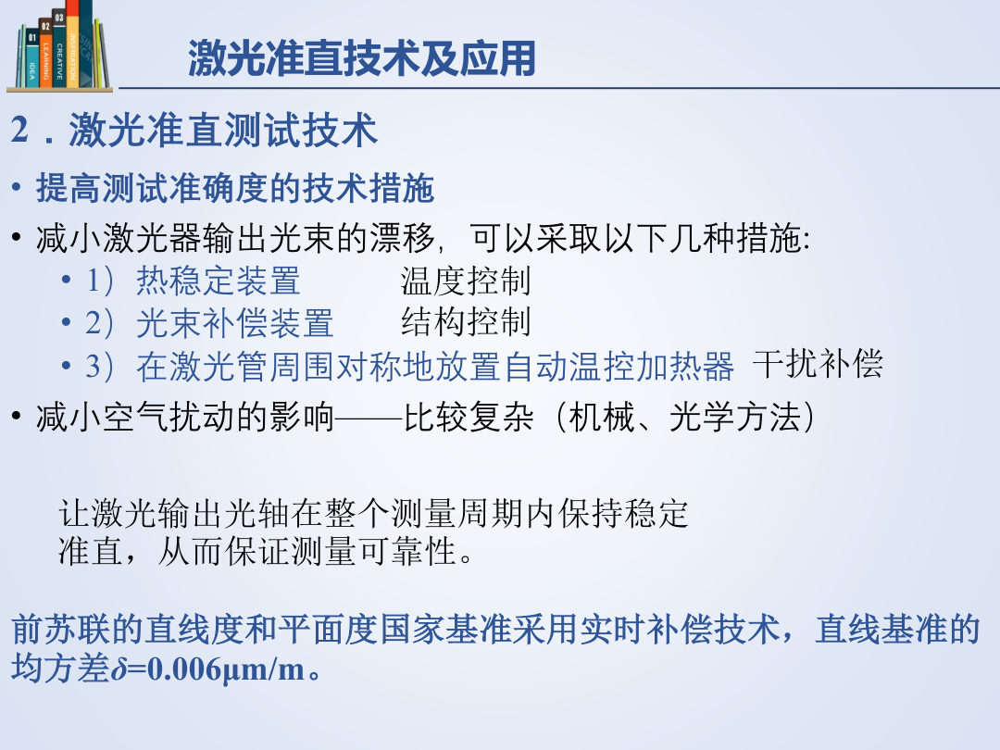

### 本页文字

```text
激光准直技术及应用

2．激光准直测试技术
• 提高测试准确度的技术措施
• 减小激光器输出光束的漂移，可以采取以下几种措施:
    • 1）热稳定装置   温度控制
    • 2）光束补偿装置  结构控制
    • 3）在激光管周围对称地放置自动温控加热器 干扰补偿
• 减小空气扰动的影响——比较复杂（机械、光学方法）

 让激光输出光轴在整个测量周期内保持稳定
 准直，从而保证测量可靠性。

前苏联的直线度和平面度国家基准采用实时补偿技术，直线基准的
均方差δ=0.006μm/m。
```

## 第 36 页

**页面标题/首行：** 激光准直技术及应用

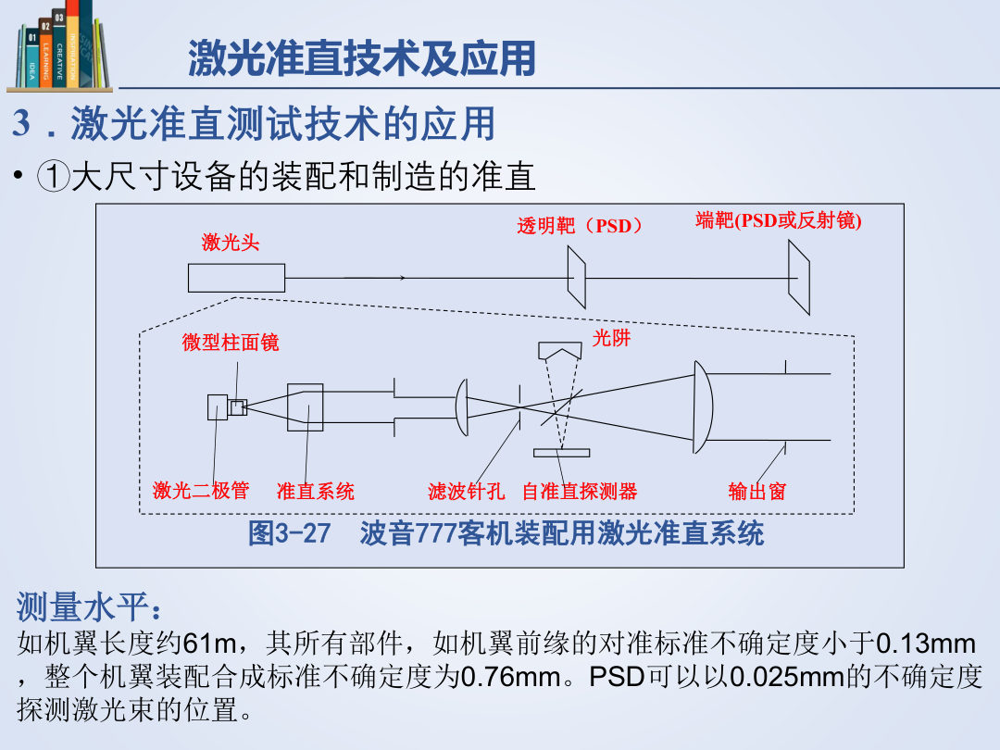

### 本页文字

```text
激光准直技术及应用
3．激光准直测试技术的应用
• ①大尺寸设备的装配和制造的准直

                                             端靶(PSD或反射镜)                              透明靶（PSD）
          激光头

                              光阱         微型柱面镜

       激光二极管 准直系统   滤波针孔自准直探测器     输出窗

              图3-27 波音777客机装配用激光准直系统

测量水平：
如机翼长度约61m，其所有部件，如机翼前缘的对准标准不确定度小于0.13mm
，整个机翼装配合成标准不确定度为0.76mm。PSD可以以0.025mm的不确定度
探测激光束的位置。
```

## 第 37 页

**页面标题/首行：** 激光准直技术及应用

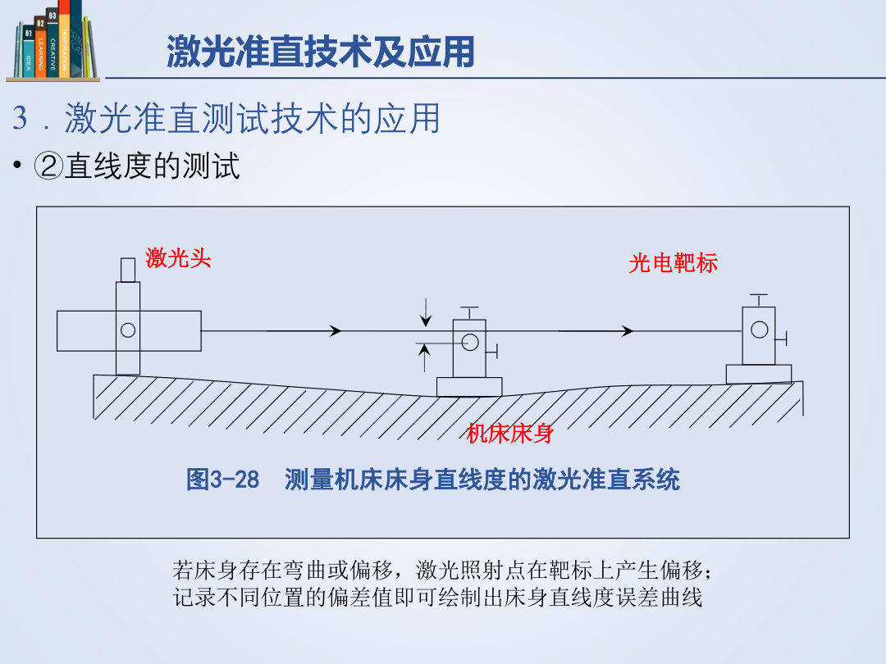

### 本页文字

```text
激光准直技术及应用

3．激光准直测试技术的应用
• ②直线度的测试

      激光头                            光电靶标

                    机床床身

            图3-28 测量机床床身直线度的激光准直系统

       若床身存在弯曲或偏移，激光照射点在靶标上产生偏移；
       记录不同位置的偏差值即可绘制出床身直线度误差曲线
```

## 第 38 页

**页面标题/首行：** 激光准直技术及应用

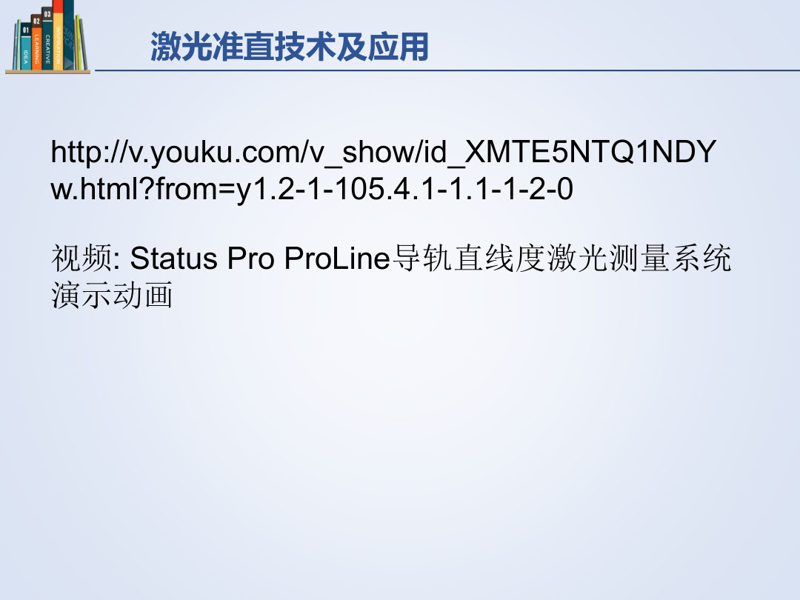

### 本页文字

```text
激光准直技术及应用

http://v.youku.com/v_show/id_XMTE5NTQ1NDY
w.html?from=y1.2-1-105.4.1-1.1-1-2-0

视频: Status Pro ProLine导轨直线度激光测量系统
演示动画
```

## 第 39 页

**页面标题/首行：** 激光准直技术及应用

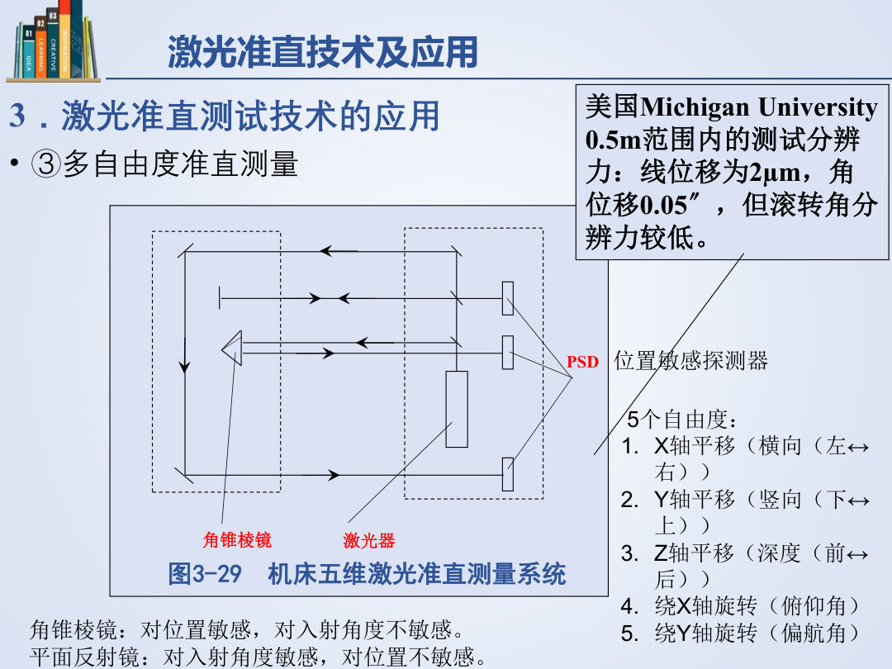

### 本页文字

```text
激光准直技术及应用

                                   美国Michigan University3．激光准直测试技术的应用
                         0.5m范围内的测试分辨
• ③多自由度准直测量                       力：线位移为2µm，角
                         位移0.05〞，但滚转角分
                     辨力较低。

                                                   PSD 位置敏感探测器

                              5个自由度：
                                                                  1. X轴平移（横向（左
                             右））
                                                                  2. Y轴平移（竖向（下
                             上））
           角锥棱镜    激光器
                                                                  3. Z轴平移（深度（前
           图3-29 机床五维激光准直测量系统                             后））
                                                                  4. 绕X轴旋转（俯仰角）
 角锥棱镜：对位置敏感，对入射角度不敏感。                5. 绕Y轴旋转（偏航角）
 平面反射镜：对入射角度敏感，对位置不敏感。
```

## 第 40 页

**页面标题/首行：** 激光准直技术及应用

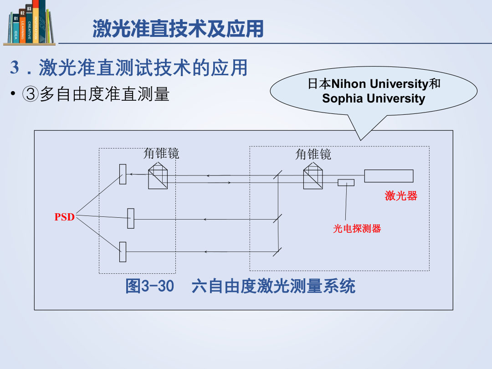

### 本页文字

```text
激光准直技术及应用

3．激光准直测试技术的应用
                                   日本Nihon University和
• ③多自由度准直测量                                              Sophia University

           角锥镜         角锥镜

                                  激光器

      PSD
                                  光电探测器

            图3-30 六自由度激光测量系统
```

## 第 41 页

**页面标题/首行：** 多选题 1分


### 本页文字

```text
多选题 1分

  利用角锥棱镜的反射光路对棱镜的什么偏移量敏
  感？

       A     水平方向平行偏移量

        B     水平方向角度偏移量

       C     垂直方向平行偏移量

      D     垂直方向角度偏移量

                                提交
```

## 第 42 页

**页面标题/首行：** 激光测距技术

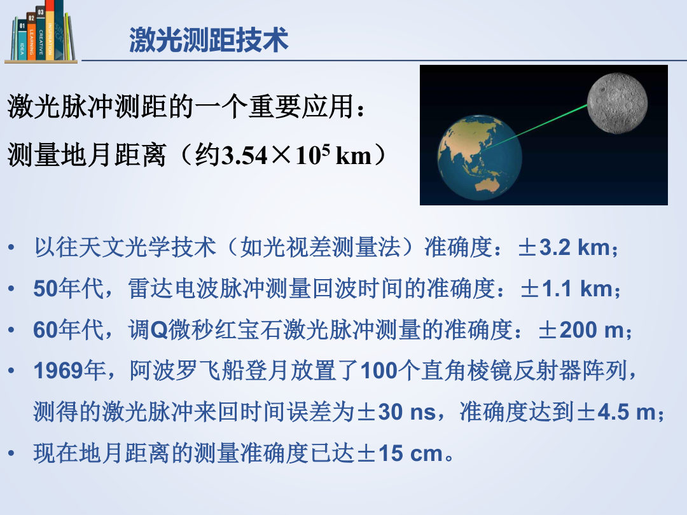

### 本页文字

```text
激光测距技术

激光脉冲测距的一个重要应用：

测量地月距离（约3.54×105 km）

• 以往天文光学技术（如光视差测量法）准确度：±3.2 km；

• 50年代，雷达电波脉冲测量回波时间的准确度：±1.1 km；

• 60年代，调Q微秒红宝石激光脉冲测量的准确度：±200 m；

• 1969年，阿波罗飞船登月放置了100个直角棱镜反射器阵列，

 测得的激光脉冲来回时间误差为±30 ns，准确度达到±4.5 m；

• 现在地月距离的测量准确度已达±15 cm。
```

## 第 43 页

**页面标题/首行：** 激光测距技术

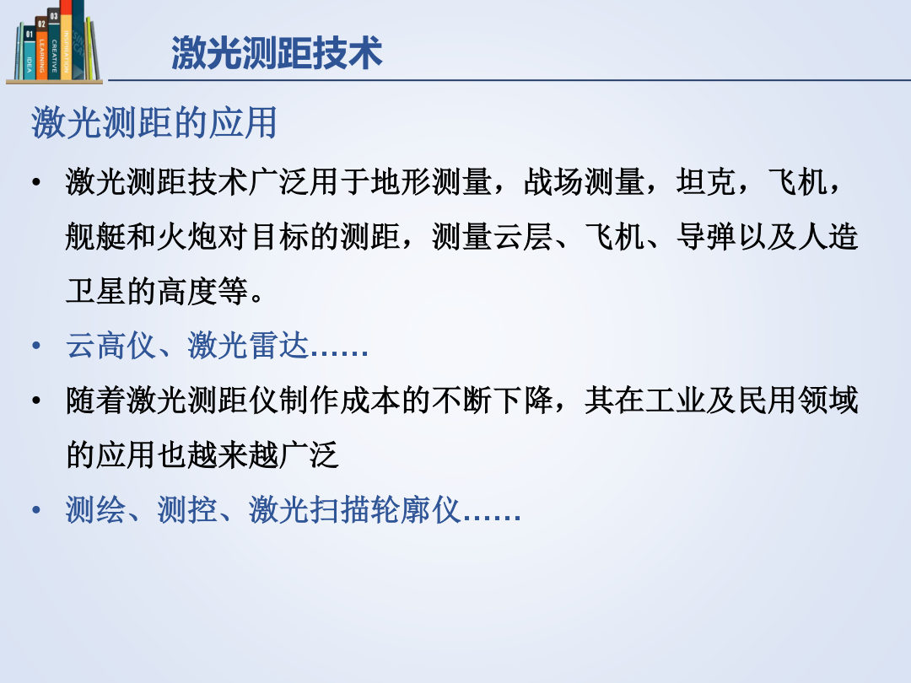

### 本页文字

```text
激光测距技术

激光测距的应用

• 激光测距技术广泛用于地形测量，战场测量，坦克，飞机，

 舰艇和火炮对目标的测距，测量云层、飞机、导弹以及人造

 卫星的高度等。

• 云高仪、激光雷达……

• 随着激光测距仪制作成本的不断下降，其在工业及民用领域

 的应用也越来越广泛

• 测绘、测控、激光扫描轮廓仪……
```

## 第 44 页

**页面标题/首行：** 激光测距技术

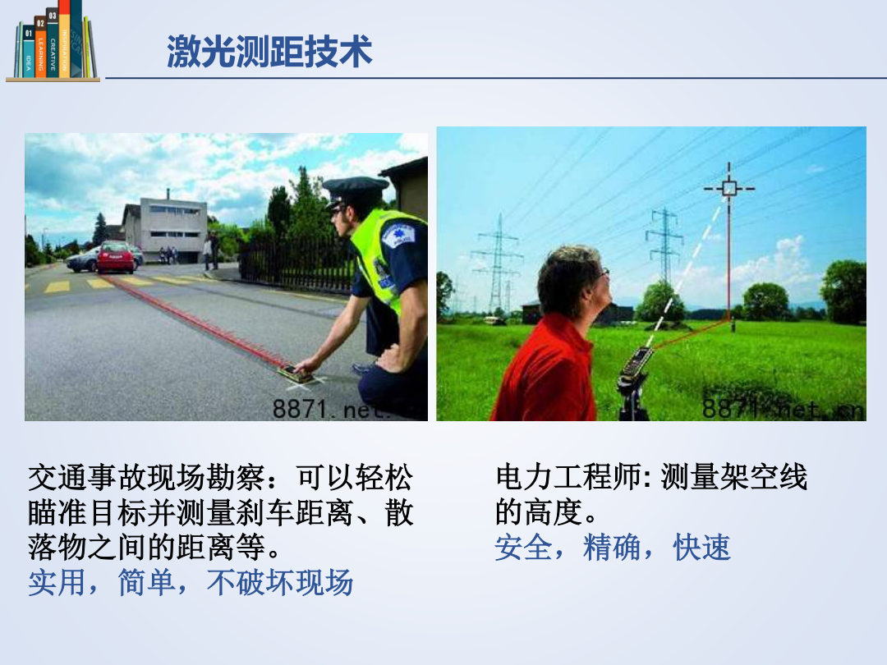

### 本页文字

```text
激光测距技术

交通事故现场勘察：可以轻松   电力工程师: 测量架空线
瞄准目标并测量刹车距离、散   的高度。
落物之间的距离等。       安全，精确，快速
实用，简单，不破坏现场
```

## 第 45 页

**页面标题/首行：** 激光测距技术

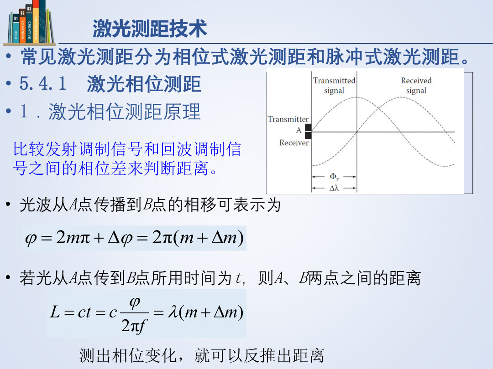

### 本页文字

```text
激光测距技术
• 常见激光测距分为相位式激光测距和脉冲式激光测距。
• 5.4.1 激光相位测距                      λ               Δλ
• 1．激光相位测距原理                                     A                            A′
                                               B
比较发射调制信号和回波调制信            L         L
号之间的相位差来判断距离。
                   传播2L后的光波相位
• 光波从A点传播到B点的相移可表示为
 = 2 mπ + = 2 π ( m + m)

• 若光从A点传到B点所用时间为t，则A、B两点之间的距离
       
    L = ct = c    = ( m + m)
             2 πf

    测出相位变化，就可以反推出距离
```

## 第 46 页

**页面标题/首行：** 激光测距技术

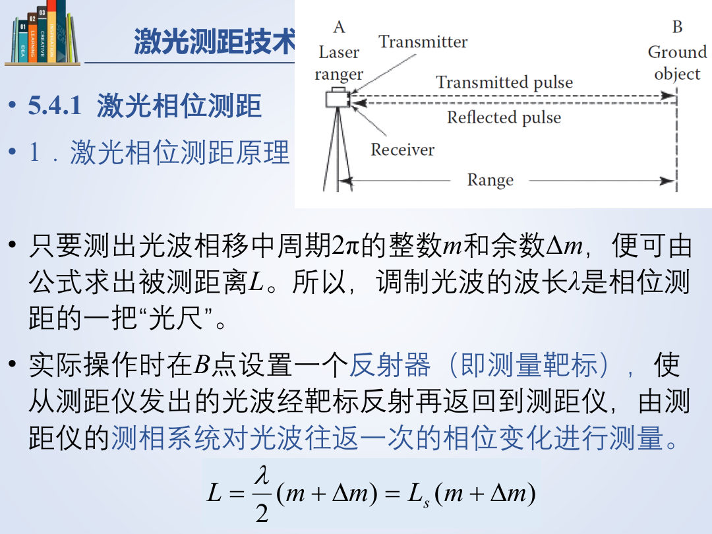

### 本页文字

```text
激光测距技术

• 5.4.1 激光相位测距
• 1．激光相位测距原理

• 只要测出光波相移中周期2π的整数m和余数Δm，便可由
 公式求出被测距离L。所以，调制光波的波长λ是相位测
 距的一把“光尺”。
• 实际操作时在B点设置一个反射器（即测量靶标），使
 从测距仪发出的光波经靶标反射再返回到测距仪，由测
 距仪的测相系统对光波往返一次的相位变化进行测量。
         
             L =   ( m + m ) = L ( m + m )                                                                   s
                  2
```

## 第 47 页

**页面标题/首行：** 激光测距技术

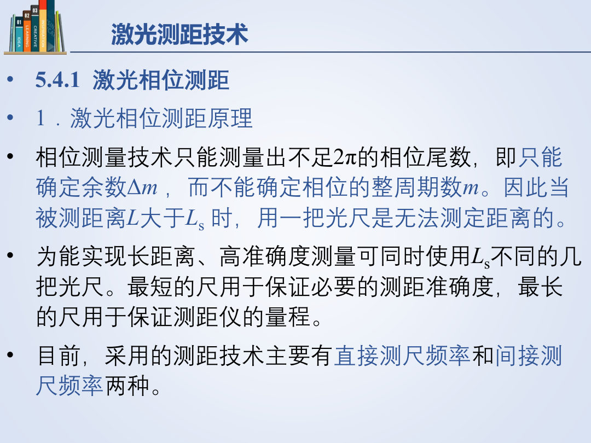

### 本页文字

```text
激光测距技术

•  5.4.1 激光相位测距
• 1．激光相位测距原理
• 相位测量技术只能测量出不足2π的相位尾数，即只能
 确定余数Δm ，而不能确定相位的整周期数m。因此当
  被测距离L大于Ls 时，用一把光尺是无法测定距离的。
• 为能实现长距离、高准确度测量可同时使用Ls不同的几
 把光尺。最短的尺用于保证必要的测距准确度，最长
 的尺用于保证测距仪的量程。
• 目前，采用的测距技术主要有直接测尺频率和间接测
 尺频率两种。
```

## 第 48 页

**页面标题/首行：** 激光测距技术

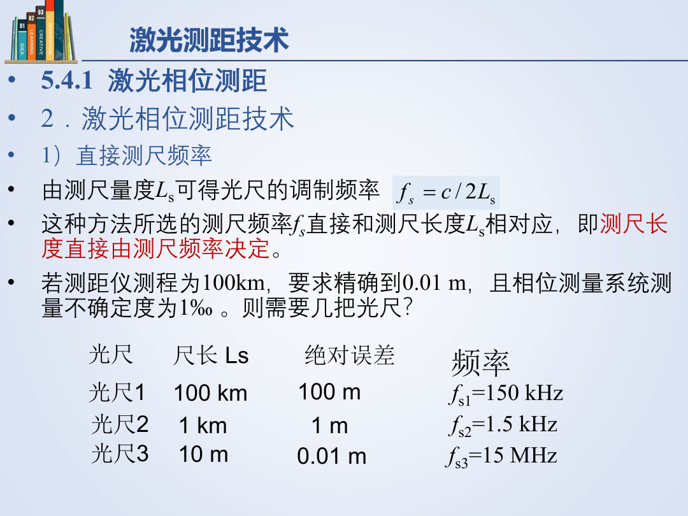

### 本页文字

```text
激光测距技术
•  5.4.1 激光相位测距
• 2．激光相位测距技术
• 1）直接测尺频率
• 由测尺量度Ls可得光尺的调制频率   f s = c / 2 Ls
• 这种方法所选的测尺频率fs直接和测尺长度Ls相对应，即测尺长
 度直接由测尺频率决定。
• 若测距仪测程为100km，要求精确到0.01 m，且相位测量系统测
  量不确定度为1‰ 。则需要几把光尺？

    光尺  尺长 Ls​  绝对误差              频率
    光尺1  100 km    100 m         fs1=150 kHz
    光尺2  1 km      1 m            fs2=1.5 kHz
    光尺3  10 m      0.01 m         fs3=15 MHz
```

## 第 49 页

**页面标题/首行：** 激光测距技术

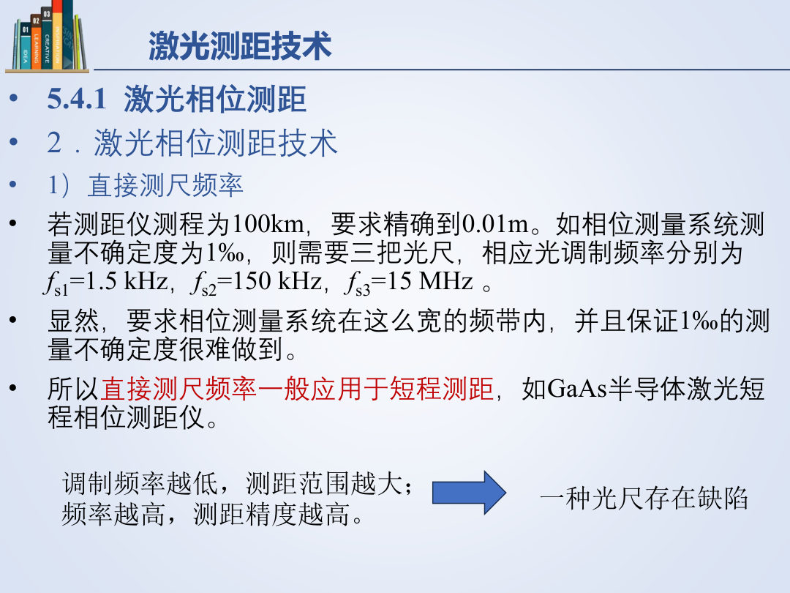

### 本页文字

```text
激光测距技术
•  5.4.1 激光相位测距
• 2．激光相位测距技术
• 1）直接测尺频率
• 若测距仪测程为100km，要求精确到0.01m。如相位测量系统测
  量不确定度为1‰，则需要三把光尺，相应光调制频率分别为
    fs1=1.5 kHz，fs2=150 kHz，fs3=15 MHz 。
• 显然，要求相位测量系统在这么宽的频带内，并且保证1‰的测
 量不确定度很难做到。
• 所以直接测尺频率一般应用于短程测距，如GaAs半导体激光短
 程相位测距仪。

  调制频率越低，测距范围越大；
                    一种光尺存在缺陷
  频率越高，测距精度越高。
```

## 第 50 页

**页面标题/首行：** 激光测距技术

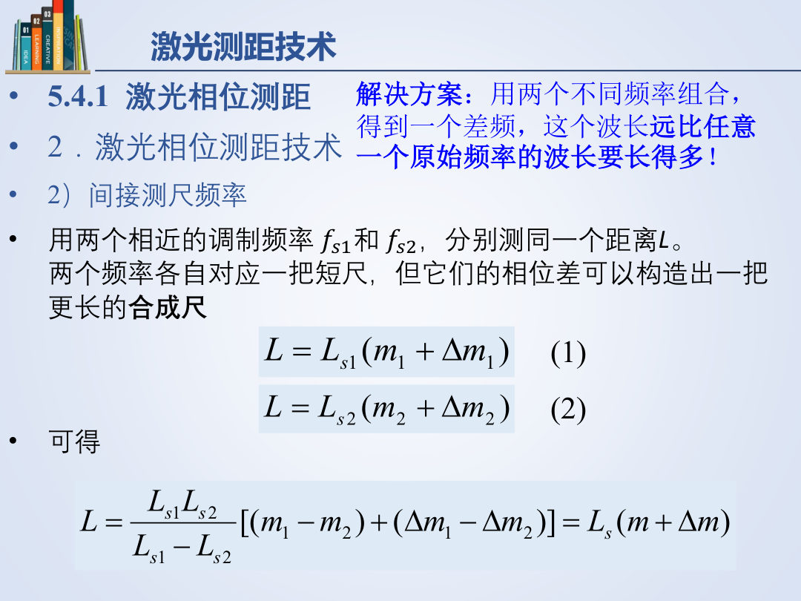

### 本页文字

```text
激光测距技术
•  5.4.1 激光相位测距  解决方案：用两个不同频率组合，
             得到一个差频，这个波长远比任意
• 2．激光相位测距技术             一个原始频率的波长要长得多！
• 2）间接测尺频率
• 用两个相近的调制频率 𝑓𝑠1和 𝑓𝑠2，分别测同一个距离L。
 两个频率各自对应一把短尺，但它们的相位差可以构造出一把
 更长的合成尺
              L = L  ( m + m )   (1)                                           s1    1        1
              L = L  ( m + m )   (2)                                             s 2    2        2
• 可得

        L L
    L =      s1   s 2  [( m − m ) + ( m − m )] = L ( m + m )                              1      2          1        2          s
       L − L                    s1       s 2
```

## 第 51 页

**页面标题/首行：** 激光测距技术

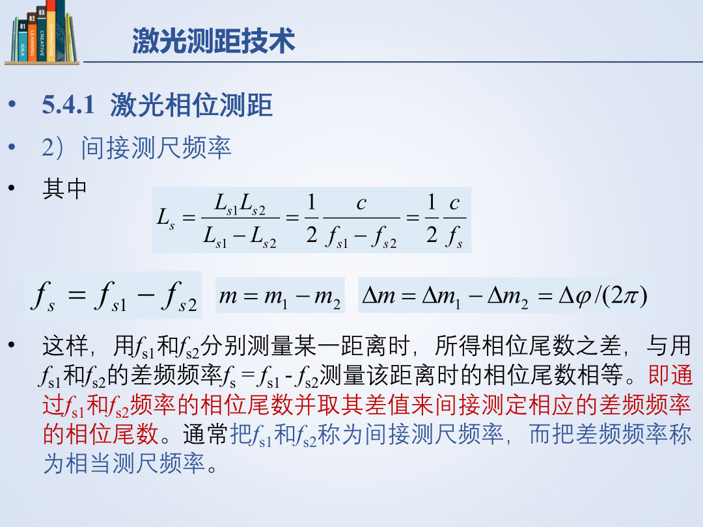

### 本页文字

```text
激光测距技术

•  5.4.1 激光相位测距
• 2）间接测尺频率
• 其中
                L L     1    c     1 c
            L =      s1   s 2  =        =                               s
               L − L    2  f − f    2  f                                       s1       s 2           s1      s 2           s

           m = m                    − m                      m = m                                − m                                     = /( 2)   f   =  f       − f                                    1                                                           1                                                                    2                                           2      s              s1                        s 2

• 这样，用fs1和fs2分别测量某一距离时，所得相位尾数之差，与用
  fs1和fs2的差频频率fs = fs1 - fs2测量该距离时的相位尾数相等。即通
  过fs1和fs2频率的相位尾数并取其差值来间接测定相应的差频频率
  的相位尾数。通常把fs1和fs2称为间接测尺频率，而把差频频率称
 为相当测尺频率。
```

## 第 52 页

**页面标题/首行：** 激光测距技术

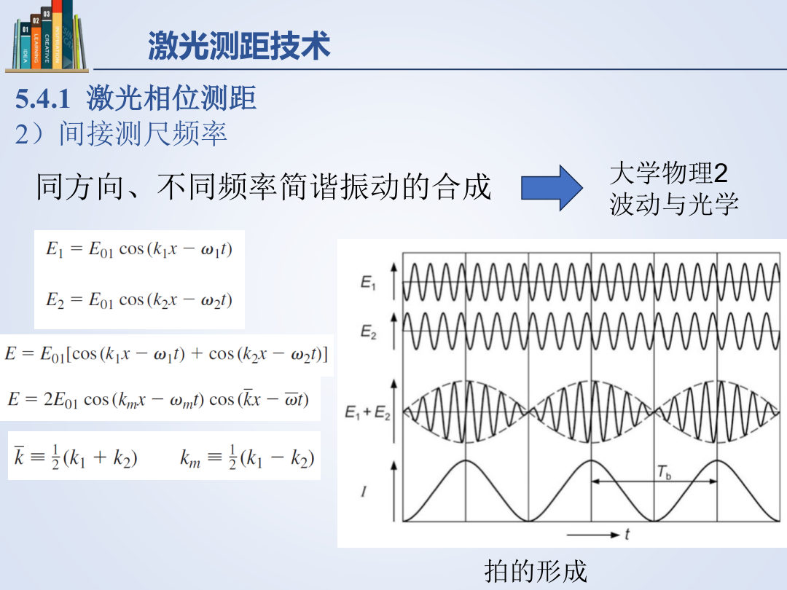

### 本页文字

```text
激光测距技术

5.4.1 激光相位测距
2）间接测尺频率
                         大学物理2 同方向、不同频率简谐振动的合成
                       波动与光学

                  拍的形成
```

## 第 53 页

**页面标题/首行：** 130 (2023)

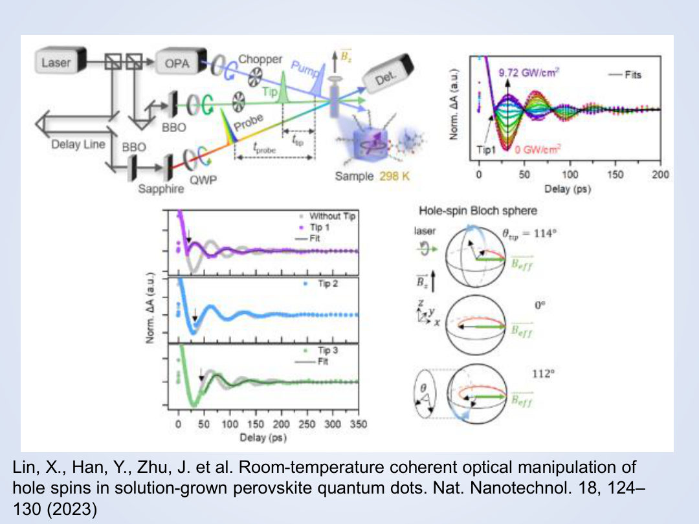

### 本页文字

```text
Lin, X., Han, Y., Zhu, J. et al. Room-temperature coherent optical manipulation of
hole spins in solution-grown perovskite quantum dots. Nat. Nanotechnol. 18, 124–
130 (2023)
```

## 第 54 页

**页面标题/首行：** 激光测距技术

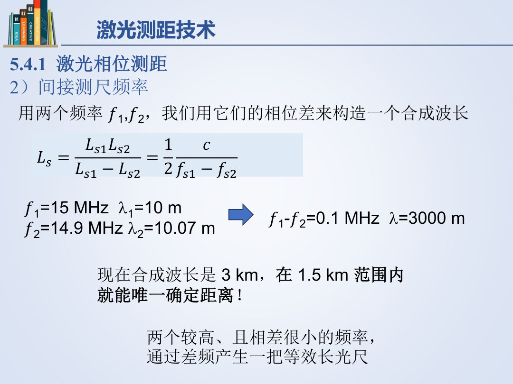

### 本页文字

```text
激光测距技术

5.4.1 激光相位测距
2）间接测尺频率
用两个频率 𝑓1,𝑓2，我们用它们的相位差来构造一个合成波长

          𝐿𝑠1𝐿𝑠2   1    𝑐
  𝐿𝑠=      =
         𝐿𝑠1 −𝐿𝑠2  2 𝑓𝑠1 −𝑓𝑠2

  𝑓1=15 MHz 1=10 m                                 𝑓1-𝑓2=0.1 MHz =3000 m  𝑓2=14.9 MHz 2=10.07 m

     现在合成波长是 3 km，在 1.5 km 范围内
     就能唯一确定距离！

        两个较高、且相差很小的频率，
        通过差频产生一把等效长光尺
```

## 第 55 页

**页面标题/首行：** 激光测距技术

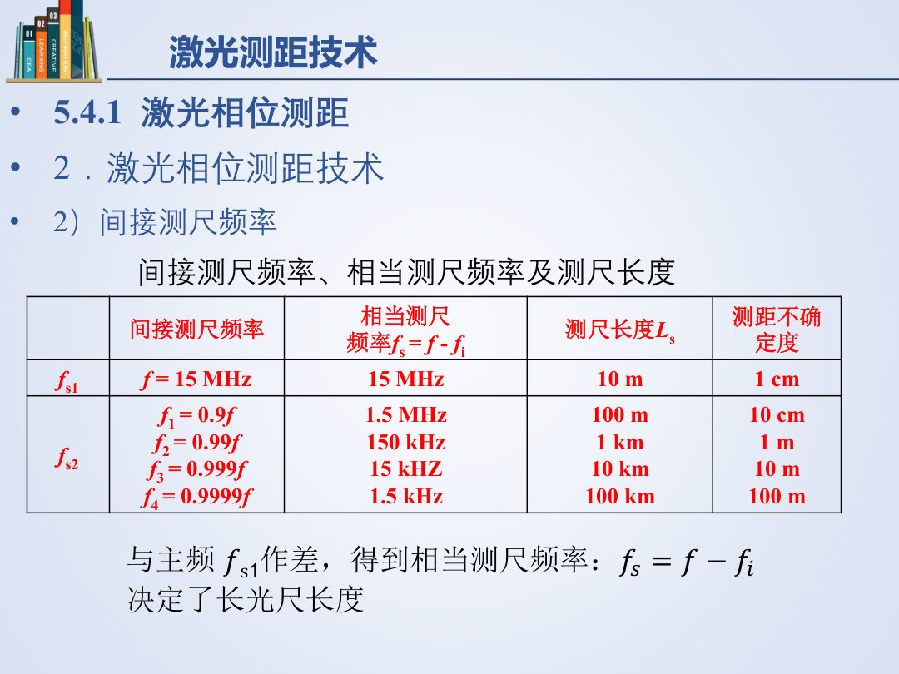

### 本页文字

```text
激光测距技术
•  5.4.1 激光相位测距
• 2．激光相位测距技术
• 2）间接测尺频率

    间接测尺频率、相当测尺频率及测尺长度

                相当测尺            测距不确
     间接测尺频率                测尺长度Ls                       频率fs = f - fi             定度
       fs1         f = 15 MHz          15 MHz              10 m          1 cm
                    f1 = 0.9f              1.5 MHz             100 m         10 cm
                   f2 = 0.99f           150 kHz             1 km          1 m       fs2                   f3 = 0.999f           15 kHZ             10 km         10 m
                  f4 = 0.9999f             1.5 kHz             100 km        100 m

    与主频 𝑓s1作差，得到相当测尺频率：𝑓𝑠= 𝑓−𝑓𝑖
    决定了长光尺长度
```

## 第 56 页

**页面标题/首行：** 激光测距技术

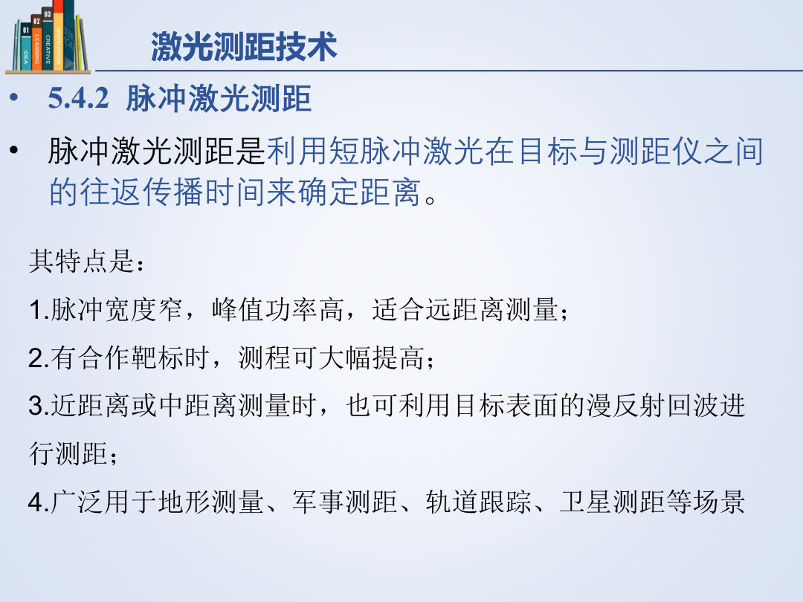

### 本页文字

```text
激光测距技术
•  5.4.2 脉冲激光测距
• 脉冲激光测距是利用短脉冲激光在目标与测距仪之间
 的往返传播时间来确定距离。

 其特点是：

 1.脉冲宽度窄，峰值功率高，适合远距离测量；

 2.有合作靶标时，测程可大幅提高；

 3.近距离或中距离测量时，也可利用目标表面的漫反射回波进

 行测距；

 4.广泛用于地形测量、军事测距、轨道跟踪、卫星测距等场景
```

## 第 57 页

**页面标题/首行：** 激光测距技术

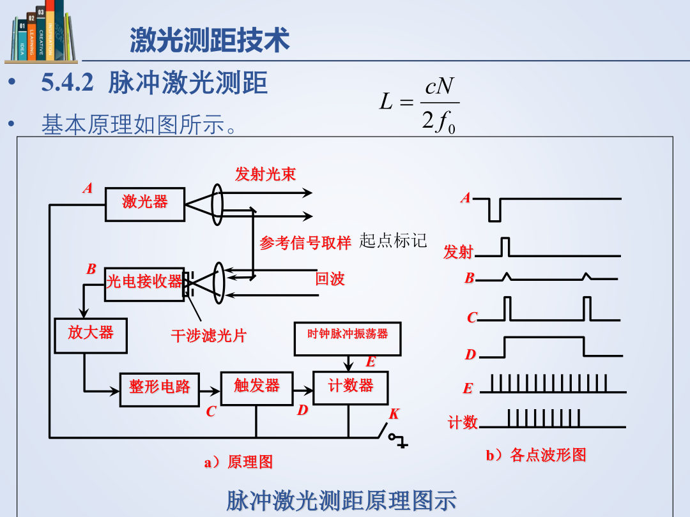

### 本页文字

```text
激光测距技术
•  5.4.2 脉冲激光测距           cN
                           L =
                                  2 f• 基本原理如图所示。                            0

               发射光束
       A
                                            A       激光器

                参考信号取样 起点标记
                            发射
        B
      光电接收器         回波            B

                                             C
    放大器                 时钟脉冲振荡器           干涉滤光片
                                         D                                   E
        整形电路   触发器   计数器         E
                   C       D        K
                             计数

                                 b）各点波形图              a）原理图

         脉冲激光测距原理图示
```

## 第 58 页

**页面标题/首行：** 激光测距技术

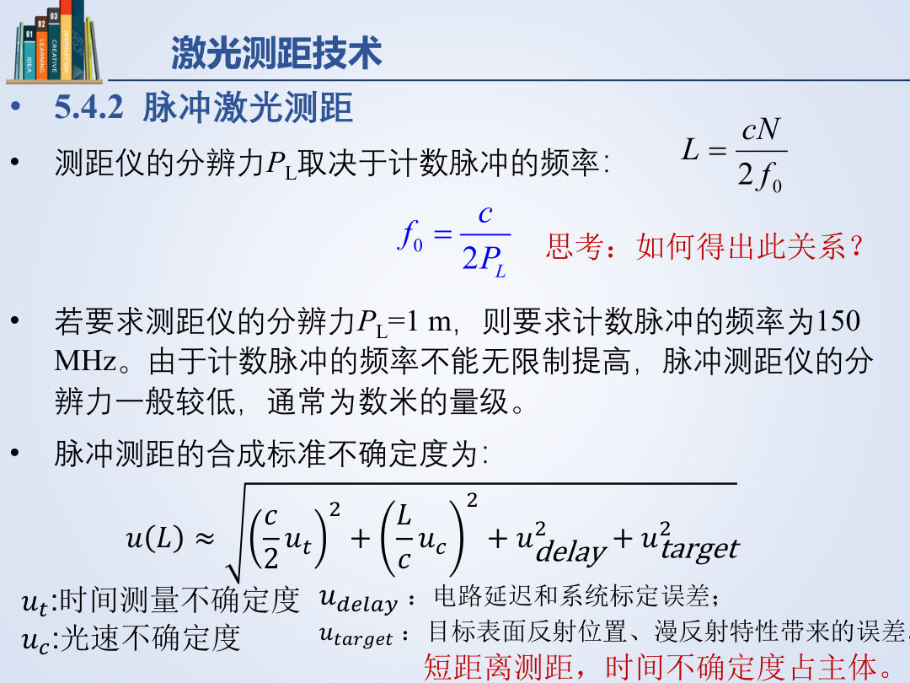

### 本页文字

```text
激光测距技术
•  5.4.2 脉冲激光测距
                                        cN
                                     L =• 测距仪的分辨力PL取决于计数脉冲的频率：                                             2 f                                                                                0
                                c
                                           f =                                          0    思考：如何得出此关系？                           2 P                                              L

• 若要求测距仪的分辨力PL=1 m，则要求计数脉冲的频率为150
  MHz。由于计数脉冲的频率不能无限制提高，脉冲测距仪的分
 辨力一般较低，通常为数米的量级。

• 脉冲测距的合成标准不确定度为：

                                    2
                  𝑐    2   𝐿                                         2         2
    𝑢𝐿≈     𝑢𝑡  +     + 𝑢delay + 𝑢target               2       𝑐𝑢𝑐
𝑢𝑡:时间测量不确定度 𝑢𝑑𝑒𝑙𝑎𝑦：电路延迟和系统标定误差；
𝑢𝑐:光速不确定度    𝑢𝑡𝑎𝑟𝑔𝑒𝑡：目标表面反射位置、漫反射特性带来的误差。
              短距离测距，时间不确定度占主体。
```

## 第 59 页

**页面标题/首行：** 激光测距技术

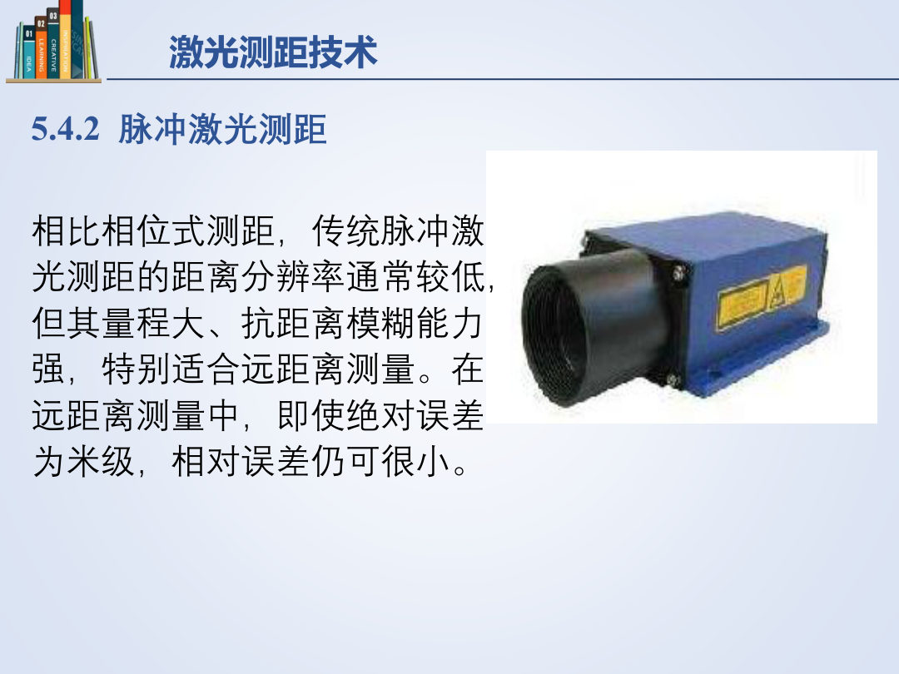

### 本页文字

```text
激光测距技术

5.4.2 脉冲激光测距

相比相位式测距，传统脉冲激
光测距的距离分辨率通常较低，
但其量程大、抗距离模糊能力
强，特别适合远距离测量。在
远距离测量中，即使绝对误差
为米级，相对误差仍可很小。
```

## 第 60 页

**页面标题/首行：** 激光测距技术


### 本页文字

```text
激光测距技术

量程：50米   深达威激光测距仪 SW-JD40
```

## 第 61 页

**页面标题/首行：** 激光测距技术

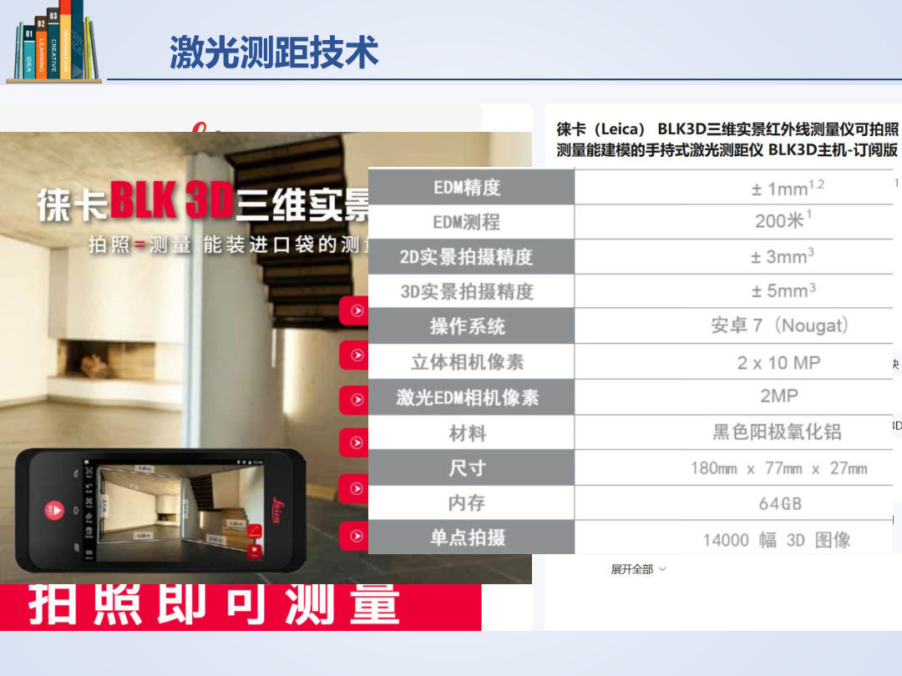

### 本页文字

```text
激光测距技术
```

## 第 62 页

**页面标题/首行：** 激光测距技术

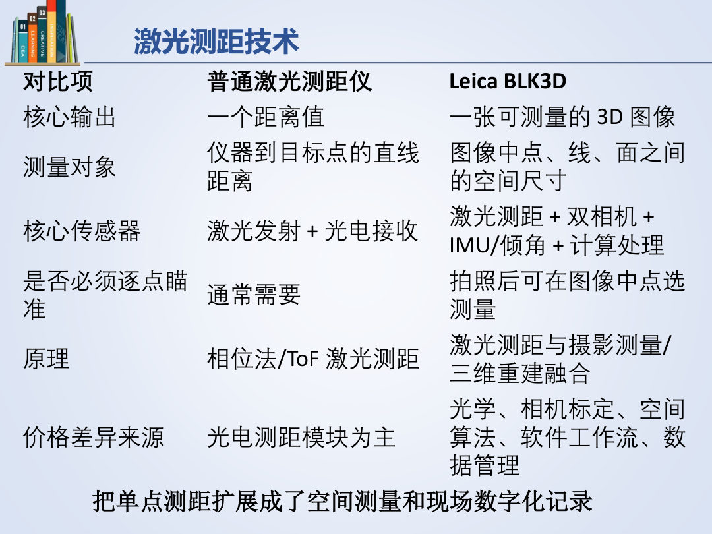

### 本页文字

```text
激光测距技术
对比项     普通激光测距仪        Leica BLK3D
核心输出    一个距离值     一张可测量的 3D 图像
        仪器到目标点的直线 图像中点、线、面之间
测量对象
        距离        的空间尺寸
                  激光测距 + 双相机 +
核心传感器   激光发射 + 光电接收
                          IMU/倾角 + 计算处理
是否必须逐点瞄           拍照后可在图像中点选
        通常需要
准                 测量
                   激光测距与摄影测量/
原理        相位法/ToF 激光测距
                  三维重建融合
                  光学、相机标定、空间
价格差异来源  光电测距模块为主  算法、软件工作流、数
                  据管理
   把单点测距扩展成了空间测量和现场数字化记录
```

## 第 63 页

**页面标题/首行：** 激光测距技术


### 本页文字

```text
激光测距技术

5.4.3 激光三角法测距

       自学
```

## 第 64 页

**页面标题/首行：** 单选题 1分


### 本页文字

```text
单选题 1分

  脉冲激光测距仪的分辨力取决于

       A     测量距离

        B     激光脉冲宽度

       C     计数脉冲频率

      D     激光的频率

                                提交
```

## 第 65 页

**页面标题/首行：** 激光多普勒测速技术

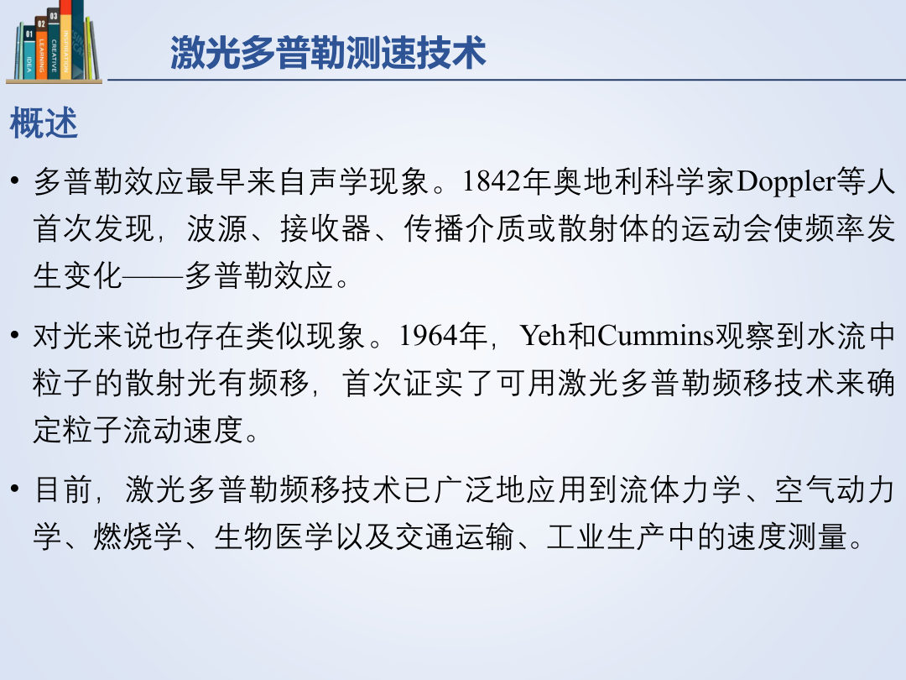

### 本页文字

```text
激光多普勒测速技术

概述

• 多普勒效应最早来自声学现象。1842年奥地利科学家Doppler等人
 首次发现，波源、接收器、传播介质或散射体的运动会使频率发
 生变化——多普勒效应。

• 对光来说也存在类似现象。1964年，Yeh和Cummins观察到水流中
 粒子的散射光有频移，首次证实了可用激光多普勒频移技术来确
 定粒子流动速度。

• 目前，激光多普勒频移技术已广泛地应用到流体力学、空气动力
 学、燃烧学、生物医学以及交通运输、工业生产中的速度测量。
```

## 第 66 页

**页面标题/首行：** 激光多普勒测速技术

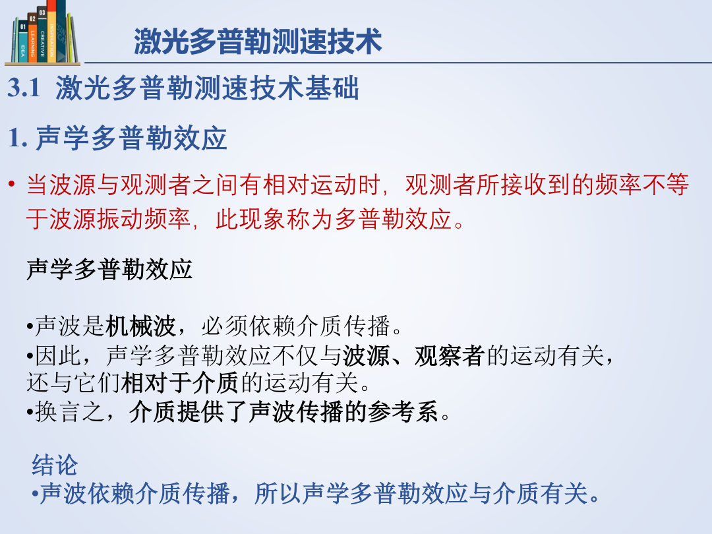

### 本页文字

```text
激光多普勒测速技术
3.1 激光多普勒测速技术基础

1. 声学多普勒效应

• 当波源与观测者之间有相对运动时，观测者所接收到的频率不等
 于波源振动频率，此现象称为多普勒效应。

 声学多普勒效应

 •声波是机械波，必须依赖介质传播。
 •因此，声学多普勒效应不仅与波源、观察者的运动有关，
 还与它们相对于介质的运动有关。
 •换言之，介质提供了声波传播的参考系。

 结论
 •声波依赖介质传播，所以声学多普勒效应与介质有关。
```

## 第 67 页

**页面标题/首行：** 激光多普勒测速技术

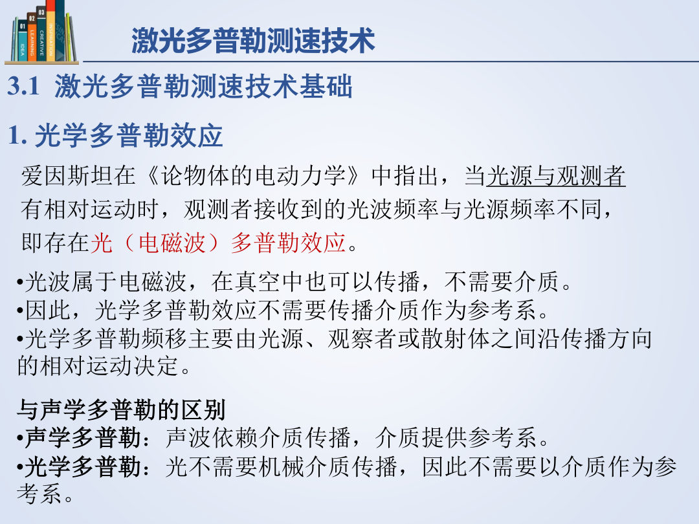

### 本页文字

```text
激光多普勒测速技术
3.1 激光多普勒测速技术基础

1. 光学多普勒效应

 爱因斯坦在《论物体的电动力学》中指出，当光源与观测者
 有相对运动时，观测者接收到的光波频率与光源频率不同，
 即存在光（电磁波）多普勒效应。

•光波属于电磁波，在真空中也可以传播，不需要介质。
•因此，光学多普勒效应不需要传播介质作为参考系。
•光学多普勒频移主要由光源、观察者或散射体之间沿传播方向
的相对运动决定。

与声学多普勒的区别
•声学多普勒：声波依赖介质传播，介质提供参考系。
•光学多普勒：光不需要机械介质传播，因此不需要以介质作为参
考系。
```

## 第 68 页

**页面标题/首行：** 激光多普勒测速技术

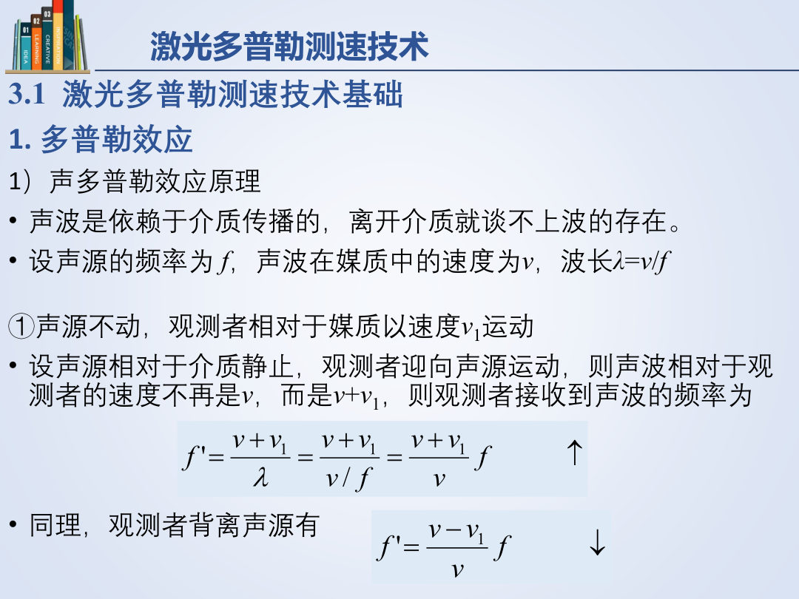

### 本页文字

```text
激光多普勒测速技术
3.1 激光多普勒测速技术基础
1. 多普勒效应
1）声多普勒效应原理
• 声波是依赖于介质传播的，离开介质就谈不上波的存在。
• 设声源的频率为 f，声波在媒质中的速度为v，波长λ=v/f

①声源不动，观测者相对于媒质以速度v1运动
• 设声源相对于介质静止，观测者迎向声源运动，则声波相对于观
 测者的速度不再是v，而是v+v1，则观测者接收到声波的频率为
                  v + v   v + v   v + v
                       f ' =       1 =       1 =       1  f     
             v / f     v
• 同理，观测者背离声源有        v − v
                                               f ' =       1  f     
                                   v
```

## 第 69 页

**页面标题/首行：** v2T                  λ'

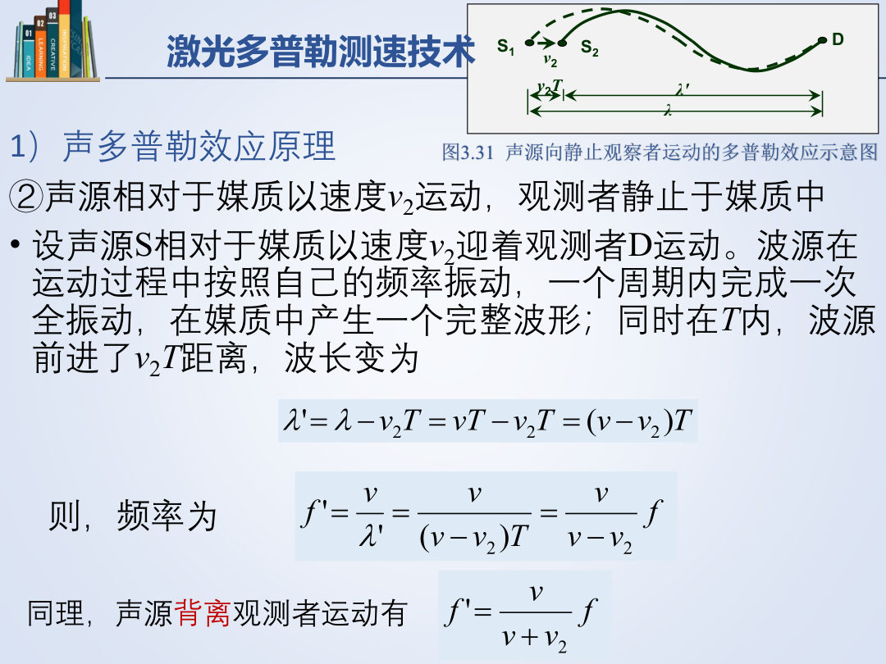

### 本页文字

```text
D                                                      S1       S2     激光多普勒测速技术          v2
                                                                v2T                  λ'
                                                                                     λ

                         声源向静止观察者运动的多普勒效应示意图1）声多普勒效应原理          图3.31
②声源相对于媒质以速度v2运动，观测者静止于媒质中
• 设声源S相对于媒质以速度v2迎着观测者D运动。波源在
 运动过程中按照自己的频率振动，一个周期内完成一次
 全振动，在媒质中产生一个完整波形；同时在T内，波源
 前进了v2T距离，波长变为
         ' = − v T = vT − v T = (v − v )T                                         2             2            2

                         v      v        v
                                  f ' =   =       =          f 则，频率为           '   ( v − v )T   v − v                                                   2              2
                                     v
 同理，声源背离观测者运动有     f ' =          f
                                   v + v                                                           2
```

## 第 70 页

**页面标题/首行：** 激光多普勒测速技术

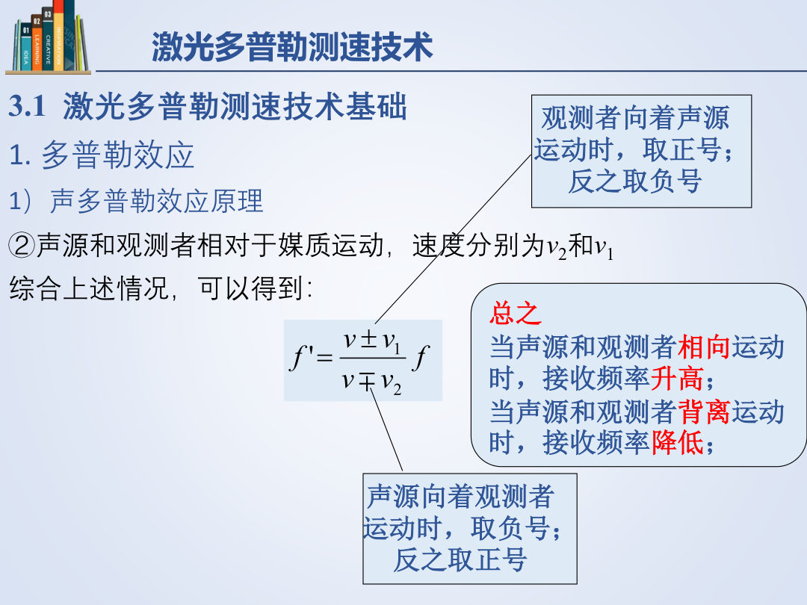

### 本页文字

```text
激光多普勒测速技术

3.1 激光多普勒测速技术基础                    观测者向着声源
                   运动时，取正号；1. 多普勒效应
                     反之取负号
1）声多普勒效应原理
②声源和观测者相对于媒质运动，速度分别为v2和v1
综合上述情况，可以得到：
                  总之
                          v  v                                              1   当声源和观测者相向运动                                    f ' =          f
                          v  v    时，接收频率升高；                                              2
                  当声源和观测者背离运动
                  时，接收频率降低；

             声源向着观测者
             运动时，取负号；
              反之取正号
```

## 第 71 页

**页面标题/首行：** 激光多普勒测速技术

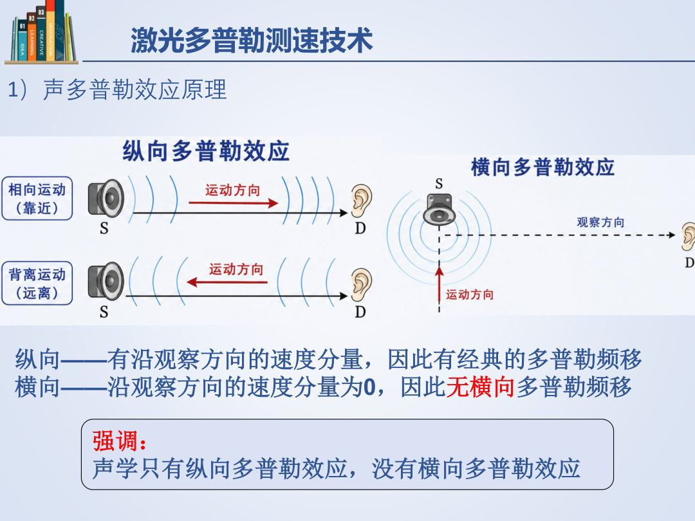

### 本页文字

```text
激光多普勒测速技术

1）声多普勒效应原理

纵向——有沿观察方向的速度分量，因此有经典的多普勒频移
横向——沿观察方向的速度分量为0，因此无横向多普勒频移

    强调：
    声学只有纵向多普勒效应，没有横向多普勒效应
```

## 第 72 页

**页面标题/首行：** y                       y'     激光多普勒测速技术

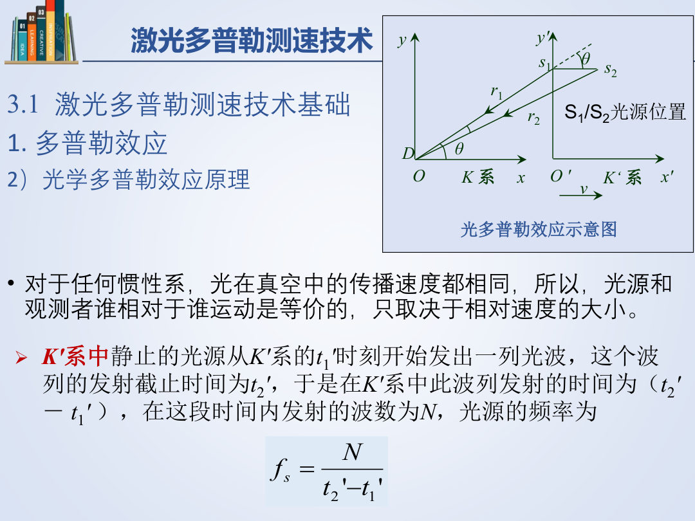

### 本页文字

```text
y                       y'     激光多普勒测速技术
                                                                                     s1   θ                                                                                                s2
                                                                             r1
3.1 激光多普勒测速技术基础                                                                                   r2  S1​/S2光源位置
1. 多普勒效应                                  θ                                D
2）光学多普勒效应原理             O   K 系   x  O '    K‘ 系   x'                                                                          v

                          光多普勒效应示意图

• 对于任何惯性系，光在真空中的传播速度都相同，所以，光源和
 观测者谁相对于谁运动是等价的，只取决于相对速度的大小。

➢K'系中静止的光源从K'系的t1'时刻开始发出一列光波，这个波
  列的发射截止时间为t2'，于是在K'系中此波列发射的时间为（t2'
  － t1' ），在这段时间内发射的波数为N，光源的频率为
                  N
                                  fs =
                                         t  '−t  '                                        2    1
```

## 第 73 页

**页面标题/首行：** y                       y'

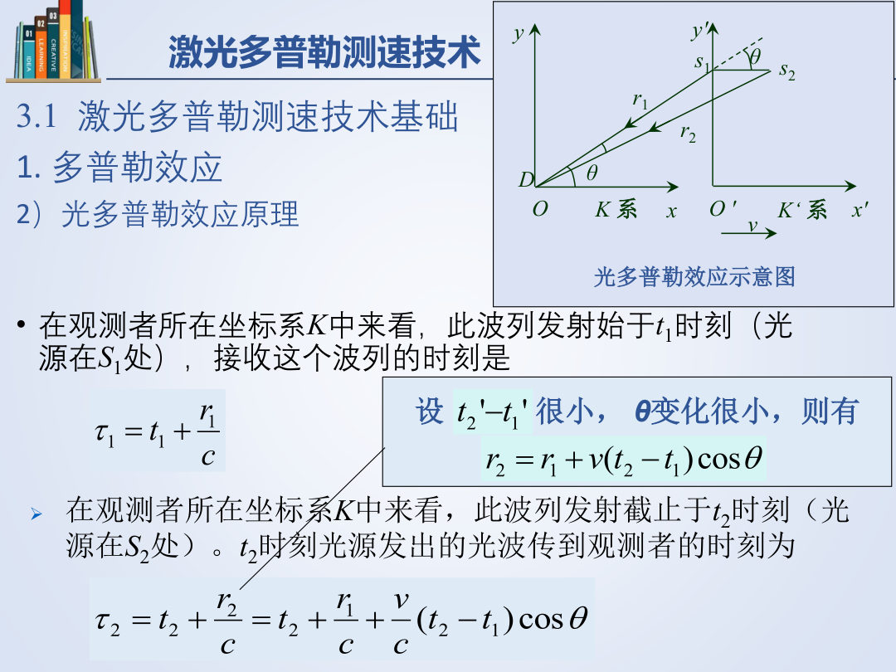

### 本页文字

```text
y                       y'
                                                                   θ    激光多普勒测速技术                          s1                                                                                               s2
                                                                             r1
3.1 激光多普勒测速技术基础                                                                                  r2
1. 多普勒效应                                 θ                               D
2）光多普勒效应原理              O   K 系   x  O '    K‘ 系   x'                                                                          v

                          光多普勒效应示意图

• 在观测者所在坐标系K中来看，此波列发射始于t1时刻（光
 源在S1处），接收这个波列的时刻是
               r             设 t                                                                              '−t                                                                                     ' 很小， θ变化很小，则有                    1                                               2                                                   1    = t +          1    1
             c                     r = r + v (t − t ) cos                                                 2    1       2    1
➢在观测者所在坐标系K中来看，此波列发射截止于t2时刻（光
  源在S2处）。t2时刻光源发出的光波传到观测者的时刻为
               r        r   v
   = t +  2 = t +  1 +   (t − t ) cos         2     2           2              2    1
             c       c   c
```

## 第 74 页

**页面标题/首行：** y                       y'

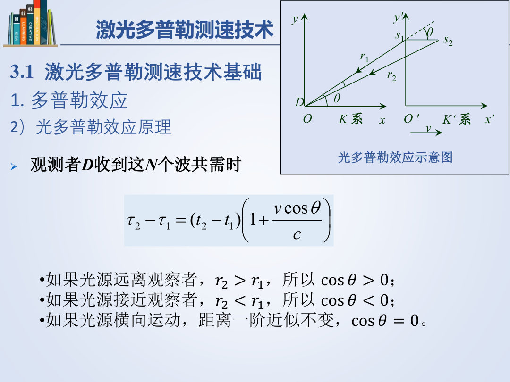

### 本页文字

```text
y                       y'
                                                                   θ    激光多普勒测速技术                          s1                                                                                              s2
                                                                            r1
3.1 激光多普勒测速技术基础                           r2

                               D1. 多普勒效应                                 θ
                                O   K 系   x  O '    K‘ 系   x'
2）光多普勒效应原理                                             v

                          光多普勒效应示意图
➢观测者D收到这N个波共需时

                                v cos                    −                = (t                    − t                                     )+ 1                                2                             1                                    2                                         1
                                      c   

  •如果光源远离观察者，𝑟2                  > 𝑟1，所以 cos 𝜃> 0；
  •如果光源接近观察者，𝑟2                  < 𝑟1，所以 cos 𝜃< 0；
  •如果光源横向运动，距离一阶近似不变，cos 𝜃= 0。
```

## 第 75 页

**页面标题/首行：** 激光多普勒测速技术

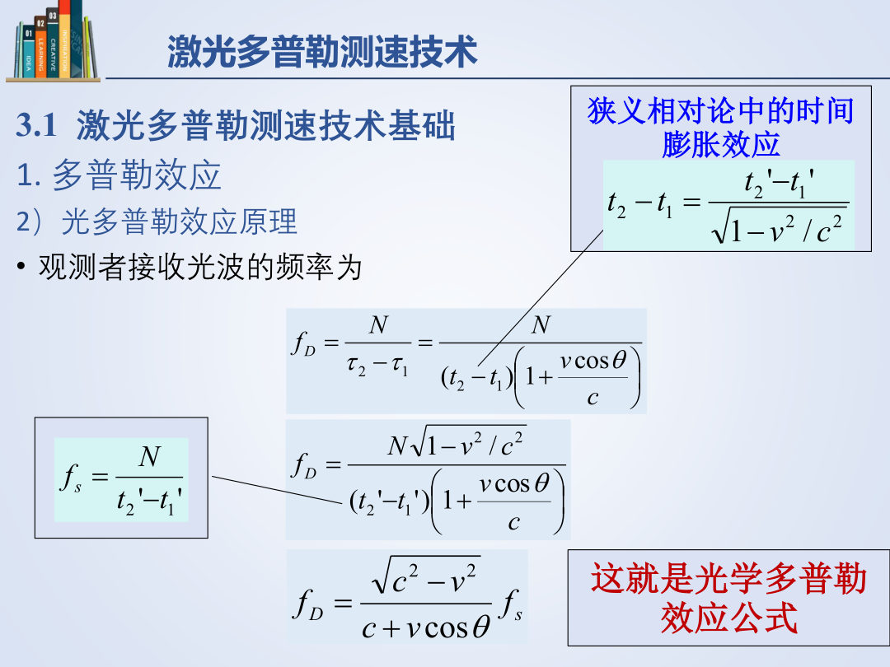

### 本页文字

```text
激光多普勒测速技术

                   狭义相对论中的时间3.1 激光多普勒测速技术基础
                      膨胀效应
1. 多普勒效应                                                           t  '−t  '
                                                                   t − t =      2    1                                                                 2    1
2）光多普勒效应原理                                                    2    2                                             1 − v  / c
• 观测者接收光波的频率为

                    N        N
                           fD =      =                −             v cos                                             2     1    (t − t )+1                                                          2    1                                                                                                        c      
                    N 1 − v 2 / c 2      N                          fD =      fs =                              v cos            t  '−t  '                  (t  '−t )'+1             2    1                        2    1                                                                                   c      
                          c 2 − v 2   这就是光学多普勒
                               f  =                 f                     D                          s    效应公式                        c + v cos
```

## 第 76 页

**页面标题/首行：** 激光多普勒测速技术

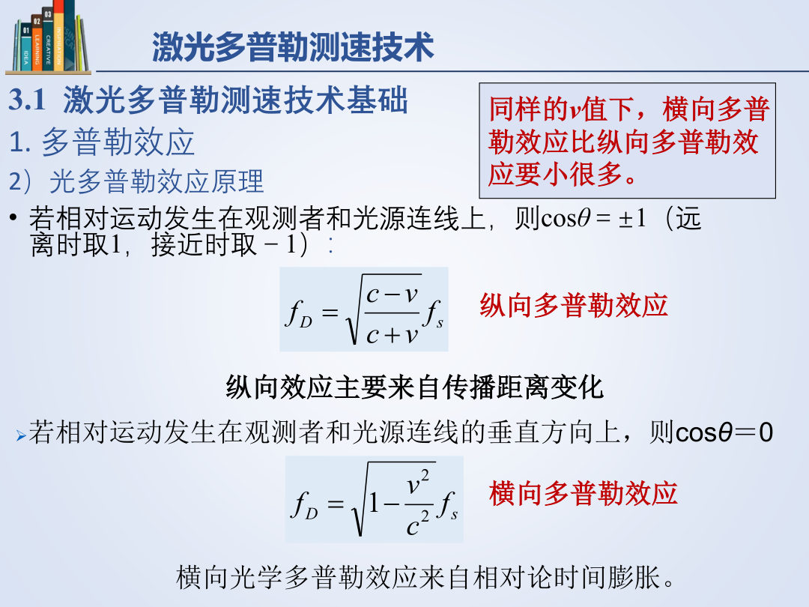

### 本页文字

```text
激光多普勒测速技术
3.1 激光多普勒测速技术基础                   同样的v值下，横向多普
1. 多普勒效应           勒效应比纵向多普勒效
                  应要小很多。2）光多普勒效应原理
• 若相对运动发生在观测者和光源连线上，则cosθ＝±1（远
 离时取1，接近时取－1）：
                            c − v
                                   f  =           f  纵向多普勒效应                        D                   s
                            c + v

        纵向效应主要来自传播距离变化

➢若相对运动发生在观测者和光源连线的垂直方向上，则cosθ＝0

                              v 2                  横向多普勒效应                                   f  = 1−     f                        D            2   s                              c

      横向光学多普勒效应来自相对论时间膨胀。
```

## 第 77 页

**页面标题/首行：** 激光多普勒测速技术

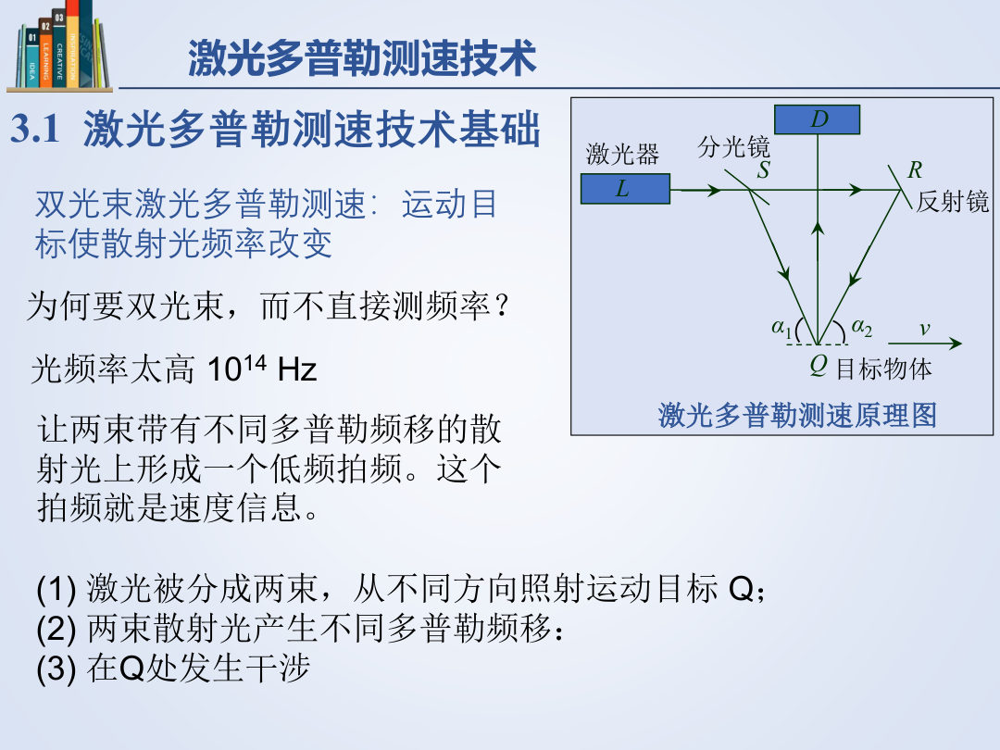

### 本页文字

```text
激光多普勒测速技术

3.1 激光多普勒测速技术基础               D                           分光镜                       激光器
                                                            S         R
                                            L
 双光束激光多普勒测速：运动目                 反射镜
 标使散射光频率改变

为何要双光束，而不直接测频率？
                                                                       α1     α2    v

                                 目标物体 光频率太高 1014 Hz                           Q
                       激光多普勒测速原理图 让两束带有不同多普勒频移的散
 射光上形成一个低频拍频。这个
 拍频就是速度信息。

  (1) 激光被分成两束，从不同方向照射运动目标 Q；
  (2) 两束散射光产生不同多普勒频移：
  (3) 在Q处发生干涉
```

## 第 78 页

**页面标题/首行：** 激光多普勒测速技术

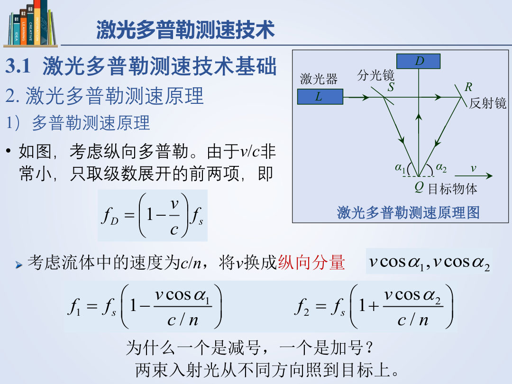

### 本页文字

```text
激光多普勒测速技术

3.1 激光多普勒测速技术基础               D                           分光镜                       激光器
                                                            S         R
                                            L2. 激光多普勒测速原理                                    反射镜
1）多普勒测速原理
• 如图，考虑纵向多普勒。由于v/c非
                                                                       α1     α2    v 常小，只取级数展开的前两项，即
                                            Q 目标物体
                    v                        激光多普勒测速原理图                   f              D            = − 1     f s
                      c 
 ➢考虑流体中的速度为c/n，将v换成纵向分量   v cosv1 , cos2
                  v cos1                     v cos2             f = f  1 −                           f = f  1 +             1       s                           2       s             
                    c / n                        c / n  
       为什么一个是减号，一个是加号？
        两束入射光从不同方向照到目标上。
```

## 第 79 页

**页面标题/首行：** 激光多普勒测速技术

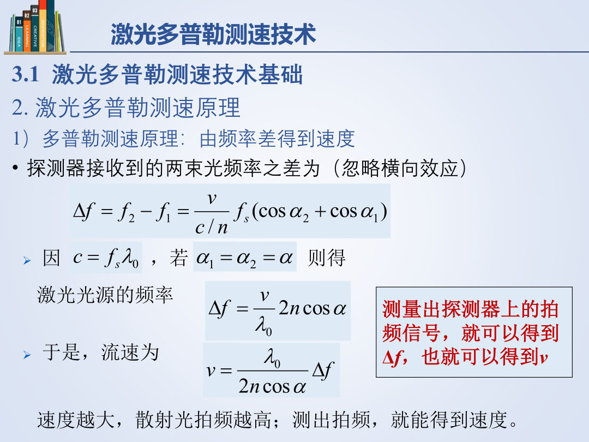

### 本页文字

```text
激光多普勒测速技术

3.1 激光多普勒测速技术基础
2. 激光多普勒测速原理
1）多普勒测速原理：由频率差得到速度
• 探测器接收到的两束光频率之差为（忽略横向效应）
                     v
     f = f − f =       (cos + cos  )                   2     1           sf         2          1
                    c / n
       ，若                  =                      =  则得 ➢因 c = sf0                               1                                     2
 激光光源的频率         v
               f =   2 n cos   测量出探测器上的拍
                                                     0      频信号，就可以得到
 ➢于是，流速为           Δf，也就可以得到v
                     v =       0  f
                     2 n cos 

 速度越大，散射光拍频越高；测出拍频，就能得到速度。
```

## 第 80 页

**页面标题/首行：** 激光多普勒测速技术

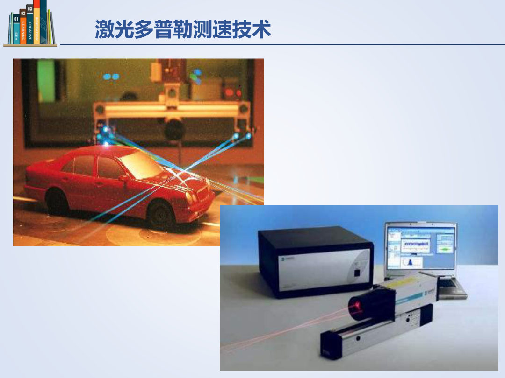

### 本页文字

```text
激光多普勒测速技术
```

## 第 81 页

**页面标题/首行：** 激光多普勒测速技术

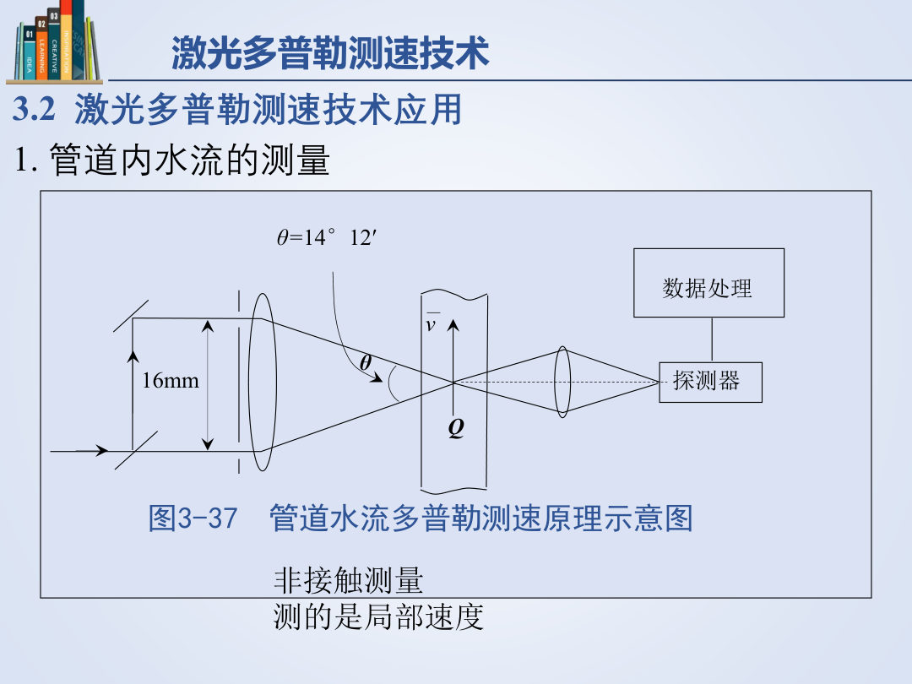

### 本页文字

```text
激光多普勒测速技术
3.2 激光多普勒测速技术应用
1. 管道内水流的测量

                     θ=14°12′

                            数据处理
                                         v

                             θ
         16mm                     探测器

                          Q

       图3-37 管道水流多普勒测速原理示意图

         非接触测量
         测的是局部速度
```

## 第 82 页

**页面标题/首行：** 激光多普勒测速技术

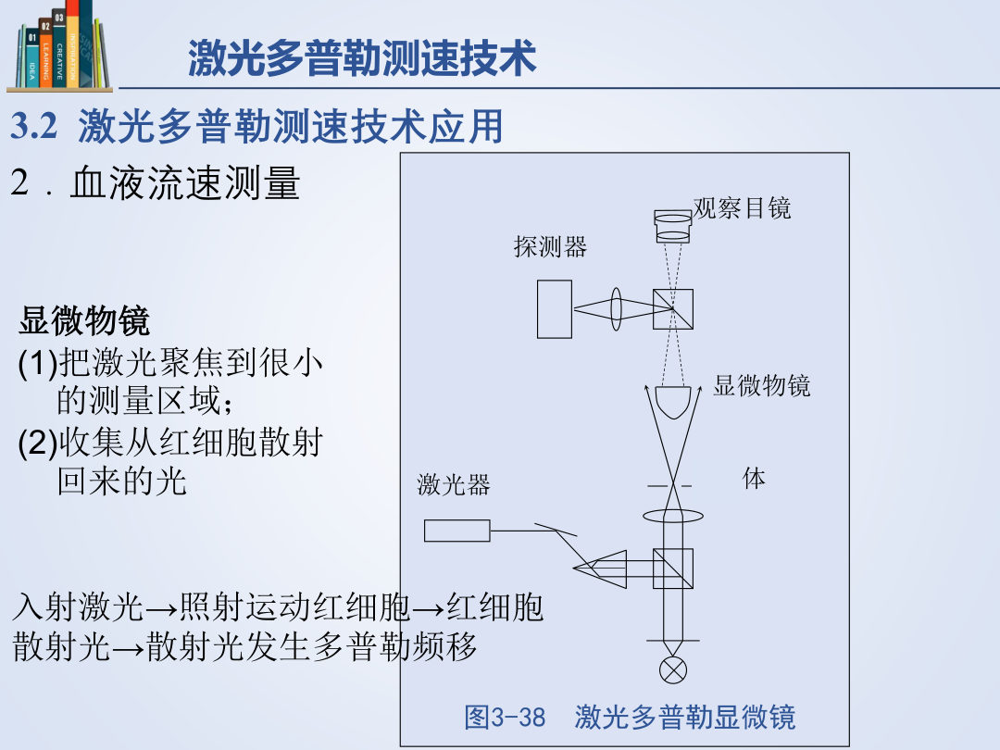

### 本页文字

```text
激光多普勒测速技术

3.2 激光多普勒测速技术应用
2．血液流速测量
                           观察目镜

                    探测器

显微物镜
(1)把激光聚焦到很小
                            显微物镜
 的测量区域；
(2)收集从红细胞散射
 回来的光         激光器         流体

入射激光→照射运动红细胞→红细胞
散射光→散射光发生多普勒频移

                           图3-38 激光多普勒显微镜
```

## 第 83 页

**页面标题/首行：** 多选题 1分


### 本页文字

```text
多选题 1分

  光学多普勒效应具有与声学多普勒效应不同之处
  有

       A     与介质运动有关

        B     分为纵向效应和横向效应

       C     只与光源和观测者之间的相对运动有关

      D     没有横向效应

                                提交
```

## 第 84 页

**页面标题/首行：** 激光多普勒测速技术

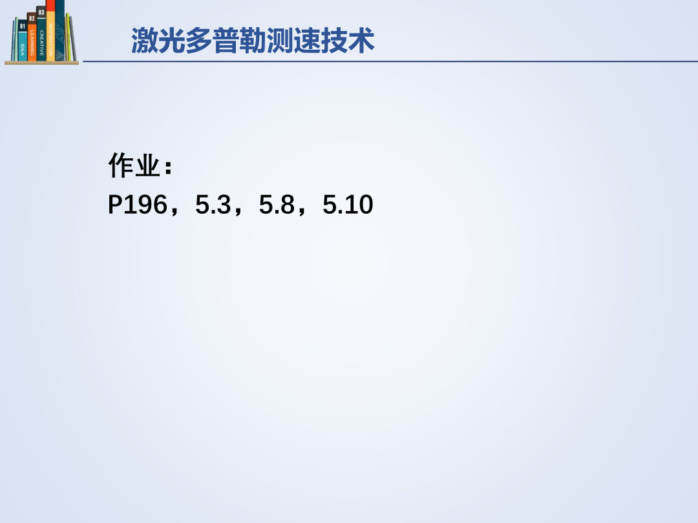

### 本页文字

```text
激光多普勒测速技术

作业：
P196，5.3，5.8，5.10
```
