# 第七章 激光衍射测试技术

- 源文件：`第七章 激光衍射测试技术.pdf`
- 页数：90
- 转换方式：每页保留原始页面截图，并提取 PDF 文本层作为可检索内容。
- 说明：公式、复杂图形、版式细节以页面截图为准；文字区用于搜索和快速复习。

## 页面索引

- [第 1 页：1. 夫琅禾费衍射 光源及观察屏距障碍物均为无限远.](#第-1-页)
- [第 2 页：广州大学](#第-2-页)
- [第 3 页：第七章                     激光衍射测试技术基础](#第-3-页)
- [第 4 页：• 衍射：光学测量中绕不开的空间响应](#第-4-页)
- [第 5 页：菲涅耳衍射 vs 夫琅禾夫衍射     引言](#第-5-页)
- [第 6 页：菲涅耳衍射 vs 夫琅禾夫衍射    引言](#第-6-页)
- [第 7 页：激光衍射测试技术基础](#第-7-页)
- [第 8 页：激光衍射测试技术基础](#第-8-页)
- [第 9 页：激光衍射测试技术基础](#第-9-页)
- [第 10 页：夫琅禾费衍射](#第-10-页)
- [第 11 页：夫琅禾费衍射：为什么会有明暗条纹？](#第-11-页)
- [第 12 页：激光衍射测试技术基础](#第-12-页)
- [第 13 页：单缝夫琅禾夫衍射图样](#第-13-页)
- [第 14 页：夫琅禾费衍射](#第-14-页)
- [第 15 页：激光衍射测试技术基础](#第-15-页)
- [第 16 页：激光衍射测试技术基础](#第-16-页)
- [第 17 页：从单缝衍射到圆孔衍射](#第-17-页)
- [第 18 页：从单缝衍射到圆孔衍射](#第-18-页)
- [第 19 页：艾里斑大小：由第一暗环决定](#第-19-页)
- [第 20 页：艾里斑大小：由第一暗环决定](#第-20-页)
- [第 21 页：激光衍射测试技术基础](#第-21-页)
- [第 22 页：激光衍射测试技术基础](#第-22-页)
- [第 23 页：激光粒度仪](#第-23-页)
- [第 24 页：第 24 页](#第-24-页)
- [第 25 页：激光衍射测量方法](#第-25-页)
- [第 26 页：圆孔衍射在光电检测中的意义](#第-26-页)
- [第 27 页：激光衍射测量方法](#第-27-页)
- [第 28 页：激光衍射测试技术基础：间隙测量法](#第-28-页)
- [第 29 页：激光衍射测试技术基础](#第-29-页)
- [第 30 页：激光衍射测试技术基础](#第-30-页)
- [第 31 页：激光衍射测试技术基础](#第-31-页)
- [第 32 页：激光衍射测量方法](#第-32-页)
- [第 33 页：激光衍射测量方法](#第-33-页)
- [第 34 页：激光衍射测量方法](#第-34-页)
- [第 35 页：激光衍射测量方法](#第-35-页)
- [第 36 页：激光衍射测量方法](#第-36-页)
- [第 37 页：激光衍射测量方法](#第-37-页)
- [第 38 页：激光衍射测量方法](#第-38-页)
- [第 39 页：激光衍射测量方法](#第-39-页)
- [第 40 页：激光衍射测量方法](#第-40-页)
- [第 41 页：激光衍射测量方法](#第-41-页)
- [第 42 页：激光衍射测量方法](#第-42-页)
- [第 43 页：激光衍射测量方法](#第-43-页)
- [第 44 页：激光衍射测量方法](#第-44-页)
- [第 45 页：SCreate N3 微型微细线激光测径仪](#第-45-页)
- [第 46 页：激光衍射测量方法](#第-46-页)
- [第 47 页：多选题 1分](#第-47-页)
- [第 48 页：填空题 1分](#第-48-页)
- [第 49 页：3. 夫琅禾费圆孔衍射](#第-49-页)
- [第 50 页：衍射光栅：把多缝衍射做成光学元件](#第-50-页)
- [第 51 页：衍射光栅](#第-51-页)
- [第 52 页：从双缝/多缝过渡到光栅](#第-52-页)
- [第 53 页：光栅图样](#第-53-页)
- [第 54 页：光栅图样](#第-54-页)
- [第 55 页：光栅图样](#第-55-页)
- [第 56 页：衍射光栅](#第-56-页)
- [第 57 页：衍射光栅](#第-57-页)
- [第 58 页：光栅方程](#第-58-页)
- [第 59 页：衍射光栅](#第-59-页)
- [第 60 页：衍射光栅](#第-60-页)
- [第 61 页：衍射光栅](#第-61-页)
- [第 62 页：衍射光栅](#第-62-页)
- [第 63 页：衍射光栅](#第-63-页)
- [第 64 页：https://demonstrations.wolfram.com/Multipl](#第-64-页)
- [第 65 页：狭缝数量从1变化到10](#第-65-页)
- [第 66 页：实际光栅：成百上千条刻线带来的效果](#第-66-页)
- [第 67 页：衍射光栅](#第-67-页)
- [第 68 页：衍射光栅](#第-68-页)
- [第 69 页：衍射光栅](#第-69-页)
- [第 70 页：衍射光栅](#第-70-页)
- [第 71 页：荧光光谱仪 / 二级衍射问题](#第-71-页)
- [第 72 页：荧光光谱仪 / 二级衍射问题](#第-72-页)
- [第 73 页：荧光光谱仪 / 二级衍射问题](#第-73-页)
- [第 74 页：荧光光谱仪 / 二级衍射问题](#第-74-页)
- [第 75 页：衍射光栅-反射光栅](#第-75-页)
- [第 76 页：衍射光栅-闪耀光栅](#第-76-页)
- [第 77 页：衍射光栅-闪耀光栅](#第-77-页)
- [第 78 页：衍射光栅](#第-78-页)
- [第 79 页：衍射光栅](#第-79-页)
- [第 80 页：填空题 1分](#第-80-页)
- [第 81 页：衍射光栅-一维光栅](#第-81-页)
- [第 82 页：衍射光栅-二维光栅](#第-82-页)
- [第 83 页：衍射光栅-二维光栅](#第-83-页)
- [第 84 页：拓展：晶体作为天然三维光栅](#第-84-页)
- [第 85 页：衍射光栅应用例子](#第-85-页)
- [第 86 页：衍射光栅](#第-86-页)
- [第 87 页：衍射光栅](#第-87-页)
- [第 88 页：光波分复用器——把不同波长分配到不同光纤通道](#第-88-页)
- [第 89 页：光纤光栅：用反射峰漂移测温度和应变](#第-89-页)
- [第 90 页：光纤光栅：用反射峰漂移测温度和应变](#第-90-页)

## 第 1 页

**页面标题/首行：** 1. 夫琅禾费衍射 光源及观察屏距障碍物均为无限远.

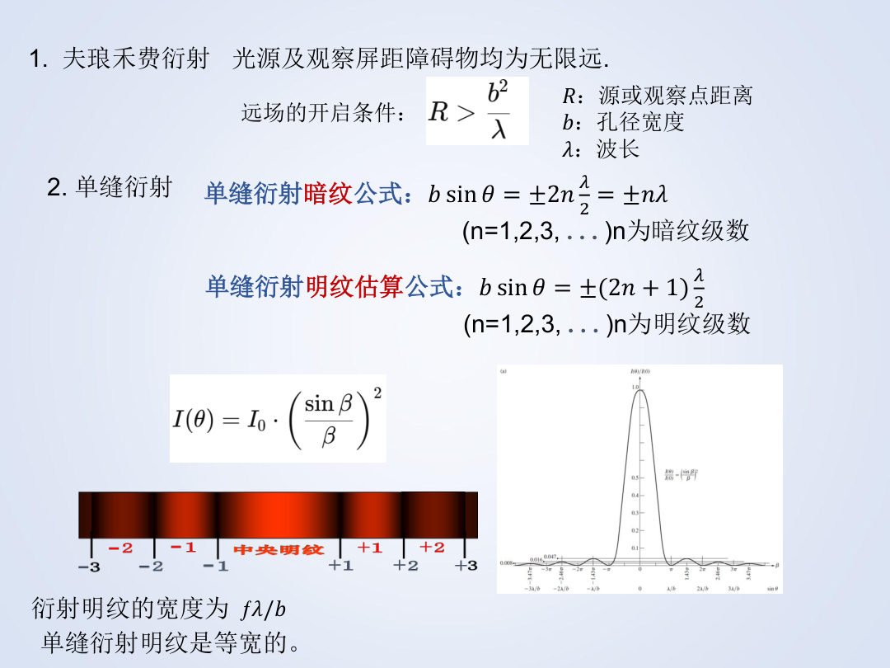

### 本页文字

```text
1. 夫琅禾费衍射 光源及观察屏距障碍物均为无限远.

                         𝑅：源或观察点距离
          远场的开启条件：                          𝑏：孔径宽度
                           𝜆：波长
  2. 单缝衍射                                      𝜆        单缝衍射暗纹公式：𝑏sin 𝜃= ±2𝑛 = ±𝑛𝜆
                                                     2
                                        (n=1,2,3, ...)n为暗纹级数

                                                               𝜆
        单缝衍射明纹估算公式：𝑏sin 𝜃= ±(2𝑛+ 1)
                                                                2
                                        (n=1,2,3, ...)n为明纹级数

衍射明纹的宽度为𝜆/𝑏
单缝衍射明纹是等宽的。
```

## 第 2 页

**页面标题/首行：** 广州大学


### 本页文字

```text
广州大学

光电检测技术
     方佳文

    jiawen.fang@gzhu.edu.cn
```

## 第 3 页

**页面标题/首行：** 第七章                     激光衍射测试技术基础

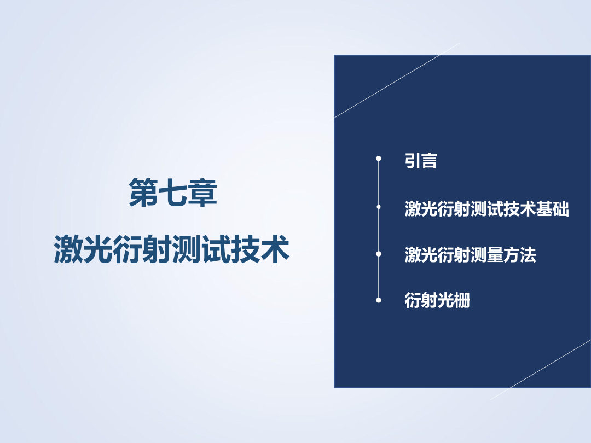

### 本页文字

```text
引言
   第七章                     激光衍射测试技术基础
激光衍射测试技术       激光衍射测量方法

                     衍射光栅
```

## 第 4 页

**页面标题/首行：** • 衍射：光学测量中绕不开的空间响应

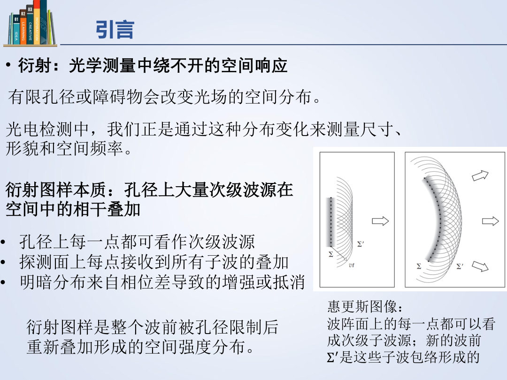

### 本页文字

```text
引言

 • 衍射：光学测量中绕不开的空间响应

有限孔径或障碍物会改变光场的空间分布。

光电检测中，我们正是通过这种分布变化来测量尺寸、
形貌和空间频率。

衍射图样本质：孔径上大量次级波源在
空间中的相干叠加

• 孔径上每一点都可看作次级波源
• 探测面上每点接收到所有子波的叠加
• 明暗分布来自相位差导致的增强或抵消

                       惠更斯图像：
  衍射图样是整个波前被孔径限制后   波阵面上的每一点都可以看
                       成次级子波源；新的波前  重新叠加形成的空间强度分布。
                          Σ′是这些子波包络形成的
```

## 第 5 页

**页面标题/首行：** 菲涅耳衍射 vs 夫琅禾夫衍射     引言

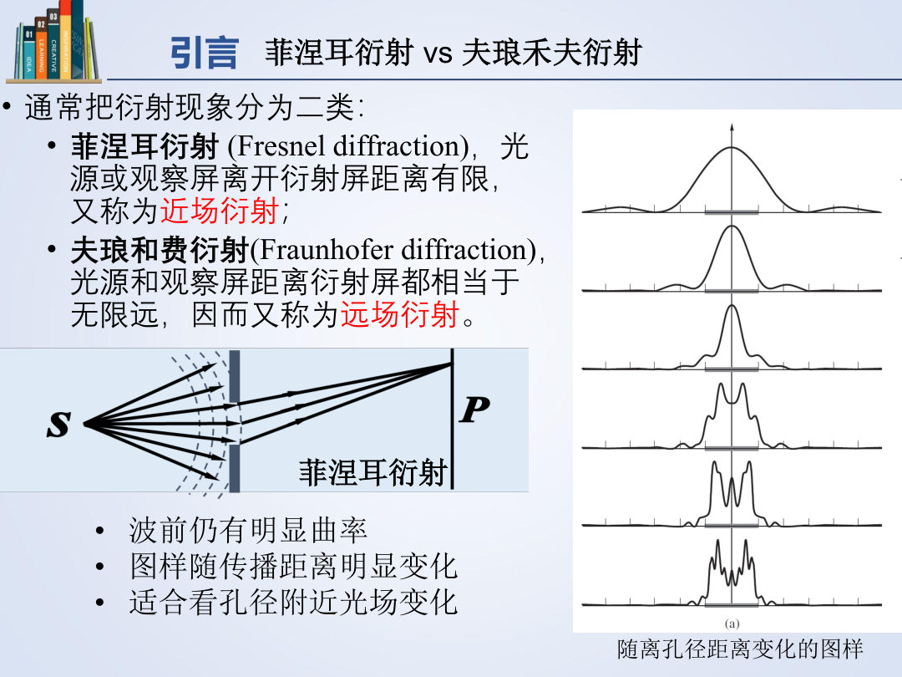

### 本页文字

```text
菲涅耳衍射 vs 夫琅禾夫衍射     引言
• 通常把衍射现象分为二类：
    • 菲涅耳衍射 (Fresnel diffraction)，光
  源或观察屏离开衍射屏距离有限，
  又称为近场衍射；
    • 夫琅和费衍射(Fraunhofer diffraction)，
  光源和观察屏距离衍射屏都相当于
  无限远，因而又称为远场衍射。

          菲涅耳衍射

         • 波前仍有明显曲率
         • 图样随传播距离明显变化
         • 适合看孔径附近光场变化

                           随离孔径距离变化的图样
```

## 第 6 页

**页面标题/首行：** 菲涅耳衍射 vs 夫琅禾夫衍射    引言

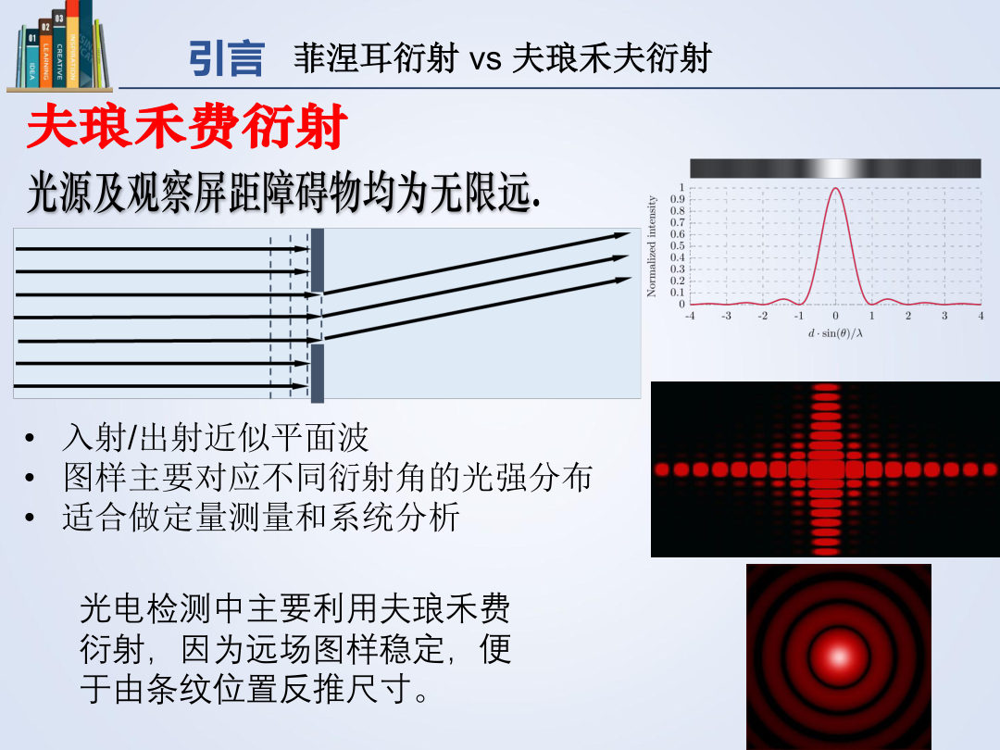

### 本页文字

```text
菲涅耳衍射 vs 夫琅禾夫衍射    引言
夫琅禾费衍射
        光源及观察屏距障碍物均为无限远

• 入射/出射近似平面波
• 图样主要对应不同衍射角的光强分布
• 适合做定量测量和系统分析

  光电检测中主要利用夫琅禾费
  衍射，因为远场图样稳定，便
  于由条纹位置反推尺寸。
```

## 第 7 页

**页面标题/首行：** 激光衍射测试技术基础

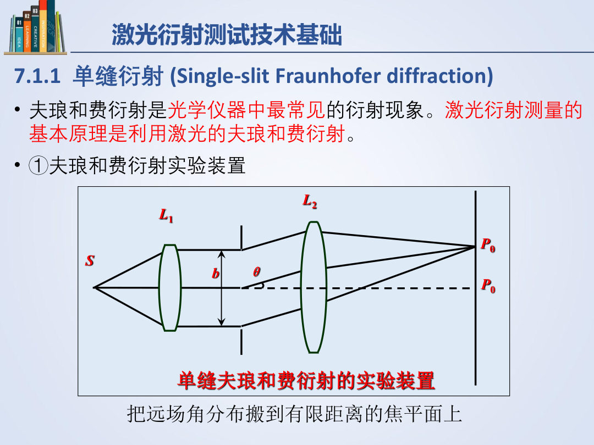

### 本页文字

```text
激光衍射测试技术基础

7.1.1 单缝衍射 (Single-slit Fraunhofer diffraction)
• 夫琅和费衍射是光学仪器中最常见的衍射现象。激光衍射测量的
 基本原理是利用激光的夫琅和费衍射。
• ①夫琅和费衍射实验装置

                                         L2
                     L1

                                                                 Pθ
         S
                           b θ
                                                                  P0

        单缝夫琅和费衍射的实验装置

      把远场角分布搬到有限距离的焦平面上
```

## 第 8 页

**页面标题/首行：** 激光衍射测试技术基础

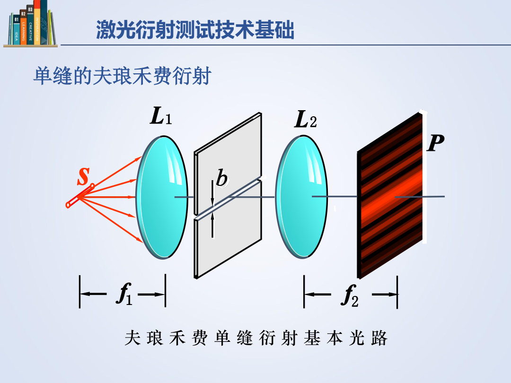

### 本页文字

```text
激光衍射测试技术基础

单缝的夫琅禾费衍射

       L                 L
                         P
     s          b

          f                         f
     夫 琅 禾 费 单 缝 衍 射 基 本 光 路
```

## 第 9 页

**页面标题/首行：** 激光衍射测试技术基础

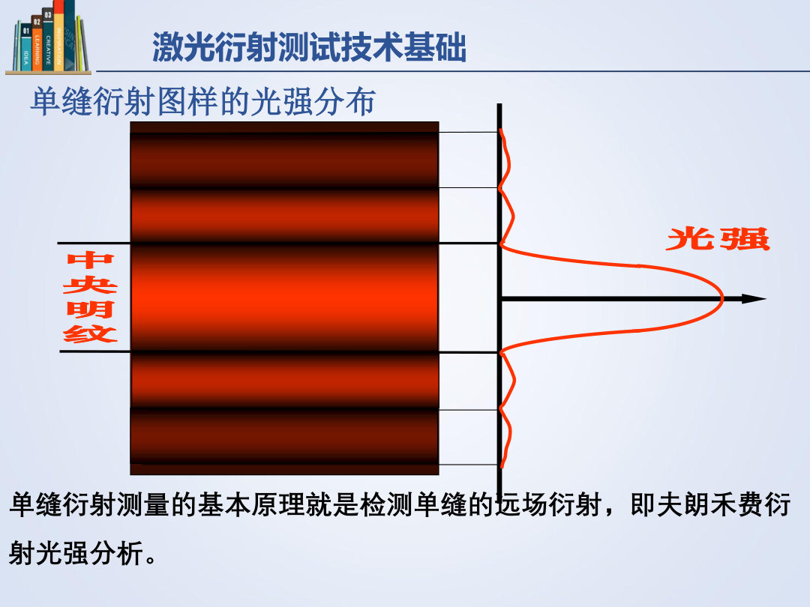

### 本页文字

```text
激光衍射测试技术基础

 单缝衍射图样的光强分布

 央                光强
 明
 纹

单缝衍射测量的基本原理就是检测单缝的远场衍射，即夫朗禾费衍

射光强分析。
```

## 第 10 页

**页面标题/首行：** 夫琅禾费衍射

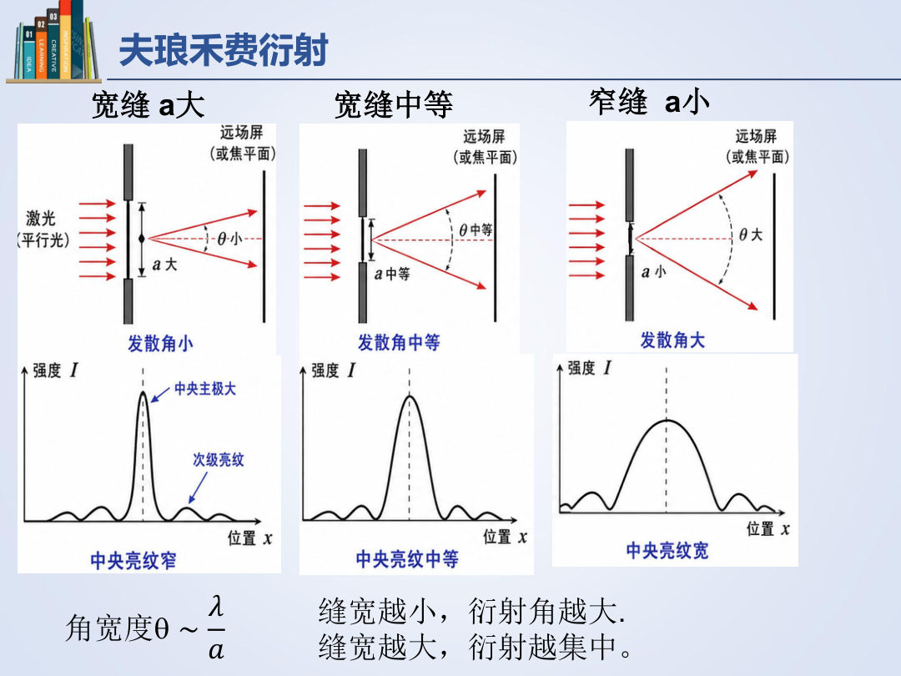

### 本页文字

```text
夫琅禾费衍射
 宽缝 a大    宽缝中等    窄缝 a小

角宽度∼𝜆   缝宽越小，衍射角越大.
         𝑎   缝宽越大，衍射越集中。
```

## 第 11 页

**页面标题/首行：** 夫琅禾费衍射：为什么会有明暗条纹？

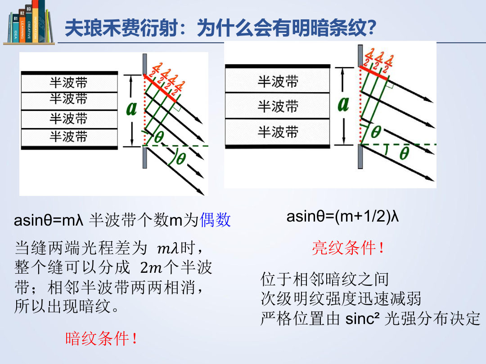

### 本页文字

```text
夫琅禾费衍射：为什么会有明暗条纹？

                                  asinθ=(m+1/2)λasinθ=mλ 半波带个数m为偶数

当缝两端光程差为 𝑚𝜆时，      亮纹条件！
整个缝可以分成 2𝑚个半波
               位于相邻暗纹之间带；相邻半波带两两相消，
               次级明纹强度迅速减弱所以出现暗纹。
               严格位置由 sinc² 光强分布决定
   暗纹条件！
```

## 第 12 页

**页面标题/首行：** 激光衍射测试技术基础

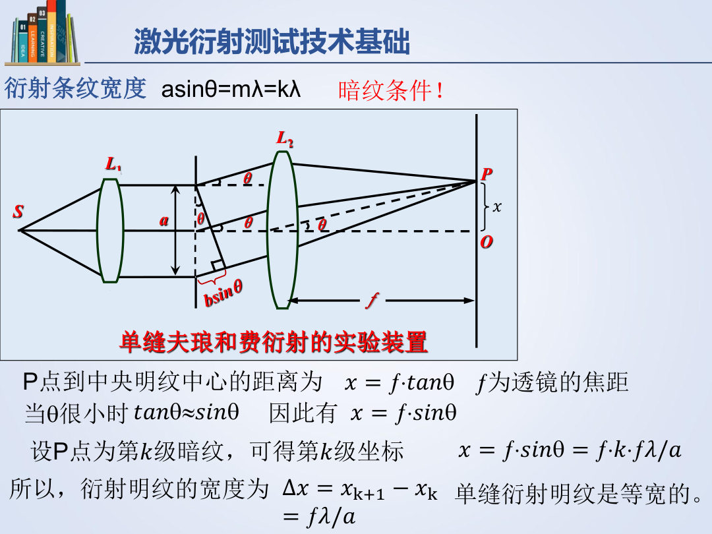

### 本页文字

```text
激光衍射测试技术基础

衍射条纹宽度 asinθ=mλ=kλ  暗纹条件！

                                L2
            L1                                            P          θ

                                                    𝑥 S                 a          θ  θ
                                     O

                      

     单缝夫琅和费衍射的实验装置
 P点到中央明纹中心的距离为 𝑥= 𝑡𝑎𝑛 为透镜的焦距
 当很小时𝑡𝑎𝑛𝑠𝑖𝑛 因此有 𝑥= 𝑠𝑖𝑛
 设P点为第𝑘级暗纹，可得第𝑘级坐标   𝑥= 𝑠𝑖𝑛= 𝑘𝜆/𝑎
所以，衍射明纹的宽度为Δ𝑥= 𝑥k+1 −𝑥k 单缝衍射明纹是等宽的。
                = 𝜆/𝑎
```

## 第 13 页

**页面标题/首行：** 单缝夫琅禾夫衍射图样

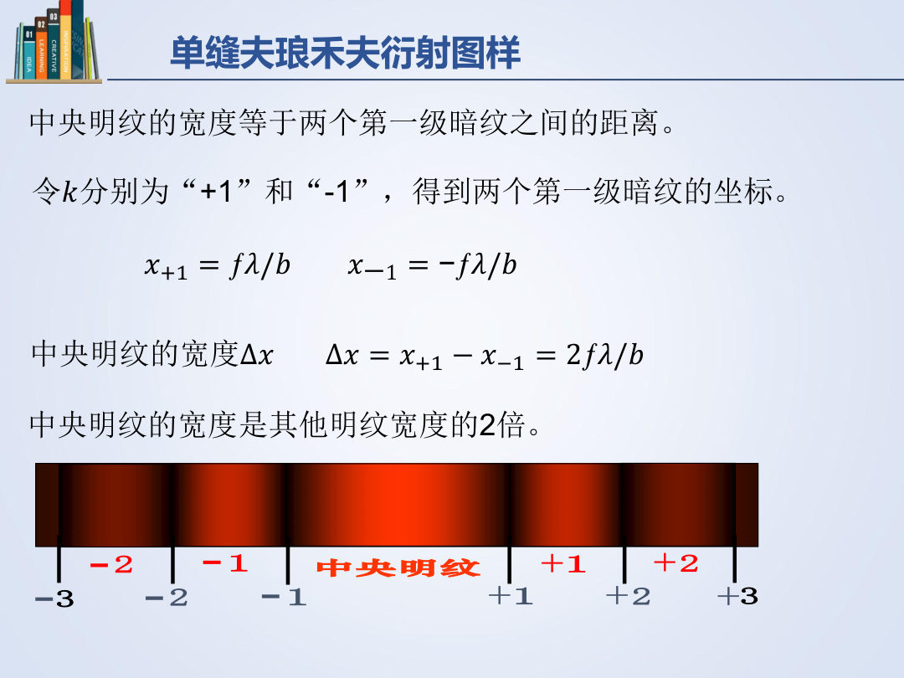

### 本页文字

```text
单缝夫琅禾夫衍射图样

中央明纹的宽度等于两个第一级暗纹之间的距离。

令𝑘分别为“+1”和“-1”，得到两个第一级暗纹的坐标。

        = 𝜆/𝑏     = −𝜆/𝑏        𝑥+1         𝑥−1

中央明纹的宽度Δ𝑥  Δ𝑥=      = 2𝜆/𝑏                         𝑥+1 −𝑥−1

中央明纹的宽度是其他明纹宽度的2倍。

      中央明纹
```

## 第 14 页

**页面标题/首行：** 夫琅禾费衍射

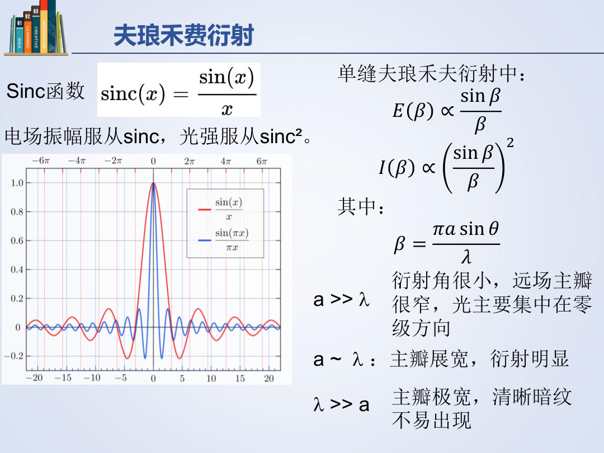

### 本页文字

```text
夫琅禾费衍射

                 单缝夫琅禾夫衍射中：
Sinc函数
                         𝐸𝛽∝sin 𝛽
                                       𝛽
电场振幅服从sinc，光强服从sinc²。                                                           2
                                                     sin 𝛽
                    𝐼𝛽∝
                                      𝛽
                 其中：
                                         𝜋𝑎sin 𝜃
                       𝛽=
                                            𝜆
                   衍射角很小，远场主瓣
                            a >>                    很窄，光主要集中在零
                   级方向
                            a ~ ：主瓣展宽，衍射明显

                   主瓣极宽，清晰暗纹                       >> a
                   不易出现
```

## 第 15 页

**页面标题/首行：** 激光衍射测试技术基础

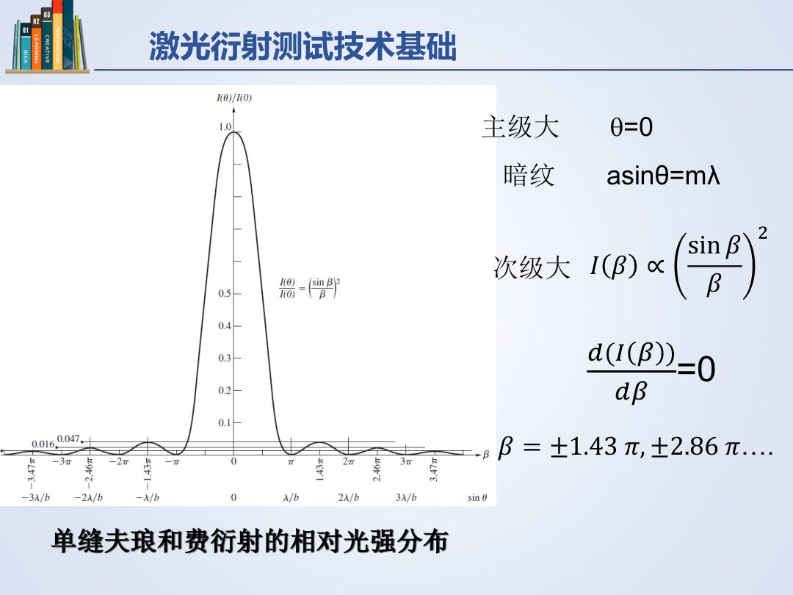

### 本页文字

```text
激光衍射测试技术基础

                主级大   =0

                 暗纹    asinθ=mλ

                                                               2
                                                         sin 𝛽
               次级大𝐼𝛽∝
                                         𝛽

                              𝑑(𝐼𝛽)
                      𝑑𝛽=0

                    𝛽= ±1.43 𝜋, ±2.86 𝜋….

单缝夫琅和费衍射的相对光强分布
```

## 第 16 页

**页面标题/首行：** 激光衍射测试技术基础

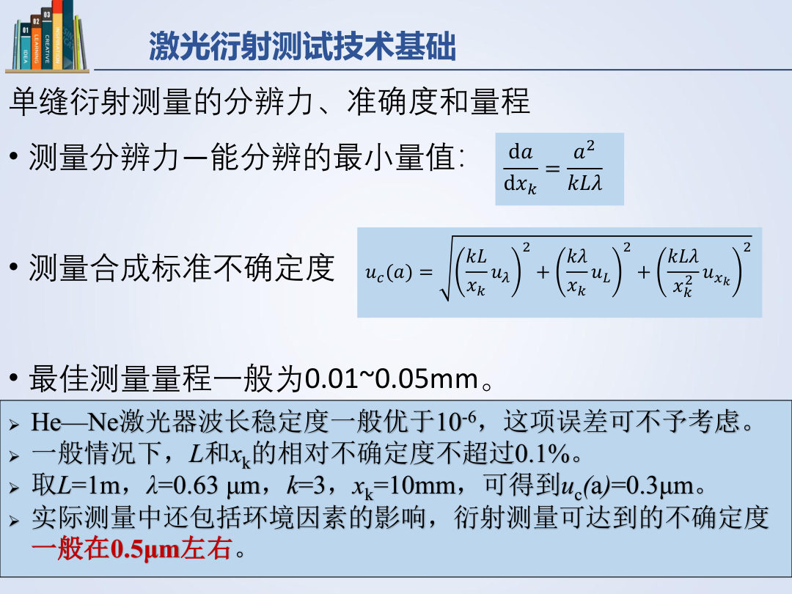

### 本页文字

```text
激光衍射测试技术基础

单缝衍射测量的分辨力、准确度和量程

• 测量分辨力—能分辨的最小量值：  d𝑎    𝑎2                                 =
                                            d𝑥𝑘   𝑘𝐿𝜆

                                                             2           2             2
• 测量合成标准不确定度   𝑢𝑐(𝑎) =   𝑘𝐿 𝑢𝜆  + 𝑘𝜆 𝑢𝐿  + 𝑘𝐿𝜆2 𝑢𝑥𝑘
                                                𝑥𝑘        𝑥𝑘         𝑥𝑘

• 最佳测量量程一般为0.01~0.05mm。
➢He—Ne激光器波长稳定度一般优于10-6，这项误差可不予考虑。
➢一般情况下，L和xk的相对不确定度不超过0.1%。
➢取L=1m，λ=0.63 μm，k=3，xk=10mm，可得到uc(a)=0.3μm。
➢实际测量中还包括环境因素的影响，衍射测量可达到的不确定度
 一般在0.5μm左右。
```

## 第 17 页

**页面标题/首行：** 从单缝衍射到圆孔衍射

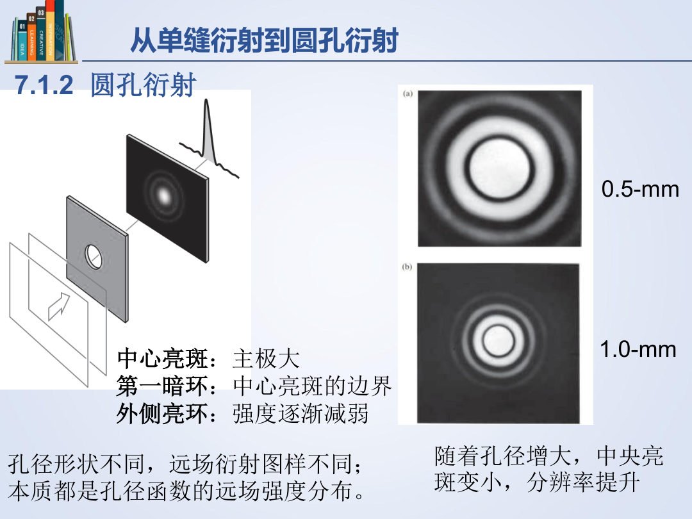

### 本页文字

```text
从单缝衍射到圆孔衍射
 7.1.2 圆孔衍射

                                              0.5-mm

                                             1.0-mm     中心亮斑：主极大
     第一暗环：中心亮斑的边界
     外侧亮环：强度逐渐减弱

                  随着孔径增大，中央亮孔径形状不同，远场衍射图样不同；
                  斑变小，分辨率提升本质都是孔径函数的远场强度分布。
```

## 第 18 页

**页面标题/首行：** 从单缝衍射到圆孔衍射

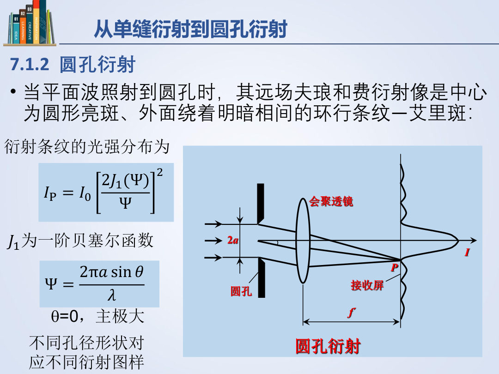

### 本页文字

```text
从单缝衍射到圆孔衍射

 7.1.2 圆孔衍射
 • 当平面波照射到圆孔时，其远场夫琅和费衍射像是中心
 为圆形亮斑、外面绕着明暗相间的环行条纹—艾里斑：

衍射条纹的光强分布为

                      2
            2𝐽1(Ψ)
      𝐼P = 𝐼0
         Ψ                会聚透镜

𝐽1为一阶贝塞尔函数             2a                                                                                                           I
                                                         P         2π𝑎sin 𝜃
                               接收屏   Ψ =                    圆孔            𝜆
    =0，主极大                                                        fˊ

 不同孔径形状对                 圆孔衍射
 应不同衍射图样
```

## 第 19 页

**页面标题/首行：** 艾里斑大小：由第一暗环决定

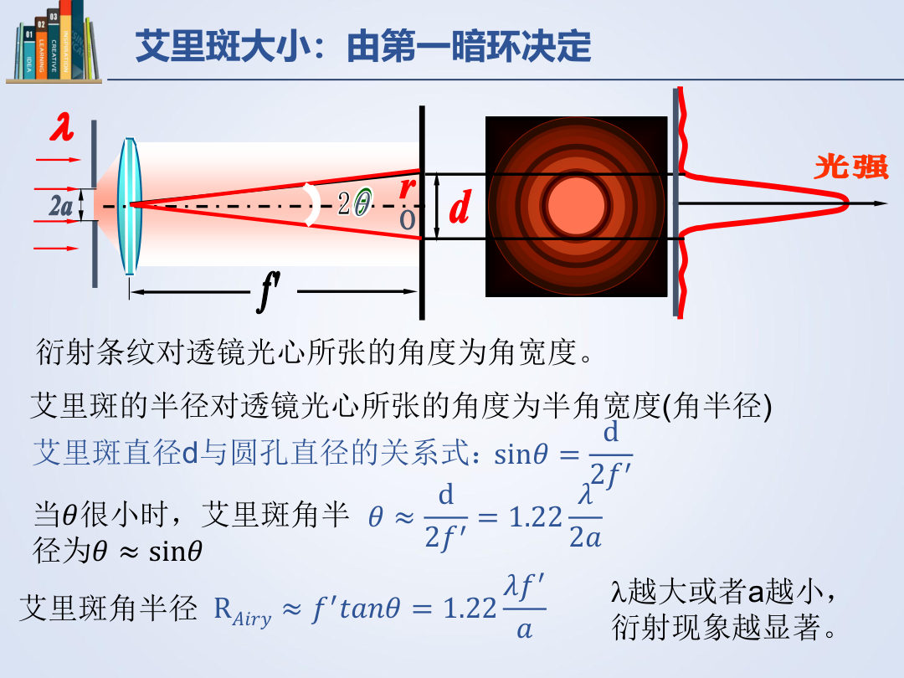

### 本页文字

```text
艾里斑大小：由第一暗环决定

 
                 光强
                   d 2            22

                 f'
 衍射条纹对透镜光心所张的角度为角宽度。

艾里斑的半径对透镜光心所张的角度为半角宽度(角半径)
                                   d
 艾里斑直径d与圆孔直径的关系式：sin𝜃=
                                        2𝑓′
                                    𝜆当𝜃很小时，艾里斑角半 𝜃≈d = 1.22
                            2𝑓′      2𝑎 径为𝜃≈sin𝜃
                                   𝜆𝑓′                      越大或者a越小，
                              1.22艾里斑角半径R𝐴𝑖𝑟𝑦≈𝑓′𝑡𝑎𝑛𝜃=                              𝑎   衍射现象越显著。
```

## 第 20 页

**页面标题/首行：** 艾里斑大小：由第一暗环决定

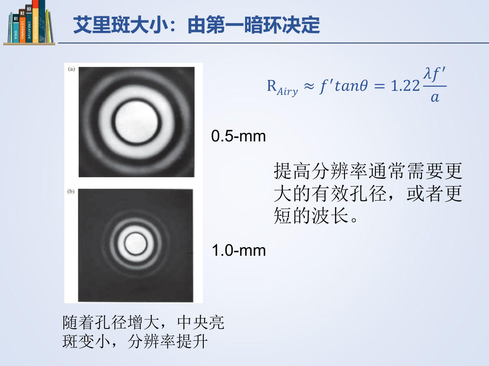

### 本页文字

```text
艾里斑大小：由第一暗环决定

                                                𝜆𝑓′
                                           1.22                      R𝐴𝑖𝑟𝑦≈𝑓′𝑡𝑎𝑛𝜃=                                         𝑎

                0.5-mm

           提高分辨率通常需要更
           大的有效孔径，或者更
           短的波长。

                1.0-mm

随着孔径增大，中央亮
斑变小，分辨率提升
```

## 第 21 页

**页面标题/首行：** 激光衍射测试技术基础

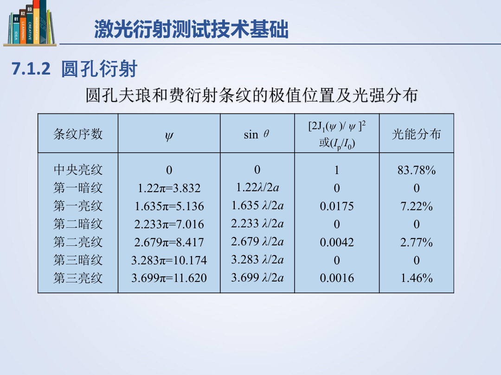

### 本页文字

```text
激光衍射测试技术基础

7.1.2 圆孔衍射
    圆孔夫琅和费衍射条纹的极值位置及光强分布

                                                                [2J1(ψ )/ ψ ]2
   条纹序数       ψ         sinθ         光能分布
                                                                    或(Ip/I0)

   中央亮纹          0             0            1         83.78%
   第一暗纹      1.22π=3.832      1.22λ/2a         0            0
   第一亮纹     1.635π=5.136     1.635 λ/2a      0.0175       7.22%
   第二暗纹     2.233π=7.016     2.233 λ/2a        0            0
   第二亮纹     2.679π=8.417     2.679 λ/2a      0.0042       2.77%
   第三暗纹     3.283π=10.174    3.283 λ/2a        0            0
   第三亮纹     3.699π=11.620    3.699 λ/2a      0.0016       1.46%
```

## 第 22 页

**页面标题/首行：** 激光衍射测试技术基础

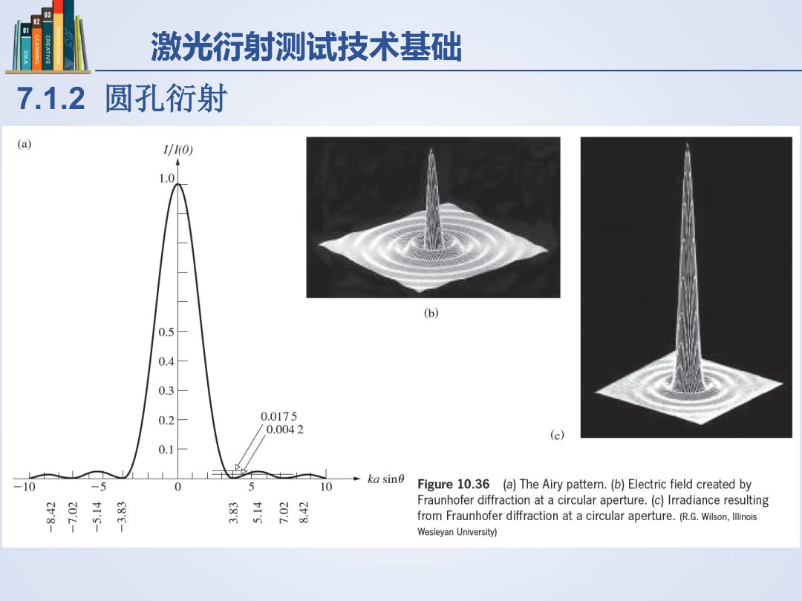

### 本页文字

```text
激光衍射测试技术基础
7.1.2 圆孔衍射
```

## 第 23 页

**页面标题/首行：** 激光粒度仪


### 本页文字

```text
激光粒度仪
```

## 第 24 页

**页面标题/首行：** 第 24 页

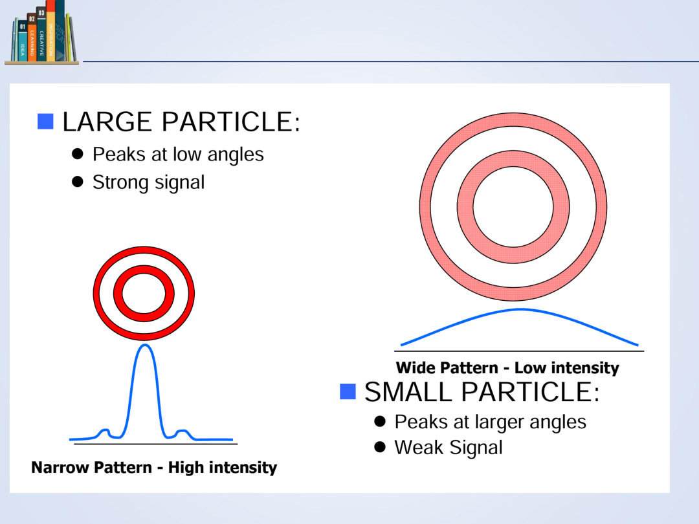

### 本页文字

> 本页未检测到可提取文本，请以页面截图为准。

## 第 25 页

**页面标题/首行：** 激光衍射测量方法

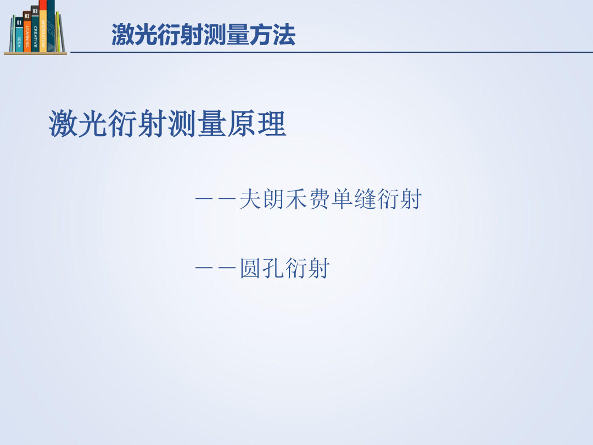

### 本页文字

```text
激光衍射测量方法

激光衍射测量原理

      －－夫朗禾费单缝衍射

      －－圆孔衍射
```

## 第 26 页

**页面标题/首行：** 圆孔衍射在光电检测中的意义

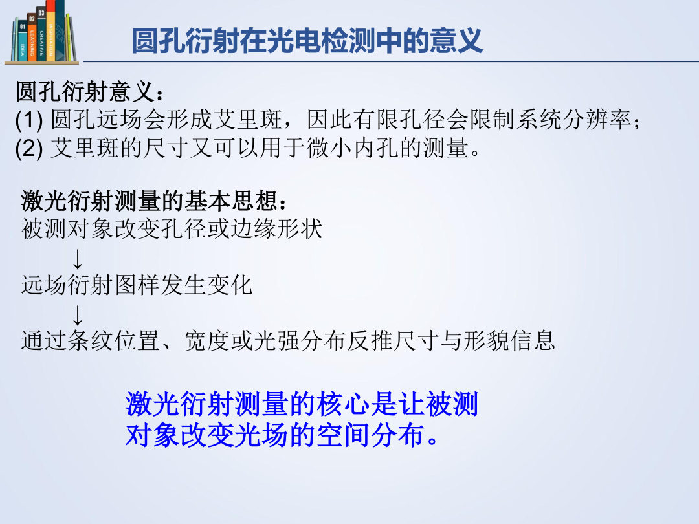

### 本页文字

```text
圆孔衍射在光电检测中的意义

圆孔衍射意义：
(1) 圆孔远场会形成艾里斑，因此有限孔径会限制系统分辨率；
(2) 艾里斑的尺寸又可以用于微小内孔的测量。

激光衍射测量的基本思想：
被测对象改变孔径或边缘形状
     ↓
远场衍射图样发生变化
     ↓
通过条纹位置、宽度或光强分布反推尺寸与形貌信息

    激光衍射测量的核心是让被测
    对象改变光场的空间分布。
```

## 第 27 页

**页面标题/首行：** 激光衍射测量方法

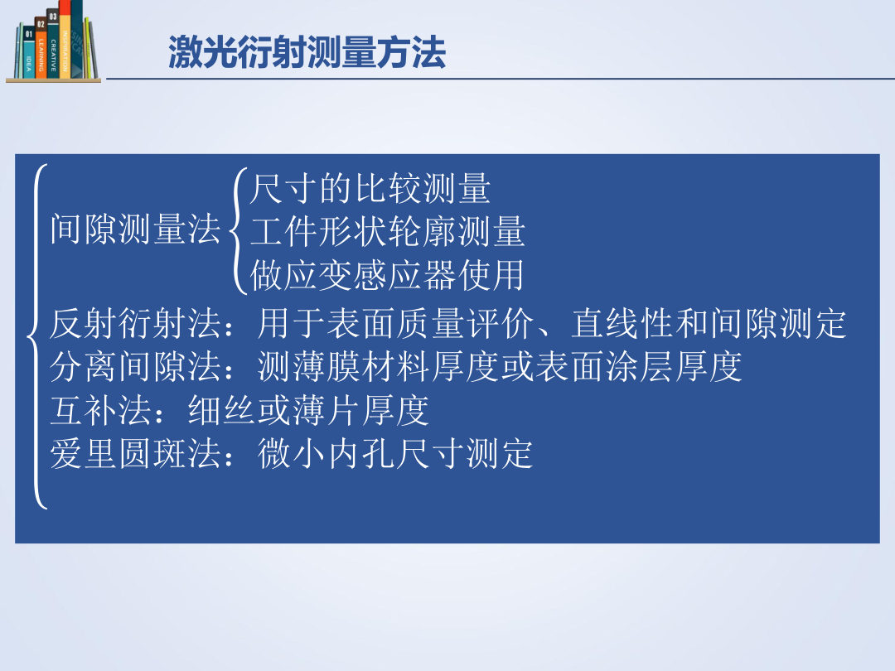

### 本页文字

```text
激光衍射测量方法

      尺寸的比较测量
间隙测量法ቐ 工件形状轮廓测量
      做应变感应器使用
反射衍射法：用于表面质量评价、直线性和间隙测定
分离间隙法：测薄膜材料厚度或表面涂层厚度
互补法：细丝或薄片厚度
爱里圆斑法：微小内孔尺寸测定
```

## 第 28 页

**页面标题/首行：** 激光衍射测试技术基础：间隙测量法

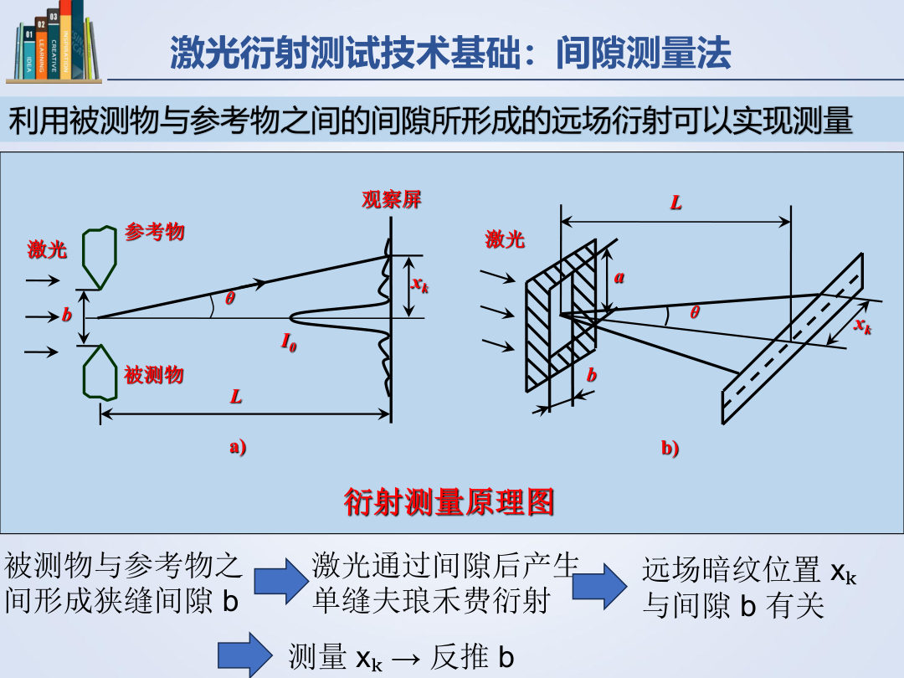

### 本页文字

```text
激光衍射测试技术基础：间隙测量法

利用被测物与参考物之间的间隙所形成的远场衍射可以实现测量

                  观察屏                    L
      参考物                        激光
 激光
                                                             a                                                 xk
        θ
      b                       θ                                                                                                     xk
                                      I0
      被测物                                        b
                   L

                           a)                                               b)

           衍射测量原理图

被测物与参考物之  激光通过间隙后产生                     远场暗纹位置 xₖ
间形成狭缝间隙 b  单缝夫琅禾费衍射   与间隙 b 有关

         测量 xₖ → 反推 b
```

## 第 29 页

**页面标题/首行：** 激光衍射测试技术基础

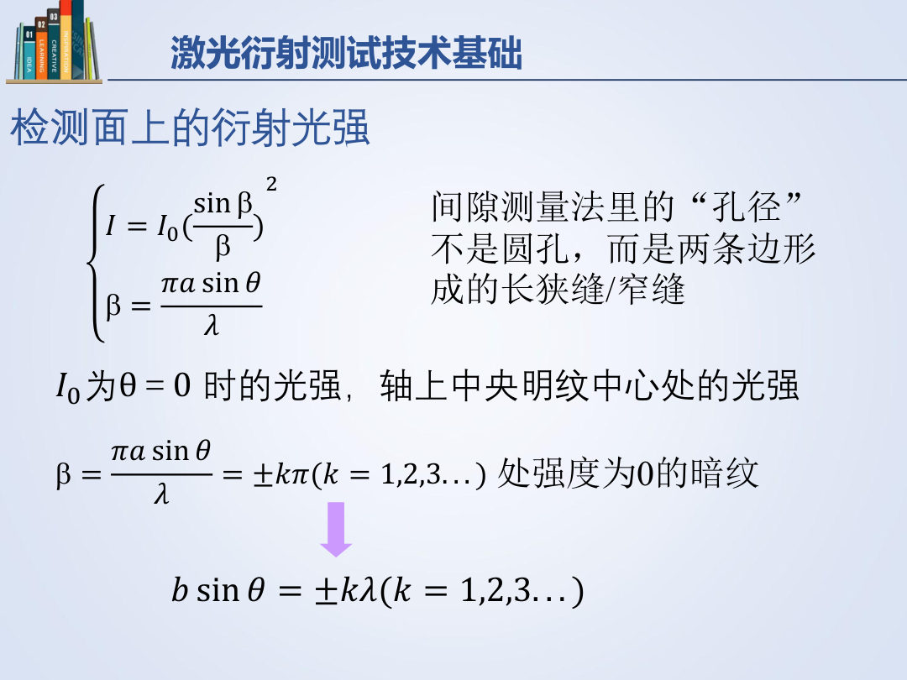

### 本页文字

```text
激光衍射测试技术基础

检测面上的衍射光强

                    2
                          间隙测量法里的“孔径”
    𝐼=            𝐼0(sin        )            不是圆孔，而是两条边形
          𝜋𝑎sin 𝜃     成的长狭缝/窄缝    =
            𝜆

  𝐼0为θ＝0 时的光强，轴上中央明纹中心处的光强

      𝜋𝑎sin 𝜃
  =     = ±𝑘𝜋(𝑘= 1,2,3. . . ) 处强度为0的暗纹
         𝜆

         𝑏sin 𝜃= ±𝑘𝜆(𝑘= 1,2,3. . . )
```

## 第 30 页

**页面标题/首行：** 激光衍射测试技术基础

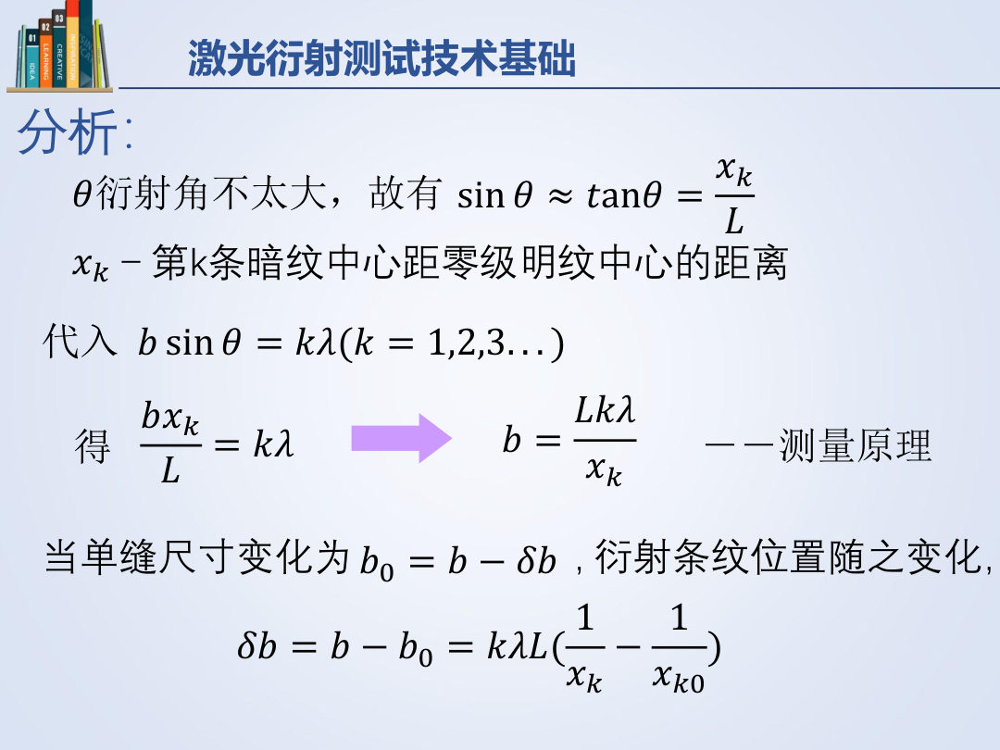

### 本页文字

```text
激光衍射测试技术基础
分析：
                                     𝑥𝑘
  𝜃衍射角不太大，故有sin 𝜃≈𝑡an𝜃=
                                  𝐿
  𝑥𝑘－第k条暗纹中心距零级明纹中心的距离

 代入 𝑏sin 𝜃= 𝑘𝜆(𝑘= 1,2,3. . . )

                           𝐿𝑘𝜆      𝑏𝑥𝑘                𝑏= 得   = 𝑘𝜆          －－测量原理
       𝐿                      𝑥𝑘

 当单缝尺寸变化为                          , 衍射条纹位置随之变化，                   𝑏0 = 𝑏−𝛿𝑏
                          1        𝛿𝑏=    = 𝑘𝜆𝐿( −1 )            𝑏−𝑏0
                             𝑥𝑘   𝑥𝑘0
```

## 第 31 页

**页面标题/首行：** 激光衍射测试技术基础

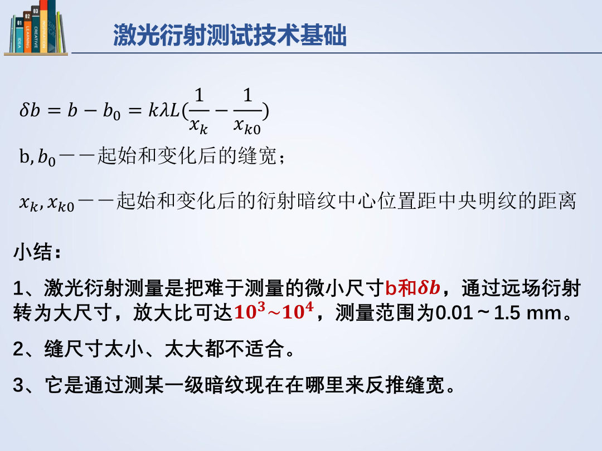

### 本页文字

```text
激光衍射测试技术基础

                1𝛿𝑏=    = 𝑘𝜆𝐿( −1 )    𝑏−𝑏0
                  𝑥𝑘   𝑥𝑘0
 b, 𝑏0－－起始和变化后的缝宽；

 𝑥𝑘, 𝑥𝑘0－－起始和变化后的衍射暗纹中心位置距中央明纹的距离

小结：

1、激光衍射测量是把难于测量的微小尺寸b和𝜹𝒃，通过远场衍射
转为大尺寸，放大比可达𝟏𝟎𝟑~𝟏𝟎𝟒，测量范围为0.01～1.5 mm。

2、缝尺寸太小、太大都不适合。

3、它是通过测某一级暗纹现在在哪里来反推缝宽。
```

## 第 32 页

**页面标题/首行：** 激光衍射测量方法

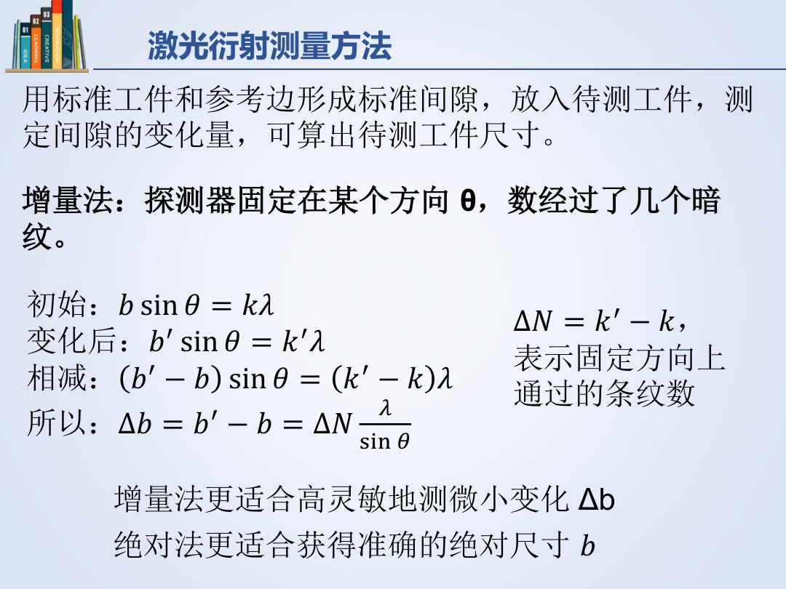

### 本页文字

```text
激光衍射测量方法

用标准工件和参考边形成标准间隙，放入待测工件，测
定间隙的变化量，可算出待测工件尺寸。

增量法：探测器固定在某个方向 θ，数经过了几个暗
纹。

初始：𝑏sin 𝜃= 𝑘𝜆                    Δ𝑁= 𝑘′ −𝑘，
变化后：𝑏′ sin 𝜃= 𝑘′𝜆                表示固定方向上
相减：𝑏′ −𝑏sin 𝜃=  𝑘′ −𝑘𝜆                通过的条纹数
                            𝜆
所以：Δ𝑏= 𝑏′ −𝑏= Δ𝑁
                                sin 𝜃

   增量法更适合高灵敏地测微小变化 Δb
   绝对法更适合获得准确的绝对尺寸 𝑏
```

## 第 33 页

**页面标题/首行：** 激光衍射测量方法

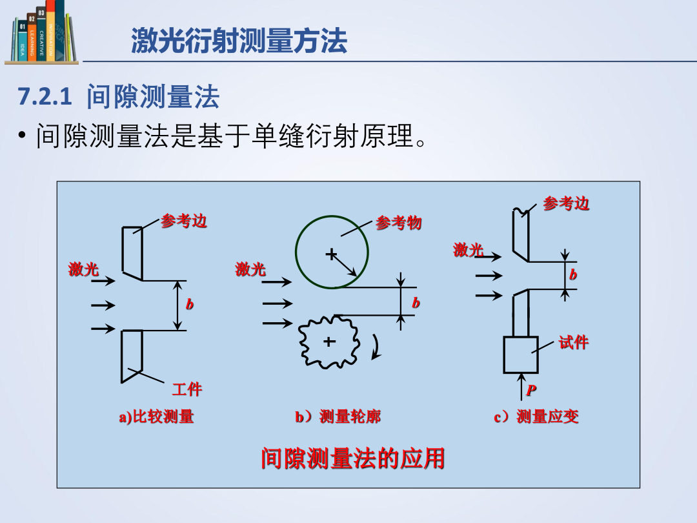

### 本页文字

```text
激光衍射测量方法

7.2.1 间隙测量法
• 间隙测量法是基于单缝衍射原理。

                                  参考边
         参考边           参考物

                            激光
   激光         激光                                                                       b

                      b                            b

                                   试件

          工件                                  P

        a)比较测量       b）测量轮廓        c）测量应变

          间隙测量法的应用
```

## 第 34 页

**页面标题/首行：** 激光衍射测量方法

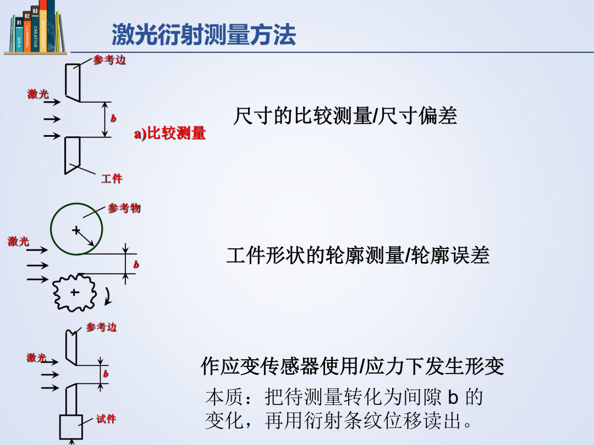

### 本页文字

```text
激光衍射测量方法

       尺寸的比较测量/尺寸偏差
  a)比较测量

      工件形状的轮廓测量/轮廓误差

     作应变传感器使用/应力下发生形变
     本质：把待测量转化为间隙 b 的
     变化，再用衍射条纹位移读出。
```

## 第 35 页

**页面标题/首行：** 激光衍射测量方法

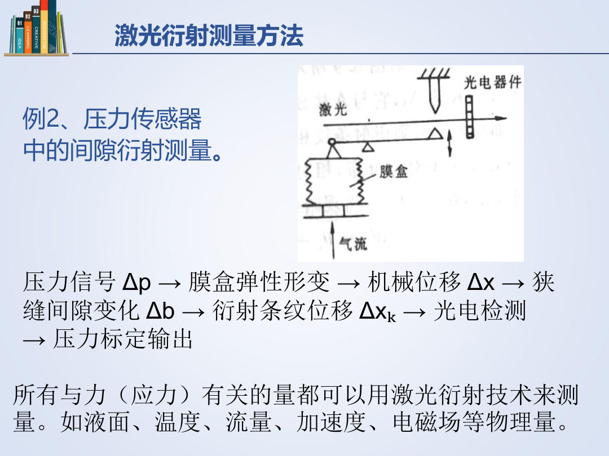

### 本页文字

```text
激光衍射测量方法

例2、压力传感器
中的间隙衍射测量。

压力信号 Δp → 膜盒弹性形变 → 机械位移 Δx → 狭
缝间隙变化 Δb → 衍射条纹位移 Δxₖ → 光电检测
→ 压力标定输出

所有与力（应力）有关的量都可以用激光衍射技术来测
量。如液面、温度、流量、加速度、电磁场等物理量。
```

## 第 36 页

**页面标题/首行：** 激光衍射测量方法

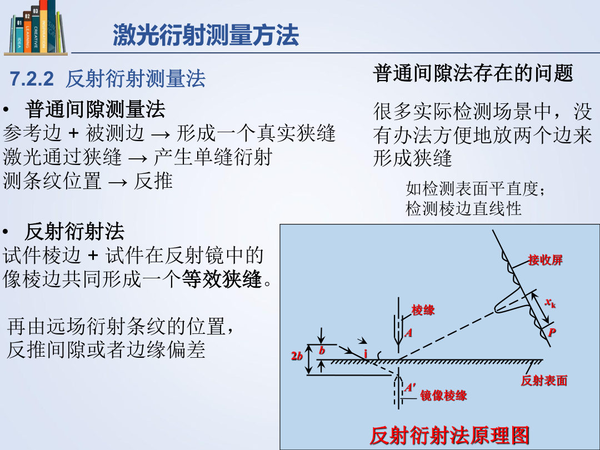

### 本页文字

```text
激光衍射测量方法

                  普通间隙法存在的问题 7.2.2 反射衍射测量法
• 普通间隙测量法          很多实际检测场景中，没
参考边 + 被测边 → 形成一个真实狭缝  有办法方便地放两个边来
激光通过狭缝 → 产生单缝衍射     形成狭缝
测条纹位置 → 反推                        如检测表面平直度；
                        检测棱边直线性
• 反射衍射法
试件棱边 + 试件在反射镜中的                      接收屏
像棱边共同形成一个等效狭缝。
                                                                                                          xk
                                   棱缘
再由远场衍射条纹的位置，                    A                   P
                                                      b反推间隙或者边缘偏差                                                 2b                   i

                                            反射表面
                                                                         A′
                                    镜像棱缘

                                                                         41
                  反射衍射法原理图
```

## 第 37 页

**页面标题/首行：** 激光衍射测量方法

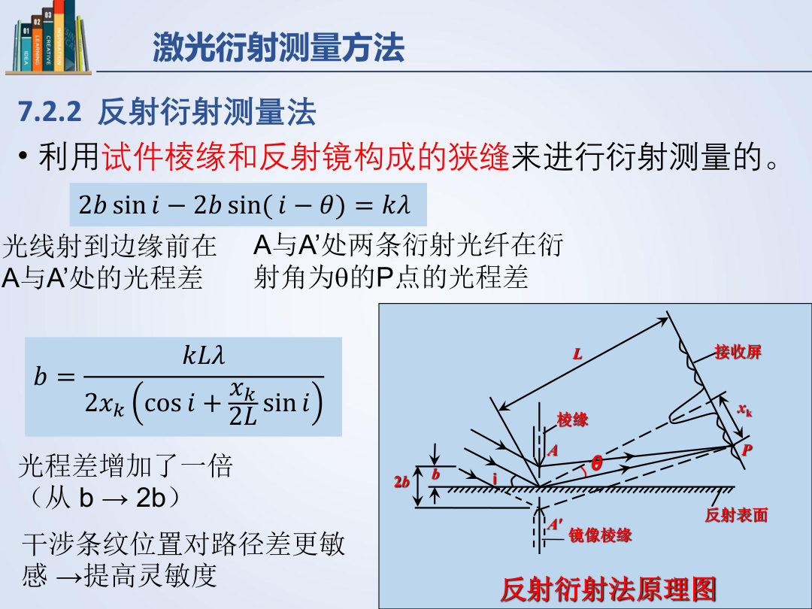

### 本页文字

```text
激光衍射测量方法

 7.2.2 反射衍射测量法
 • 利用试件棱缘和反射镜构成的狭缝来进行衍射测量的。

      2𝑏sin 𝑖−2𝑏sin( 𝑖−𝜃) = 𝑘𝜆
光线射到边缘前在 A与A’处两条衍射光纤在衍
A与A’处的光程差  射角为的P点的光程差

             𝑘𝐿𝜆                                    L        接收屏
 𝑏=                  𝑥𝑘
     2𝑥𝑘cos 𝑖+         𝑖                                                              xk                                   棱缘                 2𝐿sin

                                                    A                   P
 光程差增加了一倍                         b             θ                                                 2b                   i
 （从 b → 2b）
                                            反射表面
                                                                         A′
                                    镜像棱缘
 干涉条纹位置对路径差更敏
 感 →提高灵敏度                                                42                  反射衍射法原理图
```

## 第 38 页

**页面标题/首行：** 激光衍射测量方法

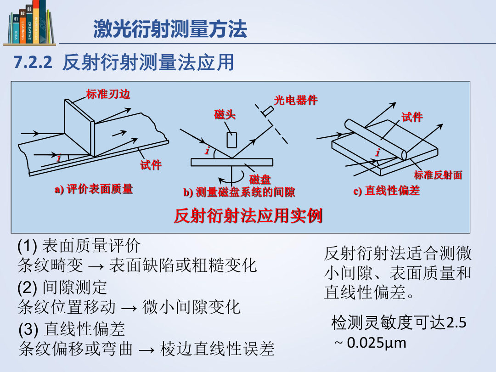

### 本页文字

```text
激光衍射测量方法

7.2.2 反射衍射测量法应用

       标准刃边
                        光电器件
                  磁头                                   试件

                     i                  i     i
           试件
                                         标准反射面                     磁盘
         a) 评价表面质量                                   b) 测量磁盘系统的间隙              c) 直线性偏差

          反射衍射法应用实例

 (1) 表面质量评价                   反射衍射法适合测微
条纹畸变 → 表面缺陷或粗糙变化                   小间隙、表面质量和
 (2) 间隙测定                   直线性偏差。
条纹位置移动 → 微小间隙变化
                       检测灵敏度可达2.5 (3) 直线性偏差
                                 ～0.025μm条纹偏移或弯曲 → 棱边直线性误差
```

## 第 39 页

**页面标题/首行：** 激光衍射测量方法

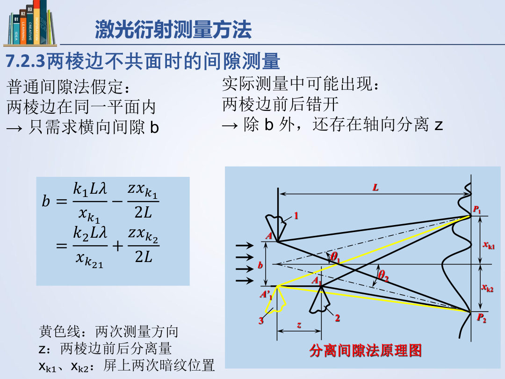

### 本页文字

```text
激光衍射测量方法
7.2.3两棱边不共面时的间隙测量
             实际测量中可能出现：普通间隙法假定：
             两棱边前后错开两棱边在同一平面内
             → 除 b 外，还存在轴向分离 z→ 只需求横向间隙 b

        𝑘1𝐿𝜆                                            L   𝑏=     −𝑧𝑥𝑘1
                                                           1          𝑥𝑘1    2𝐿                                                                                 P1
                                        A        𝑘2𝐿𝜆   𝑧𝑥𝑘2
    =   +                                                                                           xk1
          𝑥𝑘21   2𝐿                     b              θ1
                                                                     θ2                                                              A1
                                                                                                                        xk2
                                                              A’1

                                                                   2                              P2                                                   3                                                                            z
  黄色线：两次测量方向
  z：两棱边前后分离量          分离间隙法原理图
   xₖ₁、xₖ₂：屏上两次暗纹位置
```

## 第 40 页

**页面标题/首行：** 激光衍射测量方法

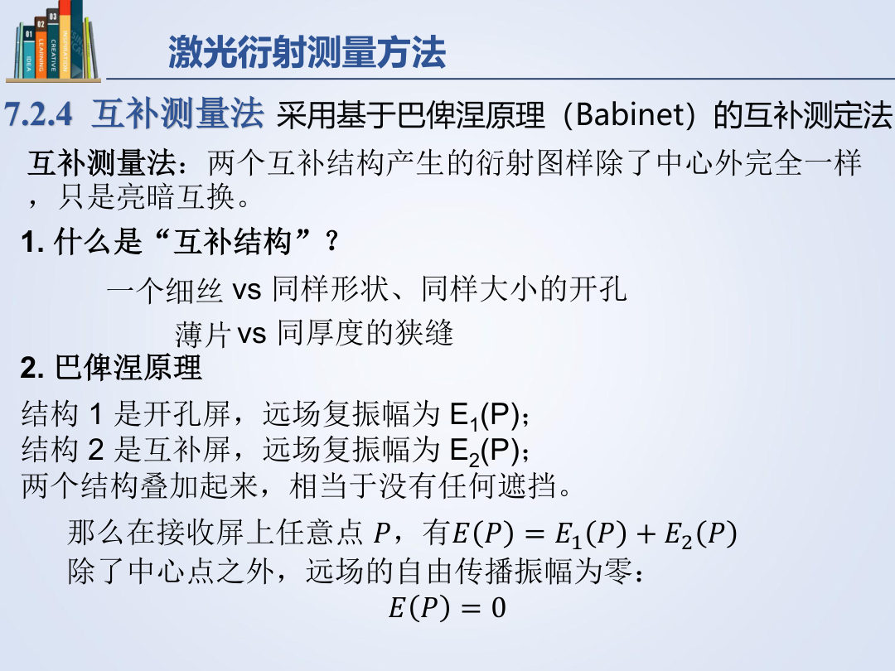

### 本页文字

```text
激光衍射测量方法

7.2.4 互补测量法 采用基于巴俾涅原理（Babinet）的互补测定法
 互补测量法：两个互补结构产生的衍射图样除了中心外完全一样
 ，只是亮暗互换。
 1. 什么是“互补结构”？
    一个细丝vs 同样形状、同样大小的开孔
       薄片vs 同厚度的狭缝
 2. 巴俾涅原理
 结构 1 是开孔屏，远场复振幅为 E1(P)；
 结构 2 是互补屏，远场复振幅为 E2(P)；
 两个结构叠加起来，相当于没有任何遮挡。
  那么在接收屏上任意点 𝑃，有𝐸𝑃= 𝐸1 𝑃+ 𝐸2 𝑃
  除了中心点之外，远场的自由传播振幅为零：
            𝐸𝑃= 0
```

## 第 41 页

**页面标题/首行：** 激光衍射测量方法

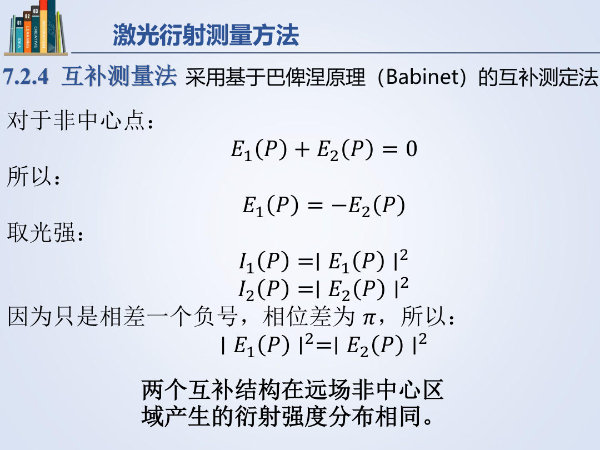

### 本页文字

```text
激光衍射测量方法

7.2.4 互补测量法采用基于巴俾涅原理（Babinet）的互补测定法

对于非中心点：
                    𝐸1 𝑃+ 𝐸2 𝑃= 0
所以：
                     𝐸1 𝑃= −𝐸2 𝑃
取光强：
                      𝑃∣2                            𝐼1 𝑃=∣𝐸1
                       𝑃∣2                           𝐼2 𝑃=∣𝐸2
因为只是相差一个负号，相位差为 𝜋，所以：
                        𝑃∣2                  ∣𝐸1 𝑃∣2=∣𝐸2

      两个互补结构在远场非中心区
      域产生的衍射强度分布相同。
```

## 第 42 页

**页面标题/首行：** 激光衍射测量方法

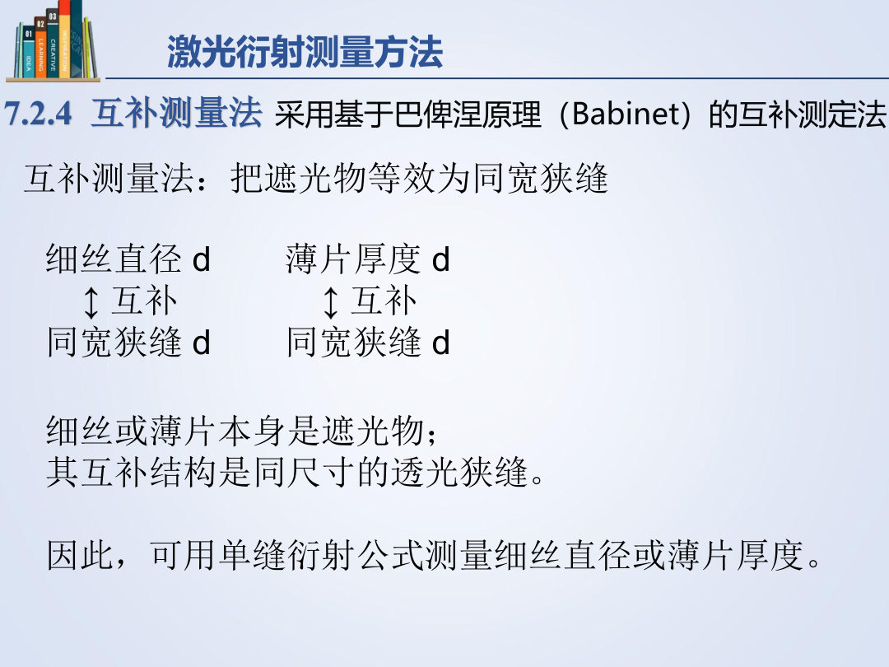

### 本页文字

```text
激光衍射测量方法

7.2.4 互补测量法采用基于巴俾涅原理（Babinet）的互补测定法

 互补测量法：把遮光物等效为同宽狭缝

 细丝直径 d  薄片厚度 d
   互补     互补
 同宽狭缝 d  同宽狭缝 d

 细丝或薄片本身是遮光物；
 其互补结构是同尺寸的透光狭缝。

 因此，可用单缝衍射公式测量细丝直径或薄片厚度。
```

## 第 43 页

**页面标题/首行：** 激光衍射测量方法

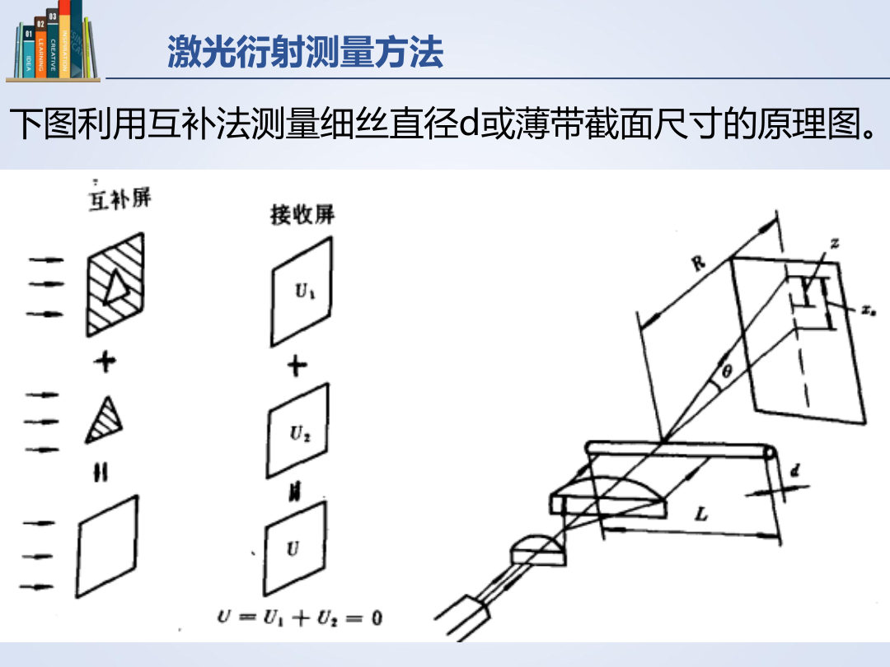

### 本页文字

```text
激光衍射测量方法

下图利用互补法测量细丝直径d或薄带截面尺寸的原理图。
```

## 第 44 页

**页面标题/首行：** 激光衍射测量方法

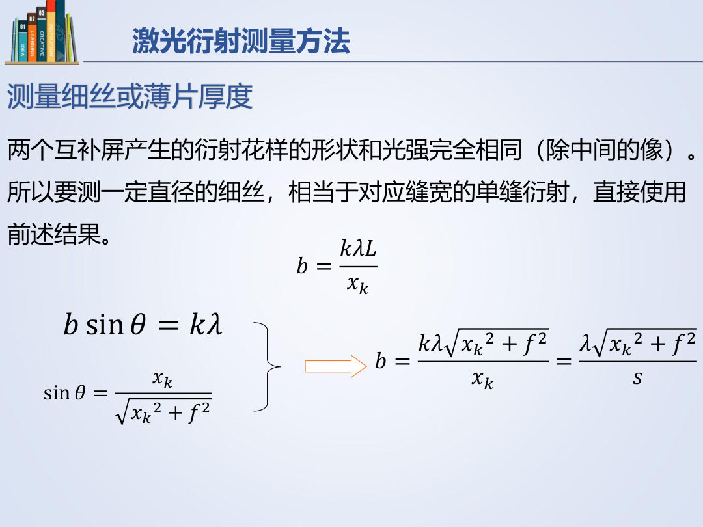

### 本页文字

```text
激光衍射测量方法

测量细丝或薄片厚度

两个互补屏产生的衍射花样的形状和光强完全相同（除中间的像）。
所以要测一定直径的细丝，相当于对应缝宽的单缝衍射，直接使用
前述结果。
                           𝑘𝜆𝐿
                𝑏=
                              𝑥𝑘
    𝑏sin 𝜃= 𝑘𝜆
                           𝑘𝜆𝑥𝑘2 + 𝑓2  𝜆𝑥𝑘2 + 𝑓2
                    𝑏=        =
              𝑥𝑘                          𝑥𝑘             𝑠
    sin 𝜃=
            𝑥𝑘2 + 𝑓2
```

## 第 45 页

**页面标题/首行：** SCreate N3 微型微细线激光测径仪


### 本页文字

```text
SCreate N3 微型微细线激光测径仪

 https://www.screate-
 tech.com/product/36/14.html?utm_source=c
 hatgpt.com
```

## 第 46 页

**页面标题/首行：** 激光衍射测量方法

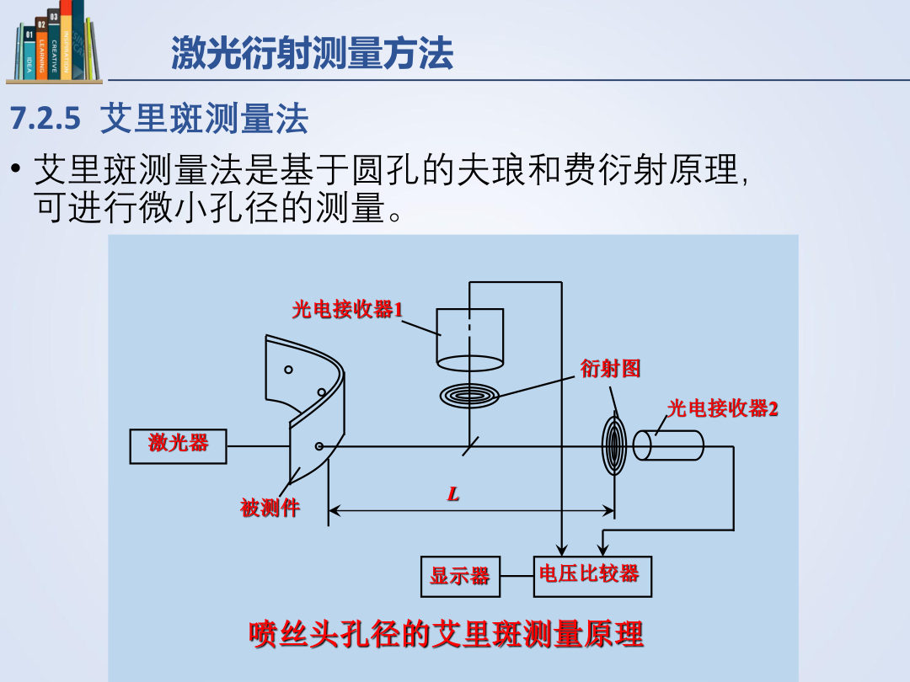

### 本页文字

```text
激光衍射测量方法

7.2.5 艾里斑测量法
• 艾里斑测量法是基于圆孔的夫琅和费衍射原理，
 可进行微小孔径的测量。

               光电接收器1

                            衍射图

                                   光电接收器2

       激光器

                                    L
           被测件

                     显示器  电压比较器

        喷丝头孔径的艾里斑测量原理
```

## 第 47 页

**页面标题/首行：** 多选题 1分

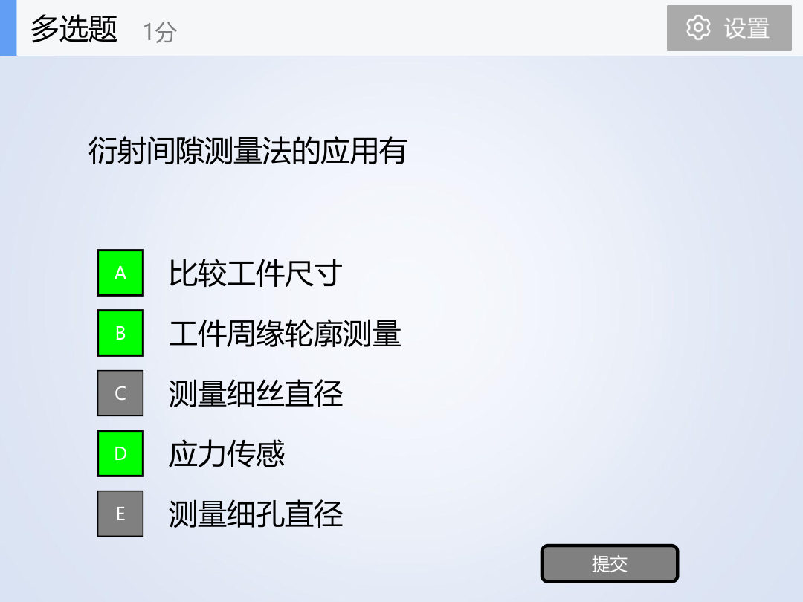

### 本页文字

```text
多选题 1分

  衍射间隙测量法的应用有

       A     比较工件尺寸

        B     工件周缘轮廓测量

       C     测量细丝直径

      D     应力传感

         E     测量细孔直径

                                提交
```

## 第 48 页

**页面标题/首行：** 填空题 1分

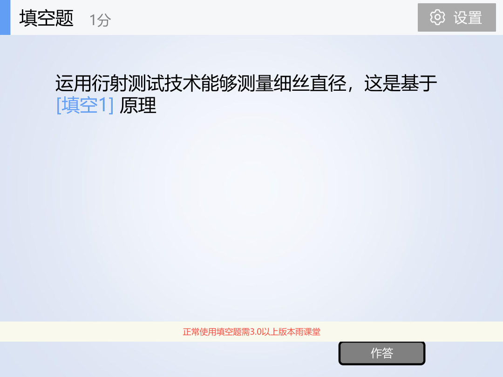

### 本页文字

```text
填空题 1分

  运用衍射测试技术能够测量细丝直径，这是基于
   [填空1] 原理

                     正常使用填空题需3.0以上版本雨课堂

                                作答
```

## 第 49 页

**页面标题/首行：** 3. 夫琅禾费圆孔衍射

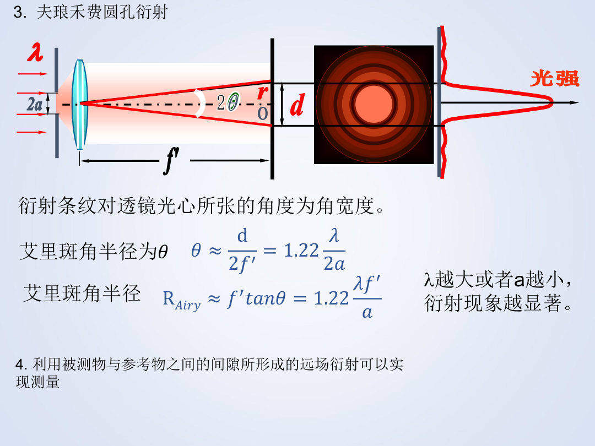

### 本页文字

```text
3. 夫琅禾费圆孔衍射


                 光强
                   d2            22

                f'
衍射条纹对透镜光心所张的角度为角宽度。
艾里斑角半径为𝜃 𝜃≈d = 1.22 𝜆
                       2𝑓′      2𝑎
                       越大或者a越小，                                     𝜆𝑓′艾里斑角半径                                1.22             R𝐴𝑖𝑟𝑦≈𝑓′𝑡𝑎𝑛𝜃=      衍射现象越显著。                                𝑎

4. 利用被测物与参考物之间的间隙所形成的远场衍射可以实
现测量
```

## 第 50 页

**页面标题/首行：** 衍射光栅：把多缝衍射做成光学元件

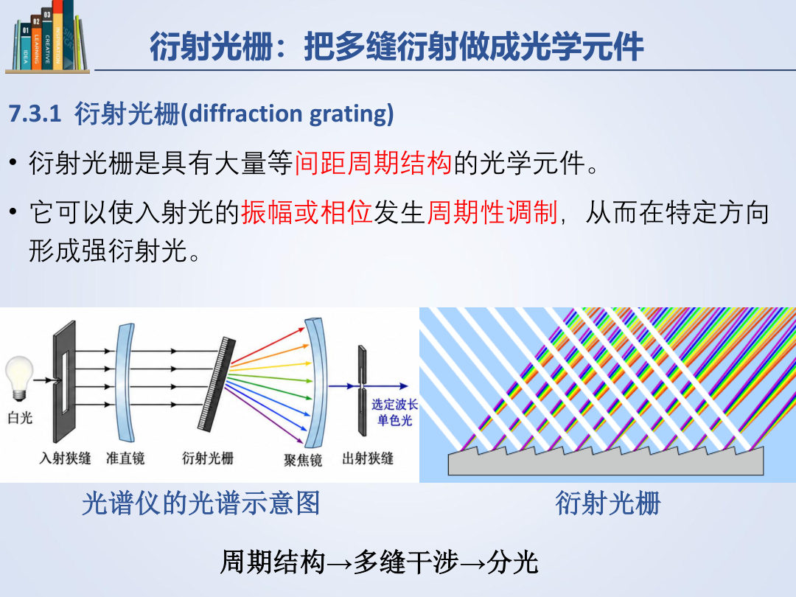

### 本页文字

```text
衍射光栅：把多缝衍射做成光学元件

7.3.1 衍射光栅(diffraction grating)

• 衍射光栅是具有大量等间距周期结构的光学元件。

• 它可以使入射光的振幅或相位发生周期性调制，从而在特定方向
 形成强衍射光。

   光谱仪的光谱示意图         衍射光栅

        周期结构→多缝干涉→分光
```

## 第 51 页

**页面标题/首行：** 衍射光栅

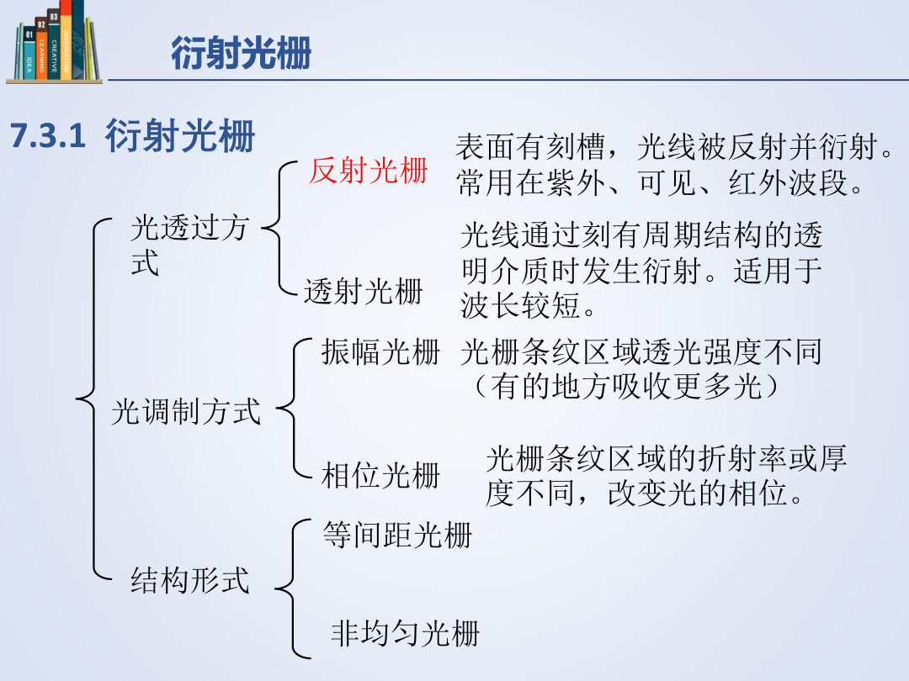

### 本页文字

```text
衍射光栅

7.3.1 衍射光栅               表面有刻槽，光线被反射并衍射。
          反射光栅               常用在紫外、可见、红外波段。
    光透过方               光线通过刻有周期结构的透
    式               明介质时发生衍射。适用于
          透射光栅               波长较短。

          振幅光栅 光栅条纹区域透光强度不同
               （有的地方吸收更多光）
   光调制方式

                光栅条纹区域的折射率或厚
          相位光栅
                度不同，改变光的相位。
          等间距光栅
    结构形式

           非均匀光栅
```

## 第 52 页

**页面标题/首行：** 从双缝/多缝过渡到光栅

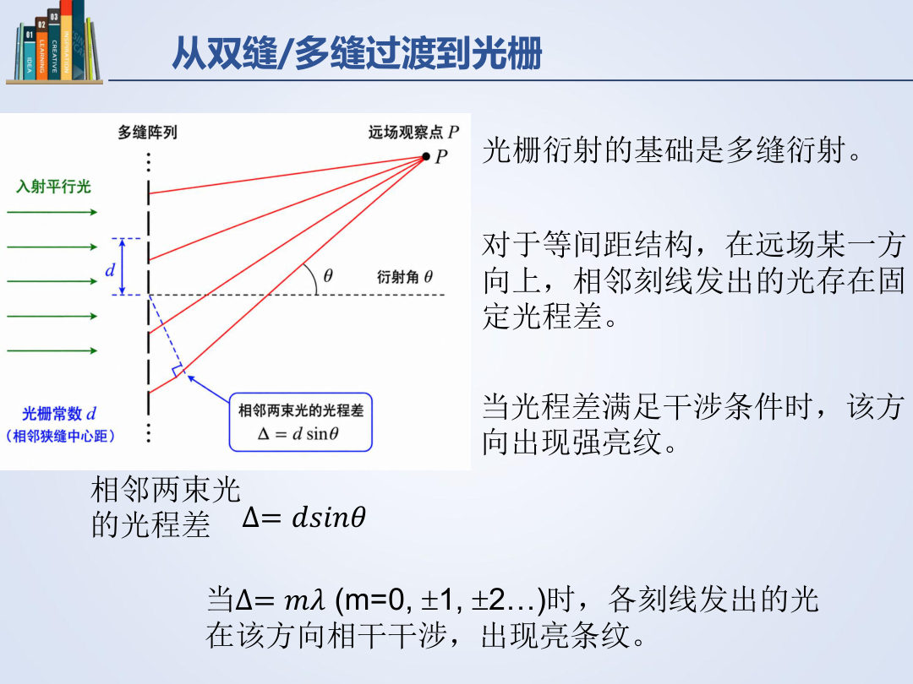

### 本页文字

```text
从双缝/多缝过渡到光栅

             光栅衍射的基础是多缝衍射。

             对于等间距结构，在远场某一方
             向上，相邻刻线发出的光存在固
             定光程差。

             当光程差满足干涉条件时，该方
             向出现强亮纹。

相邻两束光
       ∆= 𝑑𝑠𝑖𝑛𝜃的光程差

     当∆= 𝑚𝜆 (m=0, 1, 2…)时，各刻线发出的光
    在该方向相干干涉，出现亮条纹。
```

## 第 53 页

**页面标题/首行：** 光栅图样

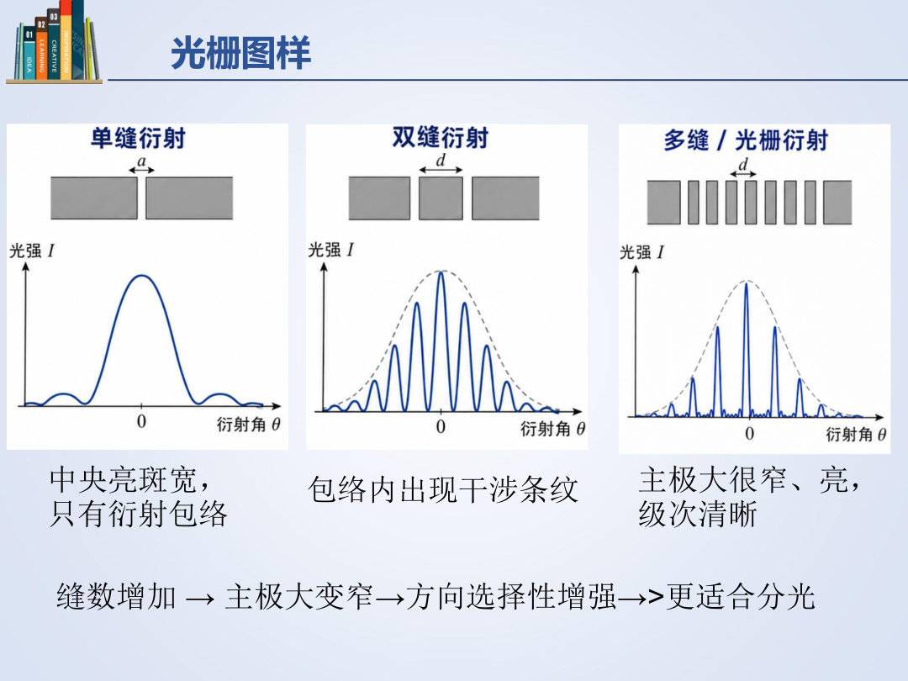

### 本页文字

```text
光栅图样

中央亮斑宽，             主极大很窄、亮，         包络内出现干涉条纹
只有衍射包络              级次清晰

缝数增加 → 主极大变窄→方向选择性增强→>更适合分光
```

## 第 54 页

**页面标题/首行：** 光栅图样

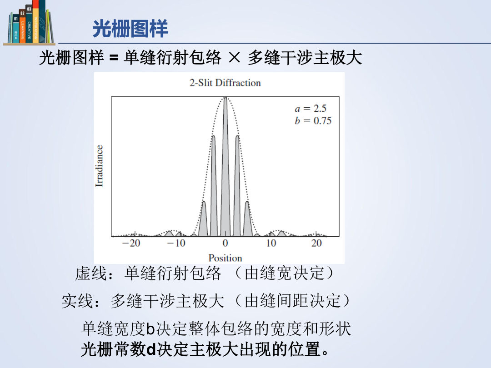

### 本页文字

```text
光栅图样
光栅图样 = 单缝衍射包络 × 多缝干涉主极大

  虚线：单缝衍射包络 （由缝宽决定）

 实线：多缝干涉主极大 （由缝间距决定）

   单缝宽度b决定整体包络的宽度和形状
   光栅常数d决定主极大出现的位置。
```

## 第 55 页

**页面标题/首行：** 光栅图样

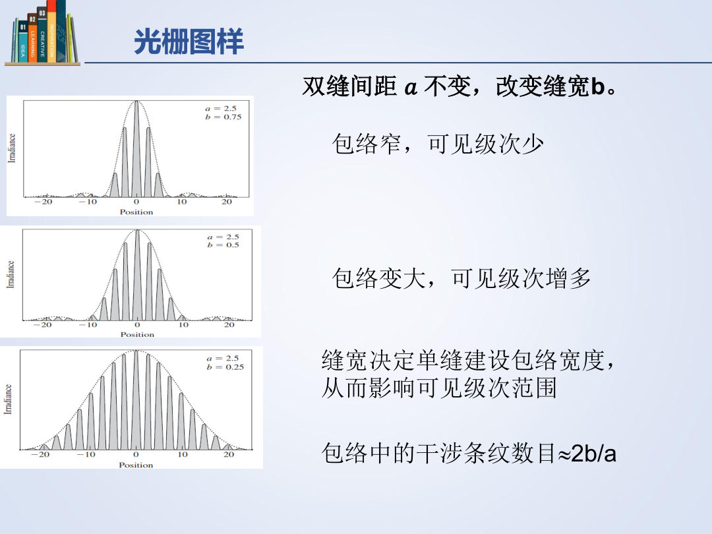

### 本页文字

```text
光栅图样

       双缝间距 𝑎不变，改变缝宽b。

        包络窄，可见级次少

        包络变大，可见级次增多

        缝宽决定单缝建设包络宽度，
        从而影响可见级次范围

         包络中的干涉条纹数目2b/a
```

## 第 56 页

**页面标题/首行：** 衍射光栅

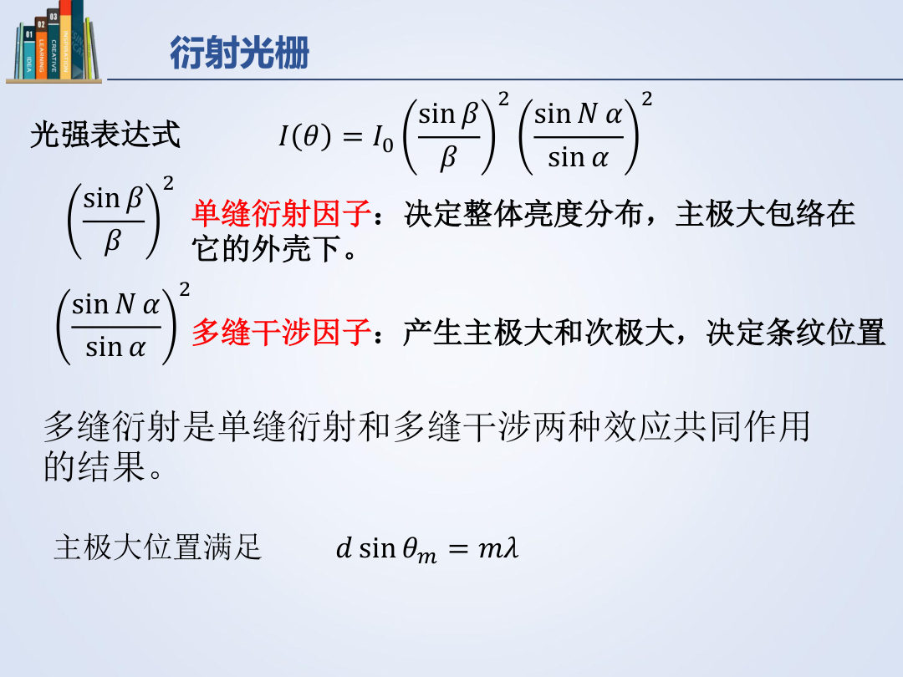

### 本页文字

```text
衍射光栅

                                     2          2
                               sin 𝛽    sin 𝑁𝛼
光强表达式         𝐼𝜃= 𝐼0
                      𝛽       sin 𝛼
          2
    sin 𝛽     单缝衍射因子：决定整体亮度分布，主极大包络在
    𝛽     它的外壳下。

            2
   sin 𝑁𝛼
     多缝干涉因子：产生主极大和次极大，决定条纹位置
    sin 𝛼

多缝衍射是单缝衍射和多缝干涉两种效应共同作用
的结果。

 主极大位置满足     𝑑sin 𝜃𝑚= 𝑚𝜆
```

## 第 57 页

**页面标题/首行：** 衍射光栅

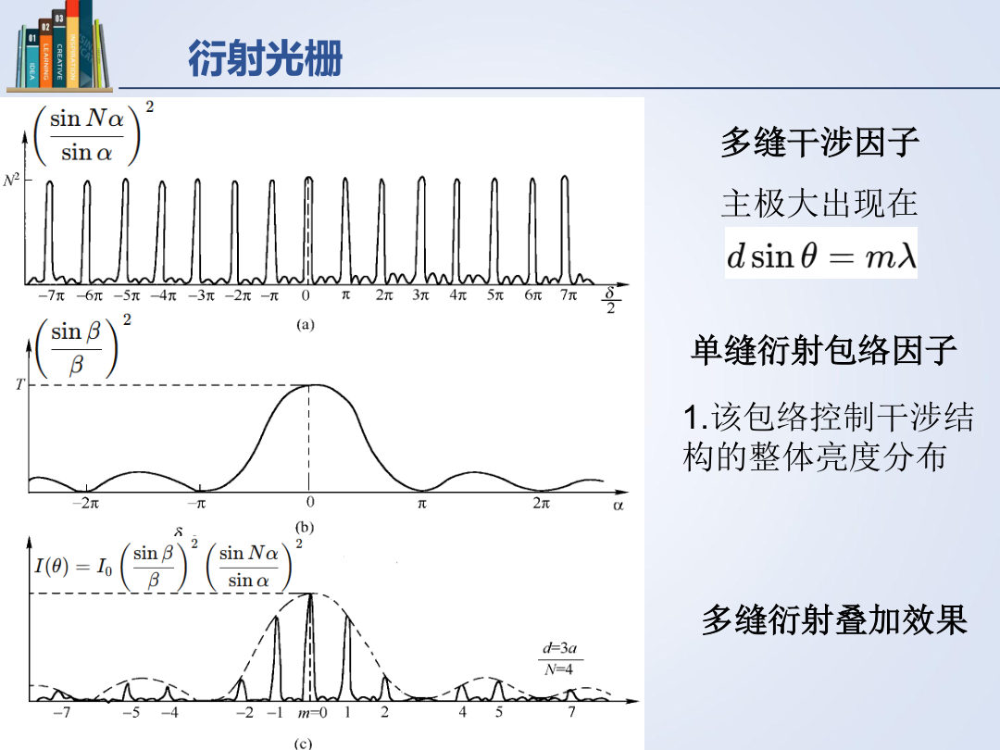

### 本页文字

```text
衍射光栅

                多缝干涉因子

                主极大出现在

               单缝衍射包络因子

                 1.该包络控制干涉结
               构的整体亮度分布

               多缝衍射叠加效果
```

## 第 58 页

**页面标题/首行：** 光栅方程

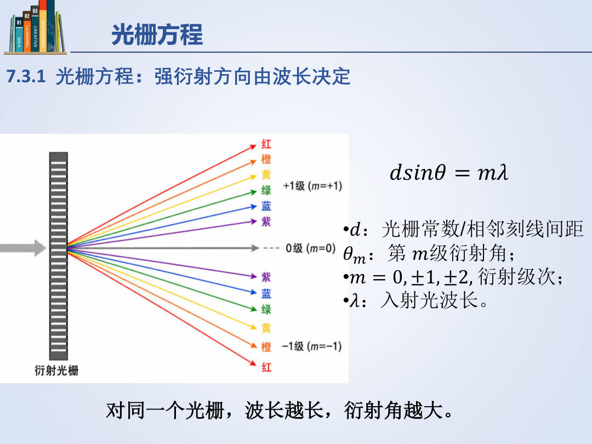

### 本页文字

```text
光栅方程

7.3.1 光栅方程：强衍射方向由波长决定

                            𝑑𝑠𝑖𝑛𝜃= 𝑚𝜆

                    •𝑑：光栅常数/相邻刻线间距
                     𝜃𝑚：第 𝑚级衍射角；
                       •𝑚= 0, ±1, ±2, 衍射级次；
                   •𝜆：入射光波长。

     对同一个光栅，波长越长，衍射角越大。
```

## 第 59 页

**页面标题/首行：** 衍射光栅

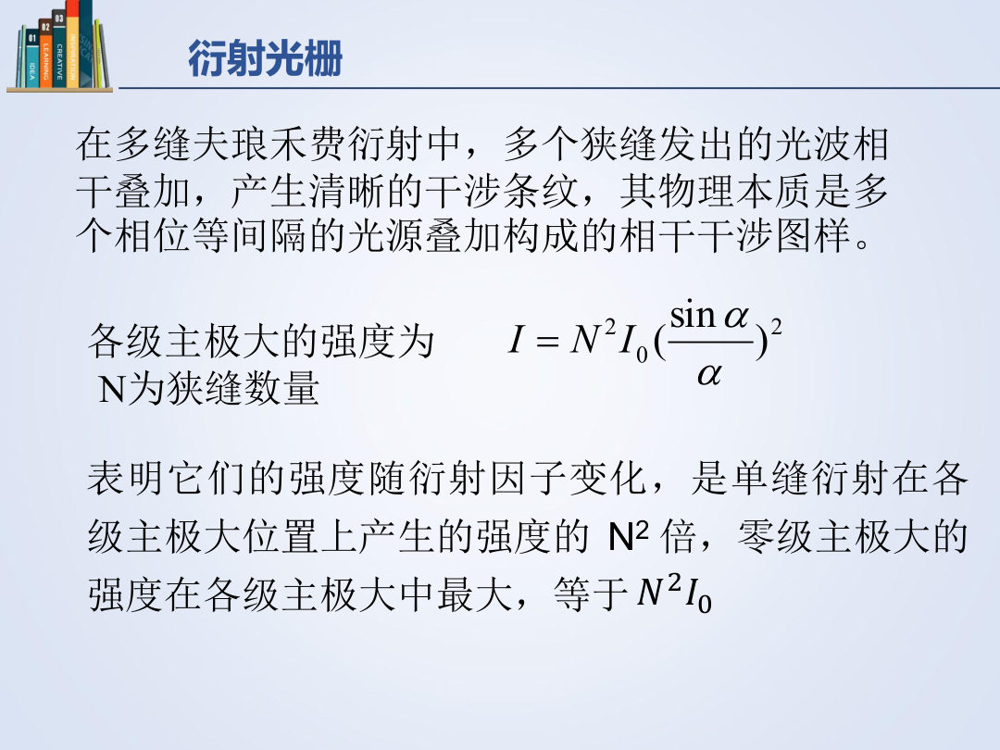

### 本页文字

```text
衍射光栅

在多缝夫琅禾费衍射中，多个狭缝发出的光波相
干叠加，产生清晰的干涉条纹，其物理本质是多
个相位等间隔的光源叠加构成的相干干涉图样。

                                            2   sin  2各级主极大的强度为     I = N  I (      )
                                               0  N为狭缝数量

表明它们的强度随衍射因子变化，是单缝衍射在各
级主极大位置上产生的强度的N2 倍，零级主极大的
强度在各级主极大中最大，等于𝑁2𝐼0
```

## 第 60 页

**页面标题/首行：** 衍射光栅

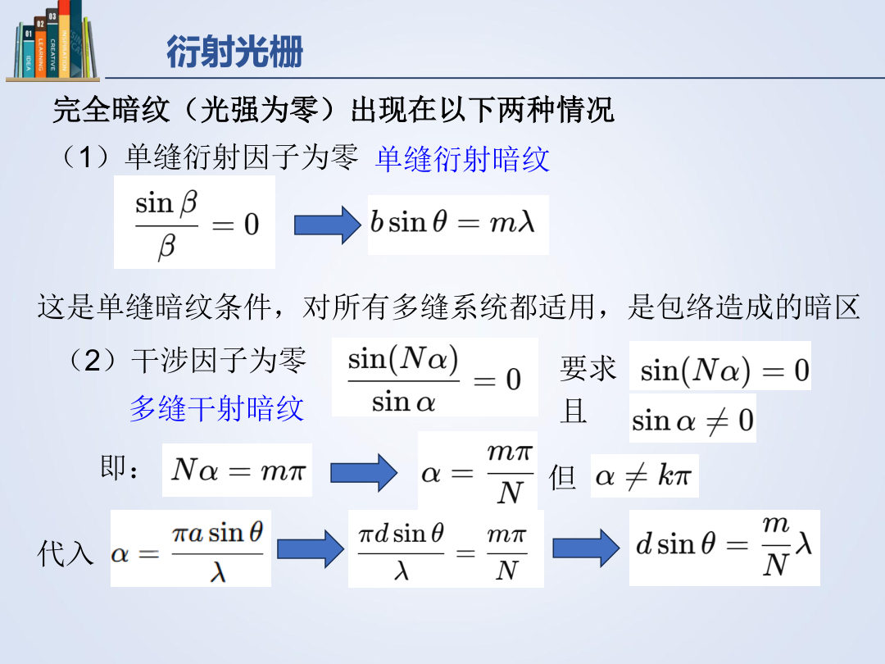

### 本页文字

```text
衍射光栅

 完全暗纹（光强为零）出现在以下两种情况
（1）单缝衍射因子为零 单缝衍射暗纹

这是单缝暗纹条件，对所有多缝系统都适用，是包络造成的暗区

 （2）干涉因子为零                  要求
   多缝干射暗纹         且

  即：                 但

代入
```

## 第 61 页

**页面标题/首行：** 衍射光栅

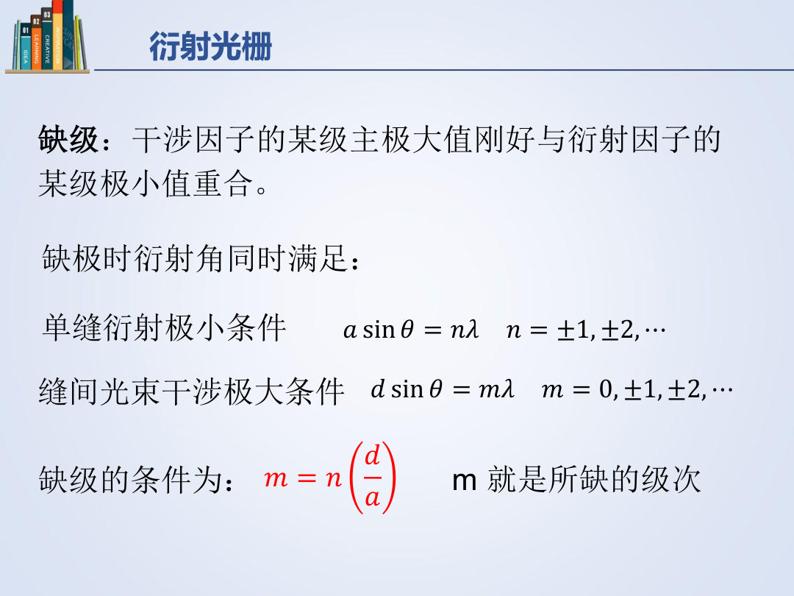

### 本页文字

```text
衍射光栅

缺级：干涉因子的某级主极大值刚好与衍射因子的
某级极小值重合。

缺极时衍射角同时满足：

单缝衍射极小条件    𝑎sin 𝜃= 𝑛𝜆 𝑛= ±1, ±2, ⋯

缝间光束干涉极大条件  𝑑sin 𝜃= 𝑚𝜆 𝑚= 0, ±1, ±2, ⋯

缺级的条件为：𝑚= 𝑛𝑑   m 就是所缺的级次
                    𝑎
```

## 第 62 页

**页面标题/首行：** 衍射光栅

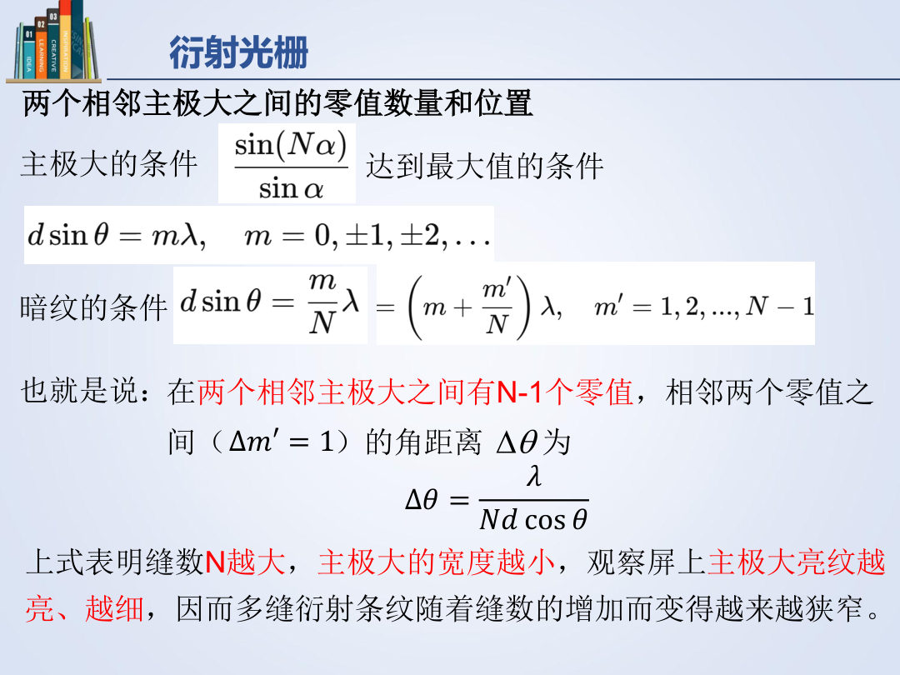

### 本页文字

```text
衍射光栅

两个相邻主极大之间的零值数量和位置

主极大的条件      达到最大值的条件

暗纹的条件

也就是说：在两个相邻主极大之间有N-1个零值，相邻两个零值之
     间（ Δ𝑚′ = 1）的角距离 为
                                 𝜆
                 Δ𝜃=
                          𝑁𝑑cos 𝜃
上式表明缝数N越大，主极大的宽度越小，观察屏上主极大亮纹越
亮、越细，因而多缝衍射条纹随着缝数的增加而变得越来越狭窄。
```

## 第 63 页

**页面标题/首行：** 衍射光栅

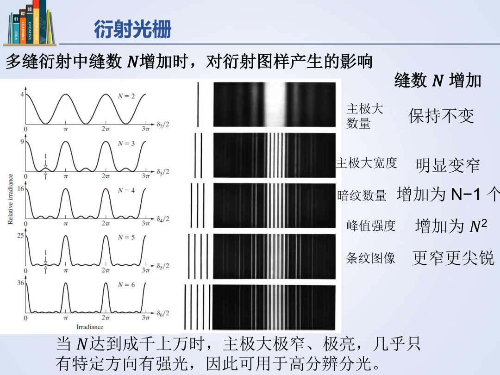

### 本页文字

```text
衍射光栅

多缝衍射中缝数 𝑁增加时，对衍射图样产生的影响
                       缝数 𝑁增加

                           主极大
                        保持不变                           数量

                          主极大宽度 明显变窄

                     暗纹数量增加为 N−1 个

                           峰值强度 增加为 𝑁2

                           条纹图像 更窄更尖锐

   当 𝑁达到成千上万时，主极大极窄、极亮，几乎只
   有特定方向有强光，因此可用于高分辨分光。
```

## 第 64 页

**页面标题/首行：** https://demonstrations.wolfram.com/Multipl

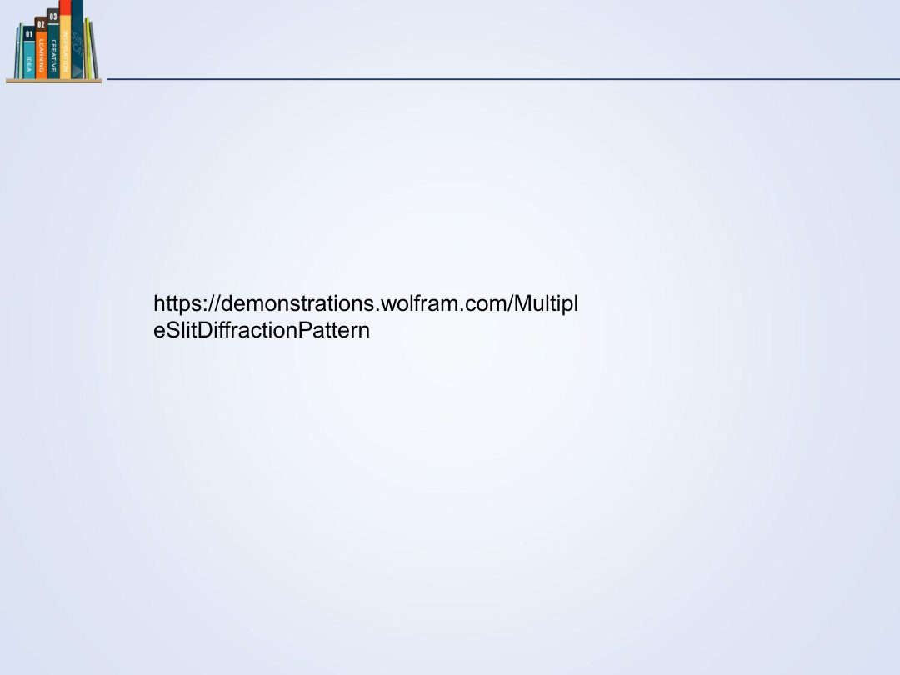

### 本页文字

```text
https://demonstrations.wolfram.com/Multipl
eSlitDiffractionPattern
```

## 第 65 页

**页面标题/首行：** 狭缝数量从1变化到10

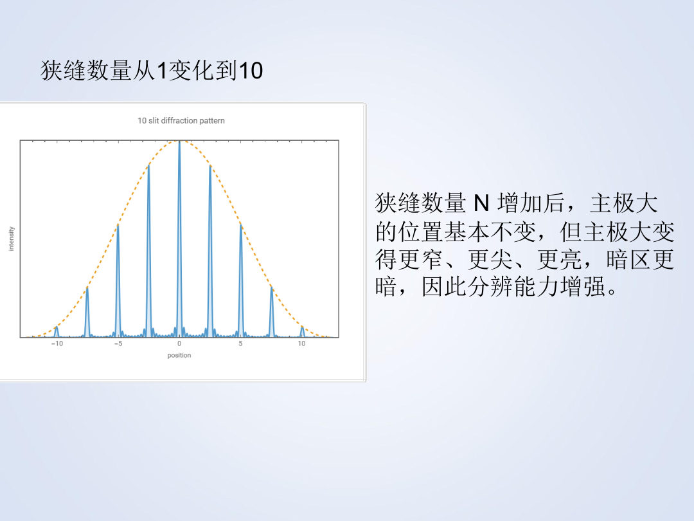

### 本页文字

```text
狭缝数量从1变化到10

              狭缝数量 N 增加后，主极大
              的位置基本不变，但主极大变
              得更窄、更尖、更亮，暗区更
              暗，因此分辨能力增强。
```

## 第 66 页

**页面标题/首行：** 实际光栅：成百上千条刻线带来的效果

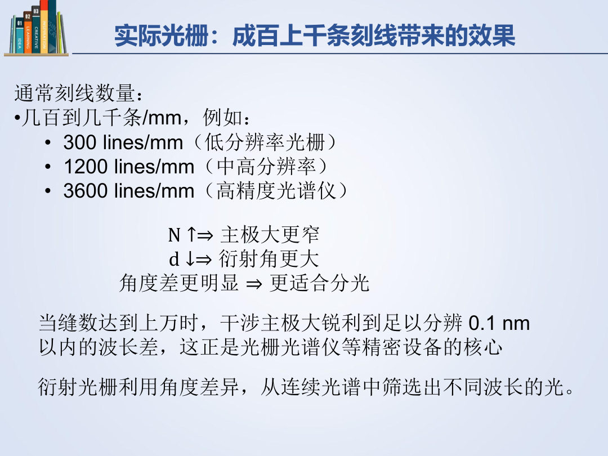

### 本页文字

```text
实际光栅：成百上千条刻线带来的效果

通常刻线数量：
•几百到几千条/mm，例如：
    • 300 lines/mm（低分辨率光栅）
    • 1200 lines/mm（中高分辨率）
    • 3600 lines/mm（高精度光谱仪）

           N ↑⇒主极大更窄
              d ↓⇒衍射角更大
     角度差更明显⇒更适合分光

 当缝数达到上万时，干涉主极大锐利到足以分辨 0.1 nm
 以内的波长差，这正是光栅光谱仪等精密设备的核心

 衍射光栅利用角度差异，从连续光谱中筛选出不同波长的光。
```

## 第 67 页

**页面标题/首行：** 衍射光栅

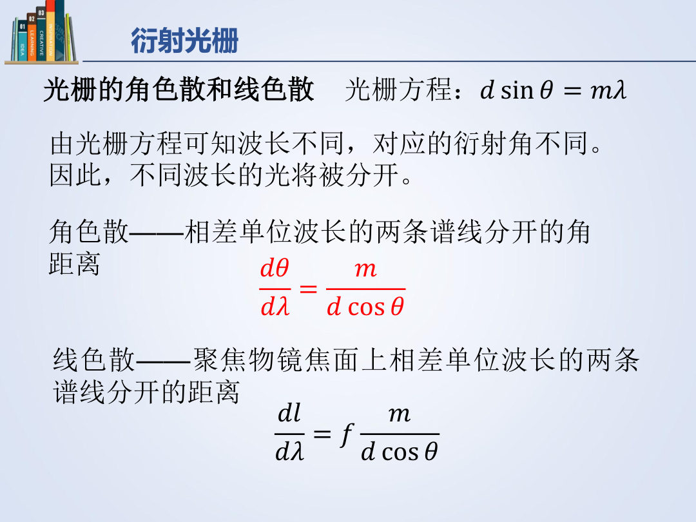

### 本页文字

```text
衍射光栅

光栅的角色散和线色散 光栅方程：𝑑sin 𝜃= 𝑚𝜆

由光栅方程可知波长不同，对应的衍射角不同。
因此，不同波长的光将被分开。

角色散——相差单位波长的两条谱线分开的角
距离              𝑑𝜃   𝑚
           𝑑𝜆= 𝑑cos 𝜃

线色散——聚焦物镜焦面上相差单位波长的两条
谱线分开的距离
                   𝑑𝑙    𝑚
            𝑑𝜆= 𝑓 𝑑cos 𝜃
```

## 第 68 页

**页面标题/首行：** 衍射光栅

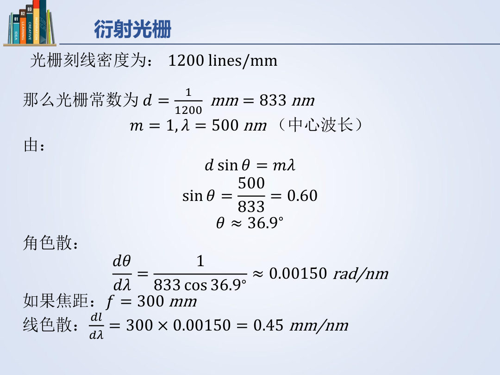

### 本页文字

```text
衍射光栅

光栅刻线密度为： 1200 lines/mm

                       1
那么光栅常数为𝑑=  mm = 833 nm
                      1200
       𝑚= 1, 𝜆= 500 nm （中心波长）
由：
                     𝑑sin 𝜃= 𝑚𝜆
                       500
                       sin 𝜃=   = 0.60
                       833
                    𝜃≈36.9∘
角色散：
         𝑑𝜃       1
        𝑑𝜆= 833 cos 36.9∘≈0.00150 rad/nm
如果焦距：𝑓= 300 mm
           𝑑𝑙
线色散：𝑑𝜆= 300 × 0.00150 = 0.45 mm/nm
```

## 第 69 页

**页面标题/首行：** 衍射光栅

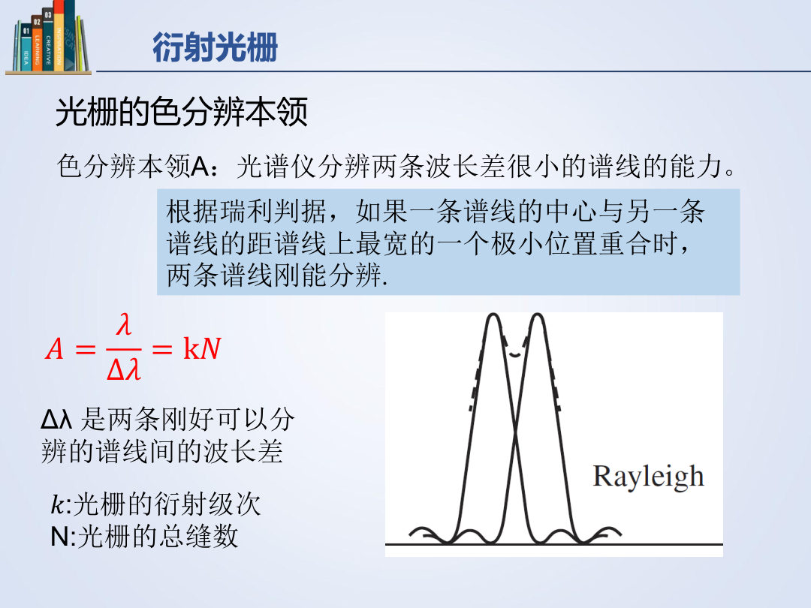

### 本页文字

```text
衍射光栅

光栅的色分辨本领

 色分辨本领A：光谱仪分辨两条波长差很小的谱线的能力。

     根据瑞利判据，如果一条谱线的中心与另一条
     谱线的距谱线上最宽的一个极小位置重合时，
     两条谱线刚能分辨.

     𝜆
𝐴= Δ𝜆= k𝑁

Δλ 是两条刚好可以分
辨的谱线间的波长差

𝑘:光栅的衍射级次
N:光栅的总缝数
```

## 第 70 页

**页面标题/首行：** 衍射光栅

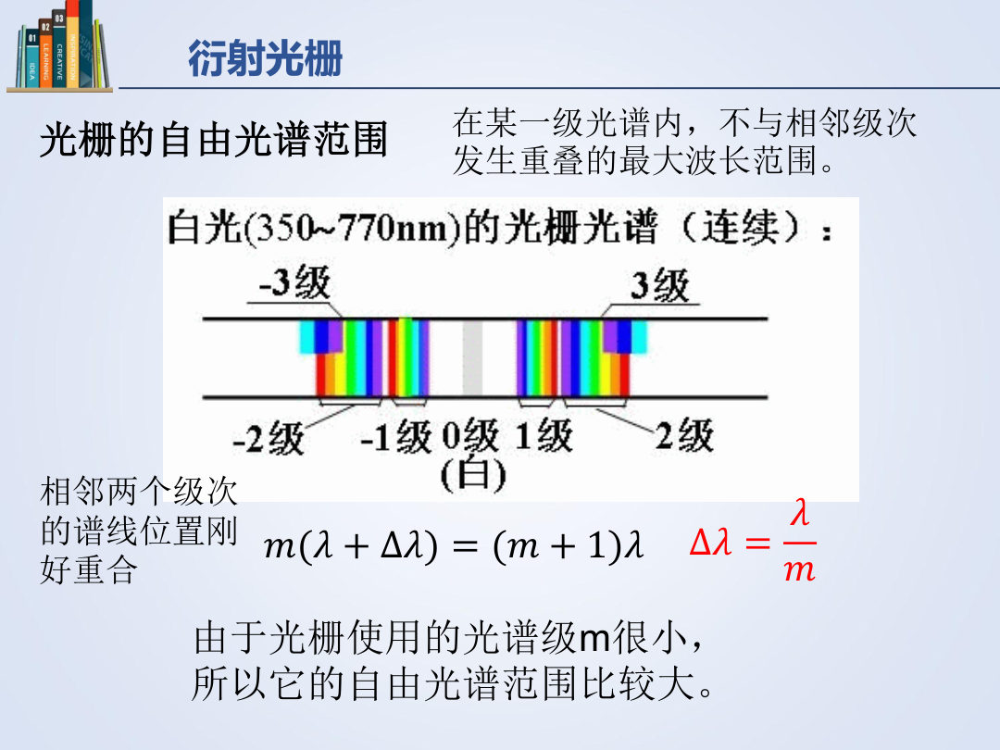

### 本页文字

```text
衍射光栅

            在某一级光谱内，不与相邻级次
光栅的自由光谱范围
            发生重叠的最大波长范围。

相邻两个级次
                                     𝜆的谱线位置刚        𝑚(𝜆+ Δ𝜆) = (𝑚+ 1)𝜆  Δ𝜆=
好重合                    𝑚

    由于光栅使用的光谱级m很小，
    所以它的自由光谱范围比较大。
```

## 第 71 页

**页面标题/首行：** 荧光光谱仪 / 二级衍射问题

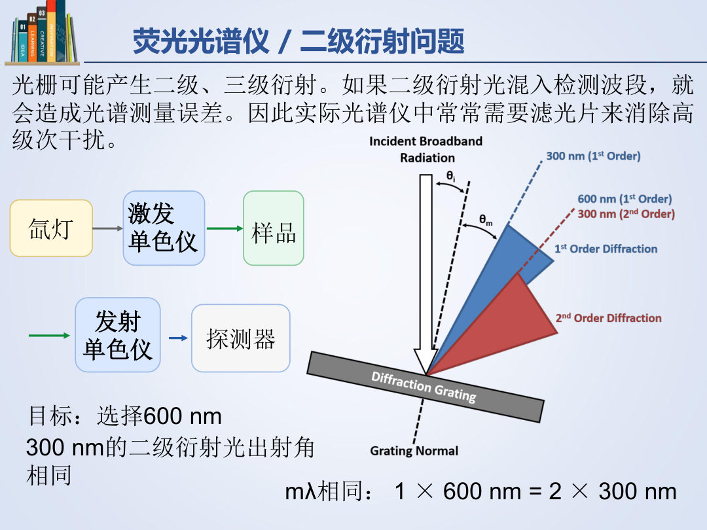

### 本页文字

```text
荧光光谱仪 / 二级衍射问题

光栅可能产生二级、三级衍射。如果二级衍射光混入检测波段，就
会造成光谱测量误差。因此实际光谱仪中常常需要滤光片来消除高
级次干扰。

     激发
 氙灯          样品     单色仪

    发射
        探测器   单色仪

 目标：选择600 nm
 300 nm的二级衍射光出射角
 相同
             mλ相同： 1 × 600 nm = 2 × 300 nm
```

## 第 72 页

**页面标题/首行：** 荧光光谱仪 / 二级衍射问题

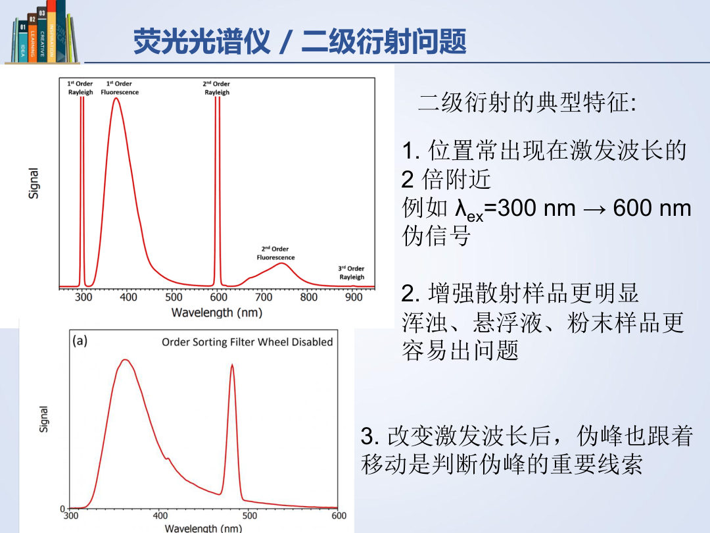

### 本页文字

```text
荧光光谱仪 / 二级衍射问题

             二级衍射的典型特征:

                           1. 位置常出现在激发波长的
                    2 倍附近
           例如 λex=300 nm → 600 nm
           伪信号

                           2. 增强散射样品更明显
           浑浊、悬浮液、粉末样品更
           容易出问题

                       3. 改变激发波长后，伪峰也跟着
          移动是判断伪峰的重要线索
```

## 第 73 页

**页面标题/首行：** 荧光光谱仪 / 二级衍射问题

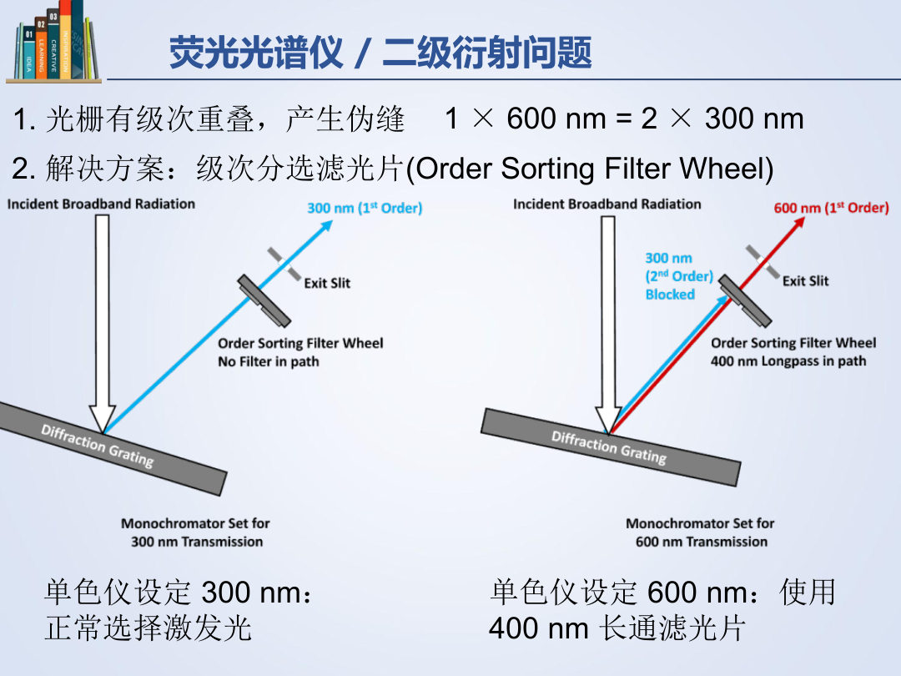

### 本页文字

```text
荧光光谱仪 / 二级衍射问题

1. 光栅有级次重叠，产生伪缝  1 × 600 nm = 2 × 300 nm
2. 解决方案：级次分选滤光片(Order Sorting Filter Wheel)

 单色仪设定 300 nm：     单色仪设定 600 nm：使用
 正常选择激发光              400 nm 长通滤光片
```

## 第 74 页

**页面标题/首行：** 荧光光谱仪 / 二级衍射问题

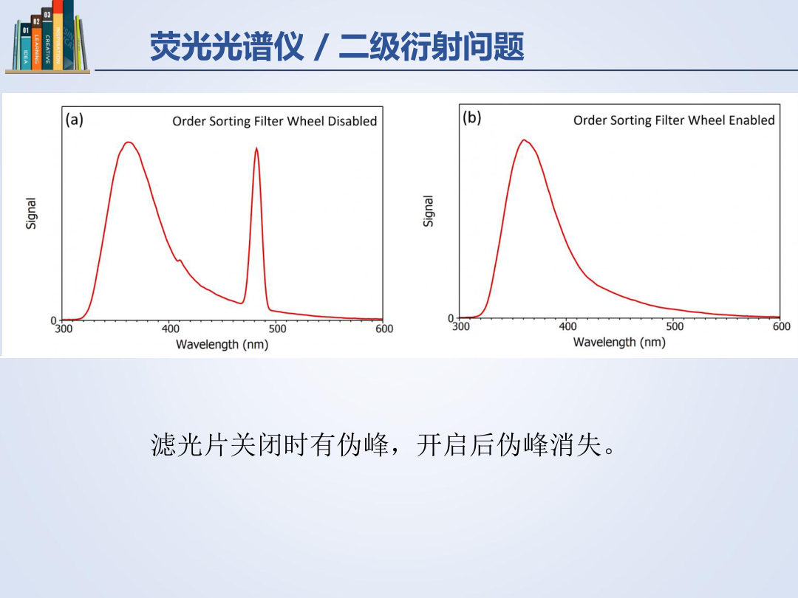

### 本页文字

```text
荧光光谱仪 / 二级衍射问题

滤光片关闭时有伪峰，开启后伪峰消失。
```

## 第 75 页

**页面标题/首行：** 衍射光栅-反射光栅

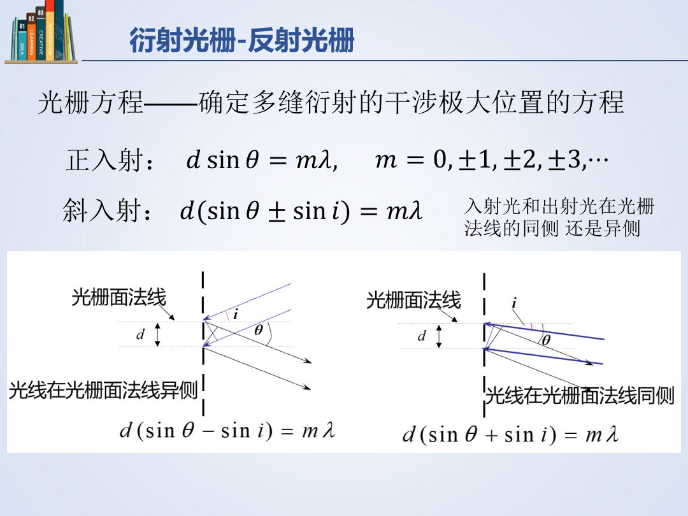

### 本页文字

```text
衍射光栅-反射光栅

光栅方程——确定多缝衍射的干涉极大位置的方程

 正入射： 𝑑sin 𝜃= 𝑚𝜆, 𝑚= 0, ±1, ±2, ±3,⋅⋅⋅

 斜入射： 𝑑(sin 𝜃± sin 𝑖) = 𝑚𝜆  入射光和出射光在光栅
                      法线的同侧 还是异侧
```

## 第 76 页

**页面标题/首行：** 衍射光栅-闪耀光栅

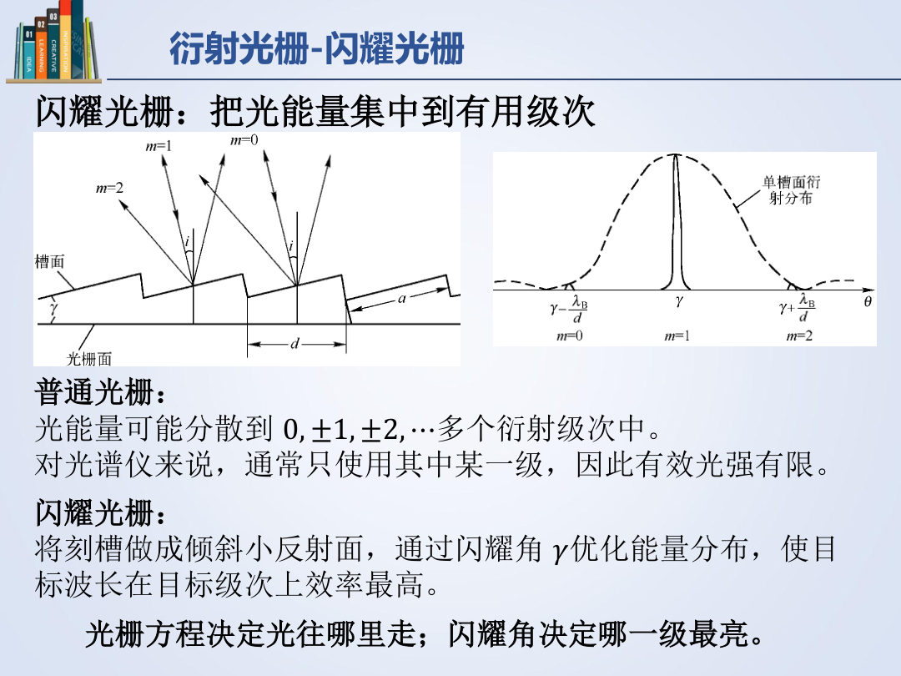

### 本页文字

```text
衍射光栅-闪耀光栅

闪耀光栅：把光能量集中到有用级次

普通光栅：
光能量可能分散到 0, ±1, ±2, ⋯多个衍射级次中。
对光谱仪来说，通常只使用其中某一级，因此有效光强有限。

闪耀光栅：
将刻槽做成倾斜小反射面，通过闪耀角 𝛾优化能量分布，使目
标波长在目标级次上效率最高。

  光栅方程决定光往哪里走；闪耀角决定哪一级最亮。
```

## 第 77 页

**页面标题/首行：** 衍射光栅-闪耀光栅

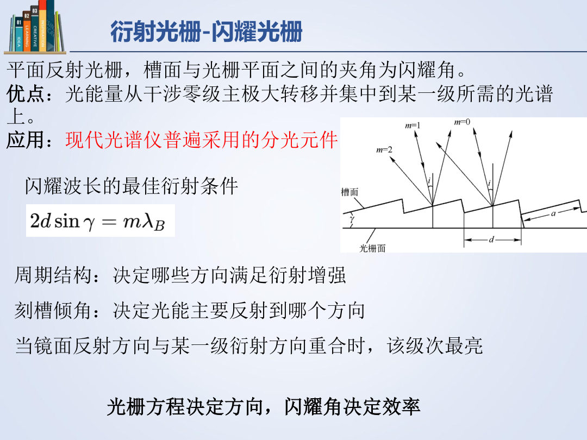

### 本页文字

```text
衍射光栅-闪耀光栅

平面反射光栅，槽面与光栅平面之间的夹角为闪耀角。
优点：光能量从干涉零级主极大转移并集中到某一级所需的光谱
上。
应用：现代光谱仪普遍采用的分光元件；

 闪耀波长的最佳衍射条件

周期结构：决定哪些方向满足衍射增强

刻槽倾角：决定光能主要反射到哪个方向

当镜面反射方向与某一级衍射方向重合时，该级次最亮

     光栅方程决定方向，闪耀角决定效率
```

## 第 78 页

**页面标题/首行：** 衍射光栅

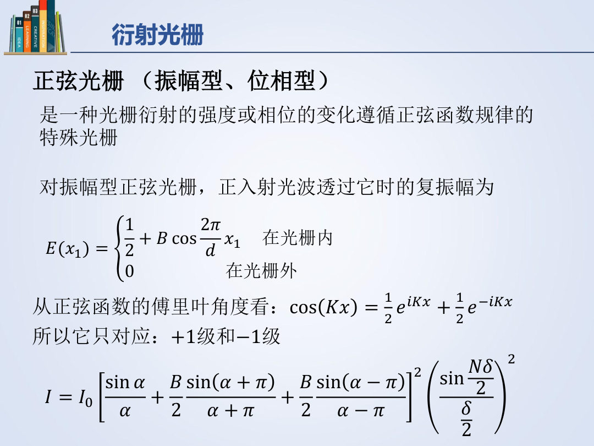

### 本页文字

```text
衍射光栅

正弦光栅 （振幅型、位相型）

是一种光栅衍射的强度或相位的变化遵循正弦函数规律的
特殊光栅

对振幅型正弦光栅，正入射光波透过它时的复振幅为

         1      2𝜋
        + 𝐵cos    在光栅内  𝐸(𝑥1) = ቐ 2      𝑑𝑥1
         0     在光栅外

                                          1        1
从正弦函数的傅里叶角度看：cos 𝐾𝑥=  𝑒𝑖𝐾𝑥+  𝑒−𝑖𝐾𝑥
                                          2        2
所以它只对应：+1级和−1级
                                                         2
                                   𝑁𝛿                                              2                                                 sin         sin 𝛼  𝐵 sin 𝛼+ 𝜋  𝐵 sin 𝛼−𝜋                                        2
 𝐼= 𝐼0    +        +       𝛼    2  𝛼+ 𝜋    2  𝛼−𝜋       𝛿
                                       2
```

## 第 79 页

**页面标题/首行：** 衍射光栅

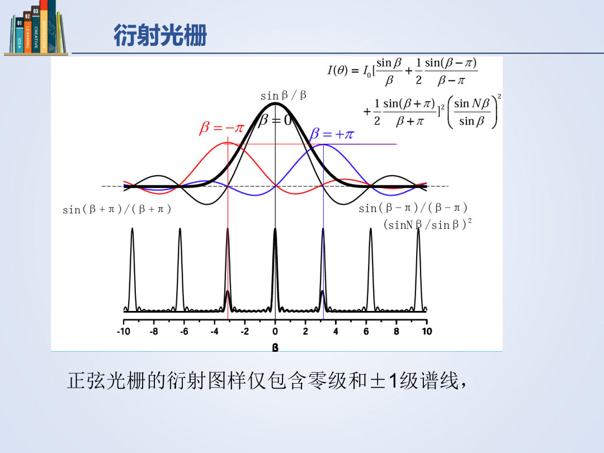

### 本页文字

```text
衍射光栅

正弦光栅的衍射图样仅包含零级和±1级谱线，
```

## 第 80 页

**页面标题/首行：** 填空题 1分

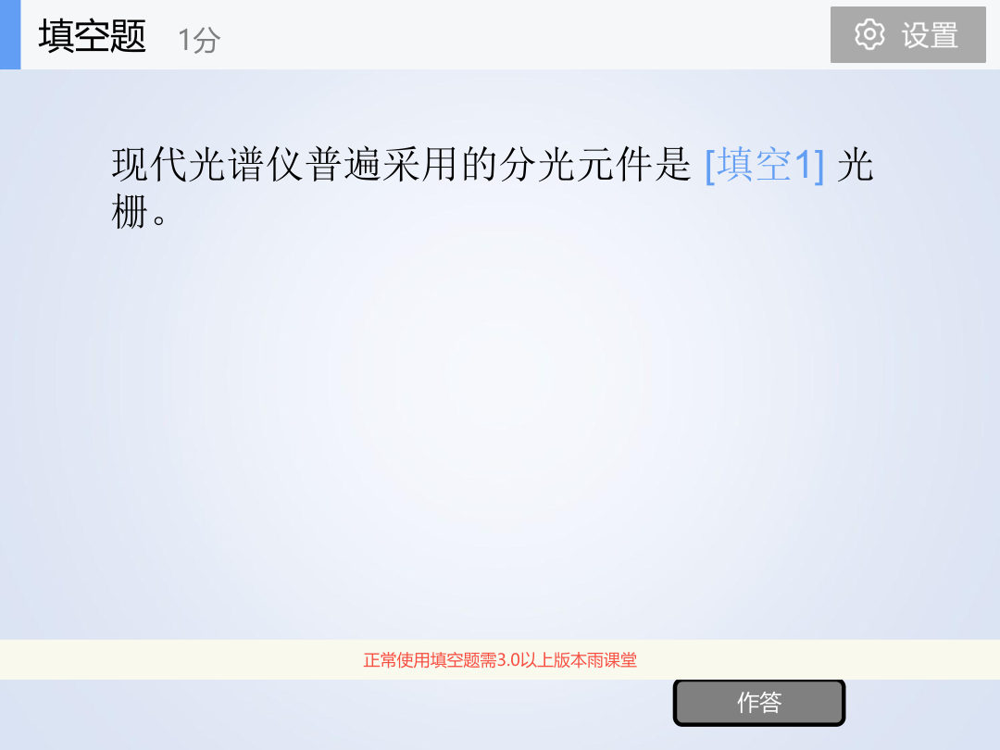

### 本页文字

```text
填空题 1分

  现代光谱仪普遍采用的分光元件是 [填空1] 光
  栅。

                     正常使用填空题需3.0以上版本雨课堂

                                作答
```

## 第 81 页

**页面标题/首行：** 衍射光栅-一维光栅

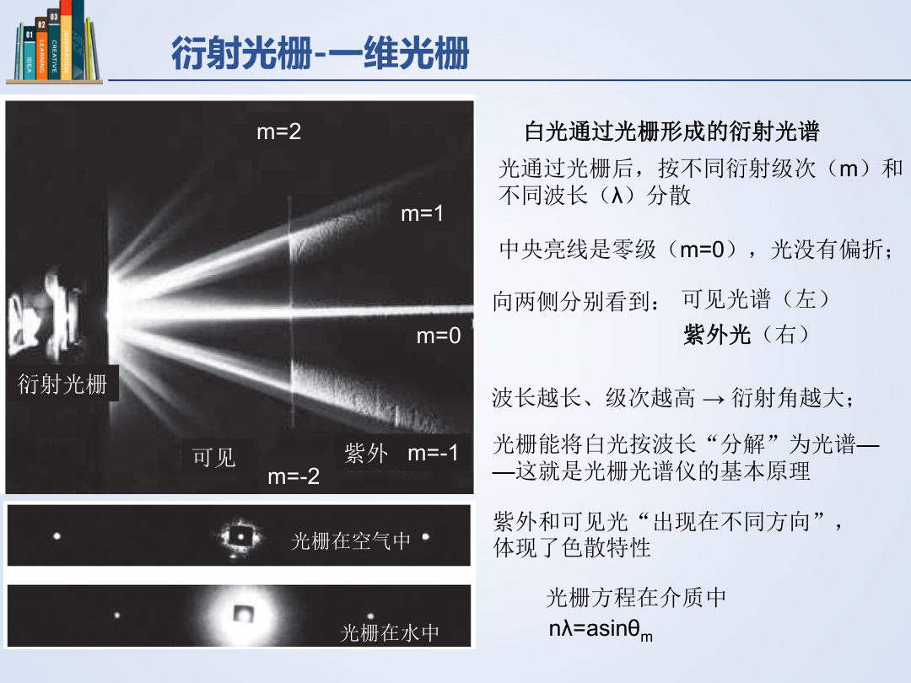

### 本页文字

```text
衍射光栅-一维光栅

                m=2          白光通过光栅形成的衍射光谱
                     光通过光栅后，按不同衍射级次（m）和
                      不同波长（λ）分散
                          m=1
                      中央亮线是零级（m=0），光没有偏折；

                    向两侧分别看到：可见光谱（左）
                           m=0          紫外光（右）

衍射光栅
                     波长越长、级次越高 → 衍射角越大；

                     光栅能将白光按波长“分解”为光谱—              紫外 m=-1        可见
                     —这就是光栅光谱仪的基本原理                   m=-2

                     紫外和可见光“出现在不同方向”，
              光栅在空气中                     体现了色散特性

                       光栅方程在介质中
                光栅在水中         nλ=asinθm
```

## 第 82 页

**页面标题/首行：** 衍射光栅-二维光栅

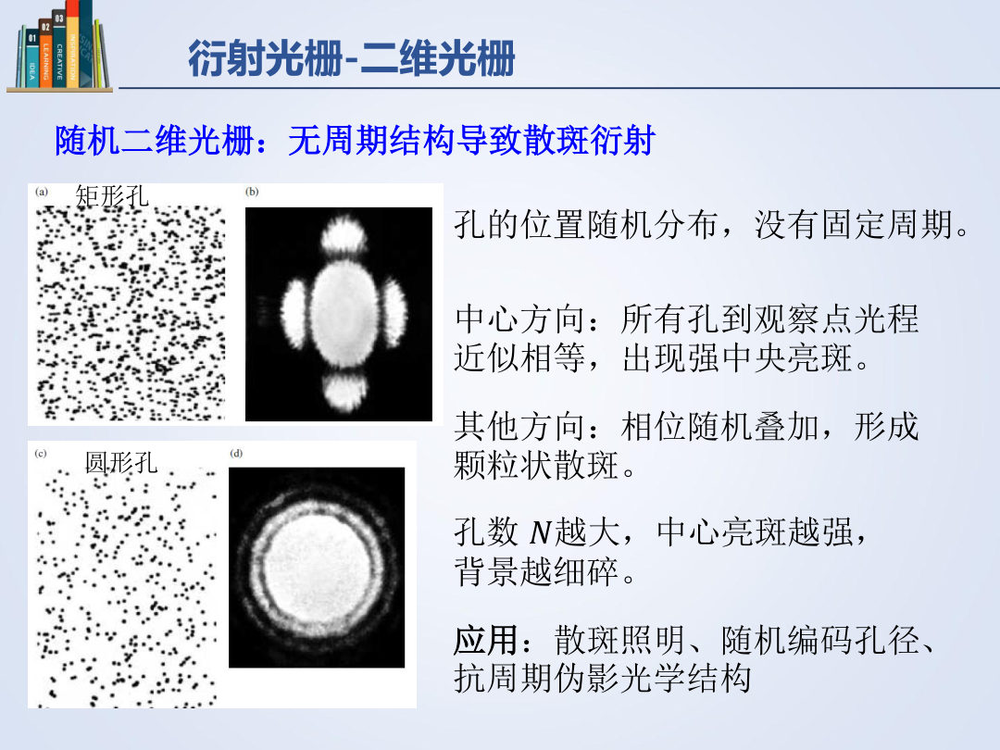

### 本页文字

```text
衍射光栅-二维光栅

随机二维光栅：无周期结构导致散斑衍射

 矩形孔
            孔的位置随机分布，没有固定周期。

            中心方向：所有孔到观察点光程
            近似相等，出现强中央亮斑。

            其他方向：相位随机叠加，形成
 圆形孔         颗粒状散斑。

            孔数 𝑁越大，中心亮斑越强，
            背景越细碎。

            应用：散斑照明、随机编码孔径、
            抗周期伪影光学结构
```

## 第 83 页

**页面标题/首行：** 衍射光栅-二维光栅

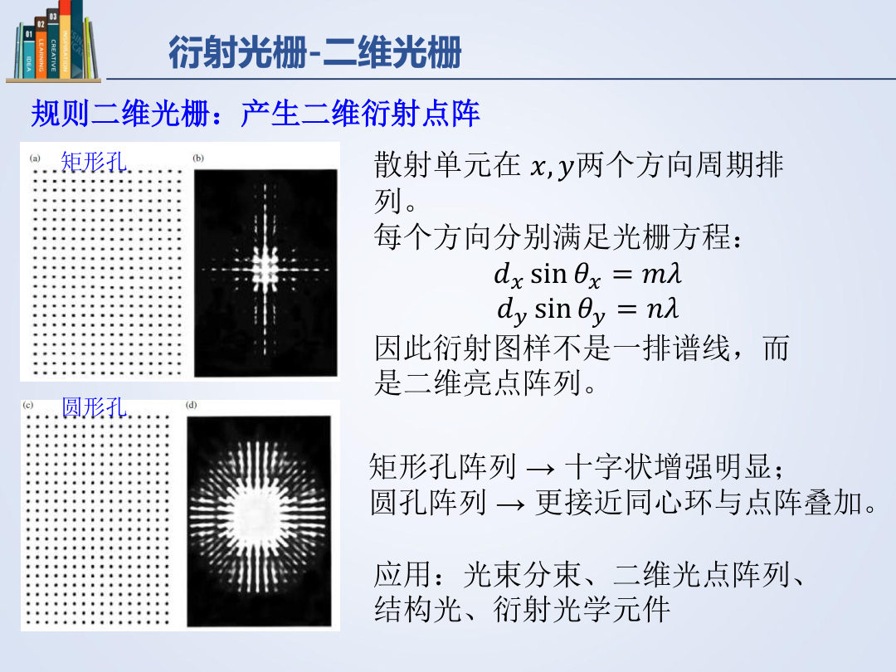

### 本页文字

```text
衍射光栅-二维光栅

规则二维光栅：产生二维衍射点阵

 矩形孔        散射单元在 𝑥, 𝑦两个方向周期排
           列。
           每个方向分别满足光栅方程：
                               𝑑𝑥sin 𝜃𝑥= 𝑚𝜆
                               𝑑𝑦sin 𝜃𝑦= 𝑛𝜆
           因此衍射图样不是一排谱线，而
           是二维亮点阵列。
 圆形孔

           矩形孔阵列 → 十字状增强明显；
           圆孔阵列 → 更接近同心环与点阵叠加。

           应用：光束分束、二维光点阵列、
           结构光、衍射光学元件
```

## 第 84 页

**页面标题/首行：** 拓展：晶体作为天然三维光栅

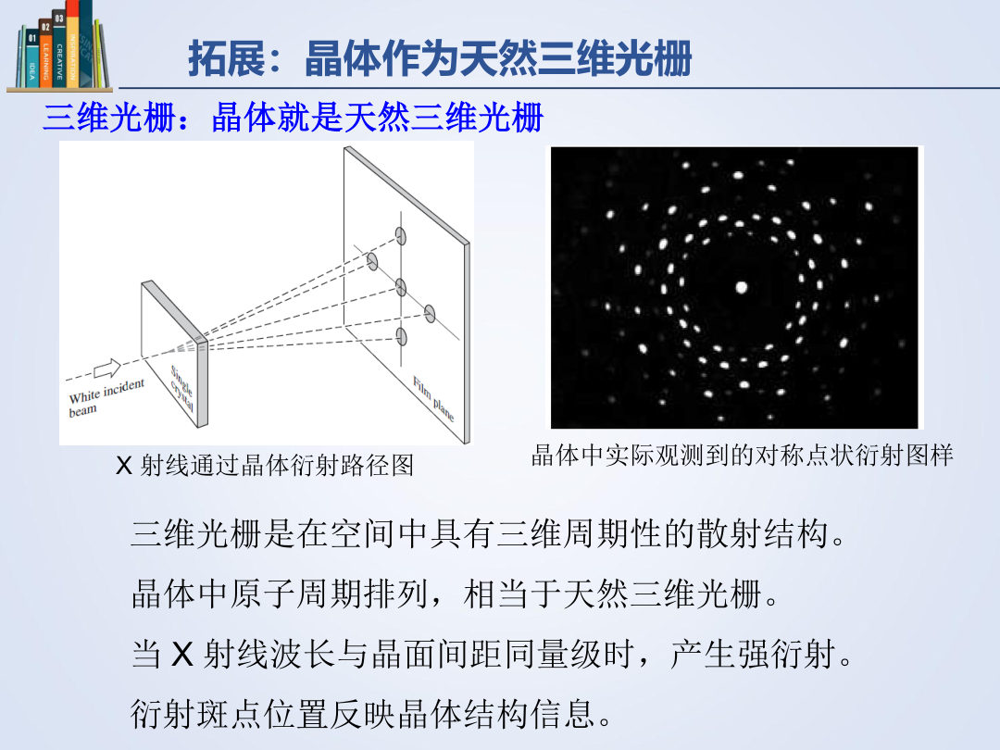

### 本页文字

```text
拓展：晶体作为天然三维光栅

三维光栅：晶体就是天然三维光栅

                   晶体中实际观测到的对称点状衍射图样    X 射线通过晶体衍射路径图

   三维光栅是在空间中具有三维周期性的散射结构。

   晶体中原子周期排列，相当于天然三维光栅。

   当 X 射线波长与晶面间距同量级时，产生强衍射。

   衍射斑点位置反映晶体结构信息。
```

## 第 85 页

**页面标题/首行：** 衍射光栅应用例子

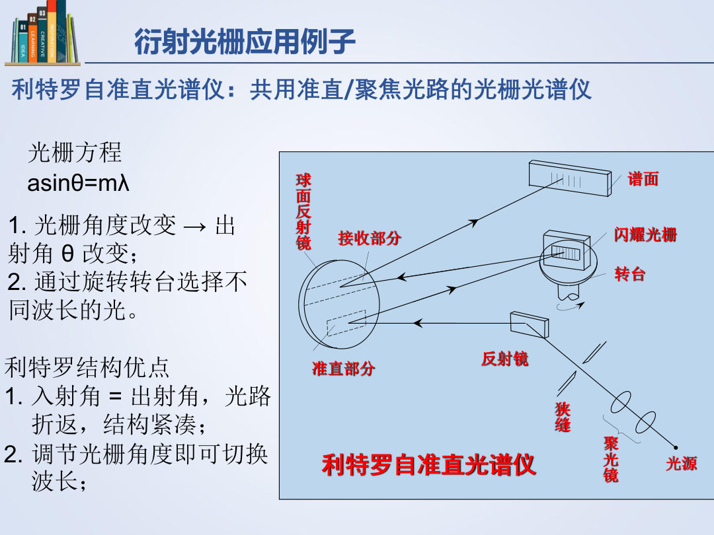

### 本页文字

```text
衍射光栅应用例子

利特罗自准直光谱仪：共用准直/聚焦光路的光栅光谱仪

 光栅方程
  asinθ=mλ           球                    谱面                  面
                  反
                  射1. 光栅角度改变 → 出                                      闪耀光栅                     接收部分                  镜
射角 θ 改变；
2. 通过旋转转台选择不                       转台
同波长的光。

                              反射镜
利特罗结构优点         准直部分
1. 入射角 = 出射角，光路                                   狭
                                   缝 折返，结构紧凑；
                                      聚
2. 调节光栅角度即可切换                     光             利特罗自准直光谱仪        光源
 波长；                                镜
```

## 第 86 页

**页面标题/首行：** 衍射光栅

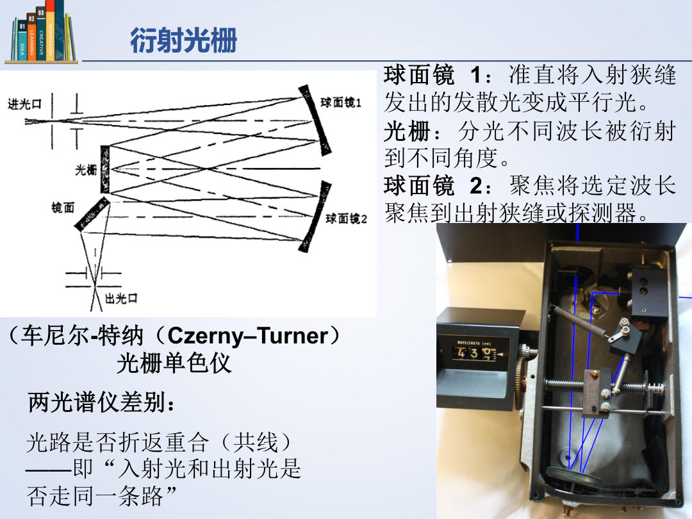

### 本页文字

```text
衍射光栅
                球面镜 1：准直将入射狭缝
                 发出的发散光变成平行光。
                光栅：分光不同波长被衍射
                 到不同角度。
                球面镜 2：聚焦将选定波长
                 聚焦到出射狭缝或探测器。

（车尼尔-特纳（Czerny–Turner）
     光栅单色仪

 两光谱仪差别：

 光路是否折返重合（共线）
 ——即“入射光和出射光是
 否走同一条路”
```

## 第 87 页

**页面标题/首行：** 衍射光栅

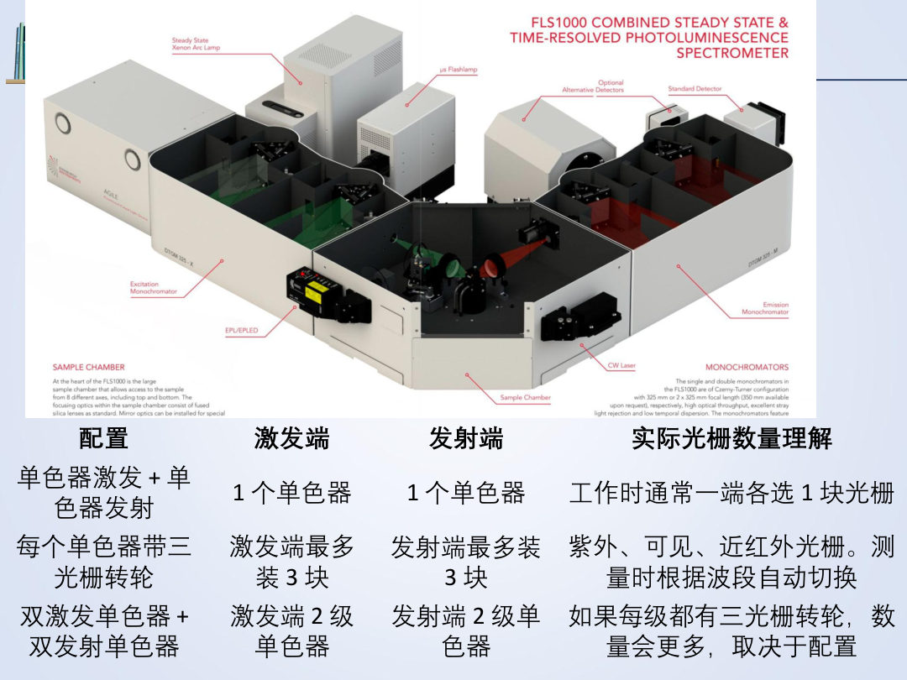

### 本页文字

```text
衍射光栅

  配置     激发端    发射端     实际光栅数量理解
单色器激发 + 单
                 1 个单色器    1 个单色器  工作时通常一端各选 1 块光栅
 色器发射
每个单色器带三 激发端最多 发射端最多装 紫外、可见、近红外光栅。测
 光栅转轮    装 3 块         3 块     量时根据波段自动切换
双激发单色器 +  激发端 2 级 发射端 2 级单 如果每级都有三光栅转轮，数
双发射单色器   单色器    色器     量会更多，取决于配置
```

## 第 88 页

**页面标题/首行：** 光波分复用器——把不同波长分配到不同光纤通道

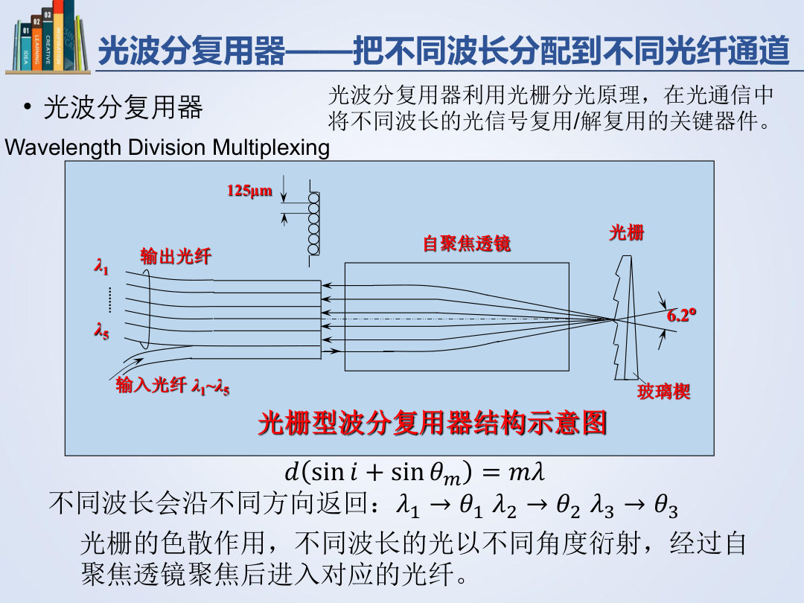

### 本页文字

```text
光波分复用器——把不同波长分配到不同光纤通道

              光波分复用器利用光栅分光原理，在光通信中  • 光波分复用器               将不同波长的光信号复用/解复用的关键器件。
Wavelength Division Multiplexing

                        125μm

                                  光栅
                       自聚焦透镜
        输出光纤
             λ1

                                                                                            6.2º
             λ5

      输入光纤 λ1~λ5                       玻璃楔
         光栅型波分复用器结构示意图

                  𝑑sin 𝑖+ sin 𝜃𝑚= 𝑚𝜆
  不同波长会沿不同方向返回：𝜆1 →𝜃1 𝜆2 →𝜃2 𝜆3 →𝜃3
   光栅的色散作用，不同波长的光以不同角度衍射，经过自
   聚焦透镜聚焦后进入对应的光纤。
```

## 第 89 页

**页面标题/首行：** 光纤光栅：用反射峰漂移测温度和应变

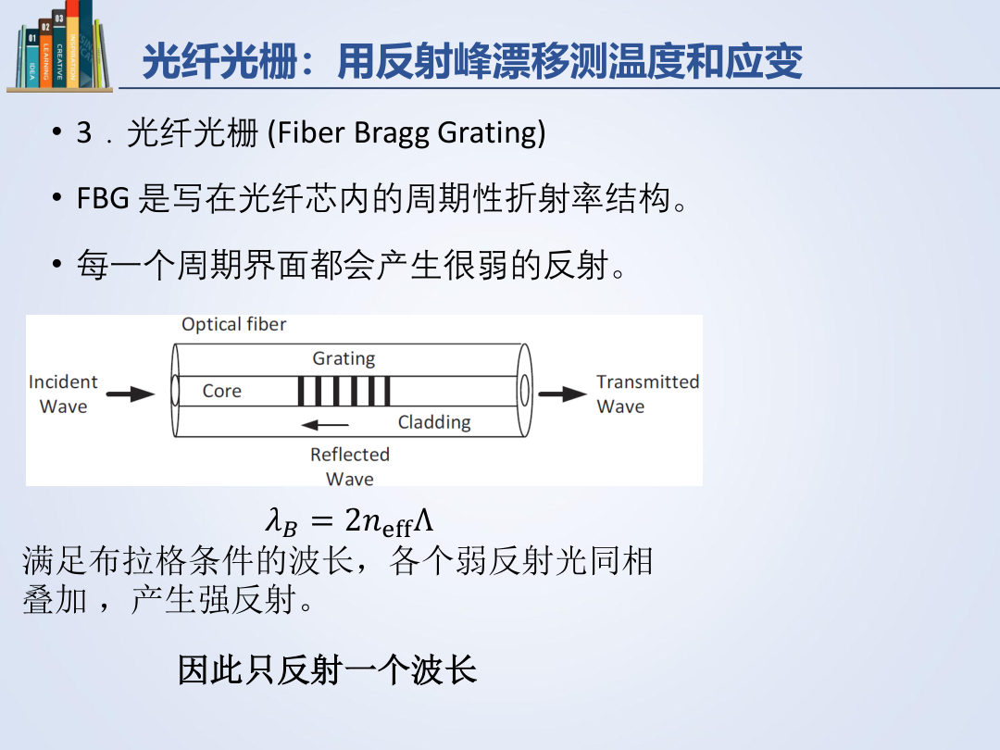

### 本页文字

```text
光纤光栅：用反射峰漂移测温度和应变

   • 3．光纤光栅 (Fiber Bragg Grating)

   • FBG 是写在光纤芯内的周期性折射率结构。

   • 每一个周期界面都会产生很弱的反射。

          𝜆𝐵= 2𝑛effΛ
满足布拉格条件的波长，各个弱反射光同相
叠加 ，产生强反射。

     因此只反射一个波长
```

## 第 90 页

**页面标题/首行：** 光纤光栅：用反射峰漂移测温度和应变

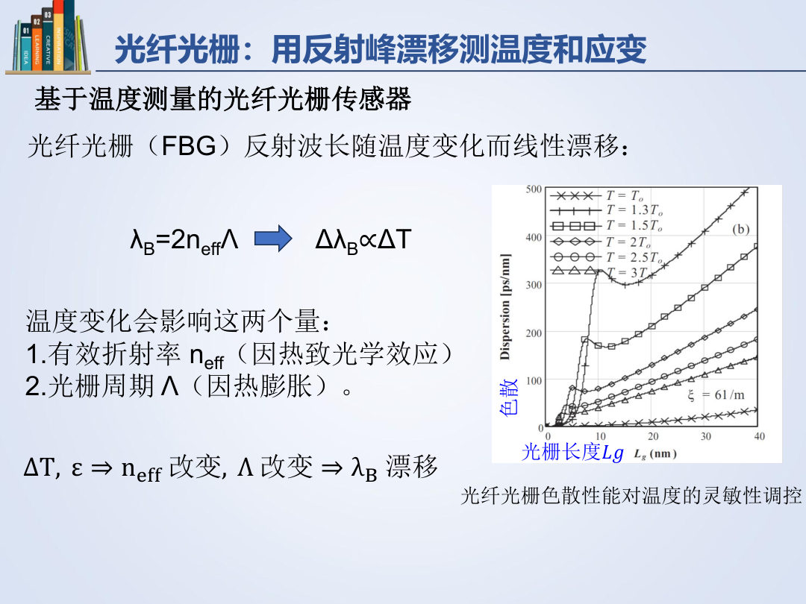

### 本页文字

```text
光纤光栅：用反射峰漂移测温度和应变

基于温度测量的光纤光栅传感器

光纤光栅（FBG）反射波长随温度变化而线性漂移：

          λB​=2neffΛ     ΔλB∝ΔT

温度变化会影响这两个量：
1.有效折射率 neff（因热致光学效应）
2.光栅周期 Λ（因热膨胀）。                                               色散

                             光栅长度𝐿𝑔
ΔT, ε ⇒neff 改变, Λ 改变⇒λB 漂移
                      光纤光栅色散性能对温度的灵敏性调控
```
