# 第八章 莫尔测试技术

- 源文件：`第八章 莫尔测试技术.pdf`
- 页数：22
- 转换方式：每页保留原始页面截图，并提取 PDF 文本层作为可检索内容。
- 说明：公式、复杂图形、版式细节以页面截图为准；文字区用于搜索和快速复习。

## 页面索引

- [第 1 页：广州大学](#第-1-页)
- [第 2 页：莫尔测试技术](#第-2-页)
- [第 3 页：莫尔测试技术](#第-3-页)
- [第 4 页：莫尔测试技术](#第-4-页)
- [第 5 页：莫尔测试技术](#第-5-页)
- [第 6 页：莫尔条纹的本质：周期结构叠加产生空间拍频](#第-6-页)
- [第 7 页：莫尔条纹的数学来源：差频项](#第-7-页)
- [第 8 页：莫尔条纹的数学来源：差频项](#第-8-页)
- [第 9 页：莫尔条纹的位置由相位差决定](#第-9-页)
- [第 10 页：莫尔条纹的位置由相位差决定](#第-10-页)
- [第 11 页：莫尔测试技术](#第-11-页)
- [第 12 页：莫尔测试技术](#第-12-页)
- [第 13 页：莫尔测试技术](#第-13-页)
- [第 14 页：莫尔测试技术](#第-14-页)
- [第 15 页：莫尔测试技术的发展与应用](#第-15-页)
- [第 16 页：莫尔测试技术](#第-16-页)
- [第 17 页：莫尔测试技术](#第-17-页)
- [第 18 页：莫尔测试技术](#第-18-页)
- [第 19 页：莫尔测试技术](#第-19-页)
- [第 20 页：莫尔测试技术](#第-20-页)
- [第 21 页：莫尔测试技术](#第-21-页)
- [第 22 页：莫尔测试技术](#第-22-页)

## 第 1 页

**页面标题/首行：** 广州大学


### 本页文字

```text
广州大学

光电检测技术
     方佳文

   jiawen.fang@gzhu.edu.cn
```

## 第 2 页

**页面标题/首行：** 莫尔测试技术


### 本页文字

```text
莫尔测试技术

                      图像测试技术
    第八章
                      光纤传感技术
其他典型光电测试技术
                      层析探测技术

                      纳米技术中的光电检测技术
```

## 第 3 页

**页面标题/首行：** 莫尔测试技术


### 本页文字

```text
莫尔测试技术

• 视频

                                                    3
```

## 第 4 页

**页面标题/首行：** 莫尔测试技术

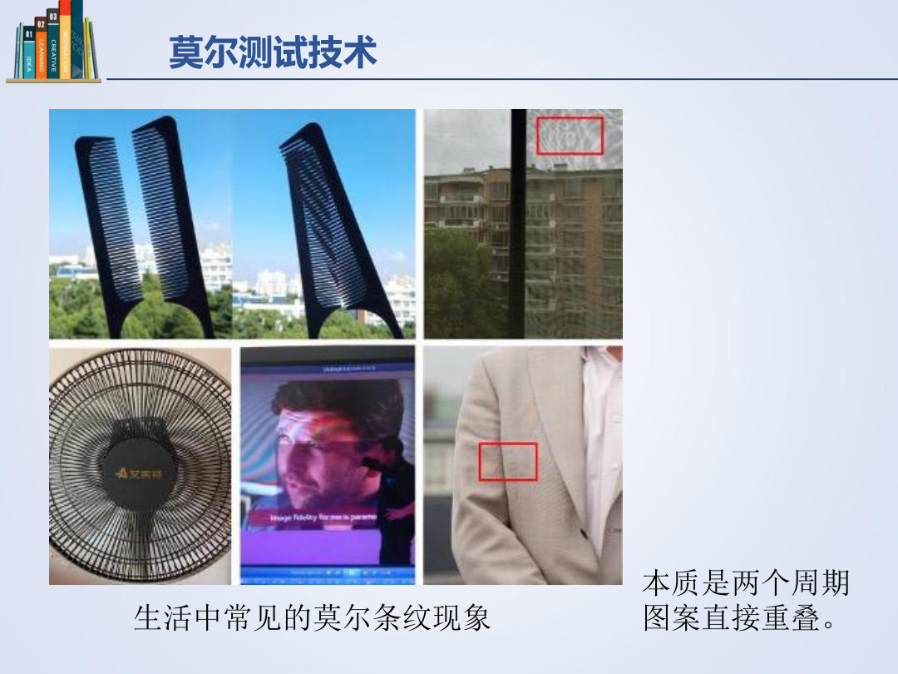

### 本页文字

```text
莫尔测试技术

                 本质是两个周期
生活中常见的莫尔条纹现象     图案直接重叠。
```

## 第 5 页

**页面标题/首行：** 莫尔测试技术

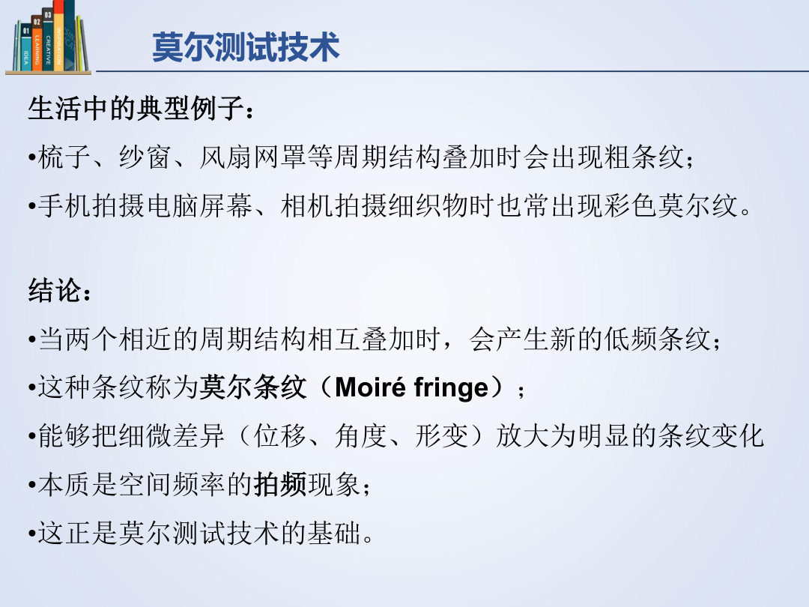

### 本页文字

```text
莫尔测试技术

生活中的典型例子：

•梳子、纱窗、风扇网罩等周期结构叠加时会出现粗条纹；

•手机拍摄电脑屏幕、相机拍摄细织物时也常出现彩色莫尔纹。

结论：

•当两个相近的周期结构相互叠加时，会产生新的低频条纹；

•这种条纹称为莫尔条纹（Moiré fringe）；

•能够把细微差异（位移、角度、形变）放大为明显的条纹变化

•本质是空间频率的拍频现象；

•这正是莫尔测试技术的基础。
```

## 第 6 页

**页面标题/首行：** 莫尔条纹的本质：周期结构叠加产生空间拍频

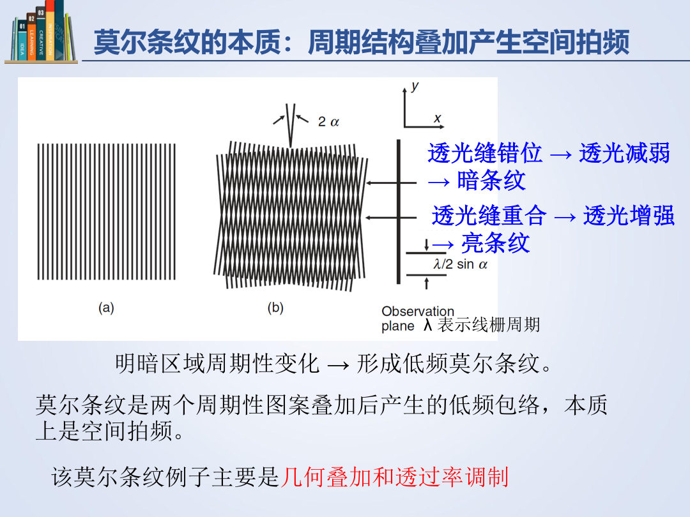

### 本页文字

```text
莫尔条纹的本质：周期结构叠加产生空间拍频

                 透光缝错位 → 透光减弱
                 → 暗条纹
                 透光缝重合 → 透光增强
                 → 亮条纹

                                             λ 表示线栅周期

   明暗区域周期性变化 → 形成低频莫尔条纹。

莫尔条纹是两个周期性图案叠加后产生的低频包络，本质
上是空间拍频。

 该莫尔条纹例子主要是几何叠加和透过率调制
```

## 第 7 页

**页面标题/首行：** 莫尔条纹的数学来源：差频项

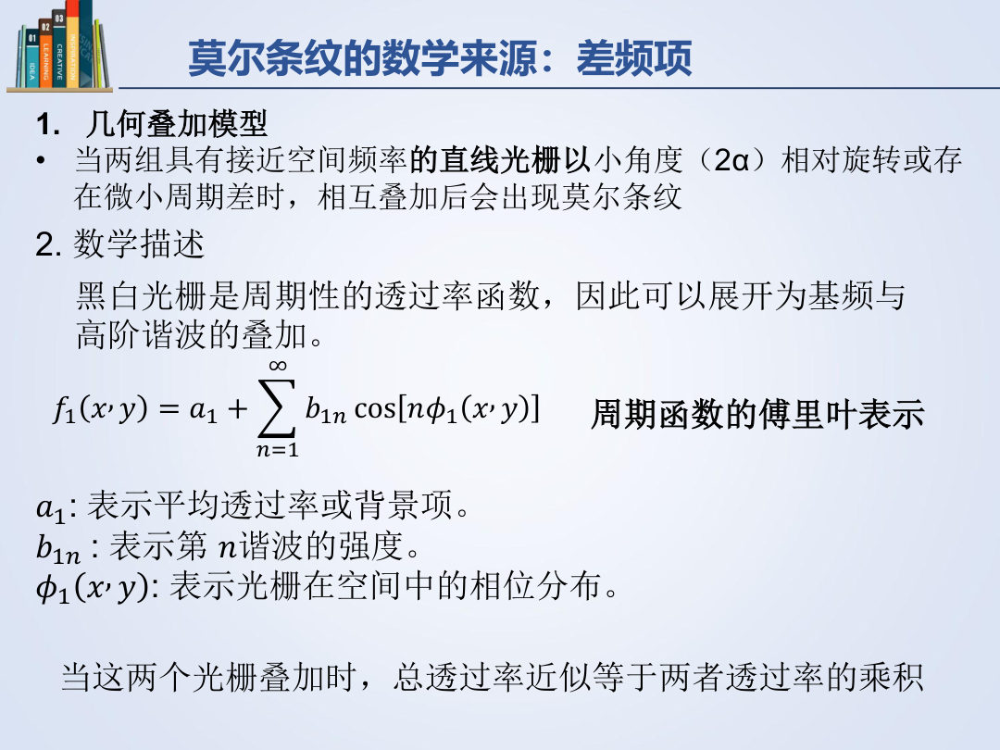

### 本页文字

```text
莫尔条纹的数学来源：差频项

1. 几何叠加模型
• 当两组具有接近空间频率的直线光栅以小角度（2α）相对旋转或存
 在微小周期差时，相互叠加后会出现莫尔条纹
2. 数学描述
 黑白光栅是周期性的透过率函数，因此可以展开为基频与
 高阶谐波的叠加。
           ∞
 𝑓1 𝑥𝑦= 𝑎1 + ෍ 𝑏1𝑛cos 𝑛𝜙1 𝑥𝑦  周期函数的傅里叶表示
               𝑛=1

𝑎1: 表示平均透过率或背景项。
𝑏1𝑛: 表示第 𝑛谐波的强度。
  𝑥𝑦: 表示光栅在空间中的相位分布。𝜙1

 当这两个光栅叠加时，总透过率近似等于两者透过率的乘积
```

## 第 8 页

**页面标题/首行：** 莫尔条纹的数学来源：差频项

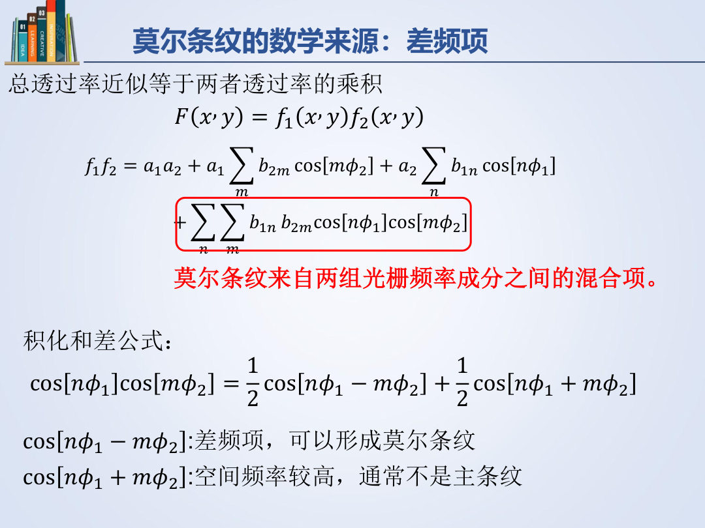

### 本页文字

```text
莫尔条纹的数学来源：差频项

总透过率近似等于两者透过率的乘积
       𝐹𝑥𝑦= 𝑓1 𝑥𝑦𝑓2 𝑥𝑦

          𝑓1𝑓2 = 𝑎1𝑎2 + 𝑎1 ෍ 𝑏2𝑚cos 𝑚𝜙2 + 𝑎2 ෍ 𝑏1𝑛cos 𝑛𝜙1
                 𝑚                   𝑛

           + ෍ ෍ 𝑏1𝑛𝑏2𝑚cos 𝑛𝜙1 cos 𝑚𝜙2
                     𝑛 𝑚
       莫尔条纹来自两组光栅频率成分之间的混合项。

 积化和差公式：
                  1               1
  cos 𝑛𝜙1 cos 𝑚𝜙2 =  cos 𝑛𝜙1 −𝑚𝜙2 +  cos 𝑛𝜙1 + 𝑚𝜙2
                  2               2

 cos      :差频项，可以形成莫尔条纹    𝑛𝜙1 −𝑚𝜙2
 cos   +   :空间频率较高，通常不是主条纹    𝑛𝜙1  𝑚𝜙2
```

## 第 9 页

**页面标题/首行：** 莫尔条纹的位置由相位差决定

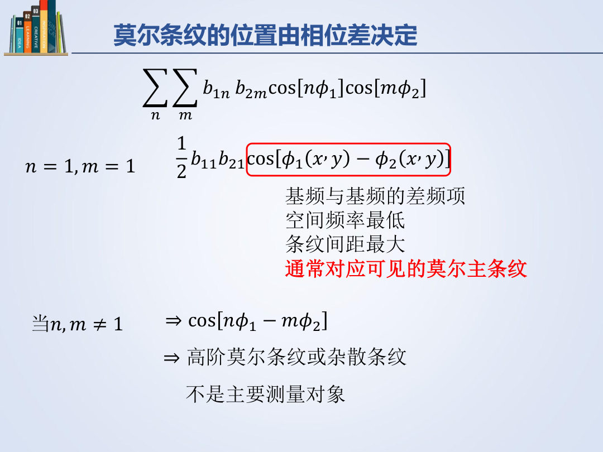

### 本页文字

```text
莫尔条纹的位置由相位差决定

    ෍ ෍ 𝑏1𝑛𝑏2𝑚cos 𝑛𝜙1 cos 𝑚𝜙2
             𝑛 𝑚

              1
                  𝑏11𝑏21cos 𝜙1 𝑥𝑦−𝜙2 𝑥𝑦𝑛= 1, 𝑚= 1              2
             基频与基频的差频项
             空间频率最低
             条纹间距最大
             通常对应可见的莫尔主条纹

当𝑛, 𝑚≠1   ⇒cos 𝑛𝜙1 −𝑚𝜙2

       ⇒高阶莫尔条纹或杂散条纹

        不是主要测量对象
```

## 第 10 页

**页面标题/首行：** 莫尔条纹的位置由相位差决定

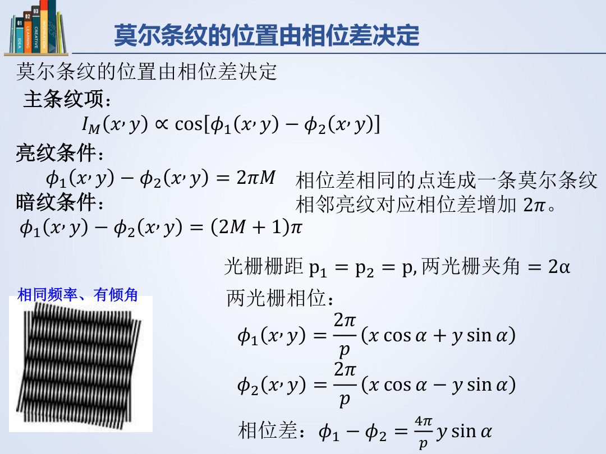

### 本页文字

```text
莫尔条纹的位置由相位差决定

莫尔条纹的位置由相位差决定
主条纹项：
    𝐼𝑀𝑥𝑦∝cos 𝜙1 𝑥𝑦−𝜙2 𝑥𝑦
亮纹条件：
   𝜙1 𝑥𝑦−𝜙2 𝑥𝑦= 2𝜋𝑀 相位差相同的点连成一条莫尔条纹
暗纹条件：         相邻亮纹对应相位差增加 2𝜋。
𝜙1 𝑥𝑦−𝜙2 𝑥𝑦= 2𝑀+ 1 𝜋

            光栅栅距p1 = p2 = p, 两光栅夹角= 2α
相同频率、有倾角    两光栅相位：
                           2𝜋
                    𝜙1 𝑥𝑦=    𝑥cos 𝛼+ 𝑦sin 𝛼
                             𝑝
                           2𝜋
                    𝜙2 𝑥𝑦=    𝑥cos 𝛼−𝑦sin 𝛼
                             𝑝
                                            4𝜋
             相位差：𝜙1 −𝜙2 = 𝑝𝑦sin 𝛼
```

## 第 11 页

**页面标题/首行：** 莫尔测试技术

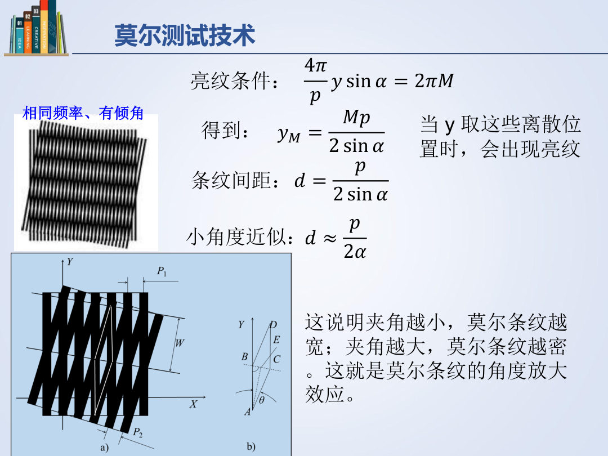

### 本页文字

```text
莫尔测试技术
         亮纹条件：4𝜋   𝛼= 2𝜋𝑀                       𝑝𝑦sin
相同频率、有倾角              𝑀𝑝                    当 y 取这些离散位         得到：𝑦𝑀=
                           2 sin 𝛼  置时，会出现亮纹
                             𝑝
         条纹间距：𝑑=
                            2 sin 𝛼
        小角度近似：𝑑≈𝑝
                           2𝛼

              这说明夹角越小，莫尔条纹越
              宽；夹角越大，莫尔条纹越密
              。这就是莫尔条纹的角度放大
              效应。
```

## 第 12 页

**页面标题/首行：** 莫尔测试技术

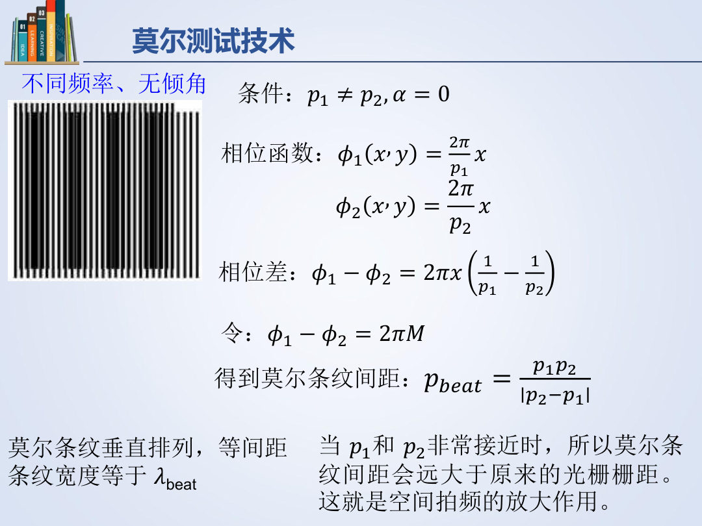

### 本页文字

```text
莫尔测试技术

 不同频率、无倾角
             条件：𝑝1 ≠𝑝2, 𝛼= 0

                                          2𝜋
          相位函数：𝜙1 𝑥𝑦=   𝑥                                                𝑝1
                                 2𝜋
                         𝜙2 𝑥𝑦=   𝑥
                                        𝑝2

                                                1    1
           相位差：𝜙1 −𝜙2 = 2𝜋𝑥  −                                                  𝑝1   𝑝2

            令：𝜙1 −𝜙2 = 2𝜋𝑀
                                                𝑝1𝑝2
          得到莫尔条纹间距：𝑝𝑏𝑒𝑎𝑡=                                                  ∣𝑝2−𝑝1∣

莫尔条纹垂直排列，等间距 当 𝑝1和 𝑝2非常接近时，所以莫尔条
条纹宽度等于       纹间距会远大于原来的光栅栅距。                 𝜆beat
             这就是空间拍频的放大作用。
```

## 第 13 页

**页面标题/首行：** 莫尔测试技术

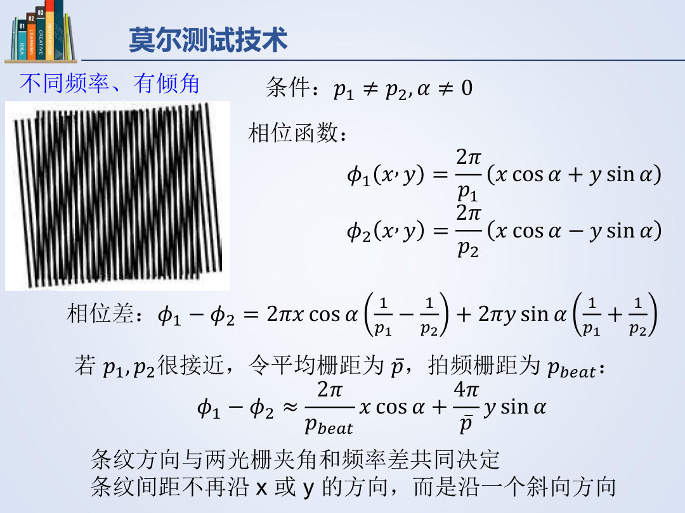

### 本页文字

```text
莫尔测试技术

不同频率、有倾角              条件：𝑝1 ≠𝑝2, 𝛼≠0

          相位函数：
                                 2𝜋
                           𝜙1 𝑥𝑦=    𝑥cos 𝛼+ 𝑦sin 𝛼
                                         𝑝1
                                 2𝜋
                          𝜙2 𝑥𝑦=    𝑥cos 𝛼−𝑦sin 𝛼
                                        𝑝2

                                     1    1                1    1
  相位差：𝜙1 −𝜙2 = 2𝜋𝑥cos 𝛼  −  + 2𝜋𝑦sin 𝛼  +                                       𝑝1   𝑝2                𝑝1   𝑝2

  若 𝑝1, 𝑝2很接近，令平均栅距为 ҧ𝑝，拍频栅距为 𝑝𝑏𝑒𝑎𝑡：
             ≈2𝜋 𝑥cos 𝛼+ 4𝜋    𝛼              𝜙1 −𝜙2                ҧ𝑝𝑦sin                             𝑝𝑏𝑒𝑎𝑡
   条纹方向与两光栅夹角和频率差共同决定
   条纹间距不再沿 x 或 y 的方向，而是沿一个斜向方向
```

## 第 14 页

**页面标题/首行：** 莫尔测试技术

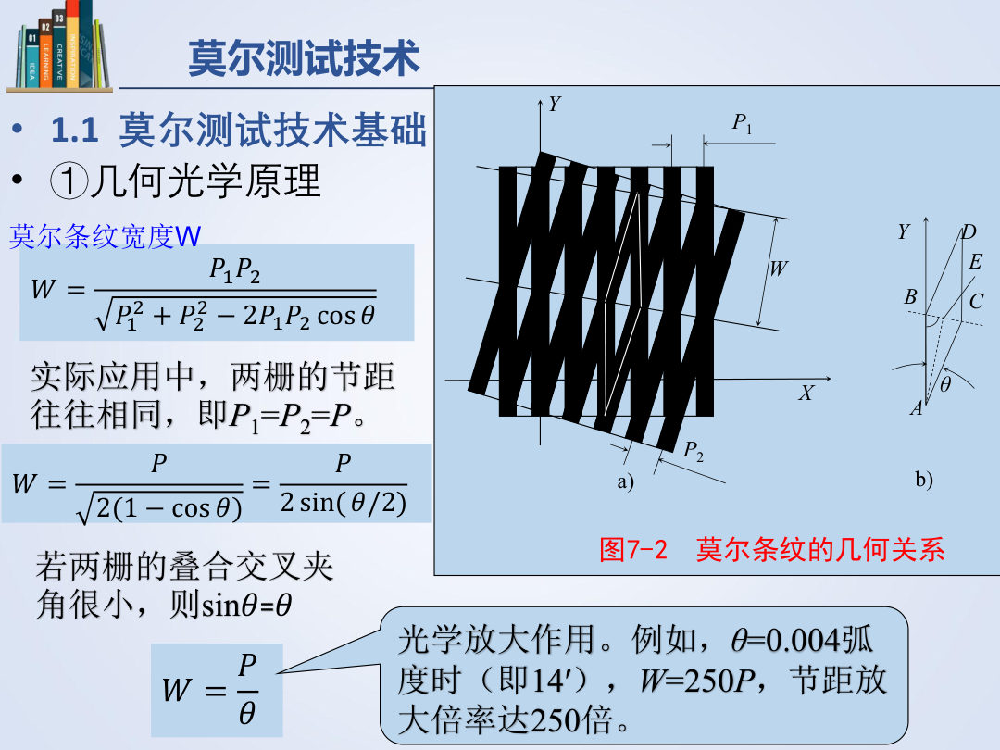

### 本页文字

```text
莫尔测试技术
                                            Y
•  1.1 莫尔测试技术基础                             P1
• ①几何光学原理

莫尔条纹宽度W                                                        Y   D
                                                                       E               𝑃1𝑃2                           W
 𝑊=                                                            B                                                                 C           2    2
         𝑃1 + 𝑃2 −2𝑃1𝑃2 cos 𝜃

 实际应用中，两栅的节距                                                                                      θ                                                          X
 往往相同，即P1=P2=P。                                       A
                                                                 P2        𝑃          𝑃
                                                                       a)                              b)𝑊=         =
                  2 sin( 𝜃/2)      2(1 −cos 𝜃)
                                  图7-2 莫尔条纹的几何关系
 若两栅的叠合交叉夹
 角很小，则sin𝜃=𝜃
               光学放大作用。例如，θ=0.004弧
           𝑃               度时（即14′），W=250P，节距放     𝑊=
            𝜃     大倍率达250倍。
```

## 第 15 页

**页面标题/首行：** 莫尔测试技术的发展与应用

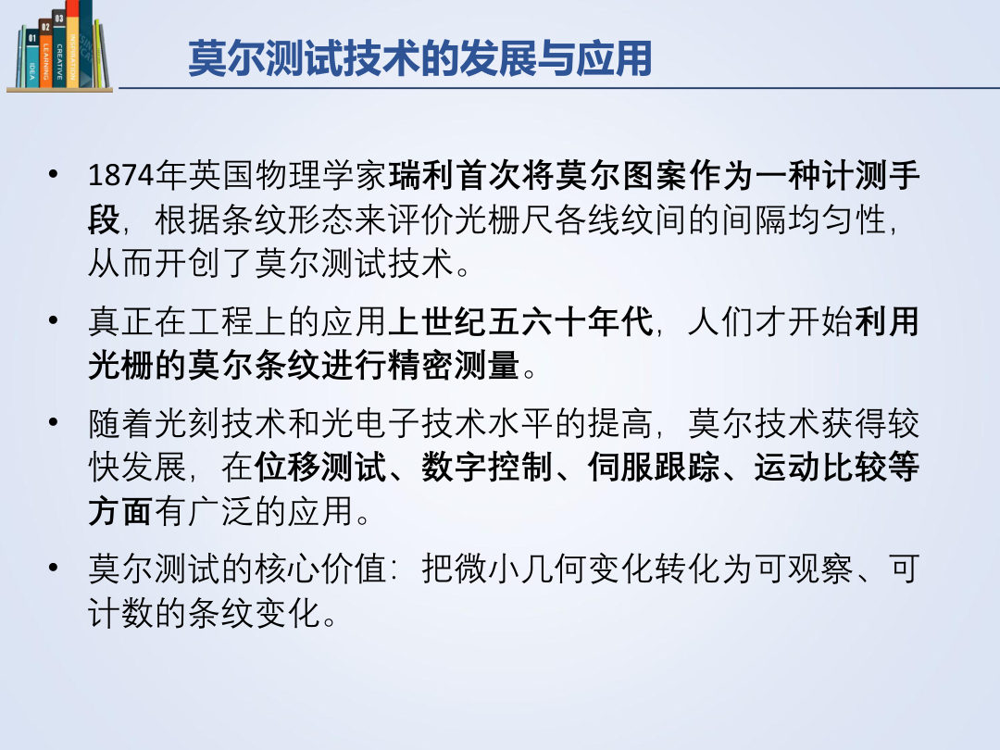

### 本页文字

```text
莫尔测试技术的发展与应用

• 1874年英国物理学家瑞利首次将莫尔图案作为一种计测手
 段，根据条纹形态来评价光栅尺各线纹间的间隔均匀性，
 从而开创了莫尔测试技术。

• 真正在工程上的应用上世纪五六十年代，人们才开始利用
 光栅的莫尔条纹进行精密测量。

• 随着光刻技术和光电子技术水平的提高，莫尔技术获得较
 快发展，在位移测试、数字控制、伺服跟踪、运动比较等
 方面有广泛的应用。

• 莫尔测试的核心价值：把微小几何变化转化为可观察、可
 计数的条纹变化。
```

## 第 16 页

**页面标题/首行：** 莫尔测试技术

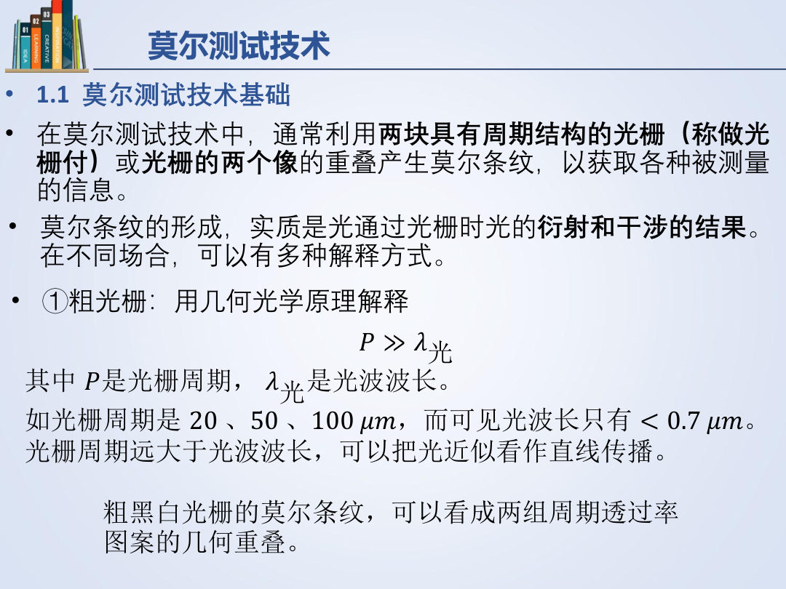

### 本页文字

```text
莫尔测试技术

•  1.1 莫尔测试技术基础
• 在莫尔测试技术中，通常利用两块具有周期结构的光栅（称做光
 栅付）或光栅的两个像的重叠产生莫尔条纹，以获取各种被测量
 的信息。
• 莫尔条纹的形成，实质是光通过光栅时光的衍射和干涉的结果。
 在不同场合，可以有多种解释方式。

 • ①粗光栅：用几何光学原理解释
               𝑃≫𝜆光
 其中 𝑃是光栅周期， 𝜆光是光波波长。
 如光栅周期是 20 、50 、100 𝜇𝑚，而可见光波长只有 < 0.7 𝜇𝑚。
 光栅周期远大于光波波长，可以把光近似看作直线传播。

    粗黑白光栅的莫尔条纹，可以看成两组周期透过率
    图案的几何重叠。
```

## 第 17 页

**页面标题/首行：** 莫尔测试技术

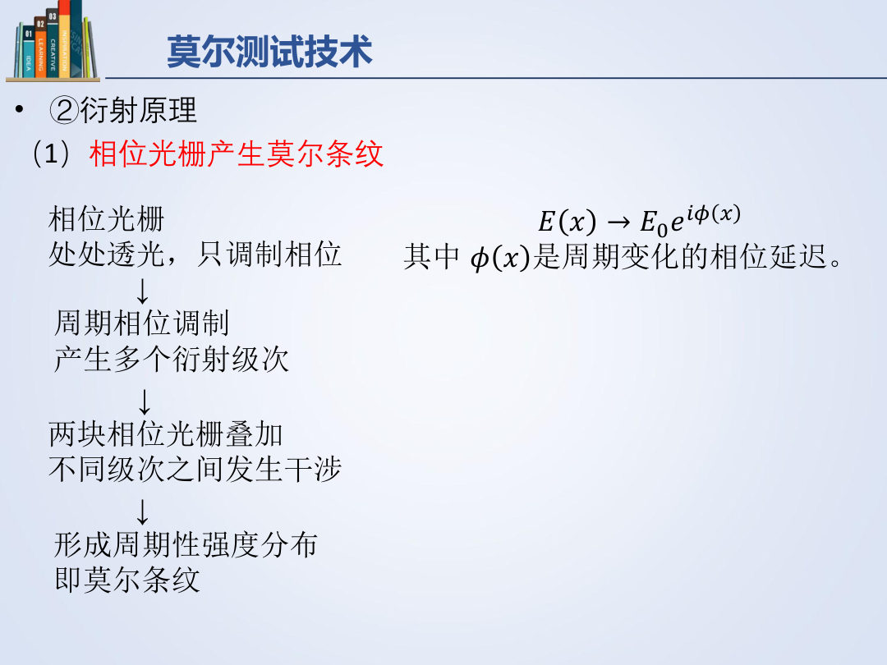

### 本页文字

```text
莫尔测试技术

• ②衍射原理
（1）相位光栅产生莫尔条纹

 相位光栅                 𝐸𝑥→𝐸0𝑒𝑖𝜙𝑥
 处处透光，只调制相位  其中 𝜙𝑥是周期变化的相位延迟。
        ↓
 周期相位调制
 产生多个衍射级次
        ↓
 两块相位光栅叠加
 不同级次之间发生干涉
        ↓
 形成周期性强度分布
 即莫尔条纹
```

## 第 18 页

**页面标题/首行：** 莫尔测试技术

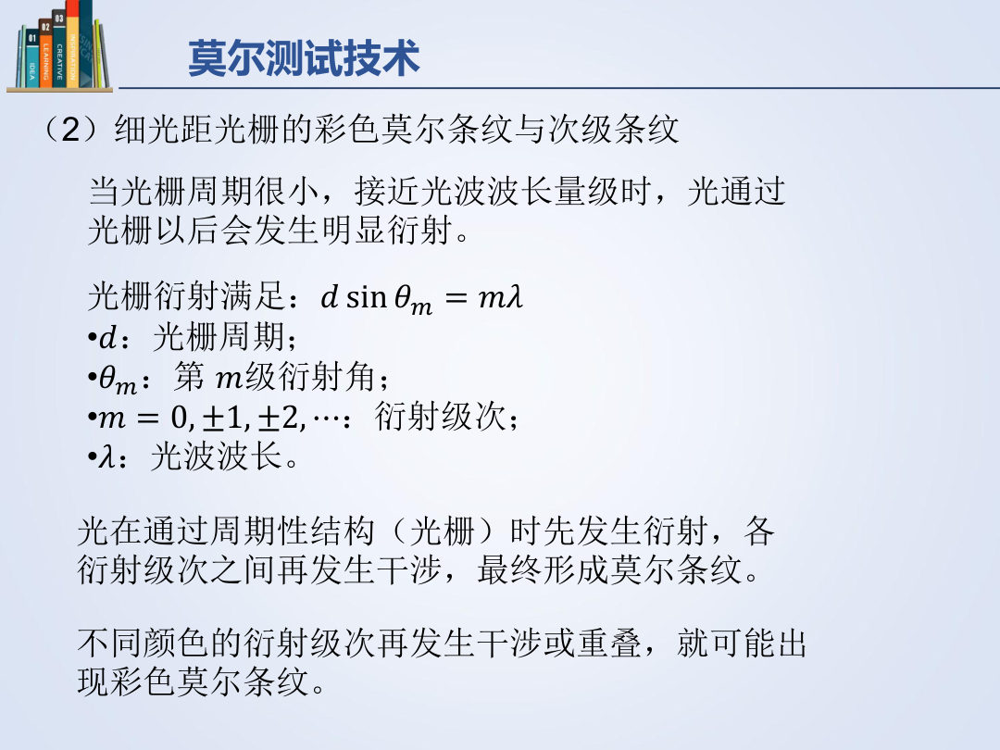

### 本页文字

```text
莫尔测试技术

（2）细光距光栅的彩色莫尔条纹与次级条纹

  当光栅周期很小，接近光波波长量级时，光通过
  光栅以后会发生明显衍射。

  光栅衍射满足：𝑑sin 𝜃𝑚= 𝑚𝜆
  •𝑑：光栅周期；
  •𝜃𝑚：第 𝑚级衍射角；
  •𝑚= 0, ±1, ±2, ⋯：衍射级次；
  •𝜆：光波波长。

 光在通过周期性结构（光栅）时先发生衍射，各
 衍射级次之间再发生干涉，最终形成莫尔条纹。

 不同颜色的衍射级次再发生干涉或重叠，就可能出
 现彩色莫尔条纹。
```

## 第 19 页

**页面标题/首行：** 莫尔测试技术

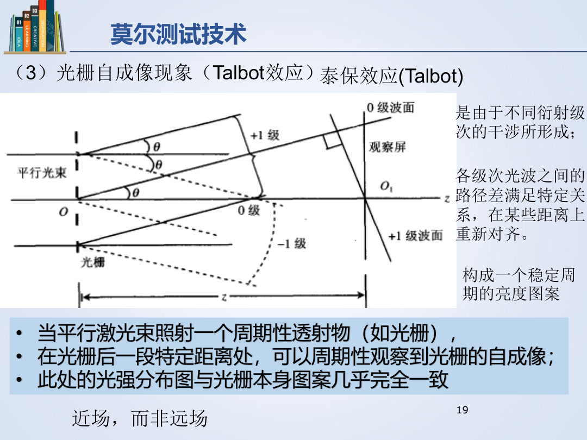

### 本页文字

```text
莫尔测试技术

（3）光栅自成像现象（Talbot效应）泰保效应(Talbot)

                           是由于不同衍射级
                           次的干涉所形成；

                           各级次光波之间的
                           路径差满足特定关
                           系，在某些距离上
                           重新对齐。

                            构成一个稳定周
                            期的亮度图案

 • 当平行激光束照射一个周期性透射物（如光栅），
 • 在光栅后一段特定距离处，可以周期性观察到光栅的自成像；
 • 此处的光强分布图与光栅本身图案几乎完全一致

                                                                        19
   近场，而非远场
```

## 第 20 页

**页面标题/首行：** 莫尔测试技术

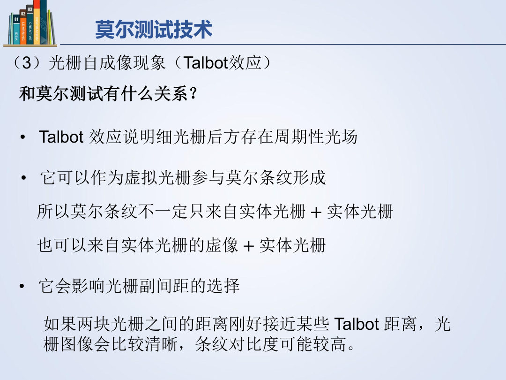

### 本页文字

```text
莫尔测试技术

（3）光栅自成像现象（Talbot效应）

 和莫尔测试有什么关系？

  •  Talbot 效应说明细光栅后方存在周期性光场

   • 它可以作为虚拟光栅参与莫尔条纹形成

  所以莫尔条纹不一定只来自实体光栅+ 实体光栅

  也可以来自实体光栅的虚像+ 实体光栅

  • 它会影响光栅副间距的选择

  如果两块光栅之间的距离刚好接近某些 Talbot 距离，光
  栅图像会比较清晰，条纹对比度可能较高。
```

## 第 21 页

**页面标题/首行：** 莫尔测试技术

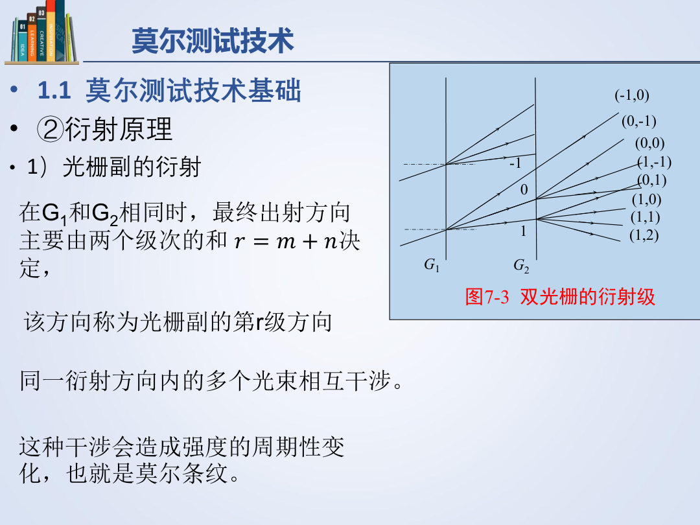

### 本页文字

```text
莫尔测试技术

•  1.1 莫尔测试技术基础                                                      (-1,0)
• ②衍射原理                                                                             (0,-1)                                                                                                         (0,0)
                                                                              -1                    (1,-1)• 1）光栅副的衍射
                                                                                                         (0,1)
                                                                  0
                                                                                                        (1,0)
                                                                                                        (1,1)在G1和G2相同时，最终出射方向
                                                                  1
主要由两个级次的和 𝑟= 𝑚+ 𝑛决                                             (1,2)
定，                                            G1         G2
                                        图7-3 双光栅的衍射级
 该方向称为光栅副的第r级方向

同一衍射方向内的多个光束相互干涉。

这种干涉会造成强度的周期性变
化，也就是莫尔条纹。
```

## 第 22 页

**页面标题/首行：** 莫尔测试技术

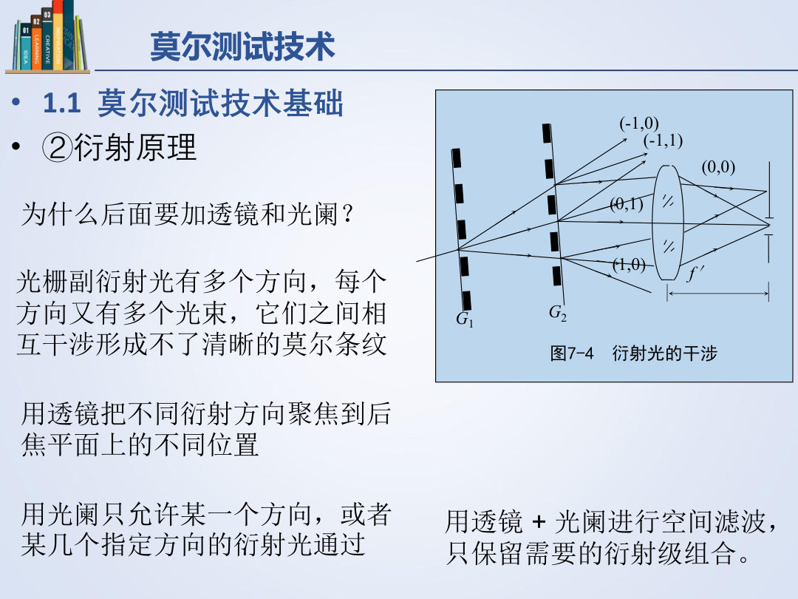

### 本页文字

```text
莫尔测试技术

•  1.1 莫尔测试技术基础
                                                                                            (-1,0)
• ②衍射原理                                                                   (-1,1)
                                                                                                      (0,0)

                                                                                        (0,1)
为什么后面要加透镜和光阑？

                                                                                         (1,0)                                                 f′光栅副衍射光有多个方向，每个
方向又有多个光束，它们之间相                 G2                                                G1
互干涉形成不了清晰的莫尔条纹                                                 图7-4 衍射光的干涉

用透镜把不同衍射方向聚焦到后
焦平面上的不同位置

用光阑只允许某一个方向，或者                用透镜 + 光阑进行空间滤波，
某几个指定方向的衍射光通过                只保留需要的衍射级组合。
```
